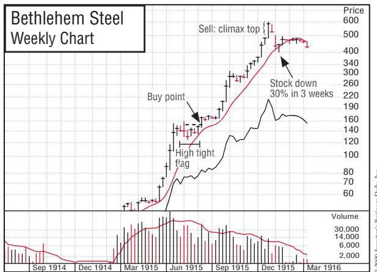
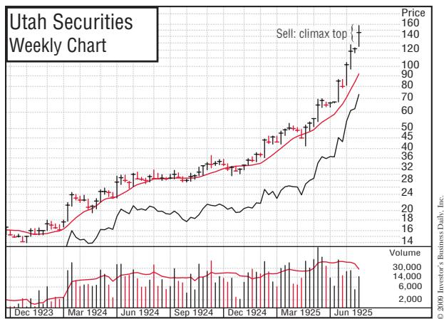
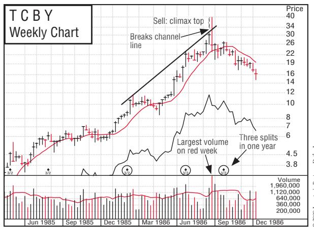
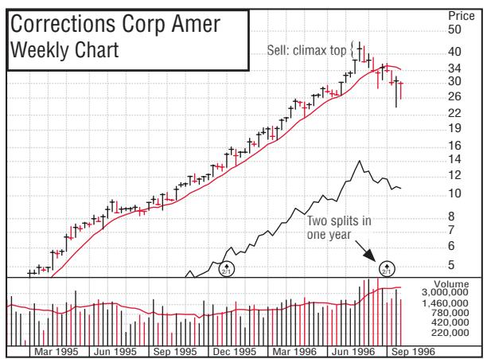
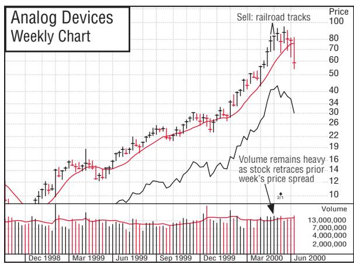
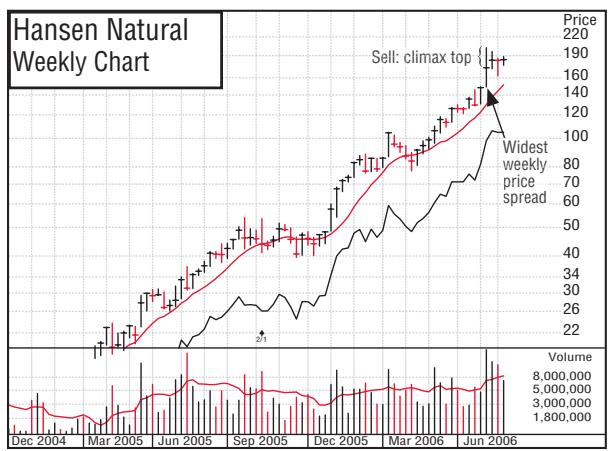
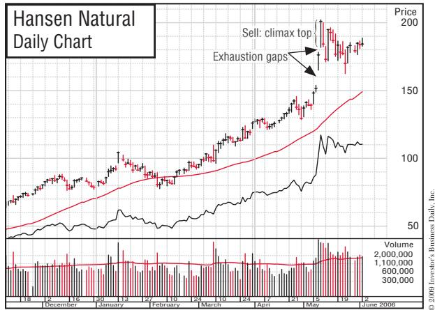

# Chapter11 When to Sell and Take Your Worthwhile Profits

> 第二部分 · Part 2

> **中文标题：** 何时卖出、锁定可观的利润

**中文翻译（导语）**

这是全书最关键的章节之一，涉及一个很少投资者能处理得当的重要主题。请务必格外仔细地研读。普通股与任何商品并无二致：作为商人，你必须卖出股票才能兑现利润，而卖出股票的最佳时机，是在它上涨途中、仍在走高、在他人眼中依旧强劲的时候。

这可能违背你的人性——因为它意味着要在股票强劲、已大涨、看似还能为你赚更多钱时卖出。但你若这么做，就不会陷入那些可能袭向市场龙头、给你的组合带来下行压力的、令人心碎的 20% 到 40% 回调。你永远卖不到绝对顶部，所以若股票在你卖出后继续走高，别怪自己。

不早卖，就会晚卖。目标是赚取并兑现可观的收益，而不是在涨势越强时变得兴奋、乐观、贪婪或情绪失控。记住那句老话："牛市赚钱，熊市赚钱，但猪会被宰。"

每个账户的基本目标，都应是取得净利润。要保住可观的利润，你就必须卖出、落袋为安。关键在于知道何时该这么做。

在股市中积累起巨额财富的金融家伯纳德·巴鲁克说过："我一次又一次在股票仍在上涨时将其卖出——这也正是我能守住财富的原因之一。很多时候，若继续持有，我本可以多赚不少，但股价崩塌时我也会一并被套。"

当被问及交易所里是否有赚钱的门道时，极为成功的国际银行家内森·罗斯柴尔德说："当然有。我从不买在底部，而且总是卖得太早。"

曾任华尔街投机客、也是前总统约翰·F·肯尼迪之父的乔·肯尼迪认为，"只有傻子才会死等最高价"。他说："目标是趁股票还在上涨、尚未有机会破位下跌时离场。"而极为成功的金融家杰拉尔德·M·洛布则强调："一旦价格涨入预估的正常或高估区间，随着报价走高，持仓就应稳步减少。"

这些华尔街传奇人物共同的信条是：你必须在形势尚好时离场。诀窍就在于，趁电梯上行时在某一层跳下来，而不是坐着它再回到楼下。

**英文原文（导语）**

This is one of the most vital chapters in this book, covering an essential subject few investors handle well. So study it very carefully. Common stock is just like any other merchandise. You, as the merchant, must sell your stock if you’re to realize a profit, and the best way to sell a stock is when it’s on the way up, while it’s still advancing and looking strong to everyone else.

This may be contrary to your human nature, because it means selling when your stock is strong, is up a lot in price, and looks like it could make even more profit for you. But if you do this, you won’t get caught in the heartrending 20% to 40% corrections that can hit market leaders and put downside pressure on your portfolio. You’ll never sell at the exact top, so don’t kick yourself if a stock goes still higher after you sell.

If you don’t sell early, you’ll be late. The object is to make and take significant gains and not get excited, optimistic, greedy, or emotionally carried away as your stock’s advance gets stronger. Keep in mind the old saying: “Bulls make money and bears make money, but pigs get slaughtered.”

The basic objective of every account should be to show a net profit. To retain worthwhile profits, you must sell and take them. The key is knowing when to do just that.

Bernard Baruch, the financier who built a fortune in the stock market, said, “Repeatedly, I have sold a stock while it was still rising—and that has been one reason why I have held on to my fortune. Many a time, I might have made a good deal more by holding a stock, but I would also have been caught in the fall when the price of the stock collapsed.”

When asked if there was a technique for making money on the stock exchange, Nathan Rothschild, the highly successful international banker, said, “There certainly is. I never buy at the bottom, and I always sell too soon.

Joe Kennedy, one-time Wall Street speculator and father of former President John F. Kennedy, believed “only a fool holds out for the top dollar.” “The object,” he said, “is to get out while a stock is up before it has a chance to break and turn down.” And Gerald M. Loeb, a highly successful financier, stressed “once the price has risen into estimated normal or overvaluation areas, the amount held should be reduced steadily as quotations advance.”

What all these Wall Street legends believed was this: you simply must get out while the getting is good. The secret is to hop off the elevator on one of the floors on the way up and not ride it back down again.

### You Must Develop a Profit-and-Loss Plan

想在股市大获成功，你既需要明确的规则，也需要一份损益计划。本书所述的许多买卖规则，都是我在 1960 年代初还是 Hayden, Stone 的年轻股票经纪人时制定的。这些规则帮我买下了纽约证券交易所的一个席位，并在此后不久创办了自己的公司。不过，起步时我只是集中精力去设计一套能找出最优质股票的买入规则；可如你将看到的，那时我只解开了半个谜题。

我的买入规则最早成形于 1960 年 1 月，当时我分析了前两年表现最好的三只共同基金。其中最惹眼的是当时规模尚小的 Dreyfus 基金，它的收益是许多竞争对手的两倍。

我写信索取了 Dreyfus 从 1957 到 1959 年的每一份季度报告和招募说明书。接着，我算出该基金每只新买入股票的平均成本；然后找来一册股票图表，用红笔标出 Dreyfus 每个季度新建仓位的平均买入价。

在查看了 Dreyfus 一百多笔新买入后，我发现了一个惊人的事实：每一只股票，都是在其过去一年所卖出的最高价位上买入的。换句话说，如果一只股票在 40 到 50 美元之间来回震荡了数月，Dreyfus 就会在它创出新高、于 50 到 51 美元之间成交时立刻买入。而这些股票在跃上新高之前，也都形成了某些图表价格形态。这给了我两条至关重要的线索：创新高时买入很重要，特定的图表形态则预示着巨大的利润潜力。

To be a big success in the stock market, you need definite rules and a profitand-loss plan. I developed many of the buy and sell rules described in this book in the early 1960s, when I was a young stockbroker with Hayden, Stone. These rules helped me buy a seat on the New York Stock Exchange and start my own firm shortly thereafter. When I started out, though, I concentrated on developing a set of buy rules that would locate the very best stocks. But as you’ll see, I had only half of the puzzle figured out.

My buy rules were first developed in January 1960, when I analyzed the three best-performing mutual funds of the prior two years. The standout was the then-small Dreyfus Fund, which racked up gains twice as large as those of many of its competitors.

I sent away for copies of every Dreyfus quarterly report and prospectus from 1957 to 1959. Then I calculated the average cost of each new stock the fund had purchased. Next, I got a book of stock charts and marked in red the average price Dreyfus had paid for its new holdings each quarter.

After looking at more than a hundred new Dreyfus purchases, I made a stunning discovery: every stock had been bought at the highest price it had sold for in the past year. In other words, if a stock had bounced between \$40 and \$50 for many months, Dreyfus bought it as soon as it made a new high in price and traded between \$50 and \$51. The stocks had also formed certain chart price patterns before leaping into new high ground. This gave me two vitally important clues: buying on new highs was important, and certain chart patterns spelled big profit potential.

## Jack Dreyfus Was a Chartist

> **中文标题：** 杰克·德雷福斯是个图表派

**中文翻译（导语）**

杰克·德雷福斯是个图表派，也是个看盘高手。他买入的每一只股票都依据市场行为，且只在价格脱离扎实的图表形态、创出新高时才出手。同时，他把那些无视市场行为（供求）这一现实、只凭基本面分析和个人意见行事的对手，统统打得落花流水。

在杰克早期业绩辉煌的那段日子里，他的研究部门由三个年轻的"生猛小伙"组成，他们每天把数百只上市股票的价量表现记录到超大号图表上。有一天，我到访 Dreyfus 位于纽约的总部时，见到了这些图表。

此后不久，波士顿 Fidelity 旗下的两只小基金也开始如法炮制，同样取得了优异成果——一只由小内德·约翰逊掌管，另一只由杰瑞·蔡掌管。Dreyfus 和 Fidelity 买入的股票，几乎都伴随着季度财报盈利的强劲增长。

于是，我在 1960 年订下的第一批买入规则如下：

1. 专注于每股售价 20 美元以上、且至少获得一定机构认可的上市股票。
2. 坚持要求：公司过去五年每股收益逐年增长，且当季盈利至少增长 20%。
3. 当股票经历扎实的回调与价格整理、创出或即将创出新高时买入。此次突破应伴随成交量放大到该股平均日成交量之上至少 50%。

在新规则下，我买入的第一只股票是 1960 年 2 月的 Universal Match。它在 16 周内翻倍，我却没能赚到多少钱，因为我手上可用于投资的钱太少。那时我刚当上股票经纪人，客户寥寥；加上心情紧张，卖得也太快。那年晚些时候，我依照明确的作战计划选出了宝洁、雷诺烟草和 MGM，它们同样走出了出色的行情，但我依然没赚多少，因为能投入的资金实在有限。

大约就在此时，我被哈佛商学院首期管理发展项目（PMD）录取。在哈佛那段少得可怜的空闲时间里，我在图书馆读了一些商业与投资书籍。其中最好的一本，是杰西·利弗莫尔所著的《如何在股票中交易》（How to Trade in Stocks）。我从这本书里学到的道理是：你在市场中的目标不是判断正确，而是在判断正确时赚到大钱。

**英文原文（导语）**

Jack Dreyfus was a chartist and a tape reader. He bought all his stocks based on market action, and only when the price broke to new highs off sound chart patterns. He was also beating the pants off every competitor who ignored the real-world facts of market behavior (supply and demand) and depended only on fundamental, analytical personal opinions.

Jack’s research department in those early, big-performance days consisted of three young Turks who posted the day’s price and volume action of hundreds of listed stocks to very oversized charts. I saw these charts one day when I visited Dreyfus’s headquarters in New York.

Shortly thereafter, two small funds run by Fidelity in Boston started doing the same thing. They, too, produced superior results. One was managed by Ned Johnson, Jr., and the other by Jerry Tsai. Almost all the stocks that the Dreyfus and Fidelity funds bought also had strong increases in their quarterly earnings reports.

So the first buy rules I made in 1960 were as follows:

1. Concentrate on listed stocks that sell for more than \$20 a share with at least some institutional acceptance.
2. Insist that the company show increases in earnings per share in each of the past five years and that the current quarterly earnings are up at least 20%.
3. Buy when the stock is making or about to make a new high in price after emerging from a sound correction and price consolidation period. This breakout should be accompanied by a volume increase to at least 50% above the stock’s average daily volume.

The first stock I bought under my new set of buy rules was Universal Match in February 1960. It doubled in 16 weeks, but I failed to make much money because I didn’t have much money to invest. I was just getting started as a stockbroker, and I didn’t have many customers. I also got nervous and sold it too quickly. Later that year, sticking with my well-defined game plan, I selected Procter & Gamble, Reynolds Tobacco, and MGM. They, too, made outstanding price moves, but I still didn’t make much money because the money I had to invest was limited.

About this time, I was accepted to Harvard Business School’s first Program for Management Development (PMD). In what little extra time I had at Harvard, I read a number of business and investment books in the library. The best was How to Trade in Stocks, by Jesse Livermore. From this book, I learned that your objective in the market was not to be right, but to make big money when you were right.

### Jesse Livermore and Pyramiding

读完他的书之后，我采用了利弗莫尔的金字塔加码法：在我买入后股票上涨时"向上加仓"。"向上加仓"指的是，在完成首次买入后，当股价上涨时再买入更多股份。这通常只在一种情况下才站得住脚：首次买入恰好落在正确的枢轴（买入）点，且价格已较原始买入价上涨 2% 或 3%。本质上，我会对已被验证有效的仓位追加买入，但每次追加的规模越来越小，从而在自己判断正确时把资金集中起来。而一旦我判断错误、股价跌破成本一定幅度，我就卖出，截断每一笔亏损。

这与大多数人的投资方式截然不同。他们大多向下摊平，也就是在股价下跌时加买股票，以摊低每股成本。可是，为什么要往那些不奏效的股票上追加更多辛苦钱呢？

After reading his book, I adopted Livermore’s method of pyramiding, or averaging up, when a stock advanced after I purchased it. “Averaging up” is a technique where, after your initial stock purchase, you buy additional shares of the stock when it moves up in price. This is usually warranted when the first purchase of a stock is made precisely at a correct pivot, or buy, point and the price has increased 2% or 3% from the original purchase price. Essentially, I followed up what was working with additional but always smaller purchases, allowing me to concentrate my buying when I seemed to be right. If I was wrong and the stock dropped a certain amount below my cost, I sold the stock to cut short every loss.

This is very different from how the majority of people invest. Most of them average down, meaning they buy additional shares as a stock declines in price in order to lower their cost per share. But why add more of your hard-earned money to stocks that aren’t working?

### Learning by Analysis of My Failures

1961 年上半年，我的规则和计划运作得非常好。那年我买入的一些顶尖赢家包括 Great Western Financial、Brunswick、Kerr-McGee、Crown Cork & Seal、AMF 和 Certain-teed。可到了夏天，一切都开始不妙。

我买对了股票、时机也精准，还做了几次金字塔加码，因而仓位和利润都很可观。可当这些股票最终见顶时，我却抱得太久，眼睁睁看着利润蒸发。如果你做投资有些年头了，我打赌你完全明白我在说什么。这是你必须攻克和解决的问题，否则就拿不到真正的成果。你一打盹，就输了。这实在难以咽下：我在选股上判断精准了一年多，结果却只是打了个平手。

我懊恼至极，于是花掉 1961 年的最后六个月，仔细复盘前一年我做过的每一笔交易。就像医生做尸检、民航委员会调查坠机事故那样，我拿红笔在图表上标出每一笔买卖决策做出的确切位置，再把大盘指数叠加其上。

最终，我的问题变得一目了然：我懂得如何选出最好的龙头股，却没有一套何时卖出、何时兑现利润的计划。我当时完全懵然无知，真是个糊涂蛋——无知到从未想过一只股票该在何时卖出、利润该在何时落袋。我的股票像溜溜球一样上上下下，账面利润被一扫而空。

例如，我对 Certain-teed 的处理就格外糟糕——这是一家制造装配式住宅的建筑材料公司。我以 20 美元出头的低位买入，却在市场疲软时被吓住，只赚了两三点就把它卖了。而 Certain-teed 后来涨到了三倍。我进场时机没错，却没看清自己握着的是什么，白白错失了一个惊人的机会。

我对 Certain-teed 及其他同类个人失误的分析，成了关键的转折点，让我看清自己一直在做错什么、若要走上通往未来成功的正轨就必须纠正什么。你可曾分析过自己的每一次失败，以便从中学习？很少有人这么做。如果你不认真审视自己，以及自己在股市中那些不奏效的决策，你将犯下多么可悲的错误。你唯有弄清自己错在哪里，才能变得更好。

这就是赢家与输家的分野，无论在市场还是在人生中。如果你在 2000 年或 2008 年的熊市中受了伤，别灰心、别放弃。把你的错误标在图表上，加以研究，并写下一些新的规则——只要照着做，就能纠正你的错误，让你避开那些耗费大量时间与金钱的行为。这样你就会离充分把握下一轮牛市更近一步。而在美国，未来还会有许多轮牛市。只要你没有认输退出、也没有像大多数政客那样开始怨天尤人，你就永远不算输家。若你照我这里的建议去做，它或许能改变你的一生。

"成功没有秘诀，"前国务卿科林·鲍威尔将军说，"它是准备、努力和从失败中学习的结果。" 

In the first half of 1961, my rules and plan worked great. Some of the top winners I bought that year were Great Western Financial, Brunswick, Kerr-McGee, Crown Cork & Seal, AMF, and Certain-teed. But by summer, all was not well.

I had bought the right stocks at exactly the right time and I had pyramided with several additional buys, so I had good positions and profits. But when the stocks finally topped, I held on too long and watched my profits vanish. If you’ve been investing for a while, I’ll bet you know exactly what I’m talking about. It’s a problem you must tackle and solve if you want real results. When you snooze, you lose. It was hard to swallow. I’d been dead right on my stock selections for more than a year, but I had just broken even.

I was so upset that I spent the last six months of 1961 carefully analyzing every transaction I had made during the prior year. Much like doctors do postmortem operations and the Civil Aeronautics Board conducts postcrash investigations, I took a red pen and marked on charts exactly where each buy and sell decision was made. Then I overlaid the general market averages.

Eventually my problem became crystal clear: I knew how to select the best leading stocks, but I had no plan for when to sell them and take profits. I had been completely clueless, a real dummy. I was so unaware that I had never even thought about when should a stock be sold and a profit taken. My stocks went up and then down like yo-yos, and my paper profits were wiped out.

For example, the way I handled Certain-teed, a building materials company that made shell homes, was especially poor. I bought the stock in the low \$20s, but during a weak moment in the market, I got scared and sold it for only a two- or three-point gain. Certain-teed went on to triple in price. I was in at the right time, but I didn’t recognize what I had and failed to capitalize on a phenomenal opportunity.

My analysis of Certain-teed and other such personal failures proved to be the critical key to my seeing what I had been doing wrong that I had to correct if I was to get on the right track to future success. Have you ever analyzed every one of your failures so you can learn from them? Few people do. What a tragic mistake you’ll make if you don’t look carefully at yourself and the decisions you’ve made in the stock market that did not work. You get better only when you learn what you’ve done wrong.

This is the difference between winners and losers, whether in the market or in life. If you got hurt in the 2000 or 2008 bear market, don’t get discouraged and quit. Plot out your mistakes on charts, study them, and write some additional new rules that, if you follow them, will correct your mistakes and let you avoid the actions that cost you a lot of time and money. You’ll be that much closer to fully capitalizing on the next bull market. And in America, there will be many future bull markets. You’re never a loser until you quit and give up or start blaming other people, like most politicians do. If you do what I’ve suggested here, it could just change your whole life.

“There are no secrets to success,” said General Colin Powell, former secretary of state. “It is the result of preparation, hard work, and learning from failure.”

### My Revised Profit-and-Loss Plan

分析的结果让我发现：成功的股票在脱离扎实的底部之后，往往会上涨 20% 到 25%；随后通常回落、构筑新的底部，有些还会重拾升势。带着这个新认知，我定下一条规则：每只股票都在枢轴买点精准买入，并严格自律，绝不在超出该点 5% 以上的位置加码或加仓；然后，等它上涨 20%、仍在走高时卖出。

不过以 Certain-teed 为例，这只股票仅仅两周就涨了 20%。这正是我下次想找到并把握的那种超级赢家。于是，我对"+20% 卖出规则"设了一个至关重要的例外：如果一只股票强到能在一、二或三周内就飙升 20%，那就必须至少持有八周；之后再分析是否该继续持有，以博取可能的六个月长期资本利得（六个月是当时的长期资本利得期限）。反之，若股票跌破买入价 8%，我就卖出认亏。

于是，修订后的损益计划是：有 20% 利润就落袋为安（最强势的股票除外），并把亏损限制在买入价下方最多 8%。

这套计划有几点显著优势。你哪怕错两次、对一次，也不会陷入财务困境。而当你判断正确、想在更高几点处对同一只股票追加一笔稍小的买入时，你常常会被迫卖出一只表现落后或最弱的持仓——那些落后仓位里的资金，就这样被持续"强制加仓"到你最强的品种上。

多年下来，我几乎总是这样：初始买入一经上涨 2% 或 2.5%，就自动做第一次跟进买入。这降低了我可能犹豫不决、拖到股票涨了 5% 到 10% 才追加的风险。

当你看起来判断正确时，就应始终跟进。拳击手在拳台上好不容易露出破绽、打出一记重拳，就必须乘胜追击……如果他想赢的话。

通过卖出落后者、把资金转投赢家，你的钱就能用在效率高得多的地方。在行情好的一年里，你可以做两三次 20% 的操作，而不必苦苦熬过那么多次漫长而毫无产出的回调、干等一只股票构筑全新的底部。

三到六个月内赚到 20%，比花上一年才赚到 20% 效率高得多。一年内两次 20% 收益复利滚动，相当于 44% 的年回报率。等你经验更丰富，还可以用足融资（保证金账户中的购买力），把复利回报推到接近 100%。

As a result of my analysis, I discovered that successful stocks, after breaking out of a proper base, tend to move up 20% to 25%. Then they usually decline, build new bases, and in some cases resume their advances. With this new knowledge in mind, I made a rule that I’d buy each stock exactly at the pivot buy point and have the discipline not to pyramid or add to my position at more than 5% past that point. Then I’d sell each stock when it was up 20%, while it was still advancing.

In the case of Certain-teed, however, the stock ran up 20% in just two weeks. This was the type of super winner I was hoping to find and capitalize on the next time around. So, I made an absolutely important exception to the “sell at +20% rule”: if the stock was so powerful that it vaulted 20% in only one, two, or three weeks, it had to be held for at least eight weeks. Then it would be analyzed to see if it should be held for a possible sixmonth long-term capital gain. (Six months was the long-term capital gains period at that time.) If a stock fell below its purchase price by 8%, I would sell it and take the loss.

So, here was the revised profit-and-loss plan: take 20% profits when you have them (except with the most powerful of all stocks) and cut your losses at a maximum of 8% below your purchase price.

The plan had several big advantages. You could be wrong twice and right once and still not get into financial trouble. When you were right and you wanted to follow up with another, somewhat smaller buy in the same stock a few points higher, you were frequently forced into a decision to sell one of your more laggard or weakest performers. The money in your slower-performing stock positions was continually force-fed into your best performers.

Over a period of years, I came to almost always make my first follow-up purchase automatically as soon as my initial buy was up 2% or 2½% in price. This lessened the chance that I might hesitate and wind up making the additional buy when the stock was up 5% to 10%.

When you appear to be right, you should always follow up. When a boxer in the ring finally has an opening and lands a powerful punch, he must always follow up his advantage . . . if he wants to win.

By selling your laggards and putting the proceeds into your winners, you are putting your money to far more efficient use. You could make two or three 20% plays in a good year, and you wouldn’t have to sit through so many long, unproductive corrections while a stock built a whole new base.

A 20% gain in three to six months is substantially more productive than a 20% gain that takes 12 months to achieve. Two 20% gains compounded in one year equals a 44% annual rate of return. When you’re more experienced, you can use full margin (buying power in a margin account), and increase your compounded return to nearly 100%.

### How I Discovered the General Market System

在逐一分析自己那些因无知而亏钱的错误时，我还得出另一个极其赚钱的观察：我那些见顶的市场龙头股，之所以见顶，大多是因为大盘开始了一轮 10% 或更大幅度的下跌。这一结论最终引导我发现并发展出一套方法，用来解读每日大盘平均指数的价格与成交量图表。它赋予我们一项关键能力：判明整体市场的真实趋势与重大转向。

三个月后，到 1962 年 4 月 1 日，遵循我的全部卖出规则，已自动把我清出了每一只股票。我手握 100% 现金，对那年春天市场即将迎来真正的崩盘一无所知。有趣之处正在于此：规则会逼你离场，你却不知道情况究竟会坏到什么地步。你只知道它在下跌、而你已离场——这迟早会对你价值连城。2008 年便是如此：我们的规则逼我们离场，而我们完全不知道市场正走向一次重大崩塌。大多数机构投资者都深受其害，因为他们的投资方针就是满仓（95% 到 100%）。

1962 年初，我读完了埃德温·勒菲弗的《股票作手回忆录》。勒菲弗在书中详述的 1907 年股市恐慌，与 1962 年 4 月似乎正在发生的情形，二者之间的相似令我深受触动。由于我手握 100% 现金，而我的每日道指分析显示当时市场疲软，我便开始做空 Certain-teed 和 Alside（后者是早先跟随 Certain-teed 的"同情股"）等股票。为此，我惹上了 Hayden, Stone 华尔街总部的麻烦——公司刚刚把 Certain-teed 列为买入推荐，我却到处告诉别人它是卖空对象。那年晚些时候，我又在 40 美元以上做空 Korvette。这两笔卖空都获利颇丰。

到 1962 年 10 月古巴导弹危机期间，我再次持现。苏联从肯尼迪总统明智的海上封锁中退让之后一两天，道琼斯工业平均指数出现了一次成功跟进的反弹尝试，按我的新系统判断，这标志着一次重大转折。于是我买入新牛市的第一只股票——Chrysler，价格 58⅝。它有一个经典的杯柄形态。

整个 1963 年，我不过是一丝不苟地遵守规则。它们效果奇佳，那年我管理的"最差"账户也上涨了 115%——那还是个现金账户；其余使用融资的账户则上涨了百分之几百。个股亏损不少，但通常都很小，平均 5% 到 6%；而利润相当惊人，因为我们在判断正确时，靠审慎、有纪律的金字塔加码，建立起集中的仓位。

靠着薪水里攒下的区区 4000 或 5000 美元，加上一些借款和足额融资，我连做三个大赢家：1962 年底做空 Korvette，做多 Chrysler，以及 1963 年 6 月用 Chrysler 的利润以每股 100 美元买入 Syntex。八周后 Syntex 上涨 40%，我决定把这只强势股继续持有六个月。到 1963 年秋天，利润已超过 20 万美元，我便决定买下纽约证券交易所的席位。所以，永远别让任何人告诉你这做不到！只要你愿意研究自己的所有错误、从中学习，并写下新的自我纠正规则，你就能学会明智地投资。只要你有决心、不轻易气馁、肯下功夫并做足准备，这可能是你一生中最大的机遇。任何人都能让它成真。

对我而言，是许多个夜晚的苦读，换来了精确的规则、纪律和最终奏效的计划。这与运气无关，靠的是坚持与勤奋。你不可能指望每晚看电视、喝啤酒、和朋友聚会，还能解开像股市或美国经济这般复杂问题的答案。

在美国，任何人只要肯努力，就能做成任何事。没有人给你设限。一切都取决于你的渴望与态度。你来自哪里、长相如何、在哪上学，都无关紧要。你可以改善自己的生活和未来，去抓住美国梦，而且起步并不需要很多钱。

如果你有时感到气馁，请永远不要放弃。回过头去，再多下一些细致的功夫。正是你在周一到周五、朝九晚五之外投入的学习与钻研时间，最终决定了你是赢得并达成目标，还是错失那些真能改变你一生的绝佳机遇。

Another exceedingly profitable observation I made from analyzing every one of my money-losing, out-of-ignorance mistakes was that most of my market-leading stocks that topped had done so because the general market started into a decline of 10% or more. This conclusion finally led to my discovering and developing our system of interpreting the daily general market averages’ price and volume chart. It gave us the critical ability to establish the true trend and major changes of direction in the overall market.

Three months later, by April 1, 1962, following all of my selling rules had automatically forced me out of every stock. I was 100% in cash, with no idea the market was headed for a real crash that spring. This is the fascinating thing: the rules will force you out, but you don’t know how bad it can really get. You just know it’s going down and you’re out, which sooner or later will be worth its weight in gold to you. That’s what happened in 2008. Our rules forced us out, and we had no idea the market was headed for a major breakdown. Most institutional investors were affected because their investment policy was to be fully invested (95% to 100%).

In early 1962, I had finished reading Reminiscences of a Stock Operator, by Edwin LeFevre. I was struck by the parallels between the stock market panic of 1907, which LeFevre discussed in detail, and what seemed to be happening in April 1962. Since I was 100% in cash and my daily Dow analysis said the market was weak at that point, I began to sell short stocks such as Certain-teed and Alside (an earlier sympathy play to Certain-teed). For this, I got into trouble with Hayden, Stone’s home office on Wall Street. The firm had just recommended Certain-teed as a buy, and here I was going around telling everyone it was a short sale. Later in the year, I sold Korvette short at over \$40. The profits from both of these short sales were good.

By October 1962, during the Cuban missile crisis, I was again in cash. A day or two after the Soviet Union backed down from President Kennedy’s wise naval blockade, a rally attempt in the Dow Jones Industrial Average followed through, signaling a major upturn according to my new system. I then bought the first stock of the new bull market, Chrysler, at 58⅝. It had a classic cup-with-handle base.

Throughout 1963, I simply followed my rules to the letter. They worked so well that the “worst”-performing account I managed that year was up 115%. It was a cash account. Other accounts that used margin were up several hundred percent. There were many individual stock losses, but they were usually small, averaging 5% to 6%. Profits, on the other hand, were awesome because of the concentrated positions we built by careful, disciplined pyramiding when we were right.

Starting with only \$4,000 or \$5,000 that I had saved from my salary, plus some borrowed money and the use of full margin, I had three back-to-back big winners: Korvette on the short side in late 1962, Chrysler on the buy side, and Syntex, which was bought at \$100 per share with the Chrysler profit in June 1963. After eight weeks, Syntex was up 40%, and I decided to play this powerful stock out for six months. By the fall of 1963, the profit had topped \$200,000, and I decided to buy a seat on the New York Stock Exchange. So don’t ever let anyone tell you it can’t be done! You can learn to invest wisely as long as you’re willing to study all of your mistakes, learn from them, and write new self-correcting rules. This can be the greatest opportunity of a lifetime, if you are determined, not easily discouraged, and willing to work hard and prepare yourself. Anyone can make it happen.

For me, many long evenings of study led to precise rules, disciplines, and a plan that finally worked. Luck had nothing to do with it; it was persistence and hard work. You can’t expect to watch television, drink beer, or party with your friends every night and still find the answers to something as complicated as the stock market or the U.S. economy.

In America, anyone can do anything by working at it. There are no limits placed on you. It all depends on your desire and your attitude. It makes no difference where you’re from, what you look like, or where you went to school. You can improve your life and your future and capture the American Dream. And you don’t have to have a lot of money to start.

If you get discouraged at times, don’t ever give up. Go back and put in some detailed extra effort. It’s always the study and learning time that you put in after nine to five, Monday through Friday, that ultimately makes the difference between winning and reaching your goals, and missing out on truly great opportunities that really can change your whole life.

### Two Things to Remember about Selling

在我们逐一检视关键卖出规则之前，请先记住这两个要点。

第一，买得精准，就能解决你大部分的卖出难题。若你一开始就在正确时机、于扎实的日线或周线图表底部买入，且不在股价超出正确枢轴买点 5% 以上时追高或加码，你就能稳坐度过大多数正常回调。赢家股极少会从正确的枢轴买点下跌 8%；事实上，大多数大赢家根本不会收在枢轴点之下。因此，尽可能贴近枢轴点买入绝对必要，这样你甚至能在不到 8% 时就砍掉少数需要止损的亏损——有时一只股票只需跌 4% 或 5%，你便知道可能出了问题。

第二，在牛市中买入一只股票后，要提防你或许会在报价纸带或电脑上看到的巨额抛单。这些抛售可能是情绪化的、盲目的、暂时的，也可能相对于过去的成交量而言并没有看上去那么大。最好的股票也会经历几天或一周的急跌。这时候去看周线图以把握全局，以免在一次可能只是正常回撤的走势中被吓出局、震出局。事实上，赢家股有 40% 到 60% 的概率会回调到精确买点或略低于买点的位置，试图把你震出去；但除非你当初追得太高，它本不该下跌 8%。如果你错误频出、似乎怎么做都不灵，就检查一下，确认你没有把许多买入价定在精确正确买点之上 10%、15% 或 20% 的位置。追高很少奏效。你不能因为越来越兴奋就买入。

Before we examine the key selling rules one by one, keep these two key points in mind.

First, buying precisely right solves most of your selling problems. If you buy at exactly the right time off a proper daily or weekly chart base in the first place, and you do not chase or pyramid a stock when it’s extended in price more than 5% past a correct pivot buy point, you will be in a position to sit through most normal corrections. Winning stocks very rarely drop 8% below a correct pivot buy point. In fact, most big winners don’t close below their pivot point. Buying as close to the pivot point as possible is therefore absolutely essential and may let you cut the smaller number of resulting losses more quickly than 8%. A stock might have to drop only 4% or 5% before you know something could be wrong.

Second, beware of the big-block selling you might see on a ticker tape or your PC just after you buy a stock during a bull market. The selling might be emotional, uninformed, temporary, or not as large (relative to past volume) as it appears. The best stocks can have sharp sell-offs for a few days or a week. Consult a weekly basis stock chart for an overall perspective to avoid getting scared or shaken out in what may just be a normal pullback. In fact, 40% to 60% of the time, a winning stock may pull back to its exact buy point or slightly below and try to shake you out. But it should not be down 8% unless you chased it too high in price when you bought it. If you’re making too many mistakes and nothing seems to be working for you, check and make sure you’re not making a number of your buys 10%, 15%, or 20% above the precise, correct buy point. Chasing stocks rarely works. You can’t buy when you get more excited.

### Technical Sell Signs

通过研究史上最伟大的股市赢家以及市场本身是如何见顶的，我归纳出下面这份清单，列出股票见顶反转时出现的种种因素。你或许已经注意到，这些卖出规则很少涉及公司基本面的变化。许多大投资者在问题出现在利润表上之前就已抽身离场。既然聪明钱在卖，你也该卖。当机构开始抛售大额头寸时，个人投资者几乎没有胜算。你买入时高度看重盈利、销售、利润率、股东权益回报率、新产品等基本面因素，可许多股票恰恰在盈利大涨 100%、分析师预期继续增长并上调目标价之时见顶。

1999 年那一天，我趁一次冲顶式暴涨和衰竭缺口卖出了 Charles Schwab 的股票；而就在同一天，美国最大的经纪公司之一还预计该股会再涨 50 点。我几乎所有成功的股票，都是在上涨途中、仍在走高、且大盘未受波及之时卖出的。手中的一只鸟，胜过林中两只想象中的鸟。因此，你必须经常依据不寻常的市场行为（价格与成交量变动）来卖出，而不是华尔街的个人意见。你必须戒掉听信个人意见的习惯。正因为我从未在华尔街工作过，才从未被这些干扰分心。

当你试图辨认一只股票是否进入见顶过程时，有许多信号可供观察，包括冲顶前后的价格运动、不利的成交量以及其他弱势表现。随着你持续研究这些信息并把它运用到日常决策中，其中很多会对你越来越清晰。这些规则与原则成就了我大多数较出色的市场决策，但它们起初可能显得有点复杂。我建议你先重读第 2 章关于看图的内容，再回头读这些卖出规则。

事实上，我在这几百场研讨会上遇到的、真正靠投资获得成功的 IBD 订户都告诉我，他们把整本书读了两三遍甚至更多。你多半无法一次就读透。一些曾被外界噪音分散注意力的人说，他们会定期重读，以帮助自己重回正轨。

By studying how the greatest stock market winners, as well as the market itself, all topped, I came up with the following list of factors that occur when a stock tops and rolls over. Perhaps you’ve noticed that few of the selling rules involve changes in the fundamentals of a stock. Many big investors get out of a stock before trouble appears on the income statement. If the smart money is selling, so should you. Individual investors don’t stand much chance when institutions begin liquidating large positions. You buy with heavy emphasis on the fundamentals, such as earnings, sales, profit margins, return on equity, and new products, but many stocks peak when earnings are up 100% and analysts are projecting continued growth and higher price targets.

On the same day in 1999 that I sold Charles Schwab stock on a climax top run-up and an exhaustion gap, one of the largest brokerage firms in America projected that the stock would go up 50 points more. Virtually all of my successful stocks were sold on the way up, while they were advancing and the market was not affected. A bird in the hand is worth two imaginary ones in the bush. Therefore, you must frequently sell based on unusual market action (price and volume movement), not personal opinions from Wall Street. You must wean yourself from listening to personal opinions. Since I never worked on Wall Street, I never got distracted by these diversions.

There are many signals to look for when you’re trying to recognize when a stock could be in a topping process. These include the price movement surrounding climax tops, adverse volume, and other weak action. A lot of this will become clearer to you as you continue to study this information and apply it to your daily decision making. These rules and principles have been responsible for most of my better decisions in the market, but they can seem a bit complicated at first. I suggest that you reread Chapter 2 on chart reading, then read these selling rules again.

In fact, most of the IBD subscribers I’ve met at our hundreds of workshops who have enjoyed real success with their investments have told me that they read this entire book two or three times, or even more. You probably aren’t going to get it all in one reading. Some who have been distracted by all the outside noise say that they read it periodically to help them get back on the right track.

### Climax Tops

许多龙头股以爆发式的方式见顶。它们会走出冲顶式行情——在持续数月的上涨之后，突然在一两周内以快得多的速度猛冲；此外，它们常以衰竭缺口收场——股价相对前一日收盘跳空高开，并伴随巨量成交。这些以及相关的牛市冲顶信号，下文将逐一详述。

1. 单日最大涨幅。如果一只股票的涨幅已经很大——即它自扎实而正确的底部买点起已连续上涨数月——并且当日收盘涨幅超过了整个上涨过程开始以来的任何一次单日上涨，那就要当心了！这通常出现在非常接近股价顶部的位置。
2. 单日最大成交量。终极顶部可能出现在本轮上涨开始以来成交量最大的那一天。
3. 衰竭缺口。如果一只快速上涨的股票已大幅远离数月前的原始底部（通常指已脱离第一或第二阶段底部至少 18 周，后期阶段底部则至少 12 周），随后又相对前一日收盘跳空高开，那么上涨就已接近顶部。例如，长期上涨后出现两点的跳空缺口：股票当日收在 50 美元高点，次日早盘在 52 美元开盘，且当天始终守在 52 美元之上——这就叫衰竭缺口。
4. 冲顶活动。如果一只股票的上涨变得异常亢奋，在周线图上连续两三周快速上涨，或在日线图上八天中涨七天、十天中涨八天，就应卖出。这称为冲顶。该股票当周从低点到高点的价格区间，几乎总会大于数月前原始上涨开始以来的任何一周。

在少数情况下，临近冲顶行情的顶部，一只股票可能回吐前一周从低点到高点的大区间，最终当周小幅收高，而成交量依然极大。我称其为"铁轨"，因为在周线图上你会看到两条平行的竖线——这是持续巨量派发、而当周并无实际价格进展的信号。

1. 派发迹象。长期上涨之后，成交量巨大却无进一步的价格上行，便是派发信号。趁毫无戒心的买家被淹没之前卖出你的股票。同时也要知道精明的投资者何时该确认长期资本利得。
2. 股票分拆。若一只股票在宣布分拆后一两周内上涨 25% 到 50%，就应卖出；极少数情况下（如 1999 年底的 Qualcomm）甚至可能涨 100%。股票往往在过度分拆附近见顶。如果一只股票价格已远离底部、又宣布了分拆，很多情况下都可以卖出。
3. 连续下跌天数增加。对大多数股票而言，当股价从顶部开始回落时，相对上涨日而言的连续下跌天数会增多。你可能会看到连跌四五天、接着涨两三天；而在此之前，你看到的是连涨四天、然后跌两三天。
4. 上通道线。若一只股票在暴涨之后冲出其上部通道线，就应卖出。（在股票图表上，通道线是这样两条大致平行的线：一条连接价格形态的各低点，另一条连接过去四五个月中形成的三个高点。）研究表明，冲出正确绘制的上通道线的股票应当卖出。
5. 200 日移动平均线。有些股票在高于其 200 日移动平均价格线 70% 到 100% 或更多时可以卖出，不过这一条我很少用到。
6. 从顶部回落途中卖出。如果你没能在股票仍在上涨时及早卖出，那就在它从峰值下跌的途中卖出。首次破位之后，有些股票可能会反弹一次。

Many leading stocks top in an explosive fashion. They make climax runs— suddenly advancing at a much faster rate for one or two weeks after an advance of many months. In addition, they often end in exhaustion gaps— when a stock’s price opens up on a gap from the prior day’s close, on heavy volume. These and related bull market climax signals are discussed in detail here.

1. Largest daily price run-up. If a stock’s price is extended—that is, if it’s had a significant run-up for many months from its buy point off a sound and proper base—and it closes for the day with a larger price increase than on any previous up day since the beginning of the whole move up, watch out! This usually occurs very close to a stock’s peak.
2. Heaviest daily volume. The ultimate top might occur on the heaviest volume day since the beginning of the advance.
3. Exhaustion gap. If a stock that’s been advancing rapidly is greatly extended from its original base many months ago (usually at least 18 weeks out of a first- or second-stage base and 12 weeks or more if it’s out of a later-stage base) and then opens on a gap up in price from the previous day’s close, the advance is near its peak. For example, a twopoint gap in a stock’s price after a long run-up would occur if it closed at its high of \$50 for the day, then opened the next morning at \$52 and held above \$52 during the day. This is called an exhaustion gap.
4. Climax top activity. Sell if a stock’s advance gets so active that it has a rapid price run-up for two or three weeks on a weekly chart, or for seven of eight days in a row or eight of ten days on a daily chart. This is called a climax top. The price spread from the stock’s low to its high for the week will almost always be greater than that for any prior week since the beginning of the original move many months ago.

In a few cases, around the top of a climax run, a stock may retrace the prior week’s large price spread from the prior week’s low to its high point and close the week up a little, with volume remaining very high. I call this “railroad tracks” because on a weekly chart, you’ll see two parallel vertical lines. This is a sign of continued heavy volume distribution without real additional price progress for the week.

1. Signs of distribution. After a long advance, heavy daily volume without further upside price progress signals distribution. Sell your stock before unsuspecting buyers are overwhelmed. Also know when savvy investors are due to have a long-term capital gain.
2. Stock splits. Sell if a stock runs up 25% to 50% for one or two weeks on a stock split. In a few rare cases, such as Qualcomm at the end of 1999, it could be 100%. Stocks tend to top around excessive stock splits. If a stock’s price is extended from its base and a stock split is announced, in many cases the stock could be sold.
3. Increase in consecutive down days. For most stocks, the number of consecutive down days in price relative to up days in price will probably increase when the stock starts down from its top. You may see four or five days down, followed by two or three days up, whereas before you would have seen four days up and then two or three down.
4. Upper channel line. You should sell if a stock goes through its upper channel line after a huge run-up. (On a stock chart, channel lines are somewhat parallel lines drawn by connecting the lows of the price pattern with one straight line and then connecting three high points made over the past four to five months with another straight line.) Studies show that stocks that surge above their properly drawn upper channel lines should be sold.
5. 200-day moving average line. Some stocks may be sold when they are 70% to 100% or more above their 200-day moving average price line, although I have rarely used this one.
6. Selling on the way down from the top. If you didn’t sell early while the stock was still advancing, sell on the way down from the peak. After the first breakdown, some stocks may pull back up in price once.

### Low Volume and Other Weak Action

1. 低量创新高。有些股票会在成交量偏低、萎缩的情况下创出新高。随着股价走高，成交量反而下滑，说明大投资者已对这只股票失去兴趣。
2. 收于或接近当日最低价。顶部也能在股票的日线图上以向下"箭头"的形态显现：连续数日，股票都收在当日价格区间的低端或附近，把当天的涨幅尽数回吐。
3. 第三或第四阶段底部。当你的股票从第三或第四阶段底部创出价格新高时，就应卖出。在市场中，第三次很少灵验——到那时，这只上涨的股票已太过醒目，几乎人人都看得见。这些后期形态的底部往往有缺陷，显得更宽、更松散。多达 80% 的第四阶段底部注定失败，但你必须判断准确，确认这确实是第四阶段底部。
4. 疲软反弹的迹象。当你在顶部附近看到最初的巨量抛售后，下一次回升往往成交量更弱、价格反弹更差，或持续天数更少。在疲软反弹的第二三天卖出——在趋势线和支撑区被跌破之前，这可能是最后的卖出良机。
5. 从峰值回落。一只股票从峰值下跌约 8% 后，有时仔细审视此前的上涨、顶部和下跌过程，可以帮你判断行情是已经结束，还是正在经历一次正常的 8% 到 15% 回调。若从峰值的跌幅超过 12% 或 15%，你或许偶尔应该卖出。
6. 相对强度疲软。相对价格强度走弱，也是卖出的另一个理由。当一只股票的 IBD 相对价格强度评级跌破 70 时，可考虑卖出。
7. 独行侠。若同一行业板块中没有任何其他重要成员印证价格强度，就应考虑卖出。

1. New highs on low volume. Some stocks will make new highs on lower or poor volume. As the stock goes higher, volume trends lower, suggesting that big investors have lost their appetite for the stock.
2. Closing at or near the day’s price low. Tops can also be seen on a stock’s daily chart in the form of “arrows” pointing down. That is, for several days, the stock will close at or near the low of the daily price range, fully retracing the day’s advance.
3. Third- or fourth-stage bases. Sell when your stock makes a new high in price off a third- or fourth-stage base. The third time is seldom a charm in the market. By then, an advancing stock has become too obvious, and almost everyone sees it. These late-stage base patterns are often faulty, appearing wider and looser. As much as 80% of fourth-stage bases should fail, but you have to be right in determining that this is a fourthstage base.
4. Signs of a poor rally. When you see initial heavy selling near the top, the next recovery will follow through weaker in volume, show poor price recovery, or last fewer days. Sell on the second or third day of a poor rally; it may be the last good chance to sell before trend lines and support areas are broken.
5. Decline from the peak. After a stock declines 8% or so from its peak, in some cases examination of the previous run-up, the top, and the decline may help you determine whether the advance is over or whether a normal 8% to 15% correction is in progress. You may occasionally want to sell if a decline from the peak exceeds 12% or 15%.
6. Poor relative strength. Poor relative price strength can be another reason for selling. Consider selling when a stock’s IBD’s Relative Price Strength Rating drops below 70.
7. Lone Ranger. Consider selling if there is no confirming price strength by any other important member of the same industry group.

### Breaking Support

跌破支撑，指的是股票周线收盘跌破了已经确立的主要趋势线。

1. 长期上升趋势线被跌破。如果一只股票周末收盘跌破一条主要的长期上升趋势线，或在压倒性的成交量下跌破关键价格支撑区，就应卖出。上升趋势线应连接数月内出现的至少三个盘中或周内低点；在过短时间周期内画出的趋势线是无效的。
2. 单日最大跌幅。若一只股票已经历大幅上涨，却突然创出本轮行情开始以来的单日最大跌幅，且这一走势得到其他信号印证，就应考虑卖出。
3. 周线巨量下跌。在某些情况下，如果一只股票创下其此前数年最大周成交量并同时下跌，就应卖出。
4. 200 日移动平均线拐头向下。经历长期上涨之后，若一只股票的 200 日移动平均价格线拐头向下，可考虑卖出。此外，如果一只股票的底部表现疲软——大部分价格活动发生在底部下半区或 200 日移动平均价格线之下——那么一旦它创出新高，就应卖出。
5. 久居 10 周移动平均线之下。若一只股票经历了漫长的上涨，随后收盘跌破其 10 周移动平均线，并连续八到九周都待在这条均线下方、无法反弹到周末收于线上，可考虑卖出。

Breaking support occurs when stocks close for the week below established major trend lines.

1. Long-term uptrend line is broken. Sell if a stock closes at the end of the week below a major long-term uptrend line or breaks a key price support area on overwhelming volume. An uptrend line should connect at least three intraday or intraweek price lows occurring over a number of months. Trend lines drawn over too short a time period aren’t valid.
2. Greatest one-day price drop. If a stock has already made an extended advance and suddenly makes its greatest one-day price drop since the beginning of the move, consider selling if the move is confirmed by other signals.
3. Falling price on heavy weekly volume. In some cases, sell if a stock breaks down on the largest weekly volume in its prior several years.
4. 200-day moving average line turns down. After a prolonged upswing, if a stock’s 200-day moving average price line turns down, consider selling the stock. Also, sell on new highs if a stock has a weak base with much of the price work in the lower half of the base or below the 200-day moving average price line.
5. Living below the 10-week moving average. Consider selling if a stock has a long advance, then closes below its 10-week moving average and lives below that average for eight or nine consecutive weeks, unable to rally and close the week above the line.

### Other Prime Selling Pointers

1. 如果你在亏损 7% 或 8% 时一律止损，那么在盈利 20%、25% 或 30% 时不妨了结一部分利润。三次这样的收益滚动复利，可能为你带来 100% 甚至更高的总回报。不过，对于那些有机构撑腰、从扎实底部的枢轴买点起仅一两三周就大涨 20% 的市场龙头，不要卖出、也不要了结 25% 或 30% 的利润——它们可能是你的大龙头，应当持有，以博取更大的潜在收益。
2. 如果你身处熊市，就退出融资、多攒现金，别买太多股票。若真要买，也许该在获利 15% 了结，并在亏损 3% 时一律止损。
3. 大投资者要出货，就必然需要有人接盘。因此，若一只股票上涨之后出现利好消息或铺天盖地的宣传（比如《商业周刊》的封面报道），可考虑卖出。
4. 当某只股票令众人极度亢奋、人人都看出它还会涨时卖出——到那时已经太迟了。杰克·德雷福斯说过："在乐观过度时卖出。当人人都喜形于色、四处奔走劝别人买入时，他们已是满仓——此时他们能做的只剩空谈，再也无力推高市场，那需要购买力。"买入，要趁你怕得要死、别人都犹疑不定之时；卖出，则要等到你开心、乐不可支的时候。
5. 多数情况下，当季度盈利增幅明显放缓（或较此前增速放缓三分之二）、并连续出现两个季度时，就应卖出。
6. 小心因坏消息或谣言而卖出，它们的影响可能只是暂时的。谣言有时正是被制造出来，吓唬个人投资者这条"小鱼"交出手中的筹码。
7. 永远从你过去所有的卖出失误中学习。把你过去的买卖点在图表上标出来，做自己的事后复盘；仔细研究你的错误，并写下新的规则，以避免那些造成过度亏损或错失重大机会的旧错重演。你正是这样才成为精明的投资者的。

1. If you cut all your losses at 7% or 8%, take a few profits when you’re up 20%, 25%, or 30%. Compounding three gains like this could give you an overall gain of 100% or more. However, don’t sell and take a 25% or 30% gain in any market leader with institutional support that’s run up 20% in only one, two, or three weeks from the pivot buy point on a proper base. Those could be your big leaders and should be held for a potentially greater profit.
2. If you’re in a bear market, get off margin, raise more cash, and don’t buy very many stocks. If you do buy, maybe you should take 15% profits and cut all your losses at 3%.
3. In order to sell, big investors must have buyers to absorb their stock. Therefore, consider selling if a stock runs up and then good news or major publicity (a cover article in BusinessWeek, for example) is released.
4. Sell when there’s a great deal of excitement about a stock and it’s obvious to everyone that the stock is going higher. By then it’s too late. Jack Dreyfus said, “Sell when there is an overabundance of optimism. When everyone is bubbling over with optimism and running around trying to get everyone else to buy, they are fully invested. At this point, all they can do is talk. They can’t push the market up anymore. It takes buying power to do that.” Buy when you’re scared to death and others are unsure. Wait until you’re happy and tickled to death to sell.
5. In most cases, sell when the percentage increases in quarterly earnings slow materially (or by two-thirds from the prior rate of increase) for two consecutive quarters.
6. Be careful of selling on bad news or rumors; they may be of temporary influence. Rumors are sometimes started to scare individual investors— the little fish—out of their holdings.
7. Always learn from all your past selling mistakes. Do your own postanalysis by plotting your past buy and sell points on charts. Study your mistakes carefully, and write down additional rules to avoid past mistakes that caused excessive losses or big missed opportunities. That’s how you become a savvy investor.

### When to Be Patient and Hold a Stock

与"何时卖出"密切相关的，是"何时按兵不动"。以下是一些建议。

买进成长股时，要能依据未来一两年的盈利预测、以及该股自原始底部突破后可能的市盈率扩张，估算出一个潜在的目标价。你的目标是在精准的时机买入盈利最好的最佳股票，并有耐心持有它，直到证明你对还是错。

在少数情况下，你或许要给首次买入后 13 周的时间，才能断定一只迟迟不动的股票是迟钝、有缺陷的选择。当然，这仅限于该股尚未先触及你的防御性止损价。而在像 1999 年那样快节奏的市场里，个股若在大盘上涨时几周都不动，本可以更早卖出，把钱转投其他正从扎实底部突破、基本面一流的股票。

当你辛苦挣来的钱正处于风险之中，关注整体市场、查阅 IBD 分析大盘指数的"大势研判"（The Big Picture）专栏，就比以往任何时候都更重要。无论是 2000 年的顶部，还是 2007–2008 年的市场顶部，该专栏与我们的卖出规则都让许多订户及时离场，帮他们躲过了毁灭性的下跌。

如果你在大盘指数正被派发、见顶并开始掉头向下时建新仓，你将很难拿住买进的股票。（大多数突破都会失败，大多数股票都会下跌，所以要与大盘保持同步。不要与下跌的市场争辩。）

建仓之后，在日线或周线图上用红笔画一条防御性卖出线，标明你将卖出止损的确切价位（买入价下方 8% 或更少）。在新牛市最初的一两年里，你或许愿意给股票这么大的下行空间，一直持有到价格触及这条卖出线才卖。

有时，这条卖出线可以上移，但要保持在首次买入后第一轮正常回调的低点之下。若上移止损价，切莫移得离现价太近，否则任何一次正常的疲软都可能把你震出局。

你绝不该不断上移止损单去追着股票往上跑，因为那样你会在一次不可避免的自然回调的低点附近被强行赶出。一旦你的股票比买入价高出 15% 或更多，你就可以开始把心思放在"在什么价位、依据什么规则于上涨途中卖出、把利润落袋"上了。

任何涨幅接近 20% 的股票，都不该被允许再跌回亏损栏。如果你以 50 美元买入一只股票，它一路冲到 60 美元（+20%）甚至更高，那么即便你没在手上时有利润时落袋，也绝无任何明智的理由任其一路跌回 50 美元或以下、酿成亏损。你以 50 美元买入、眼看它涨到 60，最后却在 50 到 51 美元卖出，或许会觉得尴尬、可笑、不够聪明。可你已经在"没落袋利润"上犯了一次错；现在别再犯第二个错——让它变成亏损。记住，一个重要目标就是让所有亏损尽可能小。

此外，重大上涨需要时间才能走完。在一轮涨势的最初八周内不要了结利润，除非股票陷入严重麻烦，或是在后期形态底部出现分拆后走出一两周到三周的"冲顶"急涨。不到八周就显示 20% 利润的股票，应持有满八周——除非它质量低劣、没有机构撑腰、也没有板块的强势表现。很多时候，能在一到四周内就猛涨 20% 或更多的股票，是所有股票中最强劲的，甚至能翻倍、涨三倍或更多。如果你持有的正是这样一只真正的 CAN SLIM 市场龙头，就尽量在它头几次回调到 10 周移动平均价格线附近或略低时拿住它。等你有了可观的利润，还可以试着扛过它头一次 10% 到 20% 的短期回调。

一只股票从扎实底部突破、走完第一波上涨之后，有 80% 的概率会在脱离底部后的第二到第六周之间某个时候回调。持有满八周，自然能带你熬过这第一场抛售风暴、进入重新开始的上升趋势，那时你也就有了更厚的利润缓冲。

记住，你的目标不只是判断正确，而是在判断正确时赚到大钱。"让你赚大钱的，从来不是你的思考，"利弗莫尔说，"而是坐得住。"既能判断正确、又能稳坐不动的投资者凤毛麟角。一只股票要取得大收益，需要时间。

新牛市的最初两年，通常是你最好、也最安全的时期，但它需要勇气、耐心，以及能带来利润的"坐功"。如果你真正透彻地了解一家公司、熟悉它的产品，就会多出一份至关重要的信心，就足以稳坐度过几次不可避免却属正常的回调。在一只股票上赚取巨额利润，靠的是时间、耐心和遵守规则。

你刚刚读完了本书最有价值的章节之一。如果你反复温习，并为自己的投资采用一套有纪律的损益计划，它带来的价值也许是书价的几千倍。你甚至可以规定自己每年重读这一章一次。

除非你既成为好的买家、也成为好的卖家，否则不可能成为市场上的大赢家。2000 年，那些遵循这些历经历史检验的卖出规则的读者，把他们在 1998 和 1999 年赚到的大部分可观收益都锁定了。少数认真的学生在那一轮快速行情中赚到了 500% 到 1000% 甚至更多。2008 年同样如此：更大比例的 IBD 读者（尽管并非人人）在经过大量钻研之后，得以施行正确的卖出规则，保护并守住了辛苦挣来的本金，而不是屈服于当年三、四季度的剧烈下跌。

Closely related to the decision on when to sell is when to sit tight. Here are some suggestions for doing just that.

Buy growth stocks where you can project a potential price target based on earnings estimates for the next year or two and possible P/E expansion from the stock’s original base breakout. Your objective is to buy the best stock with the best earnings at exactly the right time and to have the patience to hold it until you have been proven right or wrong.

In a few cases, you may have to allow 13 weeks after your first purchase before you conclude that a stock that hasn’t moved is a dull, faulty selection. This, of course, applies only if the stock did not reach your defensive, losscutting sell price first. In a fast-paced market, like the one in 1999, tech stocks that didn’t move after several weeks while the general market was rallying could have been sold earlier, and the money moved into other stocks that were breaking out of sound bases with top fundamentals.

When your hard-earned money is on the line, it’s more important than ever to pay attention to the general market and check IBD’s “The Big Picture” column, which analyzes the market averages. In both the 2000 top and the top in the 2007–2008 market, “The Big Picture” column and our sell rules got many subscribers out of the market and helped them dodge devastating declines.

If you make new purchases when the market averages are under distribution, topping, and starting to reverse direction, you’ll have trouble holding the stocks you’ve bought. (Most breakouts will fail, and most stocks will go down, so stay in phase with the general market. Don’t argue with a declining market.)

After a new purchase, draw a defensive sell line in red on a daily or weekly graph at the precise price level at which you will sell and cut your loss (8% or less below your buy point). In the first one to two years of a new bull market, you may want to give stocks this much room on the downside and hold them until the price touches the sell line before selling.

In some instances, the sell line may be raised but kept below the low of the first normal correction after your initial purchase. If you raise your losscutting sell point, don’t move it up too close to the current price. This will keep you from being shaken out during any normal weakness.

You definitely shouldn’t continue to follow a stock up by raising stop-loss orders because you will be forced out near the low of an inevitable, natural correction. Once your stock is 15% or more above your purchase price, you can begin to concentrate on the price where or under what rules you will sell it on the way up to nail down your profit.

Any stock that rises close to 20% should never be allowed to drop back into the loss column. If you buy a stock at \$50 and it shoots up to \$60 (+20%) or more, even if you don’t take the profit when you have it, there’s no intelligent reason to ever let the stock drop all the way back to \$50 or below and create a loss. You may feel embarrassed, ridiculous, and not too bright if you buy at \$50, watch the stock hit \$60, and then sell at \$50 to \$51. But you’ve already made the mistake of not taking your profit. Now avoid making a second mistake by letting it develop into a loss. Remember, one important objective is to keep all your losses as small as possible.

Also, major advances require time to complete. Don’t take profits during the first eight weeks of a move unless the stock gets into serious trouble or is having a two- or three-week “climax” run-up on a stock split in a late-stage base. Stocks that show a 20% profit in less than eight weeks should be held through the eight weeks unless they are of poor quality without institutional sponsorship or strong group action. In many cases, stocks that advance dramatically by 20% or more in only one to four weeks are the most powerful stocks of all—capable of doubling, tripling, or more. If you own one of these true CAN SLIM market leaders, try to hold it through the first couple of times it pulls back in price to, or slightly below, its 10-week moving average price line. Once you have a decent profit, you could also try to hold the stock through its first short-term correction of 10% to 20%.

When a stock breaks out of a proper base, after its first move up, 80% of the time it will pull back somewhere between its second and its sixth week out of the base. Holding for eight weeks, of course, gets you through this first selling squall and into a resumed uptrend, and you’ll then have a better profit cushion.

Remember, your objective is not just to be right but to make big money when you are right. “It never is your thinking that makes big money,” said Livermore. “It’s the sitting.” Investors who can be right and sit tight are rare. It takes time for a stock to make a large gain.

The first two years of a new bull market typically provide your best and safest period, but they require courage, patience, and profitable sitting. If you really know and understand a company thoroughly and its products well, you’ll have the crucial additional confidence required to sit tight through several inevitable but normal corrections. Achieving giant profits in a stock takes time and patience and following rules.

You’ve just read one of the most valuable chapters in this book. If you review it several times and adopt a disciplined profit-and-loss plan for your own investments, it could be worth several thousand times what you paid for this book. You might even make a point of rereading this chapter once every year.

You can’t become a big winner in the market until you learn to be a good seller as well as a good buyer. The readers who followed these historically proven sell rules during 2000 nailed down most of the substantial gains they had made in 1998 and 1999. A few serious students made 500% to 1,000% or more during that fast-moving period. Again in 2008, an even greater percentage of IBD readers, although not every one, after much work and study were able to implement proper selling rules to protect and preserve their hard-earned capital rather than succumb to the dramatic declines in the year’s third and fourth quarters.
