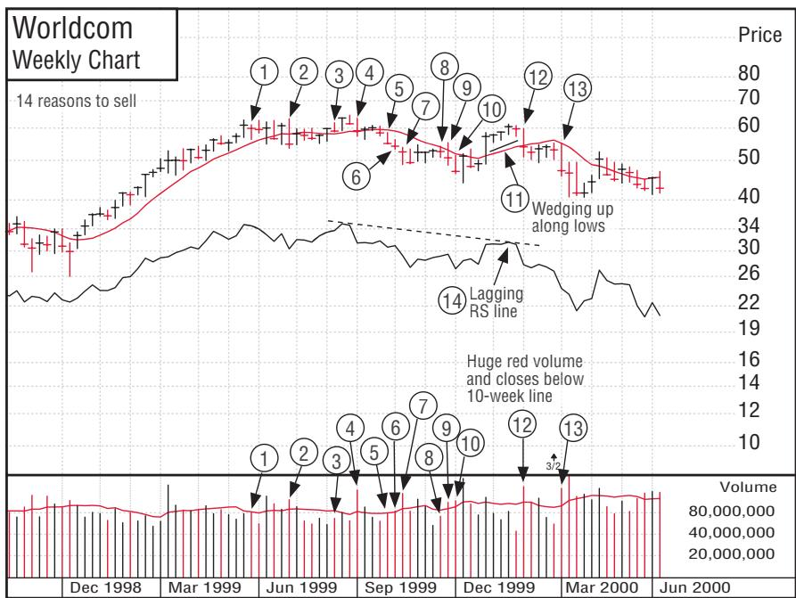
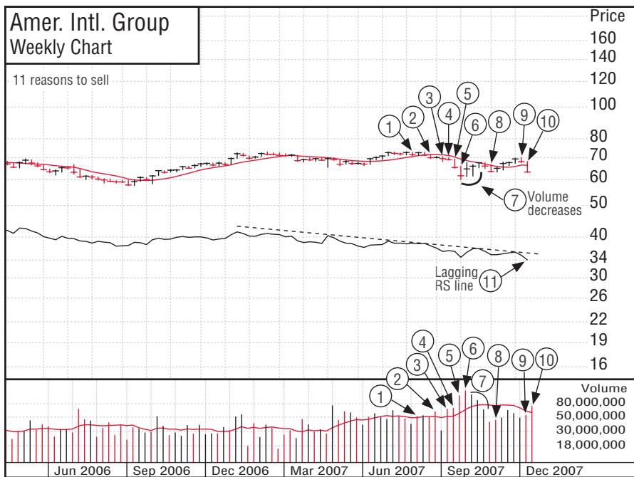
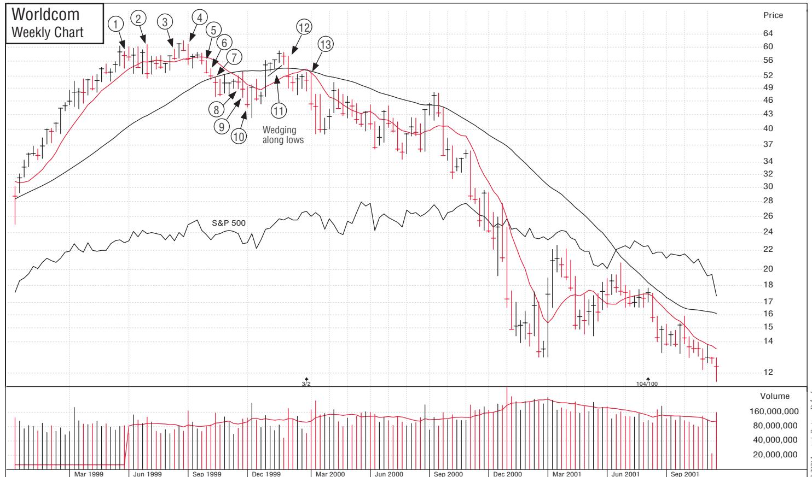
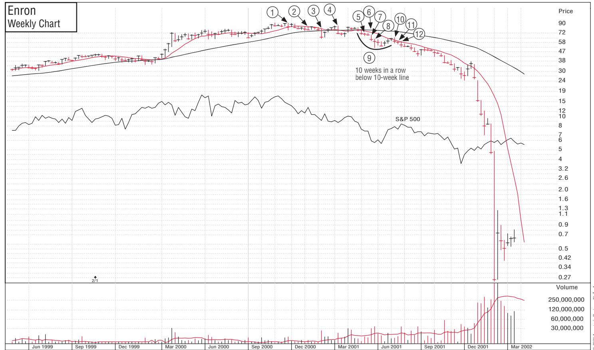
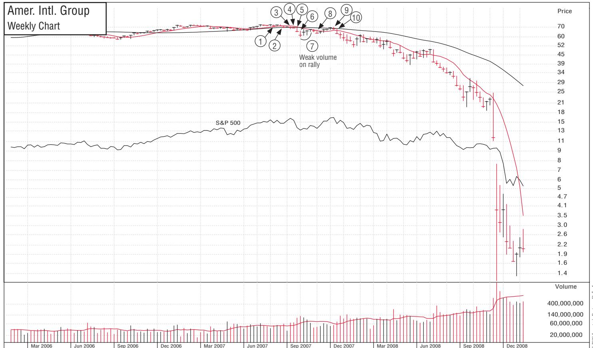
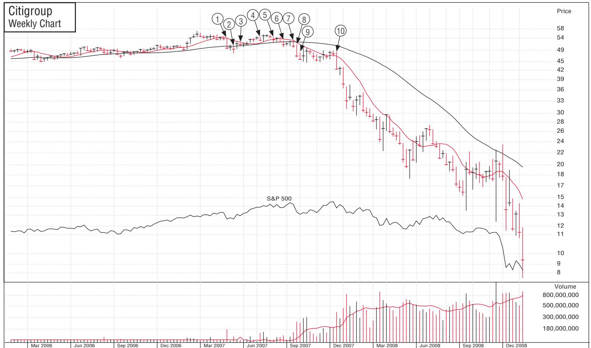
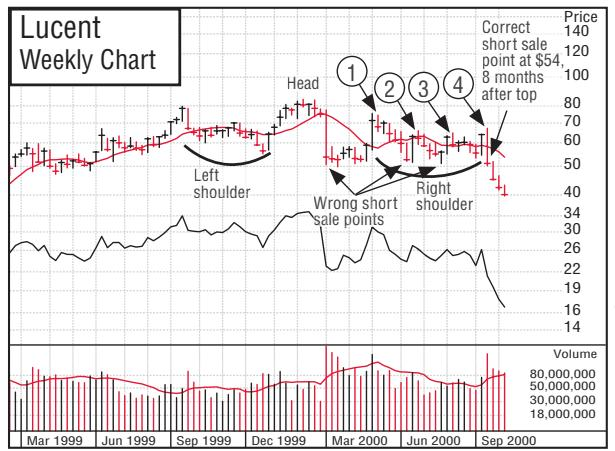
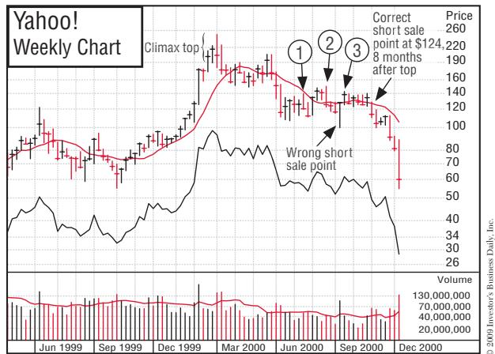

# Chapter12 Money Management: Should You Diversify, Invest for the Long Haul, Use Margin, Sell Short, or Buy Options, IPOs, Tax Shelters, Nasdaq Stocks, Foreign Stocks, Bonds, or Other Assets?

> 第二部分 · Part 2

> **中文标题：** 资金管理：你应该分散投资、长期持有、使用融资、卖空，还是买入期权、IPO、避税工具、纳斯达克股票、外国股票、债券或其他资产？

**中文翻译（导语）**

一旦你决定参与股市，摆在面前的就不只是"买哪只股票"这一个决定。你还得决定如何管理投资组合、该买多少只股票、采取哪些类型的操作，以及哪些投资最好敬而远之。

本章与下一章将向你介绍可供你选择的众多品种和种种诱人的岔路。其中有些确实有益、值得关注，但许多则风险过高、极其复杂，或徒增分心而回报有限。无论如何，多了解一些总没坏处——尽可能多懂些投资这门行当，哪怕仅仅是为了认清所有你该避开的东西。我的建议是：别把它搞得太复杂，保持简单。

**英文原文（导语）**

Once you have decided to participate in the stock market, you are faced with more decisions than just which stock to purchase. You have to decide how you will handle your portfolio, how many stocks you should buy, what types of actions you will take, and what types of investments are better left alone.

This and the following chapter will introduce you to the many options and alluring diversions you have at your disposal. Some of them are beneficial and worthy of your attention, but many others are overly risky, extremely complicated, or unnecessarily distracting and less rewarding. Regardless, it helps to be informed and to know as much about the investing business as possible—if for no other reason than to know all the things you should avoid. I say don’t make it too complicated; keep it simple.

### How Many Stocks Should You Really Own?

你听过多少次"别把鸡蛋放在一个篮子里"？表面上看，这像是句好建议；可依我的经验，很少有人能把一两件事做到极致。样样通、样样松的人，在任何领域——包括投资——都极少取得非凡成功。那些玄奥难懂的衍生品，到底是帮了华尔街的专业人士，还是害了他们？尝试 50 比 1、100 比 1 的极端异常杠杆，是帮了他们还是害了他们？

你会去找这样一位牙医吗——他业余搞点工程或木工，周末还写写音乐，兼任汽车修理工、水管工和会计？

公司与人并无不同。企业界分散经营的最佳样本就是大型联合企业。大多数大型联合企业表现都不好：它们过于庞大、效率低下、业务铺得过宽，无法有效聚焦、实现盈利增长。1960 年代末联合企业狂潮破灭之后，Jimmy Ling 和 Ling-Temco-Vought，以及 Gulf+Western Industries 都怎么样了？美国的巨型企业与庞大政府都可能变得低效、犯下许多错误，制造出的新问题几乎和它们想要解决的问题一样多。

你还记得多年前 Mobil Oil 收购苦苦挣扎的全国百货连锁 Montgomery Ward、借此进军零售业吗？它从未成功。Sears, Roebuck 通过收购 Dean Witter 和 Coldwell Banker 进军金融服务，通用汽车吞下计算机服务巨头 EDS，以及数百起其他企业多元化尝试，同样都没成功。2000 到 2008 年间，纽约的花旗集团又涉足了多少种不同的业务和贷款类型？

你分散得越广，对其中任何一块领域就了解得越少。许多投资者过度分散。最好的结果通常来自集中——把鸡蛋放进少数几个你非常了解的篮子里，并悉心看管。2000 年的崩盘或 2008 年的危机中，广泛分散保护了你的组合吗？你持有的股票越多，当严重熊市来临时，你可能反应和行动得越慢、越难筹集足够的现金，因为你有虚假的安全感。当市场出现重大顶部时，你应当卖出、退出融资（如果你用了借来的钱），并至少筹出一些现金；否则，你会把大部分收益又还回去。

获胜投资者的目标，应当是握有一两只大赢家，而不是几十笔蝇头小利。宁可有一批小亏损和少数几笔巨额利润。广泛分散，说到底，往往只是无知的一块遮羞布。1997 到 2007 年间，那些买入"内含 5000 笔分散各异、有政府隐性背书、还被贴上 3A 标签的房地产贷款"打包产品的机构，真的保护和壮大了它们的投资吗？

手头有 2 万到 20 万美元可投资的大多数人，应当考虑把自己限制在四五只精心挑选、真正了解并看懂的股票上。一旦你已持有五只股票，又冒出一个让你动心、想买入的机会，你就该拿出纪律，卖掉手上最不吸引人的那只。如果你可投资的是 5000 到 2 万美元，三只股票也许是合理的上限；一个 3000 美元的账户，限定两只股票足矣。让事情保持在可控范围内。持有越多，跟踪每一只就越难。即便是管理百万美元以上组合的投资者，持股也无须超过六七只精挑细选的证券。如果只持有六七只让你不安、紧张，那就持有十只；但持有三四十只就可能成为问题。大钱是靠集中赚来的——前提是你运用稳健的买卖规则和务实的大盘规则。当然，也没有哪条规则规定：一个 50 只股票的组合就不能下跌 50% 或更多。

How many times have you been told, “Don’t put all your eggs in one basket”? On the surface, this sounds like good advice, but my experience is that few people do more than one or two things exceedingly well. Those who are jacks-of-all-trades and masters of none are rarely dramatically successful in any field, including investing. Did all the esoteric derivatives help or harm Wall Street pros? Did experimenting with highly abnormal leverage of 50 or 100 to 1 help or hurt them?

Would you go to a dentist who did a little engineering or cabinetmaking on the side and who, on weekends, wrote music and worked as an auto mechanic, plumber, and accountant?

This is true of companies as well as people. The best example of diversification in the corporate world is the conglomerate. Most large conglomerates do not do well. They’re too big, too inefficient, and too spread out over too many businesses to focus effectively and grow profitably. Whatever happened to Jimmy Ling and Ling-Temco-Vought or to Gulf+Western Industries after the conglomerate craze of the late 1960s collapsed? Big business and big government in America can both become inefficient, make many mistakes, and create nearly as many big new problems as they hope to solve.

Do you remember when Mobil Oil diversified into the retail business by acquiring Montgomery Ward, the struggling national department-store chain, years ago? It never worked. Neither did Sears, Roebuck’s move into financial services with the purchases of Dean Witter and Coldwell Banker, or General Motors’s takeover of computer-services giant EDS, or hundreds of other corporate diversification attempts. How many different businesses and types of loans was New York’s Citigroup involved in from 2000 to 2008?

The more you diversify, the less you know about any one area. Many investors overdiversify. The best results are usually achieved through concentration, by putting your eggs in a few baskets that you know well and watching them very carefully. Did broad diversification protect your portfolio in the 2000 break or in 2008? The more stocks you own, the slower you may be to react and take selling action to raise sufficient cash when a serious bear market begins, because of a false sense of security. When major market tops occur, you should sell, get off margin if you use borrowed money, and raise at least some cash. Otherwise, you’ll give back most of your gains.

The winning investor’s objective should be to have one or two big winners rather than dozens of very small profits. It’s much better to have a number of small losses and a few very big profits. Broad diversification is plainly and simply often a hedge for ignorance. Did all the banks from 1997 to 2007 that bought packages containing 5,000 widely diversified different real estate loans that had the implied backing of the government and were labeled triple A protect and grow their investments?

Most people with \$20,000 to \$200,000 to invest should consider limiting themselves to four or five carefully chosen stocks they know and understand. Once you own five stocks and a tempting situation comes along that you want to buy, you should muster the discipline to sell your least attractive investment. If you have \$5,000 to \$20,000 to invest, three stocks might be a reasonable maximum. A \$3,000 account could be confined to two equities. Keep things manageable. The more stocks you own, the harder it is to keep track of all of them. Even investors with portfolios of more than a million dollars need not own more than six or seven well-selected securities. If you’re uncomfortable and nervous with only six or seven, then own ten. But owning 30 or 40 could be a problem. The big money is made by concentration, provided you use sound buy and sell rules along with realistic general market rules. And there certainly is no rule that says that a 50-stock portfolio can’t go down 50% or more.

### How to Spread Your Purchases over Time

你可以在时间上分批买入。这是一种有趣的分散方式。1990 和 1991 年建仓 Amgen 时，我就是在许多天里分批买入的。我把买入分散开来，并且只在先前买入已有明显浮盈时才追加。如果市价比我的平均成本高出 20 点、又出现了一个来自扎实底部的新买点，我会再买一些，但会确保追加的规模有限、适度，不至于抬高我的平均成本。

不过，新手尝试这种风险更高、高度集中的方法时必须格外谨慎。你必须学会正确操作，而且一旦事情不如预期，就一定要卖出或减仓。

在牛市中，把组合调整得更集中的方法之一是：完成初始买入后，只要股价较初始买价上涨 2% 到 3%，就立即做一两次规模较小的追加买入。但股票一旦明显超出正确的买点，就别再一路追高。这还能让你免于一种挫折：持有一只涨得更多的股票，却因为你手上它的股份比那些不太成功的股票还少，对组合帮助不大。与此同时，及时卖出并剔除那些已开始显露亏损的股票，别等小亏拖成大亏。

采用这套跟进买入的程序，能让你的资金更多地集中在少数几只最好的投资上。没有哪个系统是完美的，但这一套比随意分散的组合更贴近现实，也更有机会取得重要的成果。分散投资本身绝对稳健，只是别做过头。始终为你将持有的股票数量设定上限，并坚守你的规则。投资时，永远把你的规则集带在身边——也许就记在一个小本子里。什么？你说你一直在没有任何具体买卖规则的情况下投资？过去五到十年，这给你带来了什么结果？

It’s possible to spread out your purchases over a period of time. This is an interesting form of diversifying. When I accumulated a position in Amgen in 1990 and 1991, I bought on numerous days. I spread out the buying and made add-on buys only when there was a significant gain on earlier buys. If the market price was 20 points over my average cost and a new buy point occurred off a proper base, I bought more, but I made sure not to run my average cost up by buying more than a limited or moderate addition.

However, newcomers should be extremely careful in trying this more risky, highly concentrated approach. You have to learn how to do it right, and you positively have to sell or cut back if things don’t work as expected.

In a bull market, one way to maneuver your portfolio toward more concentrated positions is to follow up your initial buy and make one or two smaller additional buys in stocks as soon as they have advanced 2% to 3% above your initial buy. However, don’t allow yourself to keep chasing a stock once it’s extended too far past a correct buy point. This will also spare you the frustration of owning a stock that goes a lot higher but isn’t doing your portfolio much good because you own fewer shares of it than you do of your other, less-successful issues. At the same time, sell and eliminate stocks that start to show losses before they become big losses.

Using this follow-up purchasing procedure should keep more of your money in just a few of your best stock investments. No system is perfect, but this one is more realistic than a haphazardly diversified portfolio and has a better chance of achieving important results. Diversification is definitely sound; just don’t overdo it. Always set a limit on how many stocks you will own, and stick to your rules. Always keep your set of rules with you—in a simple notebook, perhaps—when you’re investing. What? You say you’ve been investing without any specific buy or sell rules? What results has that produced for you over the last five or ten years?

### Should You Invest for the Long Haul?

如果你确实决定集中持股，那么是该长期持有，还是更频繁地交易？答案是：持有期的长短并不是关键。关键在于——在精准的时机买入正确的股票、最优秀的股票，然后当市场或你的各种卖出规则提示该卖时，就把它卖掉。从买入到卖出之间的时间，可能短也可能长，让你的规则和市场来决定。若你这样做，有些赢家你会持有三个月，有些六个月，少数则持有一两年、三年甚至更久；而大多数输家，你会持有短得多的时间，通常在几周到三个月之间。任何管理良好的组合，都绝不该让亏损持仓拖到六个月或以上。让你的组合保持干净、与市场同步。记住，好园丁总会给花圃除草、剪去弱枝。

If you do decide to concentrate, should you invest for the long haul or trade more frequently? The answer is that the holding period (long or short) is not the main issue. What’s critical is buying the right stock—the very best stock—at precisely the right time, then selling it whenever the market or your various sell rules tell you it’s time to sell. The time between your buy and your sell could be either short or long. Let your rules and the market decide which one it is. If you do this, some of your winners will be held for three months, some for six months, and a few for one, two, or three years or more. Most of your losers will be held for much shorter periods, normally between a few weeks and three months. No well-run portfolio should ever, ever have losses carried for six months or more. Keep your portfolio clean and in sync with the market. Remember, good gardeners always weed the flower patch and prune weak stems.

### Lessons for Buy-and-Hold Investors Who Don’t Use Charts

我曾在 WorldCom（1999 年）、Enron（2001 年）以及 Citigroup、AIG、General Motors（2007 年）的周线图上做出标注。图上呈现出 10 到 15 个明确的信号，表明这些投资在当时就显然应当卖出。

为什么你必须始终使用图表……看看接下来发生了什么。

实际上，如果你看得时间更长，还有更多卖出信号。例如，Citigroup 在此前三年（2004 到 2006 年）的相对强度基础上下跌惨重，其盈利增长在那段时间也从其 1990 年代的增速放缓。监控你投资的价格和成交量活动是值得的。那就是你停止亏损、开始盈利的方式。

I’ve marked up the weekly charts of WorldCom in 1999, Enron in 2001, and Citigroup, AIG, and General Motors in 2007. They show 10 to 15 specific signs that these investments should clearly have been sold at that time.

Why you must always use charts…see what happens next.

Actually, if you looked at a longer time period, there were even more sell signals. For example, Citigroup had dramatically underperformed on a relative strength basis for the prior three years, from 2004 through 2006, and its earnings growth during that time slowed from its growth rate throughout the 1990s. It pays to monitor your investments’ price and volume activity. That’s how you stop losing and start winning.

### Should You Day Trade?

我始终劝人不要做的一种操作就是日内交易，即当天买入、当天卖出。大多数投资者这样做都会亏钱。原因很简单：你主要面对的是难以辨识的日内小幅波动，远比更长时间周期上的基本趋势难读。何况，日内交易的利润潜力通常不足以弥补你产生的佣金和不可避免的亏损。别急着赚快钱。罗马不是一天建成的。

还有一种新型日内交易，更像短线波段交易（在上涨途中买入股票，在不可避免的回调前卖出）。它指的是：在图表上的精确枢轴买点（脱离底部或价格整理区）买入股票，并在突破后约五天卖出。有时，在五分钟周期的日内图上辨识出杯柄形态等形态中的枢轴点，能揭示一只正从日内形态突破的股票。若以真正的技巧在积极的市场中操作，这种做法对某些人或许管用，但它需要大量的时间、学习和经验。

One type of investing that I have always discouraged people from doing is day trading, where you buy and sell stocks on the same day. Most investors lose money doing this. The reason is simple: you are dealing predominantly with minor daily fluctuations that are harder to read than basic trends over a longer time period. Besides, there’s generally not enough profit potential in day trading to offset the commissions you generate and the losses that will inevitably occur. Don’t try to make money so fast. Rome wasn’t built in a day.

There is a new form of day trading that is more like short-term swing trading (buying a stock on the upswing and selling before an inevitable pullback). It involves buying a stock at its exact pivot buy point off a chart (coming out of a base or price consolidation area) and selling it five or so days later after the breakout. Sometimes pivot points off patterns such as the cup-with-handle pattern (see Chapter 2) identified on intraday charts of five-minute intervals can reveal a stock that is breaking out from an intraday pattern. If this is done with real skill in a positive market, it might work for some people, but it requires lots of time, study, and experience.

### Should You Use Margin?

在最初一两年、你还在学习投资时，以现金方式投资要安全得多。大多数新投资者通常需要至少两到三年，才能积累起足够的市场经验（通过做出几个糟糕决定、浪费时间试图重新发明轮子、以及尝试各种不健全的信念），进而能够赚取并守住可观的利润。一旦你积累了几年的经验、有了健全的计划、并订立了一套严格的买卖规则，就可以考虑用融资买入（从券商那里借钱来买更多股票）。一般说来，融资买入应该由仍在工作的年轻投资者来做——他们的风险略小，因为距离退休还有更多时间。

使用融资的最佳时机，通常是在新牛市的最初两年。一旦你辨认出新的熊市，就应该立刻退出融资，并尽可能多筹集现金。你必须明白：当大盘下跌、你的股票开始下沉时，如果你满仓融资，初始资本的亏损速度将是现金投资时的两倍。这就要求你在大盘出现重大恶化时，必须果断地迅速砍掉所有亏损、退出融资。如果你满仓融资去投机小盘股或高科技股，一次 50% 的回调就可能导致血本无归——2000 年初和 2001 年初，一些新投资者就遭遇了这种情况。

你不必一直满仓融资。有时你会手握大量现金储备、不用融资；有时你以现金方式投资；还有些时候，你只动用融资购买力的一小部分。而在少数情况下——当你在牛市中取得实实在在的进展时——你可能会满仓融资。这一切都取决于当前的市场状况和你的经验水平。我一直使用融资，并且相信：对于那些懂得把买入限定在优质市场龙头、且有纪律和常识去永远毫无例外地迅速止损的老练投资者而言，融资确实提供了实实在在的优势。

你的融资利息支出，视不断变化的税法而定，或许可以抵税。但在某些时期，融资利率可能高得让大幅获利的可能性大打折扣。要用融资买入，你还需与券商签署一份融资协议。

In the first year or two, while you’re still learning to invest, it’s much safer to invest on a cash basis. It usually takes most new investors at least two to three years before they gain enough market experience (by making several bad decisions, wasting time trying to reinvent the wheel, and experimenting with unsound beliefs) to be able to make and keep significant profits. Once you have a few years’ experience, a sound plan, and a strict set of both buy and sell rules, you might consider buying on margin (using borrowed money from your brokerage firm in order to purchase more stock). Generally, margin buying should be done by younger investors who are still working. Their risk is somewhat less because they have more time to prepare for retirement.

The best time to use margin is generally during the first two years of a new bull market. Once you recognize a new bear market, you should get off margin immediately and raise as much cash as possible. You must understand that when the general market declines and your stocks start sinking, you will lose your initial capital twice as fast if you’re fully margined than you would if you were invested on a cash basis. This dictates that you absolutely must cut all losses quickly and get off margin when a major general market deterioration begins. If you speculate in small-capitalization or high-tech stocks fully margined, a 50% correction can cause a total loss. This happened to some new investors in 2000 and early 2001.

You don’t have to be fully margined all the time. Sometimes you’ll have large cash reserves and no margin. At other times, you’ll be invested on a cash basis. At still other points, you’ll be using a small part of your margin buying power. And in a few instances, when you’re making genuine progress in a bull market, you may be fully invested on margin. All of this depends on the current market situation and your level of experience. I’ve always used margin, and I believe it offers a real advantage to an experienced investor who knows how to confine his buying to high-quality market leaders and has the discipline and common sense to always cut his losses short with no exceptions.

Your margin interest expense, depending on laws that change constantly, might be tax-deductible. However, in certain periods, margin interest rates can become so high that the probability of substantial success may be limited. To buy on margin, you’ll also need to sign a margin agreement with your broker.

### Never Answer a Margin Call

如果你融资账户里的一只股票大幅缩水，以至于券商要求你或追加资金、或卖出股票，那就别追加资金——考虑卖出股票。十有八九，这样对你更有利。市场正在告诉你：你走错了路、你正在受伤、事情不奏效。所以卖出，降低你的风险水平。再说一遍，为什么要拿好钱去填坏窟窿？如果你追加了资金，股票却继续下跌、你又收到更多追加保证金通知，你打算怎么办？难道要为一个输家撑腰撑到破产？

If a stock in your margin account collapses in value to the point where your stockbroker asks you to either put up money or sell stock, don’t put up money; think about selling stock. Nine times out of ten, you’ll be better off. The marketplace is telling you that you’re on the wrong path, you’re getting hurt, and things aren’t working. So sell and cut back your risk level. Again, why throw good money after bad? What will you do if you put up good money and the stock continues to decline and you get more margin calls? Go broke backing a loser?

### Should You Sell Short?

1976 年，我做过一些研究，并写了一本关于卖空的小册子。如今它已绝版，但这个主题此后并无太大变化。2005 年，这本小册子成为一本名为《如何通过卖空赚钱》的著作的基础——该书由我和 Gil Morales 合写，他改写、修订并更新了我早期的作品。卖空至今仍是极少有投资者真正理解的主题，也是一项更少有人能够成功的行当，所以要仔细掂量它是否适合你。更积极、更有经验的投资者或许可以考虑有限的卖空，但我希望把上限控制在可用资金的 10% 或 15%，而大多数人可能连这个数都不该做。况且，卖空远比单纯买入股票复杂得多，大多数卖空者都被卷进去、亏了钱。

什么是卖空？可以把它理解为把正常的买卖过程颠倒过来：卖空时，你卖出一只股票（而不是买入）——尽管你并不拥有它，因此必须向券商借入——期望它下跌而非上涨。如果股票果然如你所料下跌，你就可以"回补空头仓位"，在公开市场以更低的价格买回，把差价收入囊中作为利润。当你认为市场将大幅下跌、或某只股票即将崩塌时，你就会卖空。你先卖出股票，指望稍后以更低的价格买回来。

听起来很容易，对吧？错了。卖空很少有好结果。通常，你卖空的那只你指望它会暴跌的股票，偏偏做出意外之举，开始悄悄爬升。它一涨，你就亏钱。

有效的卖空，通常在市场新一轮下跌启动之时进行。这意味着你必须依据每日大盘平均指数的表现来卖空；这又要求你具备两种能力：（1）解读每日的道指、标普 500 或纳斯达克指数，如第 9 章所述；（2）挑选那些已经历巨幅上涨、并在数月前明确见顶的股票。换句话说，你的时机必须天衣无缝。你可能判断正确，但若出手太早，也可能被迫亏损回补。

卖空时，你同样必须把风险限制在 8% 止损之内。否则后果不堪设想，因为股票的价格上涨空间是无限的。

I did some research and wrote a booklet on short selling in 1976. It’s now out of print, but not much has changed on the subject since then. In 2005, the booklet was the basis for a book titled How to Make Money Selling Short. The book was written with Gil Morales, who rewrote, revised, and updated my earlier work. Short selling is still a topic few investors understand and an endeavor at which even fewer succeed, so consider carefully whether it’s right for you. More active and seasoned investors might consider limited short selling. But I would want to keep the limit to 10% or 15% of available money, and most people probably shouldn’t do even that much. Furthermore, short selling is far more complicated than simply buying stocks, and most short sellers are run in and lose money.

What is short selling? Think of it as reversing the normal buy and sell process. In short selling, you sell a stock (instead of buying it)—even though you don’t own it and therefore must borrow it from your broker—in the hope that it will go down in price instead of up. If the stock falls in price as you expect, you can “cover your short position” by buying the stock in the open market at a lower price and pocket the difference as your profit. You would sell short if you think the market is going to drop substantially or a certain stock is ready to cave in. You sell the stock first, hoping to buy it back later at a lower price.

Sounds easy, right? Wrong. Short selling rarely works out well. Usually the stock that you sell short, expecting a colossal price decrease, will do the unexpected and begin to creep up in price. When it goes up, you lose money.

Effective short selling is usually done at the beginning of a new general market decline. This means you have to short based on the behavior of the daily market averages. This, in turn, requires the ability to (1) interpret the daily Dow, S&P 500, or Nasdaq indexes, as discussed in Chapter 9, and (2) select stocks that have had tremendous run-ups and have definitely topped out months earlier. In other words, your timing has to be flawless. You may be right, but if you’re too early, you can be forced to cover at a loss.

In selling short, you also have to minimize your risk by cutting your losses at 8%. Otherwise, the sky’s the limit, as your stock could have an unlimited price increase.

### What Are Options, and Should You Invest in Them?

期权是这样一种投资工具：你花钱买下一份权利（合约），可以在某个约定的未来时点（即期权到期日）之前，按约定价格买入（"看涨"，call）或卖出（"看跌"，put）一只股票、某个股票指数或商品。期权投机性极强，其风险与价格波动都远大于普通股。因此，大多数投资者都不该买入或卖出期权。获胜的投资者首先应学会如何把所承担的投资风险降到最低，而不是去加大它。一个人唯有证明自己能在普通股上赚钱、并具备足够的投资理解和实战经验之后，才可以明智地考虑有限度地使用期权。

期权就像在打"全有或全无"的赌。假如你买入一份 McDonald's 的三个月看涨期权，所付的权利金赋予你在未来三个月内任何时候以某个价格买入 100 股 MCD 的权利。买入看涨期权时，你预期股价会上涨；所以若一只股票现价 120 美元，你或许会以 125 美元的执行价买入看涨期权。若三个月后股价涨到 150 美元（而你还没卖出这份看涨期权），你便可以行权，把 25 美元的价差减去你付出的权利金后落袋。反之，若三个月过去，股价下跌、表现不及预期，你就不会行权；期权到期作废，你损失掉付出的权利金。如你所料，看跌期权的运作方式类似，只是你赌的是股价下跌而非上涨。

Options are an investment vehicle where you purchase rights (contracts) to buy (“call”) or sell (“put”) a stock, stock index, or commodity at a specified price before a specified future time, known as the option expiration date. Options are very speculative and involve substantially greater risks and price volatility than common stocks. Therefore, most investors should not buy or sell options. Winning investors should first learn how to minimize the investment risks they take, not increase them. After a person has proved that she is able to make money in common stocks and has sufficient investment understanding and actual experience, then the limited use of options could be intelligently considered.

Options are like making “all or nothing” bets. If you buy a three-month call option on McDonald’s, the premium you pay gives you the right to purchase 100 shares of MCD at a certain price at any time during the next three months. When you purchase calls, you expect the price of the stock to go up, so if a stock is currently trading at \$120, you might buy a call at \$125. If the stock rises to \$150 after three months (and you have not sold your call option), you can exercise it and pocket the \$25 profit less the premium you paid. Conversely, if three months go by and your stock is down and didn’t perform as expected, you would not exercise the option; it expires worthless, and you lose the premium you paid. As you might expect, puts are handled in a similar manner, except that you’re making a bet that the price of the stock will decrease instead of increase.

### Limiting Your Risk when It Comes to Options

如果你确实考虑期权，就一定要限制它在整个投资组合中所占的比重。一个审慎的上限，也许是不超过 10% 到 15%。你还应订立一条规则，明确打算在何处砍掉并限制所有亏损。这个比例自然必须高于 8%，因为期权的波动远大于股票。如果一份期权的波动速度是标的股票的三倍，那么 20% 或 25% 或许可以作为绝对上限。在利润方面，你可以订一条规则：多数收益在达到 50% 到 75% 时就了结。

期权有些方面会带来挑战。如果某份期权因市场狭小、流动性不足，其价格就极易受供求变化影响，买入这类期权是有问题的。同样麻烦的是，仅仅因为标的股票或大盘的价格波动性短暂上升，期权就可能被人为地、暂时地抬高价格。

If you do consider options, you should definitely limit the percentage of your total portfolio committed to them. A prudent limit might be no more than 10% to 15%. You should also adopt a rule about where you intend to cut and limit all of your losses. The percentage will naturally have to be more than 8%, since options are much more volatile than stocks. If an option fluctuates three times as rapidly as the underlying stock, then perhaps 20% or 25% might be a possible absolute limit. On the profit side, you might consider adopting a rule that you’ll take many of your gains when they hit 50% to 75%.

Some aspects of options present challenges. Buying options whose price can be significantly influenced by supply and demand changes as a result of a thin or illiquid market for that particular option is problematic. Also problematic is the fact that options can be artificially and temporarily overpriced simply because of a short-lived increase in price volatility in the underlying stock or the general market.

### Buy Only the Best

我买期权时（很少这么做），倾向于挑选最具攻击性、最出色的股票所对应的期权——那些盈利预期最高、因而权利金也更贵的股票。再说一遍，你要的是最好股票的期权，而不是最便宜的期权。在期权上赚钱的诀窍，其实与期权本身关系不大：你必须把标的股票选对、时机踩准。因此，你应当运用你的 CAN SLIM 体系，在最好的时机挑出最好的股票。

你若这样做且判断正确，期权就会随股票一起上涨，而且因为杠杆，理当涨得快得多。

只买最好股票的期权，还能把因流动性不足造成的滑点降到最低。（滑点，是你想支付的价格与订单成交时你实际支付的价格之间的差额。股票流动性越强，你遇到的滑点就越小。）对于流动性差的小盘股，滑点可能更严重，最终让你多花钱。买入低价、流动性差的股票的期权，就像在嘉年华游戏里试图把一排牛奶瓶全部击倒——那游戏很可能是做过手脚的。要在流动性稀薄的小盘股上卖出你的期权，同样棘手。

在重大熊市中，你可以考虑买入某些个股或标普等主要股指的看跌期权，同时卖空普通股。券商借不到股票，可能使卖空比买入看跌期权更难操作。在牛市中买入看跌期权一般并不明智——何必做一条逆流而上的鱼？

如果你认为某只股票要涨、且正是买入的好时机，那就直接买它，或买入一份长期期权并以市价下单。该卖的时候，就以市价卖出。期权市场通常比标的股票本身的市场更稀薄、流动性更差。

许多业余期权交易者总爱在订单上设定限价。一旦养成设限价的习惯，当价格逐渐偏离他们的限价时，他们就会不停地改动这个价格限制。当你一边操心着改限价、一边做决定时，就很难保持健全的判断和全局观。到头来，你费了九牛二虎之力、饱受折磨，才勉强成交几笔。

当你终于挑中当年的那个大赢家——那只将要涨三倍的股票——你却会因为把订单限价挂得比实际市价低了 ¼ 点而错失良机。靠一分一厘的差价，你永远无法在股市赚到大钱。

如果你持有的证券陷入麻烦，而你因为给卖单设了限价而未能卖出脱身，也可能输个精光。你的目标是在大波动上判断正确，而不是在小波动上。

When I buy options, which is rarely, I prefer to buy them for the most aggressive and outstanding stocks with the biggest earnings estimates, those where the premium you have to pay for the option is higher. Once again, you want options on the best stocks, not the cheapest. The secret to making money in options doesn’t have much to do with options. You have to analyze and be right on the selection and timing of the underlying stock. Therefore, you should apply your CAN SLIM system and select the best possible stock at the best possible time.

If you do this and you are right, the option will go up along with the stock, except that the option should move up much faster because of the leverage.

By buying only options on the best stocks, you also minimize slippage caused by illiquidity. (Slippage is the difference between the price you wanted to pay and the price you actually paid at the time the order was executed. The more liquid the stock, the less slippage you should experience.) With illiquid (small-capitalization) stocks, the slippage can be more severe, and this ultimately could cost you money. Buying options on lower-priced, illiquid stocks is similar to the carnival game where you’re trying to knock down all the milk bottles. The game may be rigged. Selling your options can be equally tricky in a thin (small-capitalization) stock.

In a major bear market, you might consider buying put options on certain individual stocks or on a major stock index like the S&P, along with selling shares of common stock short. The inability of your broker to borrow a stock may make selling short more difficult than buying a put. It is generally not wise to buy puts during a bull market. Why be a fish trying to swim upstream?

If you think a stock is going up and it’s the right time to buy, then buy it, or purchase a long-term option and place your order at the market. If it’s time to sell, sell at the market. Option markets are usually thinner and not as liquid as the markets for the underlying stock itself.

Many amateur option traders constantly place price limits on their orders. Once they get into the habit of placing limits, they are forever changing their price restraints as prices edge away from their limits. It is difficult to maintain sound judgment and perspective when you are worrying about changing your limits. In the end, you’ll get some executions after tremendous excess effort and frustration.

When you finally pick the big winner for the year, the one that will triple in price, you’ll lose out because you placed your order with a ¼-point limit below the actual market price. You never make big money in the stock market by eighths and quarters.

You could also lose your shirt if your security is in trouble and you fail to sell and get out because you put a price limit on your sell order. Your objective is to be right on the big moves, not on the minor fluctuations.

### Short-Term Options Are More Risky

如果你买期权，时间周期拉长一些会更好，比如六个月左右。这样能最大程度降低一种可能：在你持有的股票还来不及表现之前，期权就已经耗尽了时间价值。既然我把这一点告诉了你，你觉得大多数投资者会怎么做？没错——他们买入短期期权（30 到 90 天），因为这些期权更便宜，而且涨跌都更快！

短期期权的问题在于：你在个股上或许判断正确，但大盘可能滑入一轮中期回调，结果到期时所有股票都下跌，于是你所有的期权都因大盘而亏损。这也正是你为什么应当把期权买入和到期日分散到好几个不同的月份。

If you buy options, you’re better off with longer time periods, say, six months or so. This will minimize the chance your option will run out of time before your stock has had a chance to perform. Now that I’ve told you this, what do you think most investors do? Of course, they buy shorter-term option—30 to 90 days—because these options are cheaper and move faster in both directions, up and down!

The problem with short-term options is that you could be right on your stock, but the general market may slip into an intermediate correction, with the result that all stocks are down at the end of the short time period. You will then lose on all your options because of the general market. This is also why you should spread your option buying and option expiration dates over several different months.

### Keep Option Trading Simple

要记住的一点是：永远让你的投资尽可能简单。别让人忽悠你去投机那些看似高深的组合，比如条式组合（strips）、跨式组合（straddles）和价差组合（spreads）。

条式组合（strip）是一种常规期权形式，把同一证券、同一执行价、同一到期日的一份看涨和两份看跌组合在一起。其权利金低于分别购买这些期权所需的费用。

跨式组合（straddle）可以是多头或空头。多头跨式组合，是同一标的证券、同一执行价、同一到期月的一份看涨和一份看跌；空头跨式组合，则是同一证券、同一执行价、同一到期月的一份看涨空头和一份看跌空头。

价差组合（spread），是到期日相同的期权的一买一卖。

光是挑出一只上涨的股票或期权就已经够难了。如果你把事情搞复杂、开始对冲（同时做多和做空），信不信由你，你很可能落得两边都亏。比如，若股票上涨，你可能忍不住早早卖出手中的看跌以减小亏损，结果后来发现股价已掉头向下，你又在看涨那一头亏钱；反过来也一样。这是一种危险的心理游戏，你应当避而远之。

One thing to keep in mind is that you should always keep your investments as simple as possible. Don’t let someone talk you into speculating in such seemingly sophisticated packages as strips, straddles, and spreads.

A strip is a form of conventional option that couples one call and two puts on the same security at the same exercise price with the same expiration date. The premium is less than it would be if the options were purchased separately.

A straddle can be either long or short. A long straddle is a long call and a long put on the same underlying security at the same exercise price and with the same expiration month. A short straddle is a short call and a short put on the same security at the same exercise price and with the same expiration month.

A spread is a purchase and sale of options with the same expiration dates.

It’s difficult enough to just pick a stock or an option that is going up. If you confuse the issue and start hedging (being both long and short at the same time), you could, believe it or not, wind up losing on both sides. For instance, if a stock goes up, you might be tempted to sell your put early to minimize the loss, and later find that the stock has turned downward and you’re losing money on your call. The reverse could also happen. It’s a dangerous psychological game that you should avoid.

### Should You Write Options?

卖出期权（即"写"期权），与买入期权完全是两回事。对于持有股票并卖出其看涨期权的策略，我并不特别推崇。

卖出看涨期权的人会收到一笔小额费用（权利金），作为回报，他赋予别人（买方）一项权利：在某个日期之前，以约定价格从写者手中"赎走"并买入股票。在牛市中，我宁愿做看涨期权的买方，也不做看涨期权的写方（卖方）。在糟糕的市场里，干脆离场或做空。

看涨期权的写方揣进一笔小钱，实际上通常在被锁定的这段时间里动弹不得。要是你持有、又卖出了看涨期权的那只股票出了麻烦、暴跌怎么办？那点小钱根本覆盖不了你的亏损。当然，写方也能耍些手段，比如买入看跌期权来对冲、保护自己，可那样一来局面就变得过于复杂，写方还可能被来回打脸、两头挨耳光。

要是股票翻倍了会怎样？写方手中的股票被行权买走，只为一笔相对微薄的费用，就断送了赚取大利润的全部机会。为什么要在股票上冒风险，却只换来过小的收益、毫无赚大钱的可能？这不是你从大多数人那里会听到的道理；可话说回来，大多数人在股市里说的和做的，通常也不值得一听。

在我看来，写"裸看涨期权"更是愚蠢。裸看涨期权的写方，是为一只自己并不拥有的股票卖出看涨期权来收取费用，因此一旦股价对其不利，他毫无保护。

有些大投资者很难让组合取得像样的回报，他们或许能在对自己持有、且认为估值偏高的股票卖出短期期权时，找到一点微薄的附加价值。不过，对于那些看似轻而易举的赚钱新法子，我总是心存疑虑。股市和房地产里，很少有免费午餐。

Writing options is a completely different story from buying options. I am not overly impressed with the strategy of writing options on stocks.

A person who writes a call option receives a small fee or premium in return for giving someone else (the buyer) the right to “call” away and buy the stock from the writer at a specified price, up to a certain date. In a bull market, I would rather be a buyer of calls than a writer (seller) of calls. In bad markets, just stay out or go short.

The writer of calls pockets a small fee and is, in effect, usually locked in for the time period of the call. What if the stock you own and wrote the call against gets into trouble and plummets? The small fee won’t cover your loss. Of course, there are maneuvers the writer can take, such as buying a put to hedge and cover himself, but then situation gets too complicated and the writer could get whipsawed back and forth.

What happens if the stock doubles? The writer gets the stock called away, and for a relatively small fee loses all chance for a major profit. Why take risks in stocks for only meager gains with no chance for large gains? This is not the reasoning you will hear from most people, but then again, what most people are saying and doing in the stock market isn’t usually worth knowing.

Writing “naked calls” is even more foolish, in my opinion. Naked call writers receive a fee for writing a call on a stock they do not own, so they are unprotected if the stock moves against them.

It’s possible that large investors who have trouble making decent returns on their portfolio may find some minor added value in writing short-term options on stocks that they own and feel are overpriced. However, I am always somewhat skeptical of new methods of making money that seem so easy. There are few free lunches in the stock market or in real estate.

### Great Opportunities in Nasdaq Stocks

纳斯达克股票不在有形的证券交易所挂牌交易，而是通过柜台交易商买卖。近年来，柜台交易商市场因一大批 ECN（电子通信网络）——如 Instinet、SelectNet、Redibook 和 Archipelago——而得到壮大；它们把买家和卖家聚合在各自的网络内，并通过这些网络路由和执行订单。纳斯达克是一个专业领域，其中交易的许多股票来自较新、尚不成熟的公司。但如今连纽交所的公司也拥有庞大的纳斯达克业务。此外，1990 年代的改革，确实清除了曾经困扰纳斯达克的任何残留污名。

纳斯达克上通常有数百只引人注目的新成长股，也是美国一些最大公司的所在地。你绝对应该考虑买入那些有机构撑腰、符合 CAN SLIM 规则的更优质的纳斯达克股票。

为了最大的灵活性和安全性，无论股票在纽交所还是纳斯达克交易，让你的所有投资都保持可流通性至关重要。一只具有较大日均成交量的机构级普通股，是应对失控市场的一道防线。

Nasdaq stocks are not traded on a listed stock exchange, but instead are traded through over-the-counter dealers. The over-the-counter dealer market has been enhanced in recent years by a wide range of ECNs (electronic communication networks), such as Instinet, SelectNet, Redibook, and Archipelago, which bring buyers and sellers together within each network, and through which orders can be routed and executed. The Nasdaq is a specialized field, and in many cases the stocks traded are those of newer, lessestablished companies. But now even NYSE firms have large Nasdaq operations. In addition, reforms during the 1990s have removed any lingering stigma that once dogged the Nasdaq.

There are usually hundreds of intriguing new growth stocks on the Nasdaq. It’s also the home of some of the biggest companies in the United States. You should definitely consider buying better-quality Nasdaq stocks that have institutional sponsorship and fit the CAN SLIM rules.

For maximum flexibility and safety, it’s vital that you maintain marketability in all your investments, regardless of whether they’re traded on the NYSE or on the Nasdaq. An institutional-quality common stock with larger average daily volume is one defense against an unruly market.

### Should You Buy Initial Public Offerings (IPOs)?

首次公开发行（IPO），是一家公司首次向公众发售股票。我通常不推荐投资者买入 IPO，原因有几条。

每年发生的众多 IPO 中，确实有几家出类拔萃。可那些真正优秀的，会被机构（它们总能优先分到货）追捧得如此之热，以至于你即便能买到，也可能只拿到少得可怜的一点配售。逻辑很清楚：如果你作为个人投资者能把想要的股份全部买到，那这些股票很可能根本不值得拥有。

互联网和某些折扣券商让个人投资者更容易参与 IPO，尽管有些券商会限制你在公司上市后很快卖出的能力。这会让你陷入危险境地——想离场时却可能出不去。你大概还记得 1999 年和 2000 年初的 IPO 狂热：有些新股在上市头一两天火箭式蹿升，随后便崩塌，此后再未恢复。

许多 IPO 被刻意定低价，因而在上市首日飙升；但也有一些可能定价过高、随后下跌。

由于 IPO 没有交易历史，你无法确定它们是否估值过高。大多数情况下，这个投机领域应留给经验丰富的机构投资者——他们能接触到必要的深度研究，也能把打新股的风险分散到许多不同的证券上。

这并不是说你不能在 IPO 之后、股票还在幼年期上涨时买入。Google 本应在 2004 年 9 月中旬、即其上市后的第五周、在 114 美元创出新高时买入。买入 IPO 最安全的时点，是它出现首次回调、并从底部构筑区突破之时。等一只新股在市场交易了一两个月、三个月或更久，你便掌握了有价值的价格与成交量数据，可以借此更好地判断局面。

在过去三个月到三年上市的庞大新股名单里，总有一些出类拔萃的公司——它们拥有优越的新产品、亮眼的当期与近几个季度盈利和销售，值得你考虑。（《投资者商业日报》的"新美国"（The New America）版面会介绍其中大多数；某家公司的过往文章或许还能查到。）CB Richard Ellis 在 2004 年夏天 IPO 后构筑了一个完美的平底，随后上涨了 500%。

懂得正确选股与择时技巧的经验丰富的投资者，绝对应该考虑买入这类新股：它们显示出良好的正盈利和出色的销售增长，同时又构筑出扎实的价格底部。若按这种方式操作，它们可以成为新点子的绝佳来源。近年来大多数大牛股，在其之前一到八年或十年间的某个时点都经历过 IPO。即便如此，新股也可能波动更剧烈，并在艰难的熊市中偶遭剧烈回调。这通常发生在 IPO 市场一段疯狂过热之后——那时似乎任何一只新股都是"热门发行"。例如，1960 年代初、1983 年初，以及 1999 年底和 2000 年初出现的几轮新股热潮，几乎总是紧接着一段熊市。

在本书写作的 2009 年初，国会应当考虑下调资本利得税率，为成千上万的新企业家创办创新型公司创造强大的激励。我们此前提到过，历史研究证明：1980 和 1990 年代价格表现与就业创造俱佳的股票中，有 80% 是在之前八到十年间上市的。如今美国亟需一股源源不断的新公司洪流，去激发新发明和新产业……以及更强的经济、数百万更多的就业和数百万更多的纳税人。对华盛顿而言，下调资本利得税从来都是划算的。在次贷房地产计划和信贷危机引发 2008 年经济崩塌之后，重燃 IPO 市场和美国经济正需要这一举措。我多年前就明白：一旦税率提高，许多投资者干脆就不卖股票了——因为他们不想缴税、然后拿显著更少的钱去再投资。华盛顿似乎就是弄不懂这个简单的事实。结果是卖股票的人更少，政府拿到的税收反而更少，而不是更多。我有许多年长的退休人士告诉我，他们会持股到死，这样就无需缴税。

An initial public offering is a company’s first offering of stock to the public. I usually don’t recommend that investors purchase IPOs. There are several reasons for this.

Among the numerous IPOs that occur each year, there are a few outstanding ones. However, those that are outstanding are going to be in such hot demand by institutions (who get first crack at them) that if you are able to buy them at all, you may receive only a tiny allotment. Logic dictates that if you, as an individual investor, can acquire all the shares you want, they are possibly not worth having.

The Internet and some discount brokerages have made IPOs more accessible to individual investors, although some brokers place limits on your ability to sell soon after a company comes public. This is a dangerous position to be in, since you may not be able to get out when you want to. You may recall that during the IPO craze of 1999 and early 2000, there were some new stocks that rocketed on their first day or two of trading, only to collapse and never recover.

Many IPOs are deliberately underpriced and therefore shoot up on the first day of trading, but more than a few could be overpriced and drop.

Because IPOs have no trading history, you can’t be sure whether they’re overpriced. In most cases, this speculative area should be left to experienced institutional investors who have access to the necessary in-depth research and who are able to spread their new issue risks among many different equities.

This is not to say that you can’t purchase a new issue after the IPO when the stock is up in its infancy. Google should have been bought in mid-September 2004, in the fifth week after its new issue, when it made a new high at 114. The safest time to buy an IPO is on the breakout from its first correction and base-building area. Once a new issue has been trading in the market for one, two, or three months or more, you have valuable price and volume data that you can use to better judge the situation.

Within the broad list of new issues of the previous three months to three years, there are always standout companies with superior new products and excellent current and recent quarterly earnings and sales that you should consider. (Investor’s Business Daily’s “The New America” page explores most of them. Past articles on a company may be available.) CB Richard Ellis formed a perfect flat base after its IPO in the summer of 2004 and then rose 500%.

Experienced investors who understand correct selection and timing techniques should definitely consider buying new issues that show good positive earnings and exceptional sales growth, and also have formed sound price bases. They can be a great source of new ideas if they are dealt with in this fashion. Most big stock winners in recent years had an IPO at some point in the prior one to eight or ten years. Even so, new issues can be more volatile and occasionally suffer massive corrections during difficult bear markets. This usually happens after a period of wild excess in the IPO market, where any and every offering seems to be a “hot issue.” For example, the new issue booms that developed in the early 1960s and the beginning of 1983, as well as that in late 1999 and early 2000, were almost always followed by a bear market period.

Congress, at this writing in early 2009, should consider lowering the capital gains tax to create a powerful incentive for thousands of new entrepreneurs to start up innovative new companies. Our historical research proved that 80% of the stocks that had outstanding price performance and job creation in the 1980s and 1990s had been brought public in the prior eight to ten years, as mentioned earlier. America now badly needs a renewed flow of new companies to spark new inventions and new industries . . . and a stronger economy, millions more jobs, and millions more taxpayers. It has always paid for Washington to lower capital gains taxes. This will be needed to reignite the IPO market and the American economy after the economic collapse that the subprime real estate program and the credit crisis caused in 2008. I learned many years ago that if rates are raised, many investors will simply not sell their stock because they don’t want to pay the tax and then have significantly less money to reinvest. Washington can’t seem to understand this simple fact. Fewer people will sell their stocks, and the government will always get less revenue, not more. I’ve had many older, retired people tell me they will keep their stock until they die so they won’t have to pay the tax.

### What Are Convertible Bonds, and Should You Invest in Them?

可转换债券，是可以按预定价格换成（转换为）另一类投资（通常是普通股）的债券。可转换债券给持有人带来的收益，通常略高于对应的普通股，同时还附带有获取某些利润的可能。

理论上，可转换债券上涨时会几乎与普通股一样快，而在下跌时跌得更少。可正如理论常常被打脸，现实未必如此。此外还有流动性问题要考虑——在极端艰难的时期，可转换债券市场可能干涸。

有时，投资者被这一品种吸引，是因为他们能大量借款、为自己的头寸加杠杆（获得更大的购买力）。而这只会加大你的风险。过度杠杆可能十分危险，正如华尔街和华盛顿在 2008 年所领教的那样。

正因以上几点，我不建议大多数投资者买入可转换债券。我自己也从未买过公司债。它们是糟糕的通胀对冲工具；而讽刺的是，如果你为了追逐更高收益、最终却做成一笔风险更高的投资，你也可能在债券市场上亏掉很多钱。

A convertible bond is one that you can exchange (convert) for another investment category, typically common stock, at a predetermined price. Convertible bonds provide a little higher income to the owner than the common stock typically does, along with the potential for some possible profits.

The theory goes that a convertible bond will rise almost as fast as the common stock rises, but will decline less during downturns. As so often happens with theories, the reality can be different. There is also a liquidity question to consider, since convertible bond markets may dry up during extremely difficult periods.

Sometimes investors are attracted to this medium because they can borrow heavily and leverage their commitment (obtain more buying power). This simply increases your risk. Excessive leverage can be dangerous, as Wall Street and Washington learned in 2008.

It is for these several reasons that I do not recommend that most investors buy convertible bonds. I have also never bought a corporate bond. They are poor inflation hedges, and, ironically, you can also lose a lot of money in the bond market if you make what ultimately turns out to be a higher-risk investment in stretching for a higher yield.

### Should You Invest in Tax-Free Securities and Tax Shelters?

典型投资者不应使用这类投资工具（IRA、401(k) 计划和 Keogh 计划除外），其中最常用的是市政债券。对税收过度忧心，会扰乱、蒙蔽投资者通常健全的判断力。常识也该告诉你：一旦你投资避税工具，美国国税局决定审计你纳税申报表的可能性就会大得多。

别自欺欺人。如果你在错误的时间买入市政债，或者地方、州政府做出糟糕的管理决策、陷入真正的财务困境（过去确实有一些如此），你也可能在市政债上亏钱。

那些追逐过多税收优惠或避税门道的人，常常最终一头扎进可疑或高风险的项目里。做投资决策时，永远该把投资本身放在首位，而把税收因素远远排在其次。

这里是美国——任何真正肯下功夫的人，都能在储蓄和投资上取得成功。学会如何赚到净利润；等你做到了，就为此高兴，而不是因为"赚了钱要缴税"而抱怨。难道你宁愿一直持有到亏损、从而无税可缴？从一开始就要认清：山姆大叔永远是你的合伙人，他会照例分走你工资和投资收益中属于他的那一份。

我从未买过免税证券或避税工具。这让我得以自由地专注于寻找尽可能好的投资。当这些投资奏效时，我像所有人一样照章纳税。永远记住……美国的自由与机会体系是世界上最伟大的。学会去使用它、保护它、欣赏它。

The typical investor should not use these investment vehicles (IRAs, 401(k) plans, and Keoghs excepted), the most common of which are municipal bonds. Overconcern about taxes can confuse and cloud investors’ normally sound judgment. Common sense should also tell you that if you invest in tax shelters, there is a much greater chance the IRS may decide to audit your tax return.

Don’t kid yourself. You can lose money in munis if you buy them at the wrong time or if the local or state government makes bad management decisions and gets into real financial trouble, which some of them have done in the past.

People who seek too many tax benefits or tax dodges frequently end up investing in questionable or risky ventures. The investment decision should always be considered first, with tax considerations a distant second.

This is America, where anyone who really works at it can become successful at saving and investing. Learn how to make a net profit and, when you do, be happy about it rather than complaining about having to pay taxes because you made a profit. Would you rather hold on until you have a loss so you have no tax to pay? Recognize at the start that Uncle Sam will always be your partner, and he will receive his normal share of your wages and investment gains.

I have never bought a tax-free security or a tax shelter. This has left me free to concentrate on finding the best investments possible. When these investments work out, I pay my taxes just like everybody else. Always remember . . . the U.S. system of freedom and opportunity is the greatest in the world. Learn to use, protect, and appreciate it.

### Should You Invest in Income Stocks?

收益股（收入股），是指那些股息率高且稳定、为持有人提供应税收入的股票。这类股票通常出现在号称更保守的行业里，比如公用事业和银行。大多数人不该为了股息或收入去买普通股，可许多人偏偏这么做。

人们以为收益股保守，可以坐等收息、安心持有。去问问那些在 1984 年 Continental Illinois Bank 从 25 美元暴跌到 2 美元时吃了大亏的投资者，问问 2009 年初 Bank of America 从 55 美元崩到 5 美元时的持有者，再问问过去被核电站拖垮的电力公用事业公司。（讽刺的是，如今有 17 个主要国家从核电获得的电力，比美国更多，有的已经维持多年；法国 78% 的电力来自核电。）

1994 年电力公用事业股暴跌时投资者也受了伤；2001 年某些加州公用事业公司崩塌时同样如此。理论上收益股应更安全，但别被麻痹、以为它们不会剧烈下跌。1999–2000 年，AT&T 就从 60 美元以上跌到了 20 美元以下。

再说前面提到的花旗集团——那家被众多机构投资者持有的纽约市银行又如何？我不在乎它派发了多少股息：如果你在 50 美元持有花旗，眼看它一路暴跌到 2 美元（当时它正处在破产边缘，直到政府出手救助），你就是亏掉了巨额资金。顺带一提，即便你投资收益股，也应当使用图表。2007 年 10 月，花旗股票以它有史以来最大的单月成交量大幅跳空跌破，连业余看图者都能辨认出来，从而轻易在 40 多美元卖出，避免严重亏损。

如果你确实买入收益股，绝不要勉强去追最高的股息率。那通常意味着大得多的风险和更低的质量。为了多拿 2% 或 3% 的收益，可能让你的资本显著暴露于更大的亏损。华尔街许多公司在房地产泡沫里干的就是这个，看看它们的投资结果就知道。若公司的每股收益不足以覆盖派息，它还可能削减股息，让你收不到预期的那笔收入——这种事也发生过。

如果你需要收入，我的建议是专注于质量最好的股票，每年从中提取投资额的 6% 用于生活开支。你可以卖掉少量股份，每季度提取 1.5%。通常不建议用更高的提取率，因为时间一长，那可能会侵蚀你的本金。

Income stocks are stocks that have high and regular dividend yields, providing taxable income to the owner. These stocks are typically found in supposedly more conservative industries, such as utilities and banks. Most people should not buy common stocks for their dividends or income, yet many people do.

People think that income stocks are conservative and that you can just sit and hold them because you are getting your dividends. Talk to any investor who lost big on Continental Illinois Bank in 1984 when the stock plunged from \$25 to \$2, or on Bank of America when it crashed from \$55 to \$5 as of the beginning of 2009, or on the electric utilities caught up in the past with nuclear power plants. (Ironically, 17 major nations now get or for years have gotten more of their electricity from nuclear power plants than the United States does. France gets 78% of its electricity from nuclear power.)

Investors also got hurt when electric utilities nosedived in 1994, and the same was true when certain California utilities collapsed in 2001. In theory, income stocks should be safer, but don’t be lulled into believing that they can’t decline sharply. In 1999–2000, AT&T dropped from over \$60 to below \$20.

And how about the aforementioned Citigroup, the New York City bank that so many institutional investors owned? I don’t care how much it paid in dividends; if you owned Citigroup at \$50 and watched it nosedive to \$2, when it was in the process of going bankrupt until the government bailed it out, you lost an enormous amount of money. Incidentally, even if you do invest in income stocks, you should use charts. In October of 2007, Citigroup stock broke wide open on the largest volume month that it ever traded, so that even an amateur chartist could have recognized this and easily sold it in the \$40s, avoiding a serious loss.

If you do buy income stocks, never strain to buy the highest dividend yield available. That will typically entail much greater risk and lower quality. Trying to get an extra 2% or 3% yield can significantly expose your capital to larger losses. That’s what a lot of Wall Street firms did in the real estate bubble, and look what happened to their investments. A company can also cut its dividends if its earnings per share are not adequately covering those payouts, leaving you without the income you expected to receive. This too has happened.

If you need income, my advice is to concentrate on the very best-quality stocks and simply withdraw 6% of your investments each year for living expenses. You could sell off a few shares and withdraw 1½% per quarter. Higher rates of withdrawal are not usually advisable, since in time they might lead to some depletion of your principal.

### What Are Warrants, and Are They Safe Investments?

权证是一种投资工具，允许你以特定价格买入特定数量的股票。有些权证在特定期限内有效，但常见的是不设时间限制。许多权证价格低廉，因而显得诱人。

然而，大多数投资者应当对低价权证敬而远之。这又是一个复杂而专业的领域，概念上听起来不错，却极少有投资者真正弄懂。归根到底，真正的问题在于对应的普通股是否值得买入。对大多数投资者来说，忘掉权证这个领域反而更好。

Warrants are an investment vehicle that allows you to purchase a specific amount of stock at a specific price. Sometimes warrants are good for a certain period of time, but it’s common for them not to have time limits. Many of them are cheap in price and therefore seem appealing.

However, most investors should shy away from low-priced warrants. This is another complex, specialized field that sounds fine in concept but that few investors truly understand. The real question comes down to whether the common stock is correct to buy. Most investors will be better off if they forget the field of warrants.

### Should You Invest in Merger Candidates?

并购题材股的表现往往反复无常，所以我不推荐投资它们。有些并购候选股会因一则可能被收购的传闻而大幅上涨，结果等交易告吹或出现其他意外时，股价又突然跳水。换句话说，这可能是一门风险高、波动大的生意，一般应留给专攻此道的资深专业人士去玩。基于你基本的 CAN SLIM 评估去买稳健的公司，通常比费心去猜某家公司会不会被出售或合并要好得多。

Merger candidates can often behave erratically, so I don’t recommend investing in them. Some merger candidates run up substantially in price on rumors of a possible sale, only to have the price drop suddenly when a potential deal falls through or other unforeseen circumstances occur. In other words, this can be a risky, volatile business, and it should generally be left to experienced professionals who specialize in this field. It is usually better to buy sound companies, based on your basic CAN SLIM evaluation, than to try to guess whether a company will be sold or merged with another.

### Should You Buy Foreign Stocks?

少数外国股票若在正确的时机、正确的地点买入，会有极佳的潜力；但我不建议人们花太多精力大规模买入它们。一只外国股票的潜在利润，应当明显高于一家出众的美国公司，才足以支撑那份额外的风险。例如，外国证券的投资者必须了解并密切跟踪该国的大盘走势。该国利率、汇率或政府政策的突然变化，都可能通过一次意外之举，让你的投资变得不再有吸引力。

既然美国就有超过 10000 种证券可供挑选，你没必要去搜寻大量外国股票。许多值得一提的外国股票也在美国交易，其中一些过去表现相当成功，比如 Research in Motion、China Mobile 和 America Movil——在上轮牛市中我持有过其中两只。这些股票都受益于全球无线通信的繁荣，却在随后的熊市中回调了 60% 或更多。也有一些在外国证券上表现优异的共同基金。

2008 年我们的股市已经够疲弱了，许多海外市场跌得更多。中国股票龙头百度从 429 美元跌到 100 美元。而俄罗斯市场在普京入侵并恫吓格鲁吉亚之后，从 16291 点一路直线跌到 3237 点。

A few foreign stocks have excellent potential if they are bought at the right time and the right place, but I don’t suggest that people spend too much time getting substantially invested in them. The potential profit from a foreign stock should be a good bit more than that from a standout U.S. company to justify the potential additional risk. For example, investors in foreign securities must understand and closely follow the general market of the particular country involved. Sudden changes in that country’s interest rates, currency, or government policy could, through one unexpected action, make your investment less attractive.

It isn’t necessary for you to search out a lot of foreign stocks when there are more than 10,000 securities to select from in the United States. Many worthy foreign stocks also trade in the United States, and a number had excellent success in the past, including Research in Motion, China Mobile, and America Movil. I owned two of them in the last bull market. All of these stocks benefited from the worldwide wireless boom, but corrected 60% or more in the bear market that followed this bull move. There are also some mutual funds that excel in foreign securities.

As weak as our stock market was in 2008, many foreign markets declined even more. Baidu, a Chinese stock leader, dropped from \$429 to \$100. And the Russian market plummeted straight down from 16,291 to 3,237 once Putin invaded and intimidated the nation of Georgia.

### Avoid Penny Stocks and Low-Priced Securities

加拿大和丹佛的市场上，挂着许多每股只需几美分就能买到的股票。我强烈建议你避免在这种便宜货上赌博，因为任何东西都按其真实价值出售——你付出多少，就只能得到多少。

这些看似便宜的证券投机性过强、质量极低。与质地更好、价格更高的投资相比，它们的风险大得多。低价股中出现可疑或不道德推销手法的机会也更大。我倾向于不买任何每股售价低于 15 美元的普通股，你也应当如此。我们对美国 125 年间超级赢家的广泛历史研究表明，其中大多数股票是从每股 30 到 50 美元之间的图表底部突破的。

The Canadian and Denver markets list many stocks that you can buy for only a few cents a share. I strongly advise that you avoid gambling in such cheap merchandise, because everything sells for what it’s worth. You get what you pay for.

These seemingly cheap securities are unduly speculative and extremely low in quality. The risk is much higher with them than with better-quality, higher-priced investments. The opportunity for questionable or unscrupulous promotional practices is also greater with penny stocks. I prefer not to buy any common stock that sells for below \$15 per share, and so should you. Our extensive historical studies of 125 years of America’s super winners show that most of them broke out of chart bases between \$30 and \$50 a share.

### What Are Futures, and Should You Invest in Them?

期货，是指在某个约定的未来日期、以约定价格买入或卖出特定数量的商品、金融工具或股票指数。大多数期货属于谷物、贵金属、工业金属、食品、肉类、油类、木材和纤维（统称商品）、金融工具以及股票指数这几大类。金融类包括政府短期国债和债券，外加外币。交投较活跃的股指期货之一是标普 100，以代码 OEX 更为人所知。

像 Hershey（好时）这样的大型商业机构，会利用商品市场进行"对冲"。比如，Hershey 可以在五月买下可可豆、约定十二月交割，以此锁定当前价格，同时在现货市场安排相应交易。

对大多数个人投资者而言，最好别去碰期货市场。商品期货波动极端剧烈，投机性远超大多数普通股。这不是缺乏经验者或小投资者该去的地方——除非你想快速赌一把或快速亏钱。

不过，当一位投资者已具备四五年经验、并无可置疑地证明了他在普通股上赚钱的能力时，如果他内心足够强大，或许可以考虑有限度地投资期货。

对于期货，能够看懂并解读图表就更重要了。商品价格中的图表形态，与个股中的形态相似。留意期货图表，还能帮助股票投资者评估国家基本经济状况的变化。

可交易的期货品种相对较少，因此精明的投机者能够集中精力分析。期货交易的规则和术语各不相同，风险也大得多，所以投资者一定要限制投入期货的资金比例。期货交易中还夹杂着令人揪心的事件，比如"跌停"日——那时交易者不被允许卖出、砍掉亏损。风险管理（即控制仓位规模、迅速止损）在交易期货时比任何时候都更重要。你在任何单一期货头寸上承担的风险，都绝不应超过资本的 5%。而且，持仓有可能陷入一连串涨停或跌停日而无法脱身。期货可能凶险而具有毁灭性；你完全可能输得精光。

我从未买过商品期货。我不相信你能样样精通。把一个领域学到尽可能透彻吧——可供选择的股票有成千上万只。

Futures involve buying or selling a specific amount of a commodity, financial issue, or stock index at a specific price on a specific future date. Most futures fall into the categories of grains, precious metals, industrial metals, foods, meats, oils, woods, and fibers (known collectively as commodities); financial issues; and stock indexes. The financial group includes government T-bills and bonds, plus foreign currencies. One of the more active stock indexes traded is the S&P 100, better known by its ticker symbol OEX.

Large commercial concerns, such as Hershey, use the commodity market for “hedging.” For example, Hershey might lock in a current price by temporarily purchasing cocoa beans in May for December delivery, while arranging for a deal in the cash market.

It is probably best for most individual investors not to participate in the futures markets. Commodity futures are extremely volatile and much more speculative than most common stocks. It is not an arena for the inexperienced or small investor unless you want to gamble or lose money quickly.

However, once an investor has four or five years of experience and has unquestionably proven her ability to make money in common stocks, if she is strong of heart, she might consider investing in futures on a limited basis.

With futures, it is even more important that you be able to read and interpret charts. The chart price patterns in commodity prices are similar to those in individual stocks. Being aware of futures charts can also help stock investors evaluate changes in basic economic conditions in the country.

There are relatively small number of futures that you can trade. Therefore, astute speculators can concentrate their analysis. The rules and terminology of futures trading are different, and the risk is far greater, so investors should definitely limit the proportion of their investment funds that they commit to futures. There are worrisome events involved in futures trading, such as “limit down” days, where a trader is not allowed to sell and cut a loss. Risk management (i.e., position size and cutting losses quickly) is never more important than when trading futures. You should also never risk more than 5% of your capital in any one futures position. There is an outside chance of getting stuck in a position that has a series of limit up or limit down days. Futures can be treacherous and devastating; you could definitely lose it all.

I have never bought commodity futures. I do not believe you can be a jack-of-all-trades. Learn just one field as completely as possible. There are thousands of stocks to choose from.

### Should You Buy Gold, Silver, or Diamonds?

如你所料，我通常不推荐投资金属或宝石。

这类投资大多有着反复无常的历史。它们曾被以极其激进的方式推销，对小投资者几乎不提供任何保护。此外，交易商在这些投资上的加价利润可能过高。再者，这类投资不付利息，也不派股息。

黄金股总会周期性地大幅上涨，原因是某些外国国家可能出现的问题引发了恐惧或恐慌。少数黄金公司也可能有自己的周期，比如 1980 年代末和 1990 年代初的 Barrick Gold。这种以商品为导向的交易，可能是一场情绪化而不稳定的游戏，所以我建议慎之又慎。不过，在特定时点，对这类股票做小额投资也可能合时宜、有道理。

As you might surmise, I do not normally recommend investing in metals or precious stones.

Many of these investments have erratic histories. They were once promoted in an extremely aggressive fashion, with little protection afforded to the small investor. In addition, the dealer’s profit markup on these investments may be excessive. Furthermore, these investments do not pay interest or dividends.

There will always be periodic, significant run-ups in gold stocks caused by fears or panics brought about by potential problems in certain foreign countries. A few gold companies may also be in their own cycle, like Barrick Gold was in the late 1980s and early 1990s. This type of commodity-oriented trading can be an emotional and unstable game, so I suggest care and caution. Small investments in such equities, however, can be timely and reasonable at certain points.

### Should You Invest in Real Estate?

是的——但要选对时机、选对地点。我确信，大多数人应当努力通过积累储蓄账户、投资普通股或成长型股票共同基金，以具备购房能力。拥有自己的住房，一直是大多数美国人的目标。多年来，人们只需很少或一笔合理的首付就能获得长期贷款，这才创造出必要的杠杆，最终让大多数美国人有可能进行房地产投资。

房地产之所以是热门的投资工具，是因为它相当容易理解，而且在一些地区利润丰厚。目前约三分之二的美国家庭拥有自己的住房。时间加上杠杆，通常会有回报。然而，情况并非总是如此。在以下许多现实中的不利情形下，人们确实会在房地产上亏钱：

1. 最初的选址就是败笔——买在慢慢衰落或不再增长的区域，或者自己持有房产的区域后来衰败了。
2. 在连续数年繁荣之后、经济或其房产所在的具体地区即将遭遇严重挫折之前，以虚高的价格买入。如果当地发生大规模行业裁员，或作为社区重要支柱的飞机厂、汽车厂、钢铁厂关闭，就可能出现这种情况。
3. 个人过度扩张——房产供款和其他债务超出自己的承受能力；或者掉进看似诱人却不明智的浮动利率贷款，日后可能酿成棘手的难题；又或者把房屋净值贷出来花——只借不还，而不随时间逐步偿还按揭。
4. 收入来源因失业骤减，或者若持有出租房产，因空置率上升而减少。
5. 遭遇火灾、洪水、龙卷风、地震或其他自然灾害。

人们也可能被那些用心良好、但在推行、推广、管理、运营和监管之前并未经过周密论证的政府政策和社会项目所伤。1995 到 2008 年的次贷惨败，就是由一个初衷良好、却随时间完全失控的政府项目造成的；它带来了全然出乎意料的后果，让许多政府本想帮助的人失去了住房。随着企业收缩，它还造成了巨大的失业。仅在大洛杉矶地区，圣贝纳迪诺、里弗赛德和圣安娜就有许多少数族裔房主因法拍而受到沉重打击。

基本上，除非一个人能自己拿出至少 5%、10% 或 20% 的首付、并有一份相对稳定的工作，否则就不该买房。你需要为购房目标去赚钱、去储蓄。同时要避开浮动利率贷款和那些花言巧语的推销员——他们会劝你买房来"炒房"（flip），让你暴露在更大的风险之中。最后，不要做房屋净值贷款，那可能让你的住房陷入更大的风险。也要警惕养成用信用卡大举负债的坏习惯——这个坏习惯会害你很多年。

你可以靠学习和专注于正确地买卖高质量、成长型股票来赚钱、来磨练本领，而不是把自己的精力分散在无数高风险的投资替代品上。与所有投资一样，在做出决定之前先做必要的研究。记住：世上没有无风险的投资，别让任何人告诉你"有"。如果某件事听起来太容易、好得不像真的，那就要当心！

这里先做个总结：分散投资是好事，但别过度分散。把精力集中在少数几只精挑细选的股票上，让市场帮你判断每一只该持有多久。如果你经验丰富，使用融资未尝不可，但它意味着显著额外的风险。除非你确切知道自己在做什么，否则不要卖空。一定要学会用图表来辅助你的选股与择时。纳斯达克是较新的创业型公司的良好市场，但期权和期货风险相当大，只有在你经验非常丰富时才可动用，而且即便如此，也应限制在整体投资的一个小比例内。投资避税工具和外国股票时也要多加小心。

最好让你的投资保持简单、基本——高质量的成长型股票、共同基金或房地产。但每一项都是专门的领域，你需要自我教育，这样才不至于完全依赖别人来获得稳妥的建议和投资。

Yes, at the right time and in the right place. I am convinced that most people should work toward being able to own a home by building a savings account and investing in common stocks or a growth-stock mutual fund. Home ownership has been a goal for most Americans. The ability over the years to obtain long-term borrowed money with only a small or reasonable down payment has created the leverage necessary to eventually make real estate investments possible for most Americans.

Real estate is a popular investment vehicle because it is fairly easy to understand and in certain areas can be highly profitable. About two-thirds of American families currently own their own homes. Time and leverage usually pay off. However, this is not always the case. People can and do lose money in real estate under many of the following realistic unfavorable conditions:

1. They make a poor initial selection by buying in an area that is slowly deteriorating or is not growing, or the area in which they’ve owned property for some time deteriorates.
2. They buy at inflated prices after several boom years and just before severe setbacks in the economy or in the particular geographic area in which they own real estate. This might occur if there are major industry layoffs or if an aircraft, auto, or steel plant that is an important mainstay of a local community closes.
3. They get themselves personally overextended, with real estate payments and other debts that are beyond their means, or they get into inviting but unwise variable-rate loans that could create difficult problems later, or they take out and live off of home equity—borrowing, rather than paying down their mortgage over time.
4. Their source of income is suddenly reduced by the loss of a job, or by an increase in rental vacancies should they own rental property.
5. They are hit by fires, floods, tornadoes, earthquakes, or other acts of nature.

People can also be hurt by well-meaning government policies and social programs that were not soundly thought through before being implemented, promoted, managed, operated, and overseen by the government. The subprime fiasco from 1995 to 2008 was caused by a good, well-intended government program that over time got completely out of control, with totally unexpected consequences that caused many of the very people the government hoped to help to lose their homes. It also caused huge job losses as business contracted. In the greater Los Angeles area alone, many minority owners in San Bernardino, Riverside, and Santa Ana were dramatically hurt by foreclosures.

Basically, no one should ever buy a home unless he can come up with a down payment of at least 5%, 10%, or 20% on his own and has a relatively secure job. You need to earn and save toward your home-buying goal. And avoid variable-rate loans and smooth-talking salespeople who talk you into buying homes to “flip,” which exposes you to far more risk. And finally, don’t take out home equity loans that can put your home in a greater risk position. Also beware of getting into the terrible habit of using credit cards to run up big debts. That’s a bad habit that will hurt you for years.

You can make money and develop skill by learning about and concentrating on the correct buying and selling of high-quality growth-oriented equities rather than scattering your efforts among the myriad high-risk investment alternatives. As with all investments, do the necessary research before you make your decision. Remember, there’s no such thing as a riskfree investment. Don’t let anyone tell you there is. If something sounds too easy and good to be true, watch out!

To summarize so far, diversification is good, but don’t overdiversify. Concentrate on a smaller list of well-selected stocks, and let the market help you determine how long each of them should be held. Using margin may be okay if you’re experienced, but it involves significant extra risk. Don’t sell short unless you know exactly what you’re doing. Be sure to learn to use charts to help with your selection and timing. Nasdaq is a good market for newer entrepreneurial companies, but options and futures have considerable risk and should be used only if you’re very experienced, and then they should be limited to a small percentage of your overall investments. Also be careful when investing in tax shelters and foreign stocks.

It’s best to keep your investing simple and basic—high-quality, growth-oriented stocks, mutual funds, or real estate. But each is a specialty, and you need to educate yourself so that you’re not dependent solely on someone else for sound advice and investments.
