# — Part 1 第一部分

> 本文件为《How to Make Money in Stocks》（《如何在股市中赚钱》）第一部分的中英对照译本。每一节先列**中文翻译**，后附**英文原文**，便于逐段对照阅读。

## Chapter2 How to Read Charts Like a Pro and Improve Your Selection and Timing

> **中文标题：** 如何像行家一样读图，提升你的选股与择时

**中文翻译（导语）**

在医学领域，X 光片、核磁共振和脑部扫描都是医生用来研究、诊断人体状况的“图像”；心电图和超声波则被记录在纸上，或显示在类似电视的监视器上，用以说明心脏正在发生什么。

同样，地图按比例绘制，帮助人们准确了解自己身在何处、又该如何抵达想去的地方；地质学家则把地震数据描绘成图表，以研究哪些构造或形态最有可能蕴藏石油。

几乎每个领域都有现成的工具，帮助人们正确评估当前状况、获取准确信息，投资也不例外。经济指标被绘成图表，以便解读；一只股票的价格与成交量历史被记录在走势图上，帮助投资者判断它究竟是强势、健康、正处于吸筹之中，还是疲弱、表现异常。

如果一位医生不做必要检查就要给你开胸做心脏手术，你会答应吗？当然不会——那简直是不负责任。然而，许多投资者在买卖股票之前从不查阅走势图，所做的正是同样的事。医生若不借助 X 光、CT 和心电图就给病人看病，是不负责任；投资者若不肯学会解读走势图上的价量形态，就是愚不可及。就算别的什么都不说，图表至少能告诉你：一只股票何时表现失常、应当卖出。

如果投资者不知道如何辨识一只股票何时见顶、并开始一轮大幅回调，或者一直依赖另一个同样不懂此事的人，就可能亏掉大笔金钱。

**英文原文（导语）**

In the world of medicine, X-rays, MRIs, and brain scans are “pictures” that doctors study to help them diagnose what’s going on in the human body. EKGs and ultrasound waves are recorded on paper or shown on TV-like monitors to illustrate what’s happening to the human heart. 

Similarly, maps are plotted and set to scale to help people understand exactly where they are and how to get to where they want to go. And seismic data are traced on charts to help geologists study which structures or patterns seem most likely to contain oil. 

In almost every field, there are tools available to help people evaluate current conditions correctly and receive accurate information. The same is true in investing. Economic indicators are plotted on graphs to assist in their interpretation. A stock’s price and volume history are recorded on charts to help investors determine whether the stock is strong, healthy, and under accumulation or whether it’s weak and behaving abnormally. 

Would you allow a doctor to open you up and perform heart surgery if he had not utilized the critical necessary tools? Of course not. That would be just plain irresponsible. However, many investors do exactly that when they buy and sell stocks without first consulting stock charts. Just as doctors would be irresponsible not to use X-rays, CAT scans, and EKGs on their patients, investors are just plain foolish if they don’t learn to interpret the price and volume patterns found on stock charts. If nothing else, charts can tell you when a stock is not acting right and should be sold. 

Individual investors can lose a lot of money if they don’t know how to recognize when a stock tops and starts into a significant correction or if they have been depending on someone else who also doesn’t know this. 

### Chart Reading Basics

> **中文标题：** 读图基础

**中文翻译（导语）**

走势图记录着成千上万只股票真实的股价表现。价格变动，是世界最大竞价市场中每日供需的结果。那些训练自己正确解读图表上价格运动的投资者，比起拒绝学习、懵然无知或有些懒惰的人，拥有巨大的优势。

你会坐上一架没有仪表的飞机，或开着一辆车、在没有地图的情况下横穿全国长途旅行吗？走势图就是你的投资地图。事实上，著名经济学家米尔顿·弗里德曼与罗斯·弗里德曼夫妇，在他们那本出色的《自由选择》里，用开篇 28 页专门论述市场事实的力量，以及价格向决策者传递重要、准确信息的独特能力。

图表形态，也就是“底部”，指的是先前一波上涨之后价格回调与整理所形成的区域。它们中的大多数（80% 到 90%）都是在大盘回调的过程中形成的。要分析这些底部，你需要掌握的技能，是判断价格的量与价运动究竟正常还是异常——它们发出的是强势信号，还是弱势信号？

大规模的上涨，总是从强劲且可辨识的形态中启动（本章后文将予讨论）。而失败则总能追溯到那些有缺陷、或对普通投资者而言过于一目了然的底部。

每年都有人靠花时间学会正确解读图表而致富。不使用图表的专业人士，等于在承认自己对这种极有价值的度量与择时工具一无所知。再强调一遍：我见过许多高层投资专业人士，最终因业绩不佳而丢掉饭碗。

究其原因，他们糟糕的业绩记录，往往直接源于对市场走势与图表解读所知甚少。那些开设金融或投资课程、却把图表斥为无关紧要、不值一提的大学，恰恰暴露出它们既不懂市场真正如何运作，也不懂最优秀的专业人士如何操作。

作为一名个人投资者，你也同样需要研究并受益于股票走势图。仅仅因为一只股票基本面出色——比如盈利与销售额强劲——就买入它是不够的。事实上，《投资者商业日报》的读者，绝不应仅仅依据该报专有的 SmartSelect® 评级就买入一只股票。你始终必须查看股票的走势图，判断它是否处在适合买入的位置；或者它虽然是一家稳健龙头公司的股票，却在价格上已远超扎实的盘整区、暂时应当回避。

近年来随着市场投资者增多，简单的价量图已经变得越来越容易获取。（《投资者商业日报》的订户可在 investors.com 网站免费查看 1 万张日线与周线图。）图册和在线图表服务，能帮你以高度条理化、省时的方式跟踪数百甚至数千只股票。有些服务比另一些更先进，除价量变化外还提供基本面与技术面数据。订阅一家较好的图表服务，你就能唾手可得那些别处难以获得的宝贵信息。

**英文原文（导语）**

Charts record the factual price performance of thousands of stocks. Price changes are the result of daily supply and demand in the largest auction marketplace in the world. Investors who train themselves to decode price movements on charts properly have an enormous advantage over those who either refuse to learn, just don’t know any better, or are a bit lazy. 

Would you fly in a plane without instruments or take a long cross-country trip in your car without a road map? Charts are your investment road map. In fact, the distinguished economists Milton and Rose Friedman devoted the first 28 pages of their excellent book Free to Choose to the power of market facts and the unique ability of prices to provide important and accurate information to decision makers. 

Chart patterns, or “bases,” are simply areas of price correction and consolidation after an earlier price advance. Most of them (80% to 90%) are created and formed as a result of corrections in the general market. The skill you need to learn in order to analyze these bases is how to diagnose whether the price and volume movements are normal or abnormal. Do they signal strength or weakness? 

Major advances occur off strong, recognizable price patterns (discussed later in this chapter). Failures can always be traced to bases that are faulty or too obvious to the typical investor. 

Fortunes are made every year by those who take the time to learn to interpret charts properly. Professionals who don’t make use of charts are confessing their ignorance of highly valuable measurement and timing mechanisms. To further emphasize this point: I have seen many high-level investment professionals ultimately lose their jobs as a result of weak performance. 

When this happens, their poor records are often a direct result of not knowing very much about market action and chart reading. Universities that teach finance or investment courses and dismiss charts as irrelevant or unimportant are demonstrating their complete lack of knowledge and understanding of how the market really works and how the best professionals operate. 

As an individual investor, you too need to study and benefit from stock charts. It’s not enough to buy a stock simply because it has good fundamental characteristics, like strong earnings and sales. In fact, no Investor’s Business Daily® reader should ever buy a stock based solely on IBD’s proprietary SmartSelect® Ratings. A stock’s chart must always be checked to determine whether the stock is in a proper position to buy, or whether it is the stock of a sound, leading company but is too far extended in price above a solid basing area and thus should temporarily be avoided. 

As the number of investors in the market has increased over recent years, simple price and volume charts have become more readily available. (Investor’s Business Daily subscribers have free access to 10,000 daily and weekly charts on the Web at investors.com.) Chart books and online chart services can help you follow hundreds and even thousands of stocks in a highly organized, time-saving way. Some are more advanced than others, offering both fundamental and technical data in addition to price and volume movement. Subscribe to one of the better chart services, and you’ll have at your fingertips valuable information that is not easily available elsewhere. 

### History Repeats Itself: Learn to Use Historical Precedents

正如导言中所说，也如第 1 章中那些经标注的历史最佳赢家走势图所示，我们这套挑选制胜股的体系，建立于市场实际如何运作之上，而非我个人或任何人的主观看法或学术理论。我们分析了过去最伟大的赢家股，发现它们都有七个共同特征，可以概括为两个易记的词——CAN SLIM。我们还发现，若干成功的价格形态和整理结构会一次又一次重复出现。在股市里，历史会重演，因为人性不变，供需法则也不变。过去那些伟大股票的形态，完全可以作为你未来选股的范本。在分析一只股票是否值得买入时，有几种价格形态值得留意。我还会指出一些需要警惕的信号，它们暗示某个形态可能有缺陷、不牢靠。

As mentioned in the introduction, and as shown on the annotated charts of history’s best winners in Chapter 1, our system for selecting winning stocks is based on how the market actually operates, not on my or anyone else’s personal opinions or academic theories. We analyzed the greatest winning stocks of the past and discovered they all had seven common characteristics, which can be summarized in the two easy-to-remember words CAN SLIM. We also discovered there were a number of successful price patterns and consolidation structures that repeated themselves over and over again. In the stock market, history repeats itself. This is because human nature doesn’t change. Neither does the law of supply and demand. Price patterns of the great stocks of the past can clearly serve as models for your future selections. There are several price patterns you’ll want to look for when you’re analyzing a stock for purchase. I’ll also go over some signals to watch out for that indicate that a price pattern may be faulty and unsound. 

### The Most Common Chart Pattern: “Cup with Handle”

最重要的价格形态之一，若从侧面看杯子的轮廓，就像一个带柄的杯子。杯形形态可持续 7 周乃至 65 周，但多数持续三到六个月。这种形态从绝对高点（杯口）到低点（杯底）的常见回调幅度，大约在 12% 到 15% 区间，最高可达 33%。任何类型的强劲形态，在底部形态开始之前，都应当有一段清晰、确定的上升趋势。你应当看到前期上升趋势中至少有 30% 的价格涨幅，同时相对强度不断改善，并在上升趋势的某些时点出现成交量的显著放大。

在多数、但并非全部情况下，杯底应当是圆滑的，呈“U”形而非狭窄的“V”形。这一特征让股票有时间经历一次必要的自然回调，并在杯底附近出现两三次最后的小幅疲软。这个“U”形区域很重要，因为它能吓退或耗尽残留的弱势持有者，并把其他投机者的注意力从这只股票上引开。由此，一个由更稳固的持有者组成的、在下一次上涨中更不易抛售的基础便建立起来。随附的图表来自 Daily Graphs Online®，展示了苹果电脑 2004 年 2 月的日线价量走势。

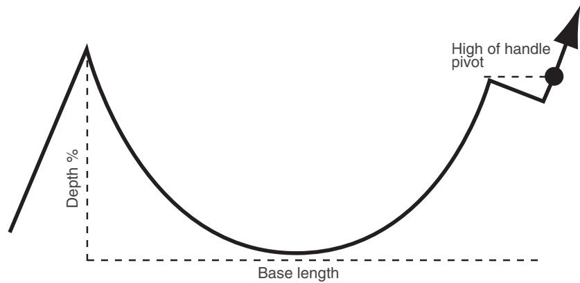

成长型股票在大盘中段回调期间形成杯形、并回调到大盘均值的 1½ 到 2½ 倍，是正常的。你最好的选择，通常是那些在中段回调中形态受损最小的股票。无论牛市还是熊市，跌幅超过大盘均值 2½ 倍的股票通常过于宽泛、松散，必须以怀疑的眼光看待。2000 年第二、三季度，JDS Uniphase 等数十家前高科技龙头形成了宽、松、深的杯形，它们几乎都是有缺陷、易失败的形态，预示着这些股票在试图突破创新高时应当被回避。

极少数波动剧烈的龙头股，在牛市中可能暴跌 40% 甚至 50%。在牛市中回调幅度超过这一水平的形态，若试图创新高并恢复涨势，失败率更高。原因何在？从峰值到低点跌幅超过 50%，意味着股票必须从低点上涨逾 100% 才能回到原高点。历史研究表明，在如此巨大的波动之后再创新高的股票，往往会在突破价位之上 5% 到 15% 处失败。从底部直接冲上新高的股票可能风险更大，因为它们没有回踩。

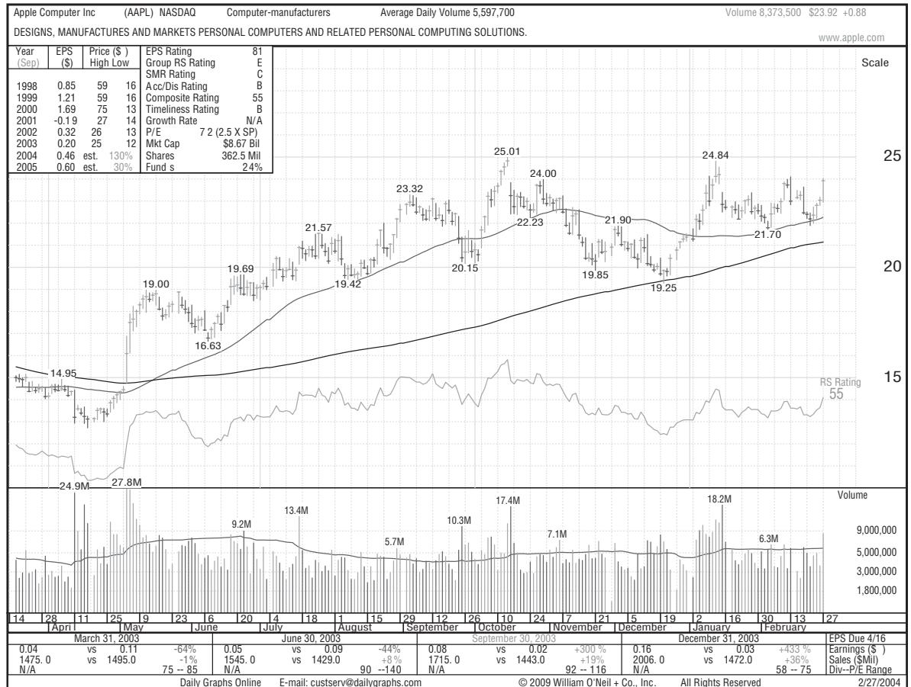

Sea Containers 是一个很突出的例外。它在 1975 年牛市的中段回调中下跌约 50%，随后形成一个形态完美的杯柄结构，并在接下来 101 周里上涨 554%。这只股票盈利增长率达 54%，最新季度业绩大增 192%；1975 年 6 月初我在波士顿向富达研究管理公司做月度演示时，它是我列举的几只经典杯柄股之一。看到这样惊人的数字，一位投资组合经理当即产生了兴趣。

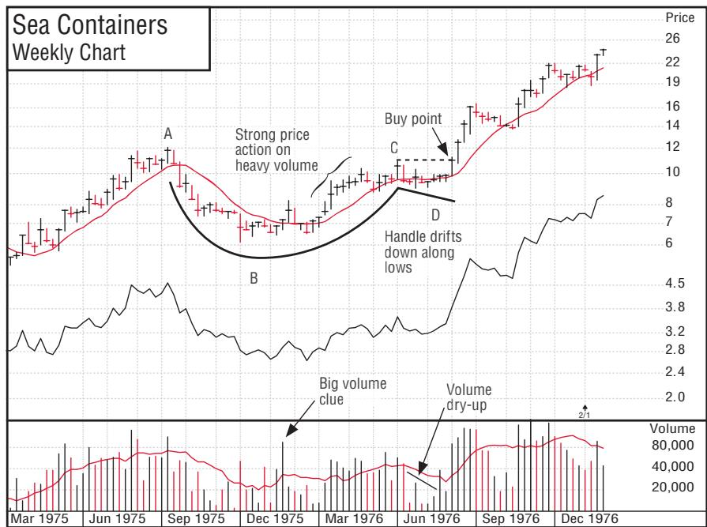

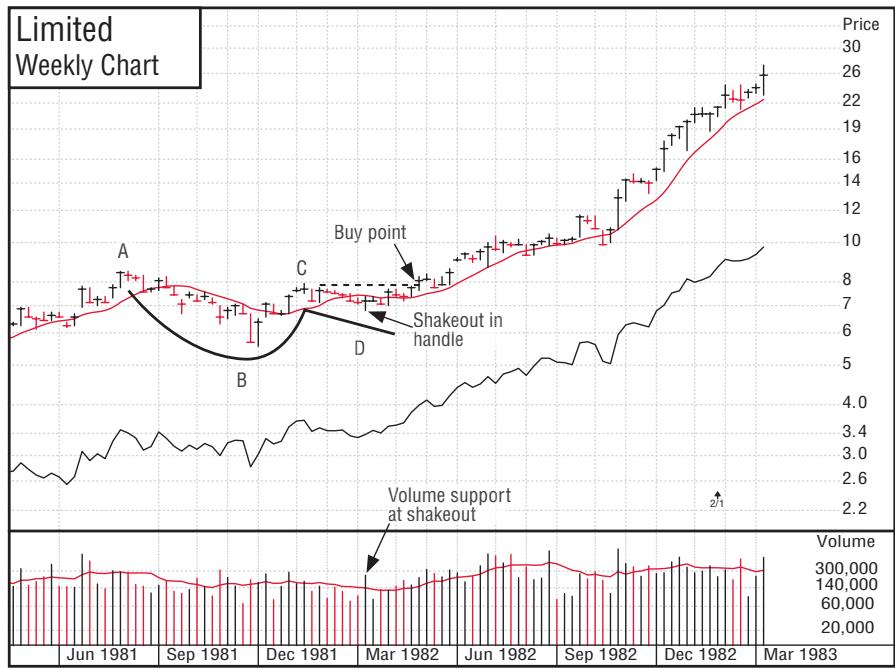

从这个例子可以看出，某些在大盘中段回调或重大熊市中回调了 50% 到 60% 甚至更多的形态，也可能成功。（参见 Sea Containers 和 The Limited 的图表。）在这些情形下，回调的百分比取决于大盘下跌的严重程度，以及该股前期涨幅之巨大。

One of the most important price patterns looks like a cup with a handle when the outline of the cup is viewed from the side. Cup patterns can last from 7 weeks to as long as 65 weeks, but most of them last for three to six months. The usual correction from the absolute peak (the top of the cup) to the low point (the bottom of the cup) of this price pattern varies from around the 12% to 15% range to upwards of 33%. A strong price pattern of any type should always have a clear and definite price uptrend prior to the beginning of its base pattern. You should look for at least a 30% increase in price in the prior uptrend, together with improving relative strength and a very substantial increase in trading volume at some points in the prior uptrend. 

In most, but not all, cases, the bottom part of the cup should be rounded and give the appearance of a “U” rather than a very narrow “V.” This characteristic allows the stock time to proceed through a needed natural correction, with two or three final little weak spells around the lows of the cup. The “U” area is important because it scares out or wears out the remaining weak holders and takes other speculators’ attention away from the stock. A more solid foundation of strong owners who are much less apt to sell during the next advance is thereby established. The accompanying chart from Daily Graphs Online® shows the daily price and volume movements for Apple Computer in February 2004. 

It’s normal for growth stocks to create cup patterns during intermediate declines in the general market and to correct 1½ to 2½ times the market averages. Your best choices are generally stocks with base patterns that deteriorate the least during an intermediate market decline. Whether you’re in a bull market or a bear market, stock downturns that exceed 2½ times the market averages are usually too wide and loose and must be regarded with suspicion. Dozens of former high-tech leaders, such as JDS Uniphase, formed wide, loose, and deep cup patterns in the second and third quarters of 2000. These were almost all faulty, failure-prone patterns signaling that the stocks should have been avoided when they attempted to break out to new highs. 

A very small number of volatile leaders can plunge by as much as 40% or 50% in a bull market. Chart patterns that correct by more than this amount during bull markets have a higher rate of failure if they try to make new price highs and resume their advance. The reason? A downswing of over 50% from a peak to a low means that the stock must increase more than 100% from its low to get back to its old high. Historical research has shown that stocks that make new price highs after such huge moves tend to fail 5% to 15% beyond their breakout prices. Stocks that come straight off the bottom into new highs off cups can be more risky because they had no pullbacks. 

Sea Containers was a glowing exception. It descended about 50% during an intermediate decline in the 1975 bull market. It then formed a perfectly shaped cup-with-handle price structure and proceeded to increase 554% in the next 101 weeks. This stock, with its 54% earnings growth rate and its latest quarterly results up 192%, was one of several classic cup-with-handle stocks that I presented to Fidelity Research & Management in Boston during a monthly meeting in early June 1975. Upon seeing such big numbers, one of the portfolio managers was instantly interested. 

As you can see by this example, some patterns that have corrected 50% to 60% or more coming out of an intermediate bull market decline or a major bear market can succeed. (See the charts for Sea Containers and The Limited.) In these cases, the percent of decline is a function of the severity of the general market decline and the tremendous extent of the stock’s prior price run-up. 

### Basic Characteristics of a Cup’s Handle Area

杯柄区域的形成通常需要一到两周以上，并伴随价格向下漂移或“洗盘”（价格跌破此前几周在柄部创下的低点），通常发生在下漂走势临近尾声时。在柄部回调阶段的低点附近，成交量可能明显萎缩。在牛市中，多数情况下成交量不应在柄部回调期间放大，尽管也有少数例外。

虽然没有柄的杯形失败率略高，但许多股票即使不形成柄部也能成功上涨。此外，1999 年一些波动较大的科技股，在启动大涨之前只形成了仅一两周的柄部。

柄部一旦出现，几乎总是形成于整个底部结构的上半区（以整个底部的绝对高点与杯的绝对低点来衡量）。柄部还应位于该股 10 周移动平均线之上。形成于整个底部下半区、或完全位于 10 周线之下的柄部，是弱势、易失败的。到那时为止，需求还不足以让股票收复此前跌幅的一半以上。

此外，那些持续楔形上倾的柄部（沿价格低点向上漂移，或只是沿低点横向走平而非向下漂移）在突破创新高时失败概率要高得多。这种沿柄部低点向上楔形的行为，使股票在从底部低点涨入形态上半区之后，无法经历必要的洗盘或剧烈回踩。这一高风险特征，往往出现在第三或第四阶段底部、落后股底部，或变得过于广为人知、因而过于显眼的活跃龙头股上。你应当警惕楔形上倾的柄部。

在牛市中，一个合格柄部的价格回落应控制在峰值的 8% 到 12% 以内，除非该股形成了非常巨大的杯形，正如 1975 年 Sea Containers 那个相当罕见的例子。牛市中跌幅超过这一百分比的柄部，看起来宽而反复无常，多数情况下是不合格且有风险的。不过，如果你处在熊市底部最后的洗盘区域，异常疲弱的大盘会使某些柄部区域迅速下跌 20% 到 30%，但只要大盘随后向上确认、形成新的主要上升趋势，该形态仍然可以是健康的。（参见第 9 章“M = 市场方向”。）

The formation of the handle area generally takes more than one or two weeks and has a downward price drift or “shakeout” (where the price drops below a prior low point in the handle made a few weeks earlier), usually near the end of its down-drifting price movement. Volume may dry up noticeably near the lows in the handle’s price pullback phase. During a bull market, volume in the majority of cases should not pick up during a correction in the handle, although there have been some exceptions. 

Although cups without handles have a somewhat higher failure rate, many stocks can advance successfully without forming a handle. Also, some of the more volatile technology names in 1999 formed handles of only one or two weeks before they began their major price advances. 

When handles do occur, they almost always form in the upper half of the overall base structure, as measured from the absolute peak of the entire base to the absolute low of the cup. The handle should also be above the stock’s 10-week moving average price line. Handles that form in the lower half of an overall base or completely below the stock’s 10-week line are weak and failure-prone. Demand up to that point has not been strong enough to enable the stock to recover more than half its prior decline. 

Additionally, handles that consistently wedge up (drift upward along their price lows or just go straight sideways along their lows rather than drifting down) have a much higher probability of failing when they break out to new highs. This upward-wedging behavior along low points in the handle doesn’t let the stock undergo the needed shakeout or sharp price pullback after having advanced from the low of the base into the upper half of the pattern. This high-risk trait tends to occur in third- or fourth-stage bases, in laggard stock bases, or in very active market leaders that become too widely followed and therefore too obvious. You should beware of wedging handles. 

A price drop in a proper handle should be contained within 8% to 12% of its peak during bull markets unless the stock forms a very large cup, as in the rather unusual case of Sea Containers in 1975. Downturns in handles that exceed this percentage during bull markets look wide and erratic and in most cases are improper and risky. However, if you’re in the last shakeout area of a bear market bottom, the unusual general market weakness will cause some handle areas to quickly decline around 20% to 30%, but the price pattern can still be sound if the general market then follows through on the upside, creating a new major uptrend. (See Chapter 9, “M = Market Direction.”) 

### Constructive Patterns Have Tight Price Areas

处于吸筹之中的股票，其价格形态里也应当至少存在一些价格紧凑区。在周线图上，紧凑指的是当周最高价与最低价之间的价差很小，且连续数周收于与前一周收盘价持平或极为接近的水平。如果底部形态里的每一周，最高价与最低价之间的价差都很大，说明它一直处在市场聚光灯下，突破时往往不会成功。然而，业余图表分析者通常注意不到这种差别，而股票可能先上涨 5% 到 15%、吸引进更不挑剔的交易者，然后才猛然破位、以失败告终。

There should also be at least some tight areas in the price patterns of stocks under accumulation. On a weekly chart, tightness is defined as small price variations from high to low for the week, with several consecutive weeks’ prices closing unchanged or remarkably near the previous week’s close. If the base pattern has a wide spread between the week’s high and low points every week, it’s been constantly in the market’s eye and frequently will not succeed when it breaks out. However, amateur chartists typically will not notice the difference, and the stock can run up 5% to 15%, drawing in less-discriminating traders, before it breaks badly and fails. 

### Find Pivot Points and Watch “Volume Percent Change”

当一只股票形成合格的杯柄形态，并随后放量突破向上买点——杰西·利弗莫尔称之为“枢轴点”或“最小阻力线”——当日的成交量应至少比正常水平放大 40% 到 50%。在重大突破中，新的市场龙头成交量比日均量暴增 200%、500% 甚至 1000% 的情况并不罕见。在枢轴点突破时，导致那些价格更高、质量更优的成长型股票出现大幅放量的，几乎总是专业机构的买盘。整整 95% 的公众投资者通常不敢在这样的位置买入，因为这让人害怕、看起来有风险，而且在最高价买入股票似乎相当荒唐。

你的目标不是买在最低价、或接近低点，而是在正确的时间——成功概率最大之时——开始买入。这意味着，在首次建仓之前，你必须学会等待股票上涨并交投于你的买点。如果你要上班，无法时刻盯盘，那么小型报价设备、手机报价或网站报价，都能帮你及时把握潜在的突破点。

制胜的个人投资者会等到这些精确的枢轴点才买入。真正的行情通常正是从这里启动，所有激动人心的走势也由此展开。若你试图在此之前买入，就可能买得过早。许多情况下，股票根本到不了突破点，反而会停滞甚至下跌。你要让股票先向你证明它的强度，然后才投入资金。同样，若你在精确买点之上 5% 到 10% 以外买入，你就是买晚了，多半会在下一次回调中被套。届时，那条自动的 8% 止损规则（参见第 10 章“何时必须卖出并无一例外地止损”）会迫使你卖出，因为股票价格已经过度延伸，没有足够空间去经历一次完全正常的、小幅而急剧的回调。所以，不要养成追高买入的坏习惯。

正确的底部形态中的枢轴买点，通常并不是以股票的历史最高价为基准。多数枢轴点出现在前一个高点之下 5% 到 10% 处。柄部区域的高点决定了大多数买点，而这个高点几乎总略低于底部的实际高点。这一点务必牢记。若你等待实际的新高价出现，往往会买得太晚。有时，你可以通过从整个形态的绝对高点向下画一条趋势线、横跨股票开始构筑柄部的高点，从而抢得一点先机。几周后趋势线被向上突破时，你便开始买入。不过，要做到这一点，你在图表与股票分析上必须判断正确。

When a stock forms a proper cup-with-handle chart pattern and then charges through an upside buy point, which Jesse Livermore referred to as the “pivot point” or “line of least resistance,” the day’s volume should increase at least 40% to 50% above normal. During major breakouts, it’s not uncommon for new market leaders to show volume spikes 200%, 500%, or 1,000% greater than the average daily volume. In almost all cases, it’s professional institutional buying that causes the big, above-average volume increases in the better-priced, better-quality growth-oriented stocks at pivot breakouts. A full 95 percent of the general public is usually afraid to buy at such points because it’s scary and it seems risky and rather absurd to buy stocks at their highest prices. 

Your objective isn’t to buy at the cheapest price or near the low, but to begin buying at exactly the right time, when your chances for success are greatest. This means that you have to learn to wait for a stock to move up and trade at your buy point before you make an initial commitment. If you work and cannot watch the market constantly, small quote devices or quotes available on cell phones and Web sites will help you stay on top of potential breakout points. 

The winning individual investor waits to buy at these precise pivot points. This is where the real move generally starts and all the exciting action begins. If you try to buy before this point, you may be premature. In many cases the stock will never get to its breakout point, but rather will stall or actually decrease in price. You want a stock to prove its strength to you before you invest in it. Also, if you buy at more than 5% to 10% past the precise buy point, you are buying late and will more than likely get caught in the next price correction. Your automatic 8% loss-cutting rule (see Chapter 10, “When You Must Sell and Cut Every Loss . . . Without Exception”) will then force you to sell because the stock was extended in price and didn’t have enough room to go through a perfectly normal sharp but minor correction. So don’t get into the bad habit of chasing stocks up too high. 

Pivot buy points in correct chart base patterns are not typically based on a stock’s old high price. Most of them occur at 5% to 10% below the prior peak. The peak price in the handle area is what determines most buy points, and this is almost always somewhat below the base’s actual high. This is very important to remember. If you wait for an actual new high price, you will often buy too late. Sometimes you can get a slight head start by drawing a downtrend line from the overall pattern’s absolute peak downward across the peak where the stock begins building the handle. Then begin your purchase when the trend line is broken on the upside a few weeks later. However, you have to be right in your chart and stock analysis to get away with this. 

### Look for Volume Dry-Ups Near the Lows of a Price Pattern

几乎所有的合格底部，都会在形态最低点附近、以及柄部低位区或最后几周，出现一两周极为明显的成交量枯竭。这意味着抛压已经耗尽，流入市场的股票极少。处于吸筹之中的健康股票，几乎总会显现这一征兆。价格紧凑（每日或每周收盘价彼此非常接近）与关键位置成交量枯竭的组合，通常相当有建设性。

Nearly all proper bases will show a dramatic drying up of volume for one or two weeks along the very low of the base pattern and in the low area or few last weeks of the handle. This means that all of the selling has been exhausted and there is very little stock coming into the marketplace. Healthy stocks that are under accumulation almost always show this symptom. The combination of tightness in prices (daily or weekly price closes being very near each other) and dried-up volume at key points is generally quite constructive. 

### Big Volume Clues Are Valuable

对训练有素的图表专家而言，另一个有价值的线索是日线和周线上出现的巨量脉冲。微软就是个例子：这只出色的股票在暴涨之前，刚刚闪现了沉重的吸筹。

数周放量上涨、另一些周又出现极端缩量的组合，同样是非常有建设性的信号。如果你把 Daily Graphs Online 图表服务与周线图结合使用，就能看到有时仅发生在某一天的异常交易活动。微软在突破 31½ 买点的那天，成交量比均值高出 545%，显示出真正重要的机构买盘。此后它开启了一轮长达 13 年的大牛市，从拆股调整后的 10 美分涨到 53.98 美元。这样的涨幅够惊人吧？

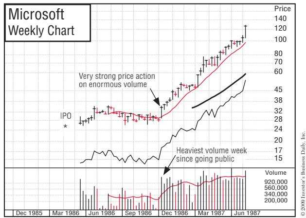

成交量是个了不起的话题，值得仔细研究。它能帮你辨识一只股票是处于吸筹（机构买入）还是派发（机构卖出）。一旦掌握这项技能，你就不必再依赖分析师和所谓专家的个人意见。关键位置的大成交量是不可或缺的。

成交量是衡量供需与机构支持的最佳指标——这是成功股票分析的两个关键要素。要学会用图表来正确把握买入时机。在错误的时间买入，更糟的是买入并未处于吸筹之中、或形态不健康、有缺陷的股票，代价实在太大。

下次你考虑买入一只股票时，先看看它的周成交量。在图表底部内，若该股在高于均量的周数上收涨的周数，多于在高于均量的周数上收跌的周数，通常是有建设性的信号。

Another clue that is valuable to the trained chart specialist is the occurrence of big daily and weekly volume spikes. Microsoft is an example of an outstanding stock that flashed heavy accumulation just before a huge run-up. 

Weeks of advancing prices on heavy volume, followed in other weeks by extreme volume dry-ups, are also a very constructive sign. If you use a Daily 

Graphs Online chart service in conjunction with the weekly graphs, you’ll be able to see unusual trading activity that sometimes happens on only one day. The day Microsoft broke out at its 31½ buy point, its volume was 545% above average, signaling really important institutional buying. It then had a 13-year bull run from a split-adjusted 10 cents to \$53.98. How’s that for a big percentage move? 

Volume is a remarkable subject that is worthy of careful study. It can help you recognize whether a stock is under accumulation (institutional buying) or distribution (institutional selling). Once you acquire this skill, you won’t have to rely on the personal opinions of analysts and supposed experts. Big volume at certain key points is indispensable. 

Volume is your best measure of supply and demand and institutional sponsorship—two vital ingredients in successful stock analysis. Learn how to use charts to time your purchases correctly. Making buys at the wrong time or, worse, buying stocks that are not under accumulation or that have unsound, faulty price patterns is simply too costly. 

The next time you consider buying a stock, check its weekly volume. It’s usually a constructive sign when the number of weeks that the stock closes up in price on above-average weekly volume outnumbers the number of weeks that it closes down in price on above-average volume while still in its chart base. 

### A Few Normal-Size Cups with Handles

德州仪器、苹果、General Cable 和 Precision Castparts，在形态的长度与深度上都很相似。你能看出苹果与 Precision Castparts 之间的相似之处吗？当你学会更娴熟地做到这一点，将来就能像识别这些过去的赢家一样，辨认出许多杯柄形。

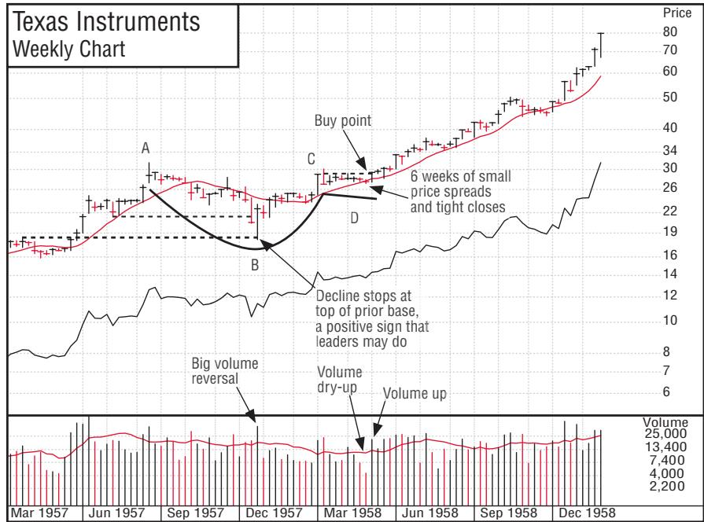

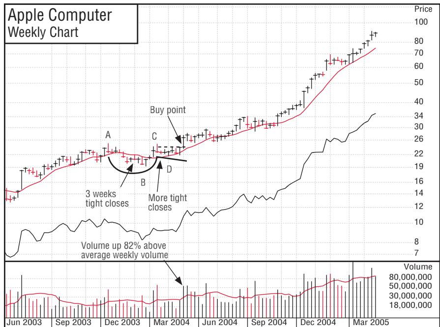

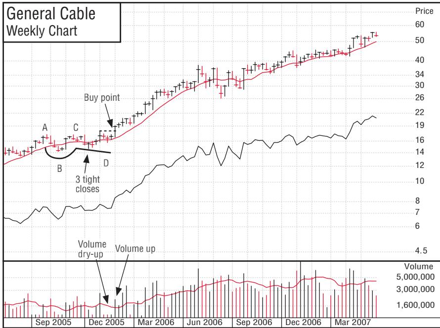

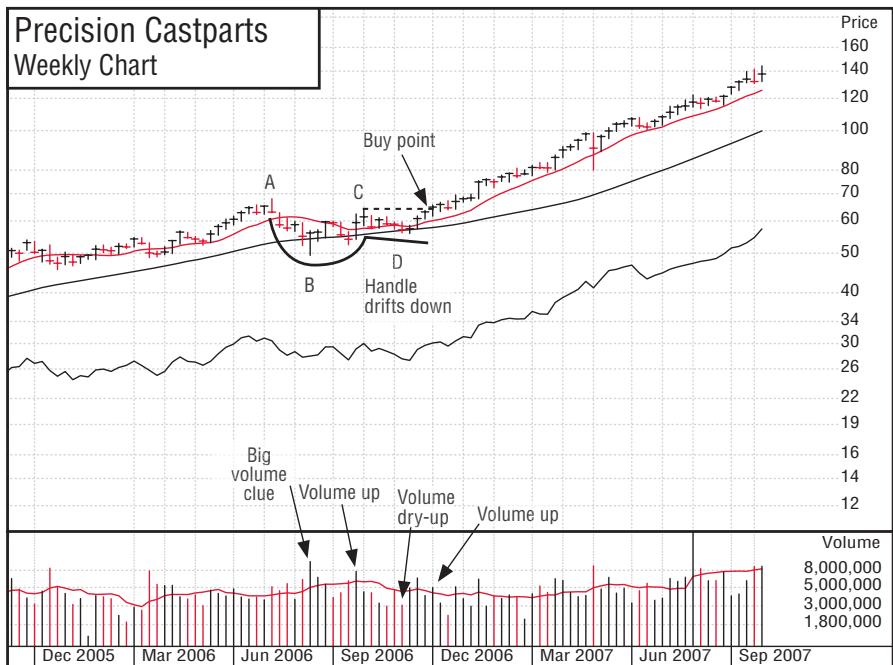

Texas Instruments, Apple, General Cable, and Precision Castparts were all similar-size patterns in length and depth. Can you recognize the similarity between Apple and Precision Castparts? As you learn to do this with greater skill, you will in the future be able to spot many cup with handles just like these past winners. 

### The Value of Market Corrections

> **中文标题：** 市场回调的价值

**中文翻译（导语）**

由于 80% 到 90% 的价格形态都在市场回调期间形成，你绝不应在中级抛售、短期或长期熊市中灰心丧气、放弃股市的潜力。美国总会复苏，靠的是它的发明家与企业家，以及那种在共产或独裁国家并不存在的、完全的自由与无限的机会。

熊市可能只持续三、六或九个月，也可能长达两年，极少数情况下会持续三年。若你仔细遵循本书的卖出规则，就会在每一轮新熊市的早期卖出并锁定大部分利润、截断亏损、筹集大量现金，并脱离保证金（借来的钱）（参见书末的成功案例）。

事实上，《投资者商业日报》在 2008 年底做了四次调查，结果显示约 60% 的 IBD 订户在 2007 年 12 月或 2008 年 6 月运用我们的规则卖出并筹集现金，从而在 2008 年底由次贷危机引发的更严重下跌之前，保住了大部分本金。

即使你完全清仓、转为持币，也绝不要对股票投资彻底放弃，因为熊市会在新股票中创造新的底部，其中一些可能成为下一轮的 1000% 大赢家。当一生中最重大的机会正在酝酿、可能迟早近在眼前时，你却愚蠢地放弃，那就太可惜了。

熊市正是对先前决策做复盘的时候。在日线或周线图上，标出你过去一年做过的每一笔股票的精确买卖位置。研究你的决策，写下一些新规则，让自己避免上一轮所犯的错误。然后研究几只看走眼或没处理好的最大赢家，制定一些规则，确保在下一轮牛市里买入真正的龙头、并正确操作它们。它们一定会出现，而现在正是留意它们开始构筑底部的时候。问题在于：届时你是否已备好一套深思熟虑的作战计划，去充分把握它们。

**英文原文（导语）**

Since 80% to 90% percent of price patterns are created during periods of market corrections, you should never get discouraged and give up on the stock market’s potential during intermediate-term sell-offs or short or prolonged bear markets. America always comes back because of its inventors and entrepreneurs and the total freedom and unlimited opportunity that do not exist in communist or dictator-controlled countries. 

Bear markets can last as little as three, six, or nine months or as long as two or, in very rare cases, three years. If you follow the sell rules in this book carefully, you will sell and nail down most of your profits, cut short any losses, raise significant cash, and move off margin (borrowed money) in the early stages of each new bear market (see the success stories at the end of the book). 

In fact, Investor’s Business Daily conducted four surveys in late 2008 that indicated that about 60% of IBD subscribers used our rules to sell and raise cash in December 2007 or June 2008 and thereby preserved most of their capital prior to the more serious decline in late 2008 that resulted from the subprime loan debacle. 

Even if you sell out completely and move to cash, you never want to throw in the towel on stock investing because bear markets create new bases in new stocks, some of which could be the next cycle’s 1,000% winners. You don’t foolishly give up while the greatest opportunities of a lifetime are setting up and may sooner or later be just around the corner. 

A bear market is the time to do a postanalysis of your prior decisions. Plot on daily or weekly charts exactly where you bought and sold all the stocks you traded in the past year. Study your decisions and write out some new rules that will let you avoid the mistakes you made in the past cycle. Then study several of the biggest winners that you missed or mishandled. Develop some rules to make sure that you buy the real leaders and handle them right in the next bull market cycle. They will be there, and this is the time to be watching for them as they begin to form bases. The question is whether you will be there with a carefully thought-through game plan to totally capitalize on them. 

### Other Price Patterns to Look For

其他值得留意的价格形态

### How to Spot a “Saucer-with-Handle” Price Pattern

所谓“带柄浅碟形”，是一种与杯柄形相似的形态，只是浅碟部分往往延续更长时间，使形态变得更浅。（如果“杯柄形”和“带柄浅碟形”这些名称听起来古怪，不妨想想：多年来你一直认得并称之为“北斗七星”和“小北斗”的某些星座，不也是如此命名吗？）1967 年 4 月的 Jack Eckerd，就是带柄浅碟形底部的例子。

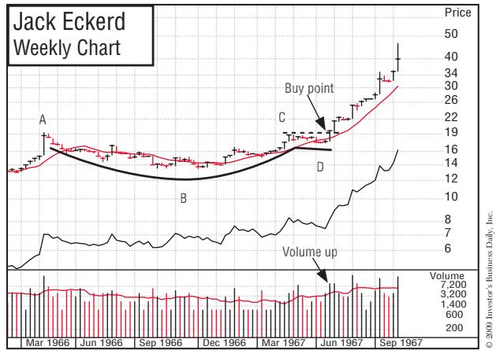

A “saucer with handle” is a price pattern similar to the cup with handle except that the saucer part tends to stretch out over a longer period of time, making the pattern shallower. (If the names “cup with handle” and “saucer with handle” sound unusual, consider that for years you have recognized and called certain constellations of stars the “Big Dipper” and the “Little Dipper.”) Jack Eckerd in April 1967 was an example of the saucer-with-handle base. 

### Recognizing a “Double-Bottom” Price Pattern

“双重底”形态看上去像字母“W”。这种形态出现的频率不如杯柄形，但仍然相当常见。通常重要的是：W 的第二个底要与第一个底的价格水平（低点）持平，或在几乎所有情况下明确地比它低一两点，从而清洗掉较弱的投资者。未能跌破则可能形成有缺陷、更易失败的“近乎”双重底。双重底也可能带柄，尽管柄部并非必需。

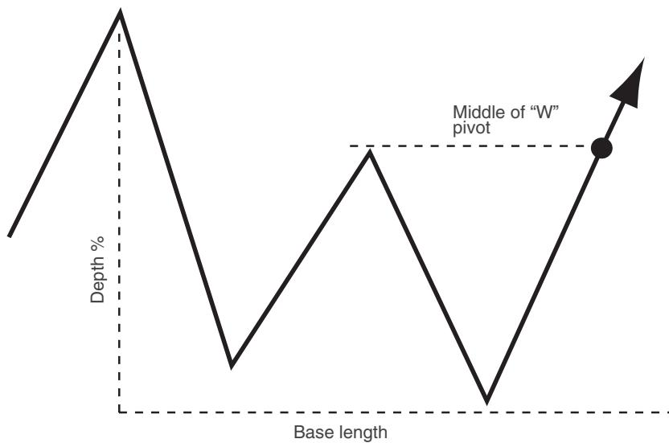

双重底的深度和横向长度与杯形相近。双重底的枢轴买点位于 W 的右上侧，即股票在第二腿下跌后回升之处。枢轴点的价格应等于 W 中间峰的高度，而该峰应止步于形态峰值价格略下方一点。若双重底带柄，则由柄部的峰价决定枢轴买点。请参见随附的 Dome Petroleum、Price Co. 和思科系统图表——它们分别是 1977、1982 和 1990 年出现的出色双重底形态。稍晚的例子有 EMC、NVR 和 eBay。

就双重底形态而言，适用如下符号：A = 底部起点；B = 第一腿的底；C = W 的中部（确定买点）；D = 第二腿的底。若双重底带柄，则 E = 柄部顶端（确定买点），F = 柄部底端。

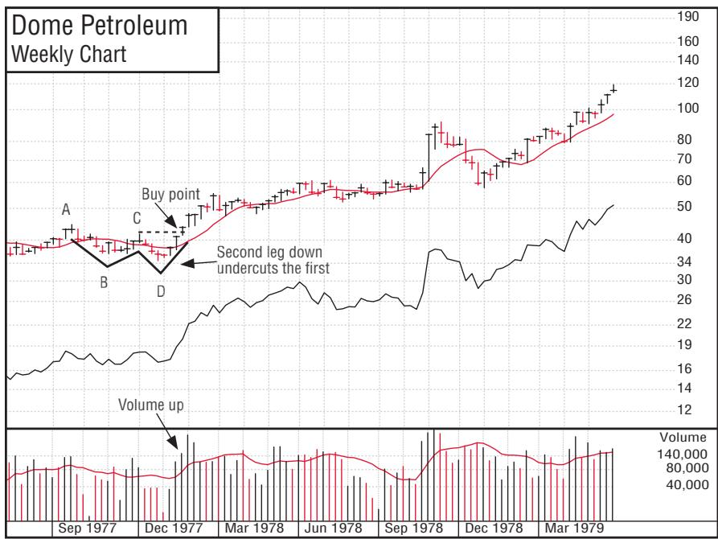

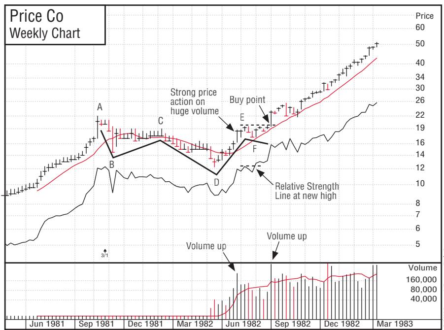

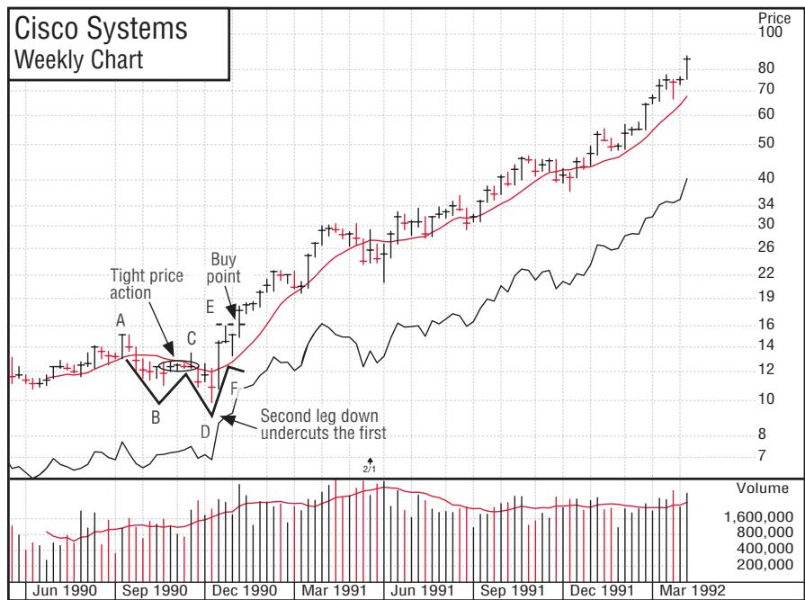

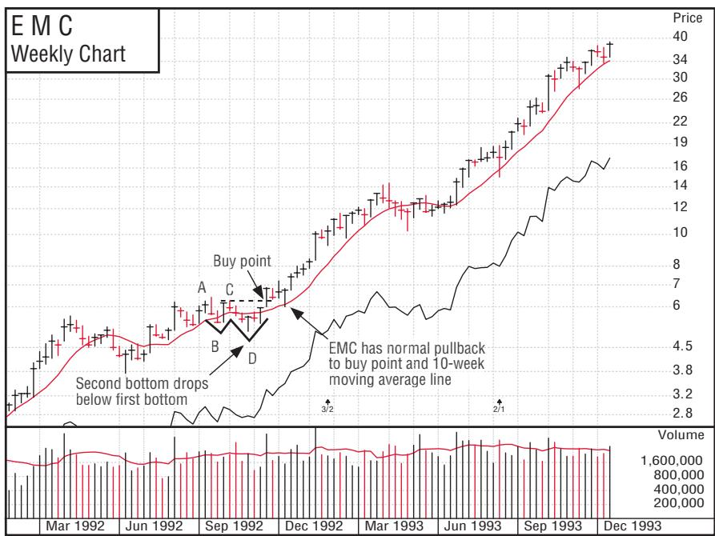

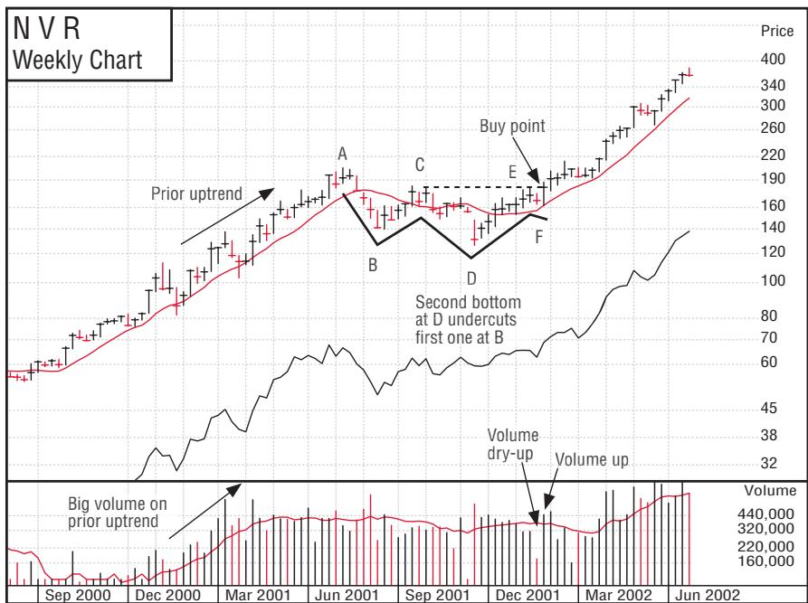

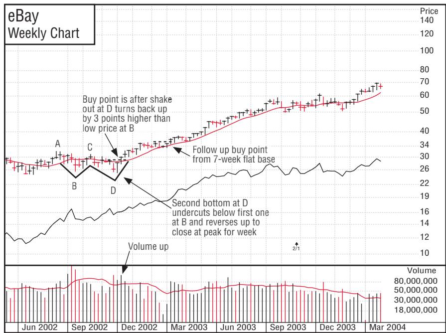

A “double-bottom” price pattern looks like the letter “W.” This pattern also doesn’t occur quite as often as the cup with handle, but it still occurs frequently. It is usually important that the second bottom of the W match the price level (low) of the first bottom or, as in almost all cases, clearly undercut it by one or two points, thereby creating a shakeout of weaker investors. Failure to undercut may create a faulty, more failure-prone “almost” double bottom. Double bottoms may also have handles, although this is not essential. 

The depth and horizontal length of a double bottom are similar to those of the cup formation. The pivot buy point in a double bottom is located on the top right side of the W, where the stock is coming up after the second leg down. The pivot point should be equal in price to the top of the middle peak of the W, which should stop somewhere a little below the pattern’s peak price. If the double bottom has a handle, then the peak price of the handle determines the pivot buy point. See the accompanying charts for Dome Petroleum, Price Co. and Cisco Systems for outstanding examples of double-bottom price patterns found during 1977, 1982, and 1990. Some later examples are EMC, NVR, and eBay. 

For double-bottom patterns, the following symbols apply: A = beginning of base; B = bottom of first leg; C = middle of W that sets the buy point; D = bottom of second leg. If the double-bottom pattern has a handle, then E = top of the handle (sets the buy point) and F = bottom of the handle. 

### Definition of a “Flat-Base” Price Structure

平底是另一种颇有回报的价格结构。它通常是第二阶段底部，出现在股票从杯柄形、带柄浅碟形或双重底上涨 20% 或更多之后。平底在至少五到六周内于相当紧凑的价格区间内横盘，回调不超过 10% 到 15%。1979 年 5 月的俄亥俄标准石油、1978 年 3 月的 Smith-Kline，以及 1982 年的 Dollar General，都是平底的好例子。

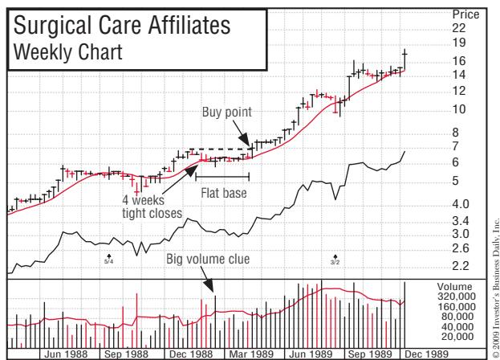

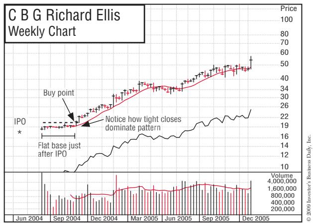

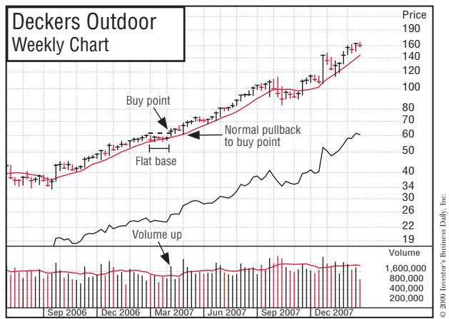

Pep Boys 在 1981 年 3 月形成了一个较长的平底。如果你错过了某只股票从杯柄形发起的首次突破，就该继续留意它。它迟早可能形成一个平底，给你第二次上车的机会。这里再举几个较近的例子：Surgical Care Affiliates、CB Richard Ellis 和 Deckers Outdoor。

A flat base is another rewarding price structure. It is usually a second-stage base that occurs after a stock has advanced 20% or more off a cup with handle, saucer with handle, or double bottom. The flat base moves straight sideways in a fairly tight price range for at least five or six weeks, and it does not correct more than 10% to 15%. Standard Oil of Ohio in May 1979, Smith - Kline in March 1978, and Dollar General in 1982 are good examples of flat 

bases. Pep Boys in March 1981 formed a longer flat base. If you miss a stock’s initial breakout from a cup with handle, you should keep your eye on it. In time it may form a flat base and give you a second opportunity to get on board. Here are a few more recent examples: Surgical Care Affiliates, CB Richard Ellis, and Deckers Outdoor.

### Here’s a New Base We’ve Dubbed a Square Box

从杯柄形或双重底上行之后，这种形态通常持续四到七周，跌幅不大（一般只有 10% 到 15%），并呈方方正正的箱形外观。我多年来注意到它，最终才加以研究、度量和归类。举几个例子：Lorillard、Korvette、德州仪器、家得宝、戴尔和 Taro。

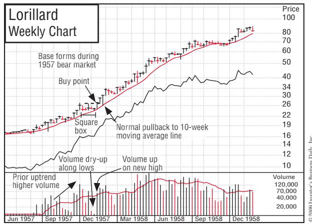

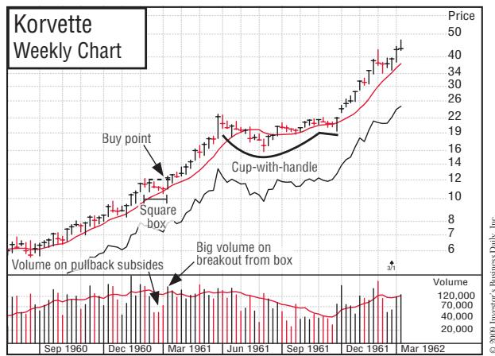

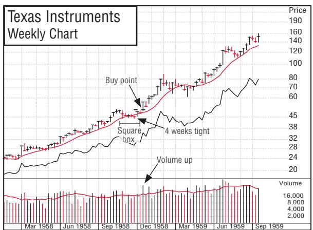

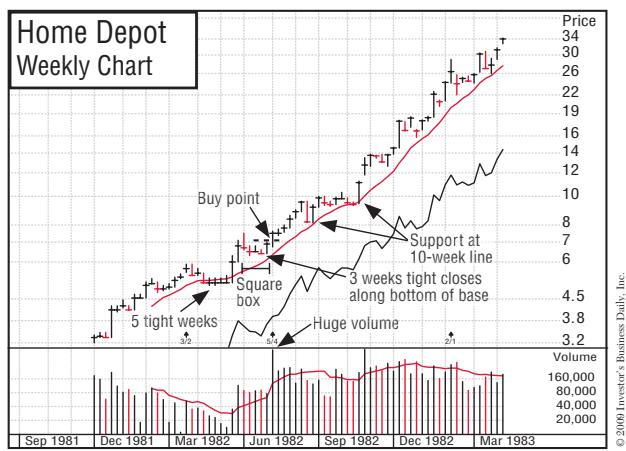

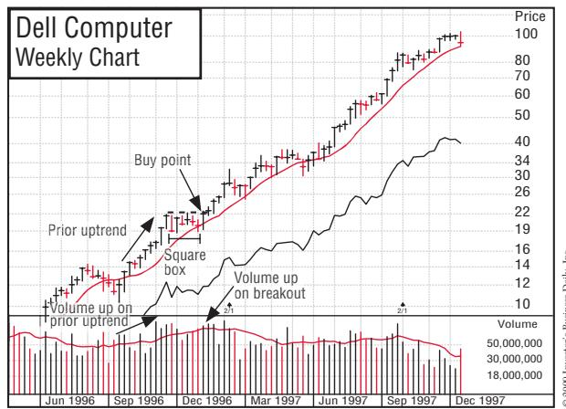

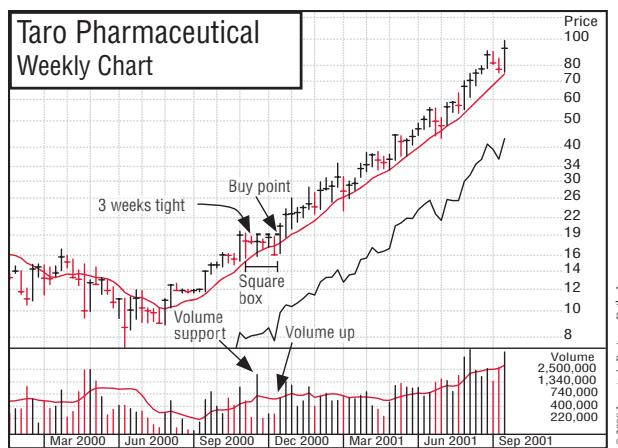

After moving up from a cup with handle or double bottom, this formation typically lasts from four to seven weeks; doesn’t correct too much, usually only 10% to 15%; and has a square, boxy look. I’ve noted this over recent years, but finally we’ve studied, measured, and classified it. Here are some examples: Lorillard, Korvette, Texas Instruments, Home Depot, Dell, and Taro. 

### High, Tight Flags Are Rare

“高而紧的旗形”十分罕见，一轮牛市中至多出现在少数股票上。它起初表现为股票在极短时间（四到八周）内普遍上涨 100% 到 120%，随后横向回调不超过 10% 到 25%，通常历时三、四或五周。

这是最强的形态，但也非常危险、难以正确解读。许多股票能从这个形态上暴涨 200% 甚至更多。（参见 Bethlehem Steel，1915 年 5 月；American Chain & Cable，1935 年 10 月；E. L. Bruce，1958 年 6 月；Zenith，1958 年 10 月；Universal Controls，1958 年 11 月；Certain-teed，1961 年 1 月；Syntex，1963 年 7 月；Rollins，1964 年 7 月；Simmonds Precision，1965 年 11 月；Accustaff，1995 年 1 月；Emulex，1999 年 10 月；JDS Uniphase，1999 年 10 月；Qualcomm，1999 年 12 月；Taser International，2003 年 11 月；以及 Google，2004 年 9 月的图表。每一个较早的形态都是较晚形态的前例，所以要仔细研究它们。

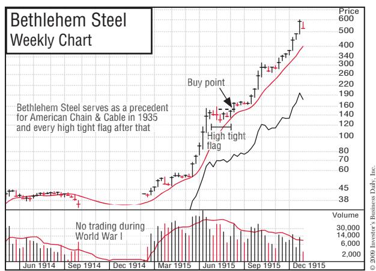

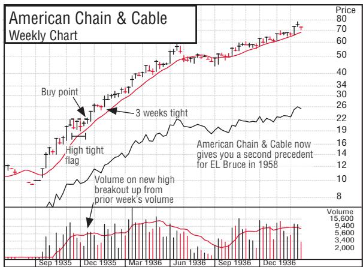

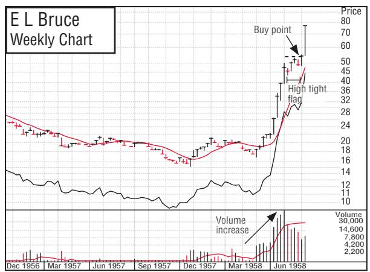

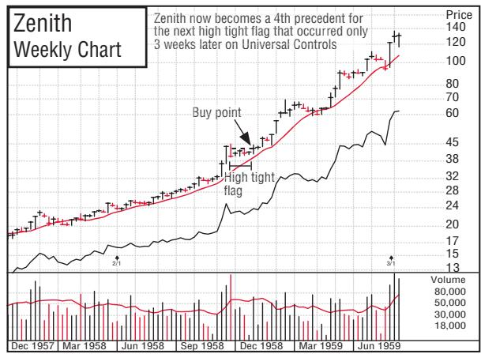

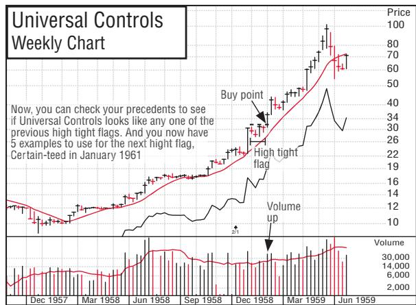

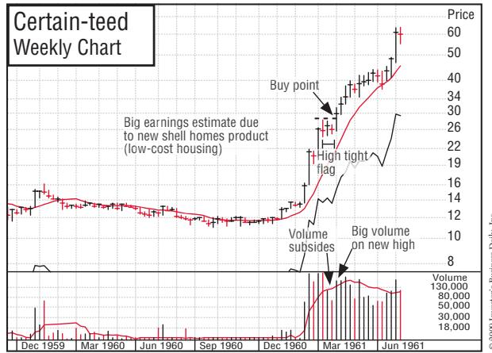

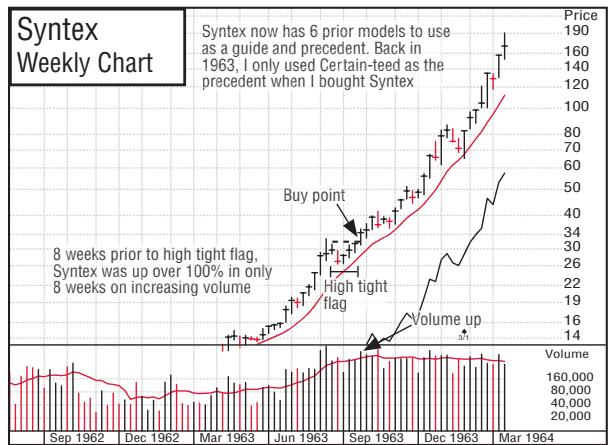

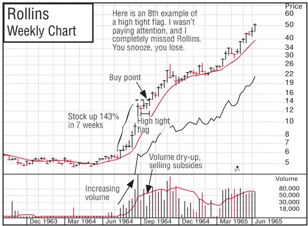

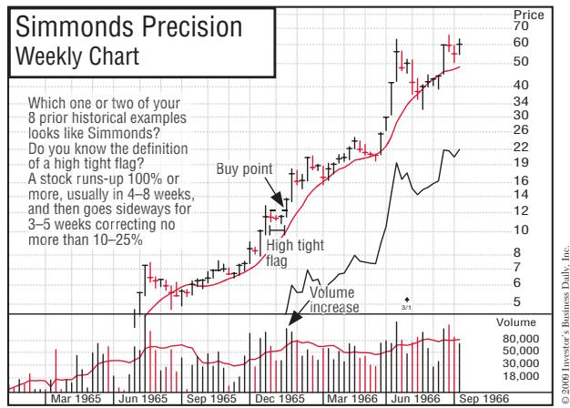

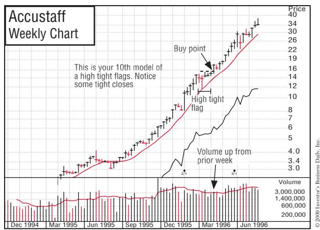

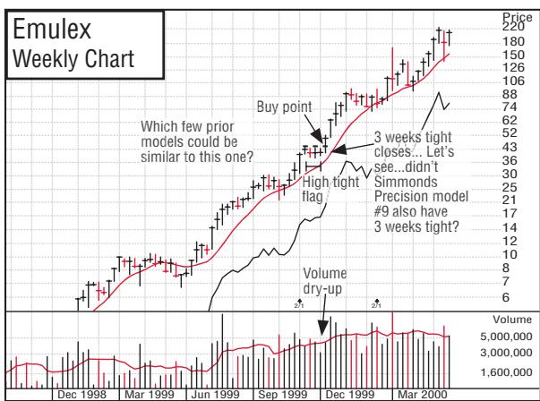

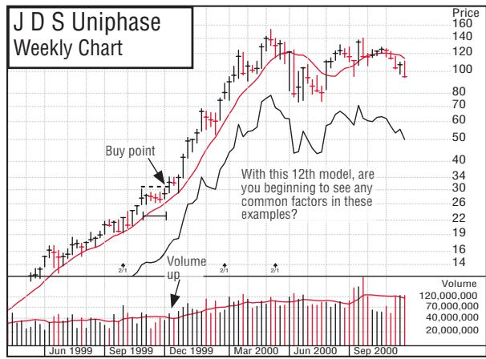

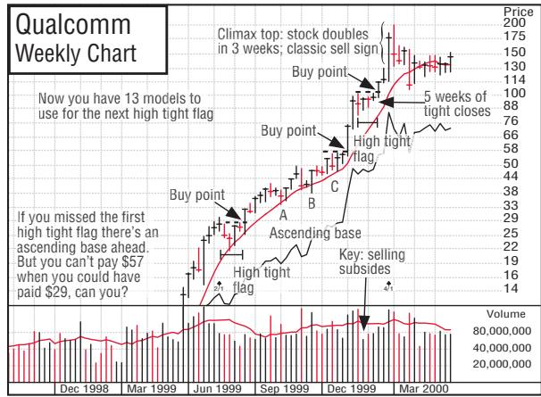

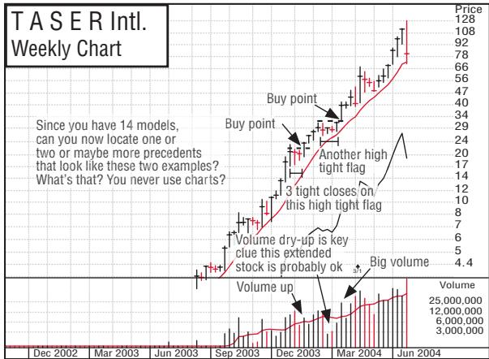

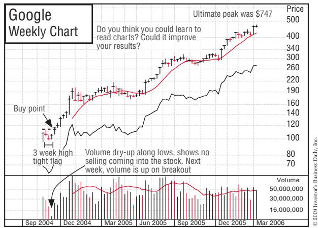

1958 年第二季度约 50 美元处的 E. L. Bruce 形态，为 1961 年 Certain-teed 的上涨提供了完美的形态前例。而 Certain-teed 又反过来成为我在 1963 年 7 月买入第一只超级赢家 Syntex 时所参照的图表范本。

A “high, tight flag” price pattern is rare, occurring in no more than a few stocks during a bull market. It begins with the stock moving generally 100% to 120% in a very short period of time (four to eight weeks). It then corrects sideways no more than 10% to 25%, usually in three, four, or five weeks. 

This is the strongest of patterns, but it’s also very risky and difficult to interpret correctly. Many stocks can skyrocket 200% or more off this formation. (See the charts for Bethlehem Steel, May 1915; American Chain & Cable, October 1935; E. L. Bruce, June 1958; Zenith, October 1958; Universal Controls, November 1958; Certain-teed, January 1961; Syntex, July 1963; Rollins, July 1964; Simmonds Precision, November 1965; Accustaff, January 1995; Emulex, October 1999; JDS Uniphase, October 1999; Qualcomm, December 1999; Taser International, November 2003; and Google, September 2004. Each earlier pattern serves as a precedent for each later pattern, so study them carefully. 

The E. L. Bruce pattern in the second quarter of 1958, at around \$50, provided a perfect chart pattern precedent for the Certain-teed advance that occurred in 1961. Certain-teed, in turn, became the chart model that I used to buy my first super winner, Syntex, in July 1963.

### What Is a Base on Top of a Base?

在熊市后期，一种看似负面的状况，却往往预示着新牛市中可能出现的强势新龙头。我把这种罕见的情形称为“底上底”。

具体情形是：一只强势股票突破底部并上涨，却因大盘又开启一轮下跌而无法走出正常的 20% 到 30% 涨幅。于是它在价格上回落，在前一个底部正上方构筑出第二个来回震荡的整理区，而此时大盘指数还在不断创新低。

当大盘的熊市阶段结束（它总会在某个时点结束），这只股票往往是最先创出新高、并由此踏上巨大涨幅的股票之一。它就像一根被重物压住的弹簧：一旦重物（此处即熊市）移开，弹簧便可自由地去完成它一直想做的事。这又是一个例子，说明为什么对市场动怒、情绪失控或丧失信心是愚蠢的。下一场大赛跑，可能就在几个月之后。

1978 年，我们机构服务公司两个最好的想法——M/A-Com 和波音——都呈现底上底形态，一只上涨 180%，另一只上涨 950%。Ascend Communications 和甲骨文也是底上底的例子。在 1994 年 12 月熊市底部突破后，Ascend 在 17 个月内飙升近 1500%。甲骨文则在 1999 年 10 月重现同样的底上底形态，猛涨近 300%。1934 年大萧条尾声，可口可乐也做过同样的事。

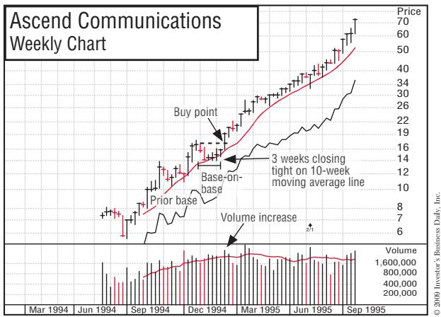

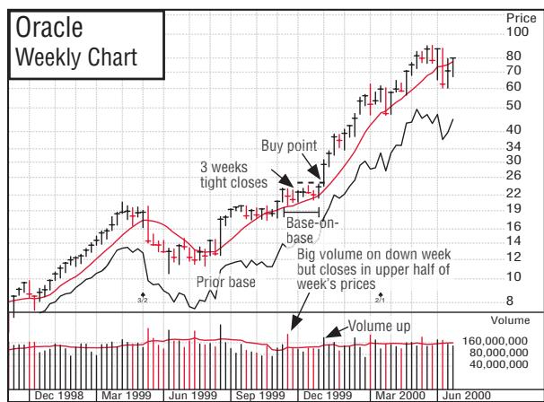

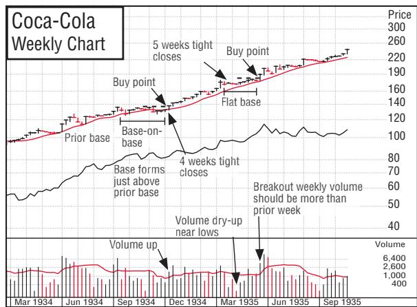

During the latter stages of a bear market, a seemingly negative condition flags what may be aggressive new leadership in the new bull phase. I call this unusual case a “base on top of a base.” 

What happens is that a powerful stock breaks out of its base and advances, but is unable to increase a normal 20% to 30% because the general market begins another leg down. The stock therefore pulls back in price and builds a second back-and-forth price consolidation area just on top of its previous base while the general market averages keep making new lows. 

When the bearish phase in the overall market ends, as it always does at some point, this stock is apt to be one of the first to emerge at a new high en route to a huge gain. It’s like a spring that is being held down by the pressure of a heavy object. Once the object (in this case, a bear market) is removed, the spring is free to do what it wanted to do all along. This is another example of why it’s foolhardy to get upset and emotional with the market or lose your confidence. The next big race could be just a few months away. 

Two of our institutional services firm’s best ideas in 1978—M/A-Com and Boeing—showed base-on-top-of-a-base patterns. One advanced 180%, the other 950%. Ascend Communications and Oracle were other examples of a base on top of a base. After breaking out at the bear market bottom of December 1994, Ascend bolted almost 1,500% in 17 months. Oracle repeated the same base-on-base pattern in October 1999 and zoomed nearly 300%. Coming out of the Depression in 1934, Coca-Cola did the same thing. 

### Ascending Bases

上升底部与平底一样，出现在股票从杯柄形或双重底突破之后、上行途中的半程。它包含三次 10% 到 20% 的回调，且每次抛售的低点都高于前一次，因此我称其为上升底部。

每一次回调，通常都是因为当时大盘正在下跌。

波音在 1954 年第二季度形成一个 13 周的上升底部，随后股价翻倍。移动房屋建造商 Redman Industries 在 1968 年第一季度出现 11 周的上升底部，随后在短短 37 周内上涨 500%。美国在线在 1999 年第一季度形成同类底部，延续了自 1998 年 10 月 14 周杯柄形突破后、最终达 500% 的涨势。

可见，历史确实会重演。你了解并辨识的历史形态越多，在未来的市场中就越有可能赚到更多的钱。（参见第 1 章的图表范例，以及 Simmonds Precision、Monogram Industries、Redman Industries、美国在线和 Titanium Metals。）

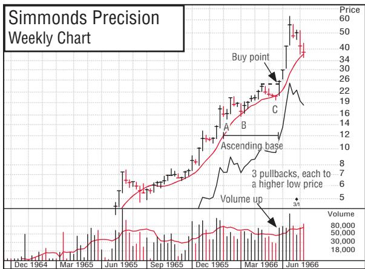

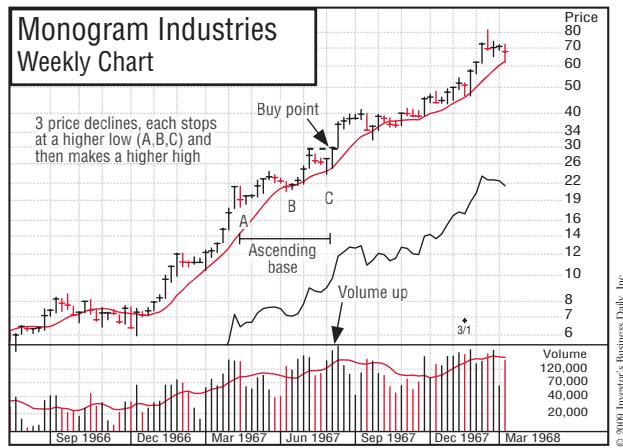

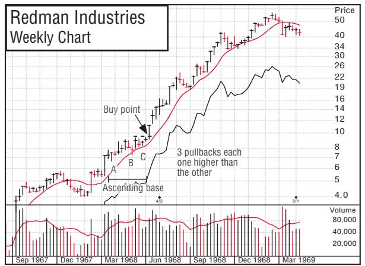

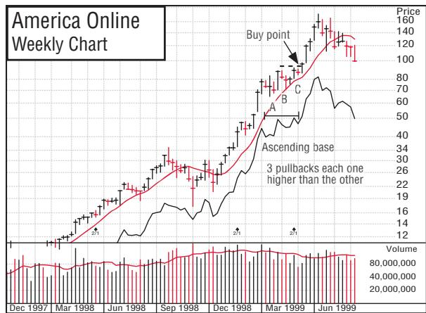

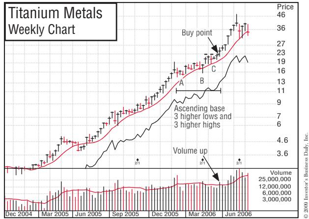

Ascending bases, like flat bases, occur midway along a move up after a stock has broken out of a cup-with-handle or double-bottom base. They have three pullbacks of from 10% to 20%, with each low point during the sell-off in price being higher than the preceding one, which is why I call them ascending bases. 

Each of the pullbacks usually occurs because the general market is declining at that time. 

Boeing formed a 13-week ascending base in the second quarter of 1954 and then doubled in price. Redman Industries, a builder of mobile homes, had an 11-week ascending base in the first quarter of 1968 and proceeded to increase 500% in just 37 weeks. America Online created the same type of base in the first quarter of 1999 and resumed what turned out to be a 500% run-up from the breakout of a 14-week cup with handle in October 1998. 

So you see, history does repeat itself. The more historical patterns you know and come to recognize, the more money you should be able to make in future markets. (See the chart examples in Chapter 1, and also Simmonds Precision, Monogram Industries, Redman Industries, America Online, and Titanium Metals. 

### Wide-and-Loose Price Structures Are Failure Prone

看起来宽而松散的图表通常会失败，但之后也可能变得紧凑。New England Nuclear 和 Houston Oil & Minerals 就是两只在宽、松、反复无常的价格运动之后趋于紧凑的股票。我举这两个例子，是因为当时我错过了它们。回顾自己错过的大赢家，弄清为什么在它们形态完美、即将起飞时没能认出，永远是有益的。

New England Nuclear 形成了一个宽、松、有缺陷的形态，从 A、B、C、D、E 各点看像是双重底。它从起点 A 到 D 点下跌约 40%，跌幅过大，且耗时太久——将近六个月才见底。注意它的相对强度线（RS）在整个缺陷形态中持续下滑这一额外线索。在 E 点买入是错的。柄部也太短，没有向下漂移形成洗盘，而是沿低点楔形上倾。

随后 New England Nuclear 从 E 点经 F 到 G 形成第二个底部。但若你试图在 G 点买入，就又一次错了——因为形态仍然宽而松，买得过早。从 E 到 F 是一段漫长的下跌，相对强度严重恶化。从 F 点底部直线上冲到虚假突破点 G 又太快、太反复无常，只用了三个月。三个月相对强度改善，对比此前 17 个月的下跌，不足以把先前的不良趋势扭转为正面。

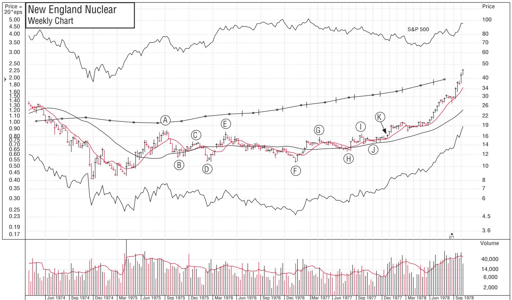

之后股票从 G 点跌到 H 点，形成似乎是 E-F-G 杯形的柄部区域。若你在突破尝试中的 I 点买入，又会再次失败。原因：柄部太松，回撤了 20%。不过，在又一次失败之后，股票终于在 I-J-K 各点间使价格结构变得紧凑，15 周后在 K 点突破一个紧凑健康的底部，此后股价几乎翻了三倍。注意从 K 点回溯到 F 点的 11 个月里，该股强劲的上升趋势和显著改善的相对强度线。

所以，买入股票确实有正确与错误之分，而要理解这种差别，需要下一番功夫。股市里没有一夜成名的成功，成功与听信他人消息或运气好坏毫不相干。你必须学习、做好准备，才能靠自己的投资取得成功。所以，让自己更有知识。开始时并不容易，但回报可能非常丰厚。任何人都能学会，你也能。相信自己的学习能力，抛弃过去那些行不通的假设。

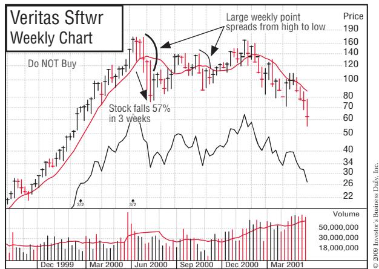

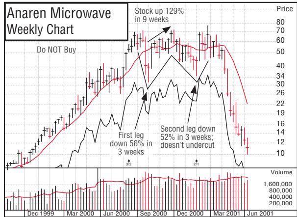

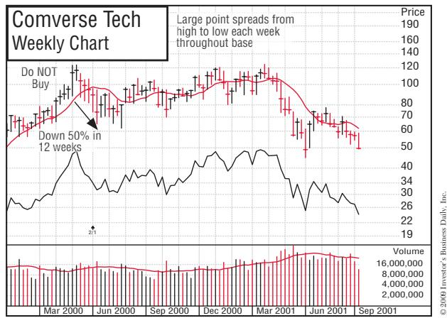

以下是 2000 年 3 月开始的漫长熊市中，曾诱人买入的一些宽而松的缺陷形态：Veritas Software（2000 年 10 月 20 日）、Anaren Microwave（2000 年 12 月 28 日），以及 Comverse Technology（2001 年 1 月 24 日）。

前面提到的 Houston Oil & Minerals，是柄部回调（F 点到 G 点）呈宽而松形态、后来收紧为建设性价格结构的一个更戏剧化的例子（见随附图表）。A 到 B 到 C 极为宽、松、反复无常（跌幅过大）。B 到 C 从底部直线上冲，没有任何回踩。C 点和 D 点是突破缺陷形态的失败尝试，H 点也是如此——它试图突破一个宽而松的杯柄形。此后，从 H 点经 I 到 J 形成一个紧凑的九周底部。（注意 1975 年 12 月低点附近的成交量极度枯竭。）

康涅狄格州哈特福德一位警觉的股票经纪人把这个结构提醒给我。然而，此前两年糟糕的形态和不太理想的盈利，已使我形成了思维定势，当股票在短短九周内突然改变行为时，我的脑子一时转不过来。我大概还被 Houston Oil 在 1973 年那轮牛市中惊人的涨幅吓住了。这证明：观点和感觉常常是错的，而市场很少出错。

它还揭示了一条非常重要的原则：我们每个人都需要时间，才能改变经过相当长时期形成的看法。这一次，即便当前季度盈利在三季下滑后转为增长 357%，也没能把我对该股错误的看空观点扭转为看多。正确的买点是 1976 年 1 月。

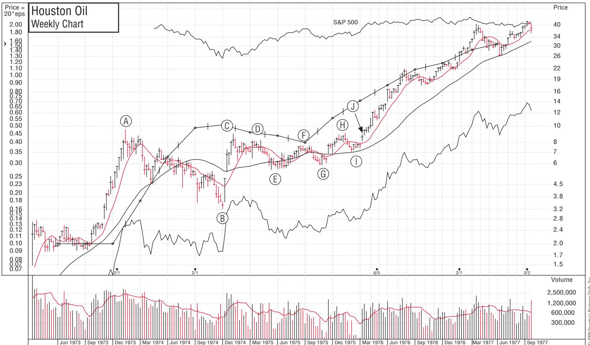

1994 年 8 月，PeopleSoft 重现了 New England Nuclear 和 Houston Oil 的形态。它 1993 年 9 月从宽、松、楔形上倾的形态中突破失败；1994 年 3 月第二次突破又失败，因为其柄部区域形成于杯柄形的下半区。最后，当形态和大盘都对了，PeopleSoft 从 1994 年 8 月开始一飞冲天。

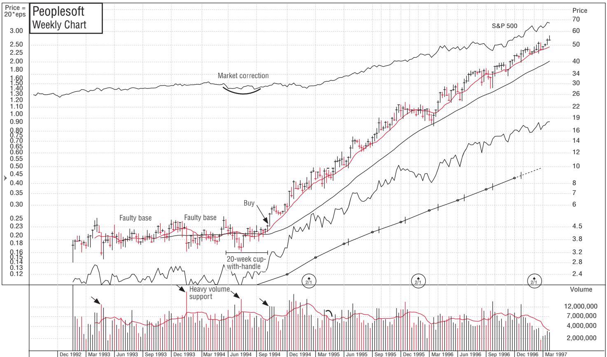

1999 年 1 月第一周，总部在圣迭戈的高通延续了 PeopleSoft 分三阶段的先例。1997 年 10 月，高通从一个松散的、过多底部位于下半区的缺陷底部直线上冲进新高。随后它构建了第二个缺陷底部，从下半区的柄部突破，又失败。第三个底部终于成功：一个形态合格的杯柄形在 1999 年 1 月第一周奏效。高通从拆股调整后的 7.50 美元，仅用一年就直冲 200 美元。也许你该多花点时间研究历史前例。你觉得呢？假如你当时投资 7500 美元买入高通，一年后它就值 20 万美元。

Wide-and-loose-looking charts usually fail but can tighten up later. New England Nuclear and Houston Oil & Minerals are two cases of stocks that tightened up following wide, loose, and erratic price movements. I cite them because I missed both of them at the time. It’s always wise to review big winners that you missed to find out why you didn’t recognize them when they were exactly right and ready to soar. 

New England Nuclear formed a wide, loose, and faulty price pattern that looked like a double bottom from points A, B, C, D, and E. It declined about 40% from the beginning at point A to point D. That was excessive, and it took too much time—almost six months—to hit bottom. Note the additional clue provided by the declining trend of its relative strength line (RS) throughout the faulty pattern. Buying at point E was wrong. The handle was also too short and did not drift down to create a shakeout. It wedged up along its low points. 

New England Nuclear then formed a second base from points E to F to G. But if you tried to buy at point G, you were wrong again. It was premature because the price pattern was still wide and loose. The move from point E to point F was a prolonged decline, with relative strength deteriorating badly. The rise straight up from the bottom at point F to the bogus breakout point G was too fast and erratic, taking only three months. Three months of improving relative strength versus the prior 17 months of decline weren’t enough to turn the previous poor trend into a positive one. 

The stock then declined from point G to point H to form what appeared to be a handle area for the possible cup formation from points E to F to G. If you bought at point I on the breakout attempt, the stock failed again. Reason: the handle was too loose; it degenerated 20%. However, after failing that time, the stock at last tightened up its price structure from points I to J to K, and 15 weeks later, at point K, it broke out of a tight, sound base and nearly tripled in price afterwards. Note the stock’s strong uptrend and materially improved relative strength line for 11 months from point K back to point F. 

So, there really is a right time and a wrong time to buy a stock, but understanding the difference requires some study. There’s no such thing as being an overnight success in the stock market, and success has nothing to do with listening to tips from other people or being lucky. You have to study and prepare yourself so that you can become successful on your own with your investing. So make yourself more knowledgeable. It isn’t easy at first, but it can be very rewarding. Anyone can learn to do it. You can do it. Believe in your ability to learn. Unlearn past assumptions that didn’t work. 

Here are some faulty wide-and-loose patterns that faked people into buying during the prolonged bear market that began in March 2000: Veritas 

Software on October 20, 2000; Anaren Microwave on December 28, 2000; and Comverse Technology on January 24, 2001. 

The aforementioned Houston Oil & Minerals is an even more dramatic example of the handle correction from point F to point G being a wide-andloose pattern that later tightened up into a constructive price formation (see the accompanying chart). A to B to C was extremely wide, loose, and erratic (the percent decline was too great). B to C was straight up from the bottom without any pullback in price. Points C and D were false attempts to break out of a faulty price pattern, and so was point H, which tried to break out of a wide-and-loose cup with handle. Afterward, a tight nine-week base formed from points H to I to J. (Note the extreme volume dry-up along the December 1975 lows.) 

An alert stockbroker in Hartford, Connecticut, called this structure to my attention. However, I’d been so conditioned by the two prior years of poor price patterns and less-than-desirable earnings that my mind was slow to change when the stock suddenly altered its behavior in only nine weeks. I was probably also intimidated by the tremendous price increase that had occurred in Houston Oil in the earlier 1973 bull market. This proves that opinions and feelings are frequently wrong, but markets rarely are. 

It also points out a very important principle: it takes time for all of us to change opinions that we have built up over a substantial period. In this instance, even the current quarterly earnings turning up 357% after three down quarters didn’t change my incorrect bearish view of the stock to a bullish one. The right buy point was in January 1976. 

In August 1994, PeopleSoft repeated the New England Nuclear and Houston Oil patterns. It failed in its breakout attempt from a wide, loose, wedgingupward pattern in September 1993. It then failed a second time in its breakout attempt in March 1994, when its handle area formed in the lower half of its cup-with-handle pattern. Finally, when the chart pattern and the general market were right, PeopleSoft skyrocketed starting in August 1994. 

144

145

In the first week of January 1999, San Diego–based Qualcomm followed PeopleSoft’s three-phased precedent. In October 1997, Qualcomm charged into new-high ground straight up from a loose, faulty base with too much of its base in its lower half. It then built a second faulty base, broke out of a handle in the lower part, and failed. The third base was the charm: a properly formed cup with handle that worked in the first week in January 1999. Qualcomm went straight through the roof from a split-adjusted \$7.50 to \$200 in only one year. Maybe you should spend more time studying historical precedents. What do you think? If you had invested \$7,500 in Qualcomm, a year later it would have been worth \$200,000. 

### Detecting Faulty Price Patterns and Base Structures

遗憾的是，过去 78 年里，没有人对价格形态分析做过原创、彻底的研究。1930 年，《福布斯》金融编辑理查德·沙巴克（Richard Schabacker）写了一本书《股市理论与实务》，其中讨论了许多形态，包括三角形、盘绕形和三角旗形。多年来我们对价格结构的详细建模与考察表明，这些形态并不可靠、且有风险。它们或许在“喧嚣的二十年代”后期管用，当时多数股票在狂热的冲顶中飙升。1999 年和 2000 年第一季度也发生了类似的情形：许多松散、有缺陷的形态起初看似管用，随后却失败了。这些时期就像 17 世纪荷兰的郁金香狂热——当时疯狂的投机使各种郁金香球茎价格飙升至天文数字，随后崩盘。

我们的研究显示，除极为罕见、难以解读的高而紧的旗形，五到六周的平底，以及四到七周的方箱之外，最可靠的底部形态必须至少有七到八周的价格整理。多数盘绕形、三角形和三角旗形，不过是缺乏足够时间或价格回调来成为合格底部的软弱地基。一、二、三周的底部是有风险的，几乎所有情况下都应回避。

1948 年，约翰·麦吉（John McGee）与罗伯特·D·爱德华兹（Robert D. Edwards）写了《股市趋势技术分析》，书中讨论了许多与沙巴克早期著作相同的缺陷形态。

1962 年，威廉·吉勒（William Jiler）写了一本通俗易读的书《图表如何助你在股市获利》，阐释了技术分析背后的许多正确原则。但它似乎也延续了对大萧条前某些易失败形态的展示与讨论。

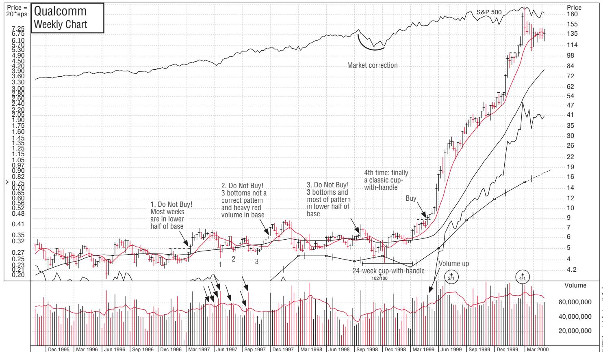

三重底和头肩底，是多本技术分析书籍中广为提及的形态。我们发现它们同样较弱。头肩底在少数情况下可能成功，但它缺乏强劲的前期上升趋势——而这对于多数强势市场龙头而言是必不可少的。

不过，在标示股票见顶方面，头肩顶形态是最可靠的形态之一。要当心：如果你对图表只有一点粗浅的了解，就可能误判什么才是正确的头肩顶。许多专业人士也解读不当。右（第二）肩必须略低于左肩（参见 Alexander & Alexander 的图表）。

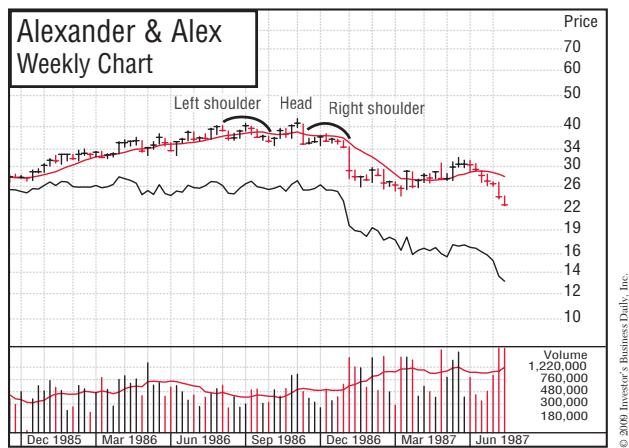

三重底比双重底更松散、更弱、更缺乏吸引力。原因在于，股票是三次而非两次（如双重底）或一次（如强势杯柄形）急剧回调、下跌到其绝对低点。如前所述，带楔形柄的杯形通常也是有缺陷、易失败的形态，正如 Global Crossing Ltd. 的图表所示。有能力的读图者本会回避或卖出 Global Crossing，该公司后来破产了。

Unfortunately, no original or thorough research on price pattern analysis has been done in the last 78 years. In 1930, Richard Schabacker, a financial editor of Forbes, wrote a book, Stock Market Theory and Practice. In it he discussed many patterns, including triangles, coils, and pennants. Our detailed model building and investigations of price structure over the years have shown these patterns to be unreliable and risky. They probably worked in the latter part of the “Roaring ’20s,” when most stocks ran up in a wild, climactic frenzy. Something similar happened in 1999 and the first quarter of 2000, when many loose, faulty patterns at first seemed to work, but then failed. These periods were just like the Dutch tulip bulb craze of the seventeenth century, during which rampant speculation caused varieties of tulip bulbs to skyrocket to astronomical prices and then crash. 

Our studies show that, with the exception of high, tight flags, which are extremely rare and hard to interpret, flat bases of five or six weeks, and the square box of four to seven weeks, the most reliable base patterns must have a minimum of seven to eight weeks of price consolidation. Most coils, triangles, and pennants are simply weak foundations without sufficient time or price correction to become proper bases. One-, two-, and three-week bases are risky. In almost all cases, they should be avoided. 

In 1948, John McGee and Robert D. Edwards wrote Technical Analysis of Stock Trends, a book that discusses many of the same faulty patterns presented in Schabacker’s earlier work. 

In 1962, William Jiler wrote an easy-to-read book, How Charts Can Help You in the Stock Market, that explains many of the correct principles behind technical analysis. However, it too seems to have continued the display and discussion of certain failure-prone patterns of the pre-Depression era. 

Triple bottoms and head-and-shoulders bottoms are patterns that are widely mentioned in several books on technical analysis. We have found these to be weaker patterns as well. A head-and-shoulders bottom may succeed in a few instances, but it has no strong prior uptrend, which is essential for most powerful market leaders. 

When it comes to signifying a top in a stock, however, head-and-shoulders top patterns are among the most reliable. Be careful: if you have only a little knowledge of charts, you can misinterpret what is a correct head-andshoulders top. Many pros don’t interpret the pattern properly. The right (second) shoulder must be slightly below the left shoulder (see the chart for Alexander & Alexander). 

A triple bottom is a looser, weaker, and less-attractive base pattern than a double bottom. The reason is that the stock corrects and falls back sharply to its absolute low three times rather than twice, as with a double bottom, or once, as in the strong cup with handle. As mentioned earlier, a cup with a wedging handle is also usually a faulty, failure-prone pattern, as you can see in the Global Crossing Ltd. chart example. A competent chart reader would have avoided or sold Global Crossing, which later went bankrupt. 

### How to Use Relative Price Strength Correctly

许多基本面证券分析师认为，技术分析就是买入相对价格强度最强的股票；另一些人则认为，技术研究只指买入“高动量”股票。这两种看法都是错的。

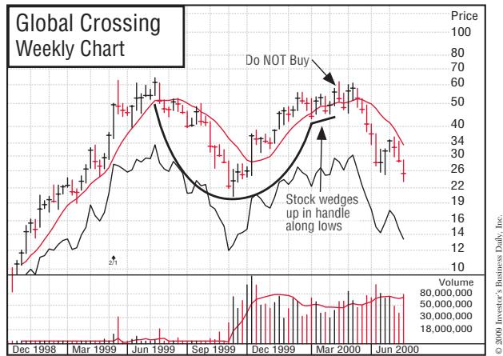

仅仅买入某些业绩最佳名单上相对价格强度最高的股票是不够的。你应当买入那些刚刚开始从健康的筑底期脱颖而出、表现强于大盘的股票。卖出的时机，则是股票已快速上涨、明显偏离底部、并显示出极高的相对价格强度之时。要分辨这两者的差别，你必须使用日线或周线图。

Many fundamental securities analysts think that technical analysis means buying those stocks with the strongest relative price strength. Others think that technical research refers only to the buying of “high-momentum” stocks. Both views are incorrect. 

It’s not enough to just buy stocks that show the highest relative price strength on some list of best performers. You should buy stocks that are per-

forming better than the general market just as they are beginning to emerge from sound base-building periods. The time to sell is when the stock has advanced rapidly, is extended materially from its base, and is showing extremely high relative price strength. To recognize the difference, you have to use daily or weekly charts.

### What Is Overhead Supply?

分析价格运动时，有一个至关重要、必须学会的概念——上方供给原理。所谓上方供给，指的是股票在经历一段下跌趋势后向上攀升时，遇到显著的阻力区域。

这些阻力区域代表着此前对该股的买入，它们限制并挫败股价的上行，因为当初买入的投资者一旦价格回到自己的买入价位，就会有卖出的动机。（参见 At Home 的图表。）例如，一只股票从 25 美元涨到 40 美元，再跌回 30 美元，那么大多数在 30 多美元高位和 40 美元买入的人都会亏损，除非他们迅速卖出、截断亏损（多数人做不到）。如果股票日后又爬回 30 多美元或 40 美元区域，那些曾经亏损的投资者就能解套、回本。

这些人曾在心里暗下决心：“只要能回本就卖。”人性不变。所以，当这些人看到在大幅亏损之后有机会拿回本钱时，其中一部分人选择卖出，是很正常的。

优秀的图表分析者懂得如何识别那些代表沉重上方供给的价格区域。他们绝不会犯下买入近期上方供给沉重的股票这种致命错误。这是一个许多只关注基本面的分析师有时会犯的严重错误。

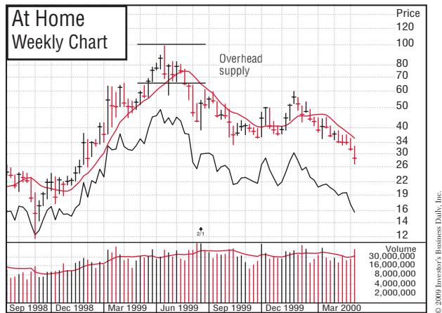

不过，一只能够一路消化其上方供给、杀出重围的股票，即便价格略高，也可能更值得买入。它已证明自己有足够的需求去吸纳这些供给、越过阻力区域。两年以上的供给区造成的阻力较小。当然，一只刚刚首次突破进入新高区域的股票，没有任何上方供给需要消化，这使其更具吸引力。

A critically important concept to learn in analyzing price movements is the principle of overhead supply. Overhead supply is when there are significant areas of price resistance in a stock as it moves up after experiencing a downtrend. 

These areas of resistance represent prior purchases of a stock and serve to limit and frustrate its upward movement because the investors who made these purchases are motivated to sell when the price returns to their entry point. (See the chart for At Home.) For example, if a stock advances from \$25 to \$40, then declines back to \$30, most of the people who bought it in the upper \$30s and at \$40 will have a loss in the stock unless they were quick to sell and cut their loss (which most people don’t do). If the stock later climbs back to the high \$30s or \$40 area, the investors who had losses can now get out and break even. 

These are the holders who promised themselves: “If I can just get out even, I will sell.” Human nature doesn’t change. So it’s normal for a number of these people to sell when they see a chance to get their money back after having been down a large amount. 

Good chartists know how to recognize the price zones that represent heavy areas of overhead supply. They will never make the fatal mistake of buying a stock that has a large amount of recent overhead supply. This is a serious mistake that many analysts who are concerned solely with fundamentals sometimes make. 

A stock that’s able to fight its way through its overhead supply, however, may be safer to buy, even though the price is a little higher. It has proved to have sufficient demand to absorb the supply and move past its level of resistance. Supply areas more than two years old create less resistance. Of course, a stock that has just broken out into new high ground for the first time has no overhead supply to contend with, which adds to its appeal. 

### Excellent Opportunities in Unfamiliar, Newer Stocks

警觉的投资者应当有办法跟踪过去 10 年里出现的所有新股。这很重要，因为其中一些较新、较年轻的公司，将成为未来一两年中最令人惊艳的赢家。这些新股大多在纳斯达克市场交易。

有些新股小幅上涨后，在熊市中回落至新低价，给人留下糟糕的第一印象。但当下一轮牛市开始，少数被遗忘的新面孔会悄然回升、不被察觉地构筑底部，若其盈利与销售良好且不断改善，便会突然启动、股价翻倍甚至翻两倍。

多数投资者会错过这些出色的价格运动，因为它们发生在大多数人闻所未闻的新名字上。图表服务能帮你发现这些陌生的新公司，但要确保你的服务跟踪大量股票（而不只是一两千只）。

成功的年轻成长股，往往在成立后的第五到第十年间享受最快的盈利增长，所以要在它们早期成长阶段留意它们。

总而言之，学会阅读和运用图表，来改善你的选股与整体组合表现。图表是一座信息金矿。要精通它，你需要投入一些时间和学习，但解读图表比你想象的要容易。

Alert investors should have a way of keeping track of all the new stock issues that have emerged over the last 10 years. This is important because some of these newer and younger companies will be among the most stunning performers of the next year or two. Most of these issues trade on the Nasdaq market. 

Some new issues move up a small amount and then retreat to new price lows during a bear market, making a poor initial impression. But when the next bull market begins, a few of these forgotten newcomers will sneak back up unnoticed, form base patterns, and suddenly take off and double or triple in price if they have earnings and sales that are good and improving. 

Most investors miss these outstanding price moves because they occur in new names that are largely unknown to most people. A charting service can help you spot these unfamiliar, newer companies, but make sure that your service follows a large number of stocks (not just one or two thousand). 

Successful, young growth stocks tend to enjoy their fastest earnings growth between their fifth and tenth years in business, so keep an eye on them during their early growth periods. 

To summarize, improve your stock selection and overall portfolio performance by learning to read and use charts. They provide a gold mine of information. It will take some time and study on your part to become good at this, but interpreting charts is easier than you think. 

### A Loud Warning to the Wise about Bear Markets!!!

让我再给出最后一点明智的指引。如果你是股市新手，或是对本书中历经历史检验的策略还不熟悉，或者更重要的是，如果你是在熊市之初或中途第一次读这本书，那么不要指望那些被假定的买入形态会奏效。它们中的大多数必定是有缺陷的。熊市中你绝对不能买入突破——它们大多会失败。

与早先的形态相比，这些价格形态在观感上会过于深、过于宽、过于松。它们会是第三、第四阶段的底部；会有楔形或松散、草率的柄部；柄部会位于底部的下半区；或者呈现从底部直线上冲进新高、完全没有柄部形成的狭窄“V”形。某些形态可能显示落后股相对强度线下滑，价格形态中有过多不利的成交量活动，或每周价格波幅都很大。

问题并不在于底部、突破或这套方法不再管用，而在于时机和股票全都错了。价量形态是虚假、有缺陷、不健康的。大盘正在转弱，这是卖出的时候。要有耐心，继续研究，做好百分之百的准备。日后，在最出人意料之时、当所有消息都糟糕透顶之际，冬天终将过去，一轮伟大的新牛市会突然迸发出生机。这里讨论的实用技法和经检验的纪律，应当在未来许许多多个经济周期中为你所用。所以，做好准备，做好功课，建立属于你自己的、你会持续使用的买卖规则。

Let me offer one last bit of judicious guidance. If you are new to the stock market or the historically tested and proven strategies outlined in this book, or, more importantly, if you are reading this book for the first time near the beginning or middle of a bear market, do not expect the presumed buy patterns to work. Most of them will definitely be defective. You absolutely do not buy breakouts during a bear market. Most of them will fail. 

The price patterns will be too deep, wide, and loose in appearance compared to earlier patterns. They will be third- and fourth-stage bases; have wedging or loose, sloppy handles; have handles in the lower half of the base; or show narrow “V” formations moving straight up from the bottom of a base into new highs, without any handle forming. Some patterns may show laggard stocks with declining relative strength lines and price patterns with too much adverse volume activity or every week’s price spread wide. 

It isn’t that bases, breakouts, or the method isn’t working anymore; it’s that the timing and the stocks are simply all wrong. The price and volume patterns are phony, faulty, and unsound. The general market is turning negative. It is selling time. Be patient, keep studying, and be 100% prepared. Later, at the least expected time, when all the news is terrible, winter will ultimately pass and a great new bull market will suddenly spring to life. The practical techniques and proven disciplines discussed here should work for you for many, many future economic cycles. So get prepared and do your homework. Create your own buy and sell rules that you will constantly use. 

• C HAP TE R • 

## Chapter3 C = Current Big or Accelerating Quarterly Earnings and Sales per Share

> **中文标题：** C = 当前季度每股收益与销售额的大幅或加速增长

**中文翻译（导语）**

戴尔电脑、思科系统、美国在线——在每天交易的成千上万只股票中，为什么这三只在 1990 年代表现如此出色，分别上涨 1780%、1467% 和 557%？

或者，同样的问题：谷歌 2004 年 8 月以每股 85 美元开始交易，一路攀升直到 2007 年见顶于 700 美元以上；苹果则在更早六个月前从一个完美的杯柄形态脱颖而出，拆股调整后每股 12 美元，45 个月后达到 202 美元。它们又如何？

在成百上千个能推动股价涨跌的因素中，这些公司共同拥有哪些关键特征？

这些问题并非无的放矢。答案揭开了在股市中真正成功的秘密。我们对上个世纪又四分之一个世纪里所有股市超级明星的研究发现，它们的确实拥有共同的特征。

然而，在每一个大赢家于其涨势之前一两季所报告的利润面前，这些特征都不那么醒目。例如：

• 戴尔在 1996 年 11 月股价上涨之前的两个季度里，每股收益分别激增 74% 和 108%。

• 思科在截至 1990 年 10 月的两个季度里，盈利增长 150% 和 155%，随后在接下来三年里暴涨。

• 美国在线在 1998 年 10 月启动六个月大涨之前，盈利增长 900% 和 283%。

• 谷歌在作为上市公司惊艳登场之前的两个季度里，盈利增长 112% 和 123%。

• 苹果在起飞前的一个季度盈利增长 350%，随后的季度又增长 300%。

但这并非只是近来的现象。在美国股市伟大的历史长河中，爆发式的盈利始终伴随着股价的大涨。1914 年，Studebaker 在八个月内从 45 美元涨到 190 美元之前，盈利增长 296%；1916 年，Cuban American Sugar 盈利飙升 1175%，同年其股价从 35 美元涨到 230 美元。

1919 年夏天，Stutz Motor Car 盈利增长 70%，随后这家以高性能跑车闻名的高端制造商——你还记得 Bearcat 吧？——在短短 40 周内从 75 美元冲到 385 美元。

美国铸铁管公司（U.S. Cast Iron Pipe）的盈利从 1922 年底的每股 1.51 美元升至 1923 年底的 21.92 美元，增幅 1352%。1923 年底该股才 30 美元，到 1925 年初已涨到 250 美元。

1926 年 3 月，杜邦公司盈利增长 259%，当年 7 月其股价从 41 美元起飞，1929 年崩盘前涨到 230 美元。

事实上，如果你逐一看历年市场中最大的赢家名单，就会立刻看出利润繁荣与股价繁荣之间的关联。

你也会明白，为什么我们的研究会得出如下结论：

**英文原文（导语）**

Dell Computer, Cisco Systems, America Online—why, among the thousands of stocks that trade each day, did these three perform so well during the 1990s, posting gains of 1,780%, 1,467%, and 557%, respectively? 

Or for that matter, what about Google, which started trading at \$85 a share in August 2004 and didn’t stop climbing until it peaked at over \$700 in 2007? Or Apple, which had emerged from a perfect cup-with-handle pattern six months earlier at a split-adjusted \$12 a share and reached \$202 in 45 months? 

What key traits, among the hundreds that can move stocks up and down, did these companies all have in common? 

These are not idle questions. The answers unlock the secret to true success in the stock market. Our study of all the stock market superstars from the last century and a quarter found that they did indeed share common characteristics. 

None of these characteristics, however, stood out as boldly as the profits each big winner reported in the latest quarter or two before its major price advance. For example: 

• Dell’s earnings per share surged 74% and 108% in the two quarters prior to its price increase from November 1996. 

• Cisco posted earnings gains of 150% and 155% in the two quarters ending October 1990, prior to its giant run-up over the next three years. 

• America Online’s earnings were up 900% and 283% before its six-month burst from October 1998. 

• Google showed earnings gains of 112% and 123% in the two quarters before it made its spectacular debut as a public company. 

• Apple’s earnings were up 350% in the quarter before it took off, and its next quarter was up another 300%. 

But this isn’t just a recent phenomenon. Explosive earnings have accompanied big stock moves throughout the stock market’s great history in America. Studebaker’s earnings were up 296% before it sped from \$45 to \$190 in eight months in 1914, and Cuban American Sugar’s earnings soared 1,175% in 1916, the same year its stock climbed from \$35 to \$230. 

In the summer of 1919, Stutz Motor Car was showing an earnings gain of 70% before the prestigious manufacturer of high-performance sports cars—you remember the Bearcat, don’t you?—raced from \$75 to \$385 in just 40 weeks. 

Earnings at U.S. Cast Iron Pipe rose from \$1.51 a share at the end of 1922 to \$21.92 at the end of 1923, an increase of 1,352%. In late 1923, the stock traded at \$30; by early 1925, it went for \$250. 

And in March of 1926, du Pont de Nemours showed earnings up 259% before its stock took off from \$41 that July and got to \$230 before the 1929 break. 

In fact, if you look down a list of the market’s biggest winners year-in and year-out, you’ll instantly see the relationship between booming profits and booming stocks. 

And you’ll see why our studies have concluded that 

### The stocks you select should show a major percentage increase in current quarterly earnings per share (the most recently reported quarter) when compared to the prior year’s same quarter.

你选出的股票，其当前季度每股收益（即最近公布的季度）相比去年同季度，应当出现大幅的百分比增长。

### Seek Stocks Showing Huge Current Earnings Increases

在我们对 1952 到 2001 年间表现最好的 600 只股票的建模中，四分之三的股票在启动主要涨势之前，最近一次公开报告的季度盈利平均增长超过 70%。那些当前季度盈利增长不扎实的，在紧接着的下个季度就补上了，平均盈利增长 90%！

Priceline.com 在 2006 年 6 月季度盈利“仅”增长 34% 时，其股价从 30 美元涨到 140 美元。但它的盈利随后加速，在接下来的季度里分别增长 53%、107% 和 126%。

1910 到 1950 年间，多数最佳表现者在股价大涨之前的盈利增幅在 40% 到 400% 之间。

那么，既然最好的股票在价格快速上涨之前都有如此量级的利润增长，你为什么还要满足于更低的标准？你也许会发现，在纳斯达克或纽约证券交易所上市的所有股票中，只有 2% 能显示这样规模的盈利增长。但请记住：你要找的是杰出的股票，而非平庸的股票。别担心，它们就在那里。

不过，如同任何搜寻一样，途中可能布满陷阱和坑洼，你需要懂得如何避开它们。

你要关注的每股收益（EPS）数字，是用公司税后总利润除以流通普通股股数得出的。这个 EPS 的百分比变化，是当今选股中最重要的单一要素。增幅越大越好。

然而在 1990 年代末疯狂的网络热潮中，有些人仅凭关于未来利润和财富的宏大故事就买入股票，因为当时多数互联网和网络公司迄今只显示出亏损。既然像美国在线和雅虎这样的公司确实在盈利，就没有必要把你的血汗钱拿去押在其他未经证实的股票上。

美国在线和雅虎是当时的真正龙头。当不可避免的市场回调（下跌）到来时，那些没有盈利、层级更低、更具投机性的公司迅速遭到最惨重的下跌。你不需要承担那份额外的风险。

一些专业资金管理人（更不用说个人投资者）会在最近公布的季度盈利持平（无变化）或下滑时买入普通股，这总让我惊讶不已。如果一只股票的当前盈利很差，它根本没有任何好理由能够持续大幅上涨。

即便是 5% 到 10% 的利润增长，也不足以支撑一波大的股价运动。况且，一家只增长 8% 或 10% 的公司，更可能在下个季度突然报告更低或更慢的盈利。

与共同基金、银行、保险公司这类管理着数十亿美元、可能受基金规模限制的机构投资者不同，个人投资者拥有一种奢侈：只投资每一轮牛市中最好的股票。虽然一些没有盈利的公司（如 Amazon.com 和 Priceline.com）在 1998–1999 年股价大涨，但那个时期多数投资者若买入美国在线和嘉信理财这类盈利强劲的股票，结果会更好。

遵循 CAN SLIM 策略对盈利的强调，能确保投资者在任何市场周期中都能被引向最强的股票，无论期间出现怎样短暂、高度投机的“泡沫”或狂热。当然，你不能仅凭盈利增长就买入。其他几个几乎同等重要的因素，我们将在后续章节讨论。只不过 EPS 是最重要的。

In our models of the 600 best-performing stocks from 1952 to 2001, three out of four showed earnings increases averaging more than 70% in the latest publicly reported quarter before they began their major advances. Those that did not show solid current quarterly earnings increases did so in the very next quarter, with an average earnings increase of 90%! 

Priceline.com was showing earnings up “only” 34% in the June quarter of 2006, when its stock began a move from \$30 to \$140. But its earnings accelerated, rising 53%, 107%, and 126%, in the quarters that followed. 

From 1910 to 1950, most of the very best performers showed earnings gains ranging from 40% to 400% before their big price moves. 

So, if the best stocks had profit increases of this magnitude before they advanced rapidly in price, why should you settle for anything less? You may find that only 2% of all stocks listed on Nasdaq or the New York Stock Exchange will show earnings gains of this size. But remember: you’re looking for stocks that are exceptional, not lackluster. Don’t worry; they’re out there. 

As with any search, however, there can be traps and pitfalls along the way, and you need to know how to avoid them. 

The earnings per share (EPS) number you want to focus on is calculated by dividing a company’s total after-tax profits by the number of common shares outstanding. This percentage change in EPS is the single most important element in stock selection today. The greater the percentage increase, the better. 

And yet during the Internet boom of the wild late 1990s, some people bought stocks based on nothing more than big stories of profits and riches to come, as most Internet and dot-com companies had shown only deficits to date. Given that companies such as AOL and Yahoo! were actually showing earnings, risking your hard-earned money in other, unproven stocks was simply not necessary. 

AOL and Yahoo! were the real leaders at that time. When the inevitable market correction (downturn) hit, lower-grade, more speculative companies with no earnings rapidly suffered the largest declines. You don’t need that added risk. 

I am continually amazed at how some professional money managers, let alone individual investors, buy common stocks when the current reported quarter’s earnings are flat (no change) or down. There is absolutely no good reason for a stock to go anywhere in a big, sustainable way if its current earnings are poor. 

Even profit gains of 5% to 10% are insufficient to fuel a major price movement in a stock. Besides, a company showing an increase of as little as 8% or 10% is more likely to suddenly report lower or slower earnings the next quarter. 

Unlike some institutional investors such as mutual funds, banks, and insurance companies, which have billions under management and which may be restricted by the size of their funds, individual investors have the luxury of investing in only the very best stocks in each bull cycle. While some companies with no earnings (like Amazon.com and Priceline.com) had big moves in their stocks in 1998–1999, most investors in that time period would have been better off buying stocks like America Online and Charles Schwab, both of which had strong earnings. 

Following the CAN SLIM strategy’s emphasis on earnings ensures that an investor will always be led to the strongest stocks in any market cycle, regardless of any temporary, highly speculative “bubbles” or euphoria. Of course, you don’t buy on earnings growth alone. Several other factors, which we’ll cover in the chapters that follow, are almost as important. It’s just that EPS is the most important. 

### Watch Out for Misleading Earnings Reports

你有没有读过这样一份公司季度盈利报告：

我们头三个月很糟糕。由于总部的低效，公司前景正在恶化。竞争对手刚推出更好的产品，将对我们销售造成不利影响。此外，我们在中西部的新业务上亏得一塌糊涂，那是管理层的一大失误。

绝不可能！你实际看到的却是这样：

Greatshakes 公司报告，截至 3 月 31 日的季度销售额创下 720 万美元的纪录，高于 600 万美元（增长 20%）。

如果你是 Greatshakes 的股东，这听起来是好消息。你当然不会失望。毕竟，你相信这是一家好公司（否则你一开始就不会投资它），而这份报告印证了你的想法。

但这份“创纪录”的销售公告是一份好报告吗？假设公司还报告了每股 2.10 美元的创纪录盈利，高于去年同期每股 2.00 美元，增长 5%。现在是否更好了？你必须问的问题是：为什么销售增长 20%，盈利却只增长 5%？这对公司的利润率意味着什么？

多数投资者会被读到的东西打动，而公司也乐于在新闻稿和电视露面中展示最好的一面。然而，即便这家公司的销售增长 20%、创下历史新高，对公司的利润也没多大意义。对制胜的投资者而言，关键问题永远是：

Have you ever read a corporation’s quarterly earnings report that went like this: 

We had a terrible first three months. Prospects for our company are turning down because of inefficiencies at the home office. Our competition just came out with a better product, which will adversely affect our sales. Furthermore, we are losing our shirt on the new Midwestern operation, which was a real blunder on management’s part. 

No way! Here’s what you see instead: 

Greatshakes Corporation reports record sales of \$7.2 million versus \$6 million (+20%) for the quarter ended March 31. 

If you’re a Greatshakes stockholder, this sounds like wonderful news. You certainly aren’t going to be disappointed. After all, you believe that this is a fine company (if you didn’t, you wouldn’t have invested in it in the first place), and the report confirms your thinking. 

But is this “record-breaking” sales announcement a good report? Let’s suppose the company also had record earnings of \$2.10 per share, up 5% from the \$2.00 per share reported for the same quarter a year ago. Is it even better now? The question you have to ask is, why were sales up 20% but earnings ahead only 5%? What does this say about the company’s profit margins? 

Most investors are impressed with what they read, and companies love to put their best foot forward in their press releases and TV appearances. However, even though this company’s sales grew 20% to an all-time high, it didn’t mean much for the company’s profits. The key question for the winning investor must always be: 

### How much are the current quarter’s earnings per share up (in percentage terms) from the same quarter the year before?

当前季度每股收益（按百分比计）比去年同期增长了百分之多少？

Let’s say your company discloses that sales climbed 10% and net income advanced 12%. Sound good? Not necessarily. You shouldn’t be concerned with the company’s total net income. You don’t own the whole organization; you own shares in it. Over the last 12 months, the company might have issued additional shares or “diluted” the common stock in other ways. So while net income may be up 12%, earnings per share—your main focus as an investor—may have edged up only 5% or 6%. 

You must be able to see through slanted presentations. Don’t let the use of words like sales and net income divert your attention from the truly vital facts like current quarterly earnings. To further clarify this point: 

You should always compare a company’s earnings per share to the same quarter a year earlier, not to the prior quarter, to avoid any distortion resulting from seasonality. In other words, you don’t compare the December quarter’s earnings per share to the prior September quarter’s earnings per share. Rather, compare the December quarter to the December quarter of the previous year for a more accurate evaluation. 

### Omit a Company’s One-Time Extraordinary Gains

制胜的投资者应当避免被非经常性利润影响这一陷阱。例如，如果一家计算机制造商报告的上季度盈利包含出售房地产等活动的非经常性利润，这部分盈利就应当从报告中剔除。这类盈利代表的是一次性事件，而非公司业务真实、持续性的盈利能力。忽略由这类事件产生的盈利。

纽约的花旗银行，其盈利是否曾在 1990 年代某些时候靠非经常性的商业地产出售来支撑，而当时该行尚未在次贷灾难中进行后来那种杠杆式介入？

The winning investor should avoid the trap of being influenced by nonrecurring profits. For example, if a computer maker reports earnings for the last quarter that include nonrecurring profits from activities such as the sale of real estate, this portion of earnings should be subtracted from the report. Such earnings represent a one-time event, not the true, ongoing profitability of corporate operations. Ignore the earnings that result from such events. 

Is it possible that the earnings of New York’s Citigroup bank may have been propped up at times during the 1990s by nonrecurring sales of commercial real estate prior to the bank’s later leveraged involvement in the subprime disaster? 

### Set a Minimum Level for Current Earnings Increases

无论你是新手还是老手，我都建议不要买入任何最新季度每股收益比去年同期增长低于 18% 或 20% 的股票。在我们对最伟大赢家公司的研究中，我们发现它们在大涨之前都有这一共同点。许多成功的投资者把 25% 或 30% 作为他们盈利参数的下限。

为了更稳妥，应坚持要求最近两个季度都显示出显著的盈利增长。在牛市中，我倾向于专注于盈利增长 40% 到 500% 甚至更多的股票。你有成千上万只股票可供选择，为什么不买能得到的最好的货色？

为了进一步磨利你的选股流程，请向前看未来一两个季度，查一查这些同样的季度去年报告的盈利。看看公司是否即将面对去年异常高或异常低的盈利基数。当年初的异常业绩并非源于季节性因素时，这一步能帮你预判未来几个月强劲或糟糕的盈利报告。

此外，务必核查未来几个季度以及未来一两年的一致盈利预测（即汇总一大批分析师盈利预测得出的预期），以确保公司预计走在正轨上。一些盈利预测服务甚至为许多公司显示未来五年的预估年度盈利增长率。

许多个人乃至一些机构投资者会买入最近公布季度盈利下滑的股票，因为他们喜欢这家公司，觉得股价“便宜”。他们通常接受“盈利很快会强劲反弹”的说法。某些情况下这可能是真的，但很多情况下不是。再次强调：你有成千上万家公司可选，其中许多实际上正显示出强劲经营业绩。你不必接受那些可能永远不会兑现的盈利承诺。

要求当前季度盈利大幅增长，只是聪明投资者降低选股失误风险的又一明智做法。但你也必须明白，在牛市的后期，一些甚至许多已长期上涨的龙头股，即便盈利增长 100% 也可能见顶。这常常把投资者和分析师一并骗过。了解你的市场历史是大有好处的。

Whether you’re a new or an experienced investor, I would advise against buying any stock that doesn’t show earnings per share up at least 18% or 20% in the most recent quarter versus the same quarter the year before. In our study of the greatest winning companies, we found that they all had this in common prior to their big price moves. Many successful investors use 25% or 30% as their minimum earnings parameter. 

To be even safer, insist that both of the last two quarters show significant earnings gains. During bull markets (major market uptrends), I prefer to concentrate on stocks that show powerful earnings gains of 40% to 500% or more. You have thousands of stocks to choose from. Why not buy the very best merchandise available? 

To further sharpen your stock selection process, look ahead to the next quarter or two and check the earnings that were reported for those same quarters the previous year. See if the company will be coming up against unusually large or small earnings achieved a year ago. When the unusual year-earlier results are not caused by seasonal factors, this step may help you anticipate a strong or poor earnings report in the coming months. 

Also, be sure to check consensus earnings estimates (projections that combine the earnings estimates of a large group of analysts) for the next several quarters—and for the next year or two—to make sure the company is projected to be on a positive track. Some earnings estimate services even show an estimated annual earnings growth rate for the next five years for many companies. 

Many individuals and even some institutional investors buy stocks whose earnings were down in the most recently reported quarter because they like the company and think that its stock price is “cheap.” Usually they accept the story that earnings will rebound strongly in the near future. In some cases this may be true, but in many cases it isn’t. Again, the point is that you have the choice of investing in thousands of companies, many of which are actually showing strong operating results. You don’t have to accept promises of earnings that may never occur. 

Requiring that current quarterly earnings be up a hefty amount is just another smart way for the intelligent investor to reduce the risk of mistakes in stock selection. But you must also understand that in the late stage of a bull market, some or even many leaders that have had long runs may top out even though their earnings are up 100%. This usually fools investors and analysts alike. It pays to know your market history. 

### Avoid Big Older Companies with Maintainer Management

事实上，许多美国老牌公司管理层平庸，持续交出差劲的盈利业绩。我把这些人称为“根深蒂固的守成者”或“看管型管理层”。在这些公司有人勇敢地更换高层之前，你要回避它们。并非巧合的是，它们通常正是那些拼命把当前盈利勉强推高到 8% 或 10% 这种平淡水平的公司。拥有杰出新产品或改进型管理的真正成长型公司，不必去粉饰当前的业绩。

In fact, many older American corporations have mediocre management that continually produces second-rate earnings results. I call these people the “entrenched maintainers” or “caretaker management.” You want to avoid these companies until someone has the courage to change the top executives. Not coincidentally, they are generally the companies that strain to pump up their current earnings a still-dull 8% or 10%. True growth companies with outstanding new products or improved management do not have to inflate their current results. 

### Look for Accelerating Quarterly Earnings Growth

我们对最成功股票的分析还显示，几乎在每一个案例中，盈利增长都在一波高耸的股价运动开始之前的 10 个季度里的某个时点加速。换句话说，引发大行情的不只是盈利增长以及增幅的大小，还在于这个增长代表着相对公司此前盈利增长速度的改善。如果一家公司的盈利原本每年增长 15%，突然开始蹿升 40% 到 50% 甚至更多——华尔街通常称之为“盈利惊喜”——这通常就为股价的重要上扬创造了条件。

其他追踪股票盈利的有价值方法包括：确定近几个月分析师上调该公司盈利预测的次数，以及此前几次季度盈利报告实际超出预测的百分比。

Our analysis of the most successful stocks also showed that, in almost every case, earnings growth accelerated sometime in the 10 quarters before a towering price move began. In other words, it’s not just increased earnings and the size of the increase that cause a big move. It’s also that the increase represents an improvement from the company’s prior rate of earnings growth. If a company’s earnings have been up 15% a year and suddenly begin spurting 40% to 50% or more—what Wall Street usually calls “earnings surprises”—this usually creates the conditions for important stock price improvement. 

Other valuable ways to track a stock’s earnings include determining how many times in recent months analysts have raised their estimates for the company plus the percentage by which several previous quarterly earnings reports have actually beaten the estimates. 

### Look for Sales Growth as Well as Earnings Growth

强劲且不断改善的季度盈利，应始终得到最新季度至少 25% 销售增长的支持，或者至少要在销售增长百分比上连续三个季度加速。某些更新的发行（首次公开发行）可能在最近 8、10 或 12 个季度里，每个季度平均销售增长 100% 或更多。请把这些股票都查一遍。

如果销售和盈利在过去三个季度都加速增长，要特别留意。如果股票显示出这种加速，你不要缺乏耐心而把它卖掉。坚守你的仓位。

一些专业投资者在 1998 年初以 50 美元买入 Waste Management，因为盈利连续三个季度从 24% 跃升至 75% 再到 268%。但销售只增长 5%。几个月后，股价崩跌到每股 15 美元。

这表明，公司可以通过削减成本、或减少广告、研发及其他建设性活动的开支，在几个季度里粉饰盈利。然而，要想可持续，盈利增长必须得到更高销售的支持。Waste Management 并非如此。

如果你所选股票最新季度的税后利润率处于或接近新高、且在公司所属行业中位居前列，这也有助于提高你的胜率。是的，如果你想真正改善结果，就得做点功课。没有付出，就没有收获。

Strong and improving quarterly earnings should always be supported by sales growth of at least 25% for the latest quarter, or at least an acceleration in the rate of sales percentage improvement over the last three quarters. Certain newer issues (initial public offerings) may show sales growth averaging 100% or more in each of the last 8, 10, or 12 quarters. Check all these stocks out. 

Take particular note if the growth of both sales and earnings has accelerated for the last three quarters. You don’t want to get impatient and sell your stock if it shows this type of acceleration. Stick to your position. 

Some professional investors bought Waste Management at \$50 in early 1998 because earnings had jumped three quarters in a row from 24% to 75% and 268%. But sales were up only 5%. Several months later, the stock collapsed to \$15 a share. 

This demonstrates that companies can inflate earnings for a few quarters by reducing costs or spending less on advertising, research and development, and other constructive activities. To be sustainable, however, earnings growth must be supported by higher sales. Such was not the case with Waste Management. 

It also helps improve your batting average if the latest quarter’s after-tax profit margins for your stock selections are either at or near a new high and among the very best in the company’s own industry. Yes, you have to do a little homework if you want to really improve your results. No pain, no gain. 

### Two Quarters of Major Earnings Deceleration Can Be Trouble for Your Stock

正如辨识季度盈利增长何时加速很重要，了解盈利何时开始减速、或显著放缓，同样重要。如果一家原本以 50% 的季度增速增长的公司突然只报告盈利增长 15%，那就可能预示着麻烦，你或许应当回避这家公司。

即便最好的组织偶尔也会有一个疲软的季度。所以在对一家公司的盈利转为悲观之前，我倾向于先看到连续两个季度的实质性放缓。这通常意味着增速比此前下降三分之二或更多——例如从 100% 的盈利增长放缓到 30%，或从 50% 放缓到 15%。

Just as it’s important to recognize when quarterly earnings growth is accelerating, it’s also important to know when earnings begin to decelerate, or slow down significantly. If a company that has been growing at a quarterly rate of 50% suddenly reports earnings gains of only 15%, that might spell trouble, and you may want to avoid that company. 

Even the best organizations can have a slow quarter every once in a while. So before turning negative on a company’s earnings, I prefer to see two consecutive quarters of material slowdown. This usually means a decline of two-thirds or greater from the previous rate—a slowdown from 100% earnings growth to 30%, for example, or from 50% to 15%. 

### Consult Log-Scale Weekly Graphs

理解盈利加速或减速的原理至关重要。

那些因为预计次年盈利的绝对水平而推荐股票的证券分析师，可能看错了数字。一只股票每股赚 5 美元、预计明年报告 6 美元（“可喜的”20% 增长），这样的事实可能具有误导性，除非你了解此前盈利百分比变化率的趋势。要是此前的盈利增长是 60% 呢？这在一定程度上解释了：为什么追随证券分析师买卖建议的投资者中，赚到大钱的如此之少。

对数刻度图在分析股票时极有价值，因为它们清楚地显示季度盈利增长百分率的加速或减速。在价格或盈利刻度上的任何一英寸，都代表相同的百分比变化。算术刻度的图表则不然。

在算术刻度图上，价格从每股 10 美元上涨 100% 到 20 美元，与从 20 美元上涨 50% 到 30 美元，显示的空间变化相同。相比之下，对数刻度图会把 100% 的涨幅显示为 50% 涨幅的两倍。

作为自己动手的投资者，你可以把最新季度每股收益连同此前三个季度的 EPS 一起，标注在对数刻度图上，从而清晰地看出盈利的加速或减速。对最好的公司而言，每季度标注最近 12 个月的盈利，其每股收益点位应接近、或已经处于新高。

Understanding the principle of earnings acceleration or deceleration is essential. 

Securities analysts who recommend stocks because of the absolute level of earnings expected for the following year could be looking at the wrong set of numbers. The fact that a stock earned \$5 per share and expects to report \$6 the next year (a “favorable” 20% increase) could be misleading unless you know the previous trend in the percentage rate of earnings change. What if earnings were previously up 60%? This partially explains why so few investors make significant money following the buy and sell recommendations of securities analysts. 

Logarithmic-scale graphs are of great value in analyzing stocks because they clearly show the acceleration or deceleration in the percentage rate of quarterly earnings increases. One inch anywhere on the price or earnings scale represents the same percentage change. This is not true of arithmetically scaled charts. 

On an arithmetically scaled chart, a 100% price increase from \$10 to \$20 a share shows the same space change as a 50% increase from \$20 to \$30 a share. In contrast, a log-scale graph would show the 100% increase as being twice as large as the 50% increase. 

As a do-it-yourself investor, you can take the latest quarterly earnings per share along with the prior three quarters’ EPS, and plot them on a logarithmic-scale graph to get a clear picture of earnings acceleration or deceleration. For the best companies, plotting the most recent 12-month earnings each quarter should put the earnings per share point close to or already at new highs. 

### Check Other Stocks in the Group

为进一步验证，检查你股票所属行业组中其他公司的盈利。如果你在该组里找不到至少另一只盈利强劲、令人印象深刻的股票，那很可能说明你选错了投资对象。

For additional validation, check the earnings of other companies in your stock’s industry group. If you can’t find at least one other impressive stock displaying strong earnings in the group, chances are you may have selected the wrong investment. 

### Where to Find Current Quarterly Earnings Reports

过去，公司的季度盈利报表几乎每天都会刊登在多数地方报纸和金融出版物的商业版上。但如今许多出版物正在缩减其商业版，四处删减数据。结果，它们已不再充分覆盖投资者最需要了解的东西。

《投资者商业日报》则不然。IBD 不仅继续提供详尽的盈利报道，还更进一步，把所有新发布的盈利报告分为“盈利上升”和“盈利下降”两类公司，让你一眼就能看出谁交出了出色的增长、谁没有。

Daily Graphs® 和 Daily Graphs Online 等图表服务，也会显示当周报告的盈利，以及它们所绘制的每只股票的最新盈利数据。一旦你查到每股收益相比去年同季度的百分比变化，还要逐季比较 EPS 的百分比变化。看 3 月季度，再看 6 月、9 月和 12 月季度，就能判断一家公司的盈利增长是在加速还是减速。

现在你掌握了改善选股的第一条关键规则：

当前季度每股收益应比去年同期出现大幅增长——至少 25% 到 50%。最好的公司可能显示盈利增长 100% 到 500% 甚至更多！

平庸的 10% 或 12% 不够。挑选制胜股时，最重要的就是净利润这一底线。

Quarterly corporate earnings statements used to be published in the business sections of most local newspapers and financial publications every day. But many publications are downsizing their business sections these days, dropping data right and left. As a result, they no longer adequately cover the most important thing that investors need to know. 

This is not true of Investor’s Business Daily. IBD not only continues to provide detailed earnings coverage, but goes a step further and separates all new earnings reports into companies with “up” earnings and those reporting “down” results, so you can easily see who produced excellent gains and who didn’t. 

Chart services such as Daily Graphs® and Daily Graphs Online also show earnings reported during the week as well as the most recent earnings figures for every stock they chart. Once you locate the percentage change in earnings per share when compared to the same year-ago quarter, also compare the percentage change in EPS on a quarter-by-quarter basis. Looking at the March quarter and then at the June, September, and December quarters will tell you if a company’s earnings growth is accelerating or decelerating. 

You now have the first critical rule for improving your stock selection: 

Current quarterly earnings per share should be up a major percentage— 25% to 50% at a minimum—over the same quarter the previous year. The best companies might show earnings up 100% to 500% or more! 

A mediocre 10% or 12% isn’t enough. When you’re picking winning stocks, it’s the bottom line that counts. 

## Chapter4 A = Annual Earnings Increases: Look for Big Growth

> **中文标题：** A = 年度盈利增长：寻找大幅增长

**中文翻译（导语）**

任何公司偶尔都能报出一个好的季度盈利。而且如我们所见，强劲的当前季度盈利对于挑选市场多数最大赢家至关重要。但这还不够。

为了确保最新业绩不是昙花一现、你所研究的公司确实质量上乘，你必须要求更多证据。办法就是审视公司的年度盈利增长率。

要寻找在过去三年中每年每股收益都有所增长的股票。通常你不想看到第二年的盈利下滑，即便次年业绩回升到历史最高水平。正是最近几个季度强劲盈利，加上近年来稳健增长的记录，共同造就了一只绝佳的股票，或至少是一只在大盘上升趋势中成功概率更高的股票。

**英文原文（导语）**

Any company can report a good earnings quarter every once in a while. And as we’ve seen, strong current quarterly earnings are critical to picking most of the market’s biggest winners. But they’re not enough. 

To make sure the latest results aren’t just a flash in the pan, and the company you’re looking at is of high quality, you must insist on more proof. The way to do that is by reviewing the company’s annual earnings growth rate. 

Look for annual earnings per share that have increased in each of the last three years. You normally don’t want the second year’s earnings to be down, even if the results in the following year rebound to the highest level yet. It’s the combination of strong earnings in the last several quarters plus a record of solid growth in recent years that creates a superb stock, or at least one with a higher probability of success during an uptrending general market. 

### Select Stocks with 25% to 50% and Higher Annual Earnings Growth Rates

你所选公司的年盈利增长率应当是 25%、50% 甚至 100% 或更多。1980 到 2000 年间，我们研究的全部知名股票在其早期崭露阶段的中位年增长率是 36%。四分之三的大赢家在股价大涨之前的三年、有些情况下是五年里，至少显示出一定的正年增长。

一只股票在启动之前五年，典型的每股收益递增过程可能类似：0.70、1.15、1.85、2.65 和 4.00 美元。

少数情况下，如果随后一年的盈利回升到新高，你也可以接受五年中有一年下滑。

一家公司可能一年每股赚 4.00 美元，次年 5.00 美元，再下年 6.00 美元，然后跌到每股 3.00 美元。如果下一份年报是每股 4.00 美元、而前一年是 3.00 美元，尽管同比有 33% 的增长，这也不是一份好报告。它之所以看起来正面，唯一原因是前一年的盈利（每股 3.00 美元）被压得太低，任何改善都显得不错。要点在于：利润只是在缓慢恢复，且仍远低于该公司每股 6.00 美元的盈利高峰。

分析师对下一年盈利的一致预期也应向上，越高越好。但请记住：预测只是个人意见，意见可能出错（过高或过低）。实际报告的盈利才是事实。

The annual rate of earnings growth for the companies you pick should be 25%, 50%, or even 100% or more. Between 1980 and 2000, the median annual growth rate of all outstanding stocks in our study at their early emerging stage was 36%. Three out of four big winners showed at least some positive annual growth over the three years, and in some cases the five years, preceding the stocks’ big run-ups. 

A typical earnings per share progression for the five years preceding the stock’s move might be something like \$0.70, \$1.15, \$1.85, \$2.65, and \$4.00. 

In a few cases, you might accept one down year in five as long as the following year’s earnings move back to new high ground. 

It’s possible a company could earn \$4.00 a share one year, \$5.00 the next, \$6.00 the next, and then \$3.00 a share. If the next annual earnings statement was, say, \$4.00 per share versus the prior year’s \$3.00, this would not be a good report despite the 33% increase over the prior year. The only reason it might seem positive is that the previous year’s earnings (\$3.00 a share) were so depressed that any improvement would look good. The point is, profits are recovering slowly and are still well below the company’s peak annual earnings of \$6.00 a share. 

The consensus among analysts on what earnings will be for the next year should also be up—the more, the better. But remember: estimates are personal opinions, and opinions may be wrong (too high or too low). Actual reported earnings are facts. 

### Look for a Big Return on Equity

你还应了解另外两项衡量盈利能力和增长的指标：净资产收益率与每股现金流。

净资产收益率（ROE）用净利润除以股东权益计算。它显示公司运用资金的效率，从而有助于把管理良好的公司与经营不善的公司区分开来。我们的研究显示，过去 50 年里几乎所有最伟大的成长股，其 ROE 都至少达到 17%。（真正卓越的成长型公司会显示出 25% 到 50% 的 ROE。）

要确定现金流，可把公司列示的折旧金额加回来，以反映内部产生的现金量。一些成长股的年度每股现金流，还可能比实际的每股收益高出至少 20%。

You should also be aware of two other measurements of profitability and growth: return on equity and cash flow per share. 

Return on equity, or ROE, is calculated by dividing net income by shareholders’ equity. This shows how efficiently a company uses its money, thereby helping to separate well-managed firms from those that are poorly managed. Our studies show that nearly all the greatest growth stocks of the past 50 years had ROEs of at least 17%. (The really superior growth situations will sport 25% to 50% ROEs.) 

To determine cash flow, add back the amount of depreciation the company shows to reflect the amount of cash that is being generated internally. Some growth stocks can also show annual cash flow per share that is at least 20% greater than actual earnings per share. 

### Check the Stability of a Company’s Three-Year Earnings Record

通过研究，我们确定了另一个被证明对挑选成长股很重要的因素：过去三年年度盈利增长的稳定性与一致性。我们的稳定性指标以 1 到 99 的刻度表示，计算方法与多数统计不同。数字越低，过去的盈利记录越稳定。计算方法是：把过去三或五年的季度盈利制成图，围绕标注点拟合一条趋势线，以确定偏离基本增长趋势的程度。

盈利平稳的成长股，其稳定性数值往往低于 20 或 25。稳定性评级超过 30 的公司更具周期性，其增长也略欠可靠。在其他条件相同的情况下，你可能希望寻找过去盈利增长更具可持续性、一致性和稳定性的股票。一些每年增长 25% 的公司，稳定性评级可能只有 1、2 或 3。把几年的季度盈利标注在对数刻度图上时，盈利线应近乎笔直、持续向上。多数情况下，最近几个季度的增速会有所加快。

（示例：盈利稳定性）

盈利稳定性数值习惯上紧跟在公司年增长率之后显示，但多数分析师和投资服务机构懒得做这项计算。我们在许多机构产品中显示它们，也在为个人投资者设计的 Daily Graphs 和 Daily Graphs Online 中显示。

Through our research, we’ve determined another factor that has proved important in selecting growth stocks: the stability and consistency of annual earnings growth over the past three years. Our stability measurement, which is expressed on a scale of 1 to 99, is calculated differently from most statistics. The lower the figure, the more stable the past earnings record. The figures are calculated by plotting quarterly earnings for the past three or five years and fitting a trend line around the plotted points to determine the degree of deviation from the basic growth trend. 

Growth stocks with steady earnings tend to have a stability figure below 20 or 25. Companies with stability ratings over 30 are more cyclical and a little less dependable in terms of their growth. All other things being equal, you may want to look for stocks showing a greater degree of sustainability, consistency, and stability in past earnings growth. Some companies that are growing 25% per year could have a stability rating of 1, 2, or 3. When the quarterly earnings for several years are plotted on a log-scale chart, the earnings line should be nearly straight, consistently moving up. In most cases there will be some acceleration in the rate of increase in recent quarters. 

<table><tr><td colspan="2">McDonald's Corp.</td></tr><tr><td>EPS Growth Rate</td><td>19%</td></tr><tr><td>Earnings Stability</td><td>4</td></tr><tr><td>P/E Ratio</td><td>15 (1.4 x SP)</td></tr><tr><td>5-Year P/E Range</td><td>12–21</td></tr><tr><td>Return on Equity</td><td>29%</td></tr><tr><td>Cash Flow</td><td>$4.85</td></tr></table>

Sample earnings stability

Earnings stability numbers are customarily shown right after a company’s annual growth rate, but most analysts and investment services don’t bother to make the calculation. We show them in many of our institutional products as well as in Daily Graphs and Daily Graphs Online, which are designed for individual investors. 

If you restrict your stock selections to ventures with proven growth records, you will avoid the hundreds of investments with erratic histories or cyclical recoveries in profits. A few such stocks could “top out” as they approach the peaks of their prior earnings cycle. 

### What Is a Normal Stock Market Cycle?

历史表明，多数牛市（上升市）持续两到四年，随后是衰退或熊市（下跌市），然后另一轮牛市开始。

在新牛市的起步阶段，成长股通常率先领涨并创出新高。这些公司的利润逐季增长，但股价此前被疲弱的大盘压制。大盘下跌与公司利润持续增长的组合，会把市盈率（P/E）压缩到对机构投资者有吸引力的水平——对他们而言，市盈率很重要。

钢铁、化工、造纸、橡胶、汽车、机械等基础行业的周期股，通常在新牛市早期阶段滞后。

年轻的成长股通常会在至少两轮牛市周期中占据主导。之后，焦点可能短期转向周期股、困境反转股或其他新近改善的板块。

过去四分之三的大赢家是成长股，四分之一是周期股或困境反转股。1982 年，克莱斯勒和福特就是两只这样的困境反转股。周期股与困境反转机会在 1953–1955、1963–1965 和 1974–1975 年的市场浪潮中领先。造纸、铝、汽车、化工和塑料等周期股在 1987 年重回前台，同样具周期性的住宅建筑股也在其他时期领先。困境反转的例子包括 1994 年的 IBM 和 2003 年的苹果。

不过，即便周期股当道，也仍有一些相当引人注目的年轻成长股可供选择。美国的周期股往往属于较老、效率较低的行业。其中一些公司原本并无竞争力，直到中国基础工业的迅速壮大推动了对钢铁、铜、化工和石油的需求。这就是为什么 2000 年熊市在 2003 年结束后，周期股被大举复兴。

然而它们仍是周期股，未必代表美国真正的未来。此外，美国大型老牌公司常常还有一个规模上的劣势：它们实在太庞大，无法持续创新、不断自我更新，以与灵活的外国对手和美国年轻的新企业家竞争。

周期股的上涨往往更短暂，一有衰退或盈利放缓的迹象就容易失去动能。如果你决定买入一只困境反转股，要寻找至少 5% 到 10% 的年度盈利增长，以及连续两个季度的急剧盈利复苏，使最近 12 个月的业绩达到或非常接近新高。查看股票图表上 12 个月的盈利线，盈利上冲的角度越陡越好。

如果利润上冲如此剧烈以致创出新高，有时一个季度的盈利反转就够了。为钢铁业供应铁矿石球团的 Cleveland Cliffs（现称 Cliffs Natural Resources），2004 年从亏损状态开始，季度盈利先是大幅加速 64%，随后又增长 241%。在这一推动下，股价在接下来八个月里迅速上涨 170%。

History demonstrates most bull (up) markets last two to four years and are followed by a recession or a bear (down) market. Then another bull market starts. 

In the beginning phase of a new bull market, growth stocks are usually the first to lead and make new price highs. These are companies whose profits have grown quarter to quarter, but whose stocks have been held back by the poor general market conditions. The combination of a general market decline and a stock’s continued profit growth will have compressed the price/earnings (P/E) ratio to a point where it is attractive to institutional investors, for whom P/Es are important. 

Cyclical stocks in basic industries such as steel, chemicals, paper, rubber, autos, and machinery usually lag in the new bull market’s early phase. 

Young growth stocks will typically dominate for at least two bull market cycles. Then the emphasis may change to cyclicals, turnarounds, or other newly improved sectors for a short period. 

While three out of four big market winners in the past were growth stocks, one in four was a cyclical or turnaround situation. In 1982, Chrysler and Ford were two such spirited turnaround plays. Cyclical and turnaround opportunities led in the market waves of 1953–1955, 1963–1965, and 1974–1975. Cyclicals including paper, aluminum, autos, chemicals, and plastics returned to the fore in 1987, and home-building stocks, which are also cyclical, have led in other periods. Examples of turnaround situations include IBM in 1994 and Apple in 2003. 

Yet even when cyclical stocks are in favor, some pretty dramatic young growth issues are also available. Cyclical stocks in the United States are often those in older, less-efficient industries. Some of these companies weren’t competitive until the demand for steel, copper, chemicals, and oil surged as a result of the rapid buildup of basic industries in China. That’s why cyclicals were resurrected aggressively after the 2000 bear market ended in 2003. 

They are still cyclical stocks, however, and they may not represent America’s true future. In addition, large, old-line companies in America frequently have the added disadvantage of size: they are simply too large to be able to innovate and continually renew themselves so that they can compete with nimble foreign rivals and with America’s young new entrepreneurs. 

Rallies in cyclical stocks may tend to be more short-lived and prone to falter at the first hint of a recession or an earnings slowdown. Should you decide to buy a turnaround stock, look for annual earnings growth of at least 5% to 10% and two straight quarters of sharp earnings recovery that lift results for the latest 12 months into or very near new high ground. Check the 12-month earnings line on a stock chart; the sharper the angle of the earnings upswing, the better. 

If the profit upswing is so dramatic that it reaches a new high, one quarter of earnings turnaround will sometimes suffice. Cleveland Cliffs, a supplier of iron ore pellets to the steel industry (and now known as Cliffs Natural Resources), came from a deficit position to dramatically accelerate quarterly earnings in 2004 by 64% and then by 241%. With that impetus, the stock rapidly advanced 170% in the next eight months. 

### How to Weed Out the Losers in a Group

坚持要求三年盈利增长，能帮你迅速剔除任何行业组中 80% 的股票。多数组中多数股票的增长率平淡无奇甚至不存在——与下面这些例子形成对照：

• 施乐，在 1963 年 3 月到 1966 年 6 月股价飙升 700% 之前，以 32% 的年率增长。

• 沃尔玛，在 1977 到 1990 年火箭式上涨 11200% 之前，持续创造 43% 的年增长率。

• 思科系统，其盈利在 1990 年 10 月以 257% 的速度爆发式增长；微软在 1986 年 10 月以 99% 的速度增长，都在各自的巨大上涨之前。

• Priceline.com，2004 到 2006 年间盈利从每股 96 美分增长逾一倍至 2.03 美元，随后在接下来五个季度里股价涨了两倍。

• 谷歌，2002 年每股盈利 55 美分，2004 年已扩张到每股 2.51 美元，随后股价在 2007 年前从 200 美元涨到 700 美元。

请记住，一份年度增长记录并不必然使一家公司成为稳健的成长股。事实上，一些所谓的成长股，其报告的增长比它们早期市场时期大幅放缓。一轮周期中的许多成长龙头，不会在下一轮周期中重演。

一家拥有 30% 出色三年增长记录、但最近几个季度盈利增长已放缓到 10% 或 15% 的公司，其表现就像一只完全成熟的成长股。较老、较大的组织通常以较慢的增长为特征，其中许多应当回避。美国不断被新的创新型企业家公司引领和驱动。正是它们，而非我们的政府，创造了我们的新产业。

Insisting on three years of earnings growth will help you quickly weed out 80% of the stocks in any industry group. Growth rates for most stocks in most groups are lackluster or nonexistent—unlike, for example, 

• Xerox, which was growing at a 32% annual rate before its shares soared 700% from March 1963 to June 1966 

• Wal-Mart Stores, which consistently created an annual growth rate of 43% before rocketing 11,200% from 1977 to 1990 

• Cisco Systems, whose earnings were exploding at a 257% rate in October 1990, and Microsoft, which was growing at a 99% clip in October 1986, before their enormous advances 

• Priceline.com, which from 2004 to 2006 more than doubled its earnings from 96 cents a share to \$2.03, before it tripled in price in the next five quarters 

• Google, which had already expanded its earnings from 55 cents a share in 2002 to \$2.51 a share in 2004 before its stock climbed from \$200 to \$700 by 2007 

Keep in mind that an annual growth record doesn’t necessarily make a company a solid growth stock. In fact, some so-called growth stocks report substantially slower growth than they did in earlier market periods. Many growth leaders in one cycle do not repeat in the next cycle. 

The stock of a company that has an outstanding three-year growth record of 30% but whose earnings growth has slowed to 10% or 15% in the last several quarters acts like a fully mature growth stock. Older and larger organizations are usually characterized by slower growth, and many of them should be avoided. America is continually led and driven by new innovative entrepreneurial companies. They, and not our government, create our new industries. 

### Insist on Both Annual and Current Quarterly Earnings Being Excellent

一只出众的股票，既需要近年来健康的增长记录，也需要最近几个季度强劲的当前盈利记录。正是这两个关键因素的强力结合——而非二者之一——造就了一只超级股票，或至少是一只真正成功概率更高的股票。

要找到一家当前盈利强劲且加速、同时拥有扎实三年增长的公司，最快捷的办法，是查看《投资者商业日报》研究股票表中每只股票所附的专有每股收益（EPS）评级。

A standout stock needs both a sound growth record in recent years and a strong current earnings record in the last several quarters. It’s the powerful combination of these two critical factors, rather than one or the other, that creates a super stock, or at least one that has a higher chance for true success. 

The fastest way to find a company with strong and accelerating current earnings and solid three-year growth is by checking the proprietary Earnings per Share (EPS) Rating provided for every stock listed in Investor’s Business Daily’s research stock tables. 

The EPS Rating measures a company’s two most recent quarters of earnings growth against the same quarters the year before and examines its growth rate over the last three years. The results are then compared with those of all other publicly traded companies and rated on a scale from 1 to 99, with 99 being best. An EPS Rating of 99 means a company 

### has outperformed 99% of all other companies in terms of both annual and recent quarterly earnings performance.

——其年度和近期季度盈利表现都优于其他 99% 的公司。

If the stock is newly issued and the company doesn’t have a three-year earnings record, look for big earnings increases and even bigger sales growth over the last five or six quarters. One or two quarters of profitability are often not enough and indicate a less-proven stock that might fall apart somewhere down the line. 

### Are Price/Earnings Ratios Really Important?

如果你和多数投资者一样，你大概学过：关于一只股票，你需要了解的最重要的事情就是它的市盈率。那么，请做好迎接一个击碎泡沫的意外的准备。

多年来，分析师一直把市盈率作为基本衡量工具，用来判断一只股票是被低估（市盈率低）、应当买入，还是被高估（市盈率高）、应当卖出。但我们对 1880 年至今最成功股票的持续分析显示，与多数投资者的认知相反，市盈率并不是价格变动的相关因素，与股票该买该卖也几乎无关。

我们发现，远为关键的，是每股收益的百分比增长。因为某只证券市盈率低、或处于其历史市盈率区间的低端，就说它“被低估”，可能是无稽之谈。首要考虑应当是：盈利的变化率是在显著上升还是显著下降。

1953 到 1985 年间，表现最好的股票在其早期崭露阶段的平均市盈率为 20。（同期道琼斯工业指数的平均市盈率为 15。）在上涨过程中，最大的赢家把市盈率扩张了 125%，达到约 45。1990 到 1995 年间，真正的龙头起始平均市盈率为 36，并扩张到 80 多。但这些只是平均值。多数大赢家的起始市盈率在 25 到 50 之间，市盈率扩张幅度在 60 到 115 之间。在 1990 年代末的市场狂热中，这些估值升到更高的水平。价值型买家错过了几乎所有这些了不起的投资。

If you’re like most investors, you’ve probably learned the most important thing you need to know about a stock is its P/E ratio. Well, prepare yourself for a bubble-bursting surprise. 

For years, analysts have used P/E ratios as their basic measurement tool in deciding whether a stock is undervalued (has a low P/E) and should be bought, or is overvalued (has a high P/E) and should be sold. But our ongoing analysis of the most successful stocks from 1880 to the present shows that, contrary to most investors’ beliefs, P/E ratios were not a relevant factor in price movement and have very little to do with whether a stock should be bought or sold. 

Much more crucial, we found, was the percentage increase in earnings per share. To say that a security is “undervalued” because it’s selling at a low P/E or because it’s in the low end of its historical P/E range can be nonsense. Primary consideration should be given to whether the rate of change in earnings is substantially increasing or decreasing. 

From 1953 through 1985, the average P/E ratio for the best-performing stocks at their early emerging stage was 20. (The average P/E of the Dow Jones Industrials over the same period was 15.) As they advanced, the biggest winners expanded their P/Es by 125%, to about 45. From 1990 to 1995, the real leaders began with an average P/E of 36 and expanded into the 80s. But these were just the averages. Beginning P/Es for most big winners ranged from 25 to 50, and the P/E expansions varied from 60 to 115. In the market euphoria of the late 1990s, these valuations increased to even greater levels. Value buyers missed almost all of these tremendous investments. 

### Why You Missed Some Fabulous Stocks!

这些发现强烈表明：如果你不愿以 25 到 50 倍、甚至高得多的市盈率买入成长股，你就自动排除了大部分最好的投资机会！你错过了微软、思科系统、家得宝、美国在线，以及许多许多其他公司在它们市场表现最出色时期的机会。

我们的研究提示，市盈率是盈利加速的终端结果，而盈利加速又吸引了大型机构买家，从而带来强劲的股价表现。市盈率不是出色表现的原因。例如，研究发现高市盈率因牛市而出现；低市盈率（周期股除外）通常因熊市而出现。

在火爆的牛市中，不要仅仅因为一只股票的市盈率看起来太高就忽视它。它可能是下一个大赢家。也绝不要仅仅因为市盈率看起来便宜就买入一只股票。市盈率低通常有充分的理由，而且没有哪条金科玉律能阻止一只以 8 到 10 倍市盈率交易的股票继续下跌到 4 到 5 倍。

许多年前，当我刚开始研究市场时，我以 4 倍市盈率买入 Northrop，然后难以置信地看着股价下跌到市盈率 2 倍。

These findings strongly suggest that if you weren’t willing to buy growth stocks at 25 to 50 times earnings, or even much more, you automatically eliminated most of the best investments available! You missed Microsoft, Cisco Systems, Home Depot, America Online, and many, many others during their periods of greatest market performance. 

Our studies suggest P/E ratios are an end effect of accelerating earnings that, in turn, attract big institutional buyers, resulting in strong price performance. P/Es are not a cause of excellent performance. High P/Es, for example, were found to occur because of bull markets. Low P/Es, with the exception of those on cyclical stocks, generally occurred because of bear markets. 

In a roaring bull market, don’t overlook a stock just because its P/E seems too high. It could be the next great winner. And never buy a stock just because the P/E ratio makes it look like a bargain. There are usually good reasons why the P/E is low, and there’s no golden rule that prevents a stock that sells at 8 or 10 times earnings from going even lower and selling at 4 or 5 times earnings. 

Many years ago, when I first began to study the market, I bought Northrop at 4 times earnings and watched in disbelief as the stock declined to a P/E ratio of 2. 

### How Price/Earnings Ratios Are Misused

许多华尔街分析师把一只股票列入“买入”名单，只因为它的市盈率处于历史区间的低端。他们还会在股价开始下跌时推荐一只股票，从而拉低市盈率，使它显得更划算。

1998 年，吉列和可口可乐看起来是很好的买点，因为股价回落了几个点、市盈率显得更具吸引力。实际上，两家公司的盈利都在明显减速，这正说明较低的估值是合理的。大量市盈率分析建立在个人意见和理论之上，由分析师、学者等人一代代传下来，而他们在市场上赚钱的记录既可疑、又无据可查。2008 年，一些华尔街分析师在美银一路下跌时一路推荐买入。市场中没有安全、确定无疑的事。这就是为什么你既需要买入规则，也需要回避或卖出规则。

依赖市盈率往往忽视更基本的趋势。例如，大盘可能已经见顶，那样所有股票都会走低。因为一家公司曾以 22 倍市盈率交易、如今 15 倍就能买到，就说它被低估，既荒唐又有些幼稚。

我有时确实会用市盈率，根据预估的未来盈利，来估算一只成长股未来 6 到 18 个月的潜在价格目标。我可能取未来两年的盈利预测，乘以该股在初始图表底部买点处的市盈率，再把结果乘以 100% 或略多一点。这就是一只成长股若有重大行情时，平均可能达到的市盈率扩张幅度。它告诉我，在牛市条件下，一只成长股潜在能卖到多高。不过，也有些牛市和某些成长股，市盈率可能几乎没有扩张。

例如，如果嘉信理财的股票以每股 43.75 美元突破其第一个底部（它 1998 年末确实如此），而其在初始买点处的市盈率为 40，那么把 40 乘以 130%，可看出若股价大涨，市盈率可能扩张到 92。接着，把潜在的市盈率 92 乘以两年后每股 1.45 美元的一致盈利预测。这就告诉你，你的成长股可能的价格目标。

Many Wall Street analysts put a stock on their “buy” list because it’s selling at the low end of its historical P/E range. They’ll also recommend a stock when the price starts to drop, thereby lowering the P/E and making it seem like an even bigger bargain. 

In 1998, Gillette and Coca-Cola looked like great buys because they had sold off several points and their P/Es looked more attractive. In actuality, the earnings at both companies were showing a material deceleration that justified a lower valuation. A great deal of P/E analysis is based on personal opinions and theories that have been handed down through the years by analysts, academicians, and others, whose track records when it comes to making money in the market are both questionable and undocumented. In 2008, some Wall Street analysts recommended buying Bank of America all the way down. There are no safe, sure things in the market. That’s why you need avoid or sell rules as well as buy rules. 

Reliance on P/E ratios often ignores more basic trends. The general market, for example, may have topped, in which case all stocks are headed lower. To say a company is undervalued because at one time it was selling at 22 times earnings and it can now be bought for 15 is ridiculous and somewhat naive. 

One way I do sometimes use P/E ratios is to estimate the potential price objective for a growth stock over the next 6 to 18 months based on its estimated future earnings. I may take the earnings estimate for the next two years and multiply it by the stock’s P/E ratio at the initial chart base buy point, then multiply the result by 100% or slightly more. This is the degree of P/E expansion possible on average if a growth stock has a major price move. This tells me what a growth stock could potentially sell for during bull market conditions. However, there are some bull markets and certain growth stocks that may have little or no P/E expansion. 

For example, if Charles Schwab’s stock breaks out of its first base at \$43.75 per share (as it did in late 1998) and its P/E ratio at the beginning buy point is 40, multiply 40 by 130% to see that the P/E ratio could possibly expand to 92 if the stock has a huge price move. Next, multiply the potential P/E ratio of 92 by the consensus earnings estimate two years out of \$1.45 per share. This tells you what a possible price objective for your growth stock might be. 

### The Wrong Way to Analyze Companies in an Industry

市盈率另一种被误用的方式，无论业余还是专业人士都有：评估某一行业中的股票，然后断定市盈率最便宜的那只总是被低估、因而最具吸引力。现实是，最低的市盈率通常属于盈利记录最糟糕的公司。

简单的事实是，在任何给定时刻，股票通常按其当前价值附近交易。以 20 倍市盈率卖出的股票，处于那个水平有一套原因；以 15 倍市盈率交易的股票，处于那个水平有另一套原因。一只以 7 倍市盈率卖出的股票之所以如此，是因为它的整体记录比市盈率更高的股票更差。此外请记住，周期股通常市盈率较低，而且即便在好时期，它们也不显示成长股那样的市盈率扩张。

你不可能用雪佛兰的价格买到奔驰，也不可能用内陆几英里土地的价格买到海滨地产。基于供需法则，一切东西大致都按其当时的价值出售。

许多年前，伟大画作的价值几乎单凭一位美术商约瑟夫·杜维恩（Joseph Duveen）之手而提升。他会去欧洲，以高于市价的价格买入伦勃朗等人的绝世孤品，然后带回美国，以远高于进价的价格卖给亨利·福特和那个时代其他实业家。换言之，杜维恩勋爵高价买入绝世珍品，再以高得多的价格卖出。

要点是：任何人都能以低价买一件平庸的艺术品，但最顶级的要贵得多。最顶级的股票，如同最顶级的艺术品，通常索价更高。

如果一家公司的价格和市盈率在不久的将来发生变化，那是因为条件、事件、心理和盈利在持续改善或开始恶化。最终，一只股票的市盈率会达到峰值，但这通常发生在大盘指数见顶、并开始显著下跌之时。它也可能是一个信号，表明公司的盈利增长率即将减弱。

诚然，高市盈率股票波动更大，尤其当它们属于高科技领域。高市盈率股票的价格也可能暂时跑在自身前面，但低市盈率股票同样如此。

Another faulty use of P/E ratios, by amateurs and professionals alike, is to evaluate the stocks in an industry and conclude the one selling at the cheapest P/E is always undervalued and therefore the most attractive purchase. The reality is, the lowest P/E usually belongs to the company with the most ghastly earnings record. 

The simple truth is that at any given time, stocks usually sell near their current value. The stock that sells at 20 times earnings is at that level for one set of reasons, and the stock that trades at 15 times earnings is at that level for another set of reasons. A stock selling at, say, 7 times earnings does so because its overall record is more deficient than that of a stock with a higher P/E ratio. Also, keep in mind that cyclical stocks normally have lower P/Es, and that, even in good periods, they do not show the P/E expansion that occurs in growth stocks. 

You can’t buy a Mercedes for the price of a Chevrolet, and you can’t buy oceanfront property for the same price you’d pay for land a couple of miles inland. Everything sells for about what it’s worth at the time based on the law of supply and demand. 

The increased value of great paintings was brought about almost singlehandedly many years ago by a fine-arts dealer named Joseph Duveen. He would travel to Europe and buy one-of-a-kind paintings by Rembrandt and others, paying more than the market price. He would then bring them back to the United States and sell them to Henry Ford and other industrialists of that era for substantially more than he had paid. In other words, Lord Duveen bought the one-of-a-kind masterpieces high and sold them much higher. 

The point is, anyone can buy a mediocre piece of art for a low price, but the very best costs more. The very best stocks, like the very best art, usually command a higher price. 

If a company’s price and P/E ratio change in the near future, it’s because conditions, events, psychology, and earnings have continued to improve or started to deteriorate. Eventually, a stock’s P/E will reach a peak, but this normally occurs when the general market averages are topping out and starting a significant decline. It could also be a signal the company’s rate of earnings growth is about to weaken. 

It’s true high-P/E stocks will be more volatile, particularly if they’re in the high-tech area. The price of a high-P/E stock can also temporarily get ahead of itself, but the same can be said for lower-P/E stocks. 

### Examples of High P/Es That Were Great Bargains

在小而有魅力、拥有革命性新产品的成长型公司身上，看似很高的市盈率实际上可能很低。例如：

• 施乐，1959 年推出首台干式复印机，1960 年以 100 倍市盈率卖出——随后股价上涨 3300%（从拆股调整后的 5 美元到 170 美元）。

• Syntex，首家为口服避孕药提交专利的公司，1963 年 7 月以 45 倍市盈率卖出——随后上涨 400%。

• 基因泰克，利用遗传信息开发新特效药的先驱、首家上市的生物技术公司，1985 年 11 月初始定价为 200 倍市盈率。五个月内，这只新股飙升 300%。

• 美国在线，其软件让数百万人进入革命性的互联网新世界，1994 年 11 月以 100 倍以上市盈率卖出，随后到 1999 年 12 月峰值时上涨 14900%。

• 谷歌的市盈率在 2004 年 9 月每股 115 美元时处于 50 到 60 多倍，一直到 2006 年 1 月初达到每股 475 美元。

事实是，对自认为的高市盈率抱有偏见的投资者，将错过当下或任何时代最伟大的机会。尤其在牛市中，这种偏见可能让你损失一笔财富。

In situations where small but captivating growth companies have revolutionary new products, what seems like a high P/E ratio can actually be low. For instance, 

• Xerox, which introduced the first dry copier in 1959, sold for 100 times earnings in 1960—before it advanced 3,300% in price (from a splitadjusted \$5 to \$170). 

• Syntex, the first company to submit a patent for a birth control pill, sold for 45 times earnings in July 1963—before it advanced 400%. 

• Genentech, a pioneer in the use of genetic information to develop new wonder drugs and the first biotech company to go public, was initially priced at 200 times earnings in November 1985. In five months, the new stock bolted 300%. 

• America Online, whose software gave millions access to the revolutionary new world of the Internet, sold for over 100 times earnings in November 1994 before climbing 14,900% to its peak in December 1999. 

• Google’s P/E was in the 50s and 60s from \$115 a share in September 2004 until it hit \$475 a share in early January 2006. 

The fact is, investors with a bias against what they consider to be high P/Es will miss out on some of the greatest opportunities of this or any other time. During bull markets, in particular, such a bias could literally cost you a fortune. 

### Don’t Sell High-P/E Stocks Short

1962 年 6 月，股市处于谷底时，比弗利山庄一位大投资者冲进我一位经纪人朋友的办公室，大声嚷嚷说，以 50 倍市盈率计算，施乐被严重高估。他随即以 88 美元卖空 2000 股（向经纪人借入股票卖出，指望股价下跌、日后以更低价格买回，从而赚取差价）。果然，股票立刻起飞，最终涨到 1300 美元（未做拆股调整），市盈率一度超过 80。

关于市盈率太高的种种意见，就此打住！投资者个人的意见通常是错的，市场则几乎总是对的。所以，别再和市场较劲、争辩了。

专注于那些过去三年每年都有显著盈利增长记录、且近期季度盈利大幅改善的股票。不要接受更差的标准。

In June 1962, when the stock market was at rock bottom, a big Beverly Hills investor barged into the office of a broker friend of mine and shouted that, at 50 times earnings, Xerox was drastically overpriced. He proceeded to sell 

2,000 shares short at \$88 (borrowing stock from his broker to sell in hopes the stock would decline and he could later buy it back cheaper, making money on the difference in price). Sure enough, the stock took off at once and ultimately reached a price of \$1,300 (before adjusting for splits) with a P/E ratio that topped 80. 

So much for opinions about P/Es being too high! Investors’ personal opinions are usually wrong; the market is almost always right. So stop fighting and arguing with the market. 

Concentrate on stocks with proven records of significant earnings growth in each of the last three years plus strong recent quarterly improvements. Don’t accept anything less. 

• C HAP TE R • 

## Chapter5 N = Newer Companies, New Products, New Management, New Highs off Properly Formed Bases

> **中文标题：** N = 新公司、新产品、新管理层，从形态良好的底部创出新高

**中文翻译（导语）**

要产生惊人的股价上涨，需要某种“新”的东西。它可能是一个重要的新产品或新服务，销售迅速，使盈利以快于以往的速度加速增长；也可能是管理层的更替，带来新的活力、新的思路，或至少是一把新扫帚把一切扫除干净。新的行业状况——如供应短缺、价格上涨，或革命性技术的引入——也可能对一个行业组中的多数股票产生积极影响。

在我们对最伟大股市赢家的研究中（现已涵盖 1880 到 2008 年），我们发现，美国产业中超过 95% 的、实现惊人增长的成功股票，都至少属于以下类别之一。1800 年代末，有连接全国各地的新铁路产业、电力、电话和乔治·伊士曼的相机。爱迪生发明了留声机、电影摄影机和电灯泡。接着是汽车、飞机，然后是收音机。冰箱取代了冰柜。电视、计算机、喷气式飞机、个人电脑、传真机、互联网、手机……美国不屈不挠的发明家和企业家从未停步。他们用新产品和新公司缔造了美国惊人的增长记录。这些又反过来创造了数百万计的新就业，并为绝大多数美国人带来更高的生活水平。尽管路途有颠簸，多数美国人如今远比他们自己或父辈在 30 或 50 年前过得更好。

**英文原文（导语）**

It takes something new to produce a startling advance in the price of a stock. It can be an important new product or service that sells rapidly and causes earnings to accelerate faster than previous rates of increase. Or it can be a change of management that brings new vigor, new ideas, or at least a new broom to sweep everything clean. New industry conditions—such as supply shortages, price increases, or the introduction of revolutionary technologies—can also have a positive effect on most stocks in an industry group. 

In our study of the greatest stock market winners, which now spans the period from 1880 through 2008, we discovered that more than 95% of successful stocks with stunning growth in American industry fell into at least one of these categories. In the late 1800s, there was the new railroad industry connecting every part of our country, electricity, the telephone, and George Eastman’s camera. Edison created the phonograph, the motion picture camera, and the lightbulb. Next came the auto, the airplane, and then the radio. The refrigerator replaced the icebox. Television, the computer, jet planes, the personal computer, fax machines, the Internet, cell phones . . . America’s relentless inventors and entrepreneurs never quit. They built and created America’s amazing growth record with their new products and new companies. These, in turn, created millions and millions of new jobs and a higher standard of living for the vast majority of Americans. In spite of bumps in the road, most Americans are far better off than they or their parents were 30 or 50 years ago. 

### New Products That Created Super Successes

> **中文标题：** 缔造超级成功的那些新产品

**中文翻译（导语）**

一家公司取得巨大成功、从而股价大涨的方式，是把戏剧性的新产品推向市场。我说的不是洗洁精的新配方，我说的是彻底改变我们生活方式的产品。以下是成千上万家创业公司中的几个例子，它们推动了美国前进，并在各自的黄金时期创造了数百万计的就业，使美国的生活水平高于世界其他地区：

1. 北太平洋铁路作为第一条横贯大陆的铁路获批。1900 年前后，其股价在短短 197 周内飙升超过 4000%。

2. 通用汽车起初是别克汽车公司。1913–1914 年，通用股价上涨 1368%。

3. RCA 到 1926 年已占据商用收音机市场。此后从 1927 年 6 月股价 50 美元起，它涨到拆股前的 575 美元，直至 1929 年市场崩盘。

4. 二战后，Rexall 新设的特百惠分部推动公司股价从 16 美元涨到 1958 年的每股 50 美元。

5. Thiokol 在 1957–1959 年为导弹推出新型火箭燃料，推动股价从 48 美元涨到相当于 355 美元。

6. Syntex 于 1963 年推出市售口服避孕药。六个月内，股价从 100 美元飙升到 550 美元。

7. 麦当劳凭借低价快餐连锁，从 1967 到 1971 年滚雪球般为股东创造了 1100% 的利润。

8. Levitz Furniture 凭借其巨型仓储式折扣家具中心的风靡，股价在 1970–1971 年飙升 660%。

9. Houston Oil & Gas 因一处重大新油田，1972–1973 年在 61 周内上涨 968%，1976 年又上涨 367%。

10. Computervision 凭借其新推出的 CAD-CAM 工厂自动化设备，股价在 1978–1980 年上涨 1235%。

11. 王安实验室的 B 类股凭借其新开发的文字处理办公设备，在 1978–1980 年增长 1350%。

12. Price Company 因在南加州开设创新的批发仓储会员店连锁，股价在 1982–1986 年暴涨逾 15 倍。

13. 安进开发出两款成功的新生物技术药物 Epogen 和 Neupogen，股价从 1990 年的 60 美元冲到 1992 年初相当于 460 美元。

14. 思科系统，又一家加州公司，创造了路由器和网络设备，让企业能把地理上分散的局域网连接起来。股价从 1990 年 11 月到 1994 年 3 月上涨近 2000%。在 1990 到 2000 的十年间，它飙升了令人难以置信的 75000%。

15. International Game Technology 凭借新型微处理器游戏产品，在 1991–1993 年飙升 1600%。

16. 随着其创新的 Windows 软件产品主导个人电脑市场，微软股价从 1993 年 3 月到 1999 年底上涨近 1800%。

17. 人力资源软件的头号厂商 PeopleSoft，自 1994 年 8 月起在 3½ 年内实现了 20 倍增长。

18. 戴尔电脑，按单定制、直销 PC 的领导者与创新者，从 1996 年 11 月到 1999 年 1 月上涨 1780%。

19. EMC 凭借卓越的计算机存储设备，抓住了网络存储需求不断增长的机遇，自 1998 年 1 月起 15 个月内飙升 478%。

20. 美国在线和雅虎，两家顶尖互联网龙头，为消费者提供了进入互联网丰富服务与信息所需的新“门户”，双双从 1998 年秋到 1999 年峰值取得 500% 的涨幅。

21. 甲骨文的数据库与电子商务应用软件，自 1999 年起推动其股价在短短 29 周内从 20 美元涨到 90 美元。

22. 头号在线折扣券商嘉信理财，自 1998 年末起在短短六个月内录得 414% 的涨幅，那段时期正逢交易向线上转移。

23. Hansen Natural 的“Monster”能量果汁饮料深受健身人群欢迎，其股价自 2004 年末起在短短 86 周内飙升 1219%。

24. 谷歌通过互联网为世界提供即时信息，其股价自 2004 年首次公开发行以来上涨 536%。

25. 苹果和新款 iPod 音乐播放器引发轰动，推动公司股价从一个经典的杯柄底部形态上涨 1580%——如果你会用图表，这个形态在 2004 年 2 月 27 日很容易辨认。

如果你错过了那最后一个黄金机会，你还有四次买入苹果的经典底部形态机会：2004 年 8 月 27 日、2005 年 7 月 15 日、2006 年 9 月 1 日，以及 2007 年 4 月 27 日——只要你每周翻阅一次图册。

未来岁月里，成百上千个像这样富有创造力的新龙头，将持续涌现、供你买入。世界各地的人们来到美国，利用它的自由与机会。这是我们成功的秘诀之一，也是许多国家所没有的。所以，永远不要灰心，不要放弃股市将提供的一生难遇的机会。如果你学习、储蓄、准备并教育自己，你也将能在许多未来的大赢家出现时认出它们。只要你有必要的干劲和决心，你就能做到。你是谁、来自哪里、此刻处于人生的什么位置，都无关紧要。一切取决于你自己。你想不想出人头地？

**英文原文（导语）**

The way a company can achieve enormous success, thereby enjoying large gains in its stock price, is by introducing dramatic new products into the marketplace. I’m not talking about a new formula for dish soap. I’m talking about products that revolutionize the way we live. Here are just a few of the thousands of entrepreneurial companies that drove America and, during their time in the sun, created millions of jobs and a higher standard of living in the United States than in other areas of the world: 

1. Northern Pacific was chartered as the first transcontinental railroad. Around 1900, its stock rocketed more than 4,000% in just 197 weeks. 

2. General Motors began as the Buick Motor Company. In 1913–1914, GM stock increased 1,368%. 

3. RCA, by 1926, had captured the market for commercial radio. Then, from June 1927, when the stock traded at \$50, it advanced on a presplit basis to \$575 before the market collapsed in 1929. 

4. After World War II, Rexall’s new Tupperware division helped push the company’s stock to \$50 a share in 1958, from \$16. 

5. Thiokol came out with new rocket fuels for missiles in 1957–1959, propelling its shares from \$48 to the equivalent of \$355. 

6. Syntex marketed the oral contraceptive pill in 1963. In six months, the stock soared from \$100 to \$550. 

7. McDonald’s, with low-priced fast-food franchising, snowballed from 1967 to 1971 to create an 1,100% profit for stockholders. 

8. Levitz Furniture’s stock soared 660% in 1970–1971 on the popularity of the company’s giant warehouse discount-furniture centers. 

9. Houston Oil & Gas, with a major new oil field, ran up 968% in 61 weeks in 1972–1973 and picked up another 367% in 1976. 

10. Computervision’s stock advanced 1,235% in 1978–1980 with the introduction of its new CAD-CAM factory-automation equipment. 

11. Wang Labs’ Class B shares grew 1,350% in 1978–1980 on the development of its new word-processing office machines. 

12. Price Company’s stock shot up more than 15 times in 1982–1986 with the opening of a southern California chain of innovative wholesale warehouse membership stores. 

13. Amgen developed two successful new biotech drugs, Epogen and Neupogen, and the stock raced ahead from \$60 in 1990 to the equivalent of \$460 in early 1992. 

14. Cisco Systems, yet another California company, created routers and networking equipment that enabled companies to link up geographically dispersed local area computer networks. The stock rose nearly 2,000% from November 1990 to March 1994. In 10 years—1990 to 2000—it soared an unbelievable 75,000%. 

15. International Game Technology surged 1,600% in 1991–1993 with new microprocessor-based gaming products. 

16. Microsoft stock was carried up almost 1,800% from March 1993 to the end of 1999 as its innovative Windows software products dominated the personal computer market. 

17. PeopleSoft, the number one maker of personnel software, achieved a 20-fold increase in the 3½ years starting in August 1994. 

18. Dell Computer, the leader and innovator in build-to-order, direct PC sales, advanced 1,780% from November 1996 to January 1999. 

19. EMC, with superior computer memory devices, capitalized on the ever-increasing need for network storage and raced up 478% in the 15 months starting in January 1998. 

20. AOL and Yahoo!, the two top Internet leaders providing consumers with the new “portals” needed to access the wealth of services and information on the Internet, both produced 500% gains from the fall of 1998 to their peaks in 1999. 

21. Oracle’s database and e-business applications software drove its stock from \$20 to \$90 in only 29 weeks, starting in 1999. 

22. Charles Schwab, the number one online discount broker, racked up a 414% gain in just six months starting in late 1998, a period that saw a shift to online trading, 

23. Hansen Natural’s “Monster” energy fruit drinks were a hit with the workout crowd, and its stock bolted 1,219% in only 86 weeks beginning in late 2004. 

24. Google gave the world instant information via the Internet, and its stock advanced 536% from its initial offering in 2004. 

25. Apple and the new iPod music player created a sensation that carried the company’s stock up 1,580% from a classic cup-with-handle base price pattern that was easy to spot on February 27, 2004—if you used charts. 

And if you missed that last golden opportunity, you had four more classic base pattern chances to buy Apple: on August 27, 2004; July 15, 2005; September 1, 2006; and April 27, 2007—if you checked a chart book each week. 

In the years ahead, hundreds and thousands of new creative leaders just like these will continue to surface and be available for you to purchase. People from all over the world come to America to capitalize on its freedom and opportunity. That’s one secret of our success that many countries do not have. So don’t ever get discouraged and give up on the lifetime opportunity that the stock market will provide. If you study, save, prepare, and educate yourself, you too will be able to recognize many of the future big winners as they appear. You can do it, if you have the necessary drive and determination. It doesn’t make any difference who you are or where you came from or your current position in life. It’s all up to you. Do you want to get ahead? 

### The Stock Market’s “Great Paradox”

在所有这些赢家股的早期阶段，我们还发现了另一个引人入胜的现象，我们称之为“大悖论”。在告诉你它是什么之前，我想让你看看随附的三只典型股票的图表。

哪一只看起来最值得买入，A、B 还是 C？哪一只你会回避？答案将在本章末尾揭晓。

绝大多数个人投资者，无论新手还是老手，都乐于买入从峰值大幅下跌的股票，以为捡到了便宜。在我 1970、1980、1990、2000 年代举办的数百万人参加的投资讲座中，许多人说他们不会买入正在创新高的股票。

但这种偏见并不限于个人投资者。我曾为 600 多家大型机构投资者提供过大量历史前例研究，结果发现其中不少也是“底部买家”。他们同样觉得，买入看似便宜的股票更安全，因为这些股票要么价格大幅下跌，要么实际上接近低点。

我们对最伟大股市赢家的研究证明，那句老话“低买高卖”是完全错误的。事实上，我们的研究证明了恰恰相反。股市中那个令人难以置信的大悖论就是：

There is another fascinating phenomenon we found in the early stage of all winning stocks. We call it the “Great Paradox.” Before I tell you what it is, I want you to look at the accompanying graphs of three typical stocks. 

Which one looks like the best buy to you, A, B, or C? Which would you avoid? We’ll give you the answer at the end of this chapter. 

The staggering majority of individual investors, whether new or experienced, take delightful comfort in buying stocks that are down substantially from their peaks, thinking that they’re getting a bargain. Among the hundreds of thousands of individual investors attending my investment lectures in the 1970s, 1980s, 1990s, and 2000s, many said that they do not buy stocks that are making new highs in price. 

This bias is not limited to individual investors, however. I have provided extensive historical precedent research for more than 600 major institutional investors, and I have found that a number of them are also “bottom buyers.” They, too, feel it’s safer to buy stocks that look like bargains because they’re either down a lot in price or actually selling near their lows. 

Our study of the greatest stock market winners proved that the old adage “buy low, sell high” was completely wrong. In fact, our study proved the exact opposite. The hard-to-believe Great Paradox in the stock market is 

### What seems too high in price and risky to the majority usually goes higher eventually, and what seems low and cheap usually goes lower.

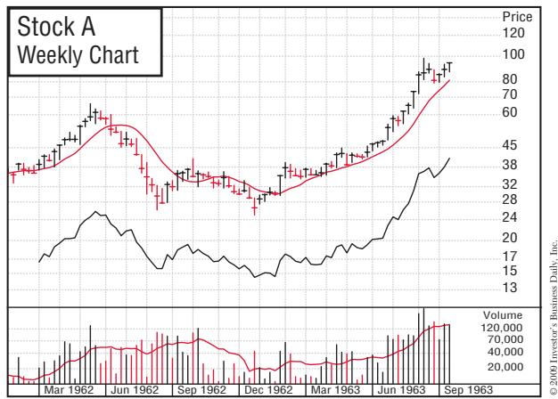

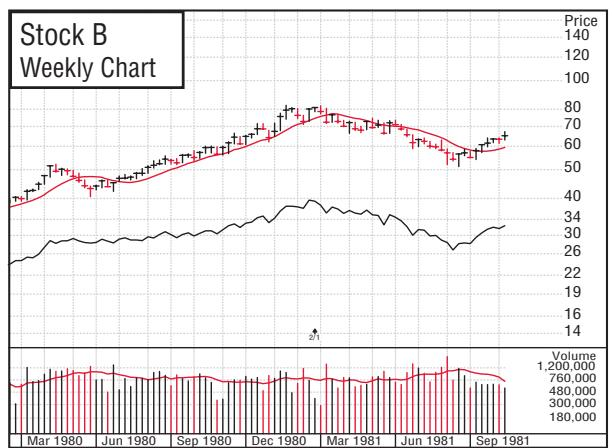

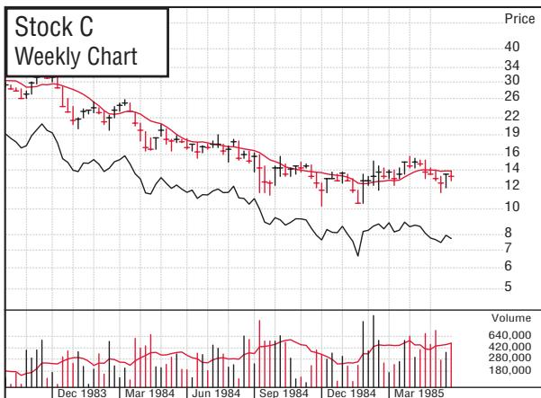

在大多数人看来价格太高、太冒险的股票，最终往往继续上涨；而在大多数人看来低廉、便宜的股票，往往继续下跌。

Are you finding this “high-altitude paradox” a little difficult to act upon? Let me cite another study we conducted. In this one, we analyzed two groups of stocks—those that made new highs and those that made new lows—over many bull market periods. The results were conclusive: stocks on the new-high list tended to go higher in price, while those on the newlow list tended to go lower. 

Based on our research, a stock on Investor’s Business Daily’s “new price low” list tends to be a pretty poor prospect and should be avoided. In fact, decisive investors should sell such stocks long before they ever get near the new-low list. A stock making the new-high list—especially one making the list for the first time while trading on big volume during a bull market— might be a prospect with big potential. 

### How Does a Stock Go from \$50 to \$100?

如果你无法说服自己在股票从未达到过的价位买入，那么请问自己：一只在其中许多个月里于每股 40 到 50 美元间交易、如今卖 50 美元的股票，要怎样才能翻倍？它不是得先经过 51、52、53、54、55 美元，如此一路创出新高，才能到达 100 美元吗？

作为聪明的投资者，你的任务是在一只股票对多数传统投资者而言显得太高时买入，在它大幅上涨、终于开始对其中某些人显得有吸引力之后卖出。如果你在 1990 年 11 月、思科刚创出新高、看起来吓人时，以它当时的历史最高价买入，那么从那一刻到 2000 年峰值，你将享受到近 75000% 的涨幅。

If you can’t bring yourself to buy a stock at a level it has never before achieved, ask yourself: What does a stock that has traded between \$40 and \$50 a share over many months, and is now selling at \$50, have to do to double in price? Doesn’t it first have to go through \$51, then \$52, \$53, \$54, \$55, and so on—all new price highs—before it can reach \$100? 

As a smart investor, your job is to buy when a stock looks too high to the majority of conventional investors and sell after it moves substantially higher and finally begins to look attractive to some of those same investors. If you had bought Cisco in November of 1990 at the highest price it had ever sold for, when it had just made a new high and looked scary, you would have enjoyed a nearly 75,000% increase from that point forward to its peak in the year 2000. 

### The Correct Time to Begin Buying a Stock

仅仅因为一只股票正在创新高，并不必然意味着现在是买入的正确时机。使用股票图表是选股过程的重要一环。应当仔细审视股票的历史价格运动，寻找那些从正确、合格的底部突破、同时创出价格新高的股票。（关于读图和辨识形态的更多细节，请回看第 2 章。）第 1 章中 100 个整页的精彩范例，应已给你一个真正的先发优势。

这些正确形成的突破，正是多数真正大的价格涨势启动之处，也是出现重大价格运动的可能性最大之处。一段健康的整理、或称筑底期，可能持续七到八周，直至 15 个月。

如第 2 章所述，完美的买入时机是在牛市中、股票刚刚开始突破价格底部之际。（参见第 178 页美国在线的图表。）如果股票已高出底部精确买点 5% 或 10% 以上，就应回避。在这个水平买入，会大大增加在下次正常回调或急跌中被震出的概率。你不能随便什么时候都买入最好的股票。有一个正确的时间，然后就是其他所有时间。

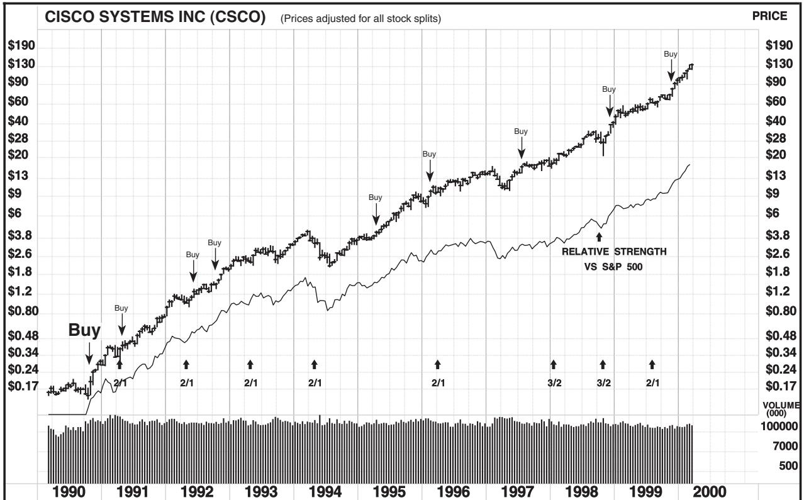

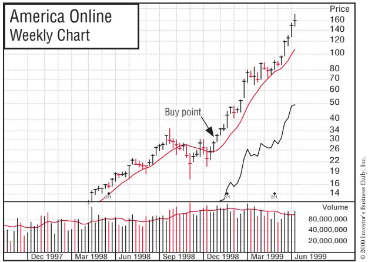

（市场大悖论的答案）

既然你已了解大悖论，你还会选择本章早先所挑的那只股票吗？该买的是股票 A，Syntex Corp.，见下一页。指向 1963 年 7 月周线价格运动的箭头标示了买点。这个箭头与股票 A 图表末尾（做了 3 拆 1 调整后）的价量活动相吻合。Syntex 从 1963 年 7 月的买点开启了一波重大上涨。相比之下，股票 B（Halliburton）和股票 C（Comdata Network）双双下跌，如后页图表所示。（箭头标示了此前展示的图表结束之处。）

寻找那些开发出重要新产品或新服务、或因新管理层或行业状况实质性改善而受益的公司。然后，当它们从健康、经正确分析的价格整理形态中脱颖而出、接近或实际创出价格新高、并伴随成交量放大时，买入它们的股票。

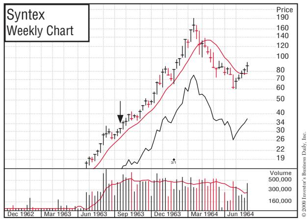

股票 A：从买入箭头起 6 个月上涨 482%。

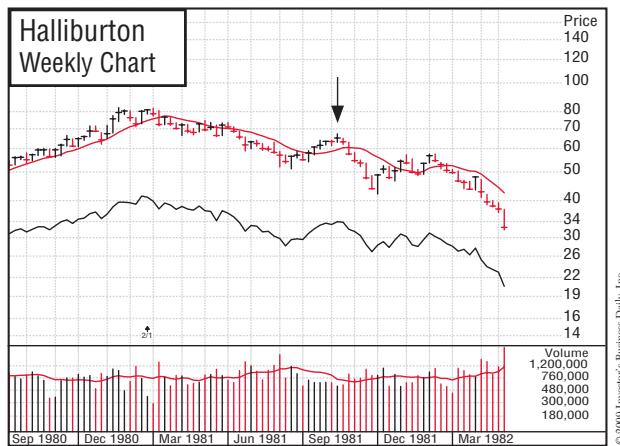

股票 B：从箭头起 6 个月下跌 42%。

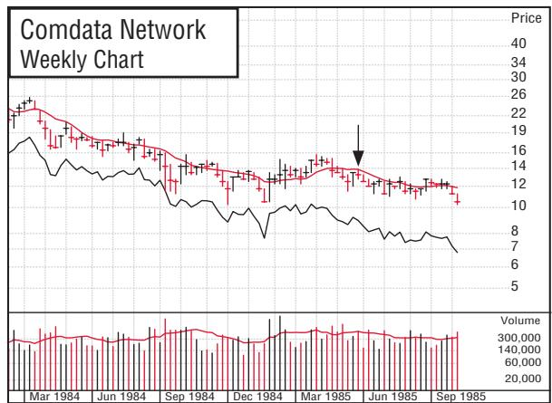

股票 C：从箭头起 5 个月下跌 21%。

Just because a stock is making a new price high doesn’t necessarily mean that this is the right time to buy. Using stock charts is an important piece of the stock selection process. A stock’s historical price movement should be reviewed carefully, and you should look for stocks that are making new price highs as they break out of proper, correct bases. (Refer back to Chapter 2 for more detail on reading charts and identifying chart patterns.) The 100 great full-page examples in Chapter 1 should have given you a real head start. 

These correctly created breakouts are the points at which most really big price advances begin and the possibility of a significant price move is the greatest. A sound consolidation, or base-building, period could last from seven or eight weeks up to 15 months. 

As noted in Chapter 2, the perfect time to buy is during a bull market just as a stock is starting to break out of its price base. (See the America Online chart on page 178.) If the stock is more than 5% or 10% above the exact buy point off the base, it should be avoided. Buying it at this level greatly increases the chance of getting shaken out in the next normal correction or sharp pullback in price. You can’t just buy the best stocks any old time. There’s a right time, and then there are all the other times. 

Answers to the Market’s Great Paradox

Now that you know the Great Paradox, would you still pick the same stock you did earlier in the chapter? The right one to buy was Stock A, Syntex Corp., which is shown on the next page. The arrow pointing to July 1963’s weekly price movements indicates the buy point. This arrow coincides with the price and volume activity at the end of the Stock A chart, adjusted for a 3-for-1 split. Syntex enjoyed a major price advance from its July 1963 buy point. In contrast, Stocks B (Halliburton) and C (Comdata Network) both declined, as you can see from the charts given on the next page. (The arrows indicate where the corresponding charts shown earlier left off.) 

Search for companies that have developed important new products or services, or that have benefited from new management or materially improved industry conditions. Then buy their stocks when they are emerging from sound, correctly analyzed price consolidation patterns and are close to, or actually making, new price highs on increased volume. 

Stock A: 482% increase in 6 months from buy arrow.

Stock B: down 42% in 6 months from arrow.

Stock C: down 21% in 5 months from arrow.

## Chapter6 S = Supply and Demand: Big Volume Demand at Key Points

> **中文标题：** S = 供需：关键位置的大成交量需求

**中文翻译（导语）**

日常生活中几乎一切东西的价格，都由供需法则决定。你为生菜、番茄、鸡蛋和牛肉付多少钱，取决于每种东西有多少供应、有多少人想要。即便在昔日的共产主义国家，理论上不存在有产者与无产者的差别，供需依然主导一切。在那里，国有商品总是供应短缺，往往只有特权阶层才能得到，或只能在黑市上卖给那些付得起高价的人。

这条基本的供需原理同样适用于股市，而且在那里，它比华尔街所有分析师的意见都更重要，无论他们上过什么学校、拿过什么学位、智商有多高。

**英文原文（导语）**

The price of almost everything in your daily life is determined by the law of supply and demand. What you pay for your lettuce, tomatoes, eggs, and beef depends on how much of each is available and how many people want these items. Even in former Communist countries, where the difference between haves and have-nots was theoretically nonexistent, supply and demand held sway. There, state-owned goods were always in short supply and were often available only to the privileged class or on the black market to those who could pay the exorbitant prices. 

This basic principle of supply and demand also applies to the stock market, where it is more important than the opinions of all the analysts on Wall Street, no matter what schools they attended, what degrees they earned, or how high their IQs. 

### Big or Small Supply of Stock

要撬动一只流通 50 亿股的股票，很难，因为供应太大。要让这些股票出现一波振奋的上涨，需要巨量的买入，即需求。相反，要推高一只流通 5000 万股的股票，只需合理的买盘——供应相对较小。

所以，如果你在两只股票之间做选择，一只流通 50 亿股，另一只流通 5000 万股，在其他因素相同的情况下，较小的那只通常表现更好。不过，由于小市值股票流动性较差，它们可能涨得多快就跌得多快，有时甚至更快。换言之，更大的机会伴随着显著增加的风险。但有些确定的方法可以最小化风险，将在第 10、11 章讨论。

公司资本结构中的流通股总股数，代表股票的潜在供应量。但市场专业人士还会看“流通盘”——扣除被紧密持有的股票之后，可供潜在买入的股数。管理层持有大量股票（大公司至少 1% 到 3%，小公司更多）的公司，通常是更好的选择，因为管理层在这只股票上有切身利益。

除了供需之外，还有一个基本面原因说明为什么流通股数多的公司往往业绩较慢：这些公司本身可能老得多、增长也慢。它们实在太大、太迟钝。

不过，1990 年代大市值股票曾连续数年跑赢小盘股。部分原因与共同基金群体的规模问题有关。随着越来越多人买基金，它们突然发现自己手里涌入大量新现金。结果，规模较大的基金被迫买入更多大市值股票。这种让新钱尽快投出去的需要，使它们看似偏爱大市值股。但这与正常的供需效应相反——正常效应有利于流通股更少、更能满足机构需求增长的小盘股。

大市值股票确实有些优势：流动性更好、下跌波动通常更小、质量更优，某些情况下风险更低。而且大型基金如今拥有的巨大购买力，能让顶尖的大盘股上涨得几乎和小公司股票一样快。

It’s hard to budge the price of a stock that has 5 billion shares outstanding because the supply is so large. Producing a rousing rally in these shares would require a huge volume of buying, or demand. On the other hand, it takes only a reasonable amount of buying to push up the price of a stock with 50 million shares outstanding, a relatively smaller supply. 

So if you’re choosing between two stocks to buy, one with 5 billion shares outstanding and the other with 50 million, the smaller one will usually be the better performer, if other factors are equal. However, since smaller-capitalization stocks are less liquid, they can come down as fast as they go up, sometimes even faster. In other words, with greater opportunity comes significant additional risk. But there are definite ways of minimizing your risk, which will be discussed in Chapters 10 and 11. 

The total number of shares outstanding in a company’s capital structure represents the potential amount of stock available. But market professionals also look at the “floating supply”— the number of shares that are available for possible purchase after subtracting stock that is closely held. Companies in which top management owns a large percentage of the stock (at least 1% to 3% in a large company, and more in small companies) generally are better prospects because the managers have a vested interest in the stock. 

There’s another fundamental reason, besides supply and demand, why companies with a large number of shares outstanding frequently produce slower results: the companies themselves may be much older and growing at a slower rate. They are simply too big and sluggish. 

In the 1990s, however, bigger-capitalization stocks outperformed smallcap issues for several years. This was in part related to the size problem experienced by the mutual fund community. It suddenly found itself awash in new cash as more and more people bought funds. As a result, larger funds were forced to buy more bigger-cap stocks. This need to put their new money to work made it appear that they favored bigger-cap issues. But this was contrary to the normal supply/demand effect, which favors smaller-cap stocks with fewer shares available to meet increases in institutional investor demand. 

Big-cap stocks do have some advantages: greater liquidity, generally less downside volatility, better quality, and in some cases less risk. And the immense buying power that large funds have these days can make top-notch big stocks advance nearly as fast as shares of smaller companies. 

### Pick Entrepreneurial Management Rather than Caretakers

大公司看似拥有巨大的权力和影响力，但规模往往带来想象力和生产效率的匮乏。大公司常由较年长、较保守的“看管型管理层”经营，他们不太愿意创新、冒风险，也不太愿意迅速而明智地行动以跟上快速变化的时代。多数情况下，大公司的高管并不持有大量自家股票。这是一个应当纠正的严重缺陷。对精明的投资者而言，它暗示公司管理层和员工并未对公司的成功抱有切身的兴趣。某些情况下，大公司还有多层管理，把高层与客户层面的实际情况隔开。而对在市场经济中竞争的公司来说，最终的老板是客户。

信息的沟通正以越来越快的速度变化。一家今天拥有热门新产品的公司，如果不再持续把相关、卓越的新产品推向市场，两三年内就会发现销售下滑。多数新产品、新服务和发明，来自年轻、渴望成功、富有创新精神的中小型创业管理公司。并非巧合的是，这些较小的上市和非上市公司增长更快，并创造了美国约 80% 到 90% 的新增就业。它们许多属于服务业或技术与信息产业。这可能正是美国未来巨大增长所在。微软、思科系统和甲骨文，只是 1980、1990 年代充满活力的小盘创新者中几个例子，它们持续成长，最终成为大市值股票。

如果一家庞大的老公司创造出一款重要的新产品，对股价可能也没多大帮助，因为该产品很可能只占公司总销售和盈利的一小部分。它不过是现在已变得太大的水桶里的一滴水。

Big companies may seem to have a great deal of power and influence, but size often begets a lack of imagination and productive efficiency. Large companies are often run by older and more conservative “caretaker managements” that are less willing to innovate, take risks, and move quickly and wisely to keep up with rapidly changing times. In most cases, top managers of large companies don’t own a lot of their company’s stock. This is a serious deficiency that should be corrected. To the savvy investor, it suggests that the company’s management and employees don’t have a personal interest in seeing the company succeed. In some cases, large companies also have multiple layers of management that separate senior executives from what’s going on at the customer level. And for companies competing in a capitalist economy, the ultimate boss is the customer. 

Communication of information continues to change at an ever-faster rate. A company that has a hot new product today will find its sales slipping within two or three years if it doesn’t continue to bring relevant, superior new products to market. Most new products, services, and inventions come from young, hungry, and innovative small- and medium-sized companies with entrepreneurial management. Not coincidentally, these smaller public and nonpublic companies grow faster and create somewhere between 80% and 90% of the new jobs in the United States. Many of them are in the service or technology and information industries. This is possibly where the great future growth of America lies. Microsoft, Cisco Systems, and Oracle are just a few examples of dynamic small-cap innovators of the 1980s and 1990s that continually grew and eventually became big-cap stocks. 

If a mammoth older company creates an important new product, it may not help the stock materially because the product will probably account for only a small percentage of the company’s total sales and earnings. The product is simply a small drop in a bucket that’s now just too big. 

### Excessive Stock Splits May Hurt

公司时常会犯拆股过度的错误。这有时是听从华尔街投资银行家的建议而为之。在我看来，公司按 2 拆 1 或 3 拆 2 拆分股票，通常比 3 拆 1 或 5 拆 1 更好。（当一只股票按 2 拆 1 拆分时，你此前持有的每一股变成两股，但新股价只有原来的一半。）超大规模的拆股会创造显著更大的供应量，可能使公司更早进入更迟钝的大市值状态。

顺便说一句，一只股票在新牛市中的首次拆股之后，通常最终会走高。但在上涨之前，它会经历数周的回调。

一家股价已上涨一两年、却在牛市末期或熊市早期宣布巨额拆股的公司，可能是不明智的。但这恰恰是许多公司会做的事。

一般来说，这些公司认为降低股价能吸引更多买家。对一些小买家而言或许如此，但它也可能产生相反的结果——更多卖家，尤其当它是两年内的第二次拆股时。精明的专业人士和少数机敏的个人交易者，很可能把超大规模拆股带来的兴奋当作卖出获利的机会。此外，考虑卖出的持有大户可能盘算：在 3 拆 1 之前抛掉 10 万股，比之后卖出 30 万股更容易。而聪明的卖空者会挑选那些被机构大量持有、并在巨大涨幅后开始摇摇欲坠的股票。

一只股票往往在第二或第三次拆股前后见顶。我们对最大赢家的研究发现，其中只有 18% 在其大涨前的那一年进行过拆股。高通在 1999 年 12 月见顶，恰好在其 4 拆 1 拆股之后。

From time to time, companies make the mistake of splitting their stocks excessively. This is sometimes done on advice from Wall Street investment bankers. In my opinion, it’s usually better for a company to split its shares 2-for-1 or 3-for-2 than to split them 3-for-1 or 5-for-1. (When a stock splits 2-for-1, you get two shares for each share you previously held, but the new shares sell for half the price.) Oversized splits create a substantially larger supply and may put a company in the more lethargic, big-cap status sooner. 

Incidentally, a stock will usually end up moving higher after its first split in a new bull market. But before it moves up, it will go through a correction for a period of weeks. 

It may be unwise for a company whose stock has gone up in price for a year or two to declare an extravagant split near the end of a bull market or in the early stage of a bear market. Yet this is exactly what many corporations do. 

Generally speaking, these companies feel that lowering the share price of their stock will attract more buyers. This may be the case with some smaller buyers, but it also may produce the opposite result—more sellers—especially if it’s the second split within a year or two. Knowledgeable pros and a few shrewd individual traders will probably use the excitement generated by the oversized split as an opportunity to sell and take their profits. In addition, large holders who are thinking of selling might figure it will be easier to unload their 100,000 shares before a 3-for-1 split than to sell 300,000 shares afterward. And smart short sellers pick on stocks that are heavily owned by institutions and are starting to falter after huge price run-ups. 

A stock will often reach a price top around the second or third time it splits. Our study of the biggest winners found that only 18% of them had splits in the year preceding their great price advances. Qualcomm topped in December 1999, just after its 4-for-1 stock split. 

### Look for Companies Buying Their Own Stock in the Open Market

在多数（但非全部）情况下，一家公司——尤其是一家符合 CAN SLIM 标准的中小型成长公司——在一段时间里持续在公开市场回购自家股票，通常是好迹象。（回购 10% 会被视为大规模。）这减少了股数，通常意味着公司预期未来销售和盈利会改善。

由于回购，公司的净利润会除以更少的股数，从而提高每股收益。而如前所述，每股收益的百分比增长，是推动出色股票的主动力之一。

从 1970 年代中期到 1980 年代初，Tandy、Teledyne 和 Metromedia 成功回购了自家股票，三家都实现了更高的 EPS 增长和惊人的股价涨幅。Charles Tandy 曾告诉我，当市场进入回调、他的股票下跌时，他会去银行借钱回购自家股票，待市场恢复后再偿还贷款。当然，那也是他公司报告盈利稳定增长的时候。

Tandy（拆股调整后）的股价 1983 年从 2.75 美元涨到 60 美元，Metromedia 从 1971 年的 30 美元飙升到 1977 年的 560 美元，Teledyne 则从 1971 年的 8 美元猛涨到 1984 年的 190 美元。Teledyne 通过八次独立回购，把股本从 8800 万股缩减到 1500 万股，每股收益则从 0.61 美元提高到近 20 美元。

1989 和 1990 年，International Game Technology 宣布回购其 20% 的股票。到 1993 年 9 月，IGT 已上涨逾 20 倍。另一个大赢家、住宅建筑商 NVR Inc. 在 2001 年进行了大规模回购。这些都是成长型公司。我不确定在盈利没有增长时进行回购是否足够合理。

In most but not all cases, it’s usually a good sign when a company, especially a small- to medium-sized growth company that meets the CAN SLIM criteria, buys its own stock in the open market consistently over a period of time. (A 10% buyback would be considered big.) This reduces the number of shares and usually implies that the company expects improved sales and earnings in the future. 

As a result of the buyback, the company’s net income will be divided by a smaller number of shares, thereby increasing earnings per share. And as already noted, the percentage increase in earnings per share is one of the principal driving forces behind outstanding stocks. 

From the mid-1970s to the early 1980s, Tandy, Teledyne, and Metromedia successfully repurchased their own stock, and all three achieved higher EPS growth and spectacular stock gains. Charles Tandy once told me that when the market went into a correction, and his stock was down, he would go to the bank and borrow money to buy back his stock, then repay the loans after the market recovered. Of course, this was also when his company was reporting steady growth in earnings. 

Tandy’s (split-adjusted) stock increased from \$2.75 to \$60 in 1983, Metromedia’s soared from \$30 in 1971 to \$560 in 1977, and Teledyne zoomed from \$8 in 1971 to \$190 in 1984. Teledyne used eight separate buybacks to shrink its capitalization from 88 million shares to 15 million and increase its earnings from \$0.61 a share to nearly \$20. 

In 1989 and 1990, International Game Technology announced that it was buying back 20% of its stock. By September 1993, IGT had advanced more than 20 times. Another big winner, home builder NVR Inc., had large buybacks in 2001. All these were growth companies. I’m not sure that company buybacks when earnings are not growing are all that sound. 

### A Low Corporate Debt-to-Equity Ratio Is Generally Better

在你找到一只股数合理的股票后，查一查长期债务或债券占公司总资本的百分比。通常，负债率越低，公司越安全、越优质。高负债权益比公司的每股收益，在高利率的困难时期或更严重的衰退中可能遭受重创。这类高杠杆公司通常质量较低，并承担显著更高的风险。

从 1995 年一直到 2007 年，银行、券商、抵押贷款机构和房利美、房地美这类准政府机构中，普遍使用高达 40 比 1 甚至 50 比 1 的极端杠杆。这些机构在联邦政府行动的强烈鼓励下，向低收入买家大量放贷于次贷，最终导致了 2008 年的金融与信贷危机。

After you’ve found a stock with a reasonable number of shares, check the percentage of the company’s total capitalization represented by long-term debt or bonds. Usually, the lower the debt ratio, the safer and better the company. The earnings per share of companies with high debt-to-equity ratios could be clobbered in difficult periods when interest rates are high or during more severe recessions. These highly leveraged companies are generally of lower quality and carry substantially higher risk. 

The use of extreme leverage of up to 40-to-1 or 50-to-1 was common among banks, brokers, mortgage lenders, and quasi-government agencies like Fannie Mae and Freddie Mac starting in 1995 and continuing until 2007. These institutions were strongly encouraged by the federal government’s actions to invest large amounts of money in subprime loans to lowerincome buyers, which ultimately led to the financial and credit crisis in 2008. 

### Rule 1 for all competent investors and homeowners is never ever borrow more than you can pay back. Excessive debt hurts all people, companies, and governments.

对所有称职的投资者和房主而言，第一条规则是：永远不要借超过你偿还能力的钱。过度负债会伤害所有人、所有公司和所有政府。

A corporation that’s been reducing its debt as a percentage of equity over the last two or three years is worth considering. If nothing else, interest costs will be sharply reduced, helping to generate higher earnings per share. 

Another thing to watch for is the presence of convertible bonds in the capital structure; earnings could be diluted if and when the bonds are converted into shares of common stock. 

### Evaluating Supply and Demand

衡量一只股票供需的最佳办法，是观察其日成交量。这一点格外重要，也是《投资者商业日报》股票表既显示当日成交量、又显示该成交量高于或低于过去三个月日均量的百分比的原因。这些衡量，加上对近期吸筹或派发程度的专有评级，是任何其他日报（包括《华尔街日报》）都无从获取的宝贵信息。

当股票价格回落时，你通常希望在某一点看到成交量枯竭，表明不再有重大的抛压。当股票上涨时，多数情况下你希望看到成交量上升，这通常代表机构而非公众在买入。

当股票突破价格整理区时（参见第 2 章关于读图和辨识制胜股价格形态的内容），成交量应至少比正常水平高出 40% 或 50%。许多情况下，当日成交量会放大 100% 或更多，表明对该股的坚实买入和进一步上涨的可能。使用日线和周线图，有助于你分析和解读股票的价量表现。月线图也有价值。

你应当逐周分析股票的底部形态，从股票在刚形成的底部中收跌的第一周开始，一直持续到当前这一周——你相信它可能突破底部的那一周。你要判断股票每周向上或向下取得了多少价格进展，以及这是在上周基础上成交量放大还是缩小。你还要留意股票当周收盘价处于该周高低价幅中的什么位置。你既要逐周检查，也要评估形态的整体轮廓，看它是处于吸筹之中的健康形态，还是有太多缺陷。

请记住：任何市值规模的股票都可以用 CAN SLIM 体系买入。但小盘股的波动会显著更大，无论上涨还是下跌。市场会不时把重心从小盘股转向大盘股，反之亦然。那些在公开市场回购股票、且管理层持股可观的公司在优先之列。

The best way to measure a stock’s supply and demand is by watching its daily trading volume. This is exceptionally important, and it’s why Investor’s Business Daily’s stock tables show both a stock’s volume of trading for the day and the percentage that volume is above or below the stock’s average daily volume over the last three months. These measurements, plus a proprietary rating of the degree of recent accumulation or distribution in the stock, are invaluable pieces of information that are available in no other daily publication, including the Wall Street Journal. 

When a stock pulls back in price, you typically want to see volume dry up at some point, indicating that there is no further significant selling pressure. When the stock rallies in price, in most situations you want to see volume rise, which usually represents buying by institutions, not the public. 

When a stock breaks out of a price consolidation area (see Chapter 2 on chart reading and identifying the price patterns of winning stocks), trading volume should be at least 40% or 50% above normal. In many cases, it will increase 100% or much more for the day, indicating solid buying of the stock and the possibility for further increases in price. Using daily and weekly charts helps you analyze and interpret a stock’s price and volume action. Monthly charts are also of value. 

You should analyze a stock’s base pattern week by week, beginning with the first week that the stock closes down in a newly formed base and continuing each week until you get to the current week, where you believe it may break out of the base. You want to judge how much price progress up or down the stock made during each week and whether it was on increased or decreased volume from the prior week. You also want to note where the stock closed within the price spread of each week’s high and low. You both do a week-by-week check and evaluate the pattern’s overall shape to see if it is a sound pattern that’s been under accumulation or if it has too many defects. 

Remember: Stock of any size capitalization can be bought using the CAN SLIM system. But small-cap stocks will be substantially more volatile, both on the upside and on the downside. From time to time, the market will shift its empha sis from small to large caps and vice versa. Companies that are buying back their stock in the open market and that show considerable stock ownership by management are preferred. 

## Chapter7 L = Leader or Laggard: Which Is Your Stock?

> **中文标题：** L = 龙头还是落后股：你的股票属于哪一种？

**中文翻译（导语）**

人们倾向于买那些让他们感觉良好或舒服的股票。但在一个由不断带来上行惊喜的强势龙头组成的牛市里，这些情感上的宠儿往往被证明是最沉闷的落后股。

假设你想持有一只计算机行业的股票。如果你买入组里表现最好的那只，且时机正确，你就有机会获得真正的价格升值。但如果你买入一只没怎么上涨、甚至已跌到看似便宜因而更安全的股票，那很可能说明你挑到了一只潜力寥寥的股票。毕竟，它处在最底端是有原因的。

不要只是浅尝辄止地涉猎股票，凭一时喜好随意买入。深入下去，做点侦探工作，弄清是什么让某些股票涨得比别的多得多。只要肯下功夫，你就能做到。

**英文原文（导语）**

People tend to buy stocks that make them feel either good or comfortable. But in a bull market populated by dynamic leaders that just keep surprising on the upside, these sentimental favorites often turn out to be the dullest laggards. 

Suppose you want to own a stock in the computer industry. If you buy the best performer in the group, and your timing is right, you have a crack at real price appreciation. But if you buy a stock that hasn’t moved much, or that has even fallen to a price that makes it seem like a bargain and therefore safer, chances are that you’ve picked a stock with little potential. There’s a reason, after all, that it’s at the bottom of the pile. 

Don’t just dabble in stocks, buying what you like for whatever reason. Dig in, do some detective work, and find out what makes some stocks go up much more than others. You can do it, if you work at it. 

### Buy Among the Best Two or Three Stocks in a Group

一个强势行业组里最好的那一、两或三只股票，可能有难以置信的增长，而组里其他股票可能几乎纹丝不动。

1979 和 1980 年牛市中的伟大计算机股——王安实验室、Prime Computer、Datapoint、Rolm 和 Tandy——在见顶回落之前分别有五倍、六倍、七倍的涨幅。但情感上的宠儿、昔日伟大的 IBM，却只是原地踏步，巨头 Burroughs、NCR 和 Sperry Rand 同样毫无生气。然而在 1981–1983 年的牛市中，IBM 焕发生机，交出了出色的业绩。

在零售板块，家得宝从 1988 到 1992 年上涨 10 倍，而家居装修细分市场中的落后者 Waban 和 Hechinger 则大幅落后。

你应当买入真正伟大的公司——那些引领行业、在自己特定领域排名第一的公司。我所有最好的大赢家——1963 年的 Syntex、1976 到 1983 年的 Pic 'N' Save、1982 到 1985 年的 Price Co.、1985 到 1986 年的 Franklin Resources、1986 到 1987 年的基因泰克、1990 到 1991 年的安进、1998 到 1999 年的美国在线、1998 到 1999 年的嘉信理财、1998 到 1999 年的 Sun Microsystems、1999 年的高通、2002 到 2004 年的 eBay、2004 到 2007 年的谷歌，以及 2004 到 2007 年的苹果——在我买入时，都是其行业领域中排名第一的公司。

所谓第一，我指的不是最大的公司、或品牌知名度最高的公司，而是季度和年度盈利增长最好、净资产收益率最高、利润率最宽、销售增长最强、股价表现最具活力的那一家。这类公司还会拥有独特而卓越的产品或服务，并从更老、更缺创新的竞争对手那里夺取市场份额。

The top one, two, or three stocks in a strong industry group can have unbelievable growth, while others in the pack may hardly stir. 

The great computer stocks in the bull market of 1979 and 1980—Wang Labs, Prime Computer, Datapoint, Rolm, and Tandy—had five-, six-, and sevenfold advances before they topped and retreated. But the sentimental favorite, grand old IBM, just sat there, and giants Burroughs, NCR, and Sperry Rand were just as lifeless. In the bull market of 1981–1983, however, IBM sprang to life and produced excellent results. 

In the retail sector, Home Depot advanced 10 times from 1988 to 1992, while the laggards in the home-improvement niche, Waban and Hechinger, dramatically underperformed. 

You should buy the really great companies—those that lead their industries and are number one in their particular fields. All of my best big winners—Syntex in 1963, Pic ‘N’ Save from 1976 to 1983, Price Co. from 1982 to 1985, Franklin Resources from 1985 to 1986, Genentech from 1986 to 1987, Amgen from 1990 to 1991, America Online from 1998 to 1999, Charles Schwab from 1998 to 1999, Sun Microsystems from 1998 to 1999, Qualcomm in 1999, eBay from 2002 to 2004, Google from 2004 to 2007, and Apple from 2004 to 2007—were the number one companies in their industry space at the time I purchased them. 

By number one, I don’t mean the largest company or the one with the most recognized brand name. I mean the one with the best quarterly and annual earnings growth, the highest return on equity, the widest profit margins, the strongest sales growth, and the most dynamic stock-price action. This type of company will also have a unique and superior product or service and be gaining market share from its older, less-innovative competitors. 

### Avoid Sympathy Stock Moves

我们的研究显示，股市中真正新鲜的事物很少，历史只是在不断重演。

1963 年 7 月，我第一次买入口服避孕药开发商 Syntex 的股票（它随后迅速飙升 400%），当时是在一个高而紧的旗形形态之后。多数人不敢碰它。这只股票刚在美国证券交易所创出每股 100 美元的新高，其价格再加上 45 倍的市盈率，让它显得太高、太吓人。当时没有券商为它出研究报告，唯一持有它的共同基金——一只 Value Line 基金——在上一季度它开始上涨时就把它卖了。相反，几家华尔街投资公司后来推荐 G. D. Searle 作为“同情股”。Searle 有类似 Syntex 的产品，其股价看起来便宜得多，因为它没涨那么多。但它的股票未能产生同样的结果。Syntex 是龙头，Searle 是落后股。

所谓同情股，是指同行业组中的一只股票，买入它是希望真正龙头的荣光能沾到它身上。但这类公司的利润通常相形见绌。这些股票最终会试图“同情”地跟随龙头上涨，但表现永远不及龙头。

1970 年，当时新兴仓储业务中的龙头 Levitz Furniture 成为一只令人振奋的市场赢家。Wickes Corp. 模仿 Levitz，许多人因为它的股票“更便宜”而买入，但 Wickes 从未有所表现，最终陷入财务困境。与此同时，Levitz 在见顶前上涨了 900%。

正如钢铁业先驱安德鲁·卡内基在其自传中所说：“先来者得牡蛎，后到者得牡蛎壳。”美国每一轮新的商业周期，都由新的创新者、发明家和企业家驱动。

如果我们的政府真的想创造就业、而非福利方案，最有力的办法将是对那些想创办新的小型创业企业的人，在头两三年提供强有力的税收激励。我们的数据显示，过去 25 年里，美国的小企业创造了全部新增就业的 80% 到 90%。这一比例显著高于政府数据所示——在政府数据里，新增就业没有得到现实、全面的核算。

例如，小企业管理局把小企业定义为员工少于 500 人的企业。的确，当山姆·沃尔顿创办沃尔玛、比尔·盖茨创办微软时，两家公司各自大概只有 30 或 40 人。一年后可能 75 人，再一年 120 人，然后 200、320、501 人。从那一刻起，它们就不再被视为小公司。但在接下来的 10 到 15 年里，其中一家创造了 100 多万个就业，另一家创造了 50 万个。这些就业全部由一位充满活力的企业家创办一家全新公司所创造，理应被这样认定和计数。

我们拥有一个覆盖所有上市公司的庞大数据库。过去 25 年，大企业净新增就业为零。当一家大企业收购另一家公司、从而立即充实其工资单时，它并没有创造新就业。事实上，它通常会整合并裁掉重复岗位的人员。许多这类公司还会随时间缩减规模。我们低效、官僚的政府需要开始把所有由新企业或小企业在成立头 15 或 20 年内创造的就业都统计进来。

Our studies show that very little in the stock market is really new; history just keeps repeating itself. 

When I first bought stock in Syntex, the developer of the birth-control pill, in July 1963 off a high, tight flag pattern (and it then rapidly shot up 400%), most people wouldn’t touch it. The stock had just made a new price high at \$100 on the American Stock Exchange, and its price plus its P/E ratio, 45, made it seem too high and scary. No brokerage firms had research reports on it then, and the only mutual fund that owned it—a Value Line fund—had sold it the prior quarter when it began moving up. Instead, several Wall Street investment firms later recommended G. D. Searle as a “sympathy play.” Searle had a product similar to Syntex’s, and its stock looked much cheaper because it hadn’t gone up as much. But its stock failed to produce the same results. Syntex was the leader; Searle the laggard. 

A sympathy play is a stock in the same industry group that is bought in the hope that the luster of the real leader will rub off on it. But the profits of such companies usually pale in comparison. The stocks will eventually try to move up “in sympathy” with the leader, but they never do as well. 

In 1970, Levitz Furniture, the leader in the then-new warehouse business, became an electrifying market winner. Wickes Corp. copied Levitz, and many people bought its shares because they were “cheaper,” but Wickes never performed and ultimately got into financial trouble. Levitz, meanwhile, appreciated 900% before it finally topped. 

As steel industry pioneer Andrew Carnegie said in his autobiography: “The first man gets the oyster; the second, the shell.” Each new business cycle in America is driven by new innovators, inventors, and entrepreneurs. 

If our government really wants to create jobs and not welfare packages, the most powerful way would be to provide strong tax incentives for the first two or three years to people who want to start new, small entrepreneurial businesses. Our data show that in the last 25 years, small businesses in America were responsible for creating 80% to 90% of all new jobs. This is a significantly higher percentage than that shown in government data, where new jobs are not accounted for in a realistic, comprehensive manner. 

For example, the Small Business Administration defines a small business as one with fewer than 500 people. Yes, when Sam Walton started Wal-Mart and Bill Gates started Microsoft, each company had maybe 30 or 40 people. A year later they had maybe 75, the next year 120, then 200, then 320, then 501. From that point on, they were no longer considered to be small companies. But over the next 10 or 15 years, one of them created more than a million jobs and the other 500,000 jobs. Those jobs were all created by a dynamic entrepreneur who started a brand-new company, and they should be recognized and counted as such. 

We have a huge database on all public companies. In the past 25 years, big business created no net new jobs. When a big business buys another company, thereby instantly padding its payrolls, it doesn’t create new jobs. In fact, it usually consolidates and lays off people in duplicative positions. Many such companies also downsize over time. Our inefficient, bureaucratic government needs to start counting all jobs created by new or small businesses during their first 15 or 20 years in business. 

### How to Separate the Leaders from the Laggards: Using Relative Price Strength

如果你持有一个股票组合，就必须学会先卖掉表现最差的股票，让最好的股票多留一会儿。换言之，趁亏损还小时卖掉你的错误，同时观察你较好的选择，看它们能否成长为你的大赢家。人性使然，多数人做得正好相反：他们抱着输家、卖掉赢家，而这套公式总是导致更大的亏损。

如何分辨哪只股票更好、哪只更差？最快、最简单的办法，是查看它在《投资者商业日报》中的相对价格强度（RS）评级。

该专有 RS 评级衡量一只股票过去 52 周相对市场其余部分的价格表现。市场上每只股票都被赋予 1 到 99 的评级，99 为最佳。RS 评级 99 意味着该股在价格表现上优于其他所有公司中的 99%。RS 为 50 意味着其他股票中有一半表现更好、一半表现更差。

如果你股票的 RS 评级低于 70，它就落后于整体市场中表现较好的股票。这并不意味着它不能上涨，只是意味着即便它碰巧上涨，涨幅大概也会更小。

从 1950 年代初到 2008 年，表现最好的股票在其大涨之前的平均 RS 评级为 87。换言之，最好的股票在开始它们最爆发性的一轮上涨时，表现已经好于将近每 10 只中的 9 只。因此，对下定决心要在股市中成为大赢家的人而言，规则是：寻找真正的龙头，回避落后股和同情股。不要买入相对强度评级处于 40、50 或 60 多的股票。

《投资者商业日报》的股票表每天显示所有上市股票的相对价格强度评级。你在任何其他日报的商业版或地方报纸上都找不到这一信息。更新后的 RS 评级也显示在 Daily Graphs Online 图表服务上。

股票的相对强度也可以画在图上。如果 RS 线已下滑七个月或更久，或该线在四个月或更久里出现异常陡峭的下跌，那么该股的价格行为就很可疑，很可能应当卖出。

If you own a portfolio of stocks, you must learn to sell the worst performers first and keep the best a little longer. In other words, always sell your mistakes while the loss is still small, and watch your better selections to see if they progress into your big winners. Human nature being what it is, most people do it backwards: they hold their losers and sell their winners, a formula that always leads to bigger losses. 

How do you tell which stock is better and which is worse? The fastest and easiest way is by checking its Relative Price Strength (RS) Rating in Investor’s Business Daily. 

The proprietary RS Rating measures the price performance of a given stock against the rest of the market for the past 52 weeks. Every stock in the market is assigned a rating from 1 to 99, with 99 being best. An RS Rating of 99 means that the stock has outperformed 99% of all other companies in terms of price performance. A RS of 50 means that half of all other stocks have done better and half have done worse. 

If your stock’s RS Rating is below 70, it is lagging the better-performing stocks in the overall market. That doesn’t mean that it can’t go up in price. It just means that if by some chance it does go up, it’ll probably go up less. 

From the early 1950s through 2008, the average RS Rating of the bestperforming stocks before their major run-ups was 87. In other words, the best stocks were already doing better than nearly 9 out of 10 others when they were starting out on their most explosive advance yet. So the rule for those who are determined to be big winners in the stock market is: look for the genuine leaders and avoid laggards and sympathy plays. Don’t buy stocks with Relative Strength Ratings in the 40s, 50s, or 60s. 

The Relative Price Strength Rating is shown each day for all stocks listed in Investor’s Business Daily’s stock tables. You can’t find this information in any other daily business or local newspaper. Updated RS Ratings are also shown on the Daily Graphs Online charting service. 

A stock’s relative strength can also be plotted on a chart. If the RS line has been sinking for seven months or more, or if the line has an abnormally sharp decline for four months or more, the stock’s price behavior is highly questionable, and it should probably be sold. 

### Pick 80s and 90s That Are in Sound and Proper Chart Base Patterns

如果你想让选股水平升级、锁定真正的龙头，就把买入范围限制在 RS 评级 80 或更高的公司。买入一只落在后面的股票毫无意义。但这恰恰是许多投资者（包括一些在美国最大的投资公司工作的人）所做的事。

我不喜欢买入相对价格强度评级低于 80 的股票。事实上，真正的大赢家在其突破第一或第二个底部结构之前，RS 评级通常在 90 或更高。一只潜在制胜股的 RS 评级，应当与投手的快球处在一个级别。大联盟快球的平均时速是 86 英里，而最好的投手能投出 90 多英里的“火球”。

买入一只股票时，务必确保它出自一个健康、扎实的底部或价格整理区。还要确保你是在其精确买点、即枢轴点买入。如前所述，避免买入高出精确初始买点 5% 或 10% 以上的股票。这会让你不去追那些涨得太快的股票，也降低你在市场急剧抛售中被震出的概率。

投资者不愿为选股设定并遵循最低标准，这让我想起多年前那些不知道手术前需要给器械消毒的医生。他们不断地让病人死去，直到外科医生终于、且不情愿地接受了研究人员路易·巴斯德和约瑟夫·李斯特的研究成果。在人生的任何行当里，无知都很少带来好处，股市也不例外。

If you want to upgrade your stock selection so that you’re zeroing in on the leaders, restrict your purchases to companies showing RS Ratings of 80 or higher. There’s no point in buying a stock that’s straggling behind. Yet that’s exactly what many investors do—including some who work at America’s largest investment firms. 

I don’t like to buy stocks with Relative Price Strength Ratings less than 80. In fact, the really big moneymakers generally have RS Ratings of 90 or higher just before they break out of their first or second base structure. The RS Rating of a potential winning stock should be in the same league as a pitcher’s fastball. The average big-league fastball is clocked at 86 miles per hour, and the best pitchers throw “heat” in the 90s. 

When you buy a stock, make absolutely sure that it’s coming out of a sound base or price consolidation area. Also make sure that you buy it at its exact buy, or pivot, point. As mentioned before, avoid buying stocks that are extended more than 5% or 10% above the precise initial buy point. This will keep you from chasing stocks that race up in price too rapidly and makes it less likely that you will be shaken out during sharp market sell-offs. 

The unwillingness of investors to set and follow minimum standards for stock selection reminds me of doctors years ago who were ignorant of the need to sterilize their instruments before each operation. They kept killing off patients until surgeons finally and begrudgingly accepted studies by researchers Louis Pasteur and Joseph Lister. Ignorance rarely pays off in any walk of life, and it’s no different in the stock market. 

### Finding New Leaders during Market Corrections

大盘的回调、即价格下跌，能帮你识别新龙头——前提是你知道该找什么。较理想的成长股通常回调到大盘均值的 1½ 到 2½ 倍。换言之，如果整体市场下跌 10%，较好的成长股会回调 15% 到 25%。不过，在牛市（上升趋势市场）中的回调里，跌幅（按百分比）最小的成长股通常是你最好的选择，跌得最多的通常最弱。

假设大盘指数遭遇一次 10% 的中级回调，而你的三只成功成长股分别下跌 15%、25% 和 35%。只跌了 15% 或 25% 的那两只，很可能在回升后成为你最好的投资。在大盘下跌 10% 时下跌 35% 到 40% 的股票，可能正在发出警告信号。多数情况下，你应当听从它。

一旦大盘的下跌确定结束，最先反弹创出价格新高的股票，几乎总是你真正的龙头。这些图表突破一周接一周地持续，大约持续 13 周。最好的一些通常在前三、四周就出现了。这是买入股票的理想时段……你绝对不想错过。务必仔细阅读关于大盘方向的章节，学会如何判断它。

Corrections, or price declines, in the general market can help you recognize new leaders—if you know what to look for. The more desirable growth stocks normally correct 1½ to 2½ times the general market averages. In other words, if the overall market comes down 10%, the better growth stocks will correct 15% to 25%. However, in a correction during a bull, or upward-trending, market, the growth stocks that decline the least (percentagewise) are usually your best selections. Those that drop the most are normally the weakest. 

Say the general market average suffers an intermediate-term correction of 10%, and three of your successful growth stocks come off 15%, 25%, and 35%. The two that are off only 15% or 25% are likely to be your best investments after they recover. A stock that slides 35% to 40% in a general market decline of 10% could be flashing a warning signal. In most cases, you should heed it. 

Once a general market decline is definitely over, the first stocks that bounce back to new price highs are almost always your authentic leaders. These chart breakouts continue week by week for about 13 weeks. The best ones usually come out in the first three or four weeks. This is the ideal period to buy stocks . . . you absolutely don’t want to miss it. Be sure to read the chapter on general market direction carefully to learn how you determine it. 

### Pros Make Many Mistakes Too

许多专业投资管理人犯下一个严重错误：买入刚刚遭遇异常大幅下跌的股票。我们的研究显示，这是让自己陷入麻烦的必由之路。

1972 年 6 月，马里兰州一位本来很有能力的机构投资者，在 Levitz Furniture 首次异常破位（一周内从 60 美元跌到约 40 美元）之后买入。股价反弹了几周，随后掉头跌破 18 美元。

1978 年 10 月，几家机构投资者在 Memorex 首次异常破位、看似确实有价值时买入这家领先的计算机外设供应商。它后来暴跌。

1981 年 9 月，纽约某些资金管理人在 Dome Petroleum 从 16 美元跌到 12 美元时买入。在他们看来这很便宜，而且当时华尔街正流传着一个关于该股的利好故事。几个月后，Dome 只卖 1 美元。

机构买家在朗讯科技从 78 美元跌破 50 美元后纷纷抢购——朗讯在 1990 年代中期从 AT&T 分拆出来，曾是华尔街的宠儿。当年晚些时候，它崩跌到 5 美元。

同样在 2000 年，许多人在思科系统从年初高点 82 美元跌到 50 美元时买入。这家计算机网络设备制造商在 1990 年代曾是一只巨大赢家、飙升 75000%，所以 50 美元看起来便宜。它跌到 8 美元，再也没回到 50 美元。2008 年，即那些买家在 50 美元看到价值八年之后，思科只卖 17 美元。要在股市中做得好，你必须停止做那些让你过去陷入麻烦的事，并创造出全新、好得多的规则和方法来指引未来。

假设投资者老乔错过了在 2006 年 9 月、以拆股调整后 15 美元买入鞋类公司 Crocs 的完美杯柄形态突破。假设他也错过了 2007 年 4 月 28 美元处的下一个杯形。随后股价到 10 月猛涨到 75 美元，盈利每季度增长 100%。然而一个月后，股价跌到 47 美元，老乔觉得机会来了——他能以更便宜的价格买入这只他一路错过的大赢家。但股票只是继续下跌，到 2009 年 1 月已跌到 1 美元。在下跌途中买入股票是危险的，你可能被彻底消灭。所以，戒掉这个危险的坏习惯。

那一只蓝筹股、行业龙头银行——美国银行呢？2006 年 12 月它是每股 55 美元，但一年后你可以更便宜地以 40 美元买到。又过一年，它却暴跌到 6 美元。可你还是个长期投资者，拿着 4 美分的股息。

这就是为什么我说不要在一只所谓的好股票下跌途中买入，也是为什么我们建议在亏损 7% 或 8% 时截断所有亏损。任何股票都可能做出任何事。你必须有一套规则来保护你辛苦赚来的钱。我们都会犯错，你必须学会毫不犹豫地改正自己的错误。

无论是持有还是买入思科、Crocs、美银的专业人士或个人投资者，在它们下跌时，都没能分辨正常的价格下跌与可能预示潜在灾难的、巨量的异常回调之间的差别。但真正的问题在于，他们依赖听来的故事，以及一种把低市盈率等同于“价值”的基本面分析方法。他们忽视了本可以告诉他们真实情况的市场表现。

那些懂得分辨正常与异常表现的人，被说成“对市场感觉良好”。那些忽视市场所传达信息的人，通常要付出沉重代价。任何因为股票看起来便宜就在下跌途中买入的人，都将痛苦地认识到：这正是你大亏其钱的方式。

Many professional investment managers make the serious mistake of buying stocks that have just suffered unusually large price drops. Our studies indicate that this is a surefire way to get yourself in trouble. 

In June 1972, an otherwise capable institutional investor in Maryland bought Levitz Furniture after its first abnormal price break—a one-week drop from \$60 to around \$40. The stock rallied for a few weeks, then rolled over and broke to \$18. 

In October 1978, several institutional investors bought Memorex, a leading supplier of computer peripheral equipment, when it had its first unusual price break and looked to be a real value. It later plunged. 

In September 1981, certain money managers in New York bought Dome Petroleum on a break from \$16 to \$12. To them, it seemed cheap, and a favorable story about the stock was going around Wall Street. Months later, Dome sold for \$1. 

Institutional buyers snapped up Lucent Technologies, a Wall Street darling after it was spun off from AT&T in the mid-1990s, after it broke from \$78 to \$50. Later that year, it collapsed to \$5. 

Also in 2000, many people bought Cisco Systems when it dropped to 50 from its early-year high of 82. The maker of computer networking equipment had been a huge winner in the 1990s, when it soared 75,000%, so it looked cheap at \$50. It went to \$8 and never got back to \$50. In 2008, eight years after those buyers saw value at \$50, Cisco was selling for only \$17. To do well in the stock market, you’ve got to stop doing what got you into trouble in the past and create new and far better rules and methods to guide you in the future. 

Suppose Joe Investor missed buying Crocs, the footwear company, at a split-adjusted \$15 as it came out of the perfect cup-with-handle pattern in September 2006. Suppose he also missed the next cup pattern in April 2007 at 28. Then the stock roars up to \$75 by October, with earnings up 100% every quarter. A month later, however, the stock drops to 47, and Joe sees his chance to get into this big winner that he missed all the way up and that’s now at a cheaper price. But the stock just keeps falling, and by January 2009 it’s trading at \$1. Buying stocks on the way down is dangerous. You can get wiped out. So stop this risky bad habit. 

How about buying a blue chip, a top-flight bank that’s a leader in its industry—Bank of America? In December 2006, it was \$55 a share, but you could have gotten it cheaper a year later at \$40. Another year later, however, it had plunged to \$6. But you’re still a long-term investor, getting your 4- cent dividend. 

This is why I say don’t buy a supposed good stock on the way down and why we recommend cutting all losses at 7% or 8%. Any stock can do anything. You must have rules to protect your hard-earned money. We all make mistakes. You must learn to correct yours without vacillating. 

None of the pros or individual investors who owned or bought Cisco, Crocs, or BofA when they were falling recognized the difference between normal price declines and highly abnormal big-volume corrections that can signal potential disaster. But the real problem was they relied on stories they’d heard and a method of fundamental analysis that equates lower P/E ratios with “value.” They didn’t heed the market action that could have told them what was really going on. 

Those who listen and learn the difference between normal and abnormal action are said to have a “good feel for the market.” Those who ignore what the market says usually pay a heavy price. Anyone who buys stocks on the way down in price because they look cheap will learn the hard way this is how you can lose a lot of money. 

### Look for Abnormal Strength on a Weak Market Day

1967 年春天，我清楚记得自己走过纽约一家券商办公室，那天道琼斯工业指数下跌超过 12 点。在道指约 800 点（对比 2008 年的 8000 点）的当时，这跌得不少。当我抬头看墙上滚动的电子报价带时，我发现超级计算机先驱 Control Data 报 62 美元、上涨 3½ 点，且成交量大。我立刻买入该股。我很了解 Control Data，在整体市场疲软之际，这是高度异常的强势。该股后来涨到 150 美元。

1981 年 4 月，正当 1981 年熊市拉开序幕时，在场外市场交易的电讯股 MCI Communications 从 15 美元的价格底部突破，21 个月内涨到相当于 90 美元。这是弱市中高度异常强势的又一绝佳例子。

烟草公司 Lorillard 在 1957 年熊市中做过同样的事，Software Toolworks 在 1990 年初的下跌市场中飙升，无线电信公司高通即便在 1999 年年中艰难的市场里也取得重大进展，Taro Pharmaceutical 在 2000 年末逆势于当年春天开始的熊市而行。同样在 2000 年，住宅建筑商 NVR 从 50 美元起飞，随利率稳步走低一路涨到 2003 年 3 月的 360 美元。2003 年的新牛市发掘出许多龙头，包括苹果、谷歌、Research in Motion、Potash 和几只中国股票。

所以别忘了：投资落后股很少有好结果，即便它们看起来诱人地便宜。寻找并只买入市场龙头。如果你比买入价下跌了 8%，就退出你的落后输家，以免冒严重受损的风险。

In the spring of 1967, I remember walking through a broker’s office in New York on a day when the Dow Jones Industrial Average was down more than 12 points. That was a lot in those days, when the Dow was around 800 compared with 8,000 in 2008. When I looked up at the electronic ticker tape moving across the wall and showing prices, I saw that Control Data—a pioneer in supercomputers—was trading at \$62, up 3½ points on heavy volume. I bought the stock at once. I knew Control Data well, and this was highly abnormal strength in the face of a weak overall market. The stock later ran up to \$150. 

In April 1981, just as the 1981 bear market was getting underway, MCI Communications, a telecommunications stock trading in the over-thecounter market, broke out of a price base at \$15. It advanced to the equivalent of \$90 in 21 months. This was another great example of highly abnormal strength during a weak market. 

Lorillard, the tobacco company, did the same thing in the 1957 bear market, Software Toolworks soared in the down market of early 1990, wireless telecom firm Qualcomm made big progress even during the difficult midyear market of 1999, and Taro Pharmaceutical late in 2000 bucked the bear market that had begun that spring. Also in 2000, home builder NVR took off at \$50 and rode steadily lower interest rates up to \$360 by March 2003. The new bull market in 2003 uncovered many leaders, including Apple, Google, Research in Motion, Potash, and several Chinese stocks. 

So don’t forget: It seldom pays to invest in laggard stocks, even if they look tantalizingly cheap. Look for, and confine your purchases to, market leaders. Get out of your laggard losers if you’re down 8% below the price you paid so that you won’t risk getting badly hurt. 

## Chapter8 I = Institutional Sponsorship

> **中文标题：** I = 机构支持

**中文翻译（导语）**

推高价格需要巨大的需求，而股票需求迄今最大的来源是机构投资者，如共同基金、养老基金、对冲基金、保险公司、大型投资顾问、银行信托部门，以及州立、慈善和教育机构。这些大型投资者占据了每日市场活动的绝大部分。

**英文原文（导语）**

It takes big demand to push up prices, and by far the biggest source of demand for stocks is institutional investors, such as mutual funds, pension funds, hedge funds, insurance companies, large investment counselors, bank trust departments, and state, charitable, and educational institutions. These large investors account for the lion’s share of each day’s market activity. 

### What Is Institutional Sponsorship?

机构支持，指的是这类机构持有的任何股票的股份。为衡量起见，我从不把券商研究报告或分析师推荐视为机构支持，尽管少数可能在几天内对某些证券产生短期影响。按此定义，投资顾问服务和市场通讯也不被视为机构或专业支持，因为它们缺乏机构投资者那种集中或持续的买卖力量。

一只制胜股不需要大量机构持有者，但至少应有几家。在少数涉及小型或较新公司的罕见情况下，20 家可能是个合理的最低数，尽管多数股票的持有机构要多得多。如果一只股票没有任何专业支持，那么它的表现很可能较为平庸，因为这意味着超过 10000 家机构投资者中至少有一些看过这只股票、却放弃了它。即便他们错了，引发一波重要上涨仍需要大量买盘。

Institutional sponsorship refers to the shares of any stock owned by such institutions. For measurement purposes, I have never considered brokerage research reports or analyst recommendations as institutional sponsorship, although a few may exert short-term influence on some securities for a few days. Investment advisory services and market newsletters also aren’t considered to be institutional or professional sponsorship by this definition because they lack the concentrated or sustained buying or selling power of institutional investors. 

A winning stock doesn’t need a huge number of institutional owners, but it should have several at a minimum. Twenty might be a reasonable minimum number in a few rare cases involving small or newer companies, although most stocks have many, many more. If a stock has no professional sponsorship, chances are that its performance will be more run-of-the-mill, as this means that at least some of the more than 10,000 institutional investors have looked at the stock and passed over it. Even if they’re wrong, it still takes large buying volume to stimulate an important price increase. 

### Look for Both Quality and Increasing Numbers of Buyers

> **中文标题：** 既要看质量，也要看买家数量的增长

**中文翻译（导语）**

勤勉的投资者还会再往下深挖一层。他们不仅想知道一只股票有多少机构支持、这个数字在最近几个季度是否稳步增长，更重要的是，最近一个季度持有者数量的增幅是否明显更大。他们还想知道这些支持者是谁——报告此类信息的服务会显示这一点。他们寻找那些至少被一两位业绩记录最好的资深投资组合经理持有的股票。这被称为分析支持的质量。

在分析一只股票机构支持的可记录质量时，共同基金支持者最近 12 个月加上过去三年的投资业绩通常最相关。获取这一信息一个快捷简便的办法，是查看共同基金在《投资者商业日报》中的 36 个月业绩评级。A+ 评级表明该基金业绩处于前 5%。评级 B+ 或更高的基金被视为表现较好者。请记住，优质成长型共同基金的评级在熊市中可能略低，因为多数成长股那时必定会回调。

不过，如果关键的投资组合经理离开一家资金管理公司、转投另一家，结果可能显著改变。顶尖机构共同基金评级中的领先者，往往随着岁月流逝缓慢轮换、变化。

若干金融服务机构会公布基金持仓和各机构的投资业绩记录。例如，你可以在 Morningstar.com 了解每只基金的前 25 大持仓及其他数据。过去，共同基金在市场上往往更激进。近来，出现了一些新的“创业型”投资顾问公司，管理公众和机构资金。

**英文原文（导语）**

Diligent investors dig down yet another level. They want to know not only how many institutional sponsors a stock has, whether that number has steadily increased in recent quarters, and, more importantly, whether the most recent quarter showed a materially larger increase in the number of owners. They also want to know who those sponsors are, as shown by services reporting this information. They look for stocks that are held by at least one or two of the more savvy portfolio managers who have the best performance records. This is referred to as analyzing the quality of sponsorship. 

In analyzing the recorded quality of a stock’s institutional sponsorship, the latest 12 months plus the last three years of the investment performance of mutual fund sponsors are usually most relevant. A quick and easy way to get this information is by checking a mutual fund’s 36-Month Performance Rating in Investor’s Business Daily. An A+ rating indicates that a fund is in the top 5% in terms of performance. Funds with ratings of B+ or higher are considered the better performers. Keep in mind that the rating of a good growth stock mutual fund may be a little lower during a bear market, when most growth stocks will definitely correct. 

Results may change significantly, however, if key portfolio managers leave one money-management firm and go to another. The leaders in the ratings of top institutional mutual funds generally rotate and change slowly as the years go by. 

Several financial services publish fund holdings and the investment performance records of various institutions. For example, you can learn the top 25 holdings of each fund plus other data at Morningstar.com. In the past, mutual funds tended to be more aggressive in the market. More recently, new “entrepreneurial-type” investment-counseling firms have cropped up to manage public and institutional money. 

### Buy Companies That Show Increasing Sponsorship

如前所述，了解有哪些有限数量的、表现较好的机构持有或近期买入了一只股票，比知道有多少机构持有它更关键。同样关键的是，要知道支持者的总数是在增加还是减少。主要要看的是最近几个季度的趋势。最好买入那些盈利和销售强劲、且机构持有者数量在最近几个季度持续增加的股票。

As mentioned earlier, it’s less crucial to know how many institutions own a stock than to know which of the limited number of better-performing institutions own a stock or have bought it recently. It’s also key to know whether the total number of sponsors is increasing or decreasing. The main thing to look for is the recent quarterly trend. It’s always best to buy stocks showing strong earnings and sales and an increasing number of institutional owners over several recent quarters. 

### Note New Stock Positions Bought in the Last Quarter

> **中文标题：** 留意上一季度新建的仓位

**中文翻译（导语）**

机构投资者在最近报告期内建立的重要新仓位，通常比已持有一段时期的现有仓位更具相关性。当一只基金建立新仓位时，它很可能会继续加仓，且在不久的将来不太可能卖出。此类活动的报告，在基金三或六个月期结束后约六周公布。它们对那些人有用——能识别更明智的选择、并懂得正确时机和日线周线图正确分析的人。

许多投资者觉得，基金新承诺的披露公布得太晚，已无实际价值。但这些个人看法通常并不正确。

机构交易也往往以 1000 股到 10 万股甚至更多的规模出现在某些报价带上。机构买卖可能占多数龙头公司股票活动的多达 70%。这是多数重大价格运动背后的持续力量。出现在纽约证券交易所报价带上的机构买入，约有一半可能在平淡无奇的股票上。其中许多也可能是错的。但在另一半中，你或许能找到几个真正非凡的选择。

于是，你的任务是：把明智、信息充分的机构买入，与糟糕、有缺陷的买入区分开来。这起初很难，但随着你学会应用并遵循本书介绍的那些经过检验的规则、准则和原则，会变得越来越容易。

要更好地体会市场中什么管用，研究一只管理良好的共同基金的投资策略很重要。翻阅《投资者商业日报》中的表格时，寻找牛市中评级为 A、A- 或 B+ 的成长型基金，然后致电索取招募说明书。从招募说明书中，你将了解各基金使用的投资理念和技巧，以及它们所买股票的类型和档次。例如：

• 富达的 Contrafund 由 Will Danoff 管理，多年来一直是表现最好的、管理数十亿美元的大型基金。他遍寻全美和国际股票，以便在每个新概念或故事上早早介入。

Jim Stower 的 American Century Heritage 和 Gift Trust 基金，用计算机寻找近期销售和盈利百分比加速增长的激进型股票。

• Ken Heebner 的 CGM Focus 和 CGM Mutual 多年来都取得了出色的业绩。他的 Focus 基金只集中持有 20 只股票。

这使它波动更大，但 Ken 喜欢做重大的板块押注，而这些押注多数情况下对他非常奏效。

• Jeff Vinick 曾是富达一位顶尖经理，他离开后创办了一只被视为全美表现最好的对冲基金。

• 总部位于丹佛的 Janus 20，管理一个不足 30 只成长股的集中组合。

有些基金在新高买入，另一些在低点附近买入、并可能在新高时卖出。

**英文原文（导语）**

A significant new position taken by an institutional investor in the most recently reported period is generally more relevant than existing positions that have been held for some time. When a fund establishes a new position, chances are that it will continue to add to that position and be less likely to sell it in the near future. Reports on such activities are available about six weeks after the end of a fund’s three- or six-month period. They are helpful to those who can identify the wiser picks and who understand correct timing and proper analysis of daily and weekly charts. 

Many investors feel that disclosures of a fund’s new commitments are published too long after the fact to be of any real value. But these individual opinions typically aren’t correct. 

Institutional trades also tend to show up on some ticker tapes as transactions of from 1,000 to 100,000 shares or more. Institutional buying and selling can account for up to 70% of the activity in the stocks of most leading companies. This is the sustained force behind most major price moves. About half of the institutional buying that shows up on the New York Stock Exchange ticker tape may be in humdrum stocks. Much of it may also be wrong. But out of the other half, you may have several truly phenomenal selections. 

Your task, then, is to separate intelligent, highly informed institutional buying from poor, faulty buying. This is hard at first, but it will get easier as you learn to apply and follow the proven rules, guidelines, and principles presented in this book. 

To get a better sense for what works in the market, it’s important to study the investment strategies of a well-managed mutual fund. When reviewing the tables in Investor’s Business Daily, look for growth funds with A, A-, or B+ ratings during bull markets and then call to obtain a prospectus. From the prospectus, you’ll learn the investment philosophy and techniques used by the individual funds as well as the type and caliber of stocks they’ve purchased. For example: 

• Fidelity’s Contrafund, managed by Will Danoff, has been the best-performing large, multibillion-dollar fund for a number of years. He scours the country and international equities to get in early on every new concept or story in a stock. 

Jim Stower’s American Century Heritage and Gift Trust funds use computers to find aggressive stocks with accelerating percentage increases in recent sales and earnings. 

• Ken Heebner’s CGM Focus and CGM Mutual have both had superior results for many years. His Focus fund concentrates in only 20 stocks. 

This makes it more volatile, but Ken likes to make big sector bets that in most cases have worked very well for him. 

• Jeff Vinick was a top-flight manager at Fidelity who left and started what is regarded as one of the country’s best-performing hedge funds. 

• Janus 20, headquartered in Denver, runs a concentrated portfolio of fewer than 30 growth stocks. 

Some funds buy on new highs; others buy around lows and may sell on new highs. 

### Is Your Stock “Overowned” by Institutions?

一只股票可能拥有过多的机构支持。“过度持有”是我们在 1969 年创造的一个词，用来描述机构持股已变得过度的股票。危险在于，过度的支持可能意味着：一旦公司出了问题或熊市开始，就会出现巨大的潜在抛压。

仅 Janus 基金一家就持有诺基亚逾 2.5 亿股、美国在线 1 亿股，这加剧了 2000 和 2001 年的供需失衡。WorldCom（1999 年）以及 JDS Uniphase 和思科系统（2000 和 2001 年），是另外几个被过度持有的股票例子。

因此，“宠儿 50”及其他被机构广泛持有的股票，可能是糟糕、有风险的选择。等到一家公司的强劲表现如此显眼、以致几乎所有机构都持有它时，再上车大概已经太晚了。西瓜的心已经没了。

看看 1990 年代末和 2000 年代有多少机构认为花旗集团应当作为核心持仓。在 2008 年银行次贷与信贷危机中的某一刻，这家纽约龙头银行的股价跌到 3.00 美元，后来又跌到 1.00 美元。而仅仅两年前它还是 57 美元。这就是为什么《如何在股市中赚钱》自第一版起，就始终保留两章详尽内容，专门讨论何时卖出。多数投资者没有任何卖出规则或计划，这是一个严重的错误。

美国国际集团（AIG）也是如此。2008 年，AIG 拥有 3600 多家机构持有者，股价却从 2000 年超过 100 美元跌到 0.50 美元。在同一场金融灾难中，政府支持的房利美崩跌到不足 1 美元。

2001 年夏天的美国在线、2000 年夏天的思科系统，也同样被一千多家机构过度持有。这种潜在的沉重供给，可能在熊市期间对股票造成不利影响。许多基金会在上涨途中扎堆买入某些龙头，在下跌途中扎堆卖出。

It’s possible for a stock to have too much institutional sponsorship. Overowned is a term we coined in 1969 to describe stocks in which institutional ownership has become excessive. The danger is that excessive sponsorship might translate into large potential selling if something goes wrong at the company or if a bear market begins. 

Janus Funds alone owned more than 250 million shares of Nokia and 100 million shares of America Online, which contributed to an adverse supply/ demand imbalance in 2000 and 2001. WorldCom (in 1999) and JDS Uniphase and Cisco Systems (in 2000 and 2001) were other examples of overowned stocks. 

Thus, the “Favorite 50” and other widely owned institutional stocks can be poor, risky prospects. By the time a company’s strong performance is so obvious that almost all institutions own the stock, it’s probably too late to climb aboard. The heart is already out of the watermelon. 

Look how many institutions thought Citigroup should be a core holding in the late 1990s and 2000s. At one point during the 2008 bank subprime loan and credit crisis, the stock of this leading New York City bank got down to \$3.00 and later \$1.00. Only two years earlier it was \$57. This is why, since its first edition, How to Make Money in Stocks has always had two detailed chapters on the subject of when to sell your stock. Most investors have no rules or plan for when to sell. That is a serious mistake. 

The same goes for American International Group. In 2008, AIG had more than 3,600 institutional owners when it tanked to 50 cents from the over \$100 it had sold for in 2000. The government-sponsored Fannie Mae collapsed to less than a dollar during the same financial fiasco. 

America Online in the summer of 2001 and Cisco Systems in the summer of 2000 were also overowned by more than a thousand institutions. This potential heavy supply can adversely affect a stock during bear market periods. Many funds will pile into certain leaders on the way up and pile out on the way down. 

### An Unassailable Institutional Growth Stock Tops

有些股票看似无敌，但老话说得对：涨上去的终会跌下来。没有哪家公司能永远免于管理问题、经济放缓和市场方向的变化。精明的投资者知道，股市中很少有“神圣不可侵犯的牛”。当然也绝无保证。

1974 年 6 月，当 William O'Neil + Co. 把施乐以 115 美元列入机构回避或卖出名单时，几乎没人相信。在此之前，施乐一直是最令人惊叹、被机构广泛持有的成功股票之一，但我们的数据显示它已经见顶、正在下行。它还属于被过度持有。机构投资者后来还把施乐变成了那一年他们买入最多的股票。但当股价暴跌时，它显露出了公司当时的真实状况。

这件事引起了人们对这家机构服务公司的注意，并为我们在纽约市赢得了第一个大型保险公司客户。那家公司此前一直在 80 多美元买入下跌中的施乐，直到我们说服它应该卖出而非买入。

1998 年，当我们在另一头“神圣的牛”吉列下跌到约 60 美元之前把它列入回避名单时，也遇到了很多阻力。安然于 2000 年 11 月 29 日以 72.91 美元从我们的新想法名单中移除，我们不再跟踪它。（六个月后它 45 美元，再过六个月已低于 5 美元并走向破产。）

以下是 2000 年从我们的“新股市构想”（NSMI）机构服务潜在新想法名单中被移除的一些科技股，当时多数分析师错误地把它们称为买入。教训是：不要被一只股票广泛的受欢迎程度、或建议投资者在下跌途中买入的分析师所左右。

Some stocks may seem invincible, but the old saying is true: what goes up must eventually come down. No company is forever immune to management problems, economic slowdowns, and changes in market direction. Savvy investors know that in the stock market, there are few “sacred cows.” And there are certainly no guarantees. 

In June 1974, few people could believe it when William O’Neil + Co. put Xerox on its institutional avoid or sell list at \$115. Until then, Xerox had been one of the most amazingly successful and widely held institutional stocks, but our data indicated that it had topped and was headed down. It was also overowned. Institutional investors went on to make Xerox their most widely purchased stock for that year. But when the stock tumbled in price, it showed the true condition of the company at that time. 

That episode called attention to our institutional services firm and got us our first major insurance company account in New York City. The firm had been buying Xerox in the \$80s on the way down until we persuaded it that it should be selling instead. 

We also received a lot of resistance in 1998 when we put Gillette, another sacred cow, on our avoid list near \$60 before it tanked. Enron was removed from our new ideas list on November 29, 2000, at \$72.91, and we stopped following it. (Six months later it was \$45, and six months after that it was below \$5 and headed for bankruptcy.) 

Here is a list of some of the technology stocks that were removed from our New Stock Market Ideas (NSMI) institutional service potential new ideas list in 2000, when most analysts were incorrectly calling them buys. The lesson: don’t be swayed by a stock’s broad-based popularity or an analyst advising investors to buy stocks on the way down in price. 

### Institutional Sponsorship Means Market Liquidity

对作为个人投资者的你而言，另一个好处是：当你想卖出投资时，机构支持能提供买盘支撑。如果没有支持，而你又试图在疲弱的市场中卖出股票，你可能难以找到买家。每日的可售性，是在美国持有优质股票的一大优势之一。（房地产流动性差得多，销售佣金和费用也高得多。）良好的机构支持为你提供持续的流动性。在疲软的房地产市场，你想卖时无法保证能找到愿意买的买家。可能要花六个月到一年，而且你卖出的价格可能远低于预期。

2000 年从 NSMI 买入名单中移除的股票

注：百分比已四舍五入到最接近的整数。

Another benefit to you as an individual investor is that institutional sponsorship provides buying support when you want to sell your investment. If there’s no sponsorship, and you try to sell your stock in a poor market, you may have problems finding someone to buy it. Daily marketability is one of the big advantages of owning high-quality stocks in the United States. (Real estate is far less liquid, and sales commissions and fees are much higher.) Good institutional sponsorship provides continuous liquidity for you. In a poor real estate market, there is no guarantee that you can find a willing buyer when you want to sell. It could take you six months to a year, and you could sell for a much lower price than you expected. 

Stocks Removed from NSMI Buys in 2000

<table><tr><td>Symbol</td><td>Name</td><td>Date Removed</td><td>Price Removed</td><td>Low Price as of 10/30/01</td><td>Percent Decline as of 10/30/01*</td></tr><tr><td>AMAT</td><td>Applied Materials</td><td>5/11/2000</td><td>$80.56</td><td>$26.59</td><td>67%</td></tr><tr><td>CSCO</td><td>Cisco Systems</td><td>8/1/2000</td><td>$63.50</td><td>$11.04</td><td>83%</td></tr><tr><td>CNXT</td><td>Conexant Systems</td><td>3/3/2000</td><td>$84.75</td><td>$6.57</td><td>92%</td></tr><tr><td>DELL</td><td>Dell Computer Corp</td><td>5/9/2000</td><td>$46.31</td><td>$16.01</td><td>65%</td></tr><tr><td>EMC</td><td>E M C Corp</td><td>12/15/2000</td><td>$74.63</td><td>$10.01</td><td>87%</td></tr><tr><td>EXDS</td><td>Exodus Communications</td><td>3/30/2000</td><td>$69.25</td><td>$0.14</td><td>100%</td></tr><tr><td>INTC</td><td>Intel Corp</td><td>9/15/2000</td><td>$58.00</td><td>$18.96</td><td>67%</td></tr><tr><td>JDSU</td><td>J D S Uniphase</td><td>10/10/2000</td><td>$90.50</td><td>$5.12</td><td>94%</td></tr><tr><td>MOT</td><td>Motorola</td><td>3/30/2000</td><td>$51.67</td><td>$10.50</td><td>80%</td></tr><tr><td>NXTL</td><td>Nextel Communications</td><td>4/12/2000</td><td>$55.41</td><td>$6.87</td><td>88%</td></tr><tr><td>NT</td><td>Nortel Networks</td><td>10/2/2000</td><td>$59.56</td><td>$4.76</td><td>92%</td></tr><tr><td>PMCS</td><td>P M C Sierra Inc</td><td>8/1/2000</td><td>$186.25</td><td>$9.37</td><td>95%</td></tr><tr><td>QLGC</td><td>Qlogic Corp</td><td>3/14/2000</td><td>$167.88</td><td>$17.21</td><td>90%</td></tr><tr><td>SEBL</td><td>Siebel Systems Inc</td><td>12/15/2000</td><td>$76.88</td><td>$12.24</td><td>84%</td></tr><tr><td>SUNW</td><td>Sun Microsystems</td><td>11/9/2000</td><td>$49.32</td><td>$7.52</td><td>85%</td></tr><tr><td>VIGN</td><td>Vignette Corp</td><td>3/15/2000</td><td>$88.33</td><td>$3.08</td><td>97%</td></tr><tr><td>YHOO</td><td>Yahoo!</td><td>3/30/2000</td><td>$175.25</td><td>$8.02</td><td>95%</td></tr></table>

*Percentages have been rounded to the nearest whole number. 

In summary: buy only those stocks that have at least a few institutional sponsors with better-than-average recent performance records and that have added institutional owners in recent quarters. If I find that a stock has a large number of sponsors, but that none of the sponsors is on my list of the 10 or so excellent-performing funds, in the majority of cases I will pass over the stock. Institutional sponsorship is one more important tool to use as you analyze a stock for purchase. 

## Chapter9 M = Market Direction: How You Can Determine It

> **中文标题：** M = 市场方向：如何判断它

**中文翻译（导语）**

你可能把前六章的每一个因素都判断对了，但如果你对大盘方向的判断错了，而那个方向是向下的，那么你的股票中每四只有三只会随着大盘一起暴跌，你必定会大亏其钱，正如许多人在 2000 年和 2008 年那样。因此，在你的分析工具箱里，必须有一套经过检验、可靠的方法，来准确判断你身处的是牛市（上升趋势）还是熊市（下降趋势）。很少有投资者或股票经纪人拥有这样一件必不可少的工具。许多投资者依赖他人来帮忙投资。这些别的顾问或帮手，是否有一套可靠的规则来判断大盘何时开始陷入麻烦？

但这还不够。如果你身处牛市，你需要知道它处于早期还是后期。更重要的是，你需要知道市场此刻正在做什么。它是疲弱、表现糟糕，还是只是在经历一次正常的中级回调（通常 8% 到 12%）？考虑到当前国内的基本情况，它的表现是否恰如其分，还是异常强劲或异常疲弱？要回答这些及其他关键问题，你会想要学会正确分析整体市场，为此，你必须从最合乎逻辑的起点开始。

我们多年前发现并发展出的这套市场方向方法，是成功投资中如此关键的一环，以致你会想把这一章反复重读几遍，直到彻底理解，并在余生中每天运用于投资。如果你学会了把它用好，将来就绝不会发现自己的投资组合在一场糟糕的熊市中下跌 30% 到 50% 甚至更多。

判断市场方向最好的办法，是仔细查看、跟踪、解读并理解三四个主要大盘指数的日线图，以及它们的价量变化每日在做什么。这起初听起来可能令人生畏，但只要有耐心和练习，你很快就能像真正的行家一样分析市场。如果你想停止亏损、开始获胜，这是你能学到的最重要一课。你准备好变得更聪明了吗？你未来的内心平静和财务独立，是否值得你多付出一些努力和决心？

永远不要让任何人告诉你，你无法把握市场时机。这是一个巨大的迷思，主要由华尔街、媒体和那些从来做不到的人传播——因为他们做不到，就以为这是不可能的。我们收到过成千上万读过本章和《投资者商业日报》“大局观”专栏的读者来信，他们学会了如何做到。他们花时间研读规则、做足功课，从而做好准备、清楚知道该留意哪些事实。结果，他们有先见之明和理解力，在 2000 年 3 月以及 2007 年 11 月到 2008 年 1 月、2008 年 6 月卖出股票、筹集现金，保住了他们在 1998、1999 年以及 2003 年 3 月到 2008 年 6 月那轮强劲的五年牛市中赚到的大部分收益。

那种认为你无法把握市场时机——它根本不可能、没人能做到——的错误信念，产生于 40 多年前，当时几位共同基金经理尝试失败。他们既要恰好在正确的时间卖出，又要在恰好的时间重回市场。但由于资产规模问题、且没有一套体系，他们花了好几周才相信转折、最终重新入场。他们依赖个人判断和感觉，来判断市场最终何时见底、真正转向上行。而在底部，消息全是负面的。所以这些经理作为凡人，犹豫不决。他们的基金因此在市场底部常有的快速反转中损失了一些相对表现。

正因如此，尽管 Jack Dreyfus 在 1950 年代两次成功在其 Dreyfus 基金于熊市开端筹集现金，多数共同基金的高层管理仍对基金经理施加了死板的规定，要求他们保持满仓（资产的 95% 到 100%）。这或许与“共同基金是真正的长期投资”这一稳妥理念相符。此外，由于基金通常高度分散（持有上百只分布于许多行业的股票），随着时间推移，它们总会在市场恢复时恢复。所以，持有它们 15 或 20 年，过去一直回报极丰，未来也应当如此。然而，作为持有 5、10 或 20 只股票的个人投资者，你没有规模上的障碍。你的一些股票可能大幅下跌，也许永远回不来，或要多年才能回来。学会何时该筹集现金对你非常重要……所以要研究并学会如何成功地运用这一技巧为你所用。

**英文原文（导语）**

You can be right about every one of the factors in the last six chapters, but if you’re wrong about the direction of the general market, and that direction is down, three out of four of your stocks will plummet along with the market averages, and you will certainly lose money big time, as many people did in 2000 and again in 2008. Therefore, in your analytical tool kit, you absolutely must have a proven, reliable method to accurately determine whether you’re in a bull (uptrending) market or a bear (downtrending) market. Very few investors or stockbrokers have such an essential tool. Many investors depend on someone else to help them with their investments. Do these other advisors or helpers have a sound set of rules to determine when the general market is starting to get into trouble? 

That’s not enough, however. If you’re in a bull market, you need to know whether it’s in the early stage or a later stage. And more importantly, you need to know what the market is doing right now. Is it weak and acting badly, or is it merely going through a normal intermediate decline (typically 8% to 12%)? Is it doing just what it should be, considering the basic current conditions in the country, or is it acting abnormally strong or weak? To answer these and other vital questions, you’ll want to learn to analyze the overall market correctly, and to do that, you must start at the most logical point. 

The market direction method that we discovered and developed many years ago is such a key element in successful investing that you’ll want to reread this chapter several times until you understand and can apply it on a day-to-day basis for the rest of your investment life. If you learn to do this well, you should never in the future find your investment portfolio down 30% to 50% or more in a bad bear market. 

The best way for you to determine the direction of the market is to look carefully at, follow, interpret, and understand the daily charts of the three or four major general market averages and what their price and volume changes are doing on a day-to-day basis. This might sound intimidating at first, but with patience and practice, you’ll soon be analyzing the market like a true pro. This is the most important lesson you can learn if you want to stop losing and start winning. Are you ready to get smarter? Are your future peace of mind and financial independence worth some extra effort and determination on your part? 

Don’t ever let anyone tell you that you can’t time the market. This is a giant myth passed on mainly by Wall Street, the media, and those who have never been able to do it, so they think it’s impossible. We’ve heard from thousands of readers of this chapter and Investor’s Business Daily’s The Big Picture column who have learned how to do it. They took the time to read the rules and do their homework so that they were prepared and knew exactly what facts to look for. As a result, they had the foresight and understanding to sell stocks and raise cash in March 2000 and from November 2007 to January 2008 and June 2008, protecting much of the gains they made during 1998 and 1999 and in the strong five-year bull market in stocks that lasted from March 2003 to June 2008. 

The erroneous belief that you can’t time the market—that it’s simply impossible, that no one can do it—evolved more than 40 years ago after a few mutual fund managers tried it unsuccessfully. They had to both sell at exactly the right time and then get back into the market at exactly the right time. But because of their asset size problems, and because they had no system, it took a number of weeks for them to believe the turn and finally reenter the market. They relied on their personal judgments and feelings to determine when the market finally hit bottom and turned up for real. At the bottom, the news is all negative. So these managers, being human, hesitated to act. Their funds therefore lost some relative performance during the fast turnarounds that frequently happen at market bottoms. 

For this reason, and despite the fact that twice in the 1950s, Jack Dreyfus successfully raised cash in his Dreyfus Fund at the start of a bear market, top management at most mutual funds imposed rigid rules on money managers that required them to remain fully invested (95% to 100% of assets). This possibly fits well with the sound concept that mutual funds are truly long-term investments. Also, because funds are typically widely diversified (owning a hundred or more stocks spread among many industries), in time they will always recover when the market recovers. So owning them for 15 or 20 years has always been extremely rewarding in the past and should continue to be in the future. However, you, as an individual investor owning 5, 10, or 20 stocks, don’t have a large size handicap. Some of your stocks can drop substantially and maybe never come back or take years to do so. Learning when it’s wise to raise cash is very important for you . . . so study and learn how to successfully use this technique to your advantage. 

### What Is the General Market?

大盘（general market）一词，指的是最常用的市场指数。这些广泛指数告诉你每日整体交易活动的大致强弱，可能是新兴趋势最早的指示之一。它们包括：

• 标准普尔（S&P）500 指数。由 500 家公司组成，比道指更广泛、更现代地代表市场表现。

纳斯达克综合指数。近年来它是波动更大、也更相关的指数。纳斯达克是市场中许多更年轻、更具创新、增长更快的公司的所在地，它们通过纳斯达克的做市商网络交易。它更偏重科技板块。

• 道琼斯工业平均指数（DJIA）。该指数由 30 只交易广泛的大市值股票组成。它过去主要关注大型周期性工业股，但近年来有所扩展，纳入了可口可乐和家得宝等公司。研究它是一个简单但相当过时的平均值，因为它由大型、成熟、增长慢于当今更具创业精神的公司所主导。由于它只有 30 只股票，短期内也很容易被操纵。

• 纽约证券交易所综合指数。这是纽交所上市所有股票的市值加权指数。

所有这些关键指数都在《投资者商业日报》中以大幅、易于分析的图表显示，每个指数还附有移动平均线和吸筹/派发评级（ACC/DIS RTG®）。吸筹/派发评级告诉你该指数近期是在获得买盘支撑，还是在遭遇重大抛售。我每天都尽量查看这些指数，因为关键变化可能就在几周内发生，你不想在关键时刻打瞌睡、错过它。IBD 的“大局观”专栏也每天评估这些指数，大大帮助你解读市场当前的状况与方向。

The general market is a term referring to the most commonly used market indexes. These broad indexes tell you the approximate strength or weakness in each day’s overall trading activity and can be one of your earliest indications of emerging trends. They include 

• The Standard & Poor’s (S&P) 500. Consisting of 500 companies, this index is a broader, more modern representation of market action than the Dow. 

The Nasdaq Composite. This has been a somewhat more volatile and relevant index in recent years. The Nasdaq is home to many of the market’s younger, more innovative, and faster-growing companies that trade via the Nasdaq network of market makers. It’s a little more weighted toward the technology sector. 

• The Dow Jones Industrial Average (DJIA). This index consists of 30 widely traded big-cap stocks. It used to focus primarily on large, cyclical, industrial issues, but it has broadened a little in recent years to include companies such as Coca-Cola and Home Depot. It’s a simple but rather out-of-date average to study because it’s dominated by large, established, old-line companies that grow more slowly than today’s more entrepreneurial concerns. It can also be easily manipulated over short time periods because it’s limited to only 30 stocks. 

• The NYSE Composite. This is a market-value-weighted index of all stocks listed on the New York Stock Exchange. 

All these key indexes are shown in Investor’s Business Daily in large, easy-to-analyze charts that also feature a moving average and an Accumulation/Distribution Rating (ACC/DIS RTG®) for each index. The Accumulation/ Distribution Rating tells you if the index has been getting buying support recently or is undergoing significant selling. I always try to check these indexes every day because a key change can occur over just a few weeks, and you don’t want to be asleep at the switch and not see it. IBD’s “The Big Picture” column also evaluates these indexes daily to materially help you in deciphering the market’s current condition and direction. 

### Why Is Skilled, Careful Market Observation So Important?

> **中文标题：** 为什么娴熟而仔细的市场观察如此重要？

**中文翻译（导语）**

一位哈佛教授曾要求学生就“鱼”做一份特别报告。这些学子去图书馆读了关于鱼的书，然后写下各自的论述。可交上论文后，学生们震惊地看到教授把它们撕碎、扔进了废纸篓。

当他们问教授报告有什么问题时，教授说：“如果你想了解鱼，就坐在鱼缸前看鱼。”他让学生们坐着观察鱼好几个小时。然后他们完全根据自己的观察重写了作业。

做市场的研究者，就像这位教授班上的学生：如果你想了解市场，就必须仔细观察和研究主要指数。这样做，你就能在每日市场均值的转折点——如重大市场顶部和底部——认出它们的转变，并学会凭借真正的知识和信心来把握它。

这里有一条重要的教训。想在任何行当中高度准确，你必须仔细观察和分析对象本身。想了解老虎，你就得观察老虎——不是天气，不是植被，也不是山上的其他动物。

多年前，当卢·布罗克下定决心要打破棒球的盗垒纪录时，他从一垒后方看台用高速胶片拍下了所有大联盟投手。然后他研究这些胶片，弄清每位投手投向一垒时，身体的哪个部位先动。投手正是布罗克要击败的对象，所以他下了大功夫研究的，正是投手本身。

2003 年超级碗中，坦帕湾海盗队之所以能五次拦截奥克兰突袭者队的传球，靠的就是先研究、然后专注于奥克兰四分卫的眼部动作和肢体语言。他们“读出”了他要往哪里传。

克里斯托弗·哥伦布不接受“地球是平的”这一传统认知，因为他自己观察到船只出海时消失在天际的方式，告诉他并非如此。政府用窃听、侦察机、无人机和卫星照片来观察和分析可能威胁我们安全的目标。我们就是这样发现苏联在古巴的导弹的。

股市也是如此。要知道它往哪个方向走，你必须每天观察和分析主要大盘指数。永远、永远不要问任何人：“你觉得市场会怎么走？”要学会准确解读市场每天正在做的事，就在它做的时候。

认出市场何时见顶或见底，往往占整个复杂投资博弈的 50%。这也是几乎所有投资者——无论业余还是专业——似乎都缺乏的关键投资技能。事实上，华尔街分析师完全错过了 2000 年的市场顶部，尤其是每一个高科技龙头的顶部。2008 年他们也没好到哪里去。

我们在 2008 年对 IBD 订户做了四次调查，还收到数百封订户来信，使我们相信 60% 的 IBD 读者在 2007 年 12 月或 2008 年 6 月卖出股票、筹集现金——借助“大局观”专栏，并运用和依循我们关于任意四到五周内出现五六个派发日的规则。他们保住了本金，避开了 2008 年秋天那场由次贷抵押房地产贷款市场过度问题（政府曾支持并大力鼓励）引发的剧烈而昂贵的市场崩盘的主要冲击。你也许在 IBD 一个题为“你也能做到”的版面顶部看到过我们一些订户的评论。你将在本章后面学到如何准确运用 IBD 的大盘派发规则。

**英文原文（导语）**

A Harvard professor once asked his students to do a special report on fish. His scholars went to the library, read books about fish, and then wrote their expositions. But after turning in their papers, the students were shocked when the professor tore them up and threw them in the wastebasket. 

When they asked him what was wrong with the reports, the professor said, “If you want to learn anything about fish, sit in front of a fishbowl and look at fish.” He made his students sit and watch fish for hours. Then they rewrote their assignment solely on their observations of the objects themselves. 

Being a student of the market is like being a student in this professor’s class: if you want to learn about the market, you must observe and study the major indexes carefully. In doing so, you’ll come to recognize when the daily market averages are changing at key turning points—such as major market tops and bottoms—and learn to capitalize on this with real knowledge and confidence. 

There’s an important lesson here. To be highly accurate in any pursuit, you must observe and analyze the objects themselves carefully. If you want to know about tigers, you need to watch tigers—not the weather, not the vegetation, and not the other animals on the mountain. 

Years ago, when Lou Brock set his mind to breaking baseball’s stolen base record, he had all the big-league pitchers photographed with high-speed film from the seats behind first base. Then he studied the film to learn what part of each pitcher’s body moved first when he threw to first base. The pitcher was the object that Brock was trying to beat, so it was the pitchers themselves that he studied in great detail. 

In the 2003 Super Bowl, the Tampa Bay Buccaneers were able to intercept five Oakland Raider passes by first studying and then concentrating on the eye movements and body language of Oakland’s quarterback. They “read” where he was going to throw. 

Christopher Columbus didn’t accept the conventional wisdom about the earth being flat because he himself had observed ships at sea disappearing over the horizon in a way that told him otherwise. The government uses wiretaps, spy planes, unmanned drones, and satellite photos to observe and analyze objects that could threaten our security. That’s how we discovered Soviet missiles in Cuba. 

It’s the same with the stock market. To know which way it’s going, you must observe and analyze the major general market indexes daily. Don’t ever, ever ask anyone: “What do you think the market’s going to do?” Learn to accurately read what the market is actually doing each day as it is doing it. 

Recognizing when the market has hit a top or has bottomed out is frequently 50% of the whole complicated investment ball game. It’s also the key investing skill virtually all investors, whether amateur or professional, seem to lack. In fact, Wall Street analysts completely missed calling the market top in 2000, particularly the tops in every one of the high-technology leaders. They didn’t do much better in 2008. 

We conducted four surveys of IBD subscribers in 2008 and also received hundreds of letters from subscribers that led us to believe that 60% of IBD readers sold stock and raised cash in either December 2007 or June 2008 with the help of “The Big Picture” column and by applying and acting on our rule about five or six distribution days over any four- or five-week period. They preserved their capital and avoided the brunt of the dramatic and costly market collapse in the fall of 2008 that resulted from excessive problems in the market for subprime mortgage real estate loans (which had been sponsored and strongly encouraged by the government). You may have seen some of our subscribers’ comments in IBD at the top of a page space titled “You Can Do It Too.” You’ll learn exactly how to apply IBD’s general market distribution rules later in this chapter. 

### The Stages of a Stock Market Cycle

制胜的投资者应当了解一个正常的商业周期如何展开、以及持续多久。投资者应特别关注近期的周期。并不能因为周期过去持续三或四年，就保证它们将来也会持续那么久。

牛熊市不会轻易结束。通常需要两三次上下方向的狡诈回调，来骗过或震出少数残留的投机者。等所有可能被卷入或淘汰的人都投降之后，就没有人再朝同一个方向行动了。然后市场终将转折，开启一个全新的趋势。这大部分是不断运作的群体心理。

熊市通常在实体经济仍处下行时就结束。原因是股票会提前数月预期、或称“贴现”所有经济、政治和全球事件。在我们政府一系列关键经济指标中，股市是一个领先经济指标，而非同步或滞后的指标。市场异常敏锐，会把所有事件和基本情况都纳入考量。它会对正在发生的事、以及它对国家可能意味着什么作出反应。市场不受华尔街控制。它的表现由全国数百万投资者和数千家大型机构共同决定，是一个关于它们喜不喜欢所预见之事的共识结论——比如我们的政府正在做或即将做什么，以及可能的后果。

同样，牛市通常在衰退开始之前见顶、转跌。正因如此，用经济指标来判断何时买卖股票是个糟糕的办法，也不被推荐。然而，一些投资公司恰恰这么干。

许多经济学家的预测也大有可议之处。我们国家有几位总统不得不痛苦地学到这一课。例如 1983 年初，正当经济处于复苏头几个月时，里根总统经济顾问委员会的主席就担心资本品部门不够强劲。这是这位顾问可能并不称职的第一个迹象。倘若他懂得历史趋势，就会明白资本品需求在复苏早期从来都不强劲。1983 年第一季度尤其如此，当时美国工厂的产能利用率很低。

你应当查看更早的周期，了解行业组在市场周期不同阶段的轮动顺序。这样做，你就会看到铁路设备、机械和其他资本品行业是商业或股市周期中的后动者。这一知识能帮你判断自己现在身处何处。当这些板块开始上涨时，你就知道快到头了。2000 年初，为互联网提供资本品和基础设施的计算机公司，连同电信设备供应商，就是最后阶段的上涨者。

想要更多了解周期和美国经济增长长期历史的、专注的市场研究者，可以写信给 Securities Research Company（地址：27 Wareham Street, #401, Boston, MA 02118），购买该公司的长期挂图之一。此外，2008 年 Daily Graphs, Inc. 制作了一张 1900 到 2008 年的股市挂图，展示了重大市场和经济事件。

一些市场均值图表还标注了过去 12 个月的重大新闻事件。这些可能非常有价值，尤其当你保留并回顾过刊时。那样你就拥有市场均值、以及影响其方向的事件的历史。例如，了解市场如何回应白宫新面孔、战争传言、工资物价管制、贴现率变化，或仅仅是信心丧失和普遍的“恐慌”，都是有益的。随附的 S&P 500 指数图表显示了几个过去的周期，熊市部分以阴影标出。

The winning investor should understand how a normal business cycle unfolds and over what period of time. The investor should pay particular attention to recent cycles. There’s no guarantee that just because cycles lasted three or four years in the past, they’ll last that long in the future. 

Bull and bear markets don’t end easily. It usually takes two or three tricky pullbacks up or down to fake out or shake out the few remaining speculators. After everyone who can be run in or run out has thrown in the towel, there isn’t anyone left to take action in the same market direction. Then the market will finally turn and begin a whole new trend. Most of this is crowd psychology constantly at work. 

Bear markets usually end while business is still in a downtrend. The reason is that stocks are anticipating, or “discounting,” all economic, political, and worldwide events many months in advance. The stock market is a leading economic indicator, not a coincident or lagging indicator, in our government’s series of key economic indicators. The market is exceptionally perceptive, taking all events and basic conditions into account. It will react to what is taking place and what it can mean for the nation. The market is not controlled by Wall Street. Its action is determined by millions of investors all across the country and thousands of large institutions and is a consensus conclusion on whether it likes or doesn’t like what it foresees— such as what our government is doing or about to do and what the consequences could be. 

Similarly, bull markets usually top out and turn down before a recession sets in. For this reason, looking at economic indicators is a poor way to determine when to buy or sell stocks and is not recommended. Yet, some investment firms do this very thing. 

The predictions of many economists also leave a lot to be desired. A few of our nation’s presidents have had to learn this lesson the hard way. In early 1983, for example, just as the economy was in its first few months of recovery, the head of President Reagan’s Council of Economic Advisers was concerned that the capital goods sector was not very strong. This was the first hint that this advisor might not be as sound as he should be. Had he understood historical trends, he would have seen that capital goods demand has never been strong in the early stage of a recovery. This was especially true in the first quarter of 1983, when U.S. plants were operating at a low percentage of capacity. 

You should check earlier cycles to learn the sequence of industry-group moves at various stages of the market cycle. If you do, you’ll see that railroad equipment, machinery, and other capital goods industries are late movers in a business or stock market cycle. This knowledge can help you get a fix on where you are now. When these groups start running up, you know you’re near the end. In early 2000, computer companies supplying Internet capital goods and infrastructure were the last-stage movers, along with telecommunications equipment suppliers. 

Dedicated students of the market who want to learn more about cycles and the longer-term history of U.S. economic growth may want to write to Securities Research Company, 27 Wareham Street, #401, Boston, MA 02118, and purchase one of the company’s long-term wall charts. Also, in 2008, Daily Graphs, Inc., created a 1900 to 2008 stock market wall chart that shows major market and economic events. 

Some charts of market averages also include major news events over the last 12 months. These can be very valuable, especially if you keep and review back copies. You then have a history of both the market averages and the events that have influenced their direction. It helps to know, for example, how the market has reacted to new faces in the White House, rumors of war, controls on wages and prices, changes in discount rates, or just loss of confidence and “panics” in general. The accompanying chart of the S&P 500 Index shows several past cycles with the bear markets shaded. 

### You Should Study the General Market Indexes Each Day

熊市中，股票通常高开低走；牛市中，它们往往低开高走。大盘均值需要每天查看，因为趋势的反转可能在任意几天内开始。依赖这些主要指数，是分析市场行为、判断其方向的一种更直接、实用、有效的方法。

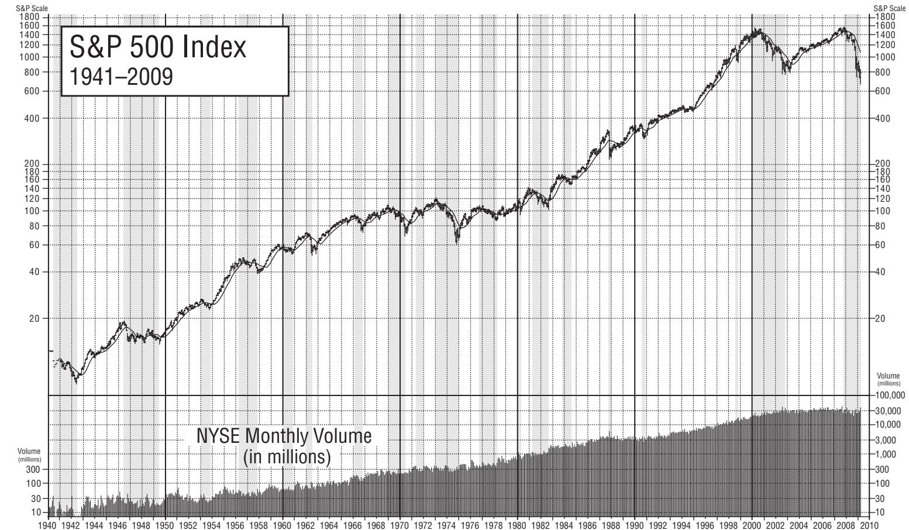

不要依赖其他次要指标，因为它们未被证明在择时上有效。听那些钻研 30 到 50 种不同技术或经济指标、然后告诉你他们认为市场应该怎么走的众多市场通讯作者、技术分析师或策略师，通常是非常昂贵的时间浪费。投资通讯可能在投资者心中制造疑虑和困惑。有意思的是，历史表明，市场往往恰在消息全坏、这些专家最怀疑、最不确定的时候上涨。

当大盘见顶时，你必须卖出，至少筹集一些现金，并脱离保证金（借来的钱），以保护账户。作为个人投资者，你可以轻松在一两天内筹集现金、退出，日后当市场终于对了，你同样可以重新入场。如果你在大盘见顶时不卖出、不筹集现金，你那串分散的前市场龙头就会大幅下跌。其中一些可能永远回不到原来的水平。

你最好的办法，是学会解读主要大盘指数的日线价量图。这样做，你就不会偏离太远，也不需要太多其他东西。和市场争论没有好处。经验告诉我们，对市场妄加猜测可能是一个非常昂贵的错误。

In bear markets, stocks usually open strong and close weak. In bull markets, they tend to open weak and close strong. The general market averages need to be checked every day, since reverses in trends can begin on any given few 

days. Relying on these primary indexes is a more direct, practical, and effective method for analyzing the market’s behavior and determining its direction. 

Don’t rely on other, subsidiary indicators because they haven’t been proven to be effective at timing. Listening to the many market newsletter writers, technical analysts, or strategists who pore over 30 to 50 different technical or economic indicators and then tell you what they think the market should be doing is generally a very costly waste of time. Investment newsletters can create doubt and confusion in an investor’s mind. Interestingly enough, history shows that the market tends to go up just when the news is all bad and these experts are most skeptical and uncertain. 

When the general market tops, you must sell to raise at least some cash and to get off margin (the use of borrowed money) to protect your account. As an individual investor, you can easily raise cash and get out in one or two days, and you can likewise reenter later when the market is finally right. If you don’t sell and raise cash when the general market tops, your diversified list of former market leaders can decline sharply. Several of them may never recover to their former levels. 

Your best bet is to learn to interpret daily price and volume charts of the key general market averages. If you do, you can’t get too far off-track, and you won’t need much else. It doesn’t pay to argue with the market. Experience teaches that second-guessing the market can be a very expensive mistake. 

### The Prolonged Two-Year Bear Market of 1973–1974

水门丑闻与听证会，加上 1974 年欧佩克的石油禁运，使 1973–1974 年成为当时自 1929–1933 年大萧条以来最严重的股市灾难。道指回调 50%，但普通股票暴跌超过 70%。

这对股票持有者是一大教训，其严重程度几乎堪比 1929 到 1933 年普通股票 90% 的回调。不过 1933 年，工业生产仅为 1929 年水平的 56%，超过 1300 万美国人失业。1930 年代失业率峰值达 25%，整个十年都保持两位数，1939 年仍为 20%。

在漫长拖沓的 1973–1974 年熊市中，市场士气如此低落，以致纽约证券交易所场内多数会员都担心交易所可能无法作为一个可行的机构存续下去。这就是为什么研究市场均值、学会保护自己免受灾难性亏损绝对至关重要——为了你的健康，也为了你的投资组合。你能学会做到。只要认真对待、全心投入，任何人都能做到。你的钱对你重要吗？

The combination of the Watergate scandal and hearings and the 1974 oil embargo by OPEC made 1973–1974 the worst stock market catastrophe up to that time since the 1929–1933 depression. The Dow corrected 50%, but the average stock plummeted more than 70%. 

This was a big lesson for stockholders and was almost as severe as the 90% correction the average stock showed from 1929 to 1933. However, in 1933, industrial production was only 56% of the 1929 level, and more than 13 million Americans were unemployed. The peak unemployment rate in the 1930s was 25%. It remained in double digits throughout the entire decade and was 20% in 1939. 

The markets were so demoralized in the prolonged 1973–1974 bear market that most members on the floor of the New York Stock Exchange were afraid the exchange might not survive as a viable institution. This is why it’s absolutely critical that you study the market averages and learn how to protect yourself against catastrophic losses, for the sake of your health as well as your portfolio. You can learn to do this. Anyone can do it, if they get serious and apply themselves. Is your money important to you? 

### A 33% Drop Requires a 50% Rise to Break Even

了解大盘方向的重要性，怎么强调都不为过。如果你在一个股票组合上亏损 33%，你需要上涨 50% 才能回到盈亏平衡点。例如，如果你让一个 10000 美元的组合跌到 6666 美元（下跌 33%），它必须上涨 3333 美元（即 50%）才能让你回到起点。在 2007–2008 年熊市中，S&P 500 下跌超过 50%，意味着该指数需要 100% 的反弹才能完全恢复。而对你而言，赚 100% 有多容易？也许你该学学自己在做什么，采纳新的规则和方法，停止做那些造成 50% 亏损的事。

你必须始终采取行动，尽可能保住你在牛市中积累起来的利润，而不是让投资一路跌回、穿过艰难的熊市时期。为此，你必须学会历经历史检验的卖出规则。（关于卖出规则的更多内容，参见第 10 和 11 章。）

The importance of knowing the direction of the general market cannot be overemphasized. If you have a 33% loss in a portfolio of stocks, you need a 50% gain just to get to your breakeven point. If, for example, you’ve allowed a \$10,000 portfolio to drop to \$6,666 (a 33% decline), it has to rise \$3,333 (or 50%) just to get you back where you started. In the 2007–2008 bear market, the S&P 500 fell more than 50%, meaning that a 100% rebound will be needed for the index to fully recover. And how easy is it for you to make 100%? Maybe it’s time for you to learn what you’re doing, adopt new rules and methods, and stop doing things that create 50% losses. 

You positively must always act to preserve as much as possible of the profit that you’ve built up during the bull market rather than ride your investments back down through difficult bear market periods. To do this, you have to learn historically proven selling rules. (See Chapters 10 and 11 for more on selling rules.) 

### The Myths about “Long-Term Investing” and Being Fully Invested

许多投资者喜欢把自己想成——或至少描述成——“长期投资者”。他们的策略是不论顺境逆境都保持满仓。多数机构也是如此。但这种一成不变的做法可能带来悲剧性结果，尤其对个人投资者。个人和机构或许都能在相对温和（25% 或以下）的熊市中安然挺过，但许多熊市并不温和。有些熊市，如 1973–1974、2000–2002 和 2007–2008，简直具有毁灭性。

挑战总是在开头到来，当你开始察觉到一场即将来临的熊市时。多数情况下，你无法预测经济状况会变得多糟、或糟糕的状况会持续多久。越战、通胀和紧缩的货币供应，把 1969–1970 年的回调变成了一场长达两年、下跌 36.9% 的下跌。在那之前，熊市平均只持续九个月，使指数下跌 26%。

熊市中多数股票都会下跌，但并非所有股票都能恢复。即便在一场温和的熊市回调中，如果你死守不放，也可能落得一堆受损的“商品”，它们或许永远见不到原来的高点。当整体环境改变、你的股票表现不灵时，你绝对必须学会卖出、至少筹集一些现金。

买入并持有的投资者在 1980、1990 年代爱上了可口可乐。这家软饮料巨头年复一年地稳步走高，随市场涨跌。但它 1998 年不再管用，长期持有者的另一只宠儿吉列也是如此。当那年夏天市场滑入温和的熊市回调时，可口可乐跟随下跌。两年后——在市场数十年来最激动人心的一些涨幅之后——可口可乐仍困在下行趋势中。某些情况下，这类股票可能会回来。但有一点确定无疑：可口可乐的投资者错过了 1998 和 1999 年美国在线和高通等名字的巨大涨幅。

买入并持有的策略，对任何从 2000 到 2002 年持有科技股的人而言同样是灾难性的。许多高价股损失了 75% 到 90% 的市值，有些可能永远回不到先前的高点。现在看看 Time Warner、康宁、雅虎、英特尔、JDS Uniphase 和 EMC 这些 1998–2000 年的前市场龙头吧。

Many investors like to think of, or at least describe, themselves as “longterm investors.” Their strategy is to stay fully invested through thick and thin. Most institutions do the same thing. But such an inflexible approach can have tragic results, particularly for individual investors. Individuals and institutions alike may get away with standing pat through relatively mild (25% or less) bear markets, but many bear markets are not mild. Some, such as 1973–1974, 2000–2002, and 2007–2008, are downright devastating. 

The challenge always comes at the beginning, when you start to sense an impending bear market. In most cases, you cannot project how bad economic conditions might become or how long those bad conditions could linger. The war in Vietnam, inflation, and a tight money supply helped turn the 1969–1970 correction into a two-year decline of 36.9%. Before that, bear markets averaged only nine months and took the averages down 26%. 

Most stocks fall during a bear market, but not all of them recover. If you hold on during even a modest bear correction, you can get stuck with damaged merchandise that may never see its former highs. You definitely must learn to sell and raise at least some cash when the overall environment changes and your stocks are not working. 

Buy-and-hold investors fell in love with Coca-Cola during the 1980s and 1990s. The soft-drink giant chugged higher year after year, rising and falling with the market. But it stopped working in 1998, as did Gillette, another favorite of long-term holders. When the market slipped into its mild bear correction that summer, Coke followed along. Two years later—after some of the market’s most exciting gains in decades—Coke was still stuck in a downtrend. In some instances, stocks of this kind may come back. But this much is certain: Coke investors missed huge advances in 1998 and 1999 in names such as America Online and Qualcomm. 

The buy-and-hold strategy was also disastrous to anyone who held technology stocks from 2000 through 2002. Many highfliers lost 75% to 90% of their value, and some may never return to their prior highs. Take a look now at Time Warner, Corning, Yahoo!, Intel, JDS Uniphase, and EMC, former market leaders in 1998–2000. 

### Protecting Yourself from Market Downturns

拿破仑曾写道，战斗中从不犹豫给了他胜过对手的优势，多年来他所向无敌。在股市这个战场上，也存在快者与死者！

在你看到市场见顶的最初几个明确迹象之后，不要干等。在真正的疲弱发展起来之前迅速卖出。当市场指数见顶、开始重大下行反转时，你应当立即行动，把组合的 25% 或更多转为现金，以市价卖出股票。不建议使用限价单（以特定价格而非市价买卖），聚焦于你在需要时进出股票的能力。为八分之一或四分之一点（或它们的小数等值）斤斤计较，可能让你错过买入或卖出股票的机会。

如果你的股票账户用了保证金，闪电般的行动就更加关键。如果你的组合完全保证金化，即一半的钱是向券商借的，那么股票价格下跌 20% 会让你损失 40% 的钱。股票下跌 50% 可能让你血本无归！永远不要试图用保证金挺过熊市。

归根结底，当一场新熊市开始时，你真正能做的只有两件事：卖出撤退，或做空。撤退时，你应当一直离场，直到熊市结束。这通常意味着五六个月或更久。但在漫长多难的 1969–1970 和 1973–1974 年间，它意味着长达两年。克林顿政府最后一年、2000 年 3 月开始的熊市持续得更久，也远比正常情况严重。每十个投资者中有九个亏了大钱，尤其在科技股上。那是一个充满过度行为时期的终结——1990 年代末那十年，美国变得粗心大意、放松了警惕。那是“什么都行”的时期，股票横冲直撞。

做空可以获利，但要预先警告：这是一项非常困难、高度专业化的技能，只应在熊市中尝试。很少有人靠它赚钱。做空在第 12 章有更详细的讨论。

Napoleon once wrote that never hesitating in battle gave him an advantage over his opponents, and for many years he was undefeated. In the battlefield that is the stock market, there are the quick and there are the dead! 

After you see the first several definite indications of a market top, don’t wait around. Sell quickly before real weakness develops. When market indexes peak and begin major downside reversals, you should act immediately by putting 25% or more of your portfolio in cash, selling your stocks at market prices. The use of limit orders (buying or selling at a specific price, rather than buying or selling at market prices using market orders) is not recommended. Focus on your ability to get into or out of a stock when you need to. Quibbling over an eighth- or quarter-point (or their decimal equivalents) could make you miss an opportunity to buy or sell a stock. 

Lightning-fast action is even more critical if your stock account is on margin. If your portfolio is fully margined, with half of the money in your stocks borrowed from your broker, a 20% decline in the price of your stocks will cause you to lose 40% of your money. A 50% decline in your stocks could wipe you out! Never try to ride through a bear market on margin. 

In the final analysis, there are really only two things you can do when a new bear market begins: sell and retreat or go short. When you retreat, you should stay out until the bear market is over. This usually means five or six months or more. In the prolonged, problem-ridden 1969–1970 and 1973–1974 periods, however, it meant up to two years. The bear market that began in March 2000 during the last year of the Clinton administration lasted longer and was far more severe than normal. Nine out of ten investors lost a lot of money, particularly in high-tech stocks. It was the end of a period of many excesses during the late 1990s, a decade when America got careless and let down its guard. It was the “anything goes” period, with stocks running wild. 

Selling short can be profitable, but be forewarned: it’s a very difficult and highly specialized skill that should be attempted only during bear markets. Few people make money at it. Short selling is discussed in more detail in Chapter 12. 

### Using Stop-Loss Orders

如果你使用止损单，或在心里记下卖价并付诸行动，那么一个开始见顶的市场会机械地、机器人般地把你的许多股票逼出局。止损单指示交易所场内的专家：一旦股票跌到你指定的价格，该委托就变成市价单，股票将在下一笔交易中卖出。

通常最好不要挂止损单。这样做，等于你和想法相同的其他投资者向做市商亮出了底牌，有时他们可能把股价打低以震出止损单。相反，应密切关注你的股票，并提前知道你在哪个确切价格会立即卖出以截断亏损。不过，有些人经常出行、无法密切盯盘，另一些人则在亏损时难以做出卖出决定、及时出场。这些情况下，止损单有助于弥补距离和优柔寡断。

如果你使用止损单，记住：若你改变主意、在委托执行前卖出了股票，就取消它。否则，你日后可能意外卖出一只你已不再持有的股票。这类错误代价可能很高。

If you use stop-loss orders or mentally record a selling price and act upon it, a market that is starting to top out will mechanically force you, robotlike, out of many of your stocks. A stop-loss order instructs the specialist in the stock on the exchange floor that once the stock has dropped to your specified price, the order becomes a market order, and the stock will be sold out on the next transaction. 

It’s usually better not to enter stop-loss orders. In doing so, you and other similarly minded investors are showing your hand to market makers, and at times they might drop the stock to shake out stop-loss orders. Instead, watch your stocks closely and know ahead of time the exact price at which you will immediately sell to cut a loss. However, some people travel a lot and aren’t able to watch their stocks closely, and others have a hard time making sell decisions and getting out when they are losing. In such cases, stop-loss orders help compensate for distance and indecisiveness. 

If you use a stop-loss order, remember to cancel it if you change your mind and sell a stock before the order is executed. Otherwise, you could later accidentally sell a stock that you no longer own. Such errors can be costly. 

### How You Can Learn to Identify Stock Market Tops

要察觉市场顶部，就密切盯住日线 S&P 500、纽交所综合指数、道指 30 和纳斯达克综合指数，看它们一路走高。在上升趋势中的某一天，市场整体的成交量会比前一天放大，但指数本身却显示停滞（当日价格涨幅明显小于前一天的价格涨幅）。我称之为“放量而价格不再上行”。指数不一定要当天收跌，但多数情况下会收跌，从而使机构投资者清算股票所形成的派发（卖出）更容易看出。指数当日最高到最低的价差，某些情况下可能比前几天略宽。

市场顶部附近的正常出货，通常会在四到五周内、特定的三到五天里发生。换言之，市场是在上涨之中遭遇派发的！这就是为什么很少人懂得辨识派发。在任何四到五周的跨度内出现四五天明确派发之后，大盘几乎总会转跌。

如果正确辨识出在两到三周内出现的四天派发，有时就足以把一个此前上涨的市场转入下跌。有时，如果市场在某个时点试图反弹回新高，派发可能散布在六周内。如果你在打瞌睡、浑然不觉，错过了 S&P 500、纽交所综合指数、纳斯达克或道指发出的见顶信号（这很容易做到，因为它们有时只在少数几天出现），你就可能判断错市场方向，从而几乎事事做错。

最大的问题之一，是扭转投资者个人正面看法所需的时间。如果你始终在买点下方 7% 或 8% 卖出止损，当大盘开始形成回调时，你可能自动被迫卖出至少一两只股票。这会让你更早进入质疑、防御的心态。遵循我们这条简单却强大的规则，让许多人在 2000 年科技龙头毁灭性下跌和 2008 年次贷熊市中省下大钱。

只需要有一个指数给出有效、重复的派发过多信号就够了。你通常不需要看到几个主要指数都显示四五天派发。此外，如果某个指数当天下跌且成交量大于前一天，它需要下跌超过 0.2%，才可算作一个派发日。

To detect a market top, keep a close eye on the daily S&P 500, NYSE Composite, Dow 30, and Nasdaq Composite as they work their way higher. On one of the days in the uptrend, volume for the market as a whole will increase from the day before, but the index itself will show stalling action (a significantly smaller price increase for the day compared with the prior day’s price increase). I call this “heavy volume without further price progress up.” The average doesn’t have to close down for the day, but in most instances it will, making the distribution (selling) as professional investors liquidate stock must easier to see. The spread from the average’s daily high to its daily low may in some cases be a little wider than on previous days. 

Normal liquidation near the market peak will usually occur on three to five specific days over a period of four or five weeks. In other words, the market comes under distribution while it’s advancing! This is one reason so few people know how to recognize distribution. After four or five days of definite distribution over any span of four or five weeks, the general market will almost always turn down. 

Four days of distribution, if correctly spotted over a two- or three-week period, are sometimes enough to turn a previously advancing market into a decline. Sometimes distribution can be spread over six weeks if the market attempts at some point to rally back to new highs. If you are asleep or unaware and you miss the topping signals given off by the S&P 500, the NYSE Composite, the Nasdaq, or the Dow (which is easy to do, since they sometimes occur on only a few days), you could be wrong about the market direction and therefore wrong on almost everything you do. 

One of the biggest problems is the time it takes to reverse investors’ positive personal opinions and views. If you always sell and cut your losses 7% or 8% below your buy points, you may automatically be forced to sell at least one or two stocks as a correction in the general market starts to develop. This should get you into a questioning, defensive frame of mind sooner. Following this one simple but powerful rule of ours saved a lot of people big money in 2000’s devastating decline in technology leaders and in the 2008 subprime loan bear market. 

It takes only one of the indexes to give you a valid repeated signal of too much distribution. You don’t normally need to see several of the major indexes showing four or five distribution days. Also, if one of the indexes is down for the day on volume larger than the prior day’s volume, it should decline more than 0.2% for this to be counted as a distribution day. 

### After the Initial Decline off the Top, Track Each Rally Attempt on the Way Down

在顶部附近出现所需天数的放量派发、并由此产生第一轮下跌之后，市场均值要么出现一次疲弱的反弹、随后反弹失败，要么出现一个积极有力、价量齐升的跟进日。你应当详细学会该留意哪些信号，并对市场保持不偏不倚。让一天天的大盘均值告诉你，市场过去一直在做什么、此刻正在做什么。（关于市场反弹的进一步讨论，参见本章后文“如何察觉股市底部”。）

After the required number of days of increased volume distribution around the top and the first decline resulting from this, there will be either a poor rally in the market averages, followed by a rally failure, or a positive and powerful follow-through day up on price and volume. You should learn in detail exactly what signals to look for and remain unbiased about the market. Let the day-by-day averages tell you what the market has been doing and is doing. (See “How You Can Spot Stock Market Bottoms” later in this chapter for a further discussion of market rallies.) 

### Three Signs the First Rally Attempt May Fail

市场见顶之后，通常会出现一次乏力的反弹，随后失败。例如，在第一天反弹之后，第二天会强势开盘，却在临近收盘时突然转跌。市场第一次复苏尝试的这种突然失败，很可能应当促使你进一步卖出。

如果满足以下任一条，你就知道初次反弹是乏力的：（1）指数在反弹的第三、四或五天上涨，但成交量低于前一天；（2）均值相较前一天几乎没有什么净向上进展；或（3）市场均值收复的幅度不到其从此前盘中绝对高点初次下跌的一半。当你看到这些疲弱反弹和失败时，进一步卖出是可取的。

After the market does top out, it typically will rally feebly and then fail. After the first day’s rebound, for instance, the second day will open strongly but suddenly turn down near the end of the session. The abrupt failure of the market to follow through on its first recovery attempt should probably be met with further selling on your part. 

You’ll know that the initial bounce back is feeble if (1) the index advances in price on the third, fourth, or fifth rally day, but on volume that is lower than that of the day before, (2) the average makes little net upward price progress compared with its progress the day before, or (3) the market average recovers less than half of the initial drop from its former absolute intraday high. When you see these weak rallies and failures, further selling is advisable. 

### How CAN SLIM and IBD Red-Flagged the March 2000 Nasdaq Top

1999 年 10 月，市场开始了一轮猛烈上涨。对 2000 年 1 月 1 日“千年虫”崩溃的担忧已经消退。各公司纷纷公布刚结束的第三季度强劲利润。领涨的科技股以及投机性的互联网和生物技术股，在短短五个月内录得巨大涨幅。但裂痕在 2000 年 3 月初开始显现。

3 月 7 日，纳斯达克放量收低，这是六个多星期以来的第一次。在火热的牛市中这是异常表现，但单独一天的派发并不重要。不过，这是第一面黄旗，值得仔细观察。

三天后，纳斯达克早盘暴涨超过 85 点、创出新高。但它在午后反转，最终当天只上涨 2 点，成交量沉重、比均量高出 13%。这是第二个警告信号。这种“翻腾”行为（成交很多却没有真正的价格进展——明确的派发迹象）格外重要，因为龙头股开始显露出自身的冲顶症状——这一现象将在第 11 章讨论。仅两天后，3 月 14 日，市场放量大跌 4%。这是派发的第三个重大警告信号，也是你本应开始采取卖出行动的信号。

该指数设法在 3 月 16 到 24 日拼凑出一波可疑的反弹，随后再次停滞，形成第四个派发日。它很快失去动能，两天后在更重的成交量上翻转向下，形成第五个派发日，最终明确确认了 3 月 10 日的顶部。市场本身在告诉你要卖出、筹集现金、退出股票。你所要做的就是正确解读并作出反应，而不是听别人的意见。别人往往错得离谱，而且大概根本不懂辨识或理解派发日。

接下来两周里，随着各指数在比前一天更重的成交量上走低，纳斯达克连同 S&P 500 和道指反复遭遇派发。那些读过、研究过、并做好准备、清楚知道该留意什么的敏锐 CAN SLIM 投资者，早就获利了结了。

研究我们关于这次及其他市场顶部的图表范例。股市历史会重演；你将来会一次又一次看到这类表现。所以，赶紧跟上。

In October 1999, the market took off on a furious advance. Fears of a Y2K meltdown on January 1, 2000, had faded. Companies were announcing strong profits for the third quarter just ended. Both leading tech stocks and speculative Internet and biotechnology issues racked up huge gains in just five months. But cracks started to appear in early March 2000. 

On March 7, the Nasdaq closed lower on higher volume, the first time it had done so in more than six weeks. That’s unusual action during a roaring bull market, but one day of distribution isn’t significant on its own. Still, it was the first yellow flag and was worth watching carefully. 

Three days later, the Nasdaq bolted up more than 85 points to a new high in the morning. But it reversed in the afternoon and finished the day up only 2 points on heavy volume that was 13% above average. This was the second warning sign. That churning action (a lot of trading but no real price progress—a clear sign of distribution) was all the more important because leading stocks started showing their own symptoms of hitting climax tops— action that will be discussed in Chapter 11. Just two days later, on March 14, the market closed down 4% on a large volume increase. This was the third major warning signal of distribution and one where you should have been taking some selling action. 

The index managed to put together a suspect rally from March 16 to 24, then stalled again for a fourth distribution day. It soon ran out of steam and rolled over on heavier volume two days later for a fifth distribution day and a final, definite confirmation of the March 10 top. The market itself was telling you to sell, raise cash, and get out of your stocks. All you had to do was read it right and react, instead of listening to other people’s opinions. Other people are too frequently wrong and are probably clueless about recognizing or understanding distribution days. 

During the next two weeks, the Nasdaq, along with the S&P 500 and the Dow, suffered repeated bouts of distribution as the indexes sold off on heavier volume than on the prior day. Astute CAN SLIM investors who had read, studied, and prepared themselves by knowing exactly what to watch for had long since taken their profits. 

Study our chart examples of this and other market tops. History repeats itself when it comes to the stock market; you’ll see this type of action again and again in the future. So get with it. 

### How CAN SLIM and IBD Red-Flagged the 2007 Top in the Market

如前所述，几次调查显示，约 60% 的 IBD 订户在 2008 年股市快速破位之前卖出了股票。IBD 的“大局观”专栏在其特别的市场脉搏方框中明确指出，当市场指数出现五个派发日、前景转为“市场处于回调”时，然后就建议是时候筹集现金了。我相信，这些人大多读过并研究过这一章，包括我们对 2000 年 3 月如何撤离市场的描述。他们终于能够运用和落实 IBD 的大盘规则，保住收益，不必经历那种在没有保护性规则或方法时可能发生的严重下跌。希望那些没有遵循规则的人，将来能更好地运用它们。

市场中不大会有太多偶然发生的事。要想辨识每一个市场顶部，你需要花功夫去学你该知道的东西。以下是苹果 CEO 史蒂夫·乔布斯关于努力的说法：“我一生中所做的事，都是经过多年努力才起飞的。”从 1976 年顶部到 2007 年顶部的、经标注的市场见顶图表，见后面几页。

As mentioned earlier, several surveys showed that approximately 60% of IBD subscribers sold stock in 2008 before the rapid stock market break occurred. IBD’s “The Big Picture” column clearly pointed out in its special Market Pulse box when the market indexes had five distribution days and the outlook had switched to “Market in correction,” and then the column suggested that it was time to raise cash. I’m sure most of those people had read and studied this chapter, including our description of how we retreated from the market in March 2000. They were finally able to use and apply IBD’s general market rules to preserve their gains and not have to undergo the severe declines that can occur when you have no protective rules or methods. And hopefully, those who didn’t follow the rules will be able to better apply them in the future. 

Not too much happens by accident in the market. It requires effort on your part to learn what you need to know in order to spot every market top. Here’s what Apple CEO Steve Jobs had to say about effort: “The things I’ve done in my life have required a lot of years of work before they took off.” Annotated market topping charts for the period from the 1976 top to the 2007 top are shown a few pages ahead. 

### Historical Tops for Further Study

历史上，中级派发顶（即那些通常随后出现大盘均值下跌 8% 到 12% 的顶部）是在 1954 年 8 月第一周那样出现的。首先，纽约证券交易所成交量放大，而道琼斯工业指数没有进一步的价格上行进展。次日，又出现放量而无进一步上行进展，且道指当日最高到最低的价差宽大。另一次这样的顶部发生在 1955 年 7 月第一周。其特征是价格冲顶、当日最低到最高的价差宽大，次日成交量放大且道指收跌，三天后纽交所成交量放大且道指再次收跌。

其他可供研究的熊市和中级顶部包括：

如果你仔细研究以下几幅若干顶部的日线市场均值图，并理解它们是如何形成的，那么在你观察未来的市场环境时，就会认出同样的迹象。这些图上每一个带编号的日子都是一个派发日。

Historically, intermediate-term distribution tops (those that are usually followed by 8% to 12% declines in the general market averages) occur as they did during the first week of August 1954. First, there was increased New York Stock Exchange volume without further upward price progress on the Dow Jones Industrials. That was followed the next day by heavy volume without further price progress up and with a wide price spread from high to low on the Dow. Another such top occurred in the first week of July 1955. It was characterized by a price climax with a wide price spread from the day’s low to its high, followed the next day by increased volume with the Dow closing down in price, and then, three days later, increased NYSE volume with the Dow again closing down. 

Other bear market and intermediate-term tops for study include 

<table><tr><td>September 1955</td><td>June 1966</td><td>August 1987</td></tr><tr><td>November 1955</td><td>May 1967</td><td>October 1987</td></tr><tr><td>April 1956</td><td>September 1967</td><td>October 1989</td></tr><tr><td>August 1956</td><td>December 1967</td><td>January 1990</td></tr><tr><td>January 1957</td><td>December 1968</td><td>July 1990</td></tr><tr><td>July 1957</td><td>May 1969</td><td>June 1992</td></tr><tr><td>November 1958</td><td>April 1971</td><td>February 1994</td></tr><tr><td>January 1959</td><td>September 1971</td><td>September 1994</td></tr><tr><td>May 1959</td><td>January 1973</td><td>May 1996</td></tr><tr><td>June 1959</td><td>October 1973</td><td>March 1997</td></tr><tr><td>July 1959</td><td>July 1975</td><td>October 1997</td></tr><tr><td>January 1960</td><td>September 1976</td><td>July 1998</td></tr><tr><td>June 1960</td><td>September 1978</td><td>August 1999</td></tr><tr><td>April 1961</td><td>September 1979</td><td>January 2000</td></tr><tr><td>May 1961</td><td>February 1980</td><td>April 2000</td></tr><tr><td>September 1961</td><td>November 1980</td><td>September 2000</td></tr><tr><td>November 1961</td><td>April 1981</td><td>February 2001</td></tr><tr><td>December 1961</td><td>June 1981</td><td>May 2001</td></tr><tr><td>March 1962</td><td>December 1981</td><td>December 2001</td></tr><tr><td>June 1963</td><td>May 1982</td><td>January 2004</td></tr><tr><td>October 1963</td><td>January 1984</td><td>April 2006</td></tr><tr><td>May 1965</td><td>July 1986</td><td>November 2007</td></tr><tr><td>February 1966</td><td>September 1986</td><td>June 2008</td></tr><tr><td>April 1966</td><td>April 1987</td><td></td></tr></table>

If you study the following daily market average graphs of several tops closely and understand how they came about, you’ll come to recognize the same indications as you observe future market environments. Each numbered day on these charts is a distribution day. 

### Follow the Leaders for Clues to a Market Top

仅次于每日均值，主要市场方向变化的第二大指标，是龙头股的表现方式。在市场上涨了几年之后，如果多数个股龙头开始表现异常，你几乎可以肯定它要出问题了。

异常表现的一个例子是，龙头股在上涨途中从第三或第四阶段的图表底部形态突破。这类底部结构大多有缺陷，价格波动显得宽得多、松得多。一个有缺陷的底部（宽、松、反复无常），最好通过研究一只股票日线或周线的价量历史图表来辨识和分析。

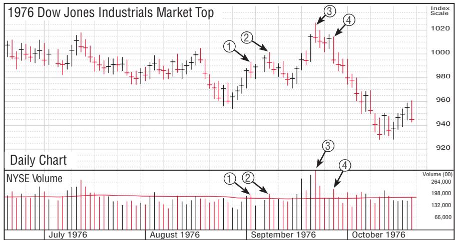

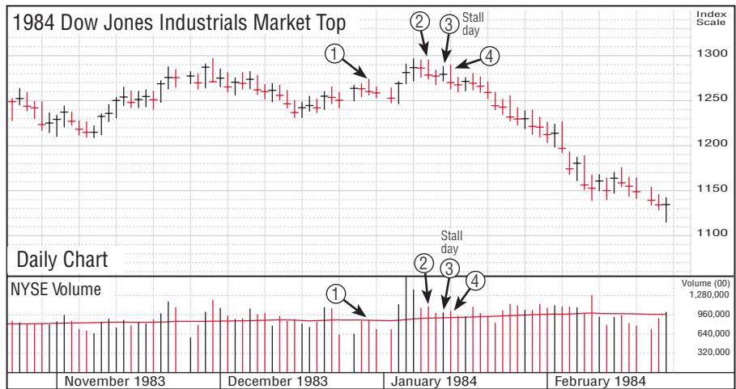

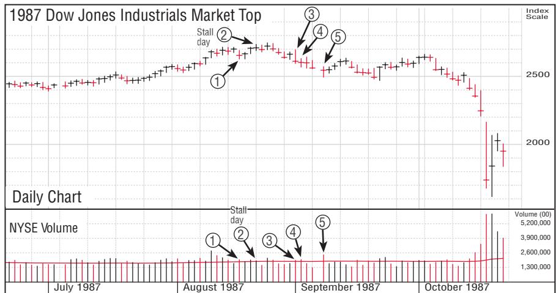

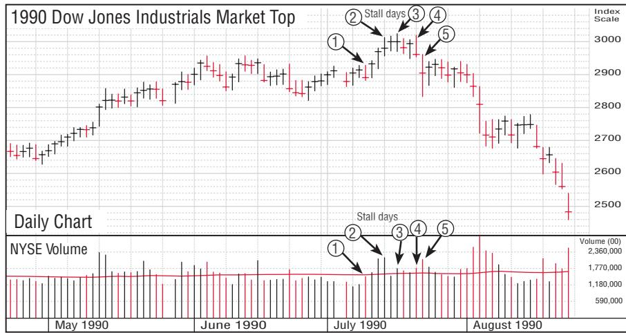

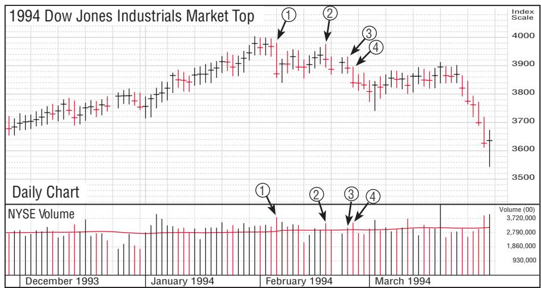

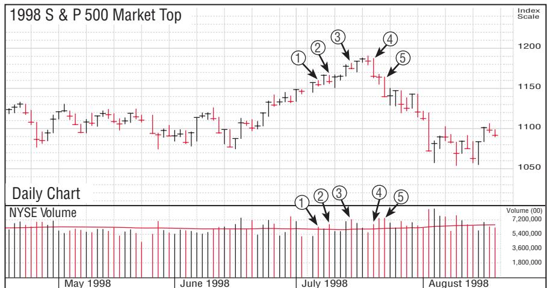

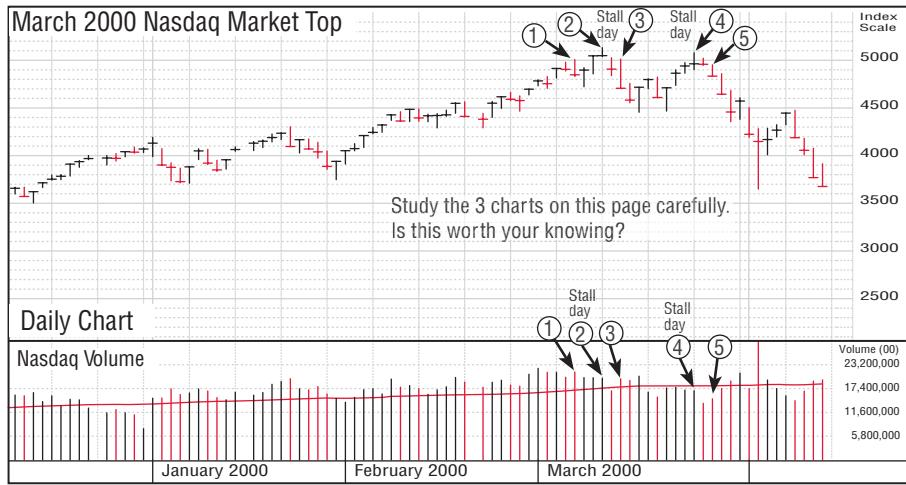

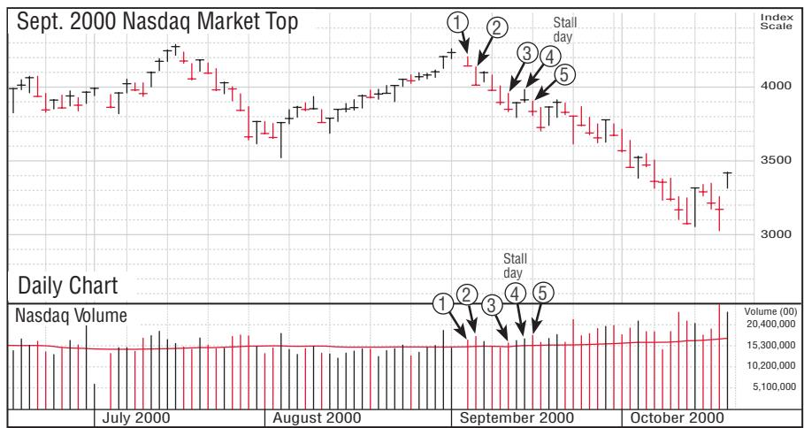

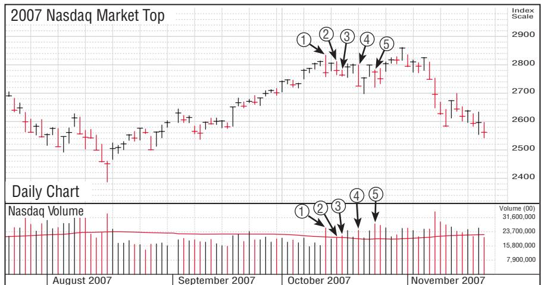

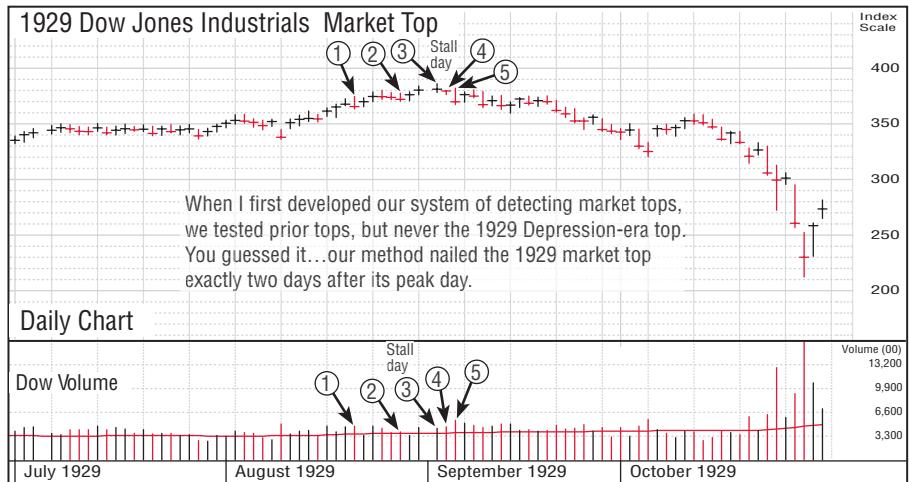

异常表现的另一个迹象是“冲顶”顶。此时，一只龙头股在已上涨多月之后，又连续两三周加速上涨。（关于卖出，参见第 11 章。）

少数龙头会在顶部附近出现首次异常破位、伴随沉重成交量，但随后只能从回调低点小幅反弹。还有一些会在最近几季度的盈利报告中显示出上行势头严重丧失。

市场方向的变化，也可以通过回顾你自己投资组合中最近四五笔股票买入来察觉。如果你一笔都没赚到钱，你可能正在捕捉到新一轮下行趋势的迹象。

使用图表、理解市场表现的投资者都知道，在市场顶部附近，极少有龙头股具有吸引力。根本没有任何股票正从健康、形态正确的图表底部中脱颖而出。最好的“货色”早已被买入、炒过、挑拣一空。

多数底部都会宽而松——这是你必须学会理解并服从的真正危险信号。到这一阶段，还剩下能显示强势的，只有落后股。呆滞或低价、低质量的落后股开始走强，对明智的市场操盘者而言，是上涨行情可能接近尾声的信号。就连火鸡，也能在风暴中试着飞一飞。

在熊市早期，某些龙头股看似逆势而行、在价格上挺住，营造出强势的印象，但你看到的只是不可避免之事被推迟了。当他们来抢房子时，通常一个人都不放过；最终所有龙头都会屈服于抛售。2000 年熊市正是如此。思科和其他高科技龙头最终全都崩跌，尽管许多分析师错误地说应当买入它们。

2008 年 6、7 月纳斯达克见顶时也是如此。曾引领 2003–2007 年牛市的钢铁、化肥和石油股全部翻转，并在看似逆势于实际已于 2007 年 10 月以至少五个派发日开始的整体市场顶部之后终于破位。美国钢铁即便接下来两份季度盈利报告增长超过 100% 也暴跌了。Potash 见顶时，当季盈利增长 181%、下季增长 220%。这骗过了多数关注已报告或预期大增盈利的分析师。他们没有研究过所有过去的顶部，没意识到许多过去的龙头在盈利增长 100% 时就见顶了。这些股票为什么最终垮掉？它们处在一场八个月前、即 2007 年末就已开始的熊市中。

市场顶部，无论是中级的（通常下跌 8% 到 12%）还是主要牛市的峰值，有时出现在龙头股和大盘最后一次重大买点之后的五、六或七个月。因此，顶部反转通常是滞后信号——垮塌前的最后一根稻草。多数情况下，派发、即卖出，已在个别市场龙头中持续了数天甚至数周。运用个股卖出规则（我们将在第 10、11 章讨论），本应已让你在市场见顶前，在上涨途中卖掉一两个持仓。

The second most important indicator of a primary change in market direction, after the daily averages, is the way leading stocks act. After the market has advanced for a couple of years, you can be fairly sure that it’s headed for trouble if most of the individual stock leaders start acting abnormally. 

One example of abnormal activity can be seen when leading stocks break out of third- or fourth-stage chart base formations on the way up. Most of these base structures will be faulty, with price fluctuations appearing much wider and looser. A faulty base (wide, loose, and erratic) can best be recognized and analyzed by studying charts of a stock’s daily or weekly price and volume history. 

Another sign of abnormal activity is the “climax” top. Here, a leading stock will run up more rapidly for two or three weeks in a row, after having advanced for many months. (See Chapter 11 on selling.) 

A few leaders will have their first abnormal price break off the top on heavy volume but then be unable to rally more than a small amount from the lows of their correction. Still others will show a serious loss of upward momentum in their most recent quarterly earnings reports. 

Shifts in market direction can also be detected by reviewing the last four or five stock purchases in your own portfolio. If you haven’t made a dime on any of them, you could be picking up signs of a new downtrend. 

Investors who use charts and understand market action know that very few leading stocks will be attractive around market tops. There simply aren’t any stocks coming out of sound, properly formed chart bases. The best merchandise has been bought, played, and well picked over. 

Most bases will be wide and loose—a big sign of real danger that you must learn to understand and obey. All that’s left to show strength at this stage are laggard stocks. The sight of sluggish or low-priced, lower-quality laggards strengthening is a signal to the wise market operator the up market may be near its end. Even turkeys can try to fly in a windstorm. 

During the early phase of a bear market, certain leading stocks will seem to be bucking the trend by holding up in price, creating the impression of strength, but what you’re seeing is just a postponement of the inevitable. When they raid the house, they usually get everyone, and eventually all the leaders will succumb to the selling. This is exactly what happened in the 2000 bear market. Cisco and other high-tech leaders all eventually collapsed in spite of the many analysts who incorrectly said that they should be bought. 

That’s also what happened at the top of the Nasdaq in June and July of 2008. The steels, fertilizers, and oils that had led the 2003–2007 bull market all rolled over and finally broke down after they appeared to be bucking the overall market top that actually began with at least five distribution days in October of 2007. U.S. Steel tanked even though its next two quarterly earnings reports were up over 100%. Potash topped when its current quarter was up 181% and its next quarter was up 220%. This fooled most analysts, who were focused on the big earnings that had been reported or were expected. They had not studied all past historical tops and didn’t realize that many past leaders had topped when earnings were up 100%. Why did these stocks finally cave in? They were in a bear market that had begun eight months earlier, in late 2007. 

Market tops, whether intermediate (usually 8% to 12% declines) or primary bull market peaks, sometimes occur five, six, or seven months after the last major buy point in leading stocks and in the averages. Thus, top reversals are usually late signals—the last straw before a cave-in. In most cases, distribution, or selling, has been going on for days or even weeks in individual market leaders. Use of individual stock selling rules, which we’ll discuss in Chapters 10 and 11, should already have led you to sell one or two of your holdings on the way up, just before the market peak. 

### Other Bear Market Warnings

如果原有的市场龙头开始疲软，而价格更低、质量更低、更具投机性的股票开始上涨，要当心！当老狗开始吠叫时，市场已到了它最后虚弱的一条腿。落后股无法把市场带得更高。典型迹象之一是，劣质股票在市场“上涨”日开始主导最活跃名单。这不过是软弱的领导层试图支配市场。如果最好的股票不能领涨，最差的肯定不会领涨太久。

许多顶部反转（市场当天创出新高后、收于当日交易区间的底部）发生在均值从小型图表底部进入新高区域之后反弹的第三到第九天之间（意味着形态从开始到结束的时间跨度实在过短）。值得注意的是，这些顶部出现的条件都大致相同。

另一些时候，一个正在见顶的市场会回升一两个月，几乎回到原高点甚至更高，然后才真正破位。这在 1976 年 12 月、1981 年 1 月和 1984 年 1 月都发生过。这背后有一个重要的心理原因：市场中的大多数人不可能恰好在恰当的时间完全正确。1994 年，纳斯达克直到道指见顶数周后才见顶。2000 年初也发生了类似的事。

股市中的大多数人，无论专业还是个人投资者，都会先被蒙蔽。这完全是人的心理和情绪使然。如果你足够聪明、在 1981 年 1 月卖出或卖空，那么 2、3 月强劲的反弹大概会迫使你亏损平掉空头，或在强势反弹中买回一些股票。这是一个例子，说明市场在转折点处实际上可能多么凶险。

If the original market leaders begin to falter, and lower-priced, lower-quality, more-speculative stocks begin to move up, watch out! When the old dogs begin to bark, the market is on its last feeble leg. Laggards can’t lead the market higher. Among the telltale signs are the poor-quality stocks that start to dominate the most-active list on market “up” days. This is simply a matter of weak leadership trying to command the market. If the best ones can’t lead, the worst certainly aren’t going to do so for very long. 

Many top reversals (when the market closes at the bottom of its trading range after making a new high that day) have occurred between the third and the ninth day of a rally after the averages moved into new high ground off small chart bases (meaning that the time span from the start to the end of the pattern was really too short). It’s important to note that the conditions under which the tops occurred were all about the same. 

At other times, a topping market will recover for a couple of months and get back nearly to its old high or even above it before breaking down in earnest. This occurred in December 1976, January 1981, and January 1984. There’s an important psychological reason for this: the majority of people in the market can’t be exactly right at exactly the right time. In 1994, the Nasdaq didn’t top until weeks after the Dow did. A similar thing happened in early 2000. 

The majority of people in the stock market, including both professional and individual investors, will be fooled first. It’s all about human psychology and emotions. If you were smart enough to sell or sell short in January 1981, the powerful rebound in February and March probably forced you to cover your short sales at a loss or buy some stocks back during the strong rally. It was an example of how treacherous the market really can be at turning points. 

### Don’t Jump Back In Too Early

从 1962 到 2008 年，我在识别并应对众多熊市的早期迹象上没遇到什么困难。但有好几次，我犯了过早买回的错。当你在股市中犯错时，唯一稳妥的做法就是改正它。不要与它对抗。骄傲和自负从不带来好处；当亏损开始显现时，犹豫不决也一样。

典型的熊市（有些并不典型）通常有三个各自独立、被一两次反弹打断的下跌阶段或腿，这些反弹持续的时间恰好足以说服投资者开始买入。1969 和 1974 年，少数这类虚假、拖长的反弹长达 15 周。多数没有持续那么久。

许多机构投资者喜欢“抄底”。他们会从所谓的底部开始买股票，并帮助把反弹做得足够有说服力，以引诱你进场。你最好还是手持现金、置身场外，直到一轮新牛市真正开始。

I didn’t have much problem recognizing and acting upon the early signs of the many bear markets from 1962 through 2008. But a few times I made the mistake of buying back too early. When you make a mistake in the stock market, the only sound thing to do is to correct it. Don’t fight it. Pride and ego never pay off; neither does vacillation when losses start to show up. 

The typical bear market (and some aren’t typical) usually has three separate phases, or legs, of decline interrupted by a couple of rallies that last just long enough to convince investors to begin buying. In 1969 and 1974, a few of these phony, drawn-out rallies lasted up to 15 weeks. Most don’t last that long. 

Many institutional investors love to “bottom fish.” They’ll start buying stocks off a supposed bottom and help make the rally convincing enough to draw you in. You’re better off staying on the sidelines in cash until a new bull market really starts. 

### How You Can Spot Stock Market Bottoms

一旦你识别出熊市并已减持股票，最大的问题就是你该在场外待多久。如果你过早扑回市场，看似要来的反弹可能消退，你会亏钱。但如果你在最终那波轰鸣的复苏边缘犹豫，机会就会擦肩而过。同样，每日大盘均值提供的答案最好，远胜其他。市场总比多数投资者的情绪或个人看法更可靠。

在每一次回调中——无论温和还是严重——股市总会不时尝试反弹。不要马上扑回去。等待市场自己确认新的上升趋势。

当某个主要市场均值在当天早些时候或上一交易日下跌之后收高时，一次反弹尝试便开始了。例如，道指早盘暴跌 3%，但当天晚些时候恢复并收高；或者道指收跌 2%，次日反弹。我们通常把道指最终收高的那个交易日称为尝试反弹的第一天，尽管也有一些例外。例如，1998 年 10 月初市场底部的第一天实际上放量下跌，但它收于当日价格区间的上半部。按兵不动，保持耐心。最初几天的改善无法告诉你反弹是否会成功。

从尝试反弹的第四天开始，留意某个主要均值以比前一天更重的成交量“跟进”、录得大涨。这告诉你，反弹远更可能是真的。最强的跟进通常出现在反弹的第四到第七天。刚才提到的 1998 年底部，在尝试反弹的第五天跟进，市场上涨 2.1%。一个跟进日应当给人这样的感觉：一波爆发性、强劲、果断、确定的反弹——而不是勉强、模棱两可，或只涨 1½%。当天的市场成交量在多数情况下应高于其日均量，此外还必须始终高于前一交易日的成交量。

偶尔、但很罕见地，跟进最早可能出现在反弹的第三天。这种情况下，第一、二、三天都必须非常强劲，主要均值每天都放量上涨 1½% 到 2% 或更多。

我过去把 1% 视为一个有效跟进日的涨幅。然而近年来，随着机构投资者了解了我们的体系，我们对纳斯达克和道指的要求大幅提高。这样做，是为了尽量减少专业人士操纵道琼斯平均指数 30 只股票中的少数几只、制造虚假或有缺陷的跟进日的可能。

有时，被确认的反弹也会失败。少数大型机构投资者凭借其巨大的购买力，能在某一天拉高指数、制造出跟进的假象。然而，除非聪明的买家正在重新进场，否则反弹会崩塌——有时在接下来几天里放量暴跌。

不过，市场在跟进次日回调，并不意味着跟进是假的。当熊市见底时，它常常回落、并稳定在前几周低点上方或附近。当这些回调、即“测试”至少守住略高于市场均值近期盘中绝对低点的位置时，更具建设性。

跟进信号并不意味着你该冲出去放手买入。它只是给你开绿灯，让你开始买入那些销售和盈利强劲、并从健康价格底部突破的优质股票；它是尝试反弹正在成功的第二个关键确认。

记住，没有哪一轮新牛市能在没有强劲价量跟进确认的情况下开始。等待并倾听市场是值得的。以下几幅图是 1974 到 2003 年间股市若干底部的例子。

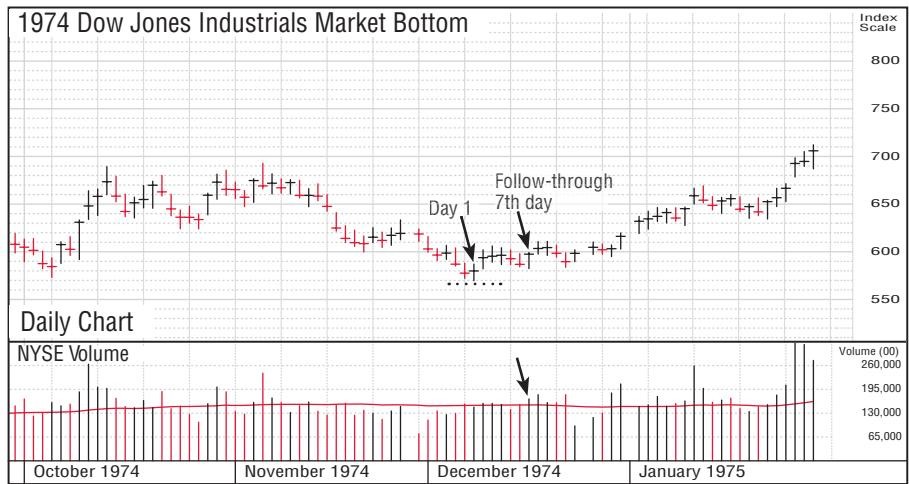

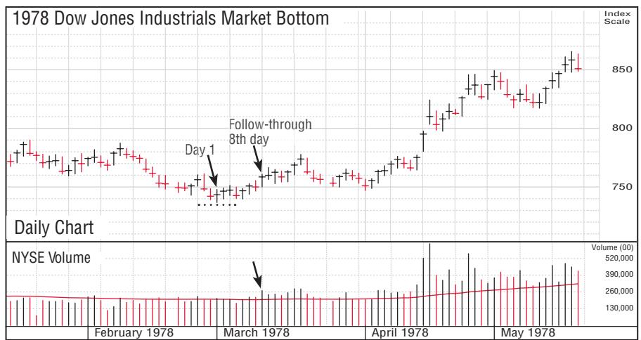

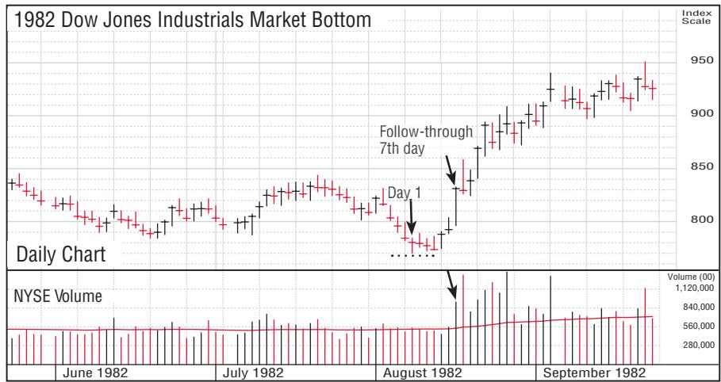

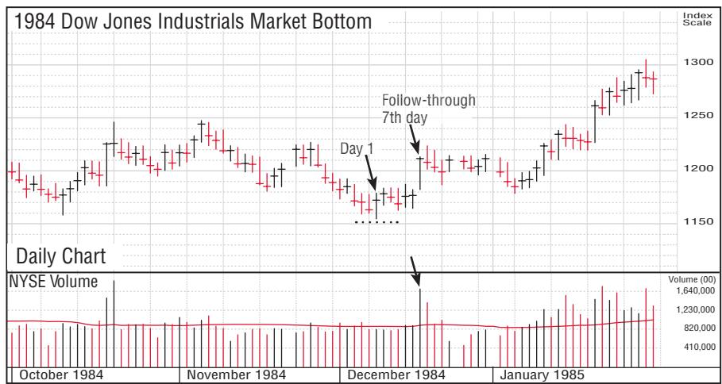

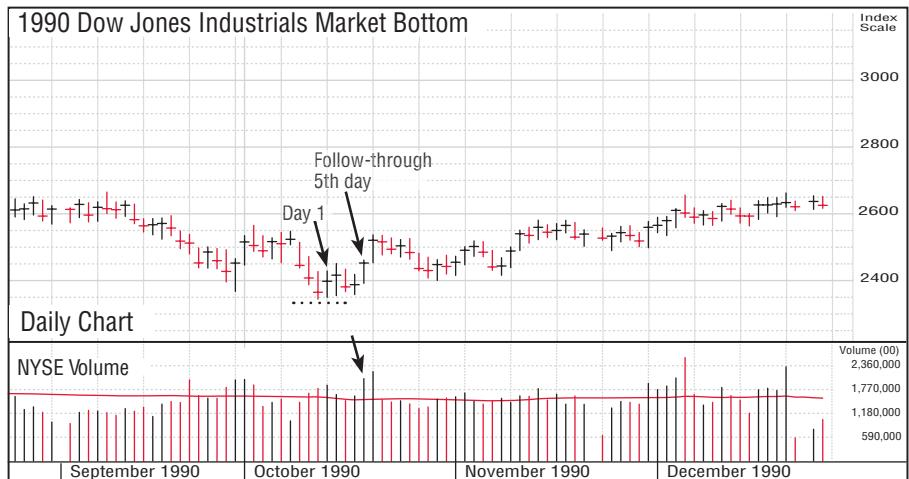

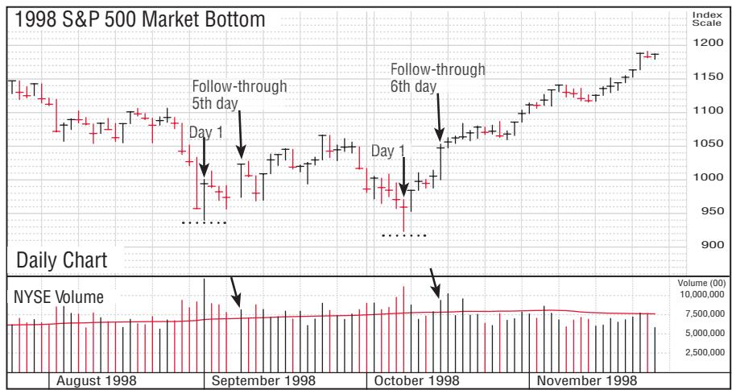

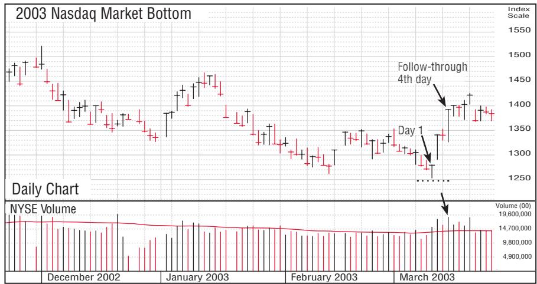

Once you’ve recognized a bear market and have scaled back your stock holdings, the big question is how long you should remain on the sidelines. If you plunge back into the market too soon, the apparent rally may fade, and you’ll lose money. But if you hesitate at the brink of the eventual roaring recovery, opportunities will pass you by. Again, the daily general market averages provide the best answer by far. Markets are always more reliable than most investors’ emotions or personal opinions. 

At some point in every correction—whether that correction is mild or severe—the stock market will always attempt to rally. Don’t jump back in right away. Wait for the market itself to confirm the new uptrend. 

A rally attempt begins when a major market average closes higher after a decline that happened either earlier in the day or during the previous session. For example, the Dow plummets 3% in the morning but then recovers later in the day and closes higher. Or the Dow closes down 2% and then rebounds the next day. We typically call the session in which the Dow finally closes higher the first day of the attempted rally, although there have been some exceptions. For example, the first day of the early October market bottom in 1998 was actually down on heavy volume, but it closed in the upper half of that day’s price range. Sit tight and be patient. The first few days of improvement can’t tell you whether the rally will succeed. 

Starting on the fourth day of the attempted rally, look for one of the major averages to “follow through” with a booming gain on heavier volume than the day before. This tells you the rally is far more likely to be real. The most powerful follow-throughs usually occur on the fourth to seventh days of the rally. The 1998 bottom just mentioned followed through on the fifth day of the attempted rally. The market was up 2.1%. A follow-through day should give the feeling of an explosive rally that is strong, decisive, and conclusive—not begrudging and on the fence or barely up 1½%. The market’s volume for the day should in most cases be above its average daily volume, in addition to always being higher than the prior day’s trading. 

Occasionally, but rarely, a follow-through occurs as early as the third day of the rally. In such a case, the first, second, and third days must all be very powerful, with a major average up 1½% to 2% or more each session in heavy volume. 

I used to consider 1% to be the percentage increase for a valid followthrough day. However, in recent years, as institutional investors have learned of our system, we’ve moved the requirement up a significant amount for the Nasdaq and the Dow. By doing this, we are trying to minimize the possibility that professionals will manipulate a few of the 30 stocks in the Dow Jones average to create false or faulty follow-through days. 

There will be cases in which confirmed rallies fail. A few large institutional investors, armed with their immense buying power, can run up the averages on a particular day and create the impression of a follow-through. Unless the smart buyers are getting back on board, however, the rally will implode— sometimes crashing on heavy volume within the next several days. 

However, just because the market corrects the day after a follow-through doesn’t mean the follow-through was false. When a bear market bottoms, it frequently pulls back and settles above or near the lows made during the previous few weeks. It is more constructive when these pullbacks or “tests” hold at least a little above the absolute intraday lows made recently in the market averages. 

A follow-through signal doesn’t mean you should rush out and buy with abandon. It just gives you the go-ahead to begin buying high-quality stocks with strong sales and earnings as they break out of sound price bases, and it is a vital second confirmation the attempted rally is succeeding. 

Remember, no new bull market has ever started without a strong price and volume follow-through confirmation. It pays to wait and listen to the market. The following graphs are examples of several bottoms in the stock market between 1974 and 2003. 

### The Big Money Is Made in the First Two Years

真正的大钱，通常是在一轮正常新牛市周期的头一两年里赚到的。正是在这个阶段，你必须始终认出并充分把握黄金机会。

上升周期的其余部分，通常由大盘指数的来回震荡构成，随后是一场熊市。1965 年是为数不多的例外之一，但新周期第三年那波强劲的市场，是越战爆发带来的。

在新牛市的第一或第二年，大盘均值应出现几次中级下跌。它们通常持续一两个月，指数下跌 8%，偶尔 12% 或 15%。在几次这种性质的急剧向下调整之后、且在牛市至少走过两年之后，日线市场均值出现放量而无进一步上行进展，可能预示着下一轮熊市的早期开端。

既然市场受供需支配，你可以像解读个股图表那样，解读大盘均值的图表。道琼斯工业指数和 S&P 500 通常在较好的出版物中显示。《投资者商业日报》显示纳斯达克综合指数、纽约证券交易所综合指数和 S&P 500，把大幅的日线价量图一张叠一张地排放，方便三者比较。这些图表应显示市场均值至少六个月的每日最高、最低和收盘，连同每日以百万股计的纽交所和纳斯达克成交量。

顺便说一句，约 50 年前我进入市场时，纽约证券交易所平均一天成交 350 万股。今天，平均每天成交 15 亿股——惊人地增长了 150 倍，毫无疑问地清楚表明了我们自由企业、资本主义制度令人惊叹的增长与成功。它无与伦比的自由与机会，持续吸引着世界各地数百万雄心勃勃的人，他们显著提升了我们的生产力与创造力。它带来了生活水平前所未有的提高，使绝大多数美国人和我们人口的各个阶层都比过去过得更好。总有些问题需要被认识并解决。但我们这套制度是世界上最成功的，它为那些愿意工作、训练、教育自己的人提供了非凡的成长与晋升机会。第 1 章中的 100 张图表，只是过去重大投资机会的一小部分样本。

正常熊市显示三个下跌腿，但没有规则说你不能有四个甚至五个下跌腿。你必须客观地评估国家的整体状况和事件，让市场均值讲述它们自己的故事。而且你必须理解那个故事是什么。

The really big money is usually made in the first one or two years of a normal new bull market cycle. It is at this point that you must always recognize, and fully capitalize upon, the golden opportunities presented. 

The rest of the “up” cycle usually consists of back-and-forth movement in the market averages, followed by a bear market. The year 1965 was one of the few exceptions, but that strong market in the third year of a new cycle was caused by the beginning of the Vietnam War. 

In the first or second year of a new bull market, there should be a few intermediate-term declines in the market averages. These usually last a couple of months, with the market indexes dropping by from 8% to an occasional 12% or 15%. After several sharp downward adjustments of this nature, and after at least two years of a bull market have passed, heavy volume without further upside progress in the daily market averages could indicate the early beginning of the next bear market. 

Since the market is governed by supply and demand, you can interpret a chart of the general market averages about the same way you read the chart of an individual stock. The Dow Jones Industrial Average and the S&P 500 are usually displayed in the better publications. Investor’s Business Daily displays the Nasdaq Composite, the New York Stock Exchange Composite, and the S&P 500, with large-size daily price and volume charts stacked one on top of the other for ease of comparing the three. These charts should show the high, low, and close of the market averages day by day for at least six months, together with the daily NYSE and Nasdaq volume in millions of shares traded. 

Incidentally, when I began in the market about 50 years ago, an average day on the New York Stock Exchange was 3.5 million shares. Today, 1.5 billion shares are traded on average each day—an incredible 150-fold increase that clearly demonstrates beyond any question the amazing growth and success of our free enterprise, capitalist system. Its unparalleled freedom and opportunity have consistently attracted millions of ambitious people from all around the world who have materially increased our productivity and inventiveness. It has led to an unprecedented increase in our standard of living, so that the vast majority of Americans and all areas of our population are better off than they were before. There are always problems that need to be recognized and solved. But our system is the most successful in the world, and it offers remarkable opportunities to grow and advance to those who are willing to work, train, and educate themselves. The 100 charts in Chapter 1 are only a small sample of big past investment opportunities. 

Normal bear markets show three legs of price movement down, but there’s no rule saying you can’t have four or even five down legs. You have to evaluate overall conditions and events in the country objectively and let the market averages tell their own story. And you have to understand what that story is. 

### Additional Ways to Identify Key Market Turning Points

识别关键市场转折点的更多方法

### Look for Divergence of Key Averages

在市场转折点，应当查看几个均值之间是否存在显著背离，即它们朝不同方向运动（一个升、一个降），或某个指数上涨或下跌的速度远大于另一个。

例如，如果道指上涨 100 点，而 S&P 500 按道指折算只相当于上涨 20 点（S&P 500 是更广泛的指数），那就表明这波反弹不像看起来那么广泛而强劲。要把 S&P 500 的变化与道指的变化作比较，可用 S&P 500 去除道指平均值，再乘以 S&P 500 的变化。

例如，如果道指收于 9000，S&P 500 收于 900，那么 9000 点的道指就是 S&P 500 的 10 倍。因此，如果某天道指上涨 100 点而 S&P 500 上涨 5 点，你可以把 5 乘以 10，得出 S&P 500 按道指折算只上涨了 50 点。

道指 1984 年 1 月的新高，伴随着指数之间的背离：更广泛、更重要的 S&P 500 没有创出新高。这就是为什么多数专业人士把关键指数画在一起——以便更容易在关键转折点发现未确认现象。机构投资者会周期性地拉高 30 只股票的道指，同时借道指上涨之势清算更广泛的纳斯达克或一篮子科技股。这就像一场大型扑克游戏，玩家们藏着牌、虚张声势、造假。

Several averages should be checked at market turning points to see if there are significant divergences, meaning that they are moving in different directions (one up and one down) or that one index is advancing or declining at a much greater rate than another. 

For example, if the Dow is up 100 and the S&P 500 is up only the equivalent of 20 on the Dow for the day (the S&P 500 being a broader index), it would indicate the rally is not as broad and strong as it appears. To compare the change in the S&P 500 to that in the Dow, divide the S&P 500 into the Dow average and then multiply by the change in the S&P 500. 

For example, if the Dow closed at 9,000 and the S&P 500 finished at 900, the 9,000 Dow would be 10 times the S&P 500. Therefore, if the Dow, on a particular day, is up 100 points and the S&P 500 is up 5 points, you can multiply the 5 by 10 and find that the S&P 500 was up only the equivalent of 50 points on the Dow. 

The Dow’s new high in January 1984 was accompanied by a divergence in the indexes: the broader-based, more significant S&P 500 did not hit a new high. This is the reason most professionals plot the key indexes together—to make it easier to spot nonconfirmations at key turning points. Institutional investors periodically run up the 30-stock Dow while they liquidate the broader Nasdaq or a list of technology stocks under cover of the Dow run-up. It’s like a big poker game, with players hiding their hands, bluffing, and faking. 

### Certain Psychological Market Indicators Might at Times Help

既然买入和卖出期权交易已成为许多投机者快速致富的途径，你可以把看涨期权与看跌期权的比率画成图并加以分析，作为洞悉群体气质的另一条有价值线索。期权交易者买入看涨期权（买进普通股的权利）或看跌期权（卖出普通股的权利）。看涨期权的买家希望价格上涨，看跌期权的买家希望价格下跌。

如果在给定时间段内看涨期权的成交量大于看跌期权，一个合乎逻辑的假设是：期权投机者作为一个群体预期价格更高、对市场看多。如果看跌期权成交量大于看涨期权，投机者持看空态度。当期权玩家买入的看跌期权多于看涨期权时，看跌/看涨比率指数略高于 1.0。这样的读数曾与 1990、1996、1998 年以及 2001 年 4 月和 9 月的市场底部相吻合，但你不能总指望这会发生。

看空的投资顾问所占的百分比，是一个有趣的投资者情绪衡量指标。当熊市接近底部时，绝大多数顾问通讯通常偏看空。接近市场顶部时，多数偏看多。在正确最重要的时候，大多数人通常是错的。不过，你不能因为上一次市场见底时 65% 的投资顾问看空，就盲目假设下一次投资顾问指数达到同一水平时，一轮重大市场下跌就会结束。

空头净额比率，即纽约证券交易所的卖空数量，以占纽交所总成交量的百分比表示。这个比率能反映市场中投机者表现出的看空程度。在熊市底部附近，你通常会看到两三个显示卖空急剧增加的重大峰值。没有规则规定该指数应升到多高，但研究过去的市场底部，能让你了解该比率在关键市场时刻是什么样子。

有时被用来衡量投机活动程度的一个指数，是纳斯达克成交量占纽交所成交量的百分比。这一衡量在 1983 年夏天提供了一个预示即将来临的麻烦的有用提示，当时纳斯达克成交量相对纽约证券交易所（大盘）显著增加。当一种趋势持续并加速、表明疯狂、失控的投机时，你就接近一轮大盘回调了。近年来，由于太多新的创业公司在纳斯达克上市，纳斯达克成交量已大于纽交所，所以这个指数现在必须换个角度来看。

Now that trading in put and call options is the get-rich-quick scheme for many speculators, you can plot and analyze the ratio of calls to puts for another valuable insight into crowd temperament. Options traders buy calls, which are options to buy common stock, or puts, which are options to sell common stock. A call buyer hopes prices will rise; a buyer of put options wishes prices to fall. 

If the volume of call options in a given period of time is greater than the volume of put options, a logical assumption is that option speculators as a group are expecting higher prices and are bullish on the market. If the volume of put options is greater than that of calls, speculators hold a bearish attitude. When option players buy more puts than calls, the put-to-call ratio index rises a little above 1.0. Such a reading coincided with general market bottoms in 1990, 1996, 1998, and April and September 2001, but you can’t always expect this to occur. 

The percentage of investment advisors who are bearish is an interesting measure of investor sentiment. When bear markets are near the bottom, the great majority of advisory letters will usually be bearish. Near market tops, most will be bullish. The majority is usually wrong when it’s most important to be right. However, you cannot blindly assume that because 65% of investment advisors were bearish the last time the general market hit bottom, a major market decline will be over the next time the investment advisors’ index reaches the same point. 

The short-interest ratio is the amount of short selling on the New York Stock Exchange, expressed as a percentage of total NYSE volume. This ratio can reflect the degree of bearishness shown by speculators in the market. Along bear market bottoms, you will usually see two or three major peaks showing sharply increased short selling. There’s no rule governing how high the index should go, but studying past market bottoms can give you an idea of what the ratio looked like at key market junctures. 

An index that is sometimes used to measure the degree of speculative activity is the Nasdaq volume as a percentage of NYSE volume. This measure provided a helpful tip-off of impending trouble during the summer of 1983, when Nasdaq volume increased significantly relative to the Big Board’s (NYSE). When a trend persists and accelerates, indicating wild, rampant speculation, you’re close to a general market correction. The volume of Nasdaq trading has grown larger than that on the NYSE in recent years because so many new entrepreneurial companies are listed on the Nasdaq, so this index must be viewed differently now. 

### Interpret the Overrated Advance-Decline Line

一些技术分析师虔诚地追踪涨跌（A-D）数据。这些技术人员取每日上涨股票数与下跌股票数之比，再把这个比率画在图上。涨跌线远不精确，因为它们常常在牛市最终见顶之前很久就急剧走低。换言之，市场继续向更高处推进，但领涨的股票越来越少、却越来越好。

涨跌线就是不如关键大盘指数准确，因为分析市场方向不是简单的总数游戏。并非所有股票都是生而平等的；与其知道有多少平庸股票在涨跌，不如知道真正的领导力在哪里、表现如何。

纽交所涨跌线在 1998 年 4 月见顶，并在六个月后、即 10 月爆发的新牛市中一路走低。涨跌线从 1999 年 10 月到 2000 年 3 月持续下跌，错过了数十年来最强劲的一轮市场反弹之一。

当一场明确的熊市尝试短期反弹时，涨跌线有时会有帮助。如果涨跌线落后于市场均值、无法上涨，它就在给出一种内部指示：尽管道指或 S&P 的反弹强劲，更广泛的市场仍然脆弱。这种情况下，反弹通常会失败。换言之，造就一轮新牛市，需要的不仅仅是一些龙头股。

充其量，涨跌线只是一个价值有限的次要指标。如果你听到评论员或电视市场策略师看多或看空地极力吹捧它的优点，他们大概没做足功课。没有任何次要衡量能像主要市场指数那样准确，所以你不要被弄糊涂、去过分强调大多数人使用的、通常结果平平的大量其他技术衡量。

Some technical analysts religiously follow advance-decline (A-D) data. These technicians take the number of stocks advancing each day versus the number that are declining, and then plot that ratio on a graph. Advance-decline lines are far from precise because they frequently veer sharply lower long before a bull market finally tops. In other words, the market keeps advancing toward higher ground, but it is being led by fewer but better stocks. 

The advance-decline line is simply not as accurate as the key general market indexes because analyzing the market’s direction is not a simple total numbers game. Not all stocks are created equal; it’s better to know where the real leadership is and how it’s acting than to know how many more mediocre stocks are advancing and declining. 

The NYSE A-D line peaked in April 1998 and trended lower during the new bull market that broke out six months later in October. The A-D line continued to fall from October 1999 to March 2000, missing one of the market’s most powerful rallies in decades. 

An advance-decline line can sometimes be helpful when a clear-cut bear market attempts a short-term rally. If the A-D line lags the market averages and can’t rally, it’s giving an internal indication that, despite the strength of the rally in the Dow or S&P, the broader market remains frail. In such instances, the rally usually fizzles. In other words, it takes more than just a few leaders to make a new bull market. 

At best, the advance-decline line is a secondary indicator of limited value. If you hear commentators or TV market strategists extolling its virtues bullishly or bearishly, they probably haven’t done their homework. No secondary measurements can be as accurate as the major market indexes, so you don’t want to get confused and overemphasize the vast array of other technical measures that most people use, usually with lackluster results. 

### Watch Federal Reserve Board Rate Changes

在基本面大盘指标中，联邦储备委员会贴现率（FRB 向会员银行放贷收取的利率）、联邦基金利率（有准备金余额的银行向无准备金余额银行放贷收取的利率）的变化，以及偶尔的股票保证金水平，是值得关注的有价值指标。

一般而言，利率提供了对基本经济状况最好的确认，而贴现率和联邦基金利率的变化是迄今最可靠的。过去，美联储利率连续三次大幅上调，通常标志着熊市和即将到来的衰退的开始。

熊市通常（但并非总是）在利率终于下调时结束。在下跌方面，1987 年 9 月、就在艾伦·格林斯潘就任主席后不久，贴现率上调至 6%，导致了当年 10 月的严重市场破位。

货币市场指标反映总体经济活动。我有时会跟踪若干政府和联邦储备委员会的衡量指标，包括 10 项货币供需指标和利率水平指标。历史证明，大盘的方向以及若干行业组的方向，常常受利率变化影响，因为利率水平通常与美联储货币政策的紧缩或宽松相关联。

对投资者而言，最简单、最相关的货币指标，是贴现率和联邦基金利率的变化。

随着程序化交易和各种对冲工具的出现，一些基金如今会对部分组合进行对冲，试图在高风险市场中提供一些下行保护。这些对冲成功的程度同样很大程度上取决于技巧和时机，但对某些管理人而言，一个可能的效果是减轻向市场抛售组合证券的压力。

多数基金实行高度分散、且在任何时候都满仓或接近满仓的政策。因为多数基金经理面对当今巨大的基金规模（数十亿美元），难以在正确的时间退出市场、转为现金，更重要的是，难以足够快地重回市场，以参与最终底部之后最初那波强劲反弹。所以他们可能试图把重心转向大市值、半防御性的板块。

S&P 500 指数与联邦储备委员会贴现率

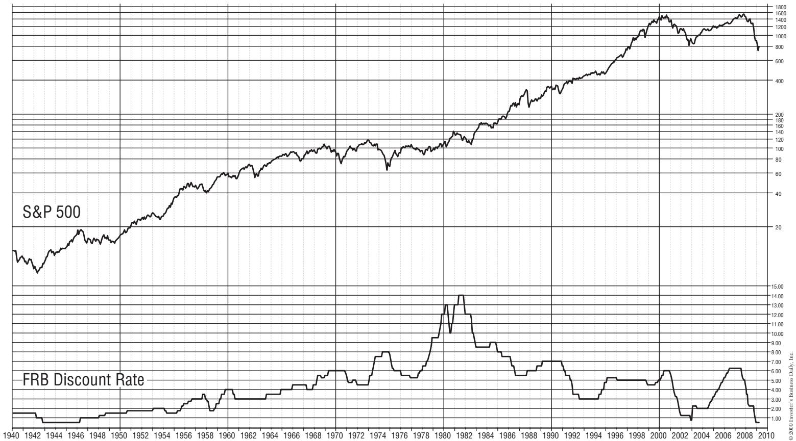

美联储碾碎 1981 年的经济。例如，1981 年开始的熊市和代价高昂、拖沓的衰退，完全是因为美联储在 1980 年 9 月 26 日、11 月 17 日和 12 月 5 日接连迅速上调贴现率。1981 年 5 月 8 日的第四次上调，把贴现率推到 14% 的历史最高。这在当时终结了美国经济、我们的基础产业和股市。

不过，美联储的利率变化不应成为你的首要市场指标，因为股市本身就是你最好的晴雨表。我们对市场周期的分析发现了三个贴现率没能帮助预测的关键市场转折。

美联储的独立行动通常非常有建设性，因为美联储试图抵消我们经济中过热的过程或急剧收缩。然而，它的行动和结果清楚地表明：我们整个联邦政府（而非对所有事件作出反应的股市），有时能够、也确实会显著影响我们的经济未来，无论好坏。

事实上，导致 2008 年极不寻常市场崩盘的次贷房地产抵押贷款危机和金融信贷危机，可以轻易追溯到当时的政府在 1995 年为大幅加强 1977 年《社区再投资法》（CRA）而采取的行动。这些行动要求银行在低收入地区发放比原本更多的、风险更高的贷款。不遵守就意味着严厉处罚、诉讼，以及合并和分支扩张审批受限。

我们的政府实际上鼓励并强制大银行降低它们长期被证明安全的放贷标准。超过 1 万亿美元的新增次贷 CRA 贷款大多是可调利率。许多此类贷款最终不要求借款人收入证明，某些情况下几乎没有或完全没有首付。

此外，新的监管规则首次不仅允许、而且鼓励贷款机构把新的、风险更高的次贷与优质贷款打包，再把这些被假定为政府支持的贷款包卖给其他以为自己在购买安全 AAA 债券的机构和国家。第一批这样的打包贷款于 1997 年进入投资市场。这一行动让贷款发起人和大银行更快获利，并免除了许多低质量贷款未来的风险和责任。它让银行得以转身发放更多 CRA 类贷款，然后再打包出售，几乎没有未来风险或责任。

最终，这一始料未及的结果是一个由政府支持的巨型金字塔机制，房利美和房地美通过购买大量风险更高的次贷来提供隐含的政府背书；这导致它们面临破产、需要巨额政府救助。房地美和房利美的管理层还获得巨额奖金，并且是某些国会议员的捐赠者，这些议员一再为这种高杠杆、极度危险的放贷辩护，反对任何合理改革。

底线是：这是一个大政府项目，初衷完全良好、社会意图值得称赞，却几乎没有洞察力、完全没有先见之明；随着时间推移，它造成了严重损害和巨大的意外后果，影响了几乎一切、几乎所有人，包括——遗憾的是——这个相当无能的政府操作本应帮助的低收入人群。它把我们整个金融体系置于危险之中。1998 年《格拉斯-斯蒂格尔法案》被废除后，华尔街大公司卷入其中，而两党、国会和公众都在制造这场巨大金融惨败中扮演了关键角色。

1962 年的股市破位。另一次值得注意的股市破位发生在 1962 年。那年春天，经济毫无问题，但在政府宣布调查股市、随后又斥责钢铁公司提价之后，市场变得神经紧张。IBM 下跌 50%。当年秋天，在与苏联的古巴导弹对峙之后，一轮新牛市迸发出生机。这一切发生时，贴现率毫无变化。

也曾有过市场见底六个月后贴现率才下调的情况。这种情况下，如果你等贴现率下调，就会入局太晚。少数情况下，美联储降息之后，市场还继续走低或剧烈震荡了好几个月。2000 和 2001 年也戏剧性地出现了这种情况。

Among fundamental general market indicators, changes in the Federal Reserve Board’s discount rate (the interest rate the FRB charges member banks for loans), the fed funds rate (the interest rate banks with fund reserves charge for loans to banks without fund reserves), and occasionally stock margin levels are valuable indicators to watch. 

As a rule, interest rates provide the best confirmation of basic economic conditions, and changes in the discount rate and the fed funds rate are by far the most reliable. In the past, three successive significant hikes in Fed interest rates have generally marked the beginning of bear markets and impending recessions. 

Bear markets have usually, but not always, ended when the rate was finally lowered. On the downside, the discount rate increase to 6% in September 1987, just after Alan Greenspan became chairman, led to the severe market break that October. 

Money market indicators mirror general economic activity. At times I have followed selected government and Federal Reserve Board measurements, including 10 indicators of the supply and demand for money and indicators of interest-rate levels. History proves that the direction of the general market, and also that of several industry groups, is often affected by changes in interest rates because the level of interest rates is usually tied to tight or easy Fed monetary policy. 

For the investor, the simplest and most relevant monetary indicators to follow and understand are the changes in the discount rate and fed funds rate. 

With the advent of program trading and various hedging devices, some funds now hedge portions of their portfolio in an attempt to provide some downside protection during risky markets. The degree to which these hedges are successful again depends greatly on skill and timing, but one possible effect for some managers may be to lessen the pressure to dump portfolio securities on the market. 

Most funds operate with a policy of being widely diversified and fully or nearly fully invested at all times. This is because most fund managers, given the great size of today’s funds (billions of dollars), have difficulty getting out of the market and into cash at the right time and, most importantly, then getting back into the market fast enough to participate in the initial powerful rebound off the ultimate bottom. So they may try to shift their emphasis to big-cap, semidefensive groups. 

S & P 5 00 I n d ex a n d Fed e ra l Rese rve B oa rd D i sco u nt Rate

The Fed Crushes the 1981 Economy. The bear market and the costly, protracted recession that began in 1981, for example, came about solely because the Fed increased the discount rate in rapid succession on September 26, November 17, and December 5 of 1980. Its fourth increase, on May 8, 1981, thrust the discount rate to an all-time high of 14%. That finished off the U.S. economy, our basic industries, and the stock market for the time being. 

Fed rate changes, however, should not be your primary market indicator because the stock market itself is always your best barometer. Our analysis of market cycles turned up three key market turns that the discount rate did not help predict. 

Independent Fed actions are typically very constructive, as the Fed tries to counteract overheated excesses or sharp contractions in our economy. However, its actions and results clearly demonstrate how much our overall federal government, not our stock markets reacting to all events, can and does at times significantly influence our economic future, for good or bad. 

In fact, the subprime real estate mortgage meltdown and the financial credit crisis that led to the highly unusual market collapse of 2008 can be easily traced to moves in 1995 by the then-current administration to substantially beef up the Community Reinvestment Act (CRA) of 1977. These actions required banks to make more higher-risk loans in lower-income areas than they would otherwise have made. Failure to comply meant stiff penalties, lawsuits, and limits on getting approvals for mergers and branch expansion. 

Our government, in effect, encouraged and coerced major banks to lower their long-proven safe-lending standards. Most of the more than \$1 trillion of new subprime CRA loans had adjustable rates. Many such loans eventually came to require no documentation of the borrower’s income and in some cases little or no down payment. 

In addition, for the first time, new regulatory rules not only allowed but encouraged lenders to bundle the new, riskier subprime loans with prime loans and sell these assumed government-sponsored loan packages to other institutions and countries that thought they were buying safe AAA bonds. The first of these bundled loans hit the investment market in 1997. That action allowed loan originators and big banks to make profits faster and eliminate future risk and responsibility for many of those lower-quality loans. It let the banks turn around and make even more CRA-type loans, then sell them off in packages again, with little future risk or responsibility. 

In time, the unintended result was a gigantic government-sponsored pyramiding mechanism, with Fannie Mae and Freddie Mac providing the implied government backing by buying vast quantities of the more risky subprimes; this led to their facing bankruptcy and needing enormous government bailouts. Freddie and Fannie’s management had also received huge bonuses and were donors to certain members of Congress, who repeatedly defended the highly leveraged, extremely risky lending against any sound reforms. 

Bottom line: this was a Big Government program that was started with absolutely good, worthy social intentions, but with little insight and absolutely zero foresight that over time resulted in severe damage and enormous unintended consequences that affected almost everything and everyone, including, sadly, the very lower-income people that this rather inept government operation was supposed to be helping. It put our whole financial system in jeopardy. Big Wall Street firms got involved after the rescinding of the Glass-Steagall Act in 1998, and both political parties, Congress, and the public all played key parts in creating the great financial fiasco. 

The 1962 Stock Market Break. Another notable stock market break occurred in 1962. In the spring, nothing was wrong with the economy, but the market got skittish after the government announced an investigation of the stock market and then got on the steel companies for raising prices. IBM dropped 50%. That fall, after the Cuban missile showdown with the Russians, a new bull market sprang to life. All of this happened with no change in the discount rate. 

There have also been situations in which the discount rate was lowered six months after the market bottom was reached. In such cases, you would be late getting into the game if you waited for the discount rate to drop. In a few instances, after Fed rate cuts occurred, the markets continued lower or whipsawed for several months. This also occurred dramatically in 2000 and 2001. 

### The Hourly Market Index and Volume Changes

在关键转折点，活跃的市场操盘者可以逐小时观察市场指数和成交量变化，并与前一天同一小时的成交量作比较。

观察小时成交量数据的好时机，是市场见顶后首次下跌之后的第一次尝试反弹期间。你应当能看出反弹中成交量是呆滞还是枯竭。你还能看出反弹是否在尾盘开始消退、成交量随之上升——这是反弹疲弱、很可能失败的迹象。

当市场均值到达一个重要的前期低点、并开始跌破那个“支撑”区域时，小时成交量数据也派得上用场。（支撑区域是一个前期价格水平，投资者希望指数不会跌破它。）你想知道的是：当市场崩溃进入新低区域时，卖盘是急剧放大，还是只是小幅增加。如果卖盘急剧放大，它代表市场承受显著的向下压力。

在市场跌破前低几天、但成交量只略微放大之后，留意某一天成交量枯竭，或一两天成交量放大而大盘指数不再走低。如果你看到这种情况，你可能正处在一个“洗盘”区域（市场迫使许多交易者卖出、往往是亏损卖出），在吓出弱势持有者之后准备转向上行。

At key turning points, an active market operator can watch the market indexes and volume changes hour by hour and compare them to volume in the same hour of the day before. 

A good time to watch hourly volume figures is during the first attempted rally following the initial decline off the market peak. You should be able to see if volume is dull or dries up on the rally. You can also see if the rally starts to fade late in the day, with volume picking up as it does, a sign that the rally is weak and will probably fail. 

Hourly volume data also come in handy when the market averages reach an important prior low point and start breaking that “support” area. (A support area is a previous price level below which investors hope that an index will not fall.) What you want to know is whether selling picks up dramatically or by just a small amount as the market collapses into new low ground. If selling picks up dramatically, it represents significant downward pressure on the market. 

After the market has undercut previous lows for a few days, but on only slightly higher volume, look for either a volume dry-up day or one or two days of increased volume without the general market index going lower. If you see this, you may be in a “shakeout” area (when the market pressures many traders to sell, often at a loss), ready for an upturn after scaring out weak holders. 

### Overbought and Oversold: Two Risky Words

短期超买/超卖指标在一些个人技术人员和投资者中有一批狂热的追随者。它是市场上涨与下跌股票数的 10 日移动平均。但要当心。在一轮新牛市开始时，超买/超卖指数可能变得相当“超买”。这不应被视为卖出股票的信号。

逆趋势运动的指数有一个大问题：你总得面对“在一切最终转向之前，情况能糟到什么地步”这个问题。许多业余者追随并相信超买/超卖指标。

在一轮大熊市的早期或第一腿，类似的情况也可能发生，此时该指数可能变得异常超卖。这实际上是在告诉你，一场熊市可能即将来临。在 2000 年惨烈的市场崩盘里，市场一路下跌时始终处于“超卖”。

我曾雇过一位受人尊敬的专业人士，他依赖这类技术指标。在 1969 年市场破位时，恰恰是一切都告诉我市场正陷入严重麻烦、而我正积极地设法让几位投资组合经理清算股票、筹集大量现金之际，他却告诉他们，现在卖出为时已晚，因为他的超买/超卖指标显示市场已经严重超卖。你猜怎么着：市场随后裂开、一泻千里。

不用说，我很少理会超买/超卖指标。从多年经验中学到的东西，通常比使用各种钟爱指标的专家的意见和理论更重要。

The short-term overbought/oversold indicator has an avid following among some individual technicians and investors. It’s a 10-day moving average of advances and declines in the market. But be careful. At the start of a new bull market, the overbought/oversold index can become substantially “overbought.” This should not be taken as a sign to sell stocks. 

A big problem with indexes that move counter to the trend is that you always have the question of how bad things can get before everything finally turns. Many amateurs follow and believe in overbought/oversold indicators. 

Something similar can happen in the early stage or first leg of a major bear market, when the index can become unusually oversold. This is really telling you that a bear market may be imminent. The market was “oversold” all the way down during the brutal market implosion of 2000. 

I once hired a well-respected professional who relied on such technical indicators. During the 1969 market break, at the very point when everything told me the market was getting into serious trouble, and I was aggressively trying to get several portfolio managers to liquidate stocks and raise large amounts of cash, he was telling them that it was too late to sell because his overbought/oversold indicator said that the market was already very oversold. You guessed it: the market then split wide open. 

Needless to say, I rarely pay attention to overbought/oversold indicators. What you learn from years of experience is usually more important than the opinions and theories of experts using their many different favorite indicators. 

### Other General Market Indicators

上涨/下跌成交量是一个短期指数，把当日收涨股票的成交量与收跌股票的成交量联系起来。该指数以 10 周移动平均绘制，可能在某些中级市场转折点显示背离。例如，在一次 10% 到 12% 的下挫之后，大盘均值可能继续跌入新低区域一两周。然而上涨/下跌成交量可能突然转变，显示上涨成交量稳步增加、下跌成交量减弱。这种转变通常预示着市场的中级转向上行。但如果你观察日线道指、纳斯达克或 S&P 500 的变化以及市场成交量，同样能捕捉到这些信号。

一些服务机构衡量流入公司养老金基金的新增资金中，投资于普通股的百分比，以及投资于现金等价物或债券的百分比。这打开了另一扇观察机构投资者心理的窗口。然而，多数、即群体的思维很少正确，即便出自专业人士。每隔一两年，华尔街似乎都意见一致，人人都像牛群一样互相跟随。他们要么一起涌入，要么一起涌出。

“防御型”股票指数——更稳定、据称更安全的公用事业、烟草、食品和肥皂类股票——在牛市走了一两年之后，往往会显示强势。这可能表明“聪明钱”正悄悄转入防御性仓位，前方是更疲弱的大盘。但这并不总是管用。这些次要市场指标，没有一个能与关键大盘指数相提并论。

另一个有时有助于评估市场周期阶段的指标，是防御型或落后类股票中创出价格新高的百分比。在 1983 年之前的周期里，一些技术人员用仍在创新高的股票数量，来为自己不担心市场疲弱找理由。但对新高名单的分析显示，优先股或防御性股票占很大比例，预示着熊市状况。肤浅的知识可能让你在股市中受损。

总结这一复杂但极其重要的章节：学会解读大盘指数的每日价量变化，以及个别市场龙头的表现。一旦你懂得如何正确做到这一点，你就可以不再听业余者和专业人士那些代价高昂、缺乏依据的个人市场意见。如你所见，驾驭股市的关键不在于预测或知道市场将要做什么，而在于知道并理解市场在过去几周实际做了什么、以及此刻正在做什么。我们不想给出个人意见或预测；我们仔细观察市场供需每日的变化。

这套解读市场均值价量变化的方法，其巨大价值之一，不仅在于能更好地辨认市场顶部和底部区域，还在于能追踪市场下行途中的每一次反弹尝试。多数情况下，等待强劲的跟进日，能让你不被过早拉入最终失败的反弹尝试。换言之，你有一套规则，能持续让你不被卷入虚假反弹。这就是我们何以能在 2000 到 2002 年大部分时间里置身场外、留在货币市场基金，保住我们在 1998 和 1999 年赚到的大部分收益，并帮助那些阅读并遵循我们诸多基本规则的人。这一段里藏着属于你的一笔财富。

Upside/downside volume is a short-term index that relates trading volume in stocks that close up in price for the day to trading volume in stocks that close down. This index, plotted as a 10-week moving average, may show divergence at some intermediate turning points in the market. For example, after a 10% to 12% dip, the general market averages may continue to penetrate into new low ground for a week or two. Yet the upside/downside volume may suddenly shift and show steadily increasing upside volume, with downside volume easing. This switch usually signals an intermediate-term upturn in the market. But you’ll pick up the same signals if you watch the changes in the daily Dow, Nasdaq, or S&P 500 and the market volume. 

Some services measure the percentage of new money flowing into corporate pension funds that is invested in common stocks and the percentage that is invested in cash equivalents or bonds. This opens another window into institutional investor psychology. However, majority—or crowd— thinking is seldom right, even when it’s done by professionals. Every year or two, Wall Street seems to be of one mind, with everyone following each other like a herd of cattle. Either they all pile in or they all pile out. 

An index of “defensive” stocks—more stable and supposedly safer issues, such as utilities, tobaccos, foods, and soaps—may often show strength after a couple of years of bull market conditions. This may indicate the “smart money” is slipping into defensive positions and that a weaker general market lies ahead. But this doesn’t always work. None of these secondary market indicators is anywhere near as reliable as the key general market indexes. 

Another indicator that is helpful at times in evaluating the stage of a market cycle is the percentage of stocks in defensive or laggard categories that are making new price highs. In pre-1983 cycles, some technicians rationalized their lack of concern with market weakness by citing the number of stocks that were still making new highs. But analysis of new-high lists shows that a large percentage of preferred or defensive stocks signals bear market conditions. Superficial knowledge can hurt you in the stock market. 

To summarize this complex but vitally important chapter: learn to interpret the daily price and volume changes of the general market indexes and the action of individual market leaders. Once you know how to do this correctly, you can stop listening to all the costly, uninformed, personal market opinions of amateurs and professionals alike. As you can see, the key to staying on top of the stock market is not predicting or knowing what the market is going to do. It’s knowing and understanding what the market has actually done in the past several weeks and what it is currently doing now. We don’t want to give personal opinions or predictions; we carefully observe market supply and demand as it changes day by day. 

One of the great values of this system of interpreting the price and volume changes in the market averages is not just the ability to better recognize market top and bottom areas, but also the ability to track each rally attempt when the market is on its way down. In most instances, waiting for powerful follow-through days keeps you from being drawn prematurely into rally attempts that ultimately end in failure. In other words, you have rules that will continue to keep you from getting sucked into phony rallies. This is how we were able to stay out of the market and in money market funds for most of 2000 through 2002, preserve the majority of the gains we had made in 1998 and 1999, and help those who read and followed our many basic rules. There is a fortune for you in this paragraph. 

### Part I Review: How to Remember and Use What You’ve Read So Far

仅仅阅读是不够的。你需要记住并运用你读到的全部内容。CAN SLIM 体系会帮你记住迄今读到的内容。CAN SLIM 体系中的每个字母，代表挑选出色股票的七个基本要素之一。多数成功的股票在成长崭露阶段都具备这七个共同特征，因此它们值得牢记。反复念这个公式，直到你能轻松回想并运用它：

C = 当前季度每股收益。季度每股收益必须至少增长 18% 或 20%，最好增长 40% 到 100%、200% 甚至更多——越高越好。它们还应在最近几个季度中某个时点加速。季度销售额也应加速，或增长 25%。

A = 年度盈利增长。过去三年每年都必须有显著增长（25% 或更多），且净资产收益率达到 17% 或更高（25% 到 50% 更佳）。如果净资产收益率过低，税前利润率必须强劲。

N = 新产品、新管理层、新高。寻找新产品或新服务、新管理层，或行业状况的重大新变化。最重要的是，买入那些从健康、形态正确的图表底部脱颖而出、并开始创出价格新高的股票。

S = 供需——流通股数加上大成交量需求。在当今的新经济中，只要一家公司符合 CAN SLIM 的其他所有规则，任何市值规模都可以接受。当股票开始走出其筑底区域时，寻找成交量的放大。

L = 龙头还是落后股。买入市场龙头，回避落后股。买入其领域或赛道中排名第一的公司。多数龙头在牛市中会有 80 到 90 或更高的相对价格强度评级，以及 90 或更高的综合评级。

I = 机构支持。买入支持不断增加、且至少有一两只近期业绩记录顶尖的共同基金持有的股票。还要寻找管理层持股的公司。

M = 市场方向。学会通过准确解读每日市场指数的价量运动以及个别市场龙头的表现，来判断整体市场方向。这能决定你是大赢还是大亏。你需要与市场保持同步。与市场脱节没有好处。

It isn’t enough just to read. You need to remember and apply all of what you’ve read. The CAN SLIM system will help you remember what you’ve read so far. Each letter in the CAN SLIM system stands for one of the seven basic fundamentals of selecting outstanding stocks. Most successful stocks have these seven common characteristics at emerging growth stages, so they are worth committing to memory. Repeat this formula until you can recall and use it easily: 

C = Current Quarterly Earnings per Share. Quarterly earnings per share must be up at least 18% or 20%, but preferably up 40% to 100% or 200% or more—the higher, the better. They should also be accelerating at some point in recent quarters. Quarterly sales should also be accelerating or up 25%. 

A = Annual Earnings Increases. There must be significant (25% or more) growth in each of the last three years and a return on equity of 17% or more (with 25% to 50% preferred). If return on equity is too low, pretax profit margin must be strong. 

N = New Products, New Management, New Highs. Look for new products or services, new management, or significant new changes in industry conditions. And most important, buy stocks as they emerge from sound, properly formed chart bases and begin to make new highs in price. 

S = Supply and Demand—Shares Outstanding plus Big Volume Demand. Any size capitalization is acceptable in today’s new economy as long as a company fits all the other CAN SLIM rules. Look for big volume increases when a stock begins to move out of its basing area. 

L = Leader or Laggard. Buy market leaders and avoid laggards. Buy the number one company in its field or space. Most leaders will have Relative Price Strength Ratings of 80 to 90 or higher and composite ratings of 90 or more in bull markets. 

I = Institutional Sponsorship. Buy stocks with increasing sponsorship and at least one or two mutual fund owners with top-notch recent performance records. Also look for companies with management ownership. 

M = Market Direction. Learn to determine the overall market direction by accurately interpreting the daily market indexes’ price and volume movements and the action of individual market leaders. This can determine whether you win big or lose. You need to stay in gear with the market. It doesn’t pay to be out of phase with the market. 

### Is CAN SLIM Momentum Investing?

我甚至不确定“动量投资”是什么。一些不懂我们如何投资的分析师和记者，给我们所谈论和所做之事起了这个名字。他们说，那就是“买入涨幅最大的股票”、买入相对价格强度最强的股票。神志正常的人不会那样投资。我们所做的，是识别那些基本面强劲的公司——由独特的新产品或服务带来销售和盈利的大幅增长——然后在它们从形态良好的价格整理期脱颖而出、尚未在牛市中大幅上涨之前，买入它们的股票。

当熊市开始时，我们希望人们保护自己、通过懂得何时卖出并开始筹集现金来锁定收益。我们不是投资顾问。我们不撰写和发布任何研究报告。我们不给公司打电话或登门拜访。我们不为股票做市，不交易衍生品，不做承销，也不安排并购。我们不管理任何公众或机构资金。

我们是历史研究者，研究并发现股票和市场实际如何运作，并教导、培训各地想要以明智、务实的方式投资赚钱的人。这些人是来自各行各业的普通人，包括专业人士。我们不给他们鱼，我们教他们如何为整个未来钓鱼，让他们也能把握美国梦。

I’m not even sure what “momentum investing” is. Some analysts and reporters who don’t understand anything about how we invest have given that name to what we talk about and do. They say it’s “buying the stocks that have gone up the most in price” and that have the strongest relative price strength. No one in her right mind invests that way. What we do is identify companies with strong fundamentals—large sales and earnings increases resulting from unique new products or services—and then buy their stocks when they emerge from properly formed price consolidation periods and before they run up dramatically in price during bull markets. 

When bear markets are beginning, we want people to protect themselves and nail down their gains by knowing when to sell and start raising cash. We are not investment advisors. We do not write and disseminate any research reports. We do not call or visit companies. We do not make markets in stocks, deal in derivatives, do underwritings, or arrange mergers. We don’t manage any public or institutional money. 

We are historians, studying and discovering how stocks and markets actually work and teaching and training people everywhere who want to make money investing intelligently and realistically. These are ordinary people from all walks of life, including professionals. We do not give them fish. We teach them how to fish for their whole future so that they too can capitalize on the American Dream. 

### Experts, Education, and Egos

在华尔街，聪明人和傻瓜一样容易被引入陷阱。从多年所见来看，一个人教育的长短与质量、智商的高低，与在市场中投资赚钱几乎毫无关系。人越聪明——尤其是男人——就越以为自己真的知道自己在做什么，也就越可能得痛苦地认识到，自己对“智胜市场”所知甚少。

如今我们都亲眼目睹了 2008 年纽约和华盛顿那些据称聪明、有智慧、受过高等教育的人对这个国家造成的严重损害。美国参议员、国会各委员会主席、为房利美和房地美等政府支持实体工作的政治人物，加上纽约顶尖券商、放贷银行和抵押贷款经纪公司的负责人，都以为自己知道自己在做什么，其中许多人用 50 比 1 的荒谬杠杆投资于次贷房地产贷款。

他们创造了复杂的衍生品和保险方案，来为如此惊人的风险辩护。没有哪一个群体该负全责，因为民主党人和共和党人都牵涉其中。然而，这一切最初是一个意图良好的大政府项目，在 1995、1997 和 1998 年《格拉斯-斯蒂格尔法案》被废除时加速推进，此后事情不断升级、失去控制。

所以，也许该是你更多地掌控自己投资的时候了——下定决心，学会如何比华盛顿和华尔街自 1990 年代末以来所做的更安全、更明智地储蓄和投资你的血汗钱。如果你真的想做到，你当然能。任何人都能。

多年来我所认识的、在美国投资上毫无疑问取得成功的少数人，都是果断、没有巨大自负的人。市场有简单的方法，把所有过度的骄傲和膨胀的自负削到合适的尺寸。毕竟，整个要点在于完全客观、认清市场在告诉你什么，而不是试图证明你昨天或六周前说过或做过的是对的。在股市中最快破产的方法，就是试图证明你是对的、市场是错的。谦逊和常识提供了必要的平衡。

有时，听信被人引用、被公认的专家可能让你陷入麻烦。1982 年春夏，一位著名专家坚称政府借贷将挤出私营部门、利率和通胀将回升到新高。结果恰恰相反：通胀骤降，利率崩跌。另一位专家 1996 年夏天的看空预测，只比市场见底早了一天。

2000 年熊市中，一位又一位专家周复一周地在 CNBC 上说，是时候买入高科技股了——结果只能看着科技股继续进一步暴跌。许多高调的分析师和策略师一直告诉投资者，要在下跌途中把握这些一生难遇的“买入机会”！在下跌途中买入可能是非常危险的消遣。

市场中的传统智慧或共识思维很少正确。我从不理会那些在报纸或电视上就市场发表个人意见的川流不息的专家。它制造了太多混乱，可能让你损失大笔金钱。2000 年，一些策略师告诉人们买入回调（短期价格下跌），因为共同基金的现金头寸已大幅增加，所有这些钱都在场外等待投资。要证明这是错的，任何人只需看一眼《投资者商业日报》的“大盘与板块”页面。它显示，尽管共同基金现金头寸确实上升了，但仍显著低于其历史高点，甚至低于其历史均值。

唯一行之有效的办法，是让市场指数告诉你何时进场、何时退出。永远不要与市场作对——它比你强大。

On Wall Street, wise men can be drawn into booby traps just as easily as fools. From what I’ve seen over many years, the length and quality of one’s education and the level of one’s IQ have very little to do with making money investing in the market. The more intelligent people are—particularly men—the more they think they really know what they’re doing, and the more they may have to learn the hard way how little they really know about outsmarting the markets. 

We’ve all now witnessed firsthand the severe damage that supposedly bright, intelligent, and highly educated people in New York and Washington, D.C., caused this country in 2008. U.S. senators, heads of congressional committees, political types working for government-sponsored entities such as Fannie Mae and Freddie Mac, plus heads of top New York-based brokerage firms, lending banks, and mortgage brokers all thought they knew what they were doing, with many of them using absurd leverage of 50 to 1 to invest in subprime real estate loans. 

They created sophisticated derivatives and insurance programs to justify such incredible risks. No one group was solely to blame, since both Democrats and Republicans were involved. However, it all began as a wellintended Big Government program that was accelerated in 1995, 1997, and 1998, when the Glass-Steagall Act was rescinded, and things continued to escalate out of control. 

So maybe it’s time for you to take more control of your investing and make up your mind that you’re going to learn how to save and invest your hard-earned money more safely and wisely than Washington and Wall Street have done since the late 1990s. If you really want to do it, you certainly can. Anyone can. 

The few people I’ve known over the years who’ve been unquestionably successful investing in America were decisive individuals without huge egos. The market has a simple way of whittling all excessive pride and overblown egos down to size. After all, the whole idea is to be completely objective and recognize what the marketplace is telling you, rather than trying to prove that what you said or did yesterday or six weeks ago was right. The fastest way to take a bath in the stock market is to try to prove that you are right and the market is wrong. Humility and common sense provide essential balance. 

Sometimes, listening to quoted and accepted experts can get you into trouble. In the spring and summer of 1982, a well-known expert insisted that government borrowing was going to crowd out the private sector and that interest rates and inflation would soar back to new highs. Things turned out exactly the opposite: inflation broke and interest rates came crashing down. Another expert’s bear market call in the summer of 1996 came only one day before the market bottom. 

Week after week during the 2000 bear market, one expert after another kept saying on CNBC that it was time to buy high-tech stocks—only to watch the techs continue to plummet further. Many high-profile analysts and strategists kept telling investors to capitalize on these once-in-a-lifetime “buying opportunities” on the way down! Buying on the way down can be a very dangerous pastime. 

Conventional wisdom or consensus thinking in the market is seldom right. I never pay any attention to the parade of experts voicing their personal opinions on the market in print or on TV. It creates entirely too much confusion and can cost you a great deal of money. In 2000, some strategists were telling people to buy the dips (short-term declines in price) because the cash position of mutual funds had increased greatly and all this money was sitting on the sidelines waiting to be invested. To prove this wrong, all anyone had to do was look at the General Markets & Sectors page in Investor’s Business Daily. It showed that while mutual fund cash positions had indeed risen, they were still significantly below their historical highs and even below their historical averages. 

The only thing that works well is to let the market indexes tell you when it’s time to enter and exit. Never fight the market—it’s bigger than you are. 
