# — Part 3 第三部分 

## Chapter14 More Models of Great Stock Market Winners

> **中文标题：** 更多伟大股市赢家的范例

**中文翻译（导语）**

本书通篇，我都在向你展示和讲解过去许多最伟大的赢家股。既然你已了解了 CAN SLIM 投资体系，就应该知道：其中一些公司，我们其实通过自家的机构服务公司推荐给了客户，或者由我们亲自买入。

无论你眼下处于人生的什么位置、财务状况如何，凭借 CAN SLIM 体系，你完全有可能让梦想成真。你或许听说过、也读到过，成千上万的人靠这本书和《投资者商业日报》改变了自己的人生。这样的事确实在发生，而且只要你下定决心、肯下功夫、绝不让自己灰心丧气，无论账户大小，它同样可能发生在你身上。

本章将向你介绍几个早年运用这套体系取得成功的例子——这样的例子还有很多很多。此外，它还会带你看更多 1952 年以来的伟大赢家股。请仔细研读本章；你会发现，这些形态在时间的长河里一次又一次地重复。如果你能及早学会辨认它们，就有可能分享到未来某些可观的大利润，哪怕那需要一些耐心。

**英文原文（导语）**

Throughout this book, I’ve shown you and discussed many of the greatest winning stocks of the past. Now that you’ve been introduced to the CAN SLIM system of investing, you should know that we actually suggested some of these same companies to clients through our institutional services firm or bought them ourselves.

Regardless of your current position in life or your financial standing, it’s clearly possible for you to make your dreams come true using the CAN SLIM system. You may have heard or read about the thousands of individuals who have changed their lives using this book and Investor’s Business Daily. It really happens, and it can happen to you if you are determined and have an overpowering desire, no matter how large or small your account . . . as long as you make up your mind, work at it, and don’t ever let yourself get discouraged.

This chapter will introduce you to a few early examples of success using this system. There are many, many others. In addition, it will also introduce you to more of the great winning stocks since 1952. Study this chapter closely; you’ll find these patterns repeat over and over again throughout time. If you learn to recognize them early, you could get in on some future big profits, even if it takes some time.

### Tracing the Growth of a Small Account

1961 年，我用哈佛管理发展项目（PMD）同班同学每人出的 10 美元，凑起 850 美元，创立了第一只 PMD 基金。这事多半是为了好玩。每位同学以 10 美元起家，持有基金的一份。当时任职于 National Newark & Essex Bank、后来出任 Midatlantic National Bank 执行副总裁的马歇尔·沃尔夫，揽下了秘书兼司库这份费力不讨好的差事：记账、通知大家、每年报税缴税。而我则捞到了最轻松的活——管钱。

这个账户很值得研究，因为它证明：只要你坚持正确的方法、并给自己充足的时间，即便起步资金极小，也能赢得这场游戏。到 1986 年 9 月 16 日（大约 25 年后），在缴清此前的全部税款、且马歇尔后来保留了一部分现金之后，账户市值达 51,653.34 美元。也就是说，利润超过 5 万美元，每份价值 518 美元——不到 1000 美元的本金，换来了近 50 倍的税后收益。

随附表格中的真实买卖记录，生动而细致地展现了我们至此讨论过的那些基本投资方法究竟是如何执行的。

请注意，到 1964 年约有 20 笔成功交易，但同样也有 20 笔亏损交易。不过，平均盈利约 20%，平均亏损约 7%。倘若 Standard Kollsman、Brunswick 等几笔亏损没有及时斩断，随后股价的惨烈下跌本会造成大得多的损失。这个小额现金账户一次只集中在一两只股票上；一旦证券价格上涨，通常还会跟进加仓。

1962 年行情糟糕，账户毫无进展；但到 1963 年 6 月 6 日、买入第一笔 Syntex 之前，它已上涨 139%。到 1963 年底，当初 850 美元的投资，收益已膨胀到 474%。

1964 年平平无奇。1965、1966、1967 年都赚到了可观的利润，尽管远不及 1963 年——那是极不寻常的一年。我不想拿 20 页交易记录来烦你，只说一句：此后 10 年继续有所进展，尽管 1969 和 1974 年也吃过亏。

另一段有意思的进展，始于 1978 年买入 Dome Petroleum。从 Dome 开始的所有决策，都收录在第二张表格中。

Dome 给了一个极其宝贵的教训：为什么大多数股票迟早都得卖出。如你所见，它在 77 美元买入、接近 98 美元卖出，最终却跌破了 2 美元！历史在 2000 和 2001 年重演——许多互联网大赢家，如 CMGI，从 165 美元跌到 1 美元。还要注意，账户在 1982 年 7 月 6 日以 15 美元被 Pic 'N' Save"震"出局，但我们随后以 18 美元和 19 美元把它买了回来——尽管价格更高，却因此赚了一大笔。这一点你迟早得学会去做：如果卖出是错的，在许多情况下，你就需要以更高的价格把股票买回来。

PMD 基金交易记录，1961–1964

PMD 基金交易记录，1978–1986

In 1961, with \$10 from each of my classmates at Harvard’s Program for Management Development (PMD), we started the first PMD Fund with the grand total of \$850. It was mostly for fun. Each classmate began with one \$10 share in the fund. Marshall Wolf, then with National Newark & Essex Bank, and later an executive vice president at Midatlantic National Bank, had the thankless job of secretary-treasurer, keeping the records, informing the gang, and filing and paying taxes each year. I got the easy job of managing the money.

It’s an interesting account to study because it proves you can start very small and still win the game if you stick with sound methods and give yourself plenty of time. On September 16, 1986 (some 25 years later), after all prior taxes had been paid and with Marshall having later kept some money in cash, the account was worth \$51,653.34. The profit, in other words, was more than \$50,000, and each share was worth \$518. That is nearly a 50-fold after-tax gain from less than \$1,000 invested.

The actual buy and sell records in the accompanying table illustrate in vivid detail the execution of the basic investment methods we have discussed up to this point.

Note that while there were about 20 successful transactions through 1964, there were also 20 losing transactions. However, the average profit was around 20%, while the average loss was about 7%. If losses in Standard Kollsman, Brunswick, and a few others had not been cut, later severe price drops would have caused much larger losses. This small cash account concentrated in only one or two stocks at a time. Follow-up buys were generally made if the security moved up in price.

The account made no progress in 1962, a bad market year, but it was already up 139% by June 6, 1963, before the first Syntex buy was made. By the end of 1963, the gain had swelled to 474% on the original \$850 investment.

The year 1964 was lackluster. Worthwhile profits were made in 1965, 1966, and 1967, although nothing like 1963, which was a very unusual year. I won’t bore you with 20 pages of stock transactions. Let me just say that the next 10 years showed further progress, despite losses in 1969 and 1974.

Another period of interesting progress started in 1978 with the purchase of Dome Petroleum. All decisions beginning with Dome are picked up and shown in the second table.

Dome offers an extremely valuable lesson on why most stocks sooner or later have to be sold. While it was bought, as you can see, at \$77 and sold near \$98, it eventually fell below \$2! History repeated itself in 2000 and 2001 when many Internet big winners like CMGI dropped from \$165 to \$1. Note also that the account was worn out of Pic ’N’ Save on July 6, 1982, at \$15, but we bought it back at \$18 and \$19, even though this was a higher price, and made a large gain by doing so. This is something you will have to learn to do at some point. If you were wrong in selling, in a number of cases, you’ll need to buy the stock back at higher prices.

<table><tr><td>Shares</td><td>Stock</td><td>Date Bought</td><td>Price Paid</td><td>Date Sold</td><td>Price Sold</td><td>Gain or Loss</td></tr><tr><td>5</td><td>Bristol Myers</td><td>1/1/61</td><td>64.88</td><td>2/21/61</td><td>78.75</td><td></td></tr><tr><td>7</td><td>Bristol Myers</td><td>1/4/61</td><td>67.25</td><td>2/21/61</td><td>78.75</td><td>149.87</td></tr><tr><td>18</td><td>Brunswick</td><td>2/21/61</td><td>53.75</td><td>3/10/61</td><td>68.00</td><td>223.35</td></tr><tr><td>29</td><td>Certain-need</td><td>3/10/61</td><td>42.13</td><td>4/13/61</td><td>39.75</td><td>(104.30)</td></tr><tr><td>24</td><td>Stan. Kollsman</td><td>4/13/61</td><td>45.75</td><td>6/27/61</td><td>45.00</td><td></td></tr><tr><td></td><td>Stan. Kollsman</td><td></td><td>45.75</td><td>6/27/61</td><td>43.38</td><td>(82.66)</td></tr><tr><td>25</td><td>Endevco Corp.</td><td>4/26/61</td><td>13.00</td><td>5/25/61</td><td>17.50</td><td>102.96</td></tr><tr><td>10</td><td>Lockheed</td><td>6/13/61</td><td>44.88</td><td></td><td></td><td></td></tr><tr><td>10</td><td>Lockheed</td><td>6/27/61</td><td>46.38</td><td></td><td></td><td></td></tr><tr><td>5</td><td>Lockheed</td><td>7/25/61</td><td>48.50</td><td>8/29/61</td><td>48.25</td><td>7.55</td></tr><tr><td>6</td><td>Crown Cork</td><td>9/1/61</td><td>108.50</td><td></td><td></td><td></td></tr><tr><td>5</td><td>Crown Cork</td><td>9/1/61</td><td>110.00</td><td>10/2/61</td><td>103.25</td><td>(100.52)</td></tr><tr><td>20</td><td>Brunswick</td><td>10/11/61</td><td>64.25</td><td>10/24/61</td><td>58.13</td><td></td></tr><tr><td></td><td>Brunswick</td><td></td><td></td><td>11/1/61</td><td>54.00</td><td>223.49</td></tr><tr><td>3</td><td>Polaroid</td><td>10/31/61</td><td>206.75</td><td></td><td></td><td></td></tr><tr><td>3</td><td>Polaroid</td><td>11/1/61</td><td>209.00</td><td>2/21/61</td><td>180.00</td><td>(191.68)</td></tr><tr><td>30</td><td>Korvette</td><td>2/28/62</td><td>41.00</td><td>3/30/62</td><td>47.88</td><td></td></tr><tr><td>30</td><td>Korvette</td><td>4/5/62</td><td>52.25</td><td>4/13/62</td><td>54.25</td><td>183.96</td></tr><tr><td>10</td><td>Crown Cork</td><td>5/28/62</td><td>99.25</td><td>5/22/62</td><td>97.25</td><td>(50.48)</td></tr><tr><td>30</td><td>Lockheed</td><td>6/15/62</td><td>41.25</td><td>6/2/62</td><td>39.75</td><td>(81.02)</td></tr><tr><td>5</td><td>Xerox</td><td>6/20/62</td><td>104.75</td><td></td><td></td><td></td></tr><tr><td>5</td><td>Xerox</td><td>6/25/62</td><td>105.25</td><td>7/12/62</td><td>127.13</td><td>190.30</td></tr><tr><td>10</td><td>Homestake Mining</td><td>7/16/62</td><td>59.50</td><td>7/24/62</td><td>54.25</td><td></td></tr><tr><td>10</td><td>Homestake Mining</td><td>7/16/62</td><td>58.75</td><td>7/24/62</td><td>54.25</td><td>(87.66)</td></tr><tr><td>10</td><td>Polaroid</td><td>7/31/62</td><td>105.00</td><td>7/19/62</td><td>97.88</td><td>(101.86)</td></tr><tr><td>30</td><td>Korvette (Short)</td><td>10/24/62</td><td>21.88</td><td>9/28/62</td><td>35.13</td><td>385.94</td></tr><tr><td>10</td><td>Chrysler</td><td>10/30/62</td><td>59.00</td><td></td><td></td><td></td></tr><tr><td>15</td><td>Chrysler</td><td>11/1/62</td><td>60.34</td><td>1/15/63</td><td>83.63</td><td>545.40</td></tr><tr><td>15</td><td>RCA</td><td>1/16/63</td><td>62.50</td><td></td><td></td><td></td></tr><tr><td>15</td><td>RCA</td><td>1/18/63</td><td>65.25</td><td>2/28/63</td><td>62.00</td><td>(111.02)</td></tr><tr><td>25</td><td>Coastal States</td><td>2/28/63</td><td>31.38</td><td>3/14/63</td><td>32.13</td><td>(8.46)</td></tr><tr><td>14</td><td>Chrysler</td><td>2/27/63</td><td>92.50</td><td></td><td></td><td></td></tr><tr><td>8</td><td>Chrysler</td><td>3/14/63</td><td>93.00</td><td>4/16/63</td><td>109.13</td><td>300.03</td></tr><tr><td>25</td><td>Control Data</td><td>4/23/63</td><td>44.13</td><td>5/13/63</td><td>49.63</td><td>102.55</td></tr><tr><td>25</td><td>Intl. Minerals</td><td>5/6/63</td><td>52.88</td><td>5/15/63</td><td>54.88</td><td>11.47</td></tr><tr><td>22</td><td>Chrysler</td><td>5/13/63</td><td>54.38</td><td>6/10/63</td><td>61.75</td><td></td></tr><tr><td>25</td><td>Chrysler</td><td>5/17/63</td><td>55.63</td><td>6/10/63</td><td>61.75</td><td>211.30</td></tr><tr><td>15</td><td>Syntex</td><td>6/11/63</td><td>89.25</td><td>9/23/63</td><td>146.13</td><td></td></tr><tr><td>10</td><td>Syntex</td><td>8/7/63</td><td>114.50</td><td>9/23/63</td><td>146.13</td><td></td></tr><tr><td>15</td><td>Syntex</td><td>10/9/63</td><td>149.13</td><td>10/22/63</td><td>225.00</td><td>2,975.71</td></tr><tr><td>15</td><td>Control Data</td><td>7/9/63</td><td>69.13</td><td>7/17/63</td><td>67.25</td><td>(59.62)</td></tr><tr><td>15</td><td>RCA</td><td>1/8/64</td><td>102.02</td><td>2/11/64</td><td>105.68</td><td>53.98</td></tr><tr><td>15</td><td>RCA</td><td>1/9/64</td><td>106.19</td><td>2/11/64</td><td>105.68</td><td>(8.49)</td></tr><tr><td>15</td><td>RCA</td><td>1/10/64</td><td>107.33</td><td>2/11/64</td><td>105.68</td><td>(25.54)</td></tr><tr><td>50</td><td>Pan Am</td><td>2/17/64</td><td>65.53</td><td>3/9/64</td><td>68.00</td><td>123.29</td></tr><tr><td>25</td><td>McDonnell Air</td><td>3/11/64</td><td>62.17</td><td>5/11/64</td><td>60.00</td><td>(54.26)</td></tr><tr><td>25</td><td>Chrysler</td><td>3/12/64</td><td>47.88</td><td>4/7/64</td><td>43.87</td><td>(100.35)</td></tr><tr><td>25</td><td>Chrysler</td><td>3/13/64</td><td>49.27</td><td>4/7/64</td><td>43.87</td><td>(135.06)</td></tr><tr><td>30</td><td>Chrysler</td><td>3/17/64</td><td>50.21</td><td>4/30/64</td><td>46.08</td><td>(123.83)</td></tr><tr><td>30</td><td>Consol. Cigar</td><td>3/19/64</td><td>49.35</td><td>4/20/64</td><td>47.25</td><td>(62.87)</td></tr><tr><td>25</td><td>Greyhound</td><td>4/7/64</td><td>55.47</td><td>5/1/64</td><td>57.63</td><td>53.88</td></tr><tr><td>20</td><td>Greyhound</td><td>4/8/64</td><td>58.55</td><td>5/1/64</td><td>57.63</td><td>(18.52)</td></tr><tr><td>15</td><td>Xerox</td><td>4/21/64</td><td>95.23</td><td>5/1/64</td><td>93.00</td><td>(33.41)</td></tr><tr><td>15</td><td>Xerox</td><td>4/29/64</td><td>98.53</td><td>5/5/64</td><td>95.00</td><td>(52.95)</td></tr><tr><td>30</td><td>Chrysler</td><td>5/13/64</td><td>52.14</td><td>7/8/64</td><td>48.75</td><td>(101.69)</td></tr><tr><td>50</td><td>Chrysler</td><td>5/13/64</td><td>52.32</td><td>6/11/64</td><td>46.50</td><td>(290.79)</td></tr><tr><td>50</td><td>Chrysler</td><td>5/13/64</td><td>52.34</td><td>6/30/64</td><td>49.00</td><td>(166.82)</td></tr><tr><td>50</td><td>Cerro Corp.</td><td>7/2/64</td><td>49.00</td><td>9/16/64</td><td>56.00</td><td>349.51</td></tr><tr><td>20</td><td>Cerro Corp.</td><td>7/6/64</td><td>50.68</td><td>9/16/64</td><td>56.00</td><td>106.50</td></tr><tr><td>50</td><td>NY Central RR</td><td>7/8/64</td><td>41.65</td><td>11/16/64</td><td>49.05</td><td>369.89</td></tr></table>

PMD Fund Transactions, 1961–1964

<table><tr><td>Shares</td><td>Stock</td><td>Date Bought</td><td>Price Paid</td><td>Date Sold</td><td>Price Sold</td><td>Gain or Loss</td></tr><tr><td>100</td><td>Dome Petroleum</td><td>12/28/78</td><td>77.00</td><td></td><td></td><td></td></tr><tr><td>20</td><td>Dome Petroleum</td><td></td><td></td><td>2/26/79</td><td>97.88</td><td>14,226.72</td></tr><tr><td>320</td><td>4/1 split on 6/6/79</td><td></td><td></td><td>10/17/80</td><td>63.00</td><td>(3,165.82)</td></tr><tr><td>300</td><td>Fluor</td><td>10/17/80</td><td>56.50</td><td>2/9/81</td><td>48.25</td><td></td></tr><tr><td>50</td><td>Fluor</td><td>10/17/80</td><td>56.88</td><td></td><td></td><td></td></tr><tr><td>100</td><td>Pic &#x27;N&#x27; Save</td><td>6/4/81</td><td>55.00</td><td></td><td></td><td></td></tr><tr><td>300</td><td>3/1 split 6/29/81</td><td></td><td></td><td>7/6/82</td><td>15.00</td><td>(1,094.00)</td></tr><tr><td>100</td><td>Espey Mfg.</td><td>11/19/81</td><td>46.75</td><td>6/8/82</td><td>38.00</td><td></td></tr><tr><td>50</td><td>Espey Mfg.</td><td>11/19/81</td><td>47.00</td><td>4/23/82</td><td>46.00</td><td>(1,313.16)</td></tr><tr><td>100</td><td>MCI Comm.</td><td>4/23/82</td><td>37.00</td><td>8/20/82</td><td>36.38</td><td>(123.50)</td></tr><tr><td>96</td><td>MCI Comm.</td><td>7/6/82</td><td>45.50</td><td></td><td></td><td></td></tr><tr><td></td><td>2/1 split on 9/20/82</td><td></td><td></td><td>1/3/83</td><td>38.25</td><td>2,881.92</td></tr><tr><td>200</td><td>Pic &#x27;N&#x27; Save</td><td>8/20/82</td><td>18.50</td><td>7/16/84</td><td>19.25</td><td>3,892.00</td></tr><tr><td>45</td><td>Hewlett Packard</td><td>9/10/82</td><td>53.00</td><td>8/11/83</td><td>82.88</td><td>1,307.35</td></tr><tr><td>100</td><td>Pic &#x27;N&#x27; Save</td><td>8/27/82</td><td>19.50</td><td></td><td></td><td></td></tr><tr><td>185</td><td>Pic &#x27;N&#x27; Save</td><td>1/3/83</td><td>38.13</td><td></td><td></td><td></td></tr><tr><td></td><td>2/1 split on 12/1/83</td><td></td><td></td><td>2/1/85</td><td>23.25</td><td>4,115.02</td></tr><tr><td>200</td><td>Price Co.</td><td>7/6/84</td><td>39.25</td><td></td><td></td><td></td></tr><tr><td>326</td><td>Price Co.</td><td>2/1/85</td><td>53.75</td><td></td><td></td><td></td></tr><tr><td>8</td><td>Price Co.</td><td></td><td></td><td>3/25/85</td><td>57.00</td><td></td></tr><tr><td></td><td>2/1 split on 2/11/86</td><td></td><td></td><td>6/17/86</td><td>49.88</td><td>26,489.87</td></tr><tr><td>15</td><td>Price Co.</td><td></td><td></td><td>3/20/86</td><td>43.25</td><td></td></tr></table>

PMD Fund Transactions, 1978–1986

### The U.S. Investing Championship

另一个 CAN SLIM 原则被正确运用的生动例子，是我们的同事李·弗里斯的经历。1991 年，年仅 24 岁的李参加了全美投资锦标赛。他运用 CAN SLIM 技法，以 279% 的年度成绩夺得第二名；1992 年又取得 120% 的回报，再次位列第二。李所做的，正是另一位同事大卫·瑞安此前几年参加全美投资锦标赛并夺冠时做过的事。全美投资锦标赛可不是什么纸上谈兵的模拟赛——它用的是真金白银，在市场上真刀真枪地做交易。此后，李在 1990 年代末继续成功投资，回报更加丰厚。

可见，只要带着纪律去执行，CAN SLIM 体系从 1961 到 2009 年、历经顺境与逆境，已被反复证明行之有效。

Another engaging example of the CAN SLIM principles being properly applied is the story of one of our associates, Lee Freestone. Lee participated in the U.S. Investing Championship in 1991, when he was just 24 years old. Using the CAN SLIM technique, he came in second for the year, with a result of 279%. In 1992, he gained a 120% return and again came in second. Lee was doing what David Ryan, another associate at the time, had done when he participated in the U.S. Investing Championship in prior years and won. The U.S. Investing Championship is not some paper transaction derby. Real money is used, and actual transactions are made in the market. Lee continued to invest successfully with even larger returns in the late 1990s.

So if it is followed with discipline, the CAN SLIM system has been battle-tested successfully through thick and thin from 1961 to 2009.

### More Examples of Great Winners to Guide You

接下来是另一批精选的股市最伟大赢家的图表。它们是 1952 到 2009 年间美国最成功投资的范本。请仔细研究、时常翻阅——它们是你在未来必须寻找的更多范例。价格下方那条末端标有 RS 的细波浪线，是相对价格强度线；这条线向上走，就说明该股跑赢大盘。所有模型展示的，都是你即将采取买入行动那一刻之前的股价形态。

如果你以为自己只是在看一堆图表，那可就错了。你看到的，是那些最伟大赢家股在其惊人涨势启动之前的价量蓄势图景。这些图表以五种形态呈现：杯柄形态、无柄杯形态、双重底形态、平底形态，以及底上之底形态。你需要学会辨认这些形态。

Graphs for an additional selected group of the greatest stock market winners follow. They are models of the most successful investments in the United States from 1952 through 2009. Study them carefully and refer to them often. They are further examples of what you must look for in the future. The thin wavy line with RS at the end shown below the prices is a relative price strength line. When the line moves up, the stock is outperforming the market. All the models show the stock’s chart pattern just before the point where you want to take buying action.

If you think you’re just looking at a bunch of charts, think again. What you are seeing are pictures of the price accumulation patterns of the greatest winning stocks—just before their enormous price moves began. The charts are presented in five configurations: cup-with-handle pattern, cup-withouthandle pattern, double-bottom pattern, flat-base pattern, and base-on-topof-a-base pattern. You need to learn to recognize these patterns.

### Cup-With-Handle Pattern

Telex：27 周上涨 283%

Houston Oil：54 周上涨 1004%

Waste Management：242 周上涨 1180%

Storage Technology：52 周上涨 371%

Ford：262 周上涨 889%

King World Prod.：116 周上涨 588%

Reebok：18 周上涨 246%

Macromedia：49 周上涨 486%

Comverse Technology：67 周上涨 564%

ARM Holdings：57 周上涨 1385%

Compaq：46 周上涨 352%

Amazon.com：70 周上涨 3805%

Verisign：66 周上涨 2250%

Veritas Software：62 周上涨 1097%

Qlogic：44 周上涨 803%

Checkpoint Software：40 周上涨 1104%

Broadvision：30 周上涨 823%

Siebel Systems：28 周上涨 466%

Triquint Semiconductor：41 周上涨 1078%

RF Micro Devices：36 周上涨 444%

E-Tek Dynamics：28 周上涨 507%

Business Objects：26 周上涨 480%

Microstrategy：24 周上涨 1414%

China Mobile：131 周上涨 484%

Vistacare：31 周上涨 115%

Research in Motion：60 周上涨 382%

McDermott：128 周上涨 703%

Baidu：25 周上涨 225%

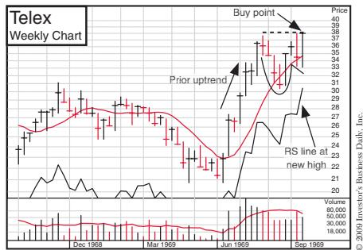

Telex 283% increase in 27 weeks

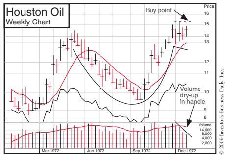

Houston Oil 1004% increase in 54 weeks

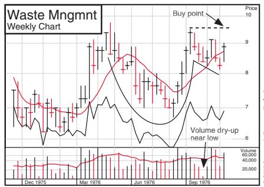

Waste Management 1180% increase in 242 weeks

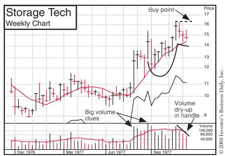

Storage Technology 371% increase in 52 weeks

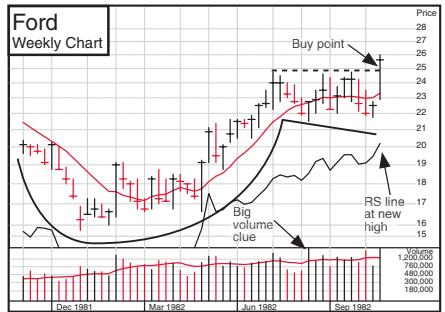

Ford 889% increase in 262 weeks

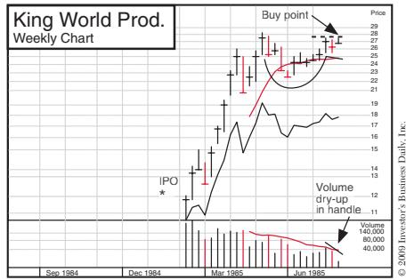

King World Prod. 588% increase in 116 weeks

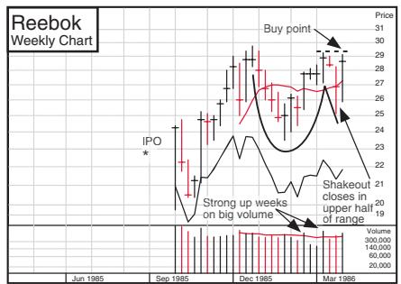

Reebok 246% increase in 18 weeks

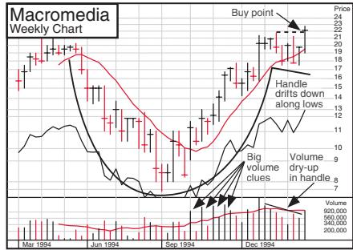

Macromedia 486% increase in 49 weeks

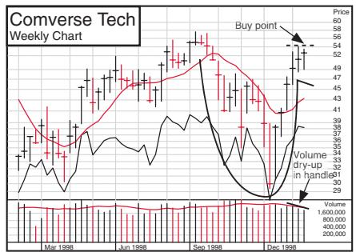

Comverse Technology 564% increase in 67 weeks

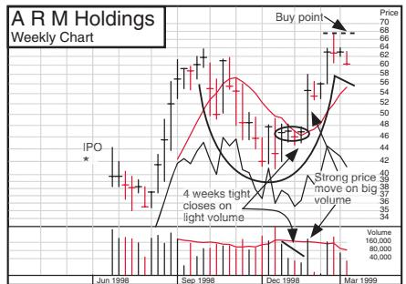

ARM Holdings 1385% increase in 57 weeks

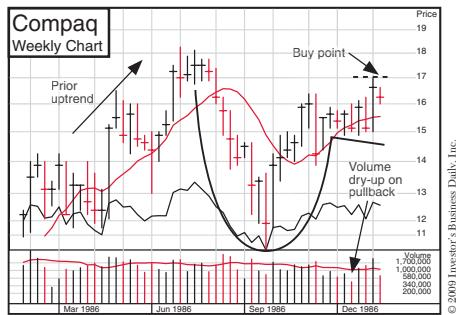

Compaq 352% increase in 46 weeks

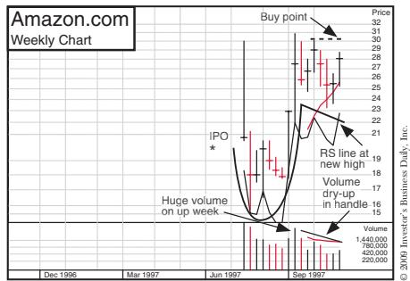

Amazon.com 3805% increase in 70 weeks

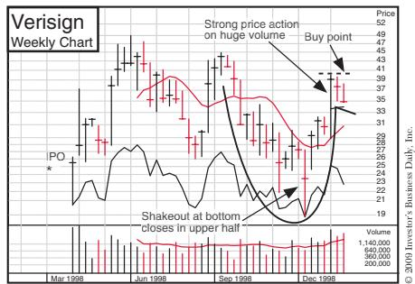

Verisign 2250% increase in 66 weeks

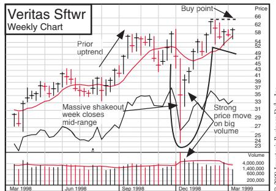

Veritas Software 1097% increase in 62 weeks

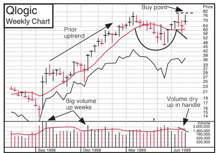

Qlogic 803% increase in 44 weeks

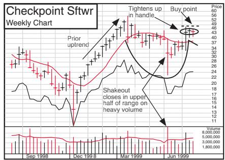

Checkpoint Software 1104% increase in 40 weeks

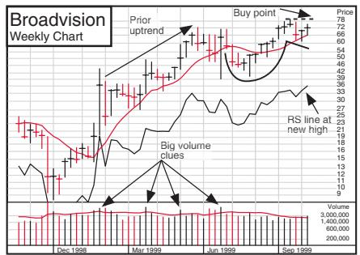

Broadvision 823% increase in 30 weeks

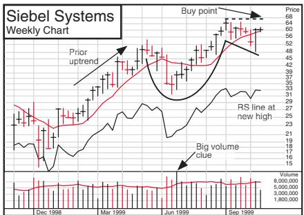

Siebel Systems 466% increase in 28 weeks

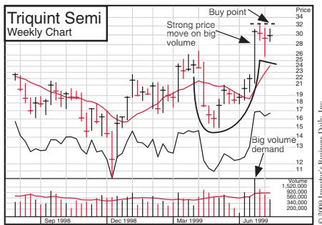

Triquint Semiconductor 1078% increase in 41 weeks

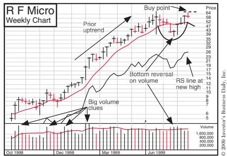

RF Micro Devices 444% increase in 36 weeks

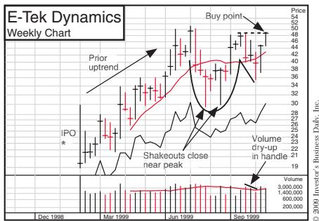

E-Tek Dynamics 507% increase in 28 weeks

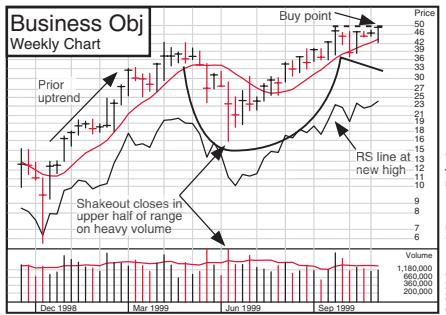

Business Objects 480% increase in 26 weeks

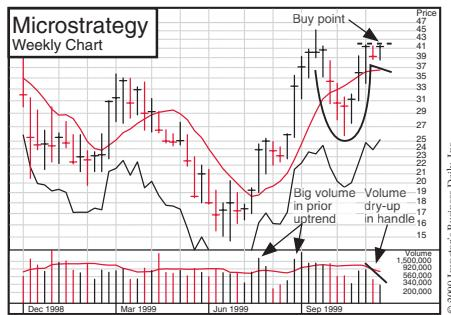

Microstrategy 1414% increase in 24 weeks

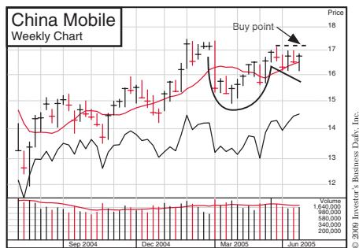

China Mobile 484% increase in 131 weeks

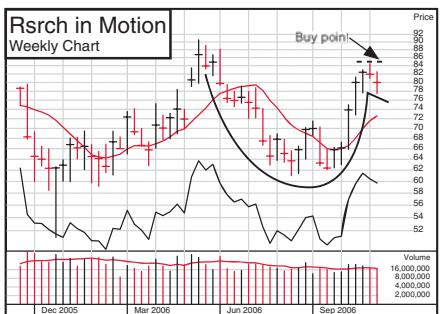

Vistacare 115% increase in 31 weeks

Research in Motion 382% increase in 60 weeks

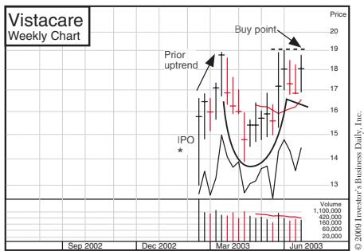

McDermott 703% increase in 128 weeks

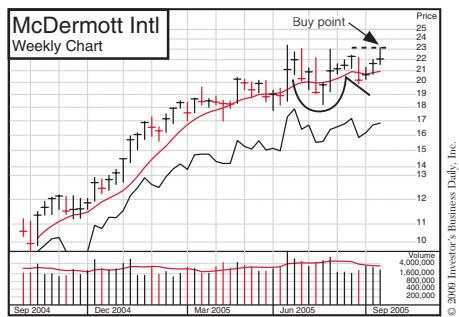

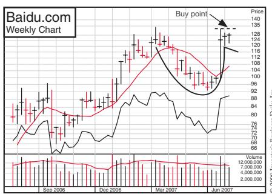

Baidu 225% increase in 25 weeks

### Cup-Without-Handle Pattern

Wards：38 周上涨 267%

TCBY：77 周上涨 2189%

C-Cube：41 周上涨 509%

PMC Sierra：70 周上涨 1949%

PE Celera：32 周上涨 2281%

Gen-Probe：20 周上涨 122%

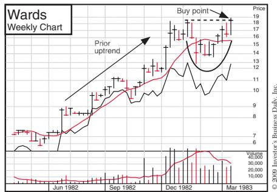

Wards 267% increase in 38 weeks

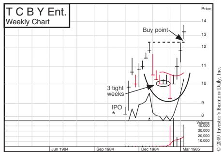

TCBY 2189% increase in 77 weeks

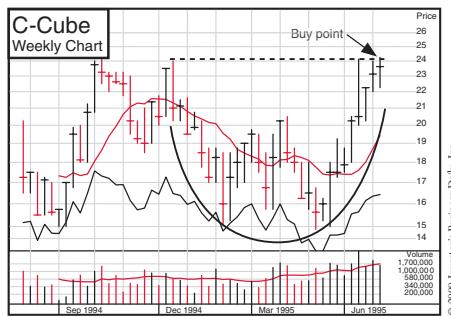

C-Cube 509% increase in 41 weeks

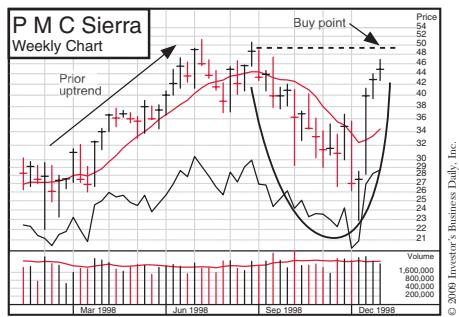

PMC Sierra 1949% increase in 70 weeks

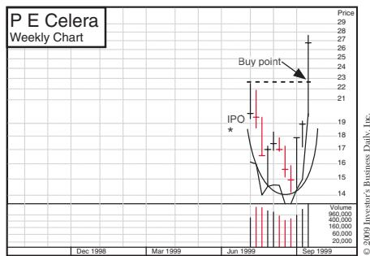

PE Celera 2281% increase in 32 weeks

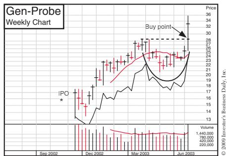

Gen-Probe 122% increase in 20 weeks

### Double Bottom Pattern

AMF：23 周上涨 82%

Sun Micro：74 周上涨 701%

Nokia：87 周上涨 486%

Omnivision Tech：39 周上涨 256%

Quality Systems：44 周上涨 177%

Chicago Merc. Exch.：132 周上涨 208%

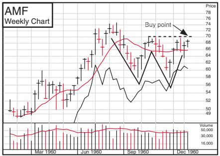

AMF 82% increase in 23 weeks

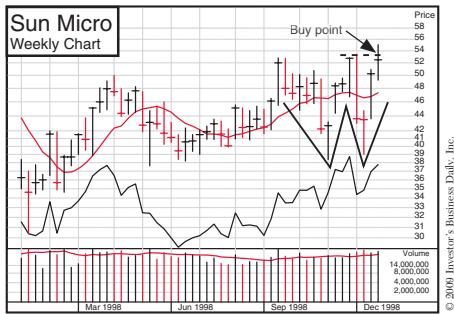

Sun Micro 701% increase in 74 weeks

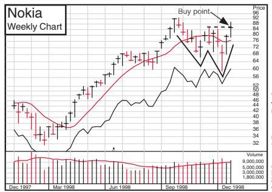

Nokia 486% increase in 87 weeks

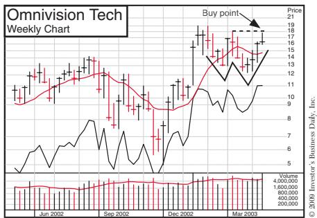

Omnivision Tech 256% increase in 39 weeks

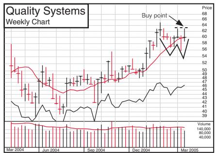

Quality Systems 177% increase in 44 weeks

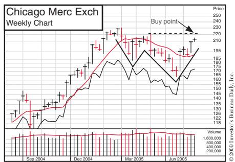

Chicago Merc. Exch. 208% increase in 132 weeks

### Flat Base Pattern

Handleman：139 周上涨 328%

Hilton：60 周上涨 232%

Jones Medical：36 周上涨 447%

SDL Inc：39 周上涨 814%

Starbucks：70 周上涨 126%

American Movil：205 周上涨 730%

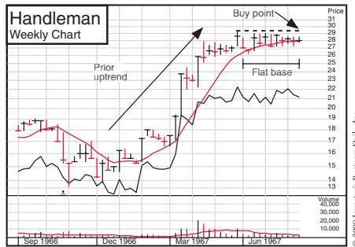

Handleman 328% increase in 139 weeks

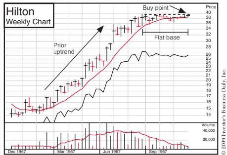

Hilton 232% increase in 60 weeks

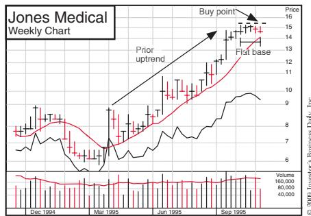

Jones Medical 447% increase in 36 weeks

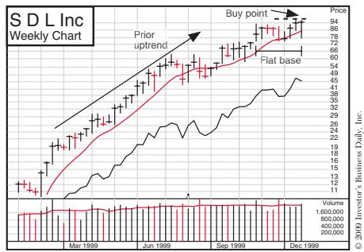

SDL Inc 814% increase in 39 weeks

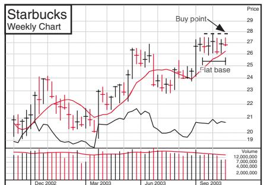

Starbucks 126% increase in 70 weeks

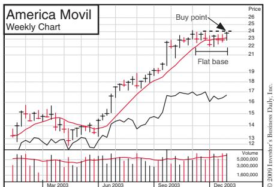

American Movil 730% increase in 205 weeks

### Base-on-Base Pattern

Prime Computer：169 周上涨 1564%

Surgical Affiliates：150 周上涨 1632%

Optical Coating Labs：58 周上涨 1957%

Network Appliance：18 周上涨 517%

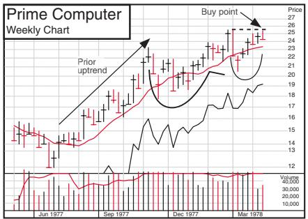

Prime Computer 1564% increase in 169 weeks

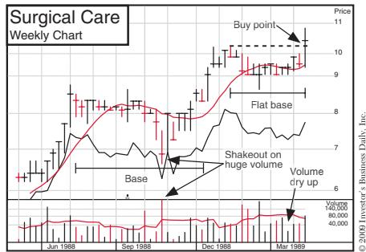

Surgical Affiliates 1632% increase in 150 weeks

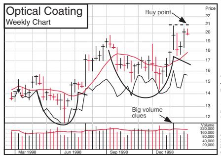

Optical Coating Labs 1957% increase in 58 weeks

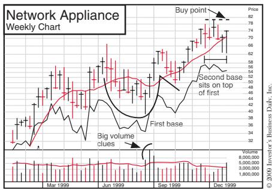

Network Appliance 517% increase in 18 weeks

## Chapter15 Picking the Best Market Themes, Sectors, and Industry Groups

> **中文标题：** 挑选最佳市场主题、板块与行业组

**中文翻译（导语）**

领涨股大多出自领涨行业。研究显示，一只股票价格波动的 37% 直接取决于它所在行业组的表现，另有 12% 来自其所在大板块的强势。也就是说，一只股票约有一半的涨跌，是由它所属行业组的强弱决定的。由于每一轮市场周期都由特定的行业组领跑，你便能明白：在买入之前先掂量一只股票所处的行业，是多么值得。

为便于讨论，我们使用三个术语：板块（sector）、行业组（industry group）和子行业（subgroup）。板块是公司与行业的一个宽泛归类，例如基础产业（即"周期性"行业）、消费商品与服务、运输、金融和高科技。行业组是更小、更具体的企业归类，一个板块内通常包含若干个行业组。子行业则更为精细，把一个行业组再切分成若干非常明确的细类。

举例来说，若以 Viacom 为例，可以这样描述：板块——休闲娱乐业；行业组——传媒；子行业——广播/电视。为清晰起见、也便于使用，行业组与子行业的名称通常合并在一起，统称"行业组"。例如，Viacom 所属的行业组就叫"传媒——广播/电视"。

**英文原文（导语）**

The majority of the leading stocks are usually in leading industries. Studies show that 37% of a stock’s price movement is directly tied to the performance of the industry group the stock is in. Another 12% is due to strength in its overall sector. Therefore, roughly half of a stock’s move is driven by the strength of its respective group. Because specific industry groups lead each market cycle, you can see how worthwhile it is to consider a stock’s industry before making a purchase.

For the purposes of this discussion, there are three terms we will use: sector, industry group, and subgroup. A sector is a broad grouping of companies and industries. These include, for example, basic industries (or “cyclicals”), consumer goods and services, transportation, finance, and high technology. An industry group is a smaller, more specific grouping of companies; there normally are several industry groups within a sector. A subgroup is even more specific, dividing the industry group into several very precise subcategories.

For example, if we were to look at Viacom, it could be described as follows: Sector: Leisure and Entertainment Industry; Group: Media; and Subgroup: Radio/TV. For clarity and ease of use, industry group and subgroup names are generally combined, with the result simply being called “industry groups.” For example, the industry group for Viacom is known as “Media— Radio/TV.”

### Why Track 197 Industry Groups?

IBD 为什么把证券划分为 197 个行业组，而不是像标准普尔那样只分成数量更少的组？道理其实很简单：同一板块内的股票表现并不整齐。即便某个板块整体强于其他板块，其中也可能有一些细分部分表现极佳、另一些则落后于大盘。重要的是，你要能辨认出板块内哪个行业组表现最好——因为这份认知，往往就是卓越成绩与平庸成绩之间的分水岭。

在早期研究市场时我们就意识到，当时许多投资服务机构并没有把市场充分拆解成足够多的行业组，因而很难判断一个行业组中真正的领涨部分究竟在哪。于是我们自创了一套行业组体系，把市场切分为 197 个细分门类，让身为投资者的你，能对一个行业的构成获得更准确、更细致的洞察。例如，医疗行业可以细分为医院公司、仿制药、牙科、家庭护理、遗传学、生物科技和健康维护组织（HMO），外加其他几个独特的现代领域。

Why does IBD divide securities into 197 industry groups rather than, say, the smaller number of groups used by Standard & Poor’s? It’s simple really. The stocks within a given sector do not all perform at the same rate. Even if a sector is outperforming other sectors, there may be segments of that sector that are performing extremely well and others that are lagging the market. It’s important that you be able to recognize what industry group within the sector is acting the very best, since this knowledge can mean the difference between superior and mediocre results.

Early in our study of the market, we realized that many of the investment services available at the time did not adequately dissect the market into enough industry groups. It was therefore difficult to determine the specific part of a group where the true leadership was. So we created our own industry groups, breaking down the market into 197 different subcategories and providing you, the investor, with more accurate and detailed insights into the makeup of an industry. For example, the medical industry can be divided into hospital companies, generic drugs, dental, home nursing, genetics, biotech, and HMOs, plus a few other unique modern areas.

### How You Can Decide Which Industry Groups Are Leading the Market

在分析行业时我们发现，有些行业太小，其组内走强的迹象未必有参考价值。若某个子行业里只有两家规模小、成交清淡的公司，那还不足以构成一个"行业组"。反过来，也有些行业公司数量过多，比如化工、储蓄与贷款机构。这种供给过剩并不会增加这些行业的吸引力——除非行业状况发生某些极不寻常的变化。

前面提到的 197 个行业组，每天都能在《投资者商业日报》上查到。我们在其中按各子行业的六个月价格表现进行排名，让你一眼看清哪些行业子板块才是真正的领头羊。信奉"价值被低估"理念的买家，喜欢在最差的排名里淘金；但分析显示，平均而言，排名前 50 或前 100 的行业组中的股票，表现优于排在最后 100 名的那些。要想提高在出色行业里找到出色股票的几率，请把注意力放在排名前 20 的行业组上，避开最后 20 名。

《投资者商业日报》和 Daily Graphs Online 图表服务还提供一项独有的附加信息源，帮你判断想要持有的股票是否身处一流的行业组。行业组相对强度评级（Industry Group Relative Strength Rating）为我们跟踪的每一家上市公司打出 A+ 到 E 的字母评级，A+ 为最佳。评级为 A+、A 或 A– 的，意味着该股所属行业组的价格表现在全部行业组中位居前 24%。

每天我还会快速浏览 IBD 的"创新高"名单。这份名单的编排方式独树一帜：按前一日创出价格新高的个股数量，对各大板块排序。在别的商业刊物上你找不到这样的名单。只要留意排在最前的六个左右板块即可，在牛市中尤其如此——它们通常囊括了大多数真正的领涨股。

另一个判断哪些行业组受宠、哪些失宠的办法，是分析某家基金公司旗下行业基金的表现。美国最成功的共同基金管理人之一富达投资（Fidelity Investments），旗下就有 35 只以上的行业基金。扫一眼它们的业绩，便能获得又一种绝佳视角，看出哪些行业板块表现更好。我发现，留意富达旗下年内表现最好的两三只行业基金很值得。IBD 每个交易日都会用一个小专表加以展示。

针对 William O'Neil + Co. 的机构客户，我们每周提供一份 Datagraph 服务，按过去六个月的行业组相对价格强度，对 197 个行业组排序。最强类别中的股票收录在《O'Neil 数据库》第一卷，较弱行业组中的股票则放在第二卷。

在那段时期里，包括《华尔街日报》在内，几乎所有日报都大幅削减了每日主行情表所覆盖的公司数量，并且/或者猛砍了每只股票每日展示的有用关键数据项；而《投资者商业日报》的做法却是——

IBD 的行情表现在按表现排序：从 33 个主要经济板块中由强到弱依次排列，例如医疗、零售、计算机软件、消费、电信、建筑、能源、互联网、银行等等。每个板块都把纽交所与纳斯达克股票合并在一起，让你可以逐一比较每个板块里的所有股票，依据大量关键变量，找出最好的板块中最好的股票。

如今，IBD 每个交易日在行情表中为 2500 只龙头股提供 21 项经过时间检验的关键数据……远超美国其他大多数日报。这 21 项数据是：

1. 综合评级，从 1 到 99 分，99 分最佳。
2. 每股收益增长评级，将各公司最近两个季度及最近三年的增长率与其他所有股票比较。评级 90 表示该公司跑赢了 90% 的股票。
3. 相对价格强度评级，将各股过去 12 个月的价格变化与其他所有股票比较。较好的公司，其每股收益（EPS）评级和相对强度（RS）评级都应达到 80 或以上。
4. 一项评级，将该股的销售增长率、利润率和股东权益回报率与其他所有股票作比较。
5. 一项准确度很高的专有"吸筹/派发"评级，用价格与成交量公式判断一只股票在过去 13 周里是处于吸筹（买入）还是派发（卖出）状态。"A"表示大量买入，"E"表示大量卖出。
6 和 7. 成交量变动百分比，告诉你每只股票当日成交量相对其过去 50 天平均日成交量高出的精确百分比，以及当日的总成交量。
8 和 9. 每只股票所属大板块当前及近期的相对表现。
10–12. 每只股票的 52 周最高价、收盘价和当日涨跌。
13–21. 市盈率、股息率；公司过去一年是否回购过股票；该股是否有期权；公司是否将在未来四周内公布财报；该股当日是否上涨 1 点以上或创出新高；是否下跌 1 点以上或创出新低；该股是否在过去八年内 IPO，且 EPS 与 RS 评级均在 80 以上；以及 Investors.com 上是否收录了近期关于该公司的 IBD 报道。

IBD 不仅跟踪更多股票、提供更多关键数据，其行情表的字号也大得多，更便于阅读。

截至本书写作的 2009 年 2 月，医疗板块排名第一。随着一周周、一月月过去，市场状况、新闻和数据不断变化，这些评级也会相应调整。我相信，对认真的投资者——无论新手还是老手——而言，这些重要而切题的数据，把 IBD 大多数竞争对手提供的数据甩出了光年之遥。

鉴于 2008 年华尔街和大城市银行界曝出的种种看似灾难性的事件，我们相信：我们正在、并且一直通过众多著作（比如你手里的这本）、家庭自学课程、遍布全国的一千多场研讨会与工作坊，以及《投资者商业日报》，为美国公众提供一个切题、可靠的学习、帮助与指引之源——而在这个既复杂又关键的领域里，投资界和华盛顿的许多方面未必总能处理得同样出色。

When analyzing industries, we’ve found that some are so small that signs of strength in the group may not be relevant. If there are only two small, thinly traded companies within a subindustry, that’s not enough to consider them a group. On the other hand, there are industries with too many companies, such as chemicals and savings and loans. This excessive supply does not add to these industries’ attractiveness, unless some extremely unusual changes in industry conditions occur.

The 197 industry groups mentioned earlier can be found each business day in Investor’s Business Daily. There we rank each subgroup according to its six-month price performance so that you can easily determine which industry subgroups are the true leaders. Buyers operating on the “undervalued” philosophy love to do their prospecting in the worst-ranked groups. But analysis has shown that, on average, stocks in the top 50 or 100 groups perform better than those in the bottom 100. To increase your odds of finding a truly outstanding stock in an outstanding industry, concentrate on the top 20 groups and avoid the bottom 20.

Both Investor’s Business Daily and the Daily Graphs Online charting services offer an additional, proprietary source of information to help you determine whether the stock you’re thinking about owning is in a top-flight industry group. The Industry Group Relative Strength Rating assigns a letter grade from A+ to E to each publicly traded company we follow, with A+ being best. A rating of A+, A, or A– means the stock’s industry group is in the top 24% of all industry groups in terms of price performance.

Every day I also quickly check the “New Price Highs” list in IBD. It is uniquely organized in order of the broad industry sectors with the most individual stocks that made new price highs the previous day. You can’t find this list in other business publications. Just note the top six or so sectors, particularly in bull markets. They usually pick up the majority of the real leaders.

Another way you can find out what industry groups are in or out of favor is to analyze the performance of a mutual fund family’s industry funds. Fidelity Investments, one of the nation’s successful mutual fund managers, has more than 35 industry mutual funds. A glance at their performance provides yet another excellent perspective on which industry sectors are doing better. I’ve found it worthwhile to note the two or three Fidelity industry funds that show the greatest year-to-date performance. This is shown in a small special table in IBD every business day.

For William O’Neil + Co.’s institutional clients, a weekly Datagraph service is provided that arranges the 197 industry groups in order of their group relative price strength for the past six months. Stocks in the strongest categories are shown in Volume 1 of the O’Neil Database books, and stocks in the weaker groups are in Volume 2.

During a time period in which virtually all daily newspapers, including the Wall Street Journal, significantly cut the number of companies they covered in their main stock tables every business day and/or dramatically reduced the number of helpful key data items shown daily for each stock, here’s what Investor’s Business Daily did.

IBD’s stock tables are now organized in order of performance, from the strongest down to the weakest of 33 major economic sectors, such as medical, retail, computer software, consumer, telecom, building, energy, Internet, banks, and so on. Each sector combines NYSE and Nasdaq stocks so you can compare every stock available in each sector to find the best stocks in the best sectors based on a substantial number of key variables.

IBD now gives you 21 vital time-tested facts on 2,500 leading stocks in its stock tables each business day . . . far more than most other daily newspapers in America. These 21 facts are

1. An overall composite ranking from 1 to 99, with 99 best.

2. An earnings per share growth rating comparing each company’s last two quarters and last three years’ growth with those of all other stocks. A 90 rating means the company has outperformed 90% of all stocks.

3. A Relative Price Strength rating comparing each stock’s price change over the last 12 months with those of all other stocks. Better firms rate 80 or higher on both EPS and RS.

4. A rating comparing a stock’s sales growth rate, profit margins, and return on equity to those of all other stocks.

5. A highly accurate proprietary accumulation/distribution rating that uses a price and volume formula to gauge whether a stock is under accumulation (buying) or distribution (selling) in the last 13 weeks. “A” denotes heavy buying; “E” indicates heavy selling.

6 & 7. Volume % change tells you each stock’s precise percentage change above or below its average daily volume for the past 50 days along with its total volume for the day.

8 & 9. The current and recent relative performance of each stock’s broad industry sector.

10–12. Each stock’s 52-week high price, closing price, and change for the day.

13–21. Price/earnings ratio, dividend yield, if the company repurchased its stock in the last year, if the stock has options, if company earnings will be reported in the next four weeks, if the stock was up 1 point or more or made a new high, if the stock was down 1 point or more or made a new low, if the stock had an IPO in the last eight years and has an EPS and RS rating of 80 or higher, and if a recent IBD story on the company is archived at Investors.com.

Not only does IBD follow more stocks and provide more vital data, but the table print size is much larger and easier to read.

As of this writing in February 2009, the medical sector is number one. These ratings will adjust and change as the weeks and months go by and market conditions, news, and data change. I believe these significant and relevant data for serious investors, regardless of whether they are new or experienced, are light-years ahead of the data provided by most of IBD’s competitors.

Considering some of the seeming disasters coming out of Wall Street and the big-city banking community in 2008, we believe we are and have been providing the American public—with our many books like the one you’re reading, home study courses, more than a thousand seminars and workshops nationwide, plus Investor’s Business Daily—a source of relevant, sound education, help, and guidance in an otherwise complex but key area that much of the investment community and Washington may not have always have handled as well.

### The Vital Importance of Following Industry Trends

假如 1970 年的经济形势告诉你，住房将回暖、建筑业将大幅回升，那么在"建筑板块"的定义里，你会纳入哪些股票？如果你弄到一份名单，就会发现当时这个板块里有数百家公司。那么，你该如何把选择范围收窄到表现最好的那些股票上？答案是：从行业组和子行业的层面去看。

在 1971 年的牛市中，建筑板块内其实有 10 个行业组可供投资者选择，意味着你有 10 条不同的路径去参与建筑热潮。许多机构投资者买入的股票，从木材生产商 Georgia Pacific，到墙板龙头 U.S. Gypsum，再到建材巨头 Armstrong Corp. 不一而足。你也可以选择管道行业组里的 Masco、像 Kaufman & Broad 这样的住宅建筑商、像 Standard Brands Paint 和 Scotty's Home Builders 这样的建材零售商与批发商，或者像 MGIC 这样的抵押贷款保险公司。此外还有活动房屋及其他低成本住宅的制造商、空调系统供应商，以及家具和地毯的生产商与销售商。

你知道 1971 年那些传统建筑股的处境吗？它们整整一年都趴在所有行业组的后一半，而新兴的、与建筑相关的子行业却涨了两倍还多！

活动房屋行业组在 1970 年 8 月 14 日闯入前 100 名，并一直待到 1971 年 2 月 12 日；1971 年 5 月 14 日又重回前 100，随后在次年、即 1972 年 7 月 28 日再度跌回后一半。而在更早一轮周期中，活动房屋在 1967 年 12 月就位列前 100，直到下一轮熊市才滑落后一半。

在这些强势时期，活动房屋股票的价格涨势令人目眩。Redman Industries 经拆股调整后从 6 美元飙到 56 美元，Skyline 则从 24 美元涨到相当于拆股前的 378 美元。只要你学会看图、肯下功夫，图表就能帮你捕捉到这类股票。我们研究所有这些昔日伟大龙头的历史范式，并从中学习。

1978 到 1981 年间，计算机业是领涨板块之一。可当时许多基金经理眼中的计算机业，只有 IBM、Burroughs、Sperry Rand、Control Data 这些名字。然而它们全都是大型主机计算机制造商，在那轮周期中表现不佳。为什么？因为尽管计算机板块整体火热，其中较老的行业组——如大型主机——却并不火热。

与此同时，计算机板块下众多全新的细分领域表现得出人意料。那段时间，你可以从这样一些行业组里挑选崭新、且相对不知名的股票：小型机（Prime Computer）、微型机（Commodore International）、图形（Computervision）、文字处理（Wang Labs）、外设（Verbatim）、软件（Cullinane Database）、分时（Electronic Data Systems）。这些崭新的创业型赢家，股价涨了五到十倍。（这正是 CAN SLIM 中的"N"。）任何一届美国政府都无法长期压制美国的发明家和创新者——除非它真的把商业和国家都扼杀了。

1998 和 1999 年间，计算机板块再度领跑：一年多时间里，几乎每天都有 50 到 75 只计算机相关股票登上《投资者商业日报》创新高榜的榜首。只要你足够警觉、知道该找什么，它就明明白白摆在那里。提供新领涨力量的，是企业软件组里的 Siebel Systems、Oracle、Veritas，以及局域网股中的 Brocade 和 Emulex；计算机—互联网组随 Cisco、Juniper 和 BEA Systems 一同繁荣；EMC 和 Network Appliance 在存储组里大幅上涨；而曾经领涨的个人计算机组，在 1999 年却掉了队。在惊人的上涨之后，这些龙头大多在 2000 年与大盘一同见顶。

自那以后，许多新的子行业相继涌现，未来还会随着新技术的构思与应用冒出更多。我们正身处计算机、全球通信与太空时代。新发明、新技术将催生成千上万种更新、更优的产品和服务。我们正受益于从最初的主机产业中源源不断衍生出的奇思妙想；过去它们来得太快，我们不得不更频繁地更新数据库中的各类行业门类，才勉强跟得上。

在美国的自由企业制度里，不存在"不可能"。别忘了，计算机刚发明时，专家们认为它的市场只会有两台，其中一台还得由政府买单；而数字设备公司（Digital Equipment）的负责人后来说，他看不出有谁会想在家里放一台计算机。亚历山大·格雷厄姆·贝尔发明电话时，处境艰难，曾向西联汇款的总裁兜售电话的一半权益，对方却回答："这种好玩的玩意儿，我要它有什么用？"沃尔特·迪士尼的董事会、他的兄弟乃至他的妻子，都不喜欢他创建迪士尼乐园的想法。

在 2003 到 2007 年的牛市中，1998 和 1999 年最好的两只龙头 America Online 和 Yahoo! 都没能继续领跑，而像 Google 和 Priceline.com 这样的新锐创新者则冲到了队伍的最前面。你必须与每一轮新周期中的新龙头保持同步。记住一个历史事实：牛市中的每八只龙头，只有一只会在下一轮牛市中重新确立领涨地位。市场通常会转向新的领涨者，而美国持续成长，新的企业家不断为你——投资者——带来新的机会。

If economic conditions in 1970 told you to look for an improvement in housing and a big upturn in building, what stocks would you have included in your definition of the building sector? If you had acquired a list of them, you’d have found that there were hundreds of companies in that sector at the time. So how would you narrow down your choices to the stocks that were performing best? The answer: look at them from the industry group and subgroup levels.

There were actually 10 industry groups within the building sector for investors to consider during the 1971 bull market. That meant there were 10 different ways you could have played the building boom. Many institutional investors bought stocks ranging from lumber producer Georgia Pacific to wallboard leader U.S. Gypsum to building-products giant Armstrong Corp. You could have also gone with Masco in the plumbing group, a home builder like Kaufman & Broad, building-material retailers and wholesalers like Standard Brands Paint and Scotty’s Home Builders, or mortgage insurers like MGIC. Then there were manufacturers of mobile homes and other low-cost housing, suppliers of air-conditioning systems, and makers and sellers of furniture and carpets.

Do you know where the traditional building stocks were during 1971? They spent the year in the bottom half of all industry groups, while the newer building-related subgroups more than tripled!

The mobile home group crossed into the top 100 industry groups on August 14, 1970, and stayed there until February 12, 1971. The group returned to the top 100 on May 14, 1971, and then fell into the bottom half again later the following year, on July 28, 1972. In the prior cycle, mobile homes were in the top 100 groups in December 1967 and dropped to the bottom half only in the next bear market.

The price advances of mobile home stocks during these positive periods were spellbinding. Redman Industries zoomed from a split-adjusted \$6 to \$56, and Skyline moved from \$24 to what equaled \$378 on a presplit basis. These are the kind of stocks that charts can help you spot if you learn to read charts and do your homework. We study the historical model of all these past great leaders and learn from them.

From 1978 to 1981, the computer industry was one of the leading sectors. However, many money managers at that time thought of the industry as consisting only of IBM, Burroughs, Sperry Rand, Control Data, and the like. But these were all large mainframe computer manufacturers, and they failed to perform during that cycle. Why? Because while the computer sector was hot, older industry groups within it, such as mainframe computers, were not.

Meanwhile, the computer sector’s many new subdivisions performed unbelievably. During that period, you could have selected new, relatively unknown stocks from groups such as minicomputers (Prime Computer), microcomputers (Commodore International), graphics (Computervision), word processors (Wang Labs), peripherals (Verbatim), software (Cullinane Database), or time-sharing (Electronic Data Systems). These fresh new entrepreneurial winners increased five to ten times in price. (That’s the “New” in CAN SLIM.) No U.S. administration can hold back America’s inventors and innovators for very long—unless it is really stifling business and the country.

During 1998 and 1999, the computer sector led again, with 50 to 75 computer-related stocks hitting the number one spot on Investor’s Business Daily’s new high list almost every day for more than a year. If you were alert and knew what to look for, it was there to be seen. It was Siebel Systems, Oracle, and Veritas in the enterprise software group, and Brocade and Emulex among local network stocks that provided new leadership. The computer–Internet group boomed with Cisco, Juniper, and BEA Systems; and EMC and Network Appliance had enormous runs in the memory group; while the formerly leading personal computer group lagged in 1999. After their tremendous increases, most of these leaders then topped in 2000 along with the rest of the market.

Many new subgroups have sprung up since then, and many more will spring up in the future as new technologies are dreamed up and applied. We are in the computer, worldwide communications, and space age. New inventions and technologies will spawn thousands of new and superior products and services. We’re benefiting from an endless stream of ingenious offshoots from the original mainframe industry, and in the past they came so fast we had to update the various industry categories in our database more frequently just to keep up with them.

There is no such thing as “impossible” in America’s free enterprise system. Remember, when the computer was first invented, experts thought the market for it was only two, and one would have to be bought by the government. And the head of Digital Equipment later said he didn’t see why anyone would ever want a computer in her home. When Alexander Graham Bell invented the telephone, he was struggling and offered a half-interest in the telephone to the president of Western Union, who replied, “What could I do with an interesting toy like that?” Walt Disney’s board of directors, his brother, and his wife didn’t like Walt’s idea to create Disneyland.

In the bull market from 2003 to 2007, two of the best leaders in 1998 and 1999, America Online and Yahoo!, failed to lead, and new innovators like Google and Priceline.com moved to the head of the pack. You have to stay in phase with the new leaders in each new cycle. Here’s a historical fact to remember: only one of every eight leaders in a bull market reasserts itself as a leader in the next bull market. The market usually moves on to new leadership, and America keeps growing, with new entrepreneurs offering you, the investor, new opportunities.

### A Look at Industries of the Past and What’s Coming in the Future

有时候，计算机和电子股会表现出色；换一个时期，零售股或国防股又会脱颖而出。在一轮牛市中领涨的行业，通常不会在下一轮牛市中重新领涨——虽然也存在例外。在牛市后期才崭露头角的行业组，有时自身复苏才刚刚起步，因而有足够的时间熬过熊市、再续升势，并在新牛市启动时接过领涨的接力棒。

以下是 1953 到 2007 年间各轮牛市的领涨行业组：

1953–1954　航空、铝、建筑、造纸、钢铁
1958　保龄球、电子、出版
1959　自动售货机
1960　食品、储蓄与贷款、烟草
1963　航空
1965　航空、彩电、半导体
1967　计算机、联合企业、酒店
1968　活动房屋
1970　建筑、煤炭、石油服务、餐饮、零售
1971　活动房屋
1973　黄金、白银
1974　煤炭
1975　目录陈列室、石油
1976　医院、环保（污染治理）、养老院、石油
1978　电子、石油、小型计算机
1979　石油、石油服务、小型计算机
1980　小型计算机
1982　服装、汽车、建筑、折扣超市、军用电子、活动房屋、零售服装、玩具
1984–1987　仿制药、食品、糖果与烘焙、超市、有线电视、计算机软件
1988–1990　制鞋、糖、有线电视、计算机软件、珠宝店、电信、门诊医疗
1990–1994　医疗产品、生物科技、HMO、计算机外设/局域网、餐饮、博彩、银行、油气勘探、半导体、电信、仿制药、有线电视
1995–1998　计算机外设/局域网、计算机软件、互联网、银行/金融、计算机——PC/工作站、石油/天然气钻探、零售——折扣/综合
1999–2000　互联网、医疗——生物医学/遗传学、计算机——存储设备、电信设备、半导体制造、计算机——网络、光纤组件、计算机软件——企业级
2003–2007　化肥、石油与天然气、服装、钢铁、医疗、太阳能、互联网、住宅建筑商

可以想见，未来的行业会为每个人创造巨大的机会。而过去的行业虽说偶尔也会重新受宠，但带来的机会远没有那么耀眼。

到 2000 年，有不少主要行业——主要是周期性行业——早已过了巅峰。然而其中许多行业，因中国巨大的需求而在 2003 到 2007 年从过去的低迷中复苏、迎来更强劲的需求——中国正复制美国在 1900 年代初的作为，当年我们由此打造出一个世界领先的工业强国。

中国与俄罗斯有着漫长的边界，亲眼目睹了那个存在 70 年的共产主义苏联崩溃、被扫进历史的垃圾堆。中国人从美国创造的巨大增长和更高生活水平中领悟到：美国的模式对中国人民和他们的国家有着大得多的潜力。大多数中国家庭都希望自己的独生子女能上大学、学好英语。印度的家庭也有着许多相同的期盼。

以下是一份这些老牌行业的清单：

1. 钢铁
2. 铜
3. 铝
4. 黄金
5. 白银
6. 建筑材料
7. 汽车
8. 石油
9. 纺织
10. 容器（包装）
11. 化工
12. 家电
13. 造纸
14. 铁路与铁路设备
15. 公用事业
16. 烟草
17. 航空
18. 老牌百货商店

当前与未来的行业可能包括：

1. 计算机医疗软件
2. 互联网与电子商务
3. 激光技术
4. 国防电子
5. 电信
6. 零售业的新概念
7. 医疗、制药与生物医学/遗传学
8. 特殊服务
9. 教育

未来可能出现的行业组也许包括：无线、存储区域网络、点对点网络、网络安全、掌上电脑、可穿戴电脑、蛋白质组学、纳米技术，以及基于 DNA 的微芯片。

At one time, computer and electronic stocks may outperform. In another period, retail or defense stocks will stand out. The industry that leads in one bull market normally won’t come back to lead in the next, although there have been exceptions. Groups that emerge late in a bull phase are sometimes early enough in their own stage of improvement to weather a bear market and then resume their advance, assuming leadership when a new bull market starts.

These were the leading industry groups in each bull market from 1953 through 2007:

1953–1954 Aerospace, aluminum, building, paper, steel

1958 Bowling, electronics, publishing

1959 Vending machines

1960 Food, savings and loans, tobacco

1963 Airlines

1965 Aerospace, color television, semiconductors

1967 Computers, conglomerates, hotels

1968 Mobile homes

1970 Building, coal, oil service, restaurants, retailing

1971 Mobile homes

1973 Gold, silver

1974 Coal

1975 Catalog showrooms, oil

1976 Hospitals, pollution, nursing homes, oil

1978 Electronics, oil, small computers

1979 Oil, oil service, small computers

1980 Small computers

1982 Apparel, autos, building, discount supermarkets, military electronics, mobile homes, retail apparel, toys

1984–1987 Generic drugs, foods, confectionery and bakery, supermarkets, cable TV, computer software

1988–1990 Shoes, sugar, cable TV, computer software, jewelry stores, telecommunications, outpatient health care

1990–1994 Medical products, biotech, HMOs, computer peripheral/LAN, restaurants, gaming, banks, oil and gas exploration, semiconductors, telecommunications, generic drugs, cable TV

1995–1998 Computer peripheral/LAN, computer software, Internet, banks/finance, computer—PC/workstation, oil/gas drilling, retail—discount/variety

1999–2000 Internet, medical—biomed/genetics, computer—memory devices, telecommunications equipment, semiconductor manufacturing, computer—networking, fiber optic components, computer software—enterprise

2003–2007 Fertilizer, oil and gas, apparel, steel, medical, solar, Internet, home builders

As you might imagine, industries of the future create gigantic opportunities for everyone. While they occasionally come into favor, industries of the past offer less dazzling possibilities.

There were a number of major industries, mainly cyclical ones, that were well past their peaks as of 2000. Many of them, however, came back from a poor past to stronger demand from 2003 to 2007 as a result of the enormous demand from China as it copied what the United States did in the early 1900s, when we created and built an industrial world leader.

China, with its long border with Russia, witnessed firsthand the 70-yearold communist Soviet Union implode and disappear into the ash heap of history. The Chinese learned from the enormous growth and higher standard of living created in America that its model had far more potential for the Chinese people and their country. Most Chinese families want their one child to get a college education and learn to speak English. Families in India have many of the same aspirations.

Here is a list of these old-line industries:

1. Steel

2. Copper

3. Aluminum

4. Gold

5. Silver

6. Building materials

7. Autos

8. Oil

9. Textiles

10. Containers

11. Chemicals

12. Appliances

13. Paper

14. Railroads and railroad equipment

15. Utilities

16. Tobacco

17. Airlines

18. Old-line department stores

Industries of the present and future might include

1. Computer medical software

2. Internet and e-commerce

3. Laser technology

4. Defense electronics

5. Telecommunications

6. New concepts in retailing

7. Medical, drug, and biomedical/genetics

8. Special services

9. Education

Possible future groups might include wireless, storage area networking, person-to-person networking, network security, palmtop computers, wearable computers, proteomics, nanotechnology, and DNA-based microchips.

### Tracking Nasdaq and NYSE Stocks Together Is Key

要想找出一轮新牛市周期中崛起为龙头的行业组，可以观察一两只纳斯达克股票的异常强势，并把这种强势与同一组内某只挂牌（交易所）股票的类似强势联系起来。

仅有一只挂牌股票初步走强，还不足以让一个类别受到关注；但若有一两只同族纳斯达克股票加以印证，就能迅速把你引向一个可能正在复苏的行业。看看随附的图表便可知晓：住宅建筑商 Centex 在 1970 年 3 到 8 月的柜台交易股票走势，以及住宅建筑商 Kaufman & Broad 在同年 4 到 8 月的纽交所上市股票走势：

1. Centex 前一年的相对强度就很强，而且它的相对强度线比股价提前三个月创出新高。
2. 在 1970 年 6 月当季，盈利加速增长（加快 50%）。
3. 在熊市底部，该股却交投于接近历史高位的位置。
4. Centex 构筑的强劲底部，与 Kaufman & Broad 的底部相互吻合。

在 2003 年的牛市中，Coach（COH）是我们每周复盘图表时发现的一只纽交所股票——它于 2 月 28 日突破底部。4 月 25 日，它从 10 周移动平均价格线反弹，给出又一个买点。不过，这一次新牛市是在大盘指数出现一次重大"跟进确认日"之后才真正启动的；而就在 4 月 25 日，同属服装零售行业的另两只龙头——Urban Outfitters（URBN）和 Deckers Outdoor（DECK）——与 Coach 同时突破。于是，来自同一行业组的一只纽交所股票和两只纳斯达克股票，提供了充足的证据：一个强大的新行业组正为刚刚开启的新牛市苏醒过来。这也是 IBD 把纽交所与纳斯达克行情表合并、并按行业板块展示股票的又一理由——当龙头们聚在一组里时，你一抬眼就能把它们全认出来。

Groups that emerge as leaders in a new bull market cycle can be found by observing unusual strength in one or two Nasdaq stocks and relating that strength to similar power in a listed stock in the same group.

Initial strength in only one listed stock is not sufficient to attract attention to a category, but confirmation by one or two kindred Nasdaq issues can quickly steer you to a possible industry recovery. You can see this by looking at the accompanying charts of home builder Centex’s OTC-traded stock from March to August of 1970, and of home builder Kaufman & Broad’s NYSE-listed shares from April to August of the same year:

1. Centex’s relative strength in the prior year was strong, and it made a new high three months before the stock price did.

2. Earnings accelerated (by 50%) during the June 1970 quarter.

3. The stock was selling near an all-time high at the bottom of a bear market.

4. A strong Centex base coincided with the base in Kaufman & Broad.

In the 2003 bull market, Coach (COH) was a NYSE-listed stock that we found on our weekly review of charts as it broke out of its base on February 28. It gave another buy point on April 25 when it bounced off its 10-week moving average price line. However, this time the new bull market had begun in earnest after a major market follow-through day in the market averages, and on April 25 two other leaders in the retail clothing industry— Urban Outfitters (URBN) and Deckers Outdoor (DECK)— broke out at the same time as the Coach move. Now there was plenty of evidence, from one NYSE stock and two Nasdaq issues in the same industry group, of a powerful new group coming alive for the new bull market that had just started. This is one more reason IBD’s NYSE and Nasdaq tables are combined and the stocks are shown by industry sectors. You can spot all the leaders more easily when they’re together in a group.

### A Key Stock’s Weakness Can Spill Over to the Group

按行业组归类并跟踪股票，也能帮你更快地从走弱的投资中脱身。如果一个行业组在经历一轮成功上涨后，有一两只重要股票严重破位，那么这种弱势迟早可能"漫溢"到该领域余下的股票上。例如 1973 年 2 月，一些关键建筑股的走弱就表明，连 Kaufman & Broad、MGIC 这样的中坚也岌岌可危——尽管它们当时看似坚挺。那时，各家基本面研究机构对 MGIC 的看法高度一致，确信这家抵押贷款保险公司未来两年 50% 的盈利增长已经锁定，公司会继续一路顺风顺水、不受建筑周期影响。基本面分析师们错了；后来，MGIC 与整个不断恶化的行业组一同崩塌。

同一个月，ITT 在 50 到 60 美元之间横盘，而联合企业组里的其他股票无一不在长期下跌。1973 年推荐 ITT 的四家顶尖研究机构，忽略了两大要点：该行业组已非常疲弱，且 ITT 的相对强度也在走低——尽管股价本身尚未下跌。

Grouping and tracking stocks by industry group can also help you get out of weakening investments faster. If, after a successful run, one or two important stocks in a group break seriously, the weakness may sooner or later “wash over” into the remaining stocks in that field. For example, in February 1973, weakness in some key building stocks suggested that even stalwarts such as Kaufman & Broad and MGIC were vulnerable, despite the fact that they were holding up well. At the time, fundamental research firms were in unanimous agreement on MGIC. They were sure that the mortgage insurer had earnings gains of 50% locked in for the next two years, and that the company would continue on its merry course, unaffected by the building cycle. The fundamental stock analysts were wrong; MGIC later collapsed along with the rest of the deteriorating group.

In the same month, ITT traded between \$50 and \$60 while every other stock in the conglomerate group had been in a long decline. The two central points overlooked by four leading research firms that recommended ITT in 1973 were that the group was very weak and that ITT’s relative strength was trending lower, even though the stock itself was not.

### Oil and Oil Service Stocks Top in 1980–1981

这种组内的"漫溢效应"，在 1980–1981 年也出现过。在石油与石油服务股经历长期上涨之后，我们的预警标准促使机构服务公司把 Standard Oil of Indiana、Schlumberger、Gulf Oil、Mobil 等股票列入"卖出/回避"名单，也就是我们认为它们应当被回避或卖出。

几个月后，数据显示我们几乎对整个石油板块都转为看空，并认定石油服务公司中最杰出的 Schlumberger 已经见顶。客观地依据全部历史数据，你只能得出一个结论：这种弱势迟早会漫溢到整个石油服务行业。因此，我们又把 Hughes Tool、Western Co. of North America、Rowan Companies、Varco International 和 NL Industries 等股票加入卖出/回避名单——尽管它们当时正在创出价格新高，季度盈利也在节节攀升，有些甚至增长超过 100%。

这些举动让华尔街和大型机构里许多经验丰富的专业人士感到意外，但我们早已研究并记录下行业组在历史上究竟是如何见顶的。我们的行动依据的是历史事实、以及经数十年验证行之有效的健全原则，而不是分析师的个人意见，或可能来自公司高管的片面信息。

我们的服务与所有华尔街研究机构截然不同：我们不雇用分析师、不做买入或卖出推荐、也不撰写任何研究报告。我们依靠的是供求图表、事实，以及如今已覆盖 1880 年代至 2008 年全部普通股与行业的历史先例。

1980 年 11 月到 1981 年 6 月间建议客户回避或卖出石油与石油服务股，是当时我们机构公司更有价值的判断之一。1980 年 10 月，我们甚至在休斯敦的一场研讨会上告诉听众：整个石油板块已经见顶。到场者有整整 75% 持有石油股，他们大概一个字都不信我们的话。当时、乃至此后数月，我们都没听说有任何其他纽交所公司对能源及相关钻探、服务板块如此全面看空。事实上，情况恰恰相反。正因这类决策，William O'Neil + Co. 成为向美国许多顶级机构投资者提供"历史先例"思路的领先者。

几个月之内，这些股票全都开始大幅下跌。专业基金经理们这才慢慢意识到：一旦油价见顶、主要石油股遭遇抛售清算，钻探活动被削减就只是时间问题。

《机构投资者》杂志 1982 年 7 月号上，来自八家最大、最受尊敬的经纪公司的十位能源分析师却另持一套主张：他们建议买入这些证券，理由是它们看起来便宜、且已从价格峰值经历首次回调。这又是一个例证：在股市里赚钱和守财这件事上，个人意见——哪怕出自最高层级的研究部门，或常春藤名校毕业的聪明年轻 MBA——也常常是错的。

2008 年，同样的情形再度上演：7 月 3 日，我们首次把 Schlumberger 列入卖出/回避名单，当时股价 100 美元。作为石油板块中质地最优的龙头，Schlumberger 在与其他石油股一同开始缓慢而稳定地见顶时，每周都收于 10 周移动平均线之下。许多机构在分析师建议下，趁着下跌过早买入石油股，只因它们看起来太便宜了。而与此同时，油价本身正处在从每桶 147 美元跌向 35 到 50 美元的中途。

2000 年 8 月的一项调查显示，许多分析师把高科技股列为强力买入。六个月后，在多年来最糟糕的市场之一里，仍有大致相同比例的分析师说科技股是强力买入。分析师们的意见显然离谱——只有 1% 的人建议卖出科技股。意见，即便是专家的意见，也常常出错；而市场很少出错。所以，学着读懂市场在告诉你什么，别再听信自我和个人意见。不懂这一点的分析师，注定会给客户造成可观的亏损。我们衡量的是历史市场事实，不是个人意见。

我们不走访、也不与任何公司交谈，没有撰写研究报告的分析师，既不掌握、也不相信内幕消息，也不是一家量化机构。我们告诉那些拥有基本面分析师团队的机构订户：让你们的分析师去核实各自的信息源和相关公司，据此判断我们这些基于历史先例、颇为另类的想法里，哪些在基本面上站得住脚、哪些可能不对。对于自己投资的股票，机构始终负有审慎的个人责任。我们也会犯错，因为股市从无定数。但犯了错，我们会去纠正，而不是抱着错误不动。

This same “wash-over effect” within groups was also seen in 1980–1981. After a long advance in oil and oil service stocks, our early warning criteria caused our institutional services firm to put stocks such as Standard Oil of Indiana, Schlumberger, Gulf Oil, and Mobil on the “sell/avoid” side, meaning we felt they should be avoided or sold.

A few months later, data showed that we had turned negative on almost the entire oil sector, and that we had seen the top in Schlumberger, the most outstanding of all the oil service companies. Based objectively on all the historical data, you had to conclude that, in time, the weakness would wash over into the entire oil service industry. Therefore, we also added equities such as Hughes Tool, Western Co. of North America, Rowan Companies, Varco International, and NL Industries to the sell/avoid list even though the stocks were making new price highs and showed escalating quarterly earnings—in some cases by 100% or more.

These moves surprised many experienced professionals on Wall Street and at large institutions, but we had studied and documented how groups historically had topped in the past. Our actions were based on historical facts and sound principles that had worked over decades, not on analysts’ personal opinions or possibly one-sided information from company officials.

Our service is totally and completely different from that of all Wall Street research firms because we do not hire analysts, make buy or sell recommendations, or write any research reports. We use supply-and-demand charts, facts, and historical precedents that now cover all common stocks and industries from the 1880s through 2008.

The decision to suggest that clients avoid or sell oil and oil service stocks from November 1980 to June 1981 was one of our institutional firm’s more valuable calls at the time. We even told a Houston seminar audience in October 1980 the entire oil sector had topped. A full 75% of those in attendance owned petroleum stocks. They probably didn’t believe a word we said. We were not aware at the time, or even in the several months following, of any other New York Stock Exchange firm that had taken that same negative stand across the board on the energy and related drilling and service sectors. In fact, the exact opposite occurred. Because of such decisions, William O’Neil + Co. became a leading provider of historical precedent ideas to many of the nation’s top institutional investors.

Within a few months, all these stocks began substantial declines. Professional money managers slowly realized that once the price of oil had topped and the major oil issues were under liquidation, it would be only a matter of time before drilling activity would be cut back.

In the July 1982 issue of Institutional Investor magazine, ten energy analysts at eight of the largest and most respected brokerage firms took a different tack. They advised purchasing these securities because they appeared cheap and because they had had their first correction from their price peak. This is just another example of how personal opinions, even if they come from the highest research places or bright young MBAs from outstanding Ivy League universities, are quite often wrong when it comes to making and preserving money in the stock market.

The same situation occurred again in 2008 when we first put Schlumberger on the sell/avoid list at \$100 on July 3. Schlumberger—the quality leader in the oil sector—closed below its 10-week moving average every week as it began its slow, steady topping process along with other oil stocks. Many institutions, on analysts’ recommendations, bought the oils too soon on the way down because they seemed such a bargain. Meanwhile, oil itself was midway in the process of collapsing from \$147 a barrel to \$35 to \$50.

In August 2000, a survey showed many analysts had high-tech stocks as strong buys. Six months later, in one of the worst markets in many years, roughly the same proportion of analysts still said tech stocks were strong buys. Analysts certainly missed with their opinions. Only 1% of them said to sell tech stocks. Opinions, even by experts, are frequently wrong; markets rarely are. So learn to read what the market is telling you, and stop listening to ego and personal opinions. Analysts who don’t understand this are destined to cause some substantial losses for their clients. We measure historical market facts, not personal opinions.

We do not visit or talk to any companies, have analysts to write research reports, or have or believe in inside information. Nor are we a quantitative firm. We tell our institutional subscribers who have teams of fundamental analysts to have their analysts check with their sources and the companies concerned to decide which of our rather unusual ideas based on historical precedent may be sound and right fundamentally and which are possibly not right. Institutions have always had a prudent personal responsibility for the stocks they invest in. We make our mistakes too, because the stock market is never a certainty. But when we make mistakes, we correct them rather than sit with them.

### The Bowling Boom Tops in 1961

从 1958 年到 1961 年，Brunswick 的股票走出了一波巨大行情。同样生产保龄球道自动摆瓶机的 AMF，其股价走势与 Brunswick 几乎亦步亦趋。1961 年 3 月 Brunswick 见顶后，从 50 美元反弹回 65 美元，但 AMF 第一次没有随之回升。这就是一个信号：整个行业组已经构筑长期顶部，Brunswick 的反弹不会持久，而这只股票——无论它曾经多么辉煌——都该卖出了。

一条实用而朴素的行业法则：除非某只股票的强势与吸引力得到同组内至少另一只重要股票的印证，否则不要买入。在极少数情况下，如果一家公司做的确实独一无二，你也可以不必等这种印证，但这样的情形屈指可数。1980 年代末到 1990 年代末的沃尔特·迪士尼就属于这一类：它是一家独一无二的高质量娱乐公司，而不只是那个向来起伏不定、不太可靠的电影行业组里的又一家制片厂。

在股市中搭建历史模型的过程中，我们还发现了另外两个有价值的概念：第一个我们称之为"后续效应"，第二个叫做"表亲股理论"。

Beginning in 1958 and continuing into 1961, Brunswick’s stock made a huge move. The stock of AMF, which also made automatic pinspotters for bowling alleys, gyrated pretty much in unison with Brunswick. After Brunswick peaked in March 1961, it rallied back to \$65 from \$50, but for the first time, AMF did not recover along with it. This was a tip-off that the entire group had made a long-term top, that the rebound in Brunswick wasn’t going to last, and that the stock—as great as it had been—should be sold.

One practical, commonsense industry rule is to avoid buying any stock unless its strength and attractiveness are confirmed by at least one other important stock in the same group. You can get away without such confirmation in a few cases where the company does something truly unique, but these situations are very few in number. From the late 1980s to the late 1990s, Walt Disney fell into this category: a unique high-quality entertainment company rather than just another filmmaker in the notoriously unsteady, less-reliable movie group.

Two other valuable concepts turned up as we built historical models in the stock market. The first we named the “follow-on effect,” and the second, the “cousin stock theory.”

### The “Follow-On Effect”

有时，一个行业出现重大发展，相关行业日后会收获后续的好处。例如 1960 年代末，喷气式飞机的引入让航空业焕然一新，航空股随之飙升。几年后，航空出行的增长又外溢到酒店业，后者十分乐意扩张，以满足日益增多的旅客。从 1967 年起，酒店股走出了一波惊人的行情，Loews 和希尔顿尤其大获其利。这一案例中的"后续效应"就是：航空出行增加，造成了酒店客房短缺。

1970 年代末油价上涨时，石油公司开始疯狂钻井，以供应这个骤然昂贵起来的商品。结果，油价走高不仅点燃了 1979 年的石油股，也点燃了为石油业提供勘探设备与服务的那批石油服务公司的股票。

1978–1981 年牛市中中小型计算机制造商的巨大成功，在 1982 年底市场回暖时，为计算机服务、软件和外设产品带来了后续需求。1990 年代中期互联网腾飞时，人们又发现对更快的接入速度和更大带宽的需求永无止境。很快，网络股飙升，专攻光纤的公司股价大涨。

Sometimes, a major development takes place in one industry and related industries later reap follow-on benefits. For example, in the late 1960s, the airline industry underwent a renaissance with the introduction of jet airplanes, causing airline stocks to soar. A few years later, the increase in air travel spilled over to the hotel industry, which was more than happy to expand to meet the rising number of travelers. Beginning in 1967, hotel stocks enjoyed a tremendous run. Loews and Hilton were especially big winners. The follow-on effect, in this case, was that increased air travel created a shortage of hotel space.

When the price of oil rose in the late 1970s, oil companies began drilling like mad to supply the suddenly pricey commodity. As a result, higher oil prices fueled a surge not only in oil stocks in 1979, but also in the stocks of oil service companies that supplied the industry with exploration equipment and services.

The roaring success of small- and medium-sized computer manufacturers during the 1978–1981 bull market created follow-on demand for computer services, software, and peripheral products in the market resurgence of late 1982. As the Internet took off in the mid-1990s, people discovered an insatiable demand for faster access and greater bandwidth. Soon networking stocks surged, with companies specializing in fiber optics enjoying massive gains in their share prices.

### The “Cousin Stock” Theory

如果某个行业组表现格外好，其中可能有一家供应商——即所谓"表亲股"——也在受益。1960 年代中期航空需求增长时，波音卖出了大量新飞机，而每一架新波音飞机都装有 Monogram Industries 制造的化学马桶。凭借 200% 的盈利增长，Monogram 的股价上涨了 1000%。

1983 年，休闲车（房车）龙头制造商 Fleetwood Enterprises 是股市的大赢家。而 Textone 是一只小盘"表亲股"，为房车和活动房屋公司供应覆塑墙板与空心柜门。

如果你注意到某家公司表现特别好，就把它研究透。在钻研的过程中，你或许会发掘出一家同样值得投资的供应商。

If a group is doing exceptionally well, there may be a supplier company, a “cousin stock,” that’s also benefiting. As airline demand grew in the mid-1960s, Boeing was selling a lot of new jets. Every new Boeing jet was outfitted with chemical toilets made by a company called Monogram Industries. With earnings growth of 200%, Monogram stock had a 1,000% advance.

In 1983, Fleetwood Enterprises, a leading manufacturer of recreational vehicles, was a big winner in the stock market. Textone was a small cousin stock that supplied vinyl-clad paneling and hollow-core cabinet doors to RV and mobile home companies.

If you notice a company that’s doing particularly well, research it thoroughly. In the process, you may discover a supplier company that’s also worth investing in.

### Basic Conditions Change in an Industry

行业组的多数行情，源于行业状况的重大变化。1953 年，由于战后被压抑的住房需求集中释放，铝业股和建筑股走出了强劲的牛市。当时墙板极度短缺，以至于有些建筑商为了能买到一车石膏板，竟许诺给石膏板销售员一辆崭新的凯迪拉克。

1965 年，越南战争的推进——这场战争耗资将达 200 亿美元甚至更多——为战争中的军用与国防电子设备创造了坚实的需求。Fairchild Camera 等公司的股价上涨了 200% 以上。

1990 年代，随着投资日益走向大众，折扣券商相对全能型券商持续扩大市场份额。当时，一项历史核查证明：最成功的折扣券商之一 Charles Schwab，此前几年的表现竟与市场龙头微软不相上下——这是当时鲜有人知的一个宝贵事实。

Most group moves occur because of substantial changes in industry conditions. In 1953, aluminum and building stocks had a powerful bull market as a result of pent-up demand for housing in the aftermath of the war. Wallboard was in such short supply that some builders offered new Cadillacs to gypsum board salespeople for just letting them buy a carload of their product.

In 1965, the onrush of the Vietnam War, which was to cost \$20 billion or more, created solid demand for electronics used in military applications and defense during the war. Companies such as Fairchild Camera climbed more than 200% in price.

In the 1990s, discount brokerage firms continued to gain market share relative to full-service firms as investing became more and more mainstream. At that time, a historical check proved that Charles Schwab, one of the most successful discount brokerage firms, had performed as well as market leader Microsoft during the preceding years—a valuable fact few people knew then.

### Watch for New Trends as They Develop

在数据库研究中，我们也关注企业所在的地区。早在 1971 年的公司评级中，我们就给总部设在得克萨斯州达拉斯，以及加州硅谷等其他重要增长或科技中心的公司额外加分。不过近年来，加州高成本、高税负的营商环境，已促使不少企业迁出该州，转往犹他、亚利桑那和西南部。

精明的投资者还应当留意人口结构趋势。从各年龄段人口数量之类的数据，有可能预测出某些行业的潜在增长。女性大量涌入职场、婴儿潮一代成年，正好解释了为什么 The Limited、Dress Barn 等女装零售商在 1982 到 1986 年间股价飙升。

弄懂关键行业的基本性质，也同样有价值。例如，高科技股的波动性是消费股的 2.5 倍，所以若买点不对，你遭受的损失会更大；又或者，若把大部分组合都压在这上面，它们可能在同一时间集体下跌。因此，如果你过度集中于波动剧烈的高科技板块或任何其他可能高风险的领域，就要清楚自己的风险敞口。

In our database research, we also pay attention to the areas of the country where corporations are located. In our ratings of companies as far back as 1971, we assigned extra points for those headquartered in Dallas, Texas, and other key growth or technology centers, such as California’s Silicon Valley. Recently, however, California’s high-cost, high-tax business environment has caused a number of companies to move out of the state to Utah, Arizona, and the Southwest.

Shrewd investors should also be aware of demographic trends. From data such as the number of people in various age groups, it’s possible to predict potential growth for certain industries. The surge of women into the workplace and the gush of baby boomers help explain why stocks like The Limited, Dress Barn, and other retailers of women’s apparel soared between 1982 and 1986.

It also pays to understand the basic nature of key industries. For example, high-tech stocks are 2½ times as volatile as consumer stocks, so if you don’t buy them right, you can suffer larger losses. Or if you concentrate most of your portfolio in them, they could all come down at the same time. So, be aware of your risk exposure if you get overconcentrated in the volatile high-tech sector or any other possibly risky area.

### Sometimes Defensive Groups May Flash General Market Clues

投资者同样需要知道哪些行业组本质上属于"防御型"。如果在牛市走了几年之后，你看到黄金、白银、烟草、食品、杂货、以及电力与电话公用事业等行业组出现买盘，那可能意味着市场正接近顶部。公用事业平均指数持续疲软，也可能预示着利率将走高、前方将有熊市。

1973 年 2 月 22 日，黄金行业组升入全部 197 个行业的前一半。当时但凡有心搜集这类信息的人，都得到了自 1929 年以来最严重的市场动荡之一的第一个清晰警报。

It’s also important for investors to know which groups are “defensive” in nature. If, after a couple of bull market years, you see buying in groups such as gold, silver, tobacco, food, grocery, and electric and telephone utilities, you may be approaching a top. Prolonged weakness in the utility average could also be signaling higher interest rates and a bear market ahead.

The gold group moved into the top half of all 197 industries on February 22, 1973. Anyone who was ferreting out such information at that time got the first crystal-clear warning of one of the worst market upheavals up to that point since 1929.

### 60% or More of Big Winners Are Part of Group Moves

在 1953 到 1993 年间最成功的股票中，近三分之二都属于行业组的集体行情。所以请记住：始终紧抓研究、敏锐察觉新的行业组动向，其重要性怎么强调都不为过。

Of the most successful stocks from 1953 through 1993, nearly two out of three were part of group advances. So remember, the importance of staying on top of your research and being aware of new group movements cannot be overestimated.

## Chapter16 How I Use IBD to Find Potential Winning Stocks

> **中文标题：** 我如何用 IBD 寻找潜在赢家股

### Why We Created Investor’s Business Daily

几十年来，唯有专业的基金经理才能拿到那些对挑选赢家股至关重要的深度数据。实际上，他们垄断了有价值的投资信息。正因如此，我在 1984 年 4 月创办了《投资者商业日报》：把必需的信息带给所有投资者——无论资金大小、无论新手老手。

早在 1960 年代初，William O'Neil + Co. 就以其投资研究能力闻名；我们建成了美国第一个计算机化的每日股市数据库，用来跟踪和比较股票表现。细致的跟踪揭示了造就股市赢家的关键洞见，尤其是它们在启动大涨之前的特征。

这些信息如今大多可通过《投资者商业日报》获得，它让所有人——机构投资者与个人投资者一视同仁——都有更好的机会，借助详尽的数据成长并获利。由于我们首要关注的是用这套全面的数据库去理解和解读国民经济，所以《投资者商业日报》首先是一家重要的信息提供者，其次才是一份报纸。

如果你真心想成为更成功的投资者，这完全在你的掌握之中。只要你能下决心钻研本书所勾勒的、久经时间与历史检验的策略，保持纪律，并把注意力放在每日、每周的学习上，你就已经走完了一大半。IBD 的专有研究工具，则是这道方程式的另一半。对你们中的许多人而言，这意味着要去熟悉那些与你惯常听到、看到和使用的截然不同的数据、方法与概念。

举例来说，根据我们对所有最伟大赢家股的历史研究，如果你一直依赖市盈率（P/E）来选股，那么几十年来你几乎会错过每一个大赢家。IBD 所载的信息，依据的是史上最成功公司在启动大涨之前的各种特征。自 1960 年代以来，遵循这些行之有效的成功范本，帮助我和许多其他人取得了成功。

《投资者商业日报》1984 年 4 月创刊时只有 15,000 名订户。在我们创办之前的那些年里，《华尔街日报》稳步增长，到 1984 年我们面世之时，其国内发行量已达到 210 万份的峰值。自那以后，《投资者商业日报》的市场份额逐年扩大。在南加州、佛罗里达、纽约长岛等人口密集的关键地区，IBD 的读者数量超出寻常。虽然我们许多读者曾是《华尔街日报》的订户，但如今两者读者重叠很少——多项调查显示，IBD 订户中只有 16% 同时订阅《华尔街日报》。

For decades, professional money managers were the only ones who had access to the in-depth data that are critical to finding winning stocks. In effect, they had a monopoly on relevant investment information. That’s why I started Investor’s Business Daily in April 1984: to bring the needed information to all investors, small or large, new or experienced.

Known for its investing capabilities as far back as the early 1960s, William O’Neil + Co. built the first computerized daily stock market database in the United States to track and compare stock performance. Detailed tracking uncovered key insights into what produces stock market winners, particularly their characteristics before they make a major price move.

Much of this information is now available through Investor’s Business Daily, which offers everyone—professional and individual investors alike— a better opportunity to grow and profit from the detailed data. Because our primary concern is understanding and interpreting the national economy using our comprehensive database, Investor’s Business Daily is a vital information provider first and a newspaper second.

If you’re serious about becoming a more successful investor, it is positively within your grasp. If you can commit to studying the time-tested, historically proven strategies outlined in this book, being disciplined, and focusing on daily and weekly learning, you’re more than halfway there. IBD’s proprietary research tools are the other half of the equation. For many of you, this means familiarizing yourself with data, methods, and concepts very different from those you’re accustomed to hearing, seeing, and using.

For example, according to our historical study of all the greatest winning stocks, if you’d been relying on P/E ratios, you would have missed almost every major winner for decades. The information in IBD is based on the characteristics of the most successful companies of all time before their major price moves. Following these valid model examples of success has helped me and many others achieve success since the 1960s.

Investor’s Business Daily began in April 1984 with only 15,000 subscribers. In the years prior to our launch, the Wall Street Journal grew steadily to reach its peak of 2.1 million domestic circulation by our 1984 introduction date. Since that time, Investor’s Business Daily has increased its market share over many years. In key high-population areas such as southern California, Florida, and Long Island, New York, IBD has a larger than normal number of readers. While many of our readers were former Wall Street Journal subscribers, there is little current duplication of readership, since several surveys show that only 16% of IBD subscribers also take the Journal.

### How Investor’s Business Daily Is Different

那么，究竟是什么让 IBD 与众不同？让我们仔细看看。

IBD 让搜寻赢家股变得更容易。面对 10000 多只可供选择的公开交易股票，IBD 提供表现榜单，以及经过验证的专有基本面与技术评级和排名，帮你把选择范围收窄到最优质的机会上。

它提供更快捷、更简便、也更准确可靠的方式来解读整体市场。当日交易的关键要素，由 IBD 的"大势研判"（The Big Picture）专栏加以解读，让你对整体市场的健康状况获得可靠的判断，并改善你买卖决策的时机。在 2000–2003、2007–2009 这样的艰难市场里，这是至关重要的信息。

它为你提供宝贵的投资教育与支持。IBD 的全部重心，都放在扎实的数据库研究与大量的历史范式构建上，以之作为范例——是事实，而非个人意见。本章梳理了众多信息源，能帮你学习和理解市场究竟如何运作——依据的是多年的历史先例。

So what is it exactly that distinguishes IBD from other sources? Let’s take a closer look.

IBD makes it easier to search for winning stocks. With more than 10,000 publicly traded stocks to choose from, IBD provides performance lists and proven proprietary fundamental and technical ratings and rankings that help you narrow your choices to only the very best opportunities.

It offers quicker, easier, and more accurate and reliable ways to interpret the general market. The key elements of the day’s trading action are explained in IBD’s “The Big Picture” column to give you a sound perspective on the health of the overall market and improve your timing of buy and sell decisions. In tough markets like 2000–2003 and 2007–2009, this is critical information.

It provides you valuable investing education and support. IBD’s entire focus is on solid database research and extensive historical model building to serve as examples—facts, not personal opinions. There are a multitude of sources outlined in this chapter that can help you learn and understand how the market really works, based on years of historical precedent.

### A New, Better Way to Find Winning Stocks

> **中文标题：** 寻找赢家股的一种全新、更好的方法

在《投资者商业日报》，我们探索出了一套截然不同的方法来搜寻赢家股。这是因为，经过四十多年的历史研究，我们知道顶尖股票在成为卓越赢家之前，一定已显出明确的强势迹象。这让那些偏爱"便宜货"的人困惑不已——他们指望低价、无名的小票突然起飞、让所有人大吃一惊。正如我们所说，便宜股便宜自有其道理：它们存在缺陷，因而无法前进。一只股票要往上走，就需要盈利增长和强劲的销售，外加其他若干表明它正崛起为新龙头的因素。如果你能在早期阶段抓住这样一只股票，就能充分享受它巨大的成长。

请记住，史上最伟大的赢家，如 Cisco Systems 和 Home Depot，都是在盈利、销售增长以及本书所述的其他因素上取得领先之后，才启动它们最大的涨势的。你开始搜寻所需的一些关键数据，都能在 IBD 的行情表里找到。

IBD 独有的各项评级，是潜在赢家起飞之前将其识别出来的方法，因此每天都查看这些评级很重要。IBD 的行情表与你见过的任何行情表都不同。专有的 SmartSelect 公司评级（SmartSelect Corporate Ratings）充分说明了每只股票的表现，以及它在我们数据库的全部股票中处于什么位置。随附图表中编号 1 到 6 的这些评级要素，下文将逐一详解。

At Investor’s Business Daily, we’ve developed an entirely different way to search for winning stocks. That’s because after more than four decades of historical research, we know top stocks show definite signs of strength before they become exceptional winners. That confuses people who prefer a bargain—the low-priced, unknown stocks they hope will take off and surprise us all. As we’ve said, cheap stocks are cheap for a reason: they have deficiencies that don’t allow the stock to progress. For a stock to move higher, it needs earnings growth and strong sales, plus several other factors that demonstrate it’s emerging as a new leader. If you catch such a stock at the early stages, you will be able to capitalize on its enormous progress.

Remember, the greatest winners of all time, like Cisco Systems and Home Depot, began their biggest price moves after they’d gained leadership in earnings, sales growth, and the other factors described in this book. Some of the critical data you need to start your search can be found in the IBD stock tables.

The unique IBD ratings are a way to spot potential winners before they take off, so it’s important that you review these ratings daily. IBD’s stock tables are different from anything you’ll see anywhere else. Proprietary SmartSelect Corporate Ratings speak volumes about each stock’s performance and how a stock compares to all the others in our database. The elements in these ratings, which are numbered 1 through 6 in the accompanying chart, are explained in detail here.

### The IBD SmartSelect® Corporate Ratings

IBD SmartSelect 公司评级中的那一行信息，比你在标准行情表里能找到的任何东西都更有力、更有意义。这些评级已被证明是对一只股票未来潜在价值最具预测力的衡量指标，能把你的搜索从一万多只股票收窄到最顶尖的投资标的。

你会发现，这些评级就像一份浓缩的统计摘要式财务报告，审视着一只股票基本面的强与弱；它们也是对每家公司总体健康状况的全面评估。最重要的是，配合日线图和/或周线图，这些评级能帮你找到更好的股票。下面我们来逐一审视每个要素。

The one line of information in the IBD SmartSelect Corporate Ratings is much more powerful and meaningful than anything you’ll find in standard price tables. These ratings, which have been proven to be the most predictive measurements of a stock’s possible future value, will narrow your search from over 10,000 stocks to the top investment prospects.

You’ll find these ratings are like a condensed statistical summary financial report that looks at the fundamental strength or weakness of a stock. They are also a well-rounded evaluation of each company’s general health. Most importantly, along with daily and/or weekly charts, these ratings will help you find better stocks. Let’s examine each element.

### Earnings per Share Rating Indicates a Company’s Relative Earnings Growth Rate

强劲的盈利增长是股票成功的根本，对其未来的价格表现影响最大。SmartSelect 评级中第一个至关重要的组成部分，就是每股收益（EPS）评级，在图中标为 1。

EPS 评级计算每家公司过去三年盈利的增长与稳定性，并对最近几个季度赋予额外权重。其结果会与行情表中所有其他普通股相比较，并按 1 到 99 的尺度打分，99 为最佳。

举例：EPS 评级 90，意味着这家公司的净利润表现在短期和长期上都位居约 10000 只受评股票的顶尖 10% 之列。

这一个数字，就告诉你各家上市公司的相对盈利表现，以及它们股票的可能前景。它是一个客观尺度，让你能把一家公司经过审计的业绩与任何另一家相比较，比如把 IBM 的盈利增长与惠普、洛克希德、Loews、沃尔玛或苹果相比。计算中不使用盈利预测，因为预测是个人意见——你也知道，它们可能是错的，而且会变。

既然盈利能力和盈利增长是衡量一家公司成功与否的最基本尺度，那么在如今更严酷的全球竞争中，EPS 评级对于把真正的龙头与那些管理不善、存在缺陷、表现平庸的公司区分开来，就极具价值。

EPS 评级也比广受关注的《财富》500 强榜单更有意义——后者按公司规模排名。规模本身很少能保证创新、增长或盈利。那些成立 50 到 100 年的大公司或许拥有家喻户晓的品牌形象，却常常正被更年轻、更具创新精神、创造出更新更好产品的公司夺走市场份额。想想我们一些汽车公司及其工会、美国铝业、伊士曼柯达、国际纸业、施乐、CBS、甘尼特和花旗集团的衰落吧。

Strong earnings growth is essential to a stock’s success and has the greatest impact on its future price performance. The first absolutely vital component of the SmartSelect ratings is the Earnings per Share (EPS) rating, which is labeled 1 in the chart.

The EPS rating calculates the growth and stability of each company’s earnings over the last three years, giving additional weight to the most recent few quarters. The result is compared with those of all other common stocks in the price tables and is rated on a scale from 1 to 99, with 99 being the best.

Example: An EPS rating of 90 means that a company’s bottom-line earnings results over the short and the long term are in the top 10% of the roughly 10,000 stocks being measured.

This one number gives you the relative earnings performance for publicly held companies and the possible prospects for their stocks. It’s an objective measure you can use to compare the audited results of one company to those of any other; for example, the earnings growth of IBM to that of Hewlett-Packard, Lockheed, Loews Companies, Wal-Mart, or Apple. Earnings estimates are not used in the calculation because they are personal opinions, which, as you know, might be wrong and do change.

Since earnings power and earnings growth are the most basic measures of a company’s success, the EPS rating is invaluable for separating the true leaders from the poorly managed, deficient, and lackluster companies in today’s tougher worldwide competition.

The EPS rating is also more meaningful than the widely followed Fortune 500 lists that rank corporations by company size. Size alone rarely guarantees innovation, growth, or profitability. Large companies that are between 50 and 100 years old may have a well-known brand image, but often they are losing market share to younger, more innovative companies that have created newer, better products. Consider the decline of some of our auto companies and their unions, Alcoa, Eastman Kodak, International Paper, Xerox, CBS, Gannett, and Citigroup.

### Relative Price Strength Rating Shows Emerging Price Leaders

既然我们已经知道，最好的股票在其大涨之前就已是出色的价格表现者，你就应当寻找具有价格领导力的股票。相对价格强度（RS）评级告诉你哪些股票的价格表现最好——它衡量一只股票过去 12 个月的表现，再与所有其他上市公司比较，给出 1 到 99 的评级，99 为最佳。请看图表示例中标为 2 的那一列。

举例：RS 评级 85，意味着该股过去一年的价格走势跑赢了 85% 的其他普通股。1952 年以来、乃至更早的最伟大赢家股，在突破首个价格整理区（底部）时，平均 RS 评级为 87。换句话说，这些最伟大的股票在实现其最大涨幅之前，就已经跑赢了市场上近 90%（十只中的九只）的其他股票。

即便在疲弱的市场里，相对价格强度评级跌破 70，也能预警你可能存在问题的局面。不过，在卖出这一侧，我们有大量卖出规则，能让你比依赖一条用过去 12 个月价格走势计算、正在走坏的相对强度线更早、更有效地卖出大多数股票。当你把这些基于事实的表现评级，与那些陈旧、不科学的方法——通常建立在错误的个人意见、信念、学术理论、故事、吹捧、自负、小道消息和谣言之上——相比较时，就无可争辩了：IBD 独有的、基于事实的评级，能让你在这复杂的市场中获得更清醒的优势。

Since we’ve learned that the best stocks are superior price performers even before their major moves, you should look for stocks with price leadership. The Relative Price Strength (RS) rating shows you which stocks are the best price performers, measuring a stock’s performance over the previous 12 months. That performance is then compared with the performance of all other publicly traded companies and given a 1 to 99 rating, with 99 being best. Look at the column labeled 2 in the chart example.

Example: An RS rating of 85 means the stock’s price movement has outperformed 85% of all other common stocks in the last year. The greatest winning stocks since 1952 and even much earlier showed an average RS rating of 87 when they broke out of their first price consolidation areas (bases). In other words, the greatest stocks were already outperforming nearly 90%, or nine out of 10, of all other stocks in the market before they made their biggest price gains.

Even in poor markets, a Relative Price Strength rating that breaks below 70 can forewarn you of a possible problem situation. On the sell side, however, we have a ton of sell rules that can lead you to sell most stocks sooner and more effectively than relying on a deteriorating relative strength line that is calculated using the past 12 months’ price action. When you compare these fact-based performance ratings to the old, unscientific methods, which were typically based on faulty personal opinions, beliefs, academic theories, stories, promotions, egos, tips, and rumors, it becomes inarguable that IBD’s unique factual ratings can give you a more clearheaded edge up in the complex market.

### You Need Both Strong EPS and Strong RS Ratings

每股收益评级与相对价格强度评级，两者的意义都非同小可。至此，你已经能够找出在盈利和相对价格强度上领先的龙头。绝大多数优质股票在其大涨之前，EPS 与 RS 评级都会达到 80 或以上。由于其中之一是基本面衡量、另一个是市场估值，坚持要求两者都强，在向好的市场中应当能显著改善你的选股过程。

当然，谁也无法保证一家公司辉煌的过去或现在日后不会突然变糟。这正是你必须始终采用止损策略的原因，比如第 10、11 章讨论的那些卖出规则。同样审慎而必要的做法，是查看该股的日线或周线图，看它是处在扎实的底部中，还是价格已远高于最近的整理区、涨得过头了。（想复习应当留意的常见图表形态，请回看第 2 章。）

如前所述，对上个世纪表现最佳公司的建模显示，过去三年的盈利增长，以及最近两三个季度每股收益的百分比增幅，是两项最常见的共同基本面特征。

既然这样一些硬数据就摆在你面前，一个自然的问题是：当实实在在有好几千家公司评级更高、其中还有几百家数据出类拔萃时，你究竟为什么要拿辛苦挣来的钱，去投一只 EPS 评级才 30、RS 评级才 40 的疲软股票？

并不是说评级差的公司就一定不行。只是它们当中令人失望的比例更高。即便一只低评级公司有不错的涨幅，你也会发现，同一行业里评级更好的股票很可能表现得好得多。

从某种意义上说，EPS 评级与 RS 评级的组合，就像尼尔森的电视节目收视率。谁愿意继续赞助一档收视率很差的电视节目呢？

现在，请设想你是纽约洋基队的经理。正值休赛期，你要为明年的球队挑选新球员。你会去交易得到、招揽或签下清一色打击率 0.200 的球员吗？还是会尽可能多地挑选打击率 0.300 的球员？0.300 的球员要花更多钱；他们的市盈率更高，股价也更接近高位。诚然，0.200 的球员更便宜，可靠九个人均只有 0.200 打击率的阵容，你能赢下几场比赛？第九局满垒、比分打平时，你更希望看到谁走上击球区——一个 0.200 的击球手，还是一个 0.300 的击球手？一个已是定型的 0.200 击球手，多久才会蜕变成打击王？

就表现而言，挑选和管理一个股票组合，与棒球并无二致。要想持续获胜、在分区中拔得头筹，你需要一份尽可能优秀的球员名单——那些有着出色战绩记录的人。如果你执意去买表现较差、"更便宜"的股票，或者那些虽有某些亮点、却带着三四个不易察觉缺陷的股票，指望"发掘"出一个赢家，你的投资成绩就不会好。每一个细微之处，都在区分赢家与输家。在市场上，希望从不奏效——除非你的起点是一只已开始积攒"势头"的高质量股票。正是这股"势头"（盈利、销售，以及价格与成交量的强势），才是未来成长的关键前提。别被"捡便宜"的思维误导，也别因为股票看起来便宜就在下跌途中买入。用可靠、可衡量的事实，取代你的希望和易错的个人意见吧。

还有一点很有意思：这些务实、不讲情面的评级，也帮助唤醒了公司董事，并给那些业绩平庸的管理团队施加了压力。一个长期处于低位的 IBD 相对表现评级，对任何高层管理团队或董事会来说，都应当是一记严肃的警钟。

The implications of both the Earnings per Share rating and the Relative Price Strength rating are considerable. So far, you’ve been able to determine the top leaders in earnings and relative price strength. The vast majority of superior stocks will rank 80 or higher on both the EPS and the RS ratings before their major moves. Since one of these is a fundamental measurement and the other is a marketplace valuation, insisting on both numbers being strong should, in positive markets, materially improve your selection process.

Of course, there’s no guarantee that a company’s terrific past or current record won’t suddenly turn sour in the future. That’s why you must always use a loss-cutting strategy, such as the sell rules discussed in Chapters 10 and 11. It’s also prudent and essential to check the stock’s daily or weekly chart to see if it’s in a proper base or if it’s extended in price too far above its most recent area of consolidation. (For a review of common chart patterns to watch for, refer back to Chapter 2.)

As previously discussed, models of the best-performing companies over the last century showed that earnings growth for the last three years and percent increase in earnings per share for the latest two or three quarters were the two most common fundamental characteristics.

Having hard data like these available to you naturally begs the question, why would you ever invest your hard-earned dollars in a sluggish stock that sports a 30 EPS rating or a 40 RS rating when there are literally thousands of companies with higher ratings, including hundreds with superlative numbers?

It’s not that companies with poor ratings can’t perform. It’s just that a greater percentage of them turn out to be disappointments. Even when a low-rated company has a decent price move, you’ll find that the better-rated stocks in the same industry have probably done much better.

In a way, the combination of the EPS rating and the RS rating is similar to A. C. Nielsen’s viewer ratings for TV shows. Who wants to continue sponsoring a TV show that gets poor ratings?

Now, pretend for a minute you’re the manager of the New York Yankees. It’s off-season, and you’re going to pick new players for next year’s team. Would you trade for, recruit, or sign only .200 hitters? Or would you select as many .300 hitters as possible? The .300 hitters cost you more money; their P/Es are higher, and they sell nearer to their price high. It’s true the .200 hitters are available at a cheaper price, but how many games will you win with nine players in your lineup averaging .200? When the bases are loaded in the ninth inning and the score is tied, who would you rather see step up to the plate: a .200 hitter or a .300 hitter? How often does an established .200 hitter blossom into a batting champion?

Selecting and managing a portfolio of stocks is no different from baseball when it comes to performance. To win consistently and finish first in your division, you need a roster of the very best players available—those with proven records of excellence. You won’t do as well in your investing if you insist on buying poorer performers and “cheaper stocks,” or those with some positive features but three or four little-noticed defects, in the hope of “discovering” a winner. Every little detail separates winners from losers. Hope never works in the market unless you start with a high-quality stock that’s begun to build steam. It’s the “steam” (earnings, sales, and price and volume strength) that is the key prerequisite for future growth. Don’t be fooled by bargain-basement thinking or buy stocks on the way down because they look cheap. Replace your hopes and fallible personal opinions with proven, measurable facts.

It’s also interesting to note that these practical, no-nonsense ratings have helped to wake up corporate board members and put pressure on management teams producing second-rate results. A consistently low IBD relative performance rating should be a serious wake-up call to any top management team or board of directors.

### Strong Sales, Profit Margins, and Return on Equity Are a Big Clue

削减成本或许能在一两个季度里抬高公司盈利，但强劲而持久的利润增长，需要健康的销售增长。同样重要的是，要买那些把销售增长用足的公司：每一美元销售额能带来多少利润？它们运用资本的效率如何？"销售 + 利润率 + 股东权益回报率"（SMR®）评级把这些重要的基本面因素综合起来，是识别真正出色、拥有真实销售增长和盈利能力的公司的最快方式。这些因素，也正是较优秀的分析师和基金经理广泛跟踪的。SMR 评级采用 A 到 E 的尺度，A 和 B 为最佳。大多数情况下，你应当避开 SMR 评级为 D 或 E 的股票。详见图表中标为 3 的那一列。

举例：SMR 评级为 A，意味着该公司在销售增长、盈利能力和股东权益回报率方面位居前 20%。在纳斯达克 2000 年 3 到 5 月熊市暴跌之后的一波短暂反弹中，SDL Inc. 作为领涨者一马当先。这家光纤网络元件制造商恰好在市场确认新的上升趋势时突破创新高——这是买入一只股票最理想的局面。SDL Inc. 在短短八周内上涨 112%。它众多优秀品质之一，就是 SMR 评级为 A。

对你们中那些未必总是查看所持股票股东权益回报率的人，这一点很重要。下面这张表列出了昔日龙头股及其 ROE。

Cutting costs may boost a company’s earnings for a quarter or two, but powerful, sustained profit increases require healthy sales growth. It’s also important to buy companies that make the most of their sales growth. How much profit do they generate from each dollar of sales? How well do they use their capital? The Sales + Profit Margins + Return on Equity (SMR®) rating combines these important fundamental factors and is the fastest way to identify truly outstanding companies with real sales growth and profitability. These are factors that are widely followed by the better analysts and portfolio managers. The SMR rating is on an A to E scale, with A and B being the best. In most cases, you want to avoid stocks with an SMR rating of D or E. See the column labeled 3 on the chart.

Example: An SMR rating of A puts a stock in the top 20% of companies in terms of sales growth, profitability, and return on equity. During the brief rally that followed the Nasdaq’s bear market plunge from March to May 2000, SDL Inc. shot ahead as a leading performer. The maker of components for fiberoptic networks broke out to new highs just as the market confirmed a new uptrend, the most ideal situation for buying a stock. SDL Inc. ran up 112% in just eight weeks. Among its many strong qualities was an SMR rating of A.

For those of you who may not have always checked your stocks’ return on equity, it’s important. Here’s a table of past leaders that shows their ROEs.

### Accumulation/Distribution—The Influence of Professional Trading on Stocks

专业投资者对一只股票的价格有着巨大的影响力。因此，务必买入共同基金正在买入的较优质股票，并卖出或回避那些它们可能正在大量抛售的股票。试图逆着这股庞大的交易力量而行，只会损害你的成绩。要快速、高效地跟踪专业交易的最终结果，可使用 IBD 的吸筹/派发评级（Accumulation/Distribution Rating，图表中标为 4 的那一列），它基于每日的价格与成交量变化。

#### 昔日龙头的 ROE

它告诉你所持股票是在被吸筹（专业买入）还是在被派发（专业卖出）。这个经过充分检验的复杂专有公式准确度很高，并非基于简单的上涨/下跌成交量计算。股票按 A 到 E 的尺度评级，每个字母含义如下：

A = 机构大量吸筹（买入）
B = 机构中度吸筹（买入）
C = 机构买入与卖出相当（中性）
D = 机构中度派发（卖出）
E = 机构大量派发（卖出）

当一只股票在《投资者商业日报》上获得 A 或 B 评级，意味着它总体上正被买入。但这并不保证它一定上涨。买盘是被捕捉到了，但或许基金正在建一个有问题的仓位，它们所做之事可能是错的。某些情况下，评为 D 的股票应当回避；而 E 评级的股票我不会买。不过，日后当市场好转时，情况可能改变。C 评级的股票也许还行。

如果你发现了大量买入或卖出，不必觉得自己错过了行情。许多基金要花数周甚至数月才能建好或清掉一只股票的仓位，这就给了你时间去利用这一动向。不过，一定要查看日线或周线图，看该股是处在行情的早期启动阶段，还是价格已涨得过头、风险太大或再买已太迟。

Professional investors wield a huge amount of influence over a stock’s price. Thus, it’s essential that you buy the better stocks that mutual funds are buying and that you sell or avoid the ones they may be selling on a heavy basis. Trying to go against this monumental amount of trading will only hurt your results. A quick, efficient way to keep track of the end result of professional trading is to use IBD’s Accumulation/Distribution Rating (the column labeled 4 on the chart), which is based on daily price and volume changes.

#### ROE of Past Leaders

<table><tr><td>Stock name</td><td>Return on equity at the time</td><td>Year an up move started</td><td>Percent increase to peak</td></tr><tr><td>Pic &#x27;N Save</td><td>28.7%</td><td>1976</td><td>2950%</td></tr><tr><td>Home Depot</td><td>27.8%</td><td>1982</td><td>958%</td></tr><tr><td>Price Co</td><td>55.4%</td><td>1982</td><td>1086%</td></tr><tr><td>Liz Claiborne</td><td>42.4%</td><td>1984</td><td>715%</td></tr><tr><td>The Limited</td><td>42.3%</td><td>1985</td><td>451%</td></tr><tr><td>This Can&#x27;t Be Yogurt</td><td>41.2%</td><td>1985</td><td>2073%</td></tr><tr><td>Merck</td><td>19.8%</td><td>1985</td><td>870%</td></tr><tr><td>Microsoft</td><td>40.5%</td><td>1986</td><td>340%</td></tr><tr><td>Cisco</td><td>36.3%</td><td>1990</td><td>74445%</td></tr><tr><td>Intl. Game Tech</td><td>22.9%</td><td>1991</td><td>1691%</td></tr><tr><td>Nokia</td><td>30.9%</td><td>1998</td><td>8620%</td></tr><tr><td>Qlogic</td><td>18.8%</td><td>1998</td><td>3345%</td></tr><tr><td>America Online</td><td>36.3%</td><td>1998</td><td>481%</td></tr><tr><td>Charles Schwab</td><td>29.4%</td><td>1998</td><td>434%</td></tr><tr><td>Coach</td><td>43.1%</td><td>2002</td><td>625%</td></tr><tr><td>Chicago Mercantile Exchange</td><td>28.2%</td><td>2002</td><td>915%</td></tr><tr><td>Nextel Intl.</td><td>56.1%</td><td>2003</td><td>368%</td></tr><tr><td>Google</td><td>87.8%</td><td>2003</td><td>536%</td></tr><tr><td>Southern Copper</td><td>47.6%</td><td>2004</td><td>369%</td></tr><tr><td>C B Richard Ellis</td><td>26.4%</td><td>2004</td><td>220%</td></tr><tr><td>Hansens</td><td>43.6%</td><td>2004</td><td>751%</td></tr></table>

It tells you if your stock is under accumulation (professional buying) or distribution (professional selling). This thoroughly tested, complex, and proprietary formula is highly accurate and is not based on simple up/down volume calculations. Stocks are rated on an A to E scale, with each letter representing the following:

A = heavy accumulation (buying) by institutions

B = moderate accumulation (buying) by institutions

C = equal (or neutral) amount of buying and selling by institutions

D = moderate distribution (selling) by institutions

E = heavy distribution (selling) by institutions

When a stock receives an A or B rating in Investor’s Business Daily, it means that the stock is being bought on balance. However, this does not guarantee that it will go up. The buying activity is being picked up, but maybe the funds are buying into a questionable position, and what they are doing could be wrong. In some cases, stocks rated as D should be avoided. I would not buy a stock with an E rating. Later, however, if and when the market improves, it could change. C-rated stocks may be OK.

You needn’t feel you’ve missed out on the trading action if you spot heavy buying or selling. Many funds take weeks or even months to complete their positions in a stock or rid themselves of those positions, which gives you time to capitalize on that action. However, be sure to check a daily or weekly stock chart to see if the stock is in the early, beginning stage of a move or if it is overextended in price and too risky or late to more safely buy.

### Composite Rating: An Overview

IBD 行情表第一列的评级，是 SmartSelect 综合评级（SmartSelect Composite Rating），它把四项 SmartSelect 评级综合成一个总评级，便于快速审阅整体表现。请看标为 5 的那一列。SmartSelect 综合评级的公式很简单：

由于盈利和过往价格表现对股价影响重大，每股收益评级和相对价格强度评级都被赋予双倍权重。（随着我们持续改进评级，这一权重未来可能略有调整。）行业组相对强度、SMR 和吸筹/派发评级则给予正常权重。

- 股票距其 52 周高点的跌幅百分比，也纳入 SmartSelect 综合评级。

- 随后把结果与整个数据库比较，用一个 1 到 99 的评级（99 为最佳）来概括我们刚讨论的这五项最具预测力的衡量指标。

对某些股票而言，SmartSelect 综合评级可能高于四项单独的 SmartSelect 评级。这是因为该公式经过加权，并纳入了股票距 52 周高点的跌幅。

审阅行情表时，这个简单的评级能为你省下大量时间、带来巨大优势。在大盘处于上升趋势时，顺着列往下看，寻找 80 或更高的 SmartSelect 综合评级，以捕捉潜在的强劲机会。

下一步，是审阅四项单独的 SmartSelect 评级：EPS、RS、SMR 和吸筹/派发。快速扫一遍行情表，你就离"确保自己选到更好的股票"更近了一步。

The rating in the first column of the IBD stock tables is the SmartSelect Composite Rating, which combines all four SmartSelect ratings into a summary rating for quick review of overall performance. Look at the column labeled 5. The SmartSelect Composite Rating formula is simple:

Because of the impact of earnings and previous price performance on stock price, double weighting is given to both the Earnings per Share and the Relative Price Strength ratings. This weighting may change somewhat in the future as we continue to improve our ratings. Normal weight is given to the Industry Group Relative Strength, SMR, and Accumulation/Distribution ratings.

- The percent off the stock’s 52-week high is also used in the SmartSelect Composite Rating.

- The results are then compared to the entire database, and a 1 to 99 rating (with 99 being best) summarizes the five most predictive measurements we’ve just discussed.

For some stocks, the SmartSelect Composite Rating may be higher than the four individual SmartSelect ratings. This is because the formula is weighted and includes the stock’s percent off its 52-week high.

When you review the stock tables, this simple rating gives you an enormous time-saving edge. Work your way down the columns and look for SmartSelect Composite Ratings of 80 or better to spot the potential strong opportunities when you are in an uptrending general market.

The next step is to review all four individual SmartSelect ratings: EPS, RS, SMR and Accumulation/Distribution. With a quick scan of the stock tables, you’re now that much closer to being sure you are selecting better stocks.

### Volume Percent Change Tracks the Big Money Flow

IBD 创造的另一个重要衡量指标，是成交量变动百分比（Volume Percent Change，见标为 6 的那一列）。大多数报纸，以及电视和网络上的信息提供商，只公布一只股票当日的成交量，而这并不能讲出完整、有意义的故事。凭他们提供的成交量信息，你如何知道你所持股票、以及正考虑买入的股票，成交量是正常、异常偏低，还是异常偏高？

要知道这一点，你得把每只受查股票的平均日成交量记在脑子里或纸上。而你不必如此——可以依靠 IBD 替你跟踪这一关键的供求指标。IBD 是第一家为投资者提供"成交量变动百分比"的机构，它监测每只股票在最近 50 个交易日的正常日成交量水平。手里始终握着最切题的事实——而不只是一堆数字——是值得的。

股票成交在不同的量级上，而成交量的任何重大变化都可能给你极其重要的线索。一只股票日均成交或许只有 1 万股，另一只 20 万股，还有一只 500 万股。关键不在于成交了多少股，而在于某一天的成交量是否异常地高于或低于均值。例如，一只日均成交量 1 万股的股票突然成交 7 万股，同时股价跳涨一个点，那么该股是在成交量放大 600% 的情况下上涨——只要其他市场面和基本面指标都是良性的，这通常就是一个积极信号。

若出现这种情况，"成交量变动百分比"一列会显示 +600%，迅速提醒你可能有专业资金对这只股票产生了兴趣。（此例中，该股成交量高出正常水平 600%，如果价格又突然大幅上涨，这往往是一个重大信号。）"成交量变动百分比"就像你口袋里装了一台电脑，替你仔细监控每一只股票不断变化的供求。如此至关重要的数据，别处哪里还能找到？

几乎所有日报都砍掉了行情表里的关键信息，连《华尔街日报》也不例外——它的每日行情表甚至已不再显示股票的成交量。

正因如此，"成交量变动百分比"成为众多纽交所场内专家、专业基金经理、业绩顶尖的股票经纪人以及精明的个人投资者都使用并参照 IBD 行情表的主要原因之一。只要你懂得运用这些数据，就再也没有比它更好的办法去追踪资金进出各家公司的流向。如果你查看股票时只看价格，那就像一个只用一只手、只用一根手指弹琴的琴手——他从未听说过和弦或脚踏板，也不识谱，因此永远不知道该在何时加速、放响或转弱。

《投资者商业日报》不只是一份报纸，它还是一台巨大的雷达，监测着对成功投资者至关重要的每一个变量。它每天以印刷版和电子版（以及可在互联网上获取的版本）把所有信息呈现在你面前。

电子版让你更早拿到信息——收盘后数小时内即可。喜欢为下一个交易日做准备的投资者，会觉得这尤其方便。另一些人则更偏爱一份能随身携带、可以随手批注、并当作宝贵指南的报纸。

Another important measurement IBD created is Volume Percent Change (see the column labeled 6). Most newspapers and information providers on TV and the Web provide only a stock’s trading volume for the day, which doesn’t tell the entire, meaningful story. Based on the volume information they provide, how would you know whether the volume for all the stocks in your portfolio and those you’re considering for purchase is normal, abnormally low, or abnormally high?

In order to know this, you’d have to keep in your head or on paper what the average daily volume is for each stock under review. Instead, you can rely on IBD to keep track of this key measure of supply and demand for you. IBD was the first to provide investors with a Volume Percent Change measure that monitors what the normal daily trading level for every stock has been over the most recent 50 trading days. It pays to always have the most relevant facts, not just a bunch of numbers.

Stocks trade at many different volume levels, and any major change in volume can give you extremely significant clues. One stock may trade an average of 10,000 shares a day, while another trades 200,000 shares a day, and still another trades 5 million shares a day. The key is not how many shares were traded, but whether a particular day’s volume activity is or is not unusually above or below average. For example, if a stock with an average trading volume of 10,000 shares suddenly trades 70,000 shares, while its price jumps one point, the stock has increased in price on a 600% increase in volume—generally a positive sign as long as other market and fundamental measurements are constructive.

If this happens, the Volume Percent Change column will show a +600%, which quickly alerts you to possible emerging professional interest in the stock. (In this case, the stock is trading 600% above its normal volume, and if the price is up substantially all of a sudden; this can be a major tip-off.) Volume Percent Change is like having a computer in your pocket to carefully monitor the changing supply and demand for every single stock. Where else can you get such preeminently critical data?

Almost all daily newspapers have cut out essential information in their stock tables. This includes the Wall Street Journal, which no longer even shows a stock’s trading volume in its daily stock tables.

Volume Percent Change is one of the main reasons so many specialists on the floor of the New York Stock Exchange, professional portfolio managers, topproducing stockbrokers, and savvy individual investors use and refer to IBD’s stock tables. There is no better way to track the flow of money into and out of companies, if you know how to utilize these data. If price is all you look at when you check your stocks, you’re like a piano player who plays with only one hand, uses only one finger, has never heard of a chord or foot pedal, or doesn’t read sheet music, so he never knows when to speed up, get loud, or get softer.

Investor’s Business Daily is more than a newspaper. It’s also a gigantic radar set that monitors every variable that’s important to the successful investor. And it lays all the information out for you daily, both in print and electronically, with the version that’s available on the Internet.

The electronic version lets you have the information sooner—within hours after the market closes. Investors who like to prepare for the next trading day find this especially convenient. Others prefer a paper they can carry with them, make notes on, and use as a valuable guidebook.

### How to Use Investor’s Business Daily

无论读者用的是印刷版还是电子版（或者两者都用），每个人读报的方式大概都不相同。我的偏好是从头版开始，然后一页一页读到最后。

Whether she uses the print or the electronic version (or both), each reader probably has a different way of reading the paper. My preference is to start with the front page and then proceed page by page to the end.

### Front Page Comes First

我在头版查看的第一件事，是报纸报头之上那几条简短的市场摘要。它们显示标普 500 指数、道琼斯工业指数和纳斯达克的价量变化，外加对市场要点的两行简短点评，也会给出固定收益、货币和大宗商品的简讯。

例如，纽交所成交量下方的点评写道："成交量高于均值，较前一日放大。"我用 40 秒扫一遍这些简讯，确保没有漏掉当日行情中任何重要的东西。

The first feature I check on the front page is the short, quick market summaries at the top, above the paper’s nameplate. These show price and volume changes for the S&P 500 index, the Dow Jones Industrials, and the Nasdaq, plus brief, two-line comments on market highlights. Brief notes on fixed income, currency, and commodities are also shown.

For example, the comment under NYSE volume reads, “Volume above average, up from previous day.” In 40 seconds I look at these briefs to make sure I didn’t miss anything important from the day’s action.

<table><tr><td>S&amp;P 500 INDEX845.85+13.62 (+1.6%)MasterCard, Akamaiexplode on upside</td><td>DOW JONES IND.8063.07+106.41 (+1.3%)GM, Wal-Mart Storeslead blue chip rally</td><td>NYSE VOL. (MIL)1,619+230 (+16.5%)Volume above average,up from previous day</td><td>NASDAQ1546.24+31.19 (+2.1%)50-day line retaken;chips up for fourth day</td><td>NASDAQ VOL. (MIL)2,549+324 (+14.6%)Best upside volumesince Nov. 21 low</td></tr></table>

### “IBD’s Top 10” Stories

我在头版读的第二样东西，是"IBD 十大要闻"——一条快捷、省时的知讯途径。它用每条仅七到九行的简讯，概述十条最重要的新报道。比如今天的第二条讲的是：上月大多数零售连锁的同店销售下滑，但沃尔玛不仅增长，还超出预期。第三条是"参议院临近刺激法案表决"，更新了国会为推出经济复苏计划所做的努力。

The second thing I read on page one is “IBD’s Top 10,” a quick, time-saving way to stay informed. In briefs of only seven to nine lines each, the ten most important new stories are summarized. Today, for example, the number two story tells how same-store sales were down last month at most retail chains, but Wal-Mart’s were not only up but better than expected. In the number three spot is, “Senate Nears Vote On Stimulus,” an update on Congress’s efforts to come up with an economic recovery plan.

### The Big Picture

我在 A1 版必看的第三样东西，是页面底部的"大势研判"专栏。它篇幅相当短，却是对市场走势和关键进展的出色总结。专栏内有"市场脉搏"（Market Pulse）这一宝贵的小栏目，标注当日放量上涨的龙头和放量下跌的龙头。它还会告诉你市场是处于上升趋势还是下跌阶段。

"大势研判"专栏是 IBD 阅读率最高的栏目之一。忠实的读者反复告诉我们，它在剖析整体市场方面给了他们难以估量的帮助。事实上，有一千多名读者作证，说它帮他们在市场开始变得艰难时筹集现金，或判断出市场何时正开始一轮重大上升趋势。

The third feature I always check on page A1 is the “The Big Picture” column at the bottom. It’s a fairly short but excellent summary of market action and key developments. Inside the column is “Market Pulse,” a valuable box that notes leaders that were up in volume for the day and those that were down. The pulse also lets you know whether the market’s in an uptrend or a declining phase.

“The Big Picture” column is one of IBD’s most highly read features. Dedicated readers have repeatedly told us it has helped them immeasurably in dissecting the general market. In fact, more than a thousand have given testimonials on how it has helped them raise cash when the market began getting difficult or determine when it was starting a major uptrend.

### Top Stories

最后，我扫一眼头版两篇主打报道的标题。我是"看标题"型的读者：如果一篇报道的主题是我想了解的，我就读；否则就跳过，翻到下一页。

主打报道常配有图表。我正在看的一篇，含一张 15 家零售商的表格，列出当月销售变化，以及同店业绩和对未来的预估。这让我一眼看出，该领域有三家公司表现极佳，但许多其他公司并不行。

Finally, I glance at the headlines on the main two front-page stories. I’m a headline reader: if a story is on a subject I want to know about, I read it; if not, I skip it and go to the next page.

The top stories will often show charts or tables. The one I’m looking at has a table of 15 retailers. It shows sales changes for the month plus samestore results and estimates for the future. This quickly tells me three companies in the field are doing excellently, but many others aren’t.

### To The Point

第 2 版为忙碌的高管或投资者省时间。这一版名为"直击要点"（To The Point），提供约 50 条商业简讯，按行业板块编排，另有关于国内、国际和经济的简短综述。我可以快速扫过每条标题、只读感兴趣的简讯。版面上还有一个叫"趋势与创新"（Trends and Innovations）的专栏，我总是尽量一读，以了解当今社会不断被发明出来的新事物。

版面的中部有一个对投资者尤其有用的栏目：六篇左右的短报道，讲的是收盘后公布财报的公司，以及市场在盘后交易中的反应。这是确保你没有漏掉收盘后任何重要信息的一条快捷途径。

Page 2 saves a busy executive or investor time. Titled “To The Point,” it provides some 50 business briefs, arranged by industry sector, and short summaries on the nation, the world, and the economy. I can quickly scan each headline and read the briefs I’m interested in. There’s also a column called “Trends and Innovations” that I always try to read to learn about the new things that keep being invented in today’s society.

In the middle is a feature that’s particularly valuable to the investor: a half-dozen short stories about companies that reported earnings after the close and how the market reacted in after-hours trading. This is a fast way to make sure you didn’t miss anything after the market close.

### Leaders & Success

A3 版的"领袖与成功"（Leaders & Success）是个独特的栏目，从创刊之初就一直在报纸上。我总是会读页面顶部的"人生箴言"（Wisdom to Live By）——名人两三行的简短语录。

许多人在这一版上获得启发。它讲的是那些取得巨大成功的人：他们做了什么、如何做到的、信奉什么，以及如何克服一路上面临的种种难题。

“Leaders & Success” on page A3 is a unique feature that’s been in the paper since we started. I always read “Wisdom to Live By”—the short two- or three-line quotes from famous people at the top of the page.

Many people find inspiration on this page. It’s about people who have been immensely successful: what they did and how they did it, what they believed in and how they overcame the problems they faced along the way.

### 10 Secrets To Success

版面另一个栏目叫 IBD 的"成功十大秘诀"。许多家长让孩子读这些短小的故事来学习它。十条秘诀的第一条是"你的思维方式决定一切：永远积极。想成功，别想失败。警惕消极的环境"。第二条是"确定你真正的梦想与目标：写下具体目标，并制定达成计划"。第三条是"采取行动：没有行动，目标等于零。别怕起步。放手去做"。第四条是"永不停止学习：回到学校或读书。接受培训、掌握技能"。以此类推，直到最后一条："诚实可靠，承担责任：否则前九条都无济于事。"

在清单下方，每天会详细讲解十条秘诀中的一条。家长们发现，这是孩子在学校里学不到的东西，他们便借此帮孩子学习如何取得人生成功的基本法则。

为"领袖与成功"版面收尾的，是两篇人物特写，介绍古今杰出人物及其成功之道。

Another element on the page is called IBD’s “10 Secrets To Success.” A lot of parents teach this to their kids by having them read these little short stories. The ten secrets start with “How You Think Is Everything: Always Be Positive. Think Success, Not Failure. Beware of a Negative Environment.” The second is “Decide upon Your True Dreams and Goals: Write Down Your Specific Goals and Develop a Plan to Reach Them.” The third is “Take Action: Goals Are Nothing without Action. Don’t Be Afraid to Get Started. Just Do It.” The fourth is “Never Stop Learning: Go Back to School or Read Books. Get Training and Acquire Skills.” And so on, until you get to the last one, which is “Be Honest and Dependable; Take Responsibility: Otherwise, Nos. 1–9 Won’t Matter.”

Below the list, one of the 10 secrets is discussed in detail each day. Parents find this is something their children don’t get in school, and they use it to help them learn the basic principles of how to succeed in life.

Rounding out the “Leaders & Success” page are two profiles of outstanding people, past and present, and how they succeeded.

### Internet and Technology

接下来的一版聚焦"互联网与科技"。有些投资者不太关注这里，但若科技股正在领涨市场，你就该读这一版，以便对相关讨论了然于胸。我们在硅谷设有一个记者站，配备经验丰富、供职多年的记者。他们编排的这一版，不仅面向投资者，也面向科技行业的任何人——计算机程序员、工程师、系统人员等等。

我们有一位订户，供职于一家受政府委托、研究发明如何应用于国防的大机构。该机构一位顶尖研究员发现，我们的记者把事实搞得更准确、对技术的理解也比大多数商业杂志的记者更好。订阅 IBD 的，还有不少计算机软件公司的 CEO。

The next page focuses on “Internet and Technology.” Some investors don’t spend much time here. But if tech stocks are leading the market, you want to read this section to be on top of the discussions. We have a bureau in Silicon Valley staffed by experienced reporters who’ve been with us many years. The page they put together is designed not only for investors, but for anyone in the tech industry—computer programmers, engineers, systems people, and others.

We have a subscriber who works at a big outfit the government uses to research how inventions might be applicable to defense efforts. One of the firm’s top researchers has found that our writers get their facts straighter and understand the technologies better than those on most of the business magazines. We also have CEOs of computer software companies that subscribe to IBD.

### Your Weekly Review

第一叠里有一个叫"每周回顾"（Your Weekly Review）的栏目，含一张列出 35 只周涨幅强劲股票的表格，并为每只配图。它还会就其中一些公司写一篇报道。在最近一篇报道中，保罗·惠特菲尔德讲述了 Netflix、Edwards Life Sciences、Matrix Initiative 和麦当劳的股票如何全都表现优异、并伴随有趣的消息。

There is a feature in the first section called “Your Weekly Review.” It includes a table of 35 stocks showing strong weekly gains and a chart on each one. It also includes a story on some of the companies. In a recent story, Paul Whitfield tells how the stocks of Netflix, Edwards Life Sciences, Matrix Initiative, and McDonald’s are all acting in a superior way accompanied by interesting news.

### Inside Real Estate

我接下来翻到的是"房地产内幕"（Inside Real Estate）。我通常不读这一版，但对房地产市场感兴趣的人，当然应该读。

The next page I turn to is “Inside Real Estate.” I don’t normally read this, but somebody who is interested in the real estate market certainly should.

### The New America

接下来是"新美国"（The New America）版，专讲年轻的创业型公司，每天会深入报道一家公司。版面顶部有时会有"盘后市场"（AfterMarket）标题下的一组简讯。我正在看的一条标题是"Neutral Tandem 因第四季度业绩大涨"。它写道："电信设备制造商 Neutral Tandem 跳空高开 11%，成交量超过平均水平的七倍"，随后引述分析师……

你永远不知道读 IBD 能捡到多少好点子。但每一期里，总会有几个值得你去查一查。你只需走到电脑前，输入报纸上紧随公司名首次出现处所印的股票代码，花不了多少时间，就能查清这只股票的历史、盈利情况以及其他几项关键基本面。全国一些最优秀的组合经理，就是用这种办法快速筛查股票，来决定该重点研究哪些公司、或去搜集哪些公司的更多信息。这也是给自选股清单添砖加瓦的好办法。

Next is ”The New America” page, devoted to young, entrepreneurial companies. One company gets extensive treatment each day. At the top of the page, we sometimes have short briefs under the heading “AfterMarket.” The one I’m looking at is headlined “Neutral Tandem Soars on Q4 Results.” It notes that “telecom gear maker Neutral Tandem gapped up 11% in more than seven times average volume” and then quotes what analysts are saying. When these tidbits of unusual activity catch my attention, I’ll check them out on my computer and view a chart to see how the stock really looks.

You never know how many ideas you’re going to pick up from reading IBD. But in each issue, there will be several you’ll want to check out. It takes no time at all to go to your PC, punch in the symbol that appears in the paper right alongside the first mention of the company’s name, and check into the history of the stock, its earnings, and a few other key basics. Some of the best portfolio managers in the country quickly check out stocks this way to decide which companies they want to focus on or get more information about. It’s a good way to add to your watch list.

### Mutual Funds & ETFs

在"共同基金与 ETF"版的第一页，有两个我通常会看的信息框。它们聚焦于业绩记录优异的成长型基金，展示这些基金最近一季度的最大重仓股，以及它们最重要的新建仓和清仓。新建仓的股票或许值得关注。我们还会展示这些基金在过去五年中每一年相对市场的表现。读报一段时间后，你自然会知道哪些基金更好。一个判断办法是看它们的头号重仓股：如果一只基金持有三四只更出色的龙头股，我就知道它的经理确实清楚自己在做什么。

我通常不看我们的共同基金行情表，但会经常查一两支我知道很出色的基金家族，感受一下它们的近况。我们的行情表覆盖的基金远比大多数日报多，所含数据也更丰富。许多报纸已大幅削减了跟踪的基金数量。除了当前表现，我们还为每只基金列出四周涨跌幅和 36 个月的表现排名，并附上每个基金家族的咨询电话。

基金版里有几张表格是独一无二的。一张展示大盘成长型基金相对小盘成长型基金的表现，另一张比较成长型基金与价值型基金。在任何市场中，这都是你需要知道的：是成长股在领涨，还是价值股？是大盘股在领涨，还是小盘股？在这里，你一眼就能得到答案。在我手头这一期里，领涨的是成长股。

On the first page of the “Mutual Funds & ETFs” section, there are two information boxes I usually check. They zero in on growth funds with excellent records. The boxes show these funds’ largest holdings in the latest quarter, along with their top new buys and sells. New buys may be of interest. We also show how the funds have performed relative to the market in each of the last five years. After you’ve taken the paper for a while, you’ll know which are the better funds. One way you can judge is by noting their top positions. If the fund has three or four of the better leaders, I know the managers really know what they’re doing.

I don’t normally look at our mutual fund tables, but I will frequently check one or two fund families that I know are outstanding to get a feel of how they’re doing. We cover far more funds and include more data in our tables than most daily publications. Many papers have sharply cut the number of funds they follow. Besides current activity, we include the four-week percentage change and a 36-month performance ranking for each fund. We also include the phone number for each fund family.

A couple of tables in the fund section are unique. One shows how big-cap growth funds are doing compared with small-cap growth funds. The other compares growth funds to value funds. This is important for you to know in any market: Are growth stocks leading, or are value stocks? Are big caps leading, or are small caps? Here you have the answers at a glance. In the edition I have, growth is leading.

### Leading Fund Sectors

你还需要知道哪些宽泛的板块正受追捧。因此，每逢周五我们会用两张表格列出表现最好的行业与板块基金；其他日子则展示不同类型的基金。若你想知道哪些行业表现得好，在这里就能看到：黄金在最近 4 周、8 周、12 周和 16 周这几个周期里都表现不俗，而医疗领域则在时间更长的 39 周榜单上表现良好。

You also need to know the broad, overall sectors that are in demand. So, on Fridays we have two tables showing the top industry and sector funds. On other days, different fund types are displayed. If you’re interested in what industries are doing well, you can see here that gold has been doing well in the last 4-week, 8-week, 12-week, and 16-week periods. The medical field shows well in the longer, 39-week table.

### Issues & Insights

在第一叠的末尾，你会看到我们的社论版，题为"议题与洞见"（Issues & Insights）。我们有一支由六位资深写手组成的出色团队，每天产出多达六篇社论。这些并非我写。我们杰出而有才华的主编韦斯·曼恩从 IBD 创刊起就在，负责这一关键版块；协助他、共同办好这一对 IBD 读者和国家都意义重大的版块的，是同样自 25 年前 IBD 创办之初就在的特里·琼斯。特里是从《商业周刊》来到我们这里的。我通常会先看标题和摘要段，判断是否对主题感兴趣，然后读两三篇社论。

我们还有特约撰稿人的专栏，以及"左派"与"右派"两家辛迪加专栏，让你听到不同的观点。在右派一侧，我一向敬重托马斯·索维尔和维克多·戴维斯·汉森的笔力——两位都是阅历丰富、洞见深远的年长观察者。索维尔来自斯坦福大学胡佛研究所，大概是美国最出色的经济学家和历史学家；他刚出版新书《应用经济学：超越第一阶段思考》，这是他 42 本著作之一。在华盛顿方面，我们刊载保守派的查尔斯·克劳萨默和自由派的戴维·伊格内修斯（他对国际问题颇有见地）的专栏。

但每天我在"议题与洞见"里最先看的，是那幅漫画。我们拥有全国最好的社论漫画家迈克尔·拉米雷斯。他在 2008 年为《投资者商业日报》赢得了普利策奖——这是他第二次获得这一殊荣。

IBD 还开展广泛的民意调查业务：全年每月就经济信心、总统领导力和重大国是进行民调，选举年则每日做追踪调查。2008 年，IBD/TIPP 民调连续第二届总统选举不仅最接近奥巴马与麦凯恩的最终得票差距，而且分毫不差。这些堪称"以弹击弹"的壮举，让由 TechnoMetrica Market Intelligence 执行的 IBD/TIPP 民调赢得"全美最精准"的殊荣。

At the back of the first section, you’ll find our editorial pages, titled “Issues & Insights.” We have an outstanding staff of a half-dozen highly experienced writers turning out up to six editorials a day. I do not write these. Wes Mann, our distinguished and talented editor, who has been with IBD from the beginning, is in charge of this key area and is assisted in the important role it plays for IBD readers and the nation by Terry Jones, who has also been with IBD since its start-up 25 years ago. Terry came to us from BusinessWeek. I’ll normally read two or three of the editorials after checking the headlines and summary paragraphs to see if I’m interested in the subject.

We also have columns from guest writers plus syndicated columnists “On the Left” and “On the Right,” so you get different points of view. On the right, I always respect the work of Thomas Sowell and Victor Davis Hanson. Both are older, experienced observers with great insight. Sowell, from Stanford’s Hoover Institute, is probably the best economist and historian in America. He has a new book just out entitled Applied Economics: Thinking beyond Stage One, one of 42 books he has written. From Washington, we run columns by conservative Charles Krauthammer and liberal David Ignatius, who is well informed on international issues.

But the first thing I look at each day in “Issues & Insights” is the cartoon. We have the best editorial cartoonist in the nation, Michael Ramirez. He won a Pulitzer Prize for Investor’s Business Daily in 2008—the second time he had received this prestigious award.

IBD also has an extensive public polling operation, conducting monthly surveys on economic confidence, presidential leadership, and major national issues year-round and daily tracking polls in election years. In 2008, for the second presidential election in a row, the IBD/TIPP poll not only came closest to the final margin between Barack Obama and John McCain, but was right on the money. These feats, tantamount to hitting a bullet with a bullet, have earned the IBD/TIPP poll, conducted by TechnoMetrica Market Intelligence, the honor of being America’s most accurate.

### Making Money

"赚钱"版从 B1 版开始，我们力求涵盖你成为成功投资者所需的相关事实、技能和规则。我们把《投资者商业日报》视为一种教育媒介。我们不告诉人们买什么，不推荐股票，也不吹嘘"明天将上涨的十只股票"。我们只是解释那些基于全部历史中成功股票模型、经时间检验的规则，并提供明智管理投资组合的可靠技术与方法。

我们还开设课程和多档付费工作坊（从入门到非常进阶），讲授投资；此外，我们有一所图表学校，出版了多本书（包括你正在读的这本书的第四版），并提供一套家庭自学课程。我们把使命视为：教任何想学的人成为更好的投资者，并学会保护自己、不在熊市中受伤。

In the “Making Money” section, starting on page B1, we try to cover the relevant facts, skills, and rules you need if you are to be a successful investor. We view Investor’s Business Daily as an educational medium. We don’t tell people what to buy. We don’t recommend stocks or tout “10 stocks that are going to go up tomorrow.” We just explain time-tested rules based on models of successful stocks in all of past history and provide sound techniques and methods for managing your portfolio wisely.

We also give classes and several levels of paid workshops, from beginning to very advanced, on investing; in addition, we have a chart school, have several books out, including this fourth edition of the one you’re reading, and offer a home study course. We view our mission as being to teach anyone who wants to learn how to become a better investor and protect himself so he doesn’t get hurt in bear markets.

### NYSE + Nasdaq Stocks On The Move

我在 B1 版读的第一样东西，是"纽交所 + 纳斯达克异动股"表——这是其他任何刊物都没有的栏目。我们有一个庞大的计算机数据库，每天筛选出那些成交量相对其过去三个月日均成交量放大最多的股票。这就把那些否则你根本不会注意到的证券中真实的需求剥离了出来。在这些名单上，你会发现许多崭新、富有创新精神的公司，名字可能你从未听过。但如果它们频繁出现，你最好弄清楚它们在做什么、生产什么——它们可能是下一个微软或苹果。

在眼下这一期里，Visa 出现在纽交所名单上。这家信用卡公司上涨 4.6 点，成交量放大到正常水平的 239%。Visa 刚在一段看跌市况中公布了财报。名单上还有几只医疗股。

除价格与成交量变化外，这些表格还展示与 IBD 主行情表相同的公司变量。例如，IBD 显示 Visa 的每股收益排名为 99，意味着它过去三年以及近几个季度的盈利增长速度，在我们数据库的所有公司中位居前 1%。这并不意味着股价一定上涨，但无疑说明：如果你正在寻找未来更好的市场中可能跑赢的创业型股票，它具有值得一查的特征。

名单中每股收益与相对强度评级均在 80 或以上的名字，我们用粗体标出，意味着按这些衡量标准它们位居全部股票的前 20%。记录更强的股票，才是你要去查的。

在当日上涨股票名单之下，是下跌股票的名单，同样按成交量放大的百分比排序。你可以通过上涨股与下跌股的数量对比，来判断市场环境和我们的新政府干得如何。所示示例中，纽交所上涨股有 8 只、下跌股有 36 只，意味着当天成交量高于正常水平却下跌的股票，比上涨的还多。

我觉得这张计算机筛选表很有价值。它几乎不可能漏掉一只崭露头角的大龙头。不过，对于其中一些你或许并不熟悉的名字，你得自己去做功课。IBD 也会在各类专栏中尽量报道这些公司。

The first thing I read on page B1 is the “NYSE + Nasdaq Stocks On The Move” tables—a feature that’s in no other publication. We have a massive computer database that each day screens for those stocks that had the greatest increase in trading volume over and above their average daily volume in the last three months. This isolates the true demand for securities you would not otherwise notice. On these lists, you’ll find many new, innovative companies with names you may not know. But if they appear frequently, you’d better find out what they’re doing or making. They could be the next Microsoft or Apple.

In this current issue, Visa is on the NYSE list. It was up 4.6 points on a volume increase to 239% more than normal for the credit card company. Visa just reported earnings during a bearish period. There were also a few medical stocks on the lists.

In addition to price and volume change, the tables show the same company variables IBD shows in its main stock tables. For example, IBD shows the Earnings per Share rank of Visa as 99, meaning its earnings growth rate in the last three years and in recent quarters puts it in the top 1% of all companies in our database. This doesn’t mean the stock’s going to go up. But it certainly means it has characteristics worth checking if you’re hunting for entrepreneurial stocks that might outperform in a future better market.

We boldface those names on this list that have Earnings per Share and Relative Strength ratings of 80 or higher, meaning they’re in the top 20% of all stocks based on those measurements. The stocks with stronger records are the ones you want to investigate.

Below the list of stocks that advanced for the day is a list of stocks that were down in price. They too are ranked by percentage increase in volume. You can judge the market environment and how well our new government is doing by how many stocks are on the upside versus how many are on the downside. In the example shown, the table has eight NYSE stocks on the upside versus 36 on the downside, meaning there were more stocks that day with greater-than-normal volume that dropped in price than that increased in price. This zeroes in on the daily supply and demand for leading securities. It was a bearish day.

I’ve found this computer screen to be valuable. For it to fail to pick up a new big leader is almost impossible. But you’ve got to do your own homework to understand some of these names you might not know. IBD also tries to cover these companies in our various columns.

### How’s The Market?

B2 版题为"市场如何？"。它载满了绝对关键的数据。我们用大号、易读的图表呈现四大关键大盘指数——纽交所综合、纳斯达克、标普 500 和道琼斯工业指数，并把它们上下叠放，方便你比较，看出哪个指数更强、是否某个指数在某个时点上与其他指数背离。此时我们注意到：虽然 1 月所有指数都处于负向趋势，但纳斯达克仅下跌 2%，小于其他指数，暗示它是这段艰难行情中现阶段的领头者。

我们还有相对强度线、移动平均线，以及紧贴纽交所综合指数图下方的一条显示纽交所涨跌家数线（advance-decline line）——让你一眼看清过去六个月里，纽交所是上涨的股票多还是下跌的多。甚至还有一项吸筹/派发指标，显示哪个主要指数的吸筹量最大。按当前读数，纳斯达克为"B–"，意味着它近期吸纳资金强于其他指数。

B2 是我每天必看的一版，你也应该如此。我要逐日仔细核查主要指数近期的价格与关键成交量动向，看它们是否仍处上升趋势、仍在被吸筹，还是正转入新的下跌趋势、表现出高度负面的行为。不要忽视每日成交量——它是能告诉你是否出了问题的关键。如果你学习并学会正确解读大盘指数（这需要一些时间），你就会懂得如何避开大多数严重的下跌，因为派发的增加总是出现在早期阶段，先于下跌中更具破坏性的部分展开。这能帮你多保住不少钱，无论要你花多少时间，都绝对值得努力去精通。毕竟，为了挣到你如今希望投资的那笔钱，你花了多少时间？那么，花点时间学会如何娴熟地保住并守护它，值不值呢？

如果你学会解读市场并运用 IBD 的大盘规则，那么在任何熊市里发现自己亏损 30%、40%、50% 甚至更多，就毫无借口。我知道大多数散户投资者、或许还有本刊的一些读者，可能在 2008 年的市场回调中受了伤。但 IBD 提供了规则和信息。如果读者做了功课、读了"大势研判"专栏，就应该看到：IBD 的方法已在 2000 年末和 2008 年形成的熊市下跌的早期阶段，捕捉到了不利的动向。

Page B2 is titled “How’s The Market?” It is loaded with absolutely crucial data. We present the four key general market indexes—the NYSE composite, Nasdaq, S&P 500, and Dow Jones Industrials—in large, easy-to-read charts. We stack them one on top of the other so you can compare them and see which indexes are stronger and if one index diverges from the others at some point. At this time, we note that while all the indexes were in a negative trend in January, the Nasdaq was down only 2%, less than the others, implying it is the leader at this stage in a difficult market.

We also have relative strength lines, moving average lines, and a line just below the NYSE Composite chart that displays the New York Stock Exchange advance-decline line, which let’s you quickly see day by day over the last six months if more stocks on the NYSE were advancing or declining. There’s even an Accumulation/Distribution measure showing which of the major indexes has the largest amount of accumulation. At this reading, the Nasdaq had a “B–,” meaning it has recently enjoyed stronger accumulation than the others.

B2 is a page I look at every day, and you should too. I want to carefully check the recent price and critical volume activity of the leading indexes on a day-by-day basis to see if they’re still in an uptrend and under accumulation or if they’re shifting into a new downtrend and behaving in a highly negative way. Don’t neglect the daily volume; it’s the key that can tell if you something is going wrong. If you study and learn to interpret the general market indexes correctly, which can take some time, you will learn how to avoid most of the serious declines because the increased distribution always shows up in the early stages, before the more damaging part of a decline evolves. This can preserve a good bit more of your money and is something it’s definitely worth striving to perfect, no matter how much time it may take you. How much time, after all, did you spend earning the money you now hope to invest? So is it worth your time to learn how to skillfully preserve and protect it?

If you learn to read the market and apply IBD’s general market rules, there’s no excuse for finding that you are down 30%, 40%, or 50% or more in any bear market. I know most public investors and maybe some readers of the paper were possibly hurt in the market correction of 2008. But IBD supplied the rules and information. If readers did their homework and read the “The Big Picture” column, they should have seen that IBD’s method picked up the adverse activity in the earlier stages of the emerging bear market decline that developed in late 2000 and 2008.

### You Can and Must Learn to Spot the Following

2007 年 10 月 3 日是纳斯达克的第一个派发日，10 月 11 日是第二个，10 月 15 日和 16 日是第三、第四个，10 月 19 日是第五个。如果你正确地看到并读懂了这些，就应该已经卖出了些什么。10 月 24 日出现第六个派发日，你就该进一步减仓。到 11 月 1 日，你已经收到七次至关重要的警报。所有重要的市场回调和熊市，都是这样开始的。如果你漏掉了这些、对正在发生的事浑然不觉，那就回去把第 9 章里所有市场顶部的图表研究一遍，直到你能看懂它们、明白未来必须留意什么。许多投资者已经发现，他们需要担起责任、认真起来，学习健全、成功投资的基本功。未来你可以做得好得多。

October 3, 2007, was the first distribution day on the Nasdaq, October 11 was the second, October 15 and 16 were the third and fourth, and October 19 was the fifth. If you saw and read this correctly, you would have sold something. On October 24 you had a sixth distribution day, and you should have cut back further. By November 1, you had had seven crucial warnings. This is how all important market corrections and bear markets begin. If you missed this and were totally unaware of what was happening, go back and study all the market-top charts in Chapter 9 until they make sense to you and you understand what you must look for in the future. Many investors have discovered they need to take charge, get serious, and learn the basics of sound, successful investing. You can do far better in the future.

### IBD Mutual Fund Index

B2 版还有一个其他日报没有的独特栏目——"IBD 共同基金指数"。我们挑选两打领先的成长型基金，用图形展示它们的综合表现。我把它当作一个辅助指数，因为在某种意义上，它是这些较好基金的一条巨大的涨跌家数线——这 24 只基金合计持有 1000 到 2000 只或更多股票。当我在这个指数上看到经典的、形态良好的杯柄形态，且该形态之前有一段强劲的上升趋势时，这个指数和大盘几乎总会向上走。

There is another unique feature on page B2 you can’t find in other daily publications—the “IBD Mutual Fund Index,” where we pick two dozen leading growth funds and show their composite performance in a graphic display. I use this as a supplementary index because it is in a way a giant advance-decline line of some of the better funds with a combined 1,000 to 2,000 or more stocks owned among the 24 funds. When I’ve seen a classic, well-formed cup-with-handle pattern in this index, preceded by a strong prior uptrend to the pattern, the index and the market have almost always moved up.

### IBD’s 197 Industry Sub-Group Rankings

在这内容满满的一版上，还有 IBD 的"197 个行业子板块排名"。这份名单展示每个子板块的综合评级、相对前一日的变动，以及该板块在三周前、六周前和七个月前的排名。前 20 名和后 20 名的子板块被圈出，因为它们代表着表现最好和最差的行业。

读到这里你应该明白，我不会持有后 20 名里的任何东西——因为多年来我们已经证明，这些行业会麻烦不断。反过来说，我们也知道，向好市场中大多数领涨领域都会出现在前 20 名里。

我们之所以设 197 个子板块，是因为每个板块内部都有表现可能大相径庭的细分领域。医疗遗传学是我们当前排名第三的行业组；七个月前，它还排在第 57 位。

总的来说，我们有 10 张从不同角度衡量行业的表格。B2 版上我每天还会查看的两个小方框，从另一个视角告诉你哪些行业正在领涨。其中一个展示"年初至今富达十大行业基金"。

第二个小方框展示创出新高股票占比最高的行业组。有了好几种审视市场板块的办法，你几乎不可能错过每一轮新牛市中那一两个真正的领涨板块。

在这些方框旁边，有一份名单列出 28 个不同市场板块的指数，以及各自当日的表现。

On this jam-packed page, we also have IBD’s “197 Industry Sub-Group Rankings.” This list shows a composite rating for each sub-group and each sub-group’s change from the previous day, plus where the group ranked three and six weeks and seven months ago. The top 20 and bottom 20 sub-groups are circled because they represent the best- and worstperforming industries.

By now, you should know I am not going to own anything in the bottom 20 because we’ve proven over many years that these industries are going to be having a lot of trouble. On the other hand, we know that most of the leading areas of a positive market will show up in the top 20.

The reason we have 197 subgroups is that within every sector, there are segments that can perform quite differently. Medical genetics is our thirdranking group. Seven months ago it was fifty-seventh.

All told, we have 10 tables that measure industries from different points of view. Two small boxes on page B2 that I also check each day give you another perspective on which industries are leading. One shows the “Top 10 Fidelity Industry Funds Since Jan. 1.”

The second small box shows the groups with the highest percentage of stocks at new highs. With several different ways to look at market sectors, you can hardly miss the one or two sectors that turn out to be the real leaders in each new bull market.

Next to those boxes, there’s a list displaying indexes of 28 different market sectors and how each performed for the day.

### IBD Industry Themes

在 B3 版，我们有另一种跟踪行业的方式——每日专栏"IBD 行业主题"。每个市场里都有若干领涨主题：比如投资者可能在买医疗股，或科技股。那么，当前市场的主题是什么？

我们还有一篇讲纽约与纳斯达克股票的专栏，以及一篇面向长期投资者的专栏。另外三篇专栏（在 B5 版）包括：分析各种图表形态的"底部解读"（The Base Reader）、"收益型投资者"（The Income Investor），以及覆盖海外市场的"国际龙头"（International Leaders）。这些专栏我并不全读，但我会读标题；如果一眼扫去，发现某篇专栏谈的正是我感兴趣的情形，我就会读它。

年初至今富达十大行业基金／创新高股票占比最高的行业组

市场指数名单按过去三个月涨幅排序。（左侧为过去三个月涨幅；右侧为年初至今四大指数，以及昨日表现最好的四大指数。）

On page B3, we have another way of keeping track of industries—a daily column called “IBD Industry Themes.” In every market, there are certain leading themes. Investors may be buying medical stocks, for example, or technology stocks. So what are the themes in the current market?

We also have a column on New York and Nasdaq stocks and one for the long-term investor. Another three columns (on page B5) include “The Base Reader,” which analyzes various chart patterns, “The Income Investor,” and “International Leaders,” covering the foreign markets. I don’t read all these columns. But I do read the headlines, and if a quick glance tells me a column is talking about some situation I’m interested in, I’ll read it.

### 2,500 Leading Stocks (NYSE + Nasdaq Research Tables)

我们近期加入的一个强劲元素，是我们组织和展示独一份行情表的方式。我们称之为"研究表"，因为每家公司身上我们都有一大堆数据。IBD 最多跟踪 2500 只股票，把纽约与纳斯达克股票合并在一张表里；而我们的一些竞争对手只收录 1000 只股票，且完全没有我们为每家公司提供的那类关键评级和数据。

一上来你就会看到，我们从 B3 版开始的"2500 只龙头股"表，是按 33 个宽泛经济板块由强到弱排列的。其他几乎所有人的行情表都按字母顺序排列。几十年来，美国人看本地报纸或我们某家金融同业的行情表，只是为了查自己股票昨天收在哪里："我的通用汽车是涨了还是跌了？"能查到自己股票的走势固然好，但如今你随处都能在网上拿到报价。我们要做的，是把行情表变成一间高级研究实验室，帮你发现下一只你想投资的龙头股。下面就是我们在展示行情表上所能做到的。

眼下这一期印证了我们在其他表格中看到的：医疗板块排名第一。随后我们按字母顺序列出医疗领域的所有股票，每只都带有综合评级（从 0 到 99，99 为最佳）。这是一个综合考虑各项关键单项评级的总体评级。（当然，如果我们的政府成功改写所有规则、决定要如何掌管整个医疗体系，这一当前评级也可能下滑。）

如果你发现一只看起来有意思的股票，我们已给出其代码，你可以上 Investors.com 查看图表或其他关键数据，用一张便捷的清单，把你在行情表里发现的东西补充完整。

我扫行情表时，会寻找用粗体标出的股票。这里也一样，凡是上涨一个点以上或创出价格新高的，我们都用粗体。我主要想跟踪价格动向，以免漏掉任何可能成为巨龙头的新东西。粗体股票能很快扫完；如果你用图表，或许已经认得在表中注意到的某些想法的形态。比如，如果你每周翻阅大量图表、寻找基本面强劲的扎实形态，同时每天扫一遍行情表里的粗体股票，你就会看到：某只你曾对其图表印象深刻的粗体股，开始向上走了。

当我发现高评级股票有异常动向时，我往往会把代码记在 B1 版页眉处。扫完行情表后，我可能攒下八九个代码——它们因价格动向和高评级而显得有意思——我会逐一去查。你可以直接上 Investors.com 或 Daily Graphs Online，评估图表，看该股走势是正常还是不佳。

所以，我不是只用行情表来查看自己股票昨天的表现，而是用它来筛选未来某个时点可能成为超级龙头的潜在想法。对任何认真的投资者来说，如果你想提升业绩，这几乎是必需的。

A powerhouse element we’ve added recently is the way we organize and display our one-of-a-kind stock tables. We call them “Research Tables” because we have a boatload of data on each company. IBD follows up to 2,500 stocks, combining New York and Nasdaq stocks in one table, whereas some of our competitors carry only 1,000 stocks and have nothing close to the critical ratings and data we provide for each company.

Right off the bat, you’ll see that our “2,500 Leading Stocks” tables starting on page B3 are organized in order of the strongest of 33 broad economic sectors. Almost everyone else’s tables are organized alphabetically. For decades, Americans used the stock tables in their local newspaper or in one of our financial competitors just to look up where their stocks closed yesterday: “Was my General Motors up, or was it down?” While it’s nice to be able to check how your stock did, these days you can get quotes anywhere on the Web. What we’re doing is making the tables an advanced research lab to help you discover the next big leading stock you’ll want to invest in. Here’s what we’re able to do with how we display the tables.

This particular issue confirms what we saw in other tables: that the “Medical” sector is number one. Then we show every one of the stocks in the medical field, listed alphabetically. Each has a composite rating, which goes from 0 to 99, with 99 being the very best. This is an overall rating that considers key individual ratings. (Of course, this current rating could decline if our government succeeds in its attempt to rewrite all the rules and decide how it wants to run our entire medical system.)

If you spot a stock that looks interesting, we have given you the stock symbol, and you can go to Investors.com and check out the chart or other vital facts and figures, using a handy checklist to flesh out what you’ve uncovered in the tables.

As I scan the tables, I look for stocks that are boldfaced. Here, too, we boldface anything that’s up one point or more or is making a new high in price. I’m mainly interested in keeping track of price movements so I don’t miss anything that might turn out to be a huge new leader. The boldfaced stocks can be scanned very quickly, and if you’re using charts, you may already be aware of the patterns of some of the ideas you notice in the tables. For example, if you go through a number of charts every week, looking for sound patterns with strong fundamentals, and you scan the boldfaced stocks in the tables daily, you’ll see a bolded stock whose chart you were impressed with start to move up.

When I spot unusual activity by high-ranked stocks, I tend to write down the symbol at the top of the B1 page. When I get through scanning the tables, I may have eight or ten symbols that I’ll check out because they look interesting based on their price activity and high ratings. You can go right to Investors.com or Daily Graphs Online and evaluate the chart to see if the stock is acting right or acting poorly.

So rather than using the tables just to find out how my stocks did yesterday, I’m using them to screen for potential ideas that might become super leaders at some point in the future. For any serious investor, this is almost a necessity if you are going to improve your performance.

### “You Can Do It Too”

在 B4 版顶部，我们有一个叫"你也做得到"（You Can Do It Too）的栏目。这些是投资者来信的简短引语，他们告诉我们自己做得不错，以及主要的观察心得。我明白，也有不少人大概并不那么成功，或者没做功课、不守规则、也没有任何系统。不过，这些引语中许多都鼓舞人心。

有意思的是，已有 1000 多人来信告诉我们，他们终于弄懂了如何把一切融会贯通、取得出色成绩。我说"终于"，是因为要取得真正卓越的成果，需要一些时间和努力。股市里没有免费午餐。但一旦你理解并投入其中，假以时日，你有可能实现财务自由。这会是一个值得你为之奋斗并实现的目标吗？

At the top of page B4, we have something called “You Can Do It Too.” These are short quotes by investors who have written to tell us they’ve done well and what their main observations were. I realize there are a number of people who probably aren’t so successful or who haven’t done their homework, didn’t follow rules, or didn’t have any system. Many of these quotes, however, are inspiring.

It’s interesting that more than 1,000 people have written to tell us that they’ve finally figured out how to put it all together to achieve outstanding results. I say “finally” because it takes some time and effort to get truly superior results. There are no free lunches in the stock market. But once you understand and apply yourself, you could in time become financially independent. Would that be a worthy goal for you to strive for and achieve?

### “Stocks in the News”

我每天还会查看的一个版块，是我所说的"迷你图表"——位于"纽交所新闻股"和"纳斯达克新闻股"栏目中。过去我们在这一屏里展示 20 张或更多图表，如今已限制在 10 张，因为我们对筛选机制做了精炼和改进。我们学到的经验是：一旦你身处未来的任何一轮牛市，这两份名单都将显著跑赢标普 500，图表上出现的任何新名字都值得你一查。

如果你身处熊市，就别指望这些名单管用。在这种环境里，每四只股票就有三只会下跌，成长股也可能出现大幅回调。但如果你知道自己身处上升趋势的市场——并且这一点已被"大势研判"专栏确认——那么这些迷你图表（每一张都塞满了 20 项关键数据）就能成为一个高胜率新点子的来源。它们不会全都奏效。但在向好的市场里，你要对奏效的想法持续跟进。只要你耐心，市场迟早会发展成一波强劲的牛市。而当那发生时，这些绝对是你想彻底查看的筛选器。若你肯做功课，你就有更大机会显著提升业绩。

久而久之我发现，我们行情表里排在最前的六七个板块，会包含大多数新龙头。我还发现，后半部分的一些板块近期不是龙头，并不意味着其中某些日后不会出现转机。本期排名较低、表现较差的板块有：计算机——硬件、储蓄与贷款、服装、机械、传媒、钢铁、房地产和半导体。

纳斯达克新闻股

这些排名会在数周或数月内发生变化。但弄清楚现在什么在领涨、以及每个板块里哪些名字拥有最好的基本面与市场行为变量，是值得的。那里正是你应当集中研究的地方。

这些表格可能需要一点时间来适应。但几周之后，你就会知道自己所持股票列在哪里。为方便起见，我们还有一张表，列出 IBD 全部 197 个子行业，并告诉你每个子行业属于 33 个宽泛板块中的哪一个。

我们大多数人都会忽略、但我极力鼓励你去做的一件事，是读一读那个方框（通常在 B7 版），里面解释了各项评级和衡量指标的来龙去脉、如何计算与使用。这么做，你就能懂得如何最好地利用这些先进、非常精密的表格——它们可能掌握着你未来取得巨大成功或进步的关键。

在"如何阅读"方框下方，是一份简短的"该做与不该做"清单——换句话说，就是你应该怎么做，才能避免人们有时不尽职调查就投资时犯下的那些经典错误。

A section that I also check every day is what I call the “mini-charts” in the “NYSE Stocks in the News” and “Nasdaq Stocks in the News” sections. We used to show 20 or more charts in this screen, but we’ve now limited it to 10 because we’ve refined and improved the sorting mechanism. And what we’ve learned is that, once you’re in any future bull market, these two lists will materially outperform the S&P 500 and any new names on the charts will be well worth your checking.

If you’re in a bear market, don’t expect these lists to work. Three out of every four stocks will be going down in such an environment, and growth situations can have significant corrections. But if you know you’re in an uptrending market, and this is confirmed by the “The Big Picture” column, these mini-charts—each of which is packed with 20 key statistics—can be a source of high-probability new ideas. They won’t all work. But when you’re in a positive market, you follow up on the ideas that work. Sooner or later, if you’re patient, a market will develop into a strong bull market. And when that happens, these are definitely screens you want to check out thoroughly. If you do your homework, you then have a better chance of materially improving your performance.

Over time, I’ve found that the first six or seven sectors in our stock tables will contain most of the new leaders. I’ve also found that just because some of the sectors in the back half haven’t been leaders recently doesn’t mean that some of them won’t later possibly become turnarounds. Lower-ranked and poor-performing sectors in this issue are Computer— Hardware, Savings & Loans, Apparel, Machinery, Media, Steel, Real Estate, and Semiconductors.

**NASDAQ STOCKS IN THE NEWS**

These rankings can shift over a period of weeks or months. But it pays to know what’s leading now and which names within each sector have the best fundamental and market-action variables. That’s where you want to concentrate your research.

These tables may take a little time to get used to. But after a few weeks, you’ll know where your stocks are listed. To make it easier, we also have a table that lists all of IBD’s 197 subindustries and tells you which of the 33 broad sectors each subindustry belongs to.

One thing that most of us fail to do, but that I would highly encourage you to do, is read the box (usually on page B7) that explains the various ratings and measures and how they’re computed and used. By doing this, you will understand how best to utilize these advanced, very sophisticated tables that could hold the key to dramatic success or improvement in your future.

Below the how-to-read box is a short list of “do’s and don’ts”—in other words, what you should be doing to avoid the classic errors people sometimes make when they’re investing without doing their due diligence.

### IBD Timesaver Table

同一版上的"IBD 省时表"（IBD Timesaver Table）是许多忙碌人士喜欢用的栏目，因为它把当日上涨或下跌的所有高评级股票收进一张短表，并附上成交量和一些其他排名。我总是查看它，并特别留意"下跌股"名单。我想知道哪些股票遭到重挫，因为这可能影响到同行业的其他股票。如果一只股票反复出现在这份名单上，那可能意味着它已见顶、正走向更多麻烦。

我提到过，我们有 10 种不同的办法让你聚焦领涨行业组。在"领先市场指数"标题下，我们还有若干小的板块图表，每张都配有每日价格与成交量图。高科技、初级成长、休闲和消费板块目前排在榜首。

旁边还有"创新高"名单。这份名单也经过了重新编排。我们不想只是展示哪些股票创新高、哪些创新低，而是按创出价格新高股票数量最多的行业板块来排序。当你进入一波强劲牛市、发现（比如说）医疗板块持续领涨时，它很可能就是创新高股票数量最多的头一、二、三个板块之一。

当高科技股在 1990 年代的牛市中领涨时，计算机板块连续一年半位居第一。思科、戴尔这样的股票不断出现在"创新高"名单上。如果你知道自己该找什么，也明白一只股票在牛市中创出新高意味着什么，那么当这些股票上涨十倍甚至更多时，你或许也能参与其中。研究过去的市场，可以学到很多东西——我们本身就是历史学家。

换句话说，想不注意到市场里真正的动静和真正的龙头都难。它们就像跳进浴缸、把水溅得到处都是的大象一样显眼。当整个板块都在动时，那种成交量之大、参与的股票之广，是藏不住的。2004 到 2007 年的能源板块就是如此——当时几乎所有石油和天然气股都在大幅上涨。

到了某个时候，所有板块都会换挡。一旦换了，我们用来挑出龙头与落后者的那 10 种办法，就会把你指向一个方向，让你能说："这些股票不再像以前那样领涨了。"如果只凭情绪和对某只股票的眷恋行事，你会惹上大麻烦。你需要精确的衡量标准，来判断这个板块、那只证券的表现是否真的还正常。

最后一点：推动股价的是盈利，而盈利改善的速度比市盈率更重要。因此，务必去看每季度特定时间发布的"公司财报摘要"，你可能会从中发现一家盈利突然远好于以往的公司。

密切关注那些交出超预期盈利的股票很有帮助——华尔街把这称作"盈利惊喜"。我们已经学会关注的是这样一类股票：其盈利预测不断被上调，且季度盈利增长的百分比逐季加速。如前所述，盈利增幅越大越好。同时，我们不会因为一只股票的市盈率看起来偏高就把它排除掉——那是个陷阱。

最后收尾的部分：我们报道的期货和期权内容比大多数出版物更多。这里有一个债券市场专栏、几张利率图表，以及不少于 36 张商品期货图表。

The “IBD Timesaver Table” on the same page is a feature many busy people like to use because it picks up all the high-ranking stocks that were up or down in price in a short table that includes volume and some other rankings. I always check this and take particular note of the “Stocks Down” list. I want to be aware of the stocks that have been hit hard because this could affect others in the same industry. If a stock shows up repeatedly on this list, it could be that it has topped and is headed for more trouble.

I’ve mentioned that we have 10 different ways you can zero in on the leading groups. We also have little sector charts under the heading “Leading Market Indexes.” Each has a daily price and volume chart. Hi-tech, Junior Growth, Leisure, and Consumer Sectors now top the list.

Alongside, we have the “New Highs” list. This list has also been reorganized. We weren’t interested in just showing which stocks made new highs and which made new lows. We list them in order of the industry sectors that had the largest number of stocks making new price highs. When you get into a strong bull market and find that, say, the medical sector continues to lead, it will probably be among the top one, two, or three sectors with the most stocks making new highs.

When high technology was leading in the bull market of the 1990s, the computer sector was number one for a year and a half. Stocks like Cisco and Dell were constantly on the new-high list. If you knew what you were looking for, and you understood the significance of a stock’s displaying new highs in a bull market, maybe you too could have participated when these stocks were going up 10 times or more. There’s a lot you can learn by studying past markets. We are historians.

In other words, it’s hard not to notice the real action and the real leaders in the market. They are as obvious as the elephant that jumps into the bathtub and splatters water all over the place. When a whole sector is moving, the sheer volume and broad-based activity cannot be hidden. We saw this in the energy sector from 2004 to 2007, when virtually all oil and gas stocks were moving up dramatically.

At some point, all sectors change. And when they do, the 10 different ways we have to pick up leaders and laggards will point you in a direction where you can say, “Those stocks are no longer leading the way they did before.” If you just go on emotions and your attachment to a stock, you can get into a lot of trouble. You need precise measurements to tell you if this sector or that security is really behaving properly.

One last thing: earnings are what drive a stock, and the rate of earnings improvement is more important than the P/E ratio. So, you want to make sure you check the “Company Earnings Reports” that come out at certain times during a quarter. You can discover a company that’s suddenly showing much better earnings than in the past.

It helps to be up on stocks that come through with better-than-expected earnings—what the Street refers to as “earnings surprises.” What we have learned to watch for are stocks whose earnings estimates are constantly being raised and that show an acceleration in their percentage rate of increase in earnings quarter by quarter. As a mentioned earlier, the bigger the earnings increase, the better. And we don’t fall into the trap of eliminating any stock just because it’s P/E ratio looks high.

To wrap up the paper, we cover more futures and options than most publications. There’s a column on the bond market, several interest-rate charts and tables, and no fewer than 36 charts on commodities futures.

**Key Commodity Futures**

### “Investor’s Corner” and IBD 100

在 IBD 的其他栏目中，"投资者角"（Investor's Corner）是一篇颇受欢迎的每日教育专栏，适合任何想多学些投资知识的人。每周一我们还会展示 IBD 100，为 100 只高评级的潜在标的配图。

Among other IBD features, “Investor’s Corner” is a popular daily educational column for anyone who wants to learn more about investing. And every Monday we show the IBD 100, with charts on 100 high-ranked potential prospects.

### How to Use Investors.com

Investors.com 是《投资者商业日报》印刷版的在线伙伴。和报纸一样，它帮你快速、自信地运用本书所概述的投资策略。无论你每天只有几分钟，还是全职做投资，你都可以借助 Investors.com 上的工具和功能，制定出一套适合自己作息的高效流程。

我们讨论过《投资者商业日报》如何以对市场、行业组和股票的高效评估来启动研究流程。下面还有一些办法，让你借助 IBD 专门设计的筛选工具和图表，把研究挖得更深。

如果你读这本书是为了磨砺投资技能，那么按以下方式过一遍这些工具，能帮你建立一套简便的日常系统：先审视市场，再看顶尖行业，最后看顶尖股票。

Investors.com 首页上的"IBD 股票研究工具"，其结构设计就是让你在一个中心位置完成这一切。从该工具的图示可以看出，你可以用它来跟踪"市场方向"，并"寻找""评估"和"跟踪"龙头股。遵循这一路径，能帮你找到最好的股票、把握买卖的正确时机，并可能显著改善你的成绩。

关键是要花些时间熟悉 Investors.com 上的投资工具和功能。本书的 CAN SLIM 各章，会帮你理解 IBD 这些投资工具背后的道理——它们被编程用来搜寻那些具备新兴股市赢家典型表现特征的公司。

Investors.com is the online companion to Investor’s Business Daily’s print edition. Like the newspaper, it helps you quickly and confidently apply the investing strategy outlined in this book. Whether you have just a few minutes each day or you’re investing full-time, you can develop an effective routine that fits your schedule using the tools and features found on Investors.com.

We discussed the ways Investor’s Business Daily starts the research process with an efficient assessment of the market, industry groups, and stocks. Here are some additional ways to dig deeper in your research with IBD’s specially designed screening tools and charts.

If you’re reading this book to hone your investing skills, going through these tools in the following manner will help you develop an easy daily system for reviewing the market, top industries, and, finally, the top stocks.

The IBD Stock Research Tool on the home page of Investors.com is structured to let you do just that from one central location. As you can see from the graphic on this tool, you can use it to follow “Market Direction” and to “Find,” “Evaluate,” and “Track” leading stocks. Following this approach will help you find the best stocks, will let you know the right time to buy and sell, and could materially improve your results.

The key is to take some time to become familiar with the investing tools and features on Investors.com. The CAN SLIM chapters in this book will help you understand the rationale for IBD’s investing tools, which are programmed to search for companies with the performance characteristics typical of emerging stock market winners.

### Market Direction

如前所述，无论涨跌，通常每四只股票中有三只会追随大盘趋势。这就是为什么学会顺应市场、而非与之对抗，对你至关重要。在"市场方向"标签下，你会找到帮你做到这一点的功能链接。

先从再看一遍"大势研判"和"市场脉搏"开始，弄清市场当前处在什么阶段。你也可以点击"指数"链接，查看各主要指数的最新图表。这些图表在交易日中每 20 分钟更新一次。

若想对正在发生的市场动向做及时分析，可读"市场更新"（Markets Update），它包含九篇盘中报告，提供把当日事件放到更大背景下看的精炼见解，并突出显示正在大幅波动的龙头股。

IBD TV："收盘综述"（Market Wrap）。经常观看 IBD 的"收盘综述"视频，是另一种紧贴市场、同时提升分析能力的好办法。每个交易日美国东部时间下午 6:30 前上线，这段短视频用图表直观展示市场和龙头股的走势，以及要注意哪些趋势和潜在买点。

As discussed, three out of four stocks usually follow the overall market trend, whether it’s up or down. That’s why it’s critical for you to learn to follow, not fight, the market. Within the “Market Direction” tab, you’ll find links to features that will help you do just that.

Start by taking another look at the “The Big Picture” and “Market Pulse” to see what stage the market is currently in. You can also click on the “Indexes” link to view the latest charts for each of the major indexes. The charts are updated throughout the trading day with a 20-minute delay.

For timely analysis of the market action as it happens, read the “Markets Update,” featuring nine intraday reports. You’ll find concise insights that put the day’s events into perspective, plus highlights of leading stocks making a big move.

IBD TV: “Market Wrap” Regularly watching the IBD “Market Wrap” video is another good way to stay on top of the market and improve your analytical skills at the same time. Available by 6:30 p.m. (EST) each trading day, this short video uses charts to visually show you how the market and leading stocks are acting, and what trends and potential buy points to look out for.

### Find Stocks

一旦你审视完当前市况，就用"寻找股票"标签去寻找新的投资想法。在这里，除了 IBD 印刷版中已有的筛选，你还会找到大量能激发点子的筛选器。

"异动股™"（Stocks on the Move）——实时了解机构可能正在买入和卖出什么。这是在线的 IBD 印刷版栏目。正如我们先前所说，只看典型的活跃股名单并不能让你看到全貌。你需要了解那些刚开始显露苗头的新兴机构交易。

这些股票会出现在这个雷达屏上，它在交易日中不断更新。你可以实时、迅速地发现机构可能正大举建仓或清仓的股票。记住，机构买家在建仓某只股票时，通常买入数量巨大，这可能在该股上造出巨量成交。

几乎每一只赢家股在其涨势启动之初，都会显现这类活动。如果你正在寻找新兴龙头，就不该错过这个筛选器。记住，名单上出现的股票并非都会成为赢家。进一步核查很重要，要确认该股图表走势扎实、评级显示出领涨潜力。这是在一只股票突破正在发生、或其刚发生时捕捉到它的好办法。

盘中成交量变动百分比——捕捉潜在赢家的另一种方式。"异动股"在线版的一个关键要素，是盘中成交量变动百分比。如我们所见，一只股票需要机构买盘的支持才能被进一步推升。盘中的成交量百分比变化能实时告诉你，一只股票的成交量正高于还是低于其过去 50 个交易日的平均日成交量。这是机构买入（或卖出）的迹象，也是"异动股"的一个关键组成部分。你也可以在 Investors.com 的"股票报价"页面上，查看任何你正在看的股票的盘中成交量变动百分比。

"筛选中心"（Screen Center）。点击"筛选中心"链接，调出最新的"每日筛选"（Screen of the Day）。每天都有不同的名单，按重要的表现标准对全部股票数据库排序，寻找可能更优的股票。

这是在各类别中快速找到龙头和较佳点子的办法。轮换使用的筛选器包括诸如"相对价格强度最高的股票""SmartSelect 全明星"和"盈利加速最快"等类别。

若要获取更多股票名单，请点击 Investors.com 首页"股票研究"标签下拉菜单中的"筛选中心"。

从"CAN SLIM 精选""板块龙头""科技龙头"和"长期投资者"等名单中，你会找到更多可能的投资点子。

最活跃股——纽交所与纳斯达克。这个每日专栏（印刷版中也有）重点介绍那些正经历异常巨大成交量的、机构级最优质股票中的突破和筑底形态。你还会看到对潜在买点的讨论，指出进行首次和二次买入的最佳时机。当股票到达顶部时，该专栏也会标注潜在的不利动向。

Once you’ve reviewed the current market conditions, use the “Find Stocks” tab to look for new investing ideas. Here you’ll find a wide range of ideagenerating screens in addition to those in the IBD print edition.

“Stocks on the Move™”—Learn What the Institutions May Be Buying and Selling as It Happens This is the online version of the IBD print edition feature. As we’ve mentioned earlier, just looking at typical most-active lists won’t give you the whole picture. You need to know about the emerging institutional trades that are beginning to show promise.

These stocks will appear on this radar screen, which is updated continuously throughout the trading day. You can quickly spot the stocks that institutions may be moving into—or out of—in a major way as it happens. Remember that institutional buyers who are taking a position in a stock usually buy in huge quantities, which may create major volume in the stock.

Nearly every winning stock will show this type of activity at the onset of its price advance. You don’t want to miss this screen if you are searching for emerging leaders. Remember that not all the stocks shown on this list will be winners. It’s important to check further to make sure the stock’s chart looks sound and the ratings show leadership potential. This is a good way to spot the breakout of a stock as it is happening or shortly thereafter.

Intraday Volume Percent Change—Another Way to Spot Possible Winners A key element of the online version of “Stocks on the Move” is the intraday volume percent change. As we’ve seen, a stock needs support from institutional buying to propel it further. Volume percentage changes on an intraday basis will tell you—as it is happening—if a stock is trading above or below its average daily volume of the last 50 trading days. That’s a sign of institutional buying (or selling) and a key component of “Stocks on the Move.” You can also get the intraday volume percent change for any stock you’re looking at on the “Stock Quotes” page of Investors.com.

“Screen Center” Click on the “Screen Center ” link to pull up the latest “Screen of the Day.” Each day, there’s a different list that sorts the entire stock database looking for potentially superior stocks based on important performance criteria.

This is a quick way to find leaders and the better possible ideas in different categories. The rotating screens include categories such as “Top Relative Price Strength Stocks,” “SmartSelect All Stars,” and “Top Acceleration in Earnings.”

To access additional stock lists, click on “Screen Center” in the drop-down menu within the “Stock Research” tab on the Investors.com home page.

You’ll find more possible investing ideas from lists including “CAN SLIM Select,” “Sector Leaders,” “Tech Leaders,” and “Long-Term Investor.”

Most Active—NYSE and Nasdaq This daily column (also found in the print edition) highlights breakouts and basing patterns in the best institutional-quality stocks experiencing unusually heavy trading volume. You’ll also find a discussion of potential buy points that indicate the best time to make initial and secondary purchases. This column will also flag potentially negative action as stocks reach their peaks.

### Evaluate Stocks

接下来，我们来看看如何评估你已持有或正考虑买入的任何股票。动手之前，有许多问题需要先回答：

- 这是该持有的那只股票吗？还是它所在的行业组里有更好的？

- 这只股票处在领涨的行业组，还是落后的行业组？

- 如果你已经持有这只股票，是不是拿得太久了？

- 如果这只股票基本面看起来很强、你想买入，现在是太早还是太晚？

- 我们身处牛市还是熊市？

这些只是你出手之前需要回答的一部分问题。IBD 的两件投资工具——"IBD 股票体检"（IBD Stock Checkup®）和"IBD 图表"（IBD Charts）——会帮你理清选股这道难题。

**"IBD 股票体检"** "IBD 股票体检"对 6000 多家上市公司进行评估与比较，给出一个综合评级，以及通过、中性或不通过的判定，帮你把自己的想法放到正确的参照系里。它本质上是一份由若干部分组成的统计摘要报告，包括：

- 综合评级

- 组内表现

- 行业组龙头

- IBD 股票体检清单——给出通过、中性或不通过的判定

>**红绿灯**
>对于综合评级以及"IBD 股票体检"中列出的大多数项目，你都会看到绿色（通过）、黄色（中性）或红色（不通过）的图标。这是一种快速、简便的方法，用来判断你的股票在那一类别上是否通过了久经检验的 CAN SLIM 标准。

**综合评级** 正如我们前面讨论的，综合评级能让你快速知道该不该继续推进。配合"IBD 股票体检清单"中带颜色标记的图标（见图中标注 __ 处），它就像一盏红绿灯，告诉你研究中该走（绿）、该减速（黄）还是该停（红），并把你的注意力引向最优秀的公司。

**组内表现——在最好的行业组里买最好的股票** 在"组内表现"部分，你能看到该股相对同行业组其余股票的表现究竟如何。排名基于 IBD SmartSelect 评级。这有助于判断你的选择是否正确。人很容易被新闻或电视上的推荐所左右，而这一工具会逼你只认事实，从而给你带来明显优势。

**行业组龙头——指向真正可能成为龙头的股票** 无论你已经买入了什么、或正考虑买入什么，这个界面都会告诉你真正的龙头在哪里。这些股票所展现的表现，可能推动它们在大盘处于上升趋势时继续走高。你可以点击每一项 SmartSelect 评级，看看该组内哪只股票在这一单项评级上排名最高。

**"IBD 股票体检清单"：你的股票是通过、中性还是不通过？** "IBD 股票体检清单"会对每只股票的基本面与技术面强度做一次全面检视，并对每个类别给出通过、中性或不通过的判定。例如，在清单最上方，你会看到综合评级旁边有一个绿色、黄色或红色图标。这会帮助你走向真正的市场龙头，远离落后者。

在"大盘与行业组"部分，你还会得到大盘和所属行业组各自的通过、中性或不通过判定。当大盘亮出红色信号时，不要买入股票。

**IBD 图表告诉你买卖的正确时机** 在没有先看图之前，绝不要买入 IBD 行情表中任何高评级的股票；对你持有的任何股票，也值得定期检视日线图和周线图。这一步至关重要，能帮你发现正在形成的趋势、跟踪股价走势，从而知道确切的买卖时点。IBD 图表的设计目的，就是让新手和有经验的看图者都更容易、更迅速地看清真实情况。在 Investors.com 注册后，这些日线图和周线图均可免费使用。

如果你对图表心存畏惧，就把股票图想成"一图胜千言"。它会告诉你一家公司的进展（或停滞）中一些至关重要的事。用不了多久，你的检视就会变得相当自动化。日线图还能帮你发现未来可能的赢家。IBD 日线图包含以下内容：

- 价格上涨日以蓝色表示，下跌日以红色表示

- 持续更新的价格与成交量数据

- 每股收益（EPS）与相对价格强度（RS）评级

- 相对价格强度线

- 价格的 50 日与 200 日移动均线

请再回头读第 2 章，学会辨认图表形态。你也可以查阅 Investors.com 的"IBD 大学"栏目，那里有一门讲解图表分析的课程。同时记住，大多数股票倾向于跟随大盘的整体趋势，所以务必像前面讨论的那样，先确认当前的市场状况，以确认你的整体择时是正确的。

周线图——机构交易的信号。IBD 周线图能帮你判断机构的买入情况。由于共同基金建仓（或清仓）通常需要几天、甚至几周（有时更久），图上出现的任何大成交量都可能告诉你，它们可能正在大规模地买入或卖出一只股票。

周线图包含与日线图相同的信息，另外还显示流通股本。这些图表涵盖近两年的价格与成交量走势。

要抓住最大的涨幅，同时使用日线图和周线图很重要，因为它们提供的是一只股票的不同视角。日线图能给出更精确的择时提示，周线图则让你看到全局。

Next, let’s look at how you can evaluate any stocks you already own or are thinking of buying. There are many questions that should first be answered:

- Is this the right stock to own? Or are there better ones in its group?

- Is the stock in a leading industry group or a laggard one?

- If you own the stock, have you held it too long?

- If the stock looks fundamentally strong and you want to invest in it, is it too soon or too late?

- Are we in a bull market or a bear market?

These are just a few questions that need to be answered before you make your move. Two IBD investing tools—“IBD Stock Checkup® R

22 and “IBD Charts”—will help you sort through the stock-picking puzzle.

**“IBD Stock Checkup®”** “IBD Stock Checkup” evaluates and compares more than 6,000 publicly traded companies and assigns a composite rating and a pass, neutral, or fail grade to put your ideas in the proper perspective. It’s essentially a statistical summary report made up of several components, including

- Composite Rating
- Performance Within Group
- Group Leaders
- IBD Stock Checklist—with a pass, neutral, or fail grade

>**Red Light, Green Light**
>For the composite rating and most of the components listed in “IBD Stock Checkup,” you’ll see a green (pass), yellow (neutral), or red (fail) icon. This is a quick and easy way to see if your stock passes muster in that particular category based on time-tested CAN SLIM criteria.

**Composite Rating** As we discussed earlier, the composite rating is a quick way to know whether you should move ahead or not. With the color-coded icons within the “IBD Stock Checklist” (see point__ in the chart), it’s like a traffic light that tells you whether to go (green), slow down (yellow), or stop (red) in your research, and it will guide you toward only the very best companies.

**Performance Within Group—Buy the Best Stocks in the Top Groups** In the “Performance Within Group” section, you can see how the stock specifically performs against the rest of the stocks in its industry group. The rankings are based on IBD SmartSelect ratings. This will help you determine if you’re making the right choices. It’s easy to be swayed by news or TV tips, but this should give you a major edge by forcing you to stick to the facts.

**Group Leaders—Pointing You toward Real Potential Leadership** No matter what you’ve bought or are thinking about buying, this screen shows you where the real leadership is. These are the stocks exhibiting the type of performance that might propel them further in an uptrending general market You can click on each of the SmartSelect ratings to see which stocks in the group rank highest for that individual rating.

**“IBD Stock Checklist” Is Your Stock Rated Pass, Neutral, or Fail?** The “IBD Stock Checklist” gives you a thorough review of the fundamental and technical strength of each stock, along with a pass, neutral, or fail grade for each category. For example, at the very top of the stock checklist, you’ll see a green, yellow, or red icon next to the composite rating. This will help steer you toward the true market leaders—and away from the laggards.

In the “General Market and Industry Group” section, you’ll also get a pass, neutral, or fail grade for the general market and for the relevant industry group. Do not buy stocks when the general market flashes a red signal.

**IBD Charts Show You the Right Time to Buy or Sell** You never want to buy any highly rated stock in IBD’s tables without first checking a chart, and it pays to regularly review both daily and weekly charts on any stocks you own. This is a vital step that will help you spot emerging trends and track a stock’s movement so you know the exact time to buy or sell. IBD charts are designed to make it easier and faster for both new and experienced chart readers to get the real picture. These daily and weekly charts are free when you register on Investors.com.

For those who are intimidated by charts, think of a stock chart as a “picture worth a thousand words.” It will tell you some vital things about the progress (or lack of progress) of any company. In time, you will find your review is quite automatic. Daily charts can also help you spot possible future winners. IBD daily charts include the following:

- Up days in price in blue; down days in red

- Continually updated price and volume data

- EPS and RS ratings

- Relative Price Strength line

- 50- and 200-day moving averages of price

Refer again to Chapter 2 to learn to recognize chart patterns. You may also want to consult the “IBD University” section of Investors.com for a course on chart analysis. Also remember that the majority of stocks tend to follow the overall trend of the market, so be sure to check current market conditions, as discussed earlier, to confirm that your overall timing is correct.

Weekly Charts—Tip-Off to Institutional Trading IBD weekly charts will help you gauge institutional buying. Since mutual funds typically take days, if not weeks (and sometimes longer), to build (or unload) their positions, any heavy volume on the chart may tell you if they’re possibly moving into or out of a stock in a major way.

Weekly charts include the same information that appears on the daily charts, with the addition of shares outstanding. These charts span nearly two years of price and volume movements.

To capture the biggest gains, it’s important that you use both daily and weekly charts, since they offer different views on a stock. You will get more exact timing indications from the dailies and the big picture from the weeklies.

### Track Stocks

一旦你评估并买入了一只股票，跟踪它的表现就至关重要。"买入并持有"是一种危险的策略，因为所有股票——哪怕是知名老牌公司的股票——都可能波动、都有风险。要想成为长期成功的投资者，你需要让所有亏损保持小额，并知道何时卖出、锁定利润。第 10、11 章将讨论如何用久经检验的卖出规则做到这一点。Investors.com 的"我的股票清单"功能会帮你保持条理，从而有效地运用这些规则。

"我的股票清单"。借助"我的股票清单"，你最多可创建五份清单，每份最多 50 只股票。为保持条理、节省时间，你可以按不同用途创建不同清单。例如，为所持股票建一份"我的组合"清单，为当前正在构筑底部的龙头股建一份"筑底股"清单，为接近正确买点的股票建一份"接近买点"清单。定期审视和管理你的清单、按需增删股票，很重要。

为帮你跟踪所持股票的表现，"我的最大波动股"功能会自动提醒你：清单中哪些股票正出现最大的价格波动，无论涨跌。

"我的股票清单"还让你一键访问每只股票的"IBD 股票体检"、IBD 图表和 IBD 档案。用 IBD 档案读一读 IBD 关于你关注公司的报道，能为股票背后的故事提供宝贵洞见。用"IBD 股票体检"和 IBD 图表，持续评估你所持有和关注的股票。

Once you’ve evaluated and purchased a stock, it’s crucial that you track its performance. “Buy and hold” is a dangerous strategy, as all stocks—even those of well-known, established companies—can be volatile and risky. To be a successful investor over the long haul, you need to keep all your losses small and to know when to sell and take your profits. Chapters 10 and 11 discuss how you can do that with time-tested sell rules. The “My Stock Lists” feature on Investors.com will help you stay organized so you can apply them effectively.

“My Stock Lists” With “My Stock Lists,” you can create up to five lists with up to 50 stocks on each list. To stay organized and save time, you can create different lists for different purposes. For example, you could create a “My Portfolio” list for the stocks you own, a list of “Stocks in Bases” for leading stocks that are currently forming a base, and a “Near a Buy Point” list for stocks that are approaching a proper buy point. It’s important that you review and manage your lists regularly, adding and deleting stocks as needed.

<table><tr><td>Symbol</td><td>Company Name</td><td colspan="2">Price Price Chg.</td><td colspan="4">Price % Chg. Volume (0000) Volume % Chg. HBD Tools</td></tr><tr><td>MYGN</td><td>Myriad Genetics</td><td>\$43.64</td><td>-1.43‡</td><td>-3.17%‡</td><td>185</td><td>0.75%†</td><td>√</td></tr><tr><td>NTES</td><td>Netease.Com Inc Adr</td><td>\$26.66</td><td>0.21†</td><td>0.79%†</td><td>254</td><td>92.92%†</td><td>√</td></tr><tr><td>OTEX</td><td>Open Text Corp</td><td>\$33.42</td><td>0.44†</td><td>1.33%†</td><td>71</td><td>30.47%†</td><td>√</td></tr><tr><td>GMCR</td><td>Green Mtn Coffee Roastrs</td><td>\$49.06</td><td>2.41†</td><td>5.17%†</td><td>63</td><td>9.50%†</td><td>√</td></tr><tr><td>QSII</td><td>Quality Systems Inc</td><td>\$46.94</td><td>2.94†</td><td>6.68%†</td><td>80</td><td>42.87%†</td><td>√</td></tr></table>

To help you track the performance of your stocks, the “My Biggest Price Movers” feature automatically alerts you to the stocks on your lists that are making the biggest price moves, up or down.

“My Stock Lists” also gives you one-click access to “IBD Stock Checkup,” IBD charts, and IBD archives for each stock. Use IBD archives to read what IBD has written about the companies you’re watching; it can provide valuable insight into the story behind the stock. Use “IBD Stock Checkup” and IBD charts to continually evaluate both the stocks you own and those you’re watching.

### “My Routine”: Create Your Own Custom Investing Routine

"我的流程"（My Routine）让你从 Investors.com 几乎任何页面上都能一键访问你最常用的工具和功能。这是快速过一遍你投资"待办清单"的便捷省时之道。

下面是一份示例流程，你可据此设置，用来跟随市场方向，并寻找、评估和跟踪你的股票。

1. "大势研判"
2. "筛选中心"
3. "IBD 股票体检"
4. IBD 图表
5. "我的股票清单"

“My Routine” gives you one-click access to your favorite tools and features from virtually any page on Investors.com. It’s a convenient, time-saving way to go through your investing “to do” list quickly.

Here’s a sample routine you could set up to follow market direction and find, evaluate, and track your stocks.

1. “The Big Picture”

2. “Screen Center”

3. “IBD Stock Checkup”

4. IBD charts

5. “My Stock Lists”

### Continuing Education—The Key to Investing Success

"IBD 大学"。对大多数投资者而言，几乎没有一天没有问题。"IBD 大学"版块提供一套完整的股票投资课程，帮你提升知识与技能。它涵盖买卖股票的方方面面，以及图表阅读和许多其他重要主题。课程免费，只要你有网络，随处都可以按自己的节奏学习。

IBD TV：每日个股分析。"每日个股分析"视频评述一只当前龙头股的技术面与基本面强弱。每天观看会给你新的投资思路，并帮你提升自己的看图与分析能力。你也可以阅读"每日个股分析"专栏，了解视频中所讨论要点的摘要。

"投资者角"——为你答疑。你可以检索"投资者角"专栏的档案，就广泛的投资主题，快速找到对入门、中级和高级问题的详细解答。

"IBDextra!" 月度通讯。"IBDextra!" 通讯提供独家视频、文章和股票名单，帮你跟踪当前市况、提升投资技能、并充分利用 IBD 的功能和工具。在 Investors.com 注册后，该通讯免费。

“IBD University” For most investors, not a day goes by without questions. The “IBD University” section of Investors.com provides a complete stock investment course to help you improve your knowledge and skill. It outlines every aspect of buying and selling stocks, along with chart reading and many other important topics. The lessons are free, and you can take them at your own pace anywhere you have an Internet connection.

IBD TV: Daily Stock Analysis The “Daily Stock Analysis” video reviews the technical and fundamental strength of a current leading stock. Watching this every day will give you new investing ideas—and help you improve your own chart-reading and analytical skills. You can also read the “Daily Stock Analysis” column for a summary of key points discussed in the video.

“Investor’s Corner”—Find Answers to Your Questions You can search the archives of the “Investor’s Corner” column to quickly find detailed answers to beginning, intermediate, and advanced questions on a wide range of investing topics.

“IBDextra!” Monthly Newsletter The “IBDextra!” newsletter provides exclusive videos, articles, and stock lists to help you follow current market conditions, improve your investing skills, and get the most out of IBD’s features and tools. The newsletter is free when you register on Investors.com.

### IBD TV: Watch Your Results Improve

IBD TV 提供了一种独特的方式，帮你巩固并精通本书所概述的策略。

IBD 的"收盘综述"和"每日个股分析"视频，每天向你展示如何在当前市况中运用 CAN SLIM。我们还会按需制作特别视频和音频分析，助你应对重大市场事件，比如 2008 年的金融危机。

关键在于经常收看。把 IBD TV 纳入你的日常流程，你会发现自己的投资技能和信心都显著提升。想看最新视频，请访问 www.investors.com/IBDtv。

IBD TV offers a unique way to reinforce and master the strategies outlined in this book.

The IBD Market Wrap and Daily Stock Analysis videos show you, on a daily basis, how to apply CAN SLIM in the current market conditions. We also produce special video and audio analysis as needed to help you navigate major market events, such as the financial crisis in 2008.

The key is to tune in regularly. Make IBD TV a part of your routine and you’ll see your investing skills and confidence improve significantly. For the latest videos, visit www.investors.com/IBDtv.

### Tap into the IBD Community

自 1984 年创刊以来，IBD 帮助了无数人取得财务上的成功。它造就了一个充满活力的投资者社群，成员们在线下线上都主动分享各自的想法与知识。

以下是你可以参与并受益于 IBD 社群的两种方式。

Since we started publication in 1984, IBD has helped countless people achieve financial success. It has created a vibrant community of investors who proactively share their ideas and knowledge, both online and offline.

Here are two ways you can get involved in and benefit from the IBD community.

### IBD Meetups

IBD Meetup 项目让你有机会与所在城市的 IBD 投资者面对面交流。这是与遵循 CAN SLIM 体系的同道中人分享想法与经验的绝佳机会。全球有 400 多个小组，会员免费。要找到你所在地区的 IBD Meetup，请访问 http://ibd.meetup.com。

The IBD Meetup program gives you the chance to meet face-to-face with fellow IBD investors in your city. It’s an excellent opportunity to share ideas and experiences with like-minded investors who follow the CAN SLIM system. There are over 400 groups worldwide, and membership is free. To find the IBD Meetup in your area, visit http://ibd.meetup.com.

### IBD Forums

IBD 论坛（IBD Forums）是 IBD 与 CAN SLIM 投资者的官方在线留言板。在 IBD 论坛上，你可以发布、阅读并回复关于各种投资及其他相关主题的帖子。你可以在 Investors.com 免费注册。

IBD Forums is the official online message board for IBD and CAN SLIM investors. On IBD Forums, you can post, read, and reply to messages on a wide variety of investing and other related topics. You can register for free on Investors.com.

## Chapter17 Watching the Market and Reacting to News

> **中文标题：** 观察市场、回应新闻

### Tape Reading Is Emotional

盯着报价带、或一整天黏在电脑前、或守着电视频道看盘，很容易让人情绪失控，十分危险。有时一只股票不停上涨，涨到所有人——包括你——都确信它"会径直冲破屋顶"。这恰恰是最需要纪律的时候，因为这只股票很可能正在见顶。当一只股票的好处明显到人人都觉得它棒极了，你就可以肯定：几乎所有买得起它的人都早已买入。记住，在股市里，多数人的观点很少是对的。

股市中的赢家，最需要的莫过于全局观、纪律与自控。那些整天坐在跳动的报价带前、看着众多股票价格变化，或对着电脑监控几百只股票价格变动的人，正冒着做出情绪化决定的风险。

Ticker tape watching or being glued to your PC or watching the market on a TV channel all day can get dangerously emotional. Sometimes a stock keeps rising to the point where everyone—including you—is convinced it’s going “straight through the roof.” That’s when discipline is most needed because the stock is probably topping. When a stock’s merits are so obvious that it looks fantastic to everyone, you can be sure almost everyone who can buy it has already done so. Remember, majority opinion is rarely right in the stock market.

Winners in the stock market need perspective, discipline, and self-control above all else. Those who continually sit in front of the moving ticker tape that shows many stocks as they change prices or their PC monitoring hundreds of stocks changing prices, risk making emotional decisions.

### Is the Stock in a Base or Is It Too Extended?

如果你盯着报价带或电脑看，有一个简单的办法让你保持头脑清醒。

当你看到让你心动的动向时，务必对照周线图，看这只股票是在构筑底部，还是已远超其买入点或枢轴点、涨得过头了。如果已经过头，就别碰它——太晚了。追股票和犯罪一样，不划算。

如果这只股票正在构筑底部，那就套用 CAN SLIM 体系：当前盈利是否大幅增长？三年盈利记录是否良好？其他 CAN SLIM 标准你都查过了吗？

报价带上看起来诱人的股票，一半以上通不过 CAN SLIM 检验，最终被证明是有缺陷的平庸投资。但迟早会有令人信服的市场动向，把你引向一个满足你全部标准、有望成为明星的黄金机会。

There’s an easy way to keep your head if you’re keeping your eye on the tape or on your PC.

When you see activity that impresses you, always refer to a weekly chart to see if the stock is building a base or if it is extended too far past its buy or pivot point. If it is extended, leave it alone; it’s too late. Chasing stocks, like crime, doesn’t pay.

If the stock is building a base, then apply the CAN SLIM system. Are current earnings up a meaningful amount? Is the three-year earnings record good? Have you checked all the other CAN SLIM criteria?

More than half the stocks that look inviting on the tape will fail the CAN SLIM test and prove to be deficient, mediocre investments. However, sooner or later, convincing market action will point you to a golden opportunity that meets all your criteria for a possible star performer.

### Scan Chart Books Weekly and List Buy Points

富有成效地利用报价带或市场走势的另一个办法，是每周翻阅一本全面的图表册，把符合你技术面与基本面选股标准的股票列成清单。然后记下你考虑买入每只股票的买入点。同时记下候选名单上每只股票的平均日成交量，这样你就能轻松核实任何值得注意的成交量放大。

接下来一两周里，每天都带上这份购物清单去看盘。到时候，清单上会有一两只股票开始接近你的买入点。这正是准备买入的时刻——当股票在你的买入点成交、你预计当日成交量至少高于均值 50%、且大盘方向为正时。在买入点上对一只股票的需求越大越好。

看盘者知道，纽约午间（东部时间 12 点到 1 点）活动节奏往往会放慢。他们也清楚，市场常在收盘前一小时显露真容：要么发力走强、强势收盘，要么突然走弱、守不住盘中早先建立的涨幅。

Another way to use the tape or market action productively is to review a comprehensive chart book every week and make a list of stocks that meet your technical and fundamental selection criteria. Then jot down the buy point at which you would consider buying each stock. Also note the average daily volume for each stock on your prospect list so that you can easily verify any noteworthy increases in volume.

Keep this shopping list with you every day for the next couple of weeks as you watch the market. In time, one or two of the stocks on your list will begin to approach your buy point. This is the time to get ready to buy— when the stock trades at your buy point, you anticipate the day’s volume will be at least 50% above average and the general market direction is positive. The more demand there is for a stock at the buy point, the better.

Tape and market watchers expect the pace of activity to slow down around lunchtime in New York (12 p.m. to 1 p.m. Eastern). They also know the market frequently shows its true colors in the last hour of the day, either coming on and closing strong, or suddenly weakening and failing to hold the gains established earlier in the session.

### Don’t Buy on Tips and Rumors

我从不依据小道消息、谣言或内幕信息买股票，那样做根本不靠谱。当然，小道消息、谣言和内幕信息正是大多数人四处打探的东西。但我得再次提醒你：大多数人在市场里相信和做的事，效果并不好。当心别掉进那些典型的市场陷阱。

某些投资顾问服务和一些商业报纸的专栏，靠华尔街的流言、谣言和小道消息，外加被人有意植入的个人意见或内幕信息来喂养。在我看来，这类服务和专栏既不专业也不高明。收集信息有远比这健全、安全的方法。

伯纳德·巴鲁克强调，要把一个局面的"事实"与"小道消息""内幕"以及一厢情愿的想法区分开来。他的一条规则是：提防理发师、美容师、服务员，或任何带着这类"礼物"上门的人。

I never buy stocks on tips, rumors, or inside information. Doing so simply isn’t sound. Of course, tips, rumors, and inside information are what most people are looking for. However, I should remind you again that what most people believe and do in the market doesn’t work very well. Beware of falling into the typical market traps.

Certain advisory services and columns in some business newspapers are fed by Street gossip, rumors, and tips, along with planted personal opinions or inside information. These services and columns, in my opinion, are unprofessional and unsophisticated. There are far sounder and safer methods of gathering information.

Bernard Baruch stressed the importance of separating the facts of a situation from tips, “inside dope,” and wishful thinking. One of his rules was to beware of barbers, beauticians, waiters, or anyone else bearing such gifts.

### Watch for Distortion around the End of the Year and in Early January

在有期权的股票上，临近期权到期日可能出现一定程度的失真。股票在 12 月、有时延续到 1 月和 2 月初，也会出现相当明显的年末失真。

年末对任何人来说都是个买股的棘手时段，因为大量交易是基于税务考虑做出的。许多劣质输家会突然显得强势，而昔日的龙头却按兵不动、或开始回调。随着时间推移，这种误导性的活动会消散，真正的龙头会重新浮现。

大盘的抛售有时也会在新年伊始后启动，这更增添了难度。假动作可能出现：一个大涨日之后跟着一个大跌日，紧接着又来一个大涨日。有些时候，我更愿意在 1 月去休假。所谓"一月效应"——中小盘股在 1 月获得提振——可能是个误导性的、经不起推敲的指标。它至多只在很短的时期内"奏效"。

重要的是坚持你的规则，别被那些可疑、不太可靠的指标带偏——这样的指标多得是。

A certain amount of distortion can occur in optionable stocks around option expiration dates. There’s also a significant amount of year-end distortion in stocks during December and sometimes through January and early February.

Year-end is a tricky time for anyone to buy stock, since numerous trades are based on tax considerations. Many low-grade losers will suddenly seem strong, while former leaders lie idle or start to correct. In time, this misleading activity dissipates and the true leaders reemerge.

General market sell-offs also occasionally start after the beginning of a new year, which further adds to the difficulty. Fake-out action can occur with one big “up” day followed by a big “down” day, only to be followed by another big “up” day. There are times when I’d rather take a vacation in January. The January effect, where small- and mid-cap stocks get a boost during January, can be a misleading and spurious indicator. At best, it “works” for only a brief period.

It’s important that you stick with your rules and don’t get sidetracked by questionable, less-reliable indicators, of which there are many.

### Interpret and React to Major News

当国内外重大消息传来时，高明的市场侦探有时并不太在意消息本身是好是坏，而是更关注分析它对市场的影响。比如，若消息看似利空，市场却打哈欠、不为所动，你反而可以更乐观——报价带在告诉你，市场内在的力量可能比许多人以为的更强。反过来，若高度利好的消息传来、股票却小幅走软，看盘者可能会得出结论：市场的根基比先前认为的更弱。

有时市场会对利好或令人失望的消息反应过度，甚至反其道而行。1983 年 11 月 9 日星期三，有人在《华尔街日报》上买下整版广告，预言通胀将失控、并将重演 1929 式大萧条。这则广告出现在市场中级回调的中途，但它的警告太过夸张，以至于市场立即反弹、连涨数日。

还有一种区别：一种是市场面对可怕但易懂、好解释的消息而回落；另一种是市场在毫无明显消息的情况下显著下挫。

经验丰富的市场研究者记性很长。他们会记录过往重大新闻事件以及市场的反应。这份清单会包括：艾森豪威尔总统心脏病发作、古巴导弹危机、肯尼迪遇刺、战争爆发、阿拉伯石油禁运、对政府将实施工资与价格管制等行动的预期、9·11、中东战争，以及更近一些的 2008 年 9 月初——当时次贷房地产的消息愈发糟糕，市场预期将选出一位非常自由派的总统。

When domestic or foreign news of consequence hits the street, capable market sleuths are sometimes less concerned with whether the news is good or bad than they are with analyzing its effect on the market. For example, if the news appears to be bad but the market yawns, you can feel more positive. The tape is telling you that the underlying market may be stronger than many people believe. On the other hand, if highly positive news hits the market and stocks give ground slightly, the tape analyst might conclude the underpinnings of the market are weaker than previously believed.

Sometimes the market overreacts to or even counteracts favorable or disappointing news. On Wednesday, November 9, 1983, someone ran a fullpage ad in the Wall Street Journal predicting rampant inflation and another 1929-type depression. The ad appeared during the middle of an intermediate correction in the market, but its warnings were so overblown that the market immediately rebounded and rallied for several days.

There’s also a difference between a market that retreats in the face of news that’s scary but easy to understand and explain, and one that slumps noticeably on no apparent news at all.

Experienced market investigators have long memories. They keep records of past major news events and how the market reacted. The list would include President Eisenhower’s heart attack, the Cuban missile crisis, the Kennedy assassination, an outbreak of war, the Arab oil embargo, expectations of government actions such as wage and price controls, 9/11, war in the Mideast and, more recently, in early September 2008, when subprime real estate news got worse and the market expected a very liberal president to be elected.

### Old News versus New News

好消息和坏消息，一旦被重复多次，都会变成旧闻。

旧闻对股市的影响，往往会与消息刚爆出时相反。

这当然与极权独裁国家里宣传和虚假信息的运作方式相反。在那里，谎言或扭曲之词向大众重复得越多，就越可能被当作真相接受。而在我们这里，当消息广为人知或已被预期时，市场中经验老到的人会将其"贴现"，从而削弱消息发布的影响——当然，除非消息不断比预期更糟。

对市场新手来说，消息可能是反常而令人困惑的。比如，一家公司发布糟糕的季度财报时，股价反而可能上涨。这种情况往往是因为消息早已为人所知或被预期，而少数专业玩家决定在坏消息终于出尽时买入或回补空头。"利空出尽是利好、逢坏消息买入"，是一些老练机构奉行的准则。另一些人则认为，在困难时期应出手为自己庞大的仓位提供支撑。

After it’s been repeated several times, both good news and bad news become old news.

Old news will often have the opposite effect on the stock market from what it had when the news first broke.

This, of course, is the opposite of how propaganda and disinformation work in totalitarian dictator-controlled countries. There, the more often a lie or distortion is repeated to the masses, the more it may become accepted as truth. Here, when news becomes widely known or anticipated, it’s “discounted” by experienced individuals in the marketplace, blunting the effect of its release—unless, of course, the news keeps getting worse than expected.

To market neophytes, news can be paradoxical and confusing. For example, when a company releases a bad quarterly earnings report, its stock may go up in price when this is reported. When this occurs, it’s often because the news was known or anticipated ahead of time, and a few professionals may decide to buy or to cover short sales once all the bad news is finally out. “Buy on bad news” is what some wily institutions use as a guide. Others believe they should step in and provide support for their large positions at difficult times.

### Analyzing Our National News Media

全国性新闻如何被编辑、呈现或压制，深刻影响着经济和公众信心，也会影响公众对政府、选举、总统以及股市的看法。

关于如何分析全国性新闻，已有若干优秀的著作。1931 年经典之作《报价带解读与市场战术》的作者汉弗莱·尼尔，还写过《逆向思考的艺术》。该书仔细考察了同一条新闻在不同报纸标题中如何被报道得大相径庭，以及这对股票持有者和公众可能造成怎样的误导。尼尔发展出逆向理论，依据的是：全国性媒体所表达的传统智慧或共识意见，有多么频繁地被证明是考虑不周、甚至是彻底错误的。

1976 年，媒体专家布鲁斯·赫申松写了《天线之神》，讲述一些电视网如何操纵新闻以影响公众舆论。另一本相关著作是威廉·拉舍 1988 年写的《即将到来的媒体之战》。

这方面最杰出的研究之一，是斯坦利·罗斯曼和罗伯特·利希特 1986 年所著的《媒体精英》。罗斯曼和利希特采访了三家大报（《纽约时报》《华尔街日报》《华盛顿邮报》）、三家新闻杂志（《时代》《新闻周刊》《美国新闻与世界报道》）以及四家电视网（ABC、CBS、NBC、PBS）新闻部的 240 名记者和高层人员。结果发现，这些全国性顶尖记者平均有 85% 属于自由派，并在 1964、1968、1972 和 1976 年的全国大选中投了民主党票。另一项调查显示，只有 6% 的全国性记者投了共和党票。

自由论坛（Freedom Forum）的一项民调进一步印证了《媒体精英》：它记载，1992 年华盛顿记者和记者站站长中有 89%——十人中的九人——投票给了克林顿，7% 投给了老布什。

更近一些，加州大学洛杉矶分校与斯坦福大学的蒂姆·格罗斯克洛斯、以及芝加哥大学的杰夫·米廖，发表了《一种衡量媒体偏见的方法》。他们统计某家新闻机构引用某些智库的次数，并将其与国会议员在议场发言中援引同样智库的次数相比较。

通过比较引用模式，他们为每家媒体机构构建了一个 ADA（美国人争取民主行动组织）评分。他们发现，福克斯新闻的《特别报道》是其样本中唯一偏右的新闻栏目。最自由派的是 CBS《晚间新闻》，其后依次是《纽约时报》《洛杉矶时报》《今日美国》、NBC《夜间新闻》和 ABC《今晚世界新闻》。

更令人意外的是，这些调查显示，主流媒体比普通选民自由派得多，程度之悬殊令人瞠目。

在 1984 年总统选举（蒙代尔对里根）中，劳拉·克兰西和迈克尔·罗宾逊录制并剖析了 ABC、CBS 和 NBC 从劳工节到选举日的黄金时段新闻节目。他们只聚焦于那些明确支持或反对某位候选人的报道。《公众舆论》杂志发现，里根得到了 7230 秒的负面报道，正面报道只有 730 秒；而蒙代尔则享有 1330 秒正面报道、1050 秒负面报道。

在里根竞选连任之前，应用经济研究所调查了各大电视网在 1983 年下半年强劲复苏期间如何处理经济新闻。结果发现，近 95% 的经济统计数据是正面的，但各大电视网 86% 的报道却以负面为主。

艾美奖得主伯纳德·戈德堡在 CBS 新闻工作了近 30 年。他的《偏见》一书详细记录了几大电视网如何提供一面之词、缺乏平衡与公正的新闻。这是一本美国所有年轻人都该读的书。

戈德堡讲述了记者如何决定要报道哪些新闻、以及想要传递怎样的倾向。更具破坏性的是，他们决定要淡化或压下哪些新闻。他们选边站，并给人贴上标签。

MSNBC 的克里斯·马修斯是位重要媒体人物，他曾是吉米·卡特的演讲稿撰写人、众议院议长蒂普·奥尼尔的助手。已故的 NBC 的蒂姆·拉瑟特曾是纽约前州长马里奥·科莫的政治顾问。ABC 的杰夫·格林菲尔德曾是罗伯特·肯尼迪的演讲稿撰写人，PBS 的比尔·莫耶斯曾是林登·约翰逊的新闻秘书，ABC 新闻主播乔治·斯特凡诺普洛斯曾是克林顿的通讯主任。

无论作为个人投资者还是一个国家，要想成功，我们都需要学会把事实与全国性媒体大多数从业者的个人政治观点、以及强烈的意识形态驱动的偏见区分开来。这可能是当今我们国家的头号问题。

除了全国性媒体的片面偏见之外，自由还可能受到旨在削弱国家及其人民的渗透或宣传的威胁。这类做法意在搅乱国是、挑动群体对立、煽动阶级嫉妒、恐惧与仇恨，并诋毁或贬损某些关键人物或既有制度。

片面媒体最值得质疑的做法，是它们如何挑选要报道并持续炒作哪些报道和事实。更重要的是那些它们选择不报道的关键相关报道和事实——因为那些报道或事实不符合它们的议程、或不符合它们想让报道呈现的倾向。

2008 年末，公众日益恐惧当时正在发生的衰退会演变成 1929 年及 1930 年代那样的大萧条；然而大多数美国人那时尚未出生，对那段时期知之甚少。以下是三本关于 1930 年代和 1940 年代初的出色著作，值得每个美国人一读：

弗雷德里克·刘易斯·艾伦的《自昨日以来：美国的 1930 年代》，很好地记述了那段时期发生的事。罗伯特·戈德斯通的《纳粹德国的生与死》，涵盖从 1920 年代末到 1945 年二战结束期间希特勒与纳粹的崛起。前联邦调查局局长 J·埃德加·胡佛的《欺骗大师》，讲述共产主义如何运作。一个见多识广、保持警觉的国家，才能保护和捍卫自己的自由。

How the national news is edited and presented or suppressed dramatically affects the economy and public confidence. It can also influence public opinion of the government, elections, our presidents, and our stock market.

Several excellent books have been written on the subject of analyzing our national news. Humphrey Neill, author of the 1931 classic Tape Reading and Market Tactics, also wrote The Art of Contrary Opinion. It carefully examines the way identical news stories are reported quite differently in the headlines of different newspapers and how that can be misleading to stock owners and the public. Neill developed contrarian theories based on how frequently conventional wisdom or consensus opinion expressed in the national media turns out to be ill-conceived or just plain wrong.

In 1976, media expert Bruce Herschensohn wrote The Gods of Antenna, which tells how some TV networks manipulate the news to influence public opinion. Another book on the subject is The Coming Battle for the Media, written in 1988 by William Rusher.

One of the most outstanding studies on the subject is The Media Elite, written by Stanley Rothman and Robert Lichter in 1986. Rothman and Lichter interviewed 240 journalists and top staffers at three major newspapers (the New York Times, the Wall Street Journal and the Washington Post), three news magazines (Time, Newsweek and U.S. News & World Report), and the news departments of four TV networks (ABC, CBS, NBC and PBS). On average, 85% of these top national journalists were found to be liberal and to have voted the Democratic ticket in national elections in 1964, 1968, 1972 and 1976. Another survey showed only 6% of national journalists to have voted Republican.

A Freedom Forum poll reinforced The Media Elite when it documented that 89%—9 out of 10—of Washington reporters and bureau chiefs voted for Clinton in 1992 and 7% voted for the first George Bush.

More recently, Tim Groseclose of UCLA and Stanford and Jeff Milyo of the University of Chicago published “A Measure of Media Bias.” They counted the number of times a news outlet quoted certain think tanks and compared this with the number of times members of Congress cited the same think tanks when speaking from the floor.

Comparing the citation patterns enabled them to construct an ADA (Americans for Democratic Action) score for each media outlet. They found that Fox News Special Report was the only right-of center news outlet in their sample. The most liberal was CBS Evening News followed by the New York Times, the Los Angeles Times, USA Today, NBC Nightly News, and ABC’s World News Tonight.

More surprising was the astonishing degree to which the mainstream media in these surveys are much more liberal than the general voting public.

In the 1984 presidential election, Mondale vs. Reagan, the ABC, CBS, and NBC prime-time news programs from Labor Day to Election Day were taped and dissected by Maura Clancy and Michael Robinson. They focused only on reports in which spin for or against each candidate was definite. Public Opinion magazine found Reagan got 7,230 seconds of bad press and only 730 of good, while Mondale enjoyed 1,330 seconds of good press and 1,050 seconds of bad.

Leading up to Reagan’s reelection run, the Institute for Applied Economics surveyed how the network news treated economic news during the strong recovery in the last half of 1983. It discovered that nearly 95% of the economic statistics were positive, yet 86% of the networks’ stories were primarily negative.

Emmy Award winner Bernard Goldberg spent nearly 30 years with CBS News. His book Bias documents in detail how network television has provided one-sided news with little balance or fairness. This is a book all younger people in America should read.

Goldberg tells how journalists decide what news they want to cover and the slant they want to impart. More damaging, they determine what news to minimize or keep quiet. They take sides and assign labels to people.

MSNBC’s Chris Matthews, a leading media figure, was a speechwriter for Jimmy Carter and an aide to House Speaker Tip O’Neill. The late Tim Russert of NBC was a political advisor to New York’s former governor, Mario Cuomo. ABC’s Jeff Greenfield was a speechwriter for Robert Kennedy, PBS’s Bill Moyers was Lyndon Johnson’s press secretary, and ABC news anchor George Stephanopoulos was Clinton’s communications director.

To succeed, both as individual investors and as a nation, we need to learn to separate facts from the personal political opinions and strong agenda-driven biases of the majority of the national media. This could be the number one problem in our country today.

In addition to one-sided bias in the national media, freedom can be jeopardized by either infiltration or propaganda designed to undermine the nation and its people. This is intended to confuse national issues; pit one group against another; stir up class envy, fear and hatred; and tear down or demean certain key people or established institutions.

The most questionable practice of the one-sided media is how they select which stories and facts to cover and continually promote. Even more important are the critically relevant stories and facts they choose not to cover because those stories or facts don’t support their agenda or the slant they want the story to have.

In late 2008, public fear that the recession that was then underway might become like the Great Depression of 1929 and the 1930s escalated, and yet most Americans weren’t even born then and know little about that period. Here are three outstanding books about the 1930s and early 1940s every American should read:

Since Yesterday, The 1930s in America by Frederick Lewis Allen, gives a good account of what happened during that period. The Life & Death of Nazi Germany, by Robert Goldston, covers Hitler and the rise of the Nazis from the late 1920s to the end of World War II in 1945. Masters of Deceit by former FBI Director J. Edgar Hoover, covers how communism functions and operates. A well-informed and aware nation can protect and defend its freedoms.

### It’s Not Like 1929, It’s 1938

我把纳斯达克综合指数从"无所不可的 1990 年代"到 2009 年 3 月的走势，叠加在 1920 年代"咆哮的二十年代"和 1930 年代大萧条时期的道琼斯工业指数之上。两者几乎一模一样。选用纳斯达克，是因为它如今的成交量超过纽交所，且更能代表近年来驱动我们市场的、更具创业精神的美国新公司。纳斯达克从 1998 年 9 月到 2000 年 3 月疯狂见顶，涨幅实际上达到道指 1928–29 年冲顶涨幅的 2.5 倍。纳斯达克的互联网泡沫，就像 1636 年荷兰的郁金香狂热。纳斯达克下跌了 78%，而道指 1929 年崩盘则下跌了 89%。

历史以如此惊人的方式重演，原因在于市场是由千百万几乎 100% 凭人性情绪行事的人构成的。这是群体心理：那么多决策的背后，是人的希望、欲望、恐惧、骄傲与自我。今天的人性与 1929 年时几乎一模一样。这两段时期相距 70 年，约等于一辈子，因此今天很少有人知道当年发生了什么。与现在相似，当时银行放贷过度（那时是对农民），股票又是靠过度杠杆买来的。失业率在 1932 年大萧条低谷时达到 25% 的峰值，但到 1939 年、二战爆发前夕仍高达 20%。

从 1932 年低点到 1936–37 年高点的反弹，持续时间与我们纳斯达克近期从 2002 年低点反弹至 2007 年相当……而两者都下跌了约 50%。

历史如今正在行进，但不像 1929 年，而像 1938 年。那么，1938 年发生了什么？

1930 年，纳粹党在德国国会赢得 107 个席位。1933 年 1 月，希特勒出任德国总理。他那时已拥有冲锋队、希特勒青年团和其他纳粹组织。仅仅几个月后，国会就把全部宪法权力交给希特勒；到 7 月，所有其他政党都被取缔。希特勒则一直声称自己只对和平感兴趣。

到 1938 年，英法同希特勒谈判，试图以让步来安抚他。英国相信他们已与希特勒达成和平协议——"我们时代的和平"。人群欢呼。在议会里，丘吉尔说："我们遭受了一场失败。"没人相信他，他被喝了倒彩。1939 年，第二次世界大战爆发。德国两周内就碾平了法国。

今天，伊朗是恐怖组织的资助者，很快将拥有核武器，并具备投送核武器的导弹能力。我们从 1930 年代的历史中学到了什么吗？我们会不会重蹈内维尔·张伯伦的覆辙——错误地相信一纸协议？

我在此收录了托马斯·索维尔的两篇社论——我在前面第 16 章提到过他。他的作品总是呈现出人意料的事实与智慧。

I’ve overlayed a chart of the Nasdaq Composite Index from the “Anything Goes 1990s” through March 2009 over the Dow Jones Industrials in the

Roaring 1920s and the Depression era of the 1930s. They are almost exact duplicates. The Nasdaq was used because it trades more volume now than the NYSE and represents more entrepreneurial new America companies that have driven our markets in recent years. The Nasdaq from September 1998 to the wild peak in March 2000 actually soared 2.5 times the Dow’s 1928-29 climax run up. The Nasdaq dot-com bubble was like the tulip bulb mania of 1636 in Holland. The Nasdaq declined 78% whereas the Dow’s 1929 crash declined 89%.

The reason history repeats in this amazing manner is that the market is made up of millions of people acting almost 100% on human emotions. It’s crowd psychology: human hopes, desires, fears, pride and ego behind so many decisions. Human nature is pretty much the same today as it was in 1929. These two periods happened 70 years apart, about a lifetime. So, few people today know what happened then. Like now, the banks had excessive loans, then to farmers, plus stocks were bought on excessive leverage. Unemployment at the Depression lows in 1932 peaked at 25% but was still 20% in 1939 just before WWII began.

The rally from the 1932 low to the 1936-37 peak lasted the same amount of time as our Nasdaq recent rally back from the low of 2002 to 2007 . . . and both fell around 50%.

History is now on the march, but it’s not like 1929, it’s like 1938. So, what was happening in 1938?

>Nasdaq Composite February 1992–March 2009 compared to Dow Jones Industrials November 1921–December 1942.

The Nazi party in 1930 won 107 seats in the Reichstag. Hitler became Chancellor of Germany in January 1933. He already had his storm troopers, the Hitler youth and other Nazi organizations. Only months later, the Reichstag gave Hitler all its constitutional powers and by July all other political parties were outlawed. Hitler kept saying he was only interested in peace.

By 1938, Britain and France negotiated with Hitler and tried to appease him by making concessions. Britain believed they had a peace agreement with Hitler, “Peace in our time.” The crowds cheered. In Parliament, Churchill said, “We’ve suffered a defeat.” No one believed him. He was booed. World War II began in 1939. Germany rolled over France in two weeks.

Today, Iran is a sponsor of terrorist organizations and will have nuclear weapons very soon plus the missile ability to deliver them. Have we learned anything from history in the 1930s? Will we repeat Neville Chamberlain’s mistaken belief in an agreement on a piece of paper?

I’m including two editorials by Thomas Sowell, whom I mentioned earlier in Chapter 16. His work always shows unexpected facts and wisdom.

### Roman Empire Outlasted U.S., But It Too Fell

2008 年 12 月 9 日

托马斯·索维尔

伊斯兰恐怖分子在孟买制造的恐怖暴行，是否会让那些急于开始削弱美国现行安全体系（包括政府对国际电话的监听、以及在关塔那摩关押恐怖分子）的人，产生一丝迟疑？

也许会。但永远不要低估华盛顿或主流媒体中的党派偏见——在那里，只要是布什政府做的，就一定是错的。

与某些关于政府职责的过于感伤的论调相反，政府的首要职责是保护人民。9·11 那天，谁也不会想到，此后漫长的七年里，这个国家竟再未发生类似的事件。

许多人似乎已经忘记，9·11 之后，每一项重大的全国性活动——世界大赛、圣诞节、新年、超级碗——都笼罩在一种恐惧的阴影之下：恐怖分子会不会就在此时再次动手。

他们没有在这里再次下手——尽管他们已在西班牙、印度尼西亚、英国和印度等地制造过袭击。难道有人会以为，这是因为他们不想再打击美国一次？

这会不会与自由派人士一直激烈抱怨的那些安全防范措施有关？——从监听国际电话，到从被捕恐怖分子口中逼取情报。

太多人不愿承认"好处必有代价"——哪怕代价仅仅是：在这个电脑黑客横行的世界里，打国际电话已不再比发电子邮件更私密。有些人什么都不肯放弃，哪怕是为了救自己的命。

英国作家西奥多·达尔林普尔是一位对西方社会衰败观察极为敏锐的人，他说："这种精神上的松弛就是颓废，同时也是一种傲慢假设的体现——以为没有什么能摧毁我们。"

能够摧毁我们的东西正日益增多。罗马帝国存续的时间比美国迄今的历史长得多，可它同样被摧毁了。

此后数百年间，数百万人的生活因此凋敝，因为摧毁罗马的蛮族根本无法用任何可与之相提并论的东西来取而代之。今天威胁要摧毁美国的人，同样如此。

摧毁美国并不需要足以荡平全美城镇的核弹数量。毕竟，仅两座城市遭核摧毁，就足以迫使日本投降——而当年日本人的战斗与牺牲意志，远胜今天的多数美国人。

有多少美国人愿意眼看纽约、芝加哥和洛杉矶都在核蘑菇云中消失，而不肯向恐怖分子提出的任何无理要求让步？

无论是巴拉克·奥巴马，还是他将在华盛顿共事的那批人，都没有显出任何认真对待此事的迹象——他们并未采取任何有现实机会阻止伊朗拥核的行动，来避免这样一个可怕的选择。

一旦自杀式狂热分子拥有核弹，就到了无可挽回的地步。我们、我们的子女和孙辈，都将任那些残忍之徒摆布——他们有着施虐的累累前科。

没有任何让步能收买满怀仇恨的恐怖分子。他们想要的——在这个他们在诸多方面都明显落后西方数百年、因而深感屈辱的世界里，他们为维护自尊所必须得到的——是让我们蒙受屈辱地倒下，包括自我羞辱。

甚至杀了我们也不够——正如对纳粹而言，杀犹太人还不够，他们首先要让犹太人在死亡集中营里遭受刻骨铭心的羞辱与非人化对待。

这种仇恨或许为大多数美国人所不熟悉，但 9·11 发生的一切应当给我们一个线索——也是一个警告。

那些驾机撞入世贸中心大楼的人，不可能被任何让步收买——哪怕是我们今天用于纾困的数千亿美元也不行。

他们要的是我们的灵魂——如果他们愿意去死，而我们不愿意，他们就会得逞。

December 9, 2008

THOMAS SOWELL

Will the horrors unleashed by Islamic terrorists in Mumbai cause any second thoughts by those who are so anxious to start weakening the American security systems currently in place, including government interceptions of international phone calls and the holding of terrorists at Guantanamo?

Maybe. But never underestimate partisan blindness in Washington or in the mainstream media where, if the Bush administration did it, then it must be wrong.

Contrary to some of the more mawkish notions of what a government is supposed to be, its top job is the protection of the people. Nobody on 9/11 would have thought that we would see nothing comparable again in this country for seven long years.

Many people seem to have forgotten how, in the wake of 9/11, every great national event—the World Series, Christmas, New Year’s, the Super Bowl— was under the shadow of a fear that this was when the terrorists would strike again.

They didn’t strike again here, even though they have struck in Spain, Indonesia, England and India, among other places. Does anyone imagine that this was because they didn’t want to hit America again?

Could this have had anything to do with all the security precautions that liberals have been complaining about so bitterly, from the interception of international phone calls to forcing information out of captured terrorists?

Too many people refuse to acknowledge that benefits have costs, even if that cost means only having no more secrecy when making international phone calls than you have when sending e-mails, in a world where computer hackers abound. There are people who refuse to give up anything, even to save their own lives.

A very shrewd observer of the deterioration of Western societies, British writer Theodore Dalrymple, said: “This mental flabbiness is decadence, and at the same time a manifestation of the arrogant assumption that nothing can destroy us.”

There are growing numbers of things that can destroy us. The Roman Empire lasted a lot longer than the United States has lasted, and yet it too was destroyed.

Millions of lives were blighted for centuries thereafter, because the barbarians who destroyed Rome were incapable of replacing it with anything at all comparable. Neither are those who threaten to destroy the United States today.

The destruction of the United States will not require enough nuclear bombs to annihilate cities and towns across America. After all, the nuclear destruction of just two cities was enough to force Japan to surrender—and the Japanese had far more willingness to fight and die than most Americans have today.

How many Americans are willing to see New York, Chicago and Los Angeles all disappear in nuclear mushroom clouds, rather than surrender to whatever outrageous demands the terrorists make?

Neither Barack Obama nor those with whom he will be surrounded in Washington show any signs of being serious about forestalling such a terrible choice by taking any action with any realistic chance of preventing a nuclear Iran.

Once suicidal fanatics have nuclear bombs, that is the point of no return. We, our children and our grandchildren will live at the mercy of the merciless, who have a track record of sadism.

There are no concessions we can make that will buy off hate-filled terrorists. What they want—what they must have for their own self-respect, in a world where they suffer the humiliation of being visibly centuries behind the West in so many ways—is our being brought down in humiliation, including self-humiliation.

Even killing us will not be enough, just as killing Jews was not enough for the Nazis, who first had to subject them to soul-scarring humiliations and dehumanization in their death camps.

This kind of hatred may not be familiar to most Americans but what happened on 9/11 should give us a clue—and a warning.

The people who flew those planes into the World Trade Center buildings could not have been bought off by any concessions, not even the hundreds of billions of dollars we are spending in bailout money today.

They want our soul—and if they are willing to die and we are not, they will get it.

### False Solutions and Real Problems

2009 年 3 月 17 日

托马斯·索维尔

有人曾说，参议员休伯特·汉弗莱——上一代自由派的偶像——提出的"解决方案"比问题本身还多。

在这方面，汉弗莱参议员并非孤例。事实上，我们当前的经济危机，正是源于政客们为一些并不存在的问题提供"解决方案"——结果却制造出一个再真实、再痛苦不过的问题。

那个并不存在的问题是什么？是所谓全国性的"住房难以负担"问题。90 年代，"人人买得起住房"的政治运动全面提速，导致抵押贷款做法发生种种改变，进而引发了一轮房地产的繁荣与崩盘，让我们陷入如今正试图挣脱的烂摊子。

通常，住房可负担性是用普通人的收入中有多大比例需用于支付公寓租金或每月按揭来衡量的。

确实有些地方，仅是为了有个栖身之所，就要花掉一个家庭一半的收入。这类地方有许多在加州沿海，但东海岸和其他地方也零星有一些。

但在其间的广大地区——在东海岸和西海岸精英眼中的"飞越之地"——房价占普通美国人收入的比例，并不比"人人买得起住房"运动开始之前的那个十年更高。

那么，华盛顿政客为何要为本属地方性的问题发起一场全国性运动？恐怕最好的答案是："当时看起来是个好主意。"除非民选官员忙着为我们解决某个问题，否则我们又怎能时时意识到他们多么有爱心、多么重要呢？

在确实存在这一问题的那些地方，房价飞涨是再真实不过的。当你不得不用一半收入过活、因为另一半要用于住房时，那确实让人沮丧。

这些严重的地方性问题，几乎无一例外都有地方性的成因——通常是当地对建房施加的严苛限制。这些限制被冠以种种在政治上颇有吸引力的名目，从"开放空间"法、"精明增长"政策，到"环境保护"和"农田保护"。

和大多数听上去美妙的政治口号一样，这些崇高目标没有一个是围绕那个人们在上流政治场合避而不谈的"四字词"来讨论的——"成本"。

比如，没人问过"开放空间"法会给一套普通住宅的成本增加几十万美元。然而实证研究显示，土地使用限制使全美数十个地方的普通房价至少上涨了 10 万美元。

在加州沿海等地，这些限制使普通住宅的价格上涨了数十万美元。

换句话说，在问题确实存在的地方，地方政客才是根源。而全国性政客随后却把它描绘成一个将由他们来解决的全国性问题。

他们要如何解决？通过施压银行和其他放贷机构降低发放抵押贷款的要求，让更多人能买房。住房与城市发展部给政府支持的企业房利美（Fannie Mae）下达了配额，规定它应购买多少笔向中低收入者发放的按揭。

和大多数政治"解决方案"一样，"住房难"的这套"解决方案"几乎或完全没有考虑它将会带来的更大范围的连锁反应。

众多经济学家和其他人士一再警告：放贷标准降低意味着风险更高的按揭。考虑到银行与其他金融机构（包括许多华尔街大公司）之间复杂的关系，一旦按揭开始违约，整个金融多米诺骨牌就可能接连倒下。

这些警告被置若罔闻。政客们忙着解决一个并不存在的全国性问题。在此过程中，他们制造出了再真实不过的问题。如今，他们又提出更多"解决方案"，而这些无疑将导致更大的问题。

March 17, 2009

THOMAS SOWELL

Someone once said that Senator Hubert Humphrey, liberal icon of an earlier generation, had more solutions than there were problems.

Senator Humphrey was not unique in that respect. In fact, our present economic crisis has developed out of politicians providing solutions to problems that did not exist—and, as a result, producing a problem whose existence is all too real and all too painful.

What was the problem that didn’t exist? It was a national problem of unaffordable housing. The political crusade for affordable housing got into high gear in the 1990s and led to all kinds of changes in mortgage lending practices, which in turn led to a housing boom and bust that has left us in the mess we are now trying to dig out of.

Usually housing affordability is measured in terms of how much of the average person’s income it takes to cover either apartment rent or a monthly mortgage payment.

There were certainly places here and there where it took half a family’s income just to put a roof over their heads. Many such places were in coastal California but there were a few others, here and there, on the east coast and elsewhere.

But, vast areas of the country in between—“flyover country” to the east coast and west coast elites—had housing prices that took no larger share of the average American’s income than in the decade before the affordable housing crusade got under way.

Why then a national crusade by Washington politicians over local problems? Probably as good an answer as any is that “It seemed like a good idea at the time.” How are we to be kept aware of how compassionate and how important our elected officials are unless they are busy solving some problem for us?

The problem of skyrocketing housing prices was all too real in those places where this problem existed. When you have to live on half your income because the other half goes for housing, that’s a real downer.

Almost invariably, these severe local problems had local causes—usually severe local restrictions on building homes. These restrictions had a variety of politically attractive names, ranging from “open space” laws and “smart growth” policies to “environmental protection” and “farmland preservation.”

Like most wonderful-sounding political slogans, none of these lofty goals was discussed in terms of that one four-letter word that people do not use in polite political society—“cost.”

No one asked how many hundreds of thousands of dollars would be added to the cost of an average home by “open space” laws, for example. Yet empirical studies have shown that land-use restrictions added at least a hundred thousand dollars to the average home price in dozens of places around the country.

In some places, such as coastal California, these restrictions added several hundred thousand dollars to the price of the average home.

In other words, where the problem was real, local politicians were the cause. National politicians then tried to depict this as a national problem that they would solve.

How would they solve it? By pressuring banks and other lenders to lower their requirements for making mortgage loans, so that more people could buy houses. The Department of Housing and Urban Development gave the government-sponsored enterprise Fannie Mae quotas for how many mortgages it should buy that were made out for people with low to moderate incomes.

Like most political “solutions,” the solution to the affordable housing “problem” took little or no account of the wider repercussions this would entail.

Various economists and others warned repeatedly that lowered lending standards meant more risky mortgages. Given the complex relationships among banks and other financial institutions, including many big Wall Street firms, if mortgages started defaulting, all the financial dominoes could start falling.

These warnings were brushed aside. Politicians were too busy solving a national problem that didn’t exist. In the process, they created very real problems. Now they are offering even more solutions that will undoubtedly lead to even bigger problems.

## Chapter18 How You Could Make Your Million Owning Mutual Funds

> **中文标题：** 如何靠持有共同基金赚到你的第一个百万

### What Are Mutual Funds?

共同基金是由专业投资公司管理的一只分散化的股票组合，通常收取一小笔管理费。投资者购买的是基金本身的份额，并根据基金内各股票盈亏的总和来赚钱或亏钱。

当你购买一只共同基金时，你买的是长期的专业管理，由它在股市中替你决策。对待共同基金，应当与对待个股有所不同。

个股可能下跌后永远涨不回来，所以你必须始终有一条止损政策。相比之下，一只由成熟管理机构运作、精心挑选的分散化美国本土成长股基金，假以时日总能从熊市中自然发生的剧烈回调中恢复过来。共同基金之所以能回升，是因为它们广泛分散，且通常会参与到美国经济的每一轮复苏之中。

A mutual fund is a diversified portfolio of stocks managed by a professional investment company, usually for a small management fee. Investors purchase shares in the fund itself and make or lose money based on the combined profits and losses of the stocks within the fund.

When you purchase a mutual fund, what you’re buying is long-term professional management to make decisions for you in the stock market. You should probably handle a mutual fund differently from the way you handle individual stocks.

A stock may decline and never come back in price. That’s why you must always have a loss-cutting policy. In contrast, a well-selected, diversified domestic growth-stock fund run by an established management organization will, in time, always recover from the steep corrections that naturally occur during bear markets. The reason mutual funds come back is that they are broadly diversified and generally participate in each recovery cycle in the U.S. economy.

### How to Become a Millionaire the Easy Way

如果你学会正确使用，共同基金是极佳的投资工具。然而，许多投资者并不懂得如何为己所用地去管理它们。

首先要明白的是：共同基金里的大钱，是靠穿越数个商业周期（市场的涨跌）持有它们赚来的。这意味着 10 年、15 年、20 年、25 年甚至更久。这样长久地按兵不动，需要极大的耐心和信心。这就像房地产：如果你买了房子，却紧张起来、才三四年就卖出，你可能一无所获。房产升值需要时间。

作为精明的基金投资者，我认为你应当这样规划与投资：挑一只在过去三五年里业绩位居全部共同基金前四分之一的分散化美国本土成长型基金，它很可能有约 15% 或 20% 的年均回报率。这只基金还应在最近 12 个月里跑赢许多其他的美国本土成长股基金。这些信息要找可靠的来源：许多投资类杂志每季度都会调查基金业绩；你的股票经纪人或图书馆应当有专门的基金业绩评级服务，让你能对想买的基金获得一份不偏不倚的评估。

《投资者商业日报》依据基金 36 个月的表现记录为其评级（从 A+ 到 E），也提供基于不同时间周期的其他业绩百分比。请把你的研究集中在 IBD 中评级为 A+、A 或 A– 的共同基金上。熊市中，成长型基金的评级会略低一些。你挑的基金不必每年都排进业绩前三四名，也能在 10 到 15 年里带给你出色的利润。

你还应当把股息和资本利得分配（即基金买卖股票和债券所获得的利润）再投资，以便在多年中享受复利的好处。

Mutual funds are outstanding investment vehicles if you learn how to use them correctly. However, many investors don’t understand how to manage them to their advantage.

The first thing to understand is that the big money in mutual funds is made by owning them through several business cycles (market ups and downs). This means 10, 15, 20, or 25 years or longer. Sitting tight for that long requires enormous patience and confidence. It’s like real estate. If you buy a house, then get nervous and sell out after only three or four years, you may not make anything. It takes time for your property to appreciate.

Here’s how I believe you, as a shrewd fund investor, should plan and invest. Pick a diversified domestic growth fund that performed in the top quartile of all mutual funds over the last three or five years. It will probably have an average annual rate of return of about 15% or 20%. The fund should also have outperformed many other domestic growth-stock funds in the latest 12 months. You’ll want to consult a reliable source for this information. Many investment-related magazines survey fund performance every quarter. Your stockbroker or library should have special fund performance rating services so you can get an unbiased review of the fund you’re interested in purchasing.

Investor’s Business Daily rates mutual funds based on their 36-month performance records (on a scale from A+ to E) and also provides other performance percentages based on different time periods. Focus your research on mutual funds with an A+, A, or A– performance rating in IBD. During a bear market, growth fund ratings will be somewhat lower. The fund you pick does not have to be in the top three or four in performance each year to give you an excellent profit over 10 to 15 years.

You should also reinvest your dividends and capital gains distributions (profits derived from a mutual fund’s sales of stocks and bonds) to benefit from compounding over the years.

### The Magic of Compounding

靠共同基金致富的途径是复利。所谓复利，就是你的收益本身（业绩增长加上任何股息和再投资的资本）又产生出更多收益，让你能投入越来越多的资金去工作。时间越久，复利的力量就越强大。

要从复利中获得最大好处，你需要一只精心挑选的成长股基金，并长期坚持持有。例如，若你投入 1 万美元买入一只年均约 15% 的分散化美国本土成长股基金，持有 35 年，借助复利的魔力，结果大致可能如下：

第一个五年：1 万美元可能变成 2 万美元
第二个五年：2 万美元可能变成 4 万美元
第三个五年：4 万美元可能变成 8 万美元
第四个五年：8 万美元可能变成 16 万美元
第五个五年：16 万美元可能变成 32 万美元
第六个五年：32 万美元可能变成 64 万美元
第七个五年：64 万美元可能变成 128 万美元！

The way to make a fortune in mutual funds is through compounding. Compounding occurs when your earnings themselves (the performance gains plus any dividends and reinvested capital) generate more earnings, allowing you to put ever-greater sums to work. The more time that goes by, the more powerful compounding becomes.

In order to get the most benefit from compounding, you’ll need a carefully selected growth-stock fund, and you’ll need to stick with it over time. For example, if you purchase \$10,000 of a diversified domestic growth-stock fund that averages about 15% a year over a period of 35 years, here is an approximation of what the result might be, compliments of the magic of compounding:

First five years: \$10,000 might become \$20,000

Next five years: \$20,000 might become \$40,000

Next five years: \$40,000 might become \$80,000

Next five years: \$80,000 might become \$160,000

Next five years: \$160,000 might become \$320,000

Next five years: \$320,000 might become \$640,000

Next five years: \$640,000 might become \$1.28 million!

### Suppose you also added \$2,000 each year and let it compound as well. Your total could then come to more than \$3 million!

那么，如果你还在每一轮为期 6 到 12 个月、基金暂时从峰值下跌 30% 或更多的熊市中额外买入一些，你觉得最终会多出多少？

这世上没有什么是保证的，而且，没错，总得有税。不过，这个例子代表了较好的成长型基金在过去 50 年里的表现，也代表了如果你正确规划并投资共同基金，可能会发生什么。在任何 20 到 25 年的周期里，你的成长型基金应当平均达到储蓄账户回报的两到三倍。这完全可能。

Now, how much more do you think you’d have if you also bought a little extra during every bear market of 6 to 12 months while the fund was temporarily down 30% or more from its peak?

Nothing’s guaranteed in this world, and, yes, there are always taxes. However, this example is representative of how the better growth funds have performed over the last 50 years, and what could happen to you if you plan and invest in mutual funds correctly. Over any 20- to 25-year period, your growth fund should average two to three times what a savings account would return. It’s definitely possible.

### When Is the Best Time to Buy a Fund?

任何时候都是最好的时候。你永远不会知道完美的时机是什么，而等待通常只会让你付出更高的价格。你应该专注于"开始行动"，并持之以恒、毫不松懈地积累将随岁月复利增长的资本。

Anytime is the best time. You’ll never know what the perfect time is, and waiting will usually result in your paying a higher price. You should focus on getting started and becoming regular and relentless about building capital that will compound over the years.

### How Many Funds Should You Own?

随着时间推移，你可能会发现自己想再建一个长期计划。那就去做。10 年或 15 年后，你可能在两三只基金里各有一笔不小的金额。但别做过头。在共同基金上没有理由广泛分散。拥有数百万美元组合的个人可以适当铺开一些，把资金投到一组更多样的基金里。

要正确做到这一点，你得设法持有不同管理风格的基金。例如，你可以把钱分投到一只价值型成长基金、一只进取型成长基金、一只中大盘成长基金、一只小盘基金等等。许多基金公司——包括富达、富兰克林邓普顿、American Century 等——都提供目标各异的基金家族。大多数情况下，你有权以象征性的转换费切换到家族内的任何其他基金。这些基金家族还能给你额外的灵活性，让你在多年之后做出审慎的调整。

As time passes, you may discover you’d like to develop an additional longterm program. If so, do it. In 10 or 15 years, you might have hefty amounts in two or even three funds. However, don’t overdo it. There’s no reason to diversify broadly in mutual funds. Individuals with multimillion-dollar portfolios could spread out somewhat further, allowing them to place sums into a more diverse group of funds. To do this correctly, you need to make some attempt to own funds with different management styles. For example, you could divvy up your money among a value-type growth fund, an aggressive growth fund, a mid- to large-cap growth fund, a small-cap fund, and so on. Many fund organizations, including Fidelity, Franklin Templeton, American

Century, and others, offer families of funds with varied objectives. In most cases, you have the right to switch to any other fund in the family at a nominal transfer fee. These families can offer you the added flexibility of making prudent changes many years later.

### Are Monthly Investment Plans for You?

如果你的钱投进一只精心挑选的分散化美国本土成长股基金，那么"从工资中自动扣款"的计划通常是靠谱的。不过，最好再做一笔较大的初始投入，这会让你更快走上认真复利增长的轨道。

Programs that automatically withhold money from your paycheck are usually sound if you deposit that money in a carefully selected, diversified domestic growth-stock fund. However, it’s best to also make a larger initial purchase that will get you on the road to serious compounding all that much quicker.

### Don’t Let the Market Diminish Your Long-Term Resolve

熊市可能持续六个月，在少数情况下甚至两三年。如果你想成为成功的长期基金投资者，你就需要勇气和全局观，去熬过许多令人沮丧的熊市。要有远见，为自己建立一个出色的长期成长计划，并坚持下去。每当经济陷入衰退、报纸和电视都在渲染情况有多糟糕时，就考虑在基金从峰值下跌 30% 或更多时加仓。如果你觉得熊市已经结束，甚至可以借一点钱来多买。只要有耐心，两三年后价格就应当涨得不错。

投资于更进取股票的成长型基金，在牛市阶段应当涨得比大盘更多，但在熊市中也会跌得更多。别惊慌。相反，试着把眼光放到几年之后。黑暗之后必有白昼。

你可能会以为，在大萧条那样的时期买共同基金是个坏主意，因为要 30 年才能回本。然而，按通胀调整后的口径，以标普 500 和道指的表现为准，投资者若在 1929 年的最高点买入，只需 14 年就能回本；若在 1973 年的市场顶部买入，仅 11 年就能回本。倘若他们还在这些糟糕时期坚持"美元成本平均法"（即随着价格下跌买入更多份额，从而压低每股总成本），回本时间还能缩短一半。

纳斯达克 1973 年从 137 点的峰值下跌，本来只需三年半就能回升；而到 2009 年 2 月，纳斯达克平均指数已从 137 点回升到 1300 点。即便在历史上最糟糕的两个市场时期，成长型基金也确实反弹了，而且所用时间比你预想的更短。换句话说，就算你挑二十世纪最糟糕的时期——大萧条——在市场顶部买入、再一路向下做美元成本平均加仓，最坏情况下你只需七年就能回本，而在随后的 21 年里，你的投资大约增长了八倍。这是有力的证据：以美元成本平均法买入共同基金并长期持有，可能是明智的投资。

有人可能觉得这令人困惑，因为我们说过，投资者绝不该在个股上向下摊平。区别在于：个股可能归零，而一只美国本土、广泛分散、专业管理的共同基金，在市场最终好转时会找回自己的路，其表现往往接近标普 500 和道琼斯工业指数等基准。

共同基金的超大收益，来自跨越许多年的复利。基金应当是你终生的投资。

人们说钻石恒久远。你的基金也是如此。所以，买对，然后拿住。

Bear markets can last from six months to, in some rare cases, two or three years. If you’re going to be a successful long-term investor in mutual funds, you’ll need the courage and perspective to live through many discouraging bear markets. Have the vision to build yourself a great long-term growth program, and stick to it. Each time the economy goes into a recession, and the newspapers and TV are saying how terrible things are, consider adding to your fund when it’s 30% or more off its peak. You might go so far as to borrow a little money to buy more if you feel a bear market has ended. If you’re patient, the price should be up nicely in two or three years.

Growth funds that invest in more aggressive stocks should go up more than the general market in bull phases, but they will also decline more in bear markets. Don’t be alarmed. Instead, try to look ahead several years. Daylight follows darkness.

You might think that buying mutual funds during periods like the Great Depression would be a bad idea because it would take you 30 years to break even. However, on an inflation-adjusted basis, had investors bought at the exact top of 1929, they would have broken even in just 14 years, based on the performance of the S&P 500 and the DJIA. Had these investors bought at the top of the market in 1973, they would have broken even in just 11 years. If, in addition, they had dollar cost averaged throughout these bad periods (meaning they had purchased additional shares as the price went down, lowering their overall cost per share), they would have broken even in half the time.

The 1973 drop in the Nasdaq from the peak of 137 would have been recovered in 3! years, and as of February 2009, the Nasdaq average had recovered from 137 to 1,300. Even during the two worst market periods in history, growth funds did bounce back, and they did so in less time than you’d expect. In other words, if you took the absolutely worst period of the twentieth century, the Great Depression, and you bought at the top of the market, then dollar cost averaged down, at worst, it would have taken you seven years to break even, and over the following 21 years, you would have seen your investment increase approximately eight times. This is compelling evidence that dollar cost averaging into mutual funds and holding them for the long haul could be smart investing.

Some people may find this confusing, since we have said that investors should never dollar cost average down in stocks. The difference is that a stock can go to zero, while a domestic, widely diversified, professionally managed mutual fund will find its way back when the market eventually gets better, often tracking near the performance of benchmarks like the S&P 500 and the Dow Jones Industrial Average.

The super big gains from mutual funds come from compounding over a span of many years. Funds should be an investment for as long as you live.

They say diamonds are forever. Well, so are your funds. So buy right and sit tight!

### Should You Buy Open- or Closed-End Funds?

开放式（open-end）基金在有人想买时持续发行新份额，是最常见的一类。只要现有持有人想卖，份额通常可按净资产值赎回。

封闭式（closed-end）基金发行固定数量的份额。一般而言，这些份额不能由股东选择赎回。赎回通过二级市场交易进行。大多数封闭式基金份额在交易所挂牌交易。

更好的长期机会在开放式基金中。封闭式基金受制于拍卖式市场的反复无常，以及低于账面价值的折价。

“Open-end” funds continually issue new shares when people want to buy them, and they are the most common type. Shares are normally redeemable at net asset value whenever the present holders wish to sell.

A “closed-end” fund issues a fixed number of shares. Generally, these shares are not redeemable at the shareholder’s option. Redemption takes place through secondary market transactions. Most closed-end fund shares are listed for trading on exchanges.

Better long-term opportunities are found in open-end funds. Closed-end funds are subject to the whims and discounts below book value of the auction marketplace.

### Should You Buy Load or No-Load Funds?

你选的基金可以是收取销售佣金的"收费"（load）基金，也可以是"免佣"（no-load）基金。许多人偏爱免佣基金。若你买的是带销售费的基金，投资金额越大、折扣越多。有些基金还有"后端收费"（赎回时才收取的销售佣金，意在抑制赎回），你在评估是否购买时也不妨考量进去。无论如何，基金上的佣金，远低于你买保险、买新车、买一套衣服或买日用杂货时所付的加价。你也许还能签一份意向书、承诺购买指定金额的基金，从而让此后 13 个月内的任何购买都适用较低的销售费。

很少有人能靠移动平均线和专门做基金转换的服务，以择时方式激进地交易免佣成长基金并取得成功。大多数投资者不该尝试交易免佣基金，因为在买卖点的把握上极易出错。再说一遍，上共同基金这条船，是为了长期。

The fund you choose can be a “load” fund, where a sales commission is charged, or a “no-load” fund. Many people prefer no-loads. If you buy a fund with a sales charge, discounts are offered based on the amount you invest. Some funds have back-end loads (sales commissions that are charged when withdrawals are made, designed to discourage withdrawals) that you may also want to take into consideration when evaluating a fund for purchase. In any event, the commission on a fund is much less than the markup you pay to buy insurance, a new car, a suit of clothes, or your groceries. You may also be able to sign a letter of intent to purchase a specified amount of the fund, which may allow a lower sales charge to apply to any future purchases made over the following 13 months.

Few people have been successful in trading no-load growth funds aggressively on a timing basis, using moving average lines and services that specialize in fund switching. Most investors shouldn’t try to trade no-load funds because it’s easy to make mistakes in the timing of buy and sell points. Again, get aboard a mutual fund for the long term.

### Should You Buy Income Funds?

如果你需要收入，你会发现不买收益型基金反而更有利。相反，你应当挑选一只尽可能好的基金，并设定一个每季度提取 1.5%、即每年 6% 的提款计划。提取的一部分来自所收股息，一部分来自你的本金。如果你选对了基金，它多年来产生的增长应当足以超过每年提取总投资 6% 所造成的影响。

If you need income, you will find it more advantageous not to buy an income fund. Instead, you should select the best fund available and set up a withdrawal plan equal to 1!% per quarter, or 6% per year. Part of the withdrawal will come from dividend income received and part from your capital. If you selected the fund correctly, it should generate enough growth over the years to more than offset annual withdrawals of 6% of your total investment.

### Should You Buy Sector or Index Funds?

避开只集中于某一个行业或领域的基金。这类基金的问题在于：板块的受宠与失宠无时无刻不在轮转。因此，若你买了行业基金，当该行业失宠或熊市来袭时，你很可能遭受严重亏损——除非你决定在有可观盈利时把它卖掉。大多数投资者并不卖，结果可能亏钱，所以我建议不要购买行业基金。如果你要靠共同基金赚到百万，你的基金投资就应当长期分散化。行业基金一般不是长期投资。

如果你偏保守，选择指数基金也许可以——这类基金的组合紧密跟踪某一指数，比如标普 500。长期来看，指数基金跑赢了许多主动管理型基金。我本人更偏爱成长型基金。

Steer away from funds that concentrate in only one industry or area. The problem with these funds is that sectors go into and out of favor all the time. Therefore, if you buy a sector fund, you will probably suffer severe losses when that sector is out of favor or a bear market hits, unless you decide to sell it if and when you have a worthwhile gain. Most investors don’t sell and could end up losing money, which is why I recommend not purchasing sector funds. If you’re going to make a million in mutual funds, your fund’s investments should be diversified for the long term. Sector funds are generally not a long-term investment.

If you are conservative, it may be OK for you to pick an index fund, where the fund’s portfolio closely matches that of a given index, like the S&P 500. Index funds have outperformed many actively managed funds over the long run. I tend to prefer growth funds.

### Should You Buy Bond or Balanced Funds?

我也不认为大多数人应该投资债券基金或平衡型基金。股票基金通常跑赢债券基金，把两者一混，最终只会稀释你的成绩。不过，已退休、想要波动更小的人，也许可以考虑平衡型基金。

I also don’t think most people should invest in bond or balanced funds. Stock funds generally outperform bond funds, and when you combine the two, you’re ultimately just watering down your results. However, someone who is in retirement might want to consider a balanced fund if less volatility is desired.

### Should You Buy Global or International Funds?

这类基金或许能提供一定的分散化，但请把投入这一较高风险领域的资金，限制在你基金总投资额的 10% 以内。国际基金可能在一段良好表现之后，多年业绩落后；而投资外国政府会带来额外风险。历史上，欧洲和日本市场的表现都落后于美国市场。

These funds might provide some diversification, but limit the percentage of your total fund investment in this higher-risk sector to 10%. International funds can, after a period of good performance, suffer years of laggard results, and investing in foreign governments creates added risk. Historically, Europe and Japan have underperformed the U.S. market.

### The Size Problem of Large Funds

资产规模对许多基金来说是个问题。若一只基金坐拥数十亿美元资产，基金经理要买卖某只股票的大额头寸就会更困难。因此，这类基金在撤离市场、或在更小、表现更好的股票上建立有分量的仓位时，灵活性就更差。出于这个原因，我会避开大多数规模最大的共同基金。如果你持有的正是一只多年来表现不错、且规模变大之后依然尚可的大基金，那就大概率应当继续拿着。记住，大钱总是靠长期赚来的。由威尔·丹诺夫管理的富达 Contrafund，多年来一直是管理得最好的大型基金。

Asset size is a problem for many funds. If a fund has billions of dollars in assets, it will be more difficult for the fund manager to buy and sell large positions in a stock. Thus, the fund will be less flexible in retreating from the market or in acquiring meaningful positions in smaller, better-performing stocks. For this reason, I’d avoid most of the largest mutual funds. If you have one of the larger funds that’s done well over the years, and it is still doing reasonably well despite having grown large, you should probably sit tight. Remember, the big money is always made over the long haul. Fidelity Contrafund, run by Will Danoff, has been the best-managed large fund for a number of years.

### Management Fees and Turnover Rates

有些投资者花大量时间评估基金的管理费和组合换手率，但多数情况下，这种吹毛求疵并无必要。

依我的经验，一些表现最好的成长型基金换手率反而更高。（组合换手率，是一年内买入与卖出的美元总额，与基金总资产美元额之比。）富达麦哲伦基金在其业绩最好的三年里，平均换手率超过了 350%。由肯·希布纳管理的 CGM Capital Development Fund，是 1989 到 1994 年间表现最好的基金；其中 1990 和 1991 两年，它的换手率分别高达 272% 和 226%。而希布纳后来在 CGM Focus 基金上同样出色的业绩，集中于 20 只被积极管理的股票。

不做任何交易，你就不可能成功、不可能紧贴市场。优秀的基金经理会在认为某只股票被高估时、在担忧整体市场或某个行业组时、或发现另一只更有吸引力的股票可买时，将其卖出。这正是你请专业人士来做的。此外，基金支付的机构佣金率极低——买卖股票每股只需几分钱。所以，别过分在意换手率。关键在于基金几年下来的整体表现。

Some investors spend a lot of time evaluating a fund’s management fees and portfolio turnover rates, but in most cases, such nitpicking isn’t necessary.

In my experience, some of the best-performing growth funds have higher turnover rates. (A portfolio turnover rate is the ratio of the dollar value of buys and sells during a year to the dollar value of the fund’s total assets.) Average turnover topped 350% in the Fidelity Magellan Fund during its three biggest performance years. CGM Capital Development Fund, managed by Ken Heebner, was the top-performing fund from 1989 to 1994. In two of those years, 1990 and 1991, it had turnover rates of 272% and 226%, respectively. And Heebner’s superior performance even later in CGM Focus fund was concentrated in 20 stocks that were actively managed.

You can’t be successful and on top of the market without making any trades. Good fund managers will sell a stock when they think it’s overvalued, when they are worried about the overall market or a specific group, or when they find another, more attractive stock to purchase. That’s what you hire a professional to do. Also, the institutional commission rates that funds pay are extremely low—only a few cents per share of stock bought or sold. So don’t be overly concerned about turnover rates. It’s the fund’s overall performance over several years that is key.

### The Five Most Common Mistakes Mutual Fund Investors Make

1. 未能坚持持有至少 10 到 15 年
2. 纠结于基金的管理费、换手率或派发的股息
3. 本该做长期投资，却被市场新闻左右
4. 在糟糕的市场中割肉离场
5. 缺乏耐心，过早丧失信心

1. Failing to sit tight for at least 10 to 15 years
2. Worrying about a fund’s management fee, its turnover rate, or the dividends it pays
3. Being affected by news in the market when you’re supposed to be investing for the long term
4. Selling out during bad markets
5. Being impatient and losing confidence too soon

### Other Common Mistakes

典型的共同基金投资者，往往在某只基金经历了大涨的一年后才买入。他们没意识到的是：历史几乎注定，该基金在未来一两年里很可能表现慢得多。若经济陷入衰退，结果可能更糟。这样的状况，通常足以吓跑那些信念不坚、以及想一夜暴富的人。

有些投资者会（通常在最不恰当的时候）换到另一只基金——因为有人说服他们那只要安全得多，或近期业绩更"火"。若你手上的基金确实很差、或类型不对，换一换也许无妨；但频繁转换，会迅速毁掉一场本应长期投入、以享受复利好处的坚守。

美国的长期前景，历来都是一笔精明的投资。美国股市自 1790 年以来一直在成长，这个国家未来也定会继续成长——尽管会有战争、恐慌和深度衰退。以正确的方式投资共同基金，就是分享美国成长、并为自己和家人锁定 20 年以上长期财务未来的一条途径。

Typical investors in mutual funds tend to buy the best-performing fund after it’s had a big year. What they don’t realize is that history virtually dictates that in the next year or two, that fund will probably show much slower results. If the economy goes into a recession, the results could be poorer still. Such conditions are usually enough to scare off those with less conviction and those who want to get rich quick.

Some investors switch (usually at the wrong time) to another fund that someone convinces them is much safer or that has a “hotter” recent performance record. Switching may be OK if you have a really bad fund or if you’re in the wrong type of fund, but too much switching quickly destroys what must be a long-term commitment to the benefits of compounding.

America’s long-term future has always been a shrewd investment. The U.S. stock market has been growing since 1790, and the country will continue to grow in the future, in spite of wars, panics, and deep recessions. Investing in mutual funds—the right way—is one way to benefit from America’s growth and to secure your and your family’s long-term, 20-plusyear financial future.

### How to Use IBD to Buy ETFs

说实话，我并不太推崇交易所交易基金（ETF），因为我认为专注于市场龙头能赚到更多钱。但由于 ETF 不仅在个人投资者中、也在资产管理人中变得极其流行，我们从 2006 年 2 月起开始报道 ETF。

ETF 本质上是像股票一样交易的共同基金，但提供了透明度、税收效率和更低的费用。

共同基金每天只定价一次（净资产值），而 ETF 的价格全天跳动，就像股价一样。你能对一只股票做的事情，都能对 ETF 做，比如卖空和交易期权。

ETF 在税收上比共同基金更友好，原因在于其内部运作方式。当做市商需要创设或赎回份额时，他们会凑齐标的股票，与发行方交换新的 ETF 份额；要赎回时则反向操作，用 ETF 份额换回标的股票。由于是实物交换，没有现金易手。

与共同基金不同，ETF 不受股东赎回的影响。若太多投资者从共同基金撤资，基金经理可能被迫卖出所持股票以筹集现金，从而产生应税事项。ETF 把交易降到最低，因此应税收益很少。

ETF 收取的管理费在 0.10% 到 0.95% 之间，明显低于共同基金——后者平均收取 1.02%。

不过，选一只好的共同基金，你得到的是一位替你做投资决策的一流经理；而 ETF 则需要你自己扣动买卖的扳机。

别自欺欺人，以为 ETF 的分散化能在某种程度上保护你。就拿 SPDR 金融板块 ETF（XLF）来说，在 2008 年银行业崩盘中，它暴跌了 57%。

跟踪标普 500 的 SPDR（SPY）是第一只在美国上市的 ETF，1993 年在美交所开始交易。纳斯达克 100（如今以 PowerShares QQQQ Trust（QQQQ）为人所知）和跟踪道琼斯工业指数的 Diamonds Trust（DIA），都在 1990 年代末推出。

如今，不仅有跟踪基准指数的 ETF，还有跟踪债券、商品、货币、衍生品、碳信用，以及低市盈率股票之类投资策略的 ETF，等等。2007 和 2008 年，ETF 的密集发行，就像互联网泡沫时期的 IPO。发行方基于各种玄奥的指数推出 ETF，把行业切成荒唐的小块，比如沃尔玛供应商、分拆公司、拥有专利的公司、不与苏丹做任何生意的公司，以及从事赌博、酒类、烟草等"不正当"活动的公司。

ETF 改变了许多人的交易方式，尽管并不总是变得更好。它们让普通投资者得以进入像印度这样限制外国投资者的海外市场；它们还让你无需另开期货或外汇交易账户就能交易商品和货币；而反向 ETF 的出现，则让那些账户禁止卖空的人，通过买入做多来建立空头头寸。

自 2004 年 2 月以来，ETF 占纽交所 Arca 平台月度成交量的 25% 到高达 44%。

To be perfectly honest, I’m not a big fan of exchange-traded funds because I think you can make more money by focusing on the market leaders. But because ETFs had become so wildly popular with not only individual investors but also asset managers, we started covering ETFs in February 2006.

ETFs are basically mutual funds that trade like a stock, but offer transparency, tax efficiency, and lower expanses.

While mutual funds set their prices or net asset value (NAV) once a day, the prices of ETFs jump and down throughout the day, just like a stock price. Anything you can do with a stock, you can do with an ETF, such as selling short and trading options.

ETFs are more tax-friendly than mutual funds because of what happens under the hood. When market makers need to create or redeem shares, they round up the underlying stocks and trade them with the provider for new ETF shares. They do the opposite to redeem ETF shares for the underlying stocks. No money changes hands because the shares are traded in-kind.

Unlike mutual funds, ETFs are not affected by shareholder redemptions. If too many investors pull money out of mutual funds, fund managers may be forced to sell the stocks they hold to raise cash, thereby incurring a taxable event. ETFs keep trading to a minimum, so there are few taxable gains.

ETFs charge management fees of anywhere from 0.10% to 0.95%. That’s considerably smaller than those of mutual funds, which charge 1.02% on average.1

However, with a good mutual fund, you’re getting a top-notch manager who makes investment decisions for you. An ETF requires that you pull the buy and sell triggers.

Don’t kid yourself that the diversification in an ETF will somehow protect you. Take the SPDR Financial Sector (XLF). In the banking meltdown in 2008, this ETF plunged 57%.

The SPDR (SPY), which tracks the S&P 500, was the first U.S.-listed ETF. It started trading on the Amex in 1993. The Nasdaq 100, known today as PowerShares QQQQ Trust (QQQQ), and the Diamonds Trust (DIA), which tracks the Dow Jones Industrial Average, were both launched in the late 1990s.

Today, there are ETFs tracking not only benchmark indexes, but also bonds, commodities, currencies, derivatives, carbon credits, investment strategies such as low-P/E stocks, and more. In 2007 and 2008, ETF launches were what IPOs were to the Internet bubble. Providers floated ETFs based on esoteric indexes that diced sectors into ridiculous slices such as Wal-Mart suppliers, spin-offs, companies with patents, those that don’t do any business with Sudan, and those engaged in “sinful” activities like gambling, alcohol, and tobacco.

ETFs have changed the way many people trade, although not always for the better. They offer average investors access to foreign markets such as India, which limits foreign investors. They also let you trade commodities and currencies without having to open a separate futures or foreign exchange trading account. And the advent of inverse ETFs lets those with accounts that prohibit shorting to put on a short position by buying long.

Since February 2004, ETFs have accounted for from 25% to as much as 44% of the monthly trading volume on the NYSE Arca.

### Top-Down Selection

IBD 列出 50 日平均成交量最高的 350 只 ETF，并按美国股指、板块/行业、全球、债券/固定收益、以及商品与货币分类。每一类中，它们按我们专有的相对强度评级降序排列。用 RS 给 ETF 排名，能凸显各类别中的龙头、也便于你比较。表格还列出年初至今回报、吸筹/派发评级、股息率、前一日收盘价、价格变动，以及成交量相对日均值的变化。

除了阅读 IBD 的 ETF 报道，还要留意交易所交易基金页面上的"赢家与输家"表。我们每天都按某一时间周期列出龙头与落后者，周期按日轮换：

周一：一周涨跌幅
周二：一个月涨跌幅
周三：三个月涨跌幅
周四：六个月涨跌幅
周五：十二个月涨跌幅

IBD lists the 350 ETFs with the highest 50-day average volume and categorizes them by U.S. Stock Indexes, Sector/Industry, Global, Bonds/Fixed Income, and Commodities and Currencies. Within each category, they’re listed by our proprietary Relative Strength rating in descending order. Ranking ETFs by RS highlights the leaders within each category and helps you compare them. The tables also list year-to-date return, Accumulation/Distribution rating, dividend yields, the prior day’s closing price, the price change, and the change in volume versus the daily average.

Aside from reading IBD’s ETF coverage, monitor the “Winners & Losers” table on the exchange-traded funds page. Every day we list the leaders and laggards over a given time period, which we rotate daily:

Monday: one-week percentage change

Tuesday: one-month percentage change

Wednesday: three-month percentage change

Thursday: six-month percentage change

Friday: twelve-month percentage change

## Chapter19 Improving the Management of Pension and Institutional Portfolios

> **中文标题：** 改进养老金与机构投资组合的管理

**中文翻译（导语）**

我管理过个人账户、养老金基金和共同基金，也与许多顶尖基金经理打过交道，因此对专业资金管理有一些观察。

个人投资者需要尽可能多地了解机构资金管理者。毕竟，这些管理者代表了 CAN SLIM 公式中的"I"，并主导了大多数重要的价格波动。他们对价格的影响力，也远超场内专家、做市商、日内交易者或投资顾问服务。过去我犯过大量错误，并从中学习……我们所有人也正是这样学会投资、变得更有智慧的。或许，我在多个经济周期中亲历市场各个方面的实战经验能提供一些洞见。不过，我从未在华尔街上过一天班。这大概是个很大的优势。

**英文原文（导语）**

Having managed individual accounts, pension funds, and mutual funds, as well as having dealt with many top portfolio managers, I have a few observations about professional money management.

Individual investors need to know as much as they can about institutional money managers. After all, these managers represent the “I” in our CAN SLIM formula and account for the majority of important price moves. They also exert far greater influence on prices than specialists, market makers, day traders, or advisory services do. I’ve learned from my grand share of mistakes in the past . . . and that’s how all of us learn and become wiser about investing. Maybe my hands-on experience with all sides of the market through many economic cycles will offer some insights. However, I’ve never worked a day on Wall Street. That’s probably a big plus.

### Institutional Investors: An Overview

你所持有的共同基金、或你参与的养老金基金，都由一位机构资金管理者在"四分卫"指挥。你理当关心这些管理者干得好不好；而理解他们是如何工作的，也很有价值。

如今的市场由这类专业人士主导，而多数机构买入用的是 100% 现金，而非借来的钱（融资）。因此，相比投机性融资账户主宰股市的情形，如今大多数证券的基础也许更稳固一些。例如在 1929 年，公众深度参与市场，以 10% 现金、90% 融资进行投机。这正是市场崩盘时那么多人受伤的原因之一……他们背了太多债。

不过，到 2000 年 3 月底，融资债务占纽交所股票总市值的比例，也达到了极端水平。

1929 年的银行也背负着过度的抵押贷款债务。而这一次，银行持有的是质量更低的抵押贷款债务。只不过，这些劣质债务是政府大力推动和追逐的结果——政客们不愿承认这一点，他们一边调查、一边试图把责任推给别人，却不肯为自身在制造次贷金融危机中所起的重大作用承担责任。

在经历长期下跌后，专业投资者通常不像公众那样容易恐慌。事实上，机构买盘的支持往往在价格下跌时到来。1969 到 1975 年股市遭遇的严重问题，与机构或公众投资者无关。

它们是华盛顿政客们所犯的经济错误和糟糕政策决策的结果。股市就像一面巨大的镜子，映照着基本经济状况、政治治理（或治理失当），以及这个国家的心理。

资金管理者之间激烈的竞争、以及对他们业绩记录的密切关注，大概使如今最优秀的机构投资经理，比四五十年前更精干了一些。

The mutual fund you own or the pension fund you participate in is quarterbacked by an institutional money manager. You have a vested interest in knowing whether those managers are doing a good job, but understanding how they do their job is also of value.

Today’s markets are dominated by such pros, and most institutional buying is done with 100% cash rather than by using borrowed money (margin). As a result, you might have a somewhat sounder foundation for most securities than you would if speculative margin accounts ruled our stock markets. For example, in 1929, the public was heavily involved in the market, speculating with 10% cash and 90% margin. This is one of the reasons why so many people got hurt when the market collapsed . . . they had too much debt.

However, margin debt as a percentage of the market capitalization of NYSE stocks also reached an extreme level at the end of March 2000.

Banks in 1929 also carried excessive mortgage debt. This time around, banks had lower-quality mortgage debt. However, this lower-quality debt was strongly pushed and pursued by our government, something the politicians don’t want to admit as they investigate and try to blame everyone else rather than take responsibility for their own significant role in creating the subprime loan financial crisis.

Professional investors usually do not panic as easily as the public can after prolonged declines. In fact, institutional buying support often comes in when prices are down. The severe problems the stock market encountered from 1969 to 1975 had nothing to do with institutional or public investors.

They were the result of economic mistakes and bad policy decisions made by politicians in Washington, D.C. The stock market is like a giant mirror that reflects basic conditions, political management (or mismanagement), and the psychology of the country.

Stiff competition among money managers and close scrutiny of their performance records has probably made today’s best institutional investment managers a little more proficient than they were 40 or 50 years ago.

### The First Datagraph Books Evolve into WONDA

我们为机构投资者开发的最早产品之一，是《O'Neil 数据库》Datagraph 图册，里面收录了数千家上市公司的极其详尽的图表。它们是同类产品中的首创，代表着机构投资领域的一项创新。

我们能够以每周一期的及时节奏制作这些图册，每周五收盘时更新。这些全面的图册在周末送到机构资金管理者手中，赶上周一市场开盘。这种（在当时而言）快速的周转，不仅得益于我们每日编制并维护的股票数据库，也得益于我们的高速缩微胶片绘图设备。1964 年我们起步时，这套昂贵的计算机设备太新，没人知道怎么从中画出图来。这一障碍一旦攻克，就能通过自动化流程批量产出复杂、最新的图表，速度达到每秒一张。

如今，技术进步到我们几乎不假思索就能生成最复杂的股票 Datagraph，而《O'Neil 数据库》图册已成为全球许多领先共同基金机构的核心工具。最初，每张 Datagraph 只展示价格与成交量信息，外加少数技术面与基本面数据项；如今，每张 Datagraph 展示 96 项基本面和 26 项技术项，覆盖 197 个专有行业组中的 8000 多只股票。这意味着分析师或基金经理可以迅速把任何一家公司与任何另一家相比较——无论同行业，还是整个数据库。

我们仍向机构客户提供含 600 页 Datagraph 的《O'Neil 数据库》图册，作为整体机构投资业务的一部分。不过，随着互联网和高度精密的计算机技术的出现，这些旧技术的纸质图册，正被我们最新、最具创新性的旗舰服务 WONDA 所取代。WONDA 即 William O'Neil Direct Access（威廉·奥尼尔直连），为所有机构客户提供与 O'Neil 数据库的直接接口。O'Neil 数据库如今收录 8000 多只美国股票的 3000 多项技术与基本面数据项，WONDA 让用户能任意组合这些数据项来筛选和监控数据库。

我们最初开发 WONDA，是作为一个自用系统，用来管理我们自己的资金。经过多年实时使用、打磨和升级，它于 1990 年代作为 William O'Neil + Co. 的最新服务推出，面向专业及机构群体。

由于 WONDA 由我们内部的投资组合经理和计算机程序员构思、打造，它的设计始终以严肃的机构资金管理者为出发点。机构资金管理者常常必须在交易时段中于压力之下快速决策，而 WONDA 提供了一系列功能，让他们能在市场变动中即时调取和监控关键股票数据及相关信息。

我们一些使用 WONDA 的机构客户说，他们靠这套系统"简直能印钱"。这些客户从非常保守的价值型经理到对冲基金经理，应有尽有。显然，没有任何计算机系统能印钱，但来自我们最大、最优秀机构客户的这类评价，恰恰说明了 WONDA 的功能与效力。

One of the first products we developed for institutional investors was the O’Neil Database Datagraph books, which contain extremely detailed charts on thousands of publicly traded companies. They were the first of their kind and represented an innovation in the institutional investment world.

We were able to produce these books at timely weekly intervals, updating them at the market close every Friday. These comprehensive books were delivered to institutional money managers over the weekend in time for Monday’s market open. This quick turnaround (for its time) was achieved not only because of the equity database we compiled and maintained on a daily basis, but also because of our high-speed microfilm plotting equipment. When we started out in 1964, this costly computer machinery was so new no one knew how to get a graph out of it. Once this barrier was cleared, it was possible to turn out complex, updated graphs through an automated process, at the rate of one per second.

Today, the technology has advanced so far that we can generate the most complex stock datagraphs with hardly a second thought, and the O’Neil Database books have become a mainstay at many of the leading mutual fund organizations around the globe. Initially, each Datagraph displayed price and volume information, along with a few technical and fundamental data items. Today, each Datagraph displays 96 fundamental and 26 technical items, and these are available for more than 8,000 stocks in 197 proprietary industry groups. This means an analyst or portfolio manager can quickly compare any company to any other, either in the same industry or in the entire database.

We still offer the O’Neil Database books, with their 600 pages of Datagraphs, to our institutional clients as part of our overall institutional investment business. With the advent of the Internet and highly sophisticated computer technology, however, these old-technology, hard-copy books are being replaced by our newest and most innovative flagship service, WONDA. WONDA stands for William O’Neil Direct Access, and it provides all our institutional clients with a direct interface to the O’Neil Database. The O’Neil Database now contains more than 3,000 technical and fundamental data items on more than 8,000 U.S. stocks, and WONDA allows users to screen and monitor the database using any combination of these data items.

We originally developed WONDA as an in-house system that we could use to manage our own money. In the 1990s, after years of real-time use, refinement, and upgrading, the service was rolled out as the newest William O’Neil + Co. service, available to the professional and institutional community.

Because WONDA was conceived and created by our in-house portfolio managers and computer programmers, the service was designed with the serious institutional money manager in mind. Institutional money managers must frequently make rapid decisions while under fire during the market day, and WONDA offers a wide range of features that allows instantaneous access to and monitoring of crucial stock data and related information as the market is moving.

Some of our institutional clients who use WONDA say they can “practically print money” with the system. These clients run the gamut from very conservative value-type managers to hedge fund managers. Clearly, no computer system can print money, but that type of comment from some of our biggest and best institutional clients points out the functionality and effectiveness of WONDA.

### Interpreting Dome Petroleum’s Datagraph

作为获胜的个人投资者，你有永远不该忘记的一个秘诀：要在某只股票的潜力对他人显而易见之前买入。当大量研究报告纷纷出炉时，其实可能正是考虑卖出的时候。若它的价值几乎人人都看得出来，那很可能已经太晚了。

随附的 Dome Petroleum Datagraph 已做标注，以突出我们解读和使用这份基本面与技术信息展示的几种方式。1977 年 11 月，我们以 48 美元向机构推荐了 Dome。基金经理们不喜欢这个主意，于是我们自己去买。Dome 成了我们当时最大的赢家之一。这个以及后面的案例研究，都是它究竟如何做成的真实例子。

One of the secrets that you, as a winning individual investor, should never forget is that you want to buy a stock before its potential is obvious to others. When numerous research reports show up, it might actually be time to consider selling. If it’s value is obvious to almost everyone, it’s probably too late.

##### 30 Positive Factors on Dome Petroleum in November 1977

The accompanying Datagraph of Dome Petroleum has been marked up to highlight a few of the ways we interpret and use this display of fundamanetal and technical information. We suggested Dome to institutions in November, 1977 at \$48. Fund managers didn’t like the idea, so we bought the stock ourselves. Dome became one of our biggest winners at that time. This and the following case studies are real-life examples of how it’s actually done.

### The Pic ’N’ Save Story

1977 年 7 月，我们推荐了一只没有哪家机构愿意碰的股票：Pic 'N' Save。大多数机构经理觉得这家公司太小了，因为它每天只成交 500 股，于是几个月后我们开始自己买入。我们手上有 Kmart 1962 年（当时每天仅成交 1000 股）和 Jack Eckerd Drug 1967 年 4 月（当时每天成交 500 股）的成功历史计算机模型，因此我们基于其优异的基本面和历史先例判断，Pic 'N' Save 可能成为真正的赢家。

先例站在我们这边。Kmart 和 Eckerd 在被发现后的早年都成了大赢家，其日均成交量也随之稳步放大。Pic 'N' Save 也是如此。这家总部位于加州卡森市、鲜为人知的小公司，连续七到八年交出了稳定而出色的业绩。事实上，当时 Pic 'N' Save 的税前利润率、股东权益回报率、年度盈利增长率和负债权益比，都优于其他那些更被机构广泛接受的成长股宠儿——比如我们也曾推荐过的沃尔玛。

我一直相信，找到一只出色的股票，就要在它上涨途中的每一个点位买入。Pic 'N' Save 就几乎是如此。我们连续几年在它上涨途中几乎每一个点位或每涨一两点就买入。我喜欢这家公司，因为它让家境拮据的家庭能以极低的价格买到大多数生活必需品。我们总共在 285 个不同的日子里买入 Pic 'N' Save，并持有约七年半。当我们最终在它仍在上涨时卖出，我们的抛售并未影响市场。我们早期的买入获得了超过 10 倍的收益。

In July 1977, we suggested a stock that no institution would touch: Pic ’N’ Save. Most institutional managers felt the company was entirely too small because it traded only 500 shares a day, so we began purchasing it several months later. We had the successful historical computer models of Kmart in 1962, when it traded only 1,000 shares a day, and of Jack Eckerd Drug in April 1967, when it traded 500 shares a day, so we knew that, based on its excellent fundamentals and historical precedent, Pic ’N’ Save could become a real winner.

Precedent was on our side. Both Kmart and Eckerd had become big winners in those early days after they were discovered, and average daily trading volume increased steadily as a result. The same thing occurred with Pic ’N’ Save. This little, unknown company, headquartered in Carson, California, turned in a steady and remarkable performance for seven or eight years. In fact, Pic ’N’ Save’s pretax margins, return on equity, annual earnings growth rate, and debt-to-equity ratio were at that time superior to those of the other, more widely accepted institutional growth favorites—such as Wal-Mart Stores—that we had also recommended.

I’ve always believed in finding an outstanding stock and buying it at every point on the way up. That’s almost what happened with Pic ’N’ Save. We bought it almost every point or two on the way up for several years. I liked the company because it provided a way for families of meager means to buy most of the necessities of life at exceptionally low prices. All told, we bought Pic ’N’ Save on 285 different days and held it for 7! years. When we finally sold it, while it was still advancing, our sale did not affect the market. Our early purchases showed more than a 10-fold gain.

### Radio Shack’s Charles Tandy

我们最早在 1967 年发掘出 Tandy Corp.，但只说服了两家机构买入。他们不买的理由之一是：它不派股息，而且查尔斯·坦迪不过是个推销员。（1996 到 1998 年间，Qualcomm 也被认为是"太会炒作"的股票。我们在 1998 年底直接从周线图上把它捡起，它成了 1999 年的头号赢家，上涨了 20 倍。）

当我在得克萨斯州沃思堡市中心他的办公室见到坦迪时，我的反应非常正面。他是个才华横溢的财务高手，同时也恰好是位出色的推销员。他有创新的激励办法、分部门的财务报表，以及关于每家门店每件商品按品类、价格和类别统计的、极其详尽的每日电脑销售报告。他那套自动化的库存和财务管控，在当时几乎令人难以置信。

等这只股票涨了三倍之后，华尔街分析师才开始承认它的存在，甚至有几份研究报告把 Tandy 列为价值被低估的标的。有些股票非得涨那么高，才开始在所有人眼里显得"便宜"，岂不奇怪？

We first uncovered Tandy Corp. in 1967, but we were able to convince only two institutions to buy the stock. Among the reasons given for not buying it were that it didn’t pay a dividend and that Charles Tandy was just a promoter. (Qualcomm was another stock that was considered to be too promotional from 1996 to 1998. We picked it up straight off the weekly chart at the very end of 1998. It became the leading winner of 1999, advancing 20-fold.)

When I met Tandy in his office in downtown Fort Worth, Texas, my reaction was very positive. He was a brilliant financial man who also happened to be an outstanding salesman. He had innovative incentives, departmental financial statements, and highly detailed daily computer reports on sales of every item in every store by merchandise type, price, and category. His automated inventory and financial controls were almost unbelievable for that time.

After the stock tripled, Wall Street analysts started to acknowledge its existence. There were even a few research reports noting Tandy as an undervalued situation. Isn’t it strange how far some stocks have to go up before they begin to look cheap to everyone?

### The Size Problem in Portfolio Management

许多机构认为自己的主要问题是规模。由于管理者数十亿美元资产，似乎永远没有足够多的大市值股票供它们轻松买卖。

面对现实吧：规模确实是个障碍。管理 1000 万美元比 1 亿美元容易；管理 1 亿美元比 10 亿美元容易；而比起操盘 100 亿、200 亿、300 亿美元，10 亿不过是小菜一碟。规模的劣势，说白了就是：要在中小型公司里买入或卖出巨额持仓会更难。

不过我认为，机构把投资局限于大盘股是个错误。首先，在任何时点，出色的公司肯定不是永远够多。为什么要因为某只股票便于大量买入，就去买一只表现迟缓的股票？为什么要买一只盈利每年只增长 10% 到 12% 的大盘股？若机构把自己限制在大盘股上，就可能错过股市中真正强劲的成长。

1981 到 1987 年的里根时代，有 3000 多家生机勃勃、崭露头角的公司注册成立或首次公开发行股票。这是前所未有的，主要得益于 1980 年代初资本利得税的几次下调。这些中小型创业公司中，有许多成为日后巨大的市场龙头，正是它们推动了 1980、1990 年代空前的科技繁荣和新就业的大幅扩张。这些名字在当时大多是鲜为人知的小公司，但如今你会认出它们正是那一时期最大的一些名号和最伟大的赢家公司。以下是这数千家重新点燃美国增长（直至 2000 年 3 月市场见顶）的奇才创新者的一份不完全名单。

Adobe Systems、Altera、America Online、American Power Conversion、Amgen、Charles Schwab、Cisco Systems、Clear Channel Communications、Compaq Computer、Comverse Technology、Costco、Dell Computer、Digital Switch、EMC、Emulex、Franklin Resources、Home Depot、International Game Technology、Linear Technology、Maxim Integrated Products、Micron Technology、Microsoft、Novell、Novellus Systems、Oracle、PeopleSoft、PMC-Sierra、Qualcomm、Sun Microsystems、UnitedHealth Group、US Healthcare、Veritas Computer、Vitesse Semiconductor、Xilinx。

如前所述，我们的政府应当认真考虑再次下调资本利得税，并可能把期限缩短到六个月，以助推新一轮创业公司的兴起。

如今的市场比过去更具流动性，许多中型股的日均成交量达到 50 万到 500 万股。此外，机构之间大量的大宗交叉交易也有助于流动性。操盘数十亿美元的机构经理，最明智的做法是把视野拓宽到可供选择的 4000 多家创新公司，而不是把活动局限在同样那几百家大型、知名、或"合规名单"式的公司上。曾几何时，美国最大银行之一的研究部门，只跟踪 600 家公司。

一家规模可观的机构，持有多达 500 家各种规模的公司，大概比持有 100 家大型、成熟、行动迟缓的公司更好。不过，专注于小盘强势股的共同基金必须更谨慎。如果它们只需管理区区几亿美元，这一策略可能相当有利可图。

然而，如果这些基金因自身的成功而增长到数十亿美元，它们就不能继续只集中于快速波动、投机性更强的小盘股。原因是：这类股票在一个阶段表现好、随后便见顶；其中一些永远涨不回来，或多年落后。1990 年代末到 2000 年代初，Janus 和 Putnam 旗下的几只基金就遇到了这个问题。成功可能滋生过度自信。

养老金基金可以通过把资金分散给几位投资风格不同的经理，来解决自身的规模问题。

Many institutions think their main problem is size. Because they manage billions of dollars in assets, there never seem to be enough big-capitalization stocks they can buy or sell easily.

Let’s face it: size is definitely an obstacle. It’s easier to manage \$10 million than \$100 million; it’s easier to manage \$100 million than \$1 billion; and \$1 billion is a piece of cake compared to running \$10 billion, \$20 billion, or \$30 billion. The size handicap simply means it’s harder to buy or get rid of a huge stock holding in a small- or medium-sized company.

However, I believe it’s a mistake for institutions to restrict their investments solely to large-cap companies. In the first place, there definitely aren’t always enough outstanding ones to invest in at any given time. Why buy a slow-performing stock just because you can easily acquire a lot of it? Why buy a big-cap stock with earnings that are growing only 10% to 12% a year? If institutions limit themselves to large-cap investments, they could miss out on the truly powerful growth in the stock market.

From 1981 to 1987, during the Reagan years, more than 3,000 dynamic, up-and-coming companies incorporated or had initial public offerings of stock. This was a first, and it was due mainly to several reductions in the capital gains tax during the early 1980s. Many of these small- to medium-sized entrepreneurial concerns became enormous future market leaders and were responsible for driving the unprecedented technology boom and big expansion of new jobs in the 1980s and 1990s. Most of these names were small, unknown companies at the time, but you’ll recognize them now as some of the biggest names and greatest winning companies of that period. This is just a partial list of the thousands of ingenious innovators that reignited growth in America until the March 2000 market top.

Adobe Systems, Altera, America Online, American Power Conversion, Amgen, Charles Schwab, Cisco Systems, Clear Channel Communications, Compaq Computer, Comverse Technology, Costco, Dell Computer, Digital Switch, EMC, Emulex, Franklin Resources, Home Depot, International Game Technology, Linear Technology, Maxim Integrated Products, Micron Technology, Microsoft, Novell, Novellus Systems, Oracle, PeopleSoft, PMC-Sierra, Qualcomm, Sun Microsystems, UnitedHealth Group, US Healthcare, Veritas Computer, Vitesse Semiconductor, Xilinx.

As mentioned earlier, our government should seriously consider lowering the capital gains tax again and possibly shortening the time period to six months to help fuel a new cycle of entrepreneurial start-up companies.

Today’s markets are more liquid than markets of the past, with the volume of many medium-sized stocks averaging 500,000 to 5,000,000 shares a day. In addition, there is significant crossing of blocks between institutions, which also aids liquidity. The institutional manager who handles billions of dollars would be best advised to broaden his prospects to the 4,000 or more innovative companies that are available. This is better than restricting his activities to the same few hundred large, well-known, or legal-list-type companies. At one point, the research department of one of the nation’s largest banks followed only 600 companies.

A sizable institution would probably be better off owning 500 companies of all sizes than 100 large, mature, slow-moving companies. However, mutual funds that concentrate in small-cap big performers have to be more careful. If they have only a few hundred million to manage, this strategy might be quite rewarding.

However, if these same funds, through their own success, grow to several billion dollars, they can’t continue to concentrate solely in fast-moving, more speculative smaller names. The reason is that these stocks perform well in one phase and then later top; some of them never come back or lag in performance for years. Several Janus and Putnam funds ran into this problem during the late 1990s and early 2000s period. Success can breed overconfidence.

Pension funds can address size problems of their own by spreading their money among several different managers with different investment styles.

### Size Is Not the Key Problem

然而，规模并不是机构投资者的头号问题。常常是他们的投资理念和方法，让他们无法充分把握市场的潜力。

许多机构依据其分析师对某家公司"应有价值"的看法来买股；另一些主要买"故事"；还有一些则追随经济学家对哪些大板块会表现好的自上而下预测。我们相信，从下而上地工作（专注于找出具备赢家特征的股票）能带来更好的结果。

过去，一些机构多年沿用同一批标准名单，很少改动其核准名单。若一份名单上有 100 个被广泛接受的名字，每年可能只新增四五个。许多决策必须由投资委员会批准。然而，委员会做出的市场决策通常很糟。更糟的是，有些委员会的成员并非经验丰富的资金管理者。这是值得质疑的投资方针。

即便在今天，一些机构的投资灵活性仍受陈规束缚。比如，一些较保守的机构不能买不派息的股票。这简直像是来自黑暗时代，因为许多出色的成长股刻意不派息，而是把利润再投资于公司，以持续支撑其超常增长。另一些限制则规定，组合必须有一半或以上投在债券上。大多数债券组合的长期业绩都很疲弱。此外，过去一些债券组合还采用了误导性的会计做法，不以当前市价对组合估值。

在这类情形下，组合业绩的披露频率太低，真实的整体表现并不清晰。人们过于强调收益率，却对组合资产市值的增减关注不足。

主要问题在于，这些陈旧、被机构普遍接受的决策流程有着根深蒂固的法律依据。一言以蔽之，它们已经"体制化"了。许多机构在做投资决策时，被迫遵守"尽职调查""受托责任"等法律概念。大多数情况下，信托部门可能因糟糕或失职的投资决策而被追究责任；但判定一项投资决策是否糟糕或失职的标准，却与投资本身的表现毫无关系！

如果一家机构能证明：它决定投资某只股票是基于古老的"谨慎人"规则（即机构的作为，如同一个谨慎的人在处理自己的钱时被期望去做的那样）、或是考虑了基于公司基本面静态视角的估值、又或是某项整体"资产配置"模型的一部分、或经尽职调查得出的其他类似理由——那么它就能表明自己恰当履行了受托责任，从而规避任何责任。

多年前，机构可选的基金经理相对很少；而如今，有许多使用各种体系的出色专业资金管理团队。然而，许多经理不能买入不在预核准名单上的股票——除非附有该机构某位分析师的长篇溢美报告。由于机构已持有大量公司、又坚持让分析师持续跟踪更新，分析师可能要花更多时间，才能把有趣的新名字放进核准名单、并准备好关于这些公司的报告。

卓越的业绩来自新鲜的想法，而不是那些被反复使用、陈旧过时的老名字，或上一轮周期的宠儿。比如，1998 和 1999 年的超级科技龙头，很可能在二十一世纪被许多新的消费和国防板块龙头所取代。

However, size isn’t the number one problem for institutional investors. Frequently, it’s their investment philosophies and methods that keep them from fully capitalizing on the potential of the market.

Many institutions buy stocks based on their analysts’ opinions about the supposed value of a company. Others mainly buy stories. Still others follow economists’ top-down predictions of the broad sectors that ought to do well. We believe working from the bottom up (concentrating on locating stocks with winning characteristics) produces better results.

In the past, some institutions used the same standard names for many years and rarely changed their approved lists. If a list had a hundred widely accepted names, four or five might be added each year. Many decisions had to be approved by investment committees. However, market decisions made by committees are typically poor. To make matters worse, some committees had members who weren’t experienced money managers. This is questionable investment policy.

Even today, some institutions’ investment flexibility is hamstrung by antiquated rules. Some more conservative institutions, for example, can’t buy stocks that don’t pay dividends. This seems right out of the Dark Ages, since many outstanding growth stocks deliberately don’t pay dividends; instead, they reinvest their profits in the company to continue funding their aboveaverage growth. Other restrictions mandate that half or more of the portfolio be invested in bonds. Most bond portfolios have produced weak results over the long term. Also, in the past, some bond portfolios have used misleading accounting that did not value the portfolio at current market prices.

In these situations, portfolio results are reported too infrequently and the true overall performance is unclear. There is too much emphasis on yield and not enough on the increase or decrease in the market value of the assets in the portfolio.

The main problem is that most of these antiquated, institutionally accepted investment decision processes have a deeply rooted legal basis. They have become, in a word, “institutionalized.” Many institutions are forced to adhere to legal concepts such as “due diligence” and “fiduciary responsibility” when they make investment decisions. In most cases, a trust department can be held liable for poor or derelict investment decisions, but the standard for determining whether an investment decision is poor or derelict has nothing to do with the performance of the investment itself!

If an institution can show that the selection of a stock it decided to invest in was based on the old “prudent man” rule (meaning the institution acted as a prudent man or woman would be expected to act when dealing with his or her own money), that it took into account valuation based on a static view of a company’s fundamental situation, or that it was part of an overall “asset allocation” model or some other similar reason arrived at by due diligence, then the institution can show it exercised its fiduciary responsibility properly and thus sidestep any liability.

Years ago, institutions had relatively few fund managers to choose from, but today there are many outstanding professional money-management teams using a variety of systems. However, many managers can’t buy a stock that’s not on a preapproved list unless it’s accompanied by a long, glowing report from one of the institution’s analysts. Since the institutions already own a substantial number of companies that they insist their analysts continue to follow and update, it might take an analyst more time to get interesting new names onto an approved list and reports prepared on these companies.

Superior performance comes from fresh ideas, not from the same old overused, stale names or last cycle’s favorites. For example, the super tech leaders of 1998 and 1999 will probably be replaced by many new consumerand defense-sector leaders in the twenty-first century.

### Bottom Buyers’ Bliss

许多机构在下跌途中买股票，但"抄底"并不总是取得卓越业绩的最佳方式。它可能把决策者置于一种境地：买入那些正在缓慢恶化、或增长正在减速的股票。

另一些资金管理机构使用估值模型，把投资限制在自身历史市盈率区间下端的股票上。这一方法对若干异常能干、保守的专业人士管用，但长期来看，它极少产生真正卓越的结果。几家采用此法的大型中西部银行，业绩一直落后。

太多分析师对市盈率念念不忘。他们想卖掉市盈率上升、看起来偏高的股票，等某只股票的市盈率降下来再买。对最成功股票长达 50 年的建模显示，低市盈率或"合理"市盈率，并不是股价巨幅上涨的原因。那些忠于低市盈率的人，很可能错过了过去半个世纪几乎每一个重要的股市赢家。

大多数专注于"价值被低估"选股理论的人，可能会落后于当今较好的经理。有时这些"被低估"的品种会变得更被低估，或长期落后于市场。在 2008 年末到 2009 年初的市场自由落体式下跌中，我注意到有几只价值型基金的跌幅与一些成长型基金差不多——这很不寻常。

Many institutions buy stocks on the way down, but bottom fishing isn’t always the best way to achieve superior performance. It can place decision makers in the position of buying stocks that are slowly deteriorating or whose growth is decelerating.

Other money management organizations use valuation models that restrict investments to stocks in the lower end of their historical P/E ranges. This approach works for a number of unusually capable, conservative professionals, but over time, it rarely produces truly superior results. Several major Midwest banks that use this approach have continually lagged in performance.

Entirely too many analysts have a P/E hang-up. They want to sell a stock with a P/E that’s up and looks high and buy one when it’s P/E comes off. Fifty years of models of the most successful stocks show that low or “reasonable” P/Es are not a cause of huge increases in price. Those who were faithful to low P/Es probably missed almost every major stock market winner of the last half century.

Most of those who concentrate on the undervalued theory of stock selection may lag today’s better managers. Sometimes these undervalued situations get more undervalued or lag the market for a long time. In the market free-fall in late 2008 and early 2009, I noticed several value funds that were down about as much as some of the growth funds, which is unusual.

### Comparing Growth versus Value Results

在过去 12 个商业周期中，依我的经验，一个周期里最顶尖的资金管理者，年均复合总回报率达到 25%，在极少数情况下达到 30%。这一小群人要么是成长股经理，要么是那些最成功的投资集中在成长股、外加少数几笔重大扭亏为盈的经理。

同一时期，最优秀的"价值被低估"型经理平均只有 15% 到 20%。少数人有超过 20% 的收益，但属少数。无论采用何种方法，大多数个人投资者都没有把自己准备到足以年均 25% 或更高的程度。

价值型基金在下跌或疲弱的市场时期会表现更好。它们的股票在此前的牛市阶段通常涨幅不大，因此回调通常也更小。所以，大多数想证明价值投资优越的人，会挑选一个市场顶部作为 10 年以上比较期的起点，来比较价值投资与成长投资。这就导致了一场不公平的比较，价值投资可能就此"证明"比成长股投资更成功。而现实是：如果公平地看，成长股投资在大多数时期通常都跑赢价值投资。

Over the previous 12 business cycles, it’s been my experience that the very best money managers during a cycle produced average annual compounded total returns of 25% to, in a few rare cases, 30%. This small group consisted of either growth-stock managers or managers whose most successful investments were in growth stocks plus a few big turnaround situations.

The best undervalued-type managers in the same period averaged only 15% to 20%. A few had gains of over 20%, but they were in the minority. Most individual investors haven’t prepared themselves well enough to average 25% or more per year, regardless of the method used.

Value funds will do better in down or poor market periods. Their stocks typically haven’t gone up a large amount during the prior bull market periods, and so they typically will correct less. Therefore, most people who are trying to prove the value case will pick a market top as the beginning point of a 10-or-more-year period during which to compare value with growth investing. This leads to an unfair comparison in which value investing may “prove” more successful than growth-stock investing. The reality is that if you look at the situation fairly, growth-stock investing usually outperforms value investing over most periods.

### Value Line Dumps the Undervalued System

从 1930 年代到 1960 年代初，Value Line 服务把它跟踪的股票评为"低估"或"高估"。该公司的业绩一直平庸，直到 1960 年代它抛弃了这套体系，改为依据盈利增长和相对市场表现来评级。改用新方法后，Value Line 的表现有所改善。

From the 1930s up to the early 1960s, the Value Line service rated the stocks it followed as undervalued or overvalued. The company’s results were mediocre until it dumped the system in the 1960s and began rating stocks based on earnings increases and relative market action. After the switch, Value Line’s performance improved.

### Overweighting and Underweighting Relative to the S&P

许多机构主要投资于标普 500 成分股，并试图在某些板块上超配或低配。这种做法保证它们永远不会比标普 500 好太多、也不会差太多。然而，一位出色的小盘或中盘成长股经理，在几年时间里应当有望平均做到标普 500 的约 1.25 到 1.5 倍。对共同基金而言，标普 500 是个很难显著战胜的指数，因为标普实际上是一个持续新增更优质公司、剔除落后者、被"管理"着的组合。要跑赢标普，另一个办法是买入更优质的新成长股，或不在标普成分中的股票。

Many institutions invest primarily in stocks that are in the S&P 500 and try to overweight or underweight their positions in certain sectors. This practice ensures they’ll never do much better or much worse than the S&P 500. However, an outstanding small-cap or mid-cap growth-stock manager should potentially be able to average about 1¼ to 1! times the S&P 500 over a period of several years. The S&P 500 is a tough index for a mutual fund to materially beat because the S&P is really a managed portfolio that continues to add newer, better companies and discard laggards. Another way to outperform the S&P is to buy superior new growth stocks or stocks that are not in the S&P.

### Weaknesses of the Industry Analyst System

另一种被广泛使用、却既昂贵又无效的做法，是雇用大量分析师，然后按行业瓜分研究覆盖范围。其中一部分是为了投行业务、以开发和维系客户关系。因此，分析师们至少在过去有着"分裂的忠诚"。

典型的证券研究部门有汽车分析师、电子分析师、石油分析师、零售分析师、医药分析师，等等。但这种配置并不高效，反而助长了平庸业绩的延续。一个被分派了两三个失宠行业组的分析师能做什么？从她跟踪的一堆烂股票里，推荐最不烂的那只？

另一方面，恰好跟踪当年表现最好行业组的分析师，可能只推荐出两三个赢家，漏掉许多其他赢家。1979 和 1980 年石油股大热时，它们全都翻倍或涨了三倍；最好的更是飙涨五倍以上。

划分研究的理论基础，是让一个人成为某个行业的专家。事实上，华尔街公司甚至会从化工企业挖来化学家做化工分析师，从底特律请来汽车专家做汽车分析师。这些人或许精通本行业的细枝末节，但在许多情况下，他们对整体市场、以及对龙头股为何涨跌知之甚少。这也许能解释：为什么 2000 年 9 月之后几乎所有登上 CNBC 的分析师，在科技股一路奔向 80% 到 90% 跌幅的过程中，仍不断推荐买入。人们若照电视上这些免费建议行事，会亏掉很多钱。2008 年又上演了类似的一幕：基本面分析师推荐在下跌途中买入石油股和银行股，只因它们看起来很便宜——结果它们变得更便宜。

各家券商还喜欢标榜自己拥有更多分析师、规模最大的部门，或更多排名靠前的"全明星"分析师。我宁愿要五位通才型的好分析师，也不要五六十、七十位被局限在狭窄专业里的分析师。你有多大的几率，能找到 50 位以上既都擅长在市场里赚钱、又都能提出赚钱点子的分析师？

华尔街分析师的种种短板，在 2000 年熊市中，对机构和个人投资者而言暴露得再清楚不过。当时市场持续下跌，按纳斯达克指数的跌幅衡量，成为自 1929 年以来最惨烈的熊市；而许多昔日高飞的科技股和互联网股正惨遭屠戮，华尔街分析师却继续对这些股票给出"买入"或"强力买入"的建议。

2000 年 10 月，一家华尔街大公司买下整版广告，把当时的市场环境称为历史上"拥有股票的十大最佳时机之一"。众所周知，此后市场一路暴跌直到 2001 和 2002 年，使那段时期反倒成了历史上拥有股票最糟糕的时期之一！直到许多科技和互联网高飞股从峰值下跌 90% 以上，这些分析师才终于改口——可惜晚了太多天，也少赚了太多钱！

2000 年 12 月 31 日《纽约时报》一篇关于分析师建议的报道，引述 Zacks Investment Research 的话说："在覆盖标准普尔 500 指数成分股的分析师所给出的 8000 条建议中，如今只有 29 条是卖出。"同一篇文章中，美国证券交易委员会主席阿瑟·莱维特表示："投行业务的竞争如此激烈，以至于分析师对投行客户股票给出卖出建议的情况极为罕见。"《纽约时报》引述的一位基金经理说："今天华尔街上被称为'研究'的东西令我震惊。分析师们不但没有为投资者提供那种本可以阻止他们走向悬崖的分析，反而为股票编造出现实中毫无依据、也毫无良好执业标准可言的新估值标准，推着他们往前走。"《名利场》杂志 2001 年 8 月也刊登了一篇关于分析师群体的有趣文章。显然，在市场历史上，从没有哪个时候像现在这样，让"买者自慎"（caveat emptor）这句话对机构和个人投资者都如此意味深长。

美国证券交易委员会 2000 年实施的 FD 规则（规范向机构和个人投资者公平披露公司重要信息），限制了大型券商研究分析师在公司向华尔街其他人公布之前获取内幕信息的能力。这进一步削弱了听信大多数华尔街分析师所能获得的任何优势。我们宁愿只与事实和历史模型打交道，而不是关于"应有价值"的意见。2000 和 2001 年的许多研究分析师，从业还不到 10 年，因此从未经历过 1987、1974–1975 和 1962 年那些可怕的熊市。

还有另一个问题：许多大型资金管理集团打交道的券商研究机构恐怕太多了。一则，真正强有力的研究贡献本就不多，与二三十家机构打交道，只会稀释那少数几家优秀机构的价值和影响。在关键时刻，相互矛盾的建议所制造的混乱、疑虑和恐惧，代价可能相当高昂。若能知道有多少分析师在自己的投资上大获成功，那会很有意思——这才是终极的考验。

Another widely used but expensive and ineffective practice is to hire a large number of analysts and then divvy up coverage by industry. Some of this is done for the investment banking side in order to develop and maintain client relationships. Thus, at a minimum, analysts have in the past had split loyalties.

The typical securities research department has an auto analyst, an electronics analyst, an oil analyst, a retail analyst, a drug analyst, and on and on. But this setup is not efficient and tends to perpetuate mediocre performance. What does an analyst who is assigned two or three out-of-favor groups do? Recommend the least bad of all the poor stocks she follows?

On the other hand, the analyst who happens to follow the year’s best-performing group may recommend only two or three winners, missing many others. When the oil stocks boomed in 1979 and 1980, all of them doubled or tripled. The best shot up five times or more.

The theory behind dividing up research is that this allows a person to be an expert on a particular industry. In fact, Wall Street firms will go so far as to hire a chemist from a chemical company to be their chemical analyst and a Detroit auto specialist to be their automotive analyst. These individuals may know the nuts and bolts of their industries, but in many cases, they have little understanding of the general market and what makes leading stocks go up and down. Maybe this explains why virtually every analyst appearing on CNBC after September 2000 continued to recommend buying high-tech stocks as they were on their way to 80% to 90% declines. People lost a lot of money if they followed this free advice on TV. A similar repeat performance occurred in 2008, when fundamental analysts recommended buying oils and banks on their way down because they looked very cheap. They then got a lot cheaper.

Firms also like to advertise they have more analysts, the largest department, or more top-ranked “all-star” analysts. I’d rather have five good analysts who are generalists than 50, 60, or 70 who are confined to limited specialties. What are your chances of finding 50 or more analysts who are all outstanding at making money in the market or coming up with moneymaking ideas?

The shortcomings of Wall Street analysts were never made plainer to institutional and individual investors than during the 2000 bear market. While the market continued to sell off in what would at the time become the worst bear market since 1929 as measured by the percentage decline in the Nasdaq index, and while many former high-flying tech and Internet stocks were being decimated, Wall Street analysts continued to issue “buy” or “strong buy” recommendations on these stocks.

In October 2000, one major Wall Street firm was running full-page ads calling the market environment at that time “One of the Ten Best Times to Own Stocks” in history. As we now know, the market continued to plummet well into 2001 and 2002, making that period one of the worst times in history to own stocks! It was not until many of the tech and Internet high-flyers were down 90% or more from their peaks that these analysts finally changed their tune—many days late and many dollars short!

A December 31, 2000, New York Times article on analysts’ recommendations quoted Zacks Investment Research as follows: “Of the 8,000 recommendations made by analysts covering the companies in the Standard & Poor’s 500 Stock Index, only 29 now are sells.” In the same article, Arthur Levitt, chairman of the Securities and Exchange Commission, stated: “The competition for investing banking business is so keen that analysts’ sell recommendations on stocks of banking clients are very rare.” A mutual fund manager quoted by the Times said: “What passes for research on Wall Street today is shocking to me. Instead of providing investors with the kind of analysis that would have kept them from marching over the cliff, analysts prodded them forward by inventing new valuation criteria for stocks that had no basis in reality and no standards of good practice.” Vanity Fair also ran an interesting article on the analytical community in August 2001. Clearly, at no time in the history of the markets has the phrase caveat emptor had more meaning for investors, both institutional and individual alike.

The implementation of SEC Rule FD, governing the fair disclosure of material company information to both institutional and individual investors, in 2000 has restricted the ability of major brokerage research analysts to receive inside information from a company before it is released to the rest of the Street. This has further reduced any advantage that can be gained by listening to most Wall Street analysts. We prefer to deal only with facts and historical models rather than opinions about supposed values. Many research analysts in 2000 and 2001 had not been in the business for 10 years or longer and therefore had never experienced the terrible bear markets of 1987, 1974–1975, and 1962.

On still another subject, many large money-management groups probably deal with entirely too many research firms. For one thing, there aren’t that many strong research inputs, and dealing with 20 or 30 firms dilutes the value and impact of the few good ones. Confusion, doubt, and fear created by conflicting advice at critical junctures can prove to be expensive. It would be interesting to know how many analysts have been highly successful in their own investments. This is the ultimate test.

### Financial World’s Startling Survey of Top Analysts

《金融世界》杂志 1980 年 11 月 1 日的一篇文章也发现，被《机构投资者》杂志评为华尔街最佳的分析师被高估、且薪酬过高，他们的表现还大幅落后于标普平均水准。作为一个群体，这些"超级明星"分析师每三次选股中就有两次，既跑不赢整体市场、也跑不赢他们自己行业的平均。他们也极少给出卖出建议，建议大多仅限于买入或持有。《金融世界》的研究印证了我们在 1970 年代初所做研究的结果：我们发现，华尔街的建议中只有少数是成功的；我们还得出结论：在本应有大量卖出意见的时期，每 10 份报告中只有 1 份提出卖出建议。

问题之一在于，华尔街的大量研究写在了错误的公司上。每个行业分析师都必须产出一定数量的"产品"，但在一轮典型的市场周期里，只有少数几个行业组领涨。前端筛选和管控不足，无法确定究竟该把研究报告写在哪些更优秀的公司上。

A Financial World magazine article dated November 1, 1980, also found that the analysts selected by Institutional Investor magazine as the best on Wall Street were overrated and overpaid, and that they materially underperformed the S&P averages. As a group, the “superstar” analysts failed on two out of three stock picks to match either the market as a whole or their own industry averages. They also seldom provided sell recommendations, limiting most of their advice to buys or holds. The Financial World study confirmed research we performed in the early 1970s. We found that only a minority of Wall Street recommendations were successful. We also concluded that during a period in which many sell opinions were in order, just 1 in 10 reports made a sell suggestion.

One problem is that a lot of the research on Wall Street is done on the wrong companies. Every industry analyst has to turn out a certain amount of product, but only a few industry groups lead a typical market cycle. There’s insufficient front-end screening or control to determine the superior companies on which research reports should actually be written.

### Database Power and Efficiency

在任何一天，大多数机构资金管理者都会收到一英尺厚的一摞研究报告。在里头跋涉寻找一只好股票，通常是浪费时间。运气好的话，他们也许能在 20 只里挑出 1 只真正值得买的。

相比之下，能用上 WONDA 的人，可以迅速筛选我们数据库里的所有公司。如果国防业冒头成为领涨行业之一，他们就能调出主营业务在该领域的 84 家公司。典型机构大概只会看看波音、雷神、联合技术，外加两三个其他大名鼎鼎的名字。由于 WONDA 提供这 84 家公司每一家多年积累的 3000 多项技术与基本面变量，还能把这些变量迅速显示在统一的图形界面上，机构资金管理者可以在 20 分钟内，就识别出整个行业组里那五到十家特征突出、值得更深入研究的好公司。这是美国一些最优秀的资金管理者坚持不懈使用的一项关键省时工具。

换句话说，机构的分析师本有办法把时间花得高效得多。然而，很少有研究部门被组织起来去利用这样先进而有条理的流程。

这套方法效果如何？1977 年，我们推出了一项名为"新股市思路与应回避的昔日龙头"（New Stock Market Ideas and Past Leaders to Avoid，简称 NSMI）的机构服务。它如今名为"新龙头与落后者回顾"（New Leaders and Laggards Review），每周发布，其有据可查的 30 年长期业绩记录见随附图表。这些业绩回报曾由美国一家顶级独立会计师事务所审计核实。

O'NEIL 新龙头与落后者回顾长期记录：10635 条龙头思路、5089 条落后者思路

2009 年 3 月

业绩计算反映的是每周复利回报率。任何计算均未考虑股息和佣金。所有持仓在每周开始时重新平衡为等额美元。涨跌百分比仅针对周末仍留在"龙头思路"或"落后者思路"名单上的品种计算。

业绩结果并不代表实际交易，也可能未反映：若真正管理客户资金，重大经济与市场因素可能对投资决策过程产生的影响。以上内容并不暗示未来会有可比的表现。应当认识到，大多数普通股都含有相当大的投机风险。

在过去 30 年里，看多选择的回报超过应回避品种 307 倍以上，而 30 年间的看多精选则跑赢标普 500 成分股 41 倍以上。正是 30 年时间里的复利，才使这样一份卓越的长期记录成为可能。截至 2008 年的这 30 年里，被列为"应回避"的股票整整 30 年只上涨了区区 19%。机构只要远离我们回避名单上的所有股票，业绩就能大幅改善。作为对机构客户的一项服务，我们为"新股市思路"服务中提出的每一条买入和回避建议，提供计算机化的季度业绩报告。又有多少竞争对手会长期提供其全部思路的实际收益百分比呢？

凭借每一家公司海量的事实数据，以及经 100 多年检验的历史先例图表模型，我们能在某只股票刚开始好转或陷入麻烦时就早早发现它——而我们从未走访、也未与该公司交谈过。指望公司总会在开始出问题时告诉你，或许太天真了。通过使用我们自己的事实数据和历史研究，我们也杜绝了对小道消息、谣言和分析师个人意见的任何依赖——我们根本不需要这类信息。我们没有投行客户，也没有做市业务；我们既不替他人管钱，也不雇用任何研究分析师撰写研究报告。因此，那些可能产生偏见或导致表现不佳的领域，在我们这里并不存在。

On any given day, most institutional money managers receive a stack of research reports a foot high. Trudging through them in search of a good stock is usually a waste of time. If they’re lucky, they may spot 1 in 20 that’s really right to buy.

In contrast, those with access to WONDA can rapidly screen all the companies in our database. If the defense industry pops up as one of the leading industries, they can call up 84 different corporations whose primary business is in that area. The typical institution might look at Boeing, Raytheon, United Technologies, and two or three other big, well-known names. Since WONDA provides more than 3,000 technical and fundamental variables on each of the 84 companies stretching back a number of years, as well as the ability to display these variables quickly on identical graphic displays, it’s possible for an institutional money manager to identify in 20 minutes the 5 or 10 companies in the entire group that have outstanding characteristics and are worthy of more detailed research. It’s a vital time-saver some of America’s very best money managers relentlessly use.

In other words, there are ways for an institution’s analysts to spend their time far more productively. Yet few research departments are organized to take advantage of such advanced and disciplined procedures.

How well has this approach worked? In 1977, we introduced an institutional service called New Stock Market Ideas and Past Leaders to Avoid (NSMI). Now titled New Leaders and Laggards Review, it is published every week, and its documented, 30-year long-term performance record is shown on the accompanying graph. These performance returns were audited and verified by one of the top independent accounting firms in America.

O’NEIL NEW LEADERS & LAGGARDS REVIEW LONG-TERM RECORD 10635 LEADER IDEAS AND 5089 LAGGARD IDEAS

MARCH 2009

Performance computations reflect a weekly compounded rate of return. Dividends and commissions were not considered in any computations. All holdings are rebalanced to equal dollar amounts at the beginning of the week. Percent gains and losses are calculated for all issues that remain on the “LEADER IDEAS” or “LAGGARD IDEAS” at the end of the week.

Performance results do not represent actual trading and they may not reflect the impact that material economic and market factors might have had on the investment decision-making process if actually managing client money. The above does not imply comparable future performance. It should be recognized there is substantial speculative risk in most common stocks.

Over the last 30 years, positive selections have outperformed avoids more than 307 to 1, and the positive picks over 30 years outran the S&P 500 stocks more than 41-fold. The compounding over the 30 years’ time helps make a superior long-term record like this possible. For the 30 years ended 2008, stocks listed as stocks to avoid made a teeny 19% gain for the entire 30 years. Institutions could have dramatically improved their performance just by staying out of all the stocks on our avoid list. As a service to our institutional clients, we provide them with computerized quarterly performance reports for every buy and avoid suggestion made in the New Stock Market Ideas service. How many competing firms provide the actual percent performance of all their ideas over an extended period.

By having a massive amount of factual data on every firm and proven historical precedent chart models over more than 100 years, we’re able to discover a stock that’s beginning to improve or get in trouble much earlier—without ever visiting or talking to the company. It may be naïve to believe companies are always going to tell you when they are beginning to have problems. By using our own factual data and historical research, we also discourage any reliance on tips, rumors, and analysts’ personal opinions. We just don’t need such information. We also do not have investment banking clients or market-making activities. Nor do we manage money for other people or hire any research analysts to prepare written research reports. So those areas of potential bias or underperformance are nonexistent.

### The 1982 and 1978 Full-Page Bullish Ads

我们通常不去预测每一次短期或中级回调。对机构投资者而言，那有点愚蠢和短视。我们的重心，是识别每一轮新牛市和新熊市的早期阶段并据此行动，其中包括寻找哪些市场板块和行业组应当买入、哪些应当回避。

1982 年初，我们在《华尔街日报》上刊登整版广告，宣称通胀的脊梁已被打断、重要的股票已经探明底部。那年 5 月，我们向机构客户寄出两张挂图：一张是国防电子股，另一张是我们认为可能对即将到来的牛市有吸引力的 20 只消费成长股。我们还特意前往纽约和芝加哥，与几家大型机构会面。在这些会面中，我们表明了自己的看多立场，并提供了一份名单，供这些机构在完成尽职调查后买入。

我们所持的立场，与当时大多数机构研究部门、以及每天从全国性媒体涌出的负面消息截然相反。大多数投资公司干脆是看空的。他们预期市场还会出现一大下跌波段，还预测利率和通胀将因政府大规模借贷（会把私营部门挤出市场）而飙回新高。

这些站不住脚的判断所制造的恐惧与困惑，把大型投资者吓得迟疑不决。结果是，他们没能充分利用一个事实：我们已经为即将到来的牛市识别出了两大领涨行业组。看起来，专业经理们被华尔街"专家"的负面输入轰炸得太狠，以至于难以相信我们那些正面的发现。就我们自己而言，1982 年夏天我们满额融资入市，取得了当时为止最好的业绩。1978 到 1991 年，我们的账户增长了 20 倍。1998 年初到 2000 年，由我们独立控股公司运作的公司账户增长了 1500%。这样的结果提醒我们：总部不设在谣言满天飞、情绪翻涌的华尔街，或许正是一种优势。投身投资界至今，我从未在华尔街工作过一天。

作为精明的个人投资者，你拥有一项巨大的优势：不必去听 50 种各执一词、却都言之凿凿的意见。从这个例子你能看出，多数人的意见在市场里很少奏效；股票似乎需要疑虑与怀疑——也就是那句老话说的"忧虑之墙"——才能取得有意义的进展。市场通常的走向，就是让多数人失望。

我们刊登在《华尔街日报》上的第一则整版广告，是在 1978 年 3 月。它预言中小型成长股将迎来一轮新牛市。这则广告我们提前数周就写好了，一直等到自认为时机成熟才刊出。所谓时机成熟，就是市场正在创出新低、投资者猝不及防之时。我们登这则广告的唯一目的，就是把我们当时的立场白纸黑字记录下来，好让机构投资者日后再无任何疑问。

正是在这种极其艰难的市场转折点上，一家机构公司才最能发挥价值。这种时候，许多人要么被恐惧吓得僵住，要么被铺天盖地的基本面信息冲昏了头。

我们这家提供历史先例的机构服务公司，在美国及世界各地拥有 500 多家主要机构客户。2000 年 3 月、4 月和 9 月，我们是少数几家告知客户应当回避或卖出科技股、并提高现金比重的公司之一。

We usually don’t try to call every short-term or intermediate correction. For institutional investors, this would be a little foolish and shortsighted. Our primary focus is on recognizing and acting upon the early stages of each new bull and bear market. This work includes searching for the market sectors and groups that should be bought and those that should be avoided.

In early 1982, we placed a full-page ad in the Wall Street Journal stating that the back of inflation had been broken and the important stocks had already made their lows. That May, we mailed out two wall charts to our institutional clients: one of defense electronics stocks, and the other of 20 consumer growth stocks we thought might be attractive for the bull market ahead. We also made a point of going to New York and Chicago to meet with several large institutions. In these meetings, we stated our bullish posture and provided a list of names that could be purchased after these organizations did their due diligence.

The stance we took was diametrically opposed to the position of most institutional research firms at that time, as well as to the negative news flooding out of the national media each day. Most investment firms were downright bearish. They anticipated another big down leg in the market. They also projected that interest rates and inflation were going to soar back to new highs as a result of massive government borrowing that would crowd the private sector out of the marketplace.

The fear and confusion created by these questionable judgments frightened large investors so much that they hesitated. As a result, they did not fully capitalize on the fact that we had already identified the two leading groups for the coming bull market. It appeared professional managers had been bombarded with so much negative “expert” Wall Street input that they found our positive findings hard to believe. As for us, we invested fully on margin in the summer of 1982 and enjoyed our best performance ever up to that time. From 1978 to 1991, our account increased 20-fold. From the beginning of 1998 through 2000, our firm’s account, run out of our separate holding company, increased 1,500%. Results such as this remind us it may be an advantage not to be headquartered in rumor-filled and emotion-packed Wall Street. I have never worked one day on Wall Street in my entire time in the investment field.

As a savvy individual investor, you have a gigantic advantage in not having to listen to 50 different, strongly held opinions. You can see from this example that majority opinions seldom work in the market and that stocks seem to require doubt and disbelief—the proverbial “wall of worry”—to make meaningful progress. The market generally moves to disappoint the majority.

Our first full-page ad in the Wall Street Journal was placed in March 1978. It predicted a new bull market in small- to medium-sized growth stocks. We had written the ad weeks ahead of time and waited to run it until we felt the time was right. The right time came when the market was making new lows, which caught investors by surprise. Our only reason for placing the ad was to document in print exactly what our position was at that juncture, so that institutional investors could have no question about it later on.

It is at these extremely difficult market turning points that an institutional firm can be of most value. At such times, many people are either petrified with fear or carried away with excessive fundamental information.

Our institutional historical precedent firm has more than 500 leading institutional accounts in the United States and around the world. We were one of the few firms to tell its accounts they should avoid or sell tech stocks and raise cash in March, April, and September 2000.

### Institutional Investors Are Human

如果你以为在长期下跌之后，恐惧和情绪不会在专业投资者中肆意蔓延，那你就再想想吧。我记得在 1974 年市场底部，与一家重要银行的三四位顶尖资金管理者会面。他们被震得惊魂未定、士气涣散、困惑至极，到了无以复加的地步。（他们也的确有理由如此：当时市场上的普通股票已经下跌了 75%。）大约同一时期，我记得拜访过另一位顶尖经理。他也被彻底掏空，从他脸色之异样判断，他正患着"市场病"。还有波士顿一位顶尖基金经理，看上去像是被火车碾过一样。（当然，这一切都好过 1929 年——那时有人因市场的毁灭性崩盘而从写字楼跳下。）

我还记得 1983 年在旧金山举办的一场高科技研讨会，有 2000 名高学历的分析师和基金经理参加。人人都到场，人人都兴高采烈、信心十足——而那恰恰标志着高科技股的绝对顶部。

我还记得我们向另一座大城市的一家银行做演示。它把所有分析师都叫来，围坐在董事会议室一张气派的大桌旁，但整场演示期间和之后，没有一位分析师或基金经理提出任何问题。那是我经历过的最诡异的场面。不用说，与那些更机敏、更敢于冒险的竞争者相比，这家机构的业绩一直落在后四分之一。善于沟通、对新想法保持开放，很重要。

多年前，一家请我们做咨询的中型银行坚持要我们只从它那份有限的核准名单上的股票里给建议。我们连续三个月每月与该行管理层沟通，并告诉他们核准名单上没有任何一只符合我们的标准，最终只好体面地结束合作。几个月后我们得知，那个信托部门的关键负责人因业绩落后而被免职。

我们为另一家中西部机构提供过产品，但价值存疑，因为该机构抱有一种铁板一块的信念：任何潜在投资都必须经过一个"价值被低估"模型的筛选。最好的投资很少会出现在任何"被低估"模型里；除非它抛弃这个模型，否则这家机构恐怕永远无法取得一流业绩。对大型组织来说，这并不容易做到。这就像让一位浸信会信徒改信天主教，或者反过来。

一些业绩平平的大型资金管理组织，往往辞掉投资部门主管，然后再找一个投资方式几乎如出一辙的替代者。自然，这解决不了投资方法和理念有缺陷的问题。洛杉矶的 Security Pacific 银行是个例外。1981 年 7 月，它在高层投资管理上做出变动，请来一位方法完全不同、投资理念更胜一筹、业绩记录出色的人。结果立竿见影，几乎一夜之间就见了成效。1982 年，Security Pacific 的 G 基金排名全国第一。

If you don’t think fear and emotion can ride high among professional investors after a prolonged decline, think again. I remember meeting with the top three or four money managers of one important bank at the bottom of the market in 1974. They were as shell-shocked, demoralized, and confused as anyone could possibly be. (They deserved to be: the ordinary stock in the market at that time was down 75%.) About the same time, I recall visiting with another top manager. He too was thoroughly worn out and, judging from the peculiar color of his face, suffering from market sickness. Yet another top fund manager in Boston looked as if he’d been run over by a train. (Of course, all of this is preferable to 1929, when some people jumped out of office buildings in response to the devastating market collapse.)

I also recall a high-tech seminar given in 1983 in San Francisco, attended by 2,000 highly educated analysts and portfolio managers. Everyone was there, and everyone was ebullient and self-confident, and that marked the exact top for high-tech stocks.

I also remember a presentation we gave to a bank in another large city. All its analysts were brought in and sat around an impressive table in the boardroom, but not one analyst or portfolio manager asked any questions during or after the presentation. It was the strangest situation I’ve ever been in. Needless to say, this institution consistently performed in the lower quartiles compared to its more alert and venturesome competitors. It’s important to communicate and be open to new ideas.

Years ago, one medium-sized bank for which we did consulting work insisted we give them recommendations only from among the stocks it carried on its limited approved list. After consulting with the bank’s managers each month for three months and telling them that there was nothing on their approved list that met our qualifications, we had to honorably part company. A few months later, we learned that key officials in that trust department had been relieved of their jobs as a result of their laggard performance.

We provided product to another Midwest institution, but it was of doubtful value because the institution had a cast-in-concrete belief that any potential investment had to be screened to see if it passed an undervalued model. The best investments rarely show up on any undervalued model, and there’s probably no way this institution will ever produce first-rate results until it throws out the model. This isn’t easy for large organizations to do. It’s like asking a Baptist to become a Catholic or vice versa.

Some large money-management organizations with average records tend to fire the head of the investment department and then look for a replacement who invests pretty much the same way. Naturally, this doesn’t solve the problem of deficient investment methods and philosophy. Security Pacific Bank in Los Angeles was an exception to this rule. In July 1981, it made a change in its top investment management. It brought in an individual with a completely different approach, a superior investment philosophy, and an outstanding performance record. The results were dramatic and were accomplished almost overnight. In 1982, Security Pacific’s Fund G was ranked number one in the country.

### Penny-Wise and Performance-Foolish

有些企业过于看重节省管理费，尤其是在有大笔基金需要管理时。通常是精算师说服他们：把费用削减八分之一个百分点，养老金基金就能省下多少多少钱。

如果企业有数十亿美元要管理，那么提高费用和激励、以便请到业内最好的资金管理者，是合情合理的。更好的经理会把这多出的 0.25% 或 0.50% 赚回来十遍、二十遍。在股市里，便宜的建议是你最不想要的。如果你要做心脏直视手术，你会去找收费最低的那个医生吗？

Some corporations put too much emphasis on saving management fees, particularly when they have giant funds to be managed. It’s usually an actuary who convinces them of the money their pension fund can save by shaving the fee by ⅛ of 1%.

If corporations have billions of dollars to be managed, it makes sense for them to increase their fees and incentives so they can hire the best money managers in the business. The better managers will earn the extra 0.25% or 0.50% ten or twenty times over. The last thing you ever want is cheap advice in the stock market. If you were going to have open-heart surgery, would you look for the doctor who’ll charge the absolute least?

### How to Select and Measure Money Managers Properly

以下是给那些想把资金外包给多位资金管理者的企业和机构的一些建议。

总体而言，在评估基金经理的表现、以决定是否更换之前，应当先给他们一个完整的周期。从一轮牛市的高点到一个周期的高点，或从一个周期的低谷到另一个低谷。这通常涵盖三四年时间，能让所有经理都历经牛市和熊市。在这个周期结束时，综合总业绩排在最后 20% 左右的经理应当被替换。此后，每一两年淘汰掉最近三四年里排在最后 5% 或 10% 的经理。这样就能避免仅凭短短几个季度或一年令人失望的表现就仓促做决定。假以时日，这一过程会沉淀出一批经过验证的优秀资金管理者。由于这是一个健全、长期、自我纠偏的机制，就应当让它保持下去。这样也无需再花大价钱请那么多顾问来建议人事变动。

在选择经理时，既要考虑他们最近三到五年的业绩数据，也要考虑更近一段时期的表现。还应当考虑经理在类型、风格和地域上的分散。搜寻范围应当广泛，未必局限于某位顾问狭窄的、被其把持的圈子，或他手里那批固定的经理。

有待管理资金的企业或养老金客户，也必须注意不要在关键时刻插手干预——比如，去决定什么时候应当把组合更大比例地配置于股票或债券，或去决定应当偏重"价值被低估"的股票。

有资金可投资的市和县必须格外小心，因为它们的人员中很少有人是投资领域的老手。这些缺乏经验的人很容易被说服去买那些被吹嘘为"安全"、日后却可能造成巨大亏损的债券。2008 年，房地产按揭打包产品中那些 3A 级的次贷，就正是如此。

客户也可能通过指定佣金流向、或坚持把交易执行给报价最便宜的一方，来横加干预。后一种做法虽是出于省钱的善意，却常常把一个要么执行质量更差、要么无法提供任何真正有价值研究的人，强加给资金管理者。这一掣肘会让组合亏钱——因为由经验较浅者执行的交易，往往要多付半个点或更多（或其十进制等值）。

Here are a few tips for corporations and organizations that want to farm out their funds to several money managers.

In general, portfolio managers should be given a complete cycle before their performance is reviewed for the purpose of deciding whether to change managers. Give them from the peak of one bull market period to the peak of another cycle or from the trough of one cycle to the trough of another. This will usually cover a three- or four-year period and will allow all managers to go through both an up market and a down market. At the end of this period, the bottom 20% or so of the managers in total overall performance should be replaced. Thereafter, every year or two, the bottom 5% or 10% of managers over the most recent three- or four-year period should be dropped. This avoids hasty decisions based on disappointing performance over a few short quarters or a year. Given time, this process will lead to an outstanding group of proven money managers. Because this is a sound, longer-term, self-correcting mechanism, it should stay that way. Then it won’t be necessary to pay as many consultants to recommend changes in personnel.

In the selection of managers, consideration should be given to their latest three- to five-year performance statistics as well as to a more recent period. Diversification among the types, styles, and locations of managers should be considered. The search should be widespread and not necessarily limited to one consultant’s narrow, captive universe or stable of managers.

The corporate or pension fund client with money to be managed also has to be careful not to interfere at critical junctures—deciding, for example, when a greater proportion of the portfolios should be either in stocks or in bonds or that undervalued stocks should be emphasized.

Cities and counties that have funds to invest must be very careful, because few of their personnel are highly experienced in the investment field. These inexperienced people can easily be talked into investing in bonds that are promoted as being safe but that later can cause enormous losses. This happened, of course, in 2008 with AAA subprime loans in real estate mortgage packages.

Clients can also interfere by directing where commissions should go or insisting that executions be given to whoever does them most cheaply. The latter, while a well-meaning attempt to save money, commonly results in forcing upon a money manager someone who provides either poorer executions or no research input of real value. This handicap costs the portfolio money, as it pays ! point or more (or its decimal equivalents) on trades that are executed by less experienced people.

### Is an Index Fund the Way to Go?

最后，谈谈股票组合的指数化。有一种假设认为，养老金基金的目标就是匹配某个大盘指数的表现。从理论上说，这可能是个有风险的结论。

如果我们再经历一次 1929 年那样的市场崩塌，大盘指数下跌 90%，那么任何明智的受托人都不可能认为，自己基金的目标应当是亏掉 90% 的价值。没有人会因为基金"成功"匹配了指数灾难性的表现而感到高兴。

1974 年，我见过这种情况的一个小版本：当时我被请去评估一只恰好亏掉 50% 资产的基金，因为管理它的是一家专做并推销指数基金的公司。人们非常不满，却又不好意思公开说出自己的结论。

凭什么指望大多数资金管理者，会比大多数音乐家、球类运动员、医生、教师、艺术家或木匠更擅长本职工作？事实是，某个领域里典型的那类人，可能只是略低于平均水平。资金管理领域的答案与其他行业一样：要想获得高于平均的结果，你就得费心去寻找那少数能够相当稳定地跑赢市场指数的经理。

有人会说这不可能，但那根本不是事实。说所有信息都已被知晓、说股票无法以跑赢市场平均的方式被挑选出来，纯属无稽之谈。

Value Line 自 1965 年以来的评级体系，就是充分证据：股票是可以以显著跑赢市场的方式被挑选出来的。我们自己按 Datagraph 评级最高的股票，表现就大幅跑赢了市场。

在芝加哥大学休学术假期间，爱荷华大学（后任教于南卫理公会大学）的马库斯·莱因加努姆教授开展了一项题为《挑选优质证券》的独立研究。他为研究选取了九个变量（与本书讨论的类似），在 1984–1985 年取得了比标普 500 高出 36.7% 的结果。他并非孤例。我们如今已收到 1000 多份投资者证言，他们也大幅跑赢了市场指数。

那些说股市是"随机漫步"的人，实在是被误导了。有好些系统和服务能够、也确实跑赢了市场。遗憾的是，也有太多基础薄弱的意见、太多错误的解读、以及太多破坏性的情绪掺杂其中。有时判断本身就是糟糕或肤浅的；有时复杂变量太多；有时事件变化太快、令人跟不上；最后，还有太多基本和技术研究报告，在平庸股票下跌途中继续推荐它们。这正是为什么每一轮熊市开始时，卖出建议都少得可怜。

未来，如果能够制定规则、让政府不去影响任何投资决策，那么把一小部分社保投资指数化，或许终有可能。毕竟，现有社保投资的收益相当差，在任何一个 20 年的长期时段里，连通胀都跑不赢。

你可以看到，连专业人士也需要评估自己在做什么，并在方法不奏效时改变自己的成见。我们都会犯错，但答案在于：一旦看到什么不管用，就去学习什么才管用。历史会给你扎实的范例，指引你的投资。唯有通过仔细的学习与研究——以及拒绝盲从传统智慧——我们才发掘出这些宝贵的发现。善用它们，从中获利。你能让它成真。请仔细研究第 1 章里的 100 个范例，以便更好地知道未来该寻找什么。

Finally, a word about the indexing of equity portfolios. There’s an assumption that a pension fund’s objective is to match the performance of some general market index. This theoretically could be a risky conclusion.

If we were to go through another 1929 market collapse, and the general market indexes were to decline 90% in value, no intelligent trustee could possibly believe his fund’s objective should be to lose 90% of its value. No one will be happy just because the fund achieved its target of matching the index’s disastrous performance.

I saw a small version of this happen in 1974 when I was called in to evaluate a fund that had lost exactly 50% of its assets because it was managed by an organization that specialized in and promoted index funds. People were very upset, but they were too embarrassed to state their conclusion publicly.

Why should anyone expect the majority of money managers to be any better at their jobs than the majority of musicians, ballplayers, doctors, teachers, artists, or carpenters are at theirs? The fact of the matter is that the typical person in a given field may be slightly subpar. The answer in money management is the same as in other occupations: to get above-average results, you have to go out of your way to find the minority of managers who can beat the market indexes fairly consistently.

Some people will say this is impossible, but that’s simply not true. To say that all information is already known, that stocks can’t be selected in a way that outperforms market averages, is nonsense.

Value Line’s rating system since 1965 is ample evidence that stocks can be selected in a way that materially outperforms the market. Our own top Datagraph-rated stocks have dramatically outperformed the market.

During a sabbatical at the University of Chicago, Professor Marc Reinganum of the University of Iowa, and later of Southern Methodist University, conducted an independent research study titled “Selecting Superior Securities.” For his research, he picked nine variables comparable to those discussed in this book and achieved a 1984–1985 result that was 36.7% greater than the S&P 500. He’s not alone. We’ve now received more than 1,000 testimonials from investors who also have materially outperformed the market indexes.

Those who say the stock market is a random walk are sadly misinformed. There are a number of systems and services that can and do outperform the market. Unfortunately, there are also too many poorly based opinions, too many faulty interpretations, and too many destructive emotions that come into play. Sometimes judgments are just bad or shallow. Sometimes there are too many complex variables. Sometimes events change too fast to keep up with, and finally, there are just too many fundamental and technical research reports recommending mediocre stocks on their way down. That’s why sell recommendations are few and far between when each bear market begins.

In the future, the indexing of a small part of social security investments may eventually be possible if rules can be created to keep the government away from influencing any of the investment decisions. After all, the rather poor existing social security investments do not even keep up with inflation over any long-term period of 20 years.

You can see that even the pros need to evaluate what they’re doing and alter their preconceived methods if they aren’t working. We all make mistakes, but the answer is to learn what’s working once you see what’s not. History will give you solid examples that should guide you in your investing. Only by careful study and research—and by not accepting conventional wisdom—have we uncovered these valuable findings. Use them and profit. You can make it happen. Study the 100 examples in Chapter 1 carefully so you will better know what to look for in the future.

## Chapter20 Important Rules and Guidelines to Remember

> **中文标题：** 值得铭记的重要规则与准则

**中文翻译（导语）**

1. 不要买便宜的股票。主要买每股售价在 15 到 300 美元之间的纳斯达克股票，以及 20 到 300 美元之间的纽交所股票。大多数超级牛股都是从 30 美元及以上的底部脱颖而出的。避开 10 美元以下的垃圾堆。
2. 买入这样的成长股：过去三年每年的每股收益都至少增长 25%，且下一年的市场一致盈利预测增长 25% 或更多。许多成长股的年度现金流还会比每股收益高出 20% 或更多。
3. 确保最近两三个季度的每股收益大幅增长。最低标准为 25% 到 30%；牛市中，要找每股收益增长 40% 到 500% 的。（越高越好。）
4. 确认最近三个季度的销售增长百分比逐季加快，或最近一个季度销售至少增长 25%。
5. 买入股东权益回报率（ROE）在 17% 或以上的股票。伟大的公司会显示 25% 到 50% 的 ROE。
6. 确保最近季度的税后利润率在改善，且接近该股的历史峰值税后利润率。
7. 大多数股票应当处在 IBD 每日"创新高"名单里排名前六左右的宽泛行业板块，或 IBD"197 个行业子板块排名"的前 10%。
8. 不要因为股息或市盈率买一只股票。买它，是因为它在所属领域中，在盈利与销售增长、ROE、利润率以及产品优势上都是第一名。
9. 买入在《投资者商业日报》SmartSelect 评级中相对价格强度达到 85 或更高的股票。
10. 任何市值规模都可以，但你大多数股票的日均成交量应当达到几十万股或更多。
11. 学会看图，辨认扎实的底部和精确的买点。用日线图和周线图显著改善你的选股与择时，长期的月线图也有帮助。当股票初次从扎实而正确的底部突破、且当日成交量高于正常成交量 50% 或更多时买入。
12. 谨慎地向上加仓，而不是向下摊平；当亏损达到买入价下方 7% 或 8% 时，砍掉每一笔亏损，绝无例外。
13. 写下你的卖出规则，用以确定何时卖出、锁定一笔可观的利润。
14. 确保至少有一两只表现较好的共同基金在最近一个报告期买入了你的股票。你还希望你的股票在过去几个季度里机构持股持续增加。
15. 公司应当拥有出色、新颖、优越、且销路良好的产品或服务，同时产品要有大市场，并有重复购买（回头客）的机会。
16. 大盘应当处于上升趋势，且偏向小盘或大盘公司。（如果你不知道怎么解读大盘指数，就每天读 IBD 的"大势研判"专栏。）
17. 别在期权、海外市场交易的股票、债券、优先股或商品上瞎折腾。做个"样样通"、过度分散或搞太多资产配置，都不划算。要么彻底避开期权，要么限制在组合的 5% 或 10% 以内。
18. 该股票应当有高管层的持股。
19. 主要寻找"新美国"创业型公司（在过去八到十年内有过新股发行），而不是太多落后的"旧美国"公司。
20. 放下你的骄傲和自我；市场不在乎你怎么想、想要什么。无论你自以为多聪明，市场永远更聪明。高智商和硕士学位并不能保证你在市场上成功。你的自我可能让你亏掉很多钱。不要与市场争辩，永远别试图证明自己是对的、市场是错的。
21. 每天读 IBD 的"投资者角"和"大势研判"。学会辨认大盘的顶部和底部。凡是持有或计划买入的公司，都要把它研究透，弄清它的来龙去脉。
22. 留意那些最近宣布回购 5% 到 10% 或更多普通股的公司。弄清公司是否有新的管理层、以及他们来自何处。
23. 不要试图在底部或下跌途中买入，也不要向下摊平。（如果你以 40 美元买入，当它跌到 35 或 30 美元时，不要再买。）

**英文原文（导语）**

1. Don’t buy cheap stocks. Buy mainly Nasdaq stocks selling at between \$15 and \$300 a share and NYSE stocks selling from \$20 to \$300 a share. The majority of super stocks emerge from bases of \$30 and up. Avoid the junk pile below \$10.

2. Buy growth stocks where each of the last three years’ annual earnings per share have been up at least 25% and the next year’s consensus earnings estimate is up 25% or more. Many growth stocks will also have annual cash flow of 20% or more above EPS.

3. Make sure the last two or three quarters’ earnings per share are up a huge amount. Look for a minimum of 25% to 30%. In bull markets, look for EPS up 40% to 500%. (The higher, the better.)

4. See that each of the last three quarters’ sales are accelerating in their percentage increases or the last quarter’s sales are up at least 25%.

5. Buy stocks with a return on equity of 17% or more. The great companies will show a return on equity of 25% to 50%.

6. Make sure the recent quarterly after-tax profit margins are improving and are near the stock’s peak after-tax margins.

7. Most stocks should be in the top six or so broad industry sectors in IBD’s daily “New Price Highs” list or in the top 10% of IBD’s “197 Industry Sub-Group Rankings.”

8. Don’t buy a stock because of its dividend or its P/E ratio. Buy it because it’s the number one company in its particular field in terms of earnings and sales growth, ROE, profit margins, and product superiority.

9. Buy stocks with a Relative Price Strength rating of 85 or higher in Investor’s Business Daily’s SmartSelect ratings.

10. Any size capitalization will do, but the majority of your stocks should trade an average daily volume of several hundred thousand shares or more.

11. Learn to read charts and recognize proper bases and exact buy points. Use daily and weekly charts to materially improve your stock selection and timing. Long-term monthly charts can help, too. Buy stocks when they initially break out of sound and proper bases with volume for the day 50% or more above normal trading volume.

12. Carefully average up, not down, and cut every single loss when it is 7% or 8% below your purchase price, with absolutely no exceptions.

13. Write out your sell rules that determine when you will sell and nail down a worthwhile profit in your stock.

14. Make sure that at least one or two better-performing mutual funds have bought your stock in the last reporting period. You also want your stocks to have increasing institutional sponsorship over the last several quarters.

15. The company should have an excellent, new, superior product or service that is selling well. It should also have a big market for its product and the opportunity for repeat sales.

16. The general market should be in an uptrend and be favoring either smallor big-cap companies. (If you don’t know how to interpret the general market indexes, read IBD’s “The Big Picture” column every day.)

17. Don’t mess around with options, stocks that trade in foreign markets, bonds, preferred stocks, or commodities. It doesn’t pay to be a “jack-of-alltrades” or to overdiversify or engage in too much asset allocation. Either avoid options outright or restrict them to 5% or 10% of your portfolio.

18. The stock should have ownership by top management.

19. Look mainly for “new America” entrepreneurial companies (those with a new issue within the last eight or ten years) rather than too many laggard, “old America” companies.

20. Forget your pride and your ego; the market doesn’t care what you think or want. No matter how smart you think you are, the market is always smarter. A high IQ and a master’s degree are no guarantee of market success. Your ego could cost you a lot of money. Don’t argue with the market. Never try to prove you’re right and the market is wrong.

21. Read Investor’s Corner and “The Big Picture” in IBD daily. Learn how to recognize general market tops and bottoms. Read up on any company you own or plan to buy; learn its story.

22. Watch for companies that have recently announced they are buying back 5% to 10% or more of their common stock. Find out if there is new management in the company and where it came from.

23. Don’t try to buy a stock at the bottom or on the way down in price, and don’t average down. (If you buy the stock at \$40, don’t buy more if it goes down to \$35 or \$30.)

### Key Reasons People Miss Buying Big Winning Stocks

1. 不信念、恐惧和知识匮乏。大多数大赢家都是较年轻的公司（在过去八到十年内 IPO）。人人都知道西尔斯和通用汽车，但大多数人对每年涌入市场的数百个新名字根本一无所知或不熟悉。"新美国"的名字是美国的增长引擎，创造着创新的新产品和服务，以及大部分新技术。（图表服务就是一种简便的方式，至少能让你了解所有这些引人注目的年轻公司在价格、成交量、销售和盈利趋势上的基本情况。）

2. 市盈率偏见。与传统智慧相反，最好的股票很少以低市盈率出售。正如最好的球员拿最高的薪水，更好的公司也以更好（更高）的市盈率出售。把市盈率当作选股标准，会让你买不到大多数最好的股票。

3. 不明白真正的龙头是"以接近或创出价格新高"来启动大涨的，而不是接近新低、或从高位明显回落。投资者喜欢买看起来便宜的股票——因为它们比几个月前低——于是在下跌途中买入，自以为捡到了便宜。他们本该买的，是那些正在上涨、刚刚从扎实的底部或价格整理区突破、创出价格新高的股票。

4. 卖得太早——要么是被震出局，要么是急于落袋——而且从心理上很难在必要时以更高价格把股票买回来。他们也卖得太晚，因为不在亏损 8% 时砍掉所有亏损，让小亏变成了毁灭性的大亏。

1. Disbelief, fear, and lack of knowledge. Most big winners are newer companies (with IPOs in the last eight or ten years). Everyone knows Sears and General Motors, but most people are simply unaware of or unfamiliar with the hundreds of new names that come into the market every year. The new America names are the growth engine of America, creating innovative new products and services plus most of the new technology. (A chart service is one easy way to at least be aware of the basics of price, volume, sales, and earnings trends of all these compelling younger companies.)

2. P/E bias. Contrary to conventional wisdom, the best stocks rarely sell at low P/Es. Just as the best ballplayers make the highest salaries, the better companies sell at better (higher) P/Es. Using P/Es as a selection criterion will prevent you from buying most of the best stocks.

3. Not understanding that the real leaders start their big moves by selling near or at new price highs, not near new lows or off a good amount from their highs. Investors like to buy stocks that look cheap because the stocks are lower than they were a few months ago, so they buy stocks on the way down. They think they are getting bargains. They should be buying stocks that are on the way up, just making new price highs as they break out of a proper base or price consolidation area.

4. Selling too soon, either because they get shaken out or because they are too quick to take a profit, and psychologically having a hard time buying back a stock at a higher price if necessary. They also sell too late, letting a small loss turn into a devastating one by not cutting all their losses at 8%.

### One Final Thought

只要你学会正确储蓄和投资，就一定能够实现财务独立。我临别的建议是：要有勇气，保持积极，永不放弃。美国每年都会出现绝佳的机会。让自己做好准备，去研究、去学习，然后去争取。你会发现，小小的橡子也能长成参天橡树；只要有坚持和勤奋，一切皆有可能。你能做到，而你自己对成功的决心，才是最重要的因素。

在自由的国家里，成功其实很简单：找一份工作，接受教育，学会明智地储蓄和投资。任何人都能做到。你也一样能行。

You can definitely become financially independent once you learn to save and invest properly. My parting advice: have courage, be positive, and don’t ever give up. Great opportunities occur every year in America. Get yourself prepared, study, learn, and go for them. What you’ll find is that little acorns can grow into giant oaks, and that with persistence and hard work, anything is possible. You can do it, and your own determination to succeed is the most important element.

Success in a free country is simple. Get a job, get an education, and learn to save and invest wisely. Anyone can do it. You can do it.
