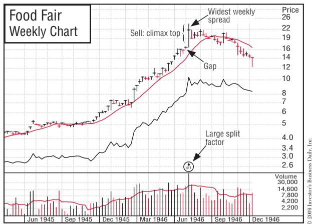
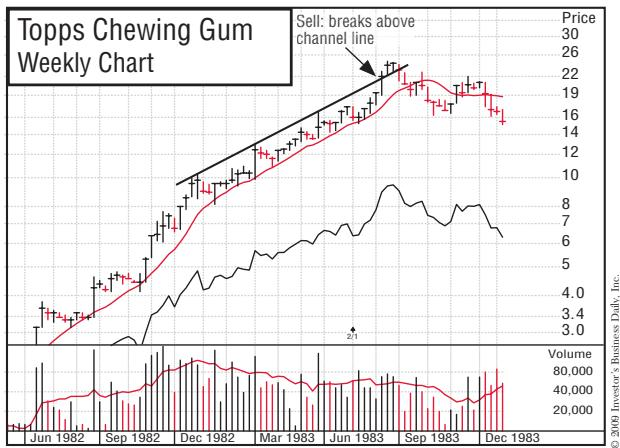
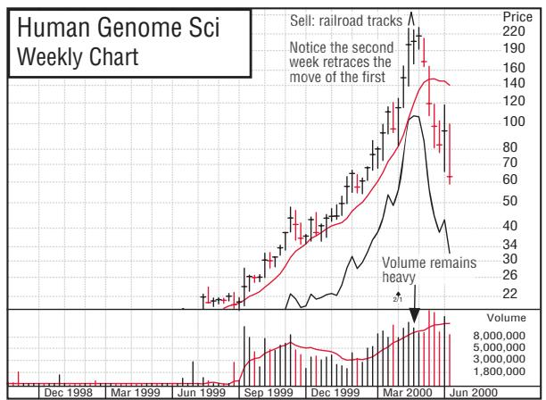
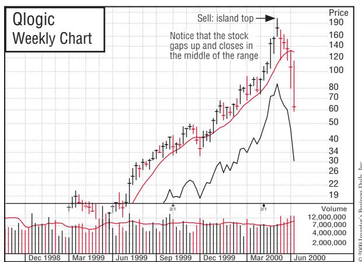
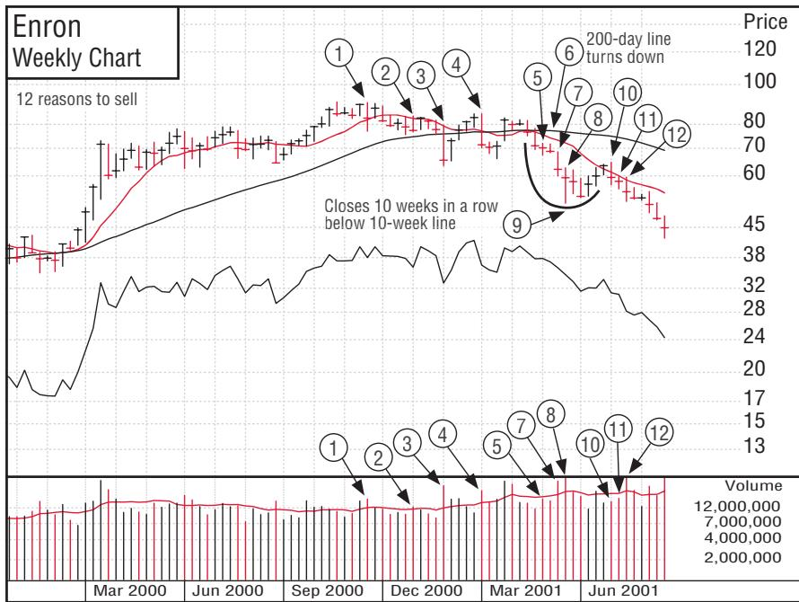
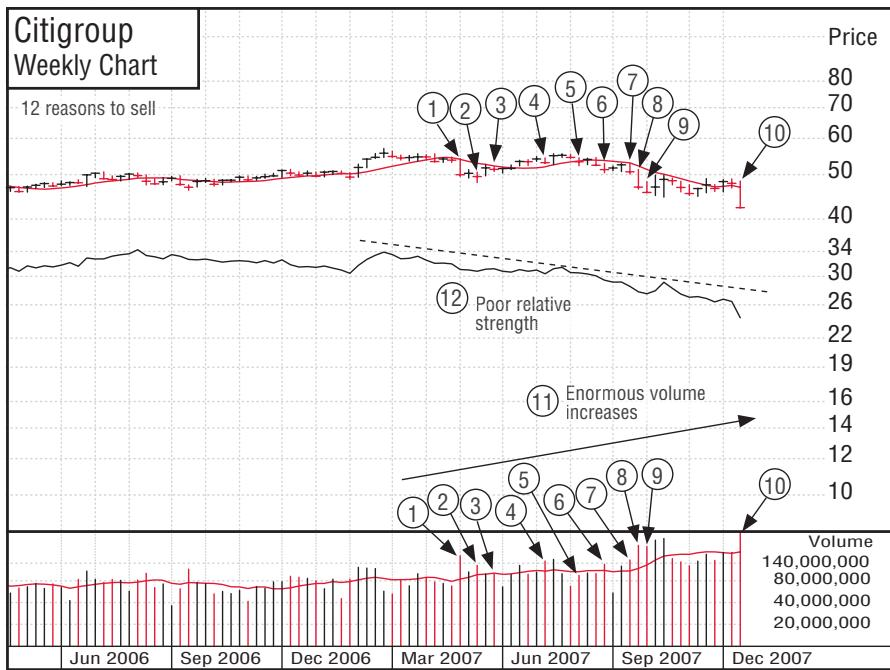
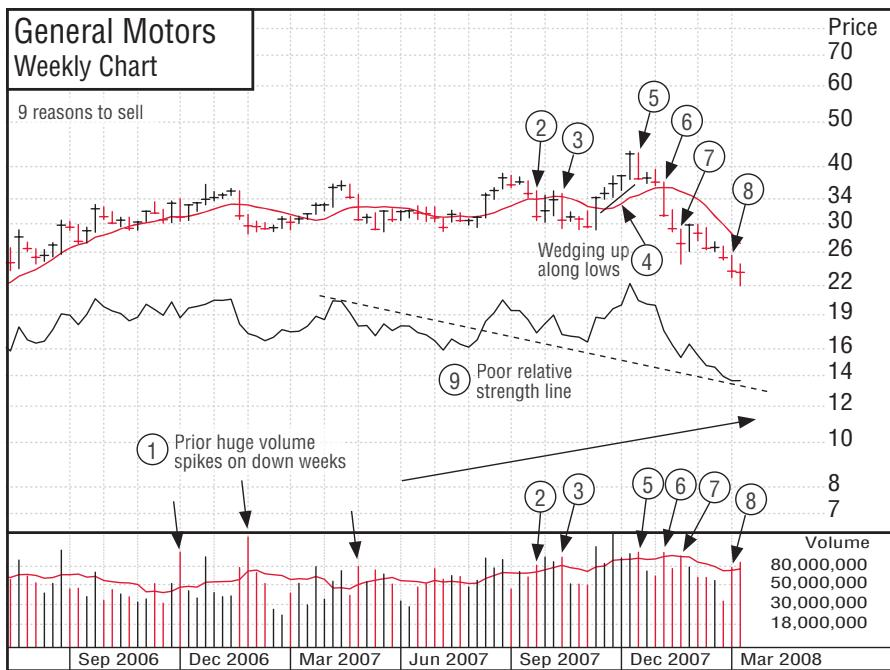
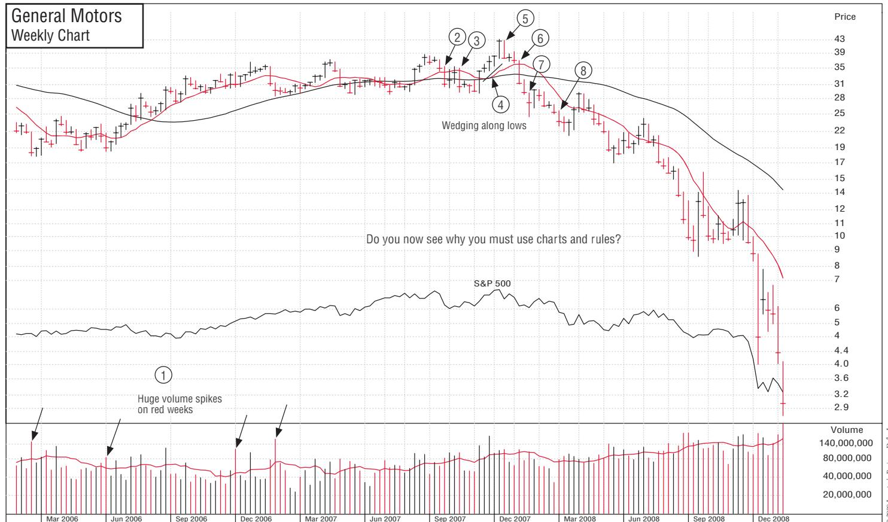

# — Part 2 第二部分 

> 本文件为《How to Make Money in Stocks》（《如何在股市中赚钱》）第二部分的中英对照译本。每一节先列**中文翻译**，后附**英文原文**，便于逐段对照阅读。

## Chapter10 When You Must Sell and Cut Every Loss . . . Without Exception

> **中文标题：** 何时必须卖出，并无一例外地止损

**中文翻译（导语）**

既然你已经学会如何只买最优秀的股票、以及该在何时买入，接下来就该学习如何卖出它们——以及在何时卖出。你多半听过那句体育界的俗话："最好的进攻就是坚固的防守。"俗话的有趣之处，就在于它们往往是对的：一支只攻不守的球队很少能赢下比赛；事实上，坚固的防守常常能把一支球队推上巅峰。

在布鲁克林道奇队的鼎盛时期，球队主席兼总经理布兰奇·里基麾下通常拥有出色的投手群。在棒球比赛中，投球与防守共同构成了球队的防守端，大约占整场比赛的七成。缺了它们，几乎不可能取胜。

股市也是同样的道理。除非你有坚固的防守来抵御重大亏损，否则在投资这场博弈中，你绝无可能大获全胜。

**英文原文（导语）**

Now that you’ve learned how and when to buy nothing but the best stocks, it’s time for you to learn how and when to sell them. You’ve probably heard the sports cliché: “The best offense is a strong defense.” The funny thing about clichés is they are usually true: a team that’s all offense and no defense seldom wins the game. In fact, a strong defense can often propel a team to great heights.

During their heyday, when Branch Rickey was president and general manager, the Brooklyn Dodgers typically had good pitching. In the game of baseball, the combination of pitching and fielding represents the defensive side of a team and probably 70% of the game. It’s almost impossible to win without them.

The same holds true in the stock market. Unless you have a strong defense to protect yourself against large losses, you absolutely can’t win big in the game of investing.

### Bernard Baruch’s Secret Market Method of Making Millions

华尔街著名操盘手、多位美国总统信赖的顾问伯纳德·巴鲁克，把这一点说得最透彻："投机者若能有一半的时候判断正确，成绩已属上乘。即便十次里只对三四次，只要他懂得在做错的交易上迅速止损，也能挣得一大笔财富。"

由此可见，哪怕最成功的投资者也会犯下许多错误。这些糟糕的决策会带来亏损；倘若你缺乏纪律与审慎，其中一些亏损会变得相当惨重。无论你多么聪明、智商多高、学历多深、消息多灵、分析多缜密，你都不可能永远正确。事实上，你正确的次数很可能还不到一半！你必须彻底明白并接受：对于想要大获成功的个人投资者，第一条铁律就是——永远截断并限制每一笔亏损。而做到这一点，需要永无止境的纪律与勇气。

《在华尔街取胜》一书的作者马克·曼德尔自 1987 年起便订阅《投资者商业日报》。他喜爱这份报纸，因为它提供了大量赚钱的思路，并格外强调风险管理策略。在他看来，"小亏大赚，正是投资的圣杯"。

巴鲁克关于止损的观点，在我 1962 年管理的一个账户上得到了印证。当时大盘暴跌 29%，而在这个账户里，我们每三笔建仓只有一笔判断正确；可到了年底，账户依然盈利。原因在于：那 33% 判断正确的交易，其平均盈利是我们判断失误时小额亏损平均值的两倍多。

我习惯在"止盈"与"止损"之间维持 3:1 的比例：若能取得 20% 到 25% 的收益，就在亏损 7% 或 8% 时止损。但如果你身处 2008 年那样的熊市、还是买了股票，也许只能赚到寥寥几次 10% 或 15% 的涨幅，那么我会果断行动，在亏损 3% 时无一例外地自动止损。

Bernard Baruch, a famous market operator on Wall Street and a trusted advisor to U.S. presidents, said it best: “If a speculator is correct half of the time, he is hitting a good average. Even being right 3 or 4 times out of 10 should yield a person a fortune if he has the sense to cut his losses quickly on the ventures where he has been wrong.”

As you can see, even the most successful investors make many mistakes. These poor decisions will lead to losses, some of which can become quite awful if you’re not disciplined and careful. No matter how smart you are, how high your IQ, how advanced your education, how good your information, or how sound your analysis, you’re simply not going to be right all the time. In fact, you’ll probably be right less than half the time! You positively must understand and accept that the first rule for the highly successful individual investor is . . . always cut short and limit every single loss. To do this takes never-ending discipline and courage.

Marc Mandell of Winning on Wall Street has been reading Investor’s Business Daily since 1987. He likes it for its many moneymaking ideas and its emphasis on risk-management strategies. “Lose small and win big,” he believes, “is the holy grail of investing.”

Baruch’s point about cutting losses was driven home to me by an account that I managed back in 1962. The general market had taken a 29% nosedive, and we were right on only one of every three commitments we had made in this account. Yet at the end of the year, the account was ahead. The reason was that the average profit on the 33% of decisions that were correct was more than twice the average of the small losses we took when we were off-target.

I like to follow a 3-to-1 ratio between where to sell and take profits and where to cut losses. If you take some 20% to 25% gains, cut your losses at 7% or 8%. If you’re in a bear market like 2008 and you buy any stocks at all, you might get only a few 10% or 15% gains, so I’d move quickly to cut every single loss automatically at 3%, with no exceptions.

### The whole secret to winning big in the stock market is not to be right all the time, but to lose the least amount possible when you’re wrong.

你必须在自己可能犯错时及时察觉，并毫不犹豫地卖出，截断每一笔亏损。你的职责是与市场保持同步，而不是强求市场来迁就你。

那么，怎么判断自己可能错了？很简单：股价跌破了你的买入价！你这心爱的"杰作"每跌破成本一分，你判断错误的概率、以及你为错误所要付出的代价，就同时增加一分。

You’ve got to recognize when you may be wrong and sell without hesitation to cut short every one of your losses. It’s your job to get in phase with the market and not try to get the market to be in phase with you.

How can you tell when you may be wrong? That’s easy: the price of the stock drops below the price you paid for it! Each point that your favorite brainchild falls below your cost increases both the chance that you’re wrong and the price that you’re going to pay for being wrong.

### Are Successful People Lucky or Always Right?

很多人以为，要想成功，要么得靠运气，要么得在多数时候都判断正确。事实并非如此。成功者也会犯下许多错误，他们的成功源于勤奋而非运气——他们只是比普通人更努力、出手更频繁。一夜成名者寥寥无几，成功需要时间。

为了给电灯寻找灯丝，托马斯·爱迪生把 6000 种竹子样本逐一碳化、测试，其中只有三种可用；在那之前，他还试过从棉线到鸡毛的上千种材料。

贝比·鲁斯为创造本垒打纪录拼尽全力，也因此保持着职业生涯三振出局的纪录。欧文·柏林写了 600 多首歌，真正走红的却不超过 50 首。披头士在成名之前，被英国每一家唱片公司拒之门外。迈克尔·乔丹曾被高中篮球队淘汰，阿尔伯特·爱因斯坦的数学还考过 F（而他也花了多年才创立并证明相对论）。

在股票上赚取丰厚收益，需要大量的试错。1961 年翻倍的 Brunswick 与 Great Western Financial，1963 年的 Chrysler 与 Syntex，1965 年的 Fairchild Camera 与 Polaroid，1967 年的 Control Data，1970–1972 年的 Levitz Furniture，1977–1981 年的 Prime Computer 与 Humana，1981–1982 年的 MCI Communications，1982–1983 年的 Price Company，1986–1992 年的 Microsoft，1990–1991 年的 Amgen，1991–1993 年的 International Game Technology，1995 到 2000 年的 Cisco Systems，1998–1999 年的 America Online 与 Charles Schwab，乃至 1999 年的 Qualcomm——这些股票都以 100% 到逾 1000% 的涨幅惊艳了市场。

多年来我发现，自己买入的十只股票里，只有一两只真正出类拔萃，能够带来如此丰厚的利润。换句话说，要想抓住那一两只赚大钱的股票，你必须去寻找、并买下十只。

这便引出一个问题：剩下那八只怎么办？是像大多数人那样抱着它们苦苦期盼，还是果断卖出、继续尝试，直到觅得更大的成功？

People think that in order to be successful, you have to be either lucky or right most of the time. Not so. Successful people make many mistakes, and their success is due to hard work, not luck. They just try harder and more often than the average person. There aren’t many overnight successes; success takes time.

In search of a filament for his electric lamp, Thomas Edison carbonized and tested 6,000 specimens of bamboo. Three of them worked. Before that, he had tried thousands of other materials, from cotton thread to chicken feathers.

Babe Ruth worked so hard for his home run record that he also held the lifetime record for strikeouts. Irving Berlin wrote more than 600 songs, but no more than 50 were hits. The Beatles were turned down by every record company in England before they made it big. Michael Jordan was once cut from his high school basketball team, and Albert Einstein made an F in math. (It also took him many years to develop and prove his theory of relativity.)

It takes a lot of trial and error before you can nail down substantial gains in stocks like Brunswick and Great Western Financial when they doubled in 1961, Chrysler and Syntex in 1963, Fairchild Camera and Polaroid in 1965, Control Data in 1967, Levitz Furniture in 1970–1972, Prime Computer and Humana in 1977–1981, MCI Communications in 1981–1982, Price Company in 1982–1983, Microsoft in 1986–1992, Amgen in 1990–1991, International Game Technology in 1991–1993, Cisco Systems from 1995 to 2000, America Online and Charles Schwab in 1998–1999, and Qualcomm in 1999. These stocks dazzled the market with gains ranging from 100% to more than 1,000%.

Over the years, I’ve found that only one or two out of ten stocks that I’ve bought turned out to be truly outstanding and capable of making this kind of substantial profits. In other words, to get the one or two stocks that make big money, you have to look for and buy ten.

Which begs the question, what do you do with the other eight? Do you sit with them and hope, the way most people do? Or do you sell them and keep trying until you come up with even bigger successes?

### When Does a Loss Become a Loss?

当你说"我不能卖，因为我不想认亏"时，你其实是在假设自己的意愿能左右局面。但股票根本不知道你是谁，更不会在乎你的期盼或愿望。

况且，卖出并不会制造亏损——亏损早已存在。若你以为不卖出就还没有亏损，那不过是自欺欺人。账面亏损越大，它就越是真实。假设你以每股 40 美元买入 100 股"包赚化工"，如今每股只值 28 美元，那么你手上是一批价值 2800 美元、却花了你 4000 美元的股票，亏损 1200 美元。无论你把股票变现还是继续持有，它都只值 2800 美元。

即便你没有卖出，股价下跌的那一刻，你就已经承担了这笔亏损。更好的做法是卖出、回到现金状态，这样你才能从容得多地客观思考。

死抱着一笔巨额亏损时，你几乎无法清醒思考，情绪会占上风，于是你自我安慰："它不可能再跌了。"可别忘了，还有其他许多股票可供选择，在那里扳回损失的机会或许更大。

这里再给你一个判断是否该卖出的方法：设想自己并不持有这只股票，而银行里有 2800 美元现金，然后问自己："我现在真的想买这只股票吗？"如果答案是"不"，那你又何必继续持有它？

When you say, “I can’t sell my stock because I don’t want to take a loss,” you assume that what you want has some bearing on the situation. But the stock doesn’t know who you are, and it couldn’t care less what you hope or want.

Besides, selling doesn’t give you the loss; you already have the loss. If you think you haven’t incurred a loss until you sell the stock, you’re kidding yourself. The larger the paper loss, the more real it will become. If you paid \$40 per share for 100 shares of Can’t Miss Chemical, and it’s now worth \$28 per share, you have \$2,800 worth of stock that cost you \$4,000. You have a \$1,200 loss. Whether you convert the stock to cash or hold it, it’s still worth only \$2,800.

Even though you didn’t sell, you took your loss when the stock dropped in price. You’d be better off selling and going back to a cash position where you can think far more objectively.

When you’re holding on to a big loss, you’re rarely able to think straight. You get emotional. You rationalize and say, “It can’t go any lower.” However, keep in mind that there are many other stocks to choose from where your chance of recouping your loss could be greater.

Here’s another suggestion that may help you decide whether to sell: pretend that you don’t own the stock and you have \$2,800 in the bank. Then ask yourself, “Do I really want to buy this stock now?” If your answer is no, then why are you holding onto it?

### Always, without Exception, Limit Losses to 7% or 8% of Your Cost

个人投资者务必立下铁规：把投入每只股票的初始资本的最大亏损，硬性限制在 7% 或 8% 以内。机构投资者靠大举建仓、广泛分散来降低整体风险，却无法足够迅捷地进出个股，因此无法照搬这样的止损方案。而这正是你——机敏果断的个人投资者——相对机构的一大优势。好好利用它吧。

已故的 E. F. Hutton 公司的杰拉尔德·M·洛布在撰写他最后一本股市著作时，曾专程下来看望我，我有幸与他探讨了这一想法。在他的第一部作品《投资生存之战》中，洛布主张在亏损 10% 时悉数止损。我好奇地问他：他自己是否始终恪守这条 10% 的法则？"但愿，"他答道，"我早在它们跌到 10% 之前就已离场。"洛布在股市中赚得数百万美元。

佐治亚州亚特兰大 Astrop Advisory Corp. 的总裁比尔·阿斯特罗普，对这条 10% 止损方案提出了一处小修正。他认为，个股从成本价下跌 5% 时，个人投资者应卖掉一半仓位；再跌到 10% 时，卖掉另一半。这是中肯的建议。

为了守护你辛苦挣来的钱，我认为 7% 或 8% 应是在亏损上的上限。若你纪律严明、反应敏捷，你所有亏损的平均值还应该更低，或许只有 5% 或 6%。能把全部错误与亏损的平均值压在 5% 或 6%，你就像一支让对手永远无法推进的橄榄球队。如果你不让对手拿到多少次首攻机会，别人又怎么可能击败你？

这里有个值钱的秘诀：若你借助图表，在扎实的底部（价格整理区）精准择时买入，你的股票就极少会从正确的买点下跌 8%。因此，一旦真跌了 8%，要么是你的选股出了错，要么是大盘可能正开始下跌。这正是你未来成功的一大关键。

芭芭拉·詹姆斯是 IBD 的订户，参加过我们多次研讨会。她在房地产行业干了 20 年后才转做投资，当时对股票一无所知。她先按 IBD 的规则做纸上交易，效果极佳，最终才有信心投入真金白银。那是在 1990 年代末，市场似乎只有一个方向——向上。她按 IBD 规则买入的第一只股票是 EMC，2000 年卖出时获利 1300%；在 Gap 上也赚了超过 200%。入市十年后，她靠用 IBD 赚来的利润还清了房贷和车贷。

也正因这条 7% 法则，芭芭拉才能在行情转好后再度出手。2007 年秋天大盘开始回调之前，她买入过三只 CAN SLIM 股票——Monolithic Power、China Medical 和 St. Jude Medical。"我都是在精准的枢轴点买入的，7、8 月大盘开始回调时，三只全被强制卖出，"她说，"只亏 7% 或 8%，我心甘情愿。要是没有这些卖出规则，我早就输得倾家荡产，也不会有资金去迎接下一轮牛市。"

另一位 IBD 订户赫布·米切尔在 2009 年 2 月这样告诉我们："买入与卖出规则——尤其是卖出规则——一次又一次被证明有效。我花了几年才真正想通，此后成绩便开始显现。2008 年我大部分时间都在场外观望；如今朋友们都羡慕我：他们在 IRA 账户里亏了成千上万甚至 50% 以上，而我全年仍赚了 5%。我觉得自己本可以做得更好，但吃一堑长一智。"

此外，也没有哪条规则要求你必须等每一笔亏损都达到 7% 到 8% 才肯出手。有时你会察觉大盘指数正在派发（抛售），或你的股票走势不对、开局不利。这种情况下，你完全可以更早止损，哪怕股票只跌了一两个点。

例如，1987 年 10 月大盘全面崩盘之前，其实有充裕的时间卖出、尽早止损——那轮回调其实始于 8 月 26 日。如果你蠢到想在熊市条件下逆势买股，那至少要把绝对止损线上提到 3% 或 4%。

在这套技巧上历练多年后，随着你选股与择时能力的提升，以及学会在表现最好的股票上做小额"跟进买入"，你的平均亏损会越来越小。要在股票上涨时安全地跟进加仓，需要大量时间练习，但这种资金管理方法会迫使你把资金从表现落后的股票转移到更强势的股票上——我称之为"强制加仓"。（详见第 11 章"我修订的损益计划"。）最终你会卖出那些尚未下跌 7% 或 8% 的股票，只为在强势牛市中腾出资金，加码你最好的赢家。

请记住：7% 到 8% 是你绝对的亏损上限。你必须毫不犹豫地卖出——不要等几天看看会怎样，不要指望股票反弹回来，也无需等到当天收盘。此时此刻，唯一与你处境相关的，就是你已比成本低了 7% 或 8% 这一事实。

一旦你已大幅领先、握有可观利润，就可以容许股价从峰值有更大一些的正常波动空间。不要仅因一只股票从峰值回落 7% 或 8% 就把它卖掉。务必弄懂这两种情形的区别，这一点非常重要。

一种情形是，你很可能一开始就错了：股票没有如你预期那般表现，跌破了你的买入价，你开始亏掉辛苦钱，而且可能还要亏更多。另一种情形是，你开头是对的：股票表现更好，你已拥有可观盈利。此时你是在打理利润，因此在牛市中，你可以给股票更大的波动空间，以免被一次正常的 10% 到 15% 回调震仓出局。

不过，买入时不要追得太高。关键在于精准地在突破点买入，把股票下跌 8% 的概率降到最低。（关于如何用图表选股，详见第 2 章。）

Individual investors should definitely set firm rules limiting the loss on the initial capital they have invested in each stock to an absolute maximum of 7% or 8%. Institutional investors who lessen their overall risk by taking large positions and diversifying broadly are unable to move into and out of stocks quickly enough to follow such a loss-cutting plan. This is a terrific advantage that you, the nimble and decisive individual investor, have over the institutions. So use it.

When the late Gerald M. Loeb of E. F. Hutton was writing his last book on the stock market, he came down to visit me, and I had the pleasure of discussing this idea with him. In his first work, The Battle for Investment Survival, Loeb advocated cutting all losses at 10%. I was curious and asked him if he always followed the 10% loss policy himself. “I would hope,” he replied, “to be out long before they ever reach 10%.” Loeb made millions in the market.

Bill Astrop, president of Astrop Advisory Corp. in Atlanta, Georgia, suggests a minor revision of the 10% loss-cutting plan. He thinks that individual investors should sell half of their position in a stock if it is down 5% from their cost and the other half once it’s down 10%. This is sound advice.

To preserve your hard-earned money, I think a 7% or 8% loss should be the limit. The average of all your losses should be less, perhaps 5% or 6%, if you’re strictly disciplined and fast on your feet. If you can keep the average of all your mistakes and losses to 5% or 6%, you’ll be like the football team on which opponents can never move the ball. If you don’t give up many first downs, how can anyone ever beat you?

Now here’s a valuable secret: if you use charts to time your buys precisely off sound bases (price consolidation areas), your stocks will rarely drop 8% from a correct buy point. So when they do, either you’ve made a mistake in your selection or a general market decline may be starting. This is a big key to your future success.

Barbara James, an IBD subscriber who has attended several of our workshops, didn’t know anything about stocks when she started investing after 20 years in the real estate business. She first traded on paper using the IBD rules. This worked so well that she finally had the confidence to try it with real money. That was in the late 1990s, when the market seemed to have only one direction—up. The first stock she bought using the IBD rules was EMC. When she sold it in 2000, she had a 1,300% gain. She also had a gain of over 200% in Gap. Ten years after her start, with the profits she made using IBD, she was able to pay off her house and her car.

And thanks to the 7% rule, Barbara can take advantage of the market once it improves. Before the market started to correct in the fall of 2007, she had bought three CAN SLIM stocks—Monolithic Power, China Medical, and St. Jude Medical. “I bought them all at exactly the right pivot point, and I got forced out of all three as the market started to correct in July and August,” she says. “I am happy to lose money when it’s only 7% or 8%. If it hadn’t been for the sell rules, I would have lost my shirt. And I wouldn’t have resources for the next bull market.”

Here’s what another IBD subscriber, Herb Mitchell, told us in February 2009: “Over and over again, the buy and sell rules—especially the sell rules—have been proven to work. It took me a couple of years to finally get it through my head, but then the results started to show. I spent most of 2008 on the sidelines, and I now get compliments from friends who say that they lost thousands—50% or more—in their IRA accounts while I had a 5% gain for the year. I think I should have done better, but you live and learn.”

Also, there’s no rule that says you have to wait until every single loss reaches 7% to 8% before you take it. On occasion, you’ll sense the general market index is under distribution (selling) or your stock isn’t acting right and you are starting off amiss. In such cases, you can cut your loss sooner, when the stock may be down only one or two points.

Before the market broke wide open in October 1987, for example, there was ample time to sell and cut losses short. That correction actually began on August 26. If you’re foolish enough to try bucking the market by buying stocks in bearish conditions, at least move your absolute loss-cutting point up to 3% or 4%.

After years of experience with this technique, your average losses should become less as your stock selection and timing improve and you learn to make small “follow-up buys” in your best stocks. It takes a lot of time to learn to make follow-up buys safely when a stock is up, but this method of money management forces you to move your money from slower-performing stocks into your stronger ones. I call this force-feeding. (See “My Revised Profit-and-Loss Plan” in Chapter 11.) You’ll end up selling stocks that are not yet down 7% or 8% because you are raising money to add to your best winners during clearly strong bull markets.

Remember: 7% to 8% is your absolute loss limit. You must sell without hesitation—no waiting a few days to see what might happen; no hoping that the stock will rally back; no need to wait for the day’s market close. Nothing but the fact that you’re down 7% or 8% below your cost should have a bearing on the situation at this point.

Once you’re significantly ahead and have a good profit, you can afford to give the stock a good bit more room for normal fluctuations off its price peak. Do not sell a stock just because it’s off 7% to 8% from its peak price. It’s important that you definitely understand the difference.

In one case, you probably started off wrong. The stock is not acting the way you expected it to, and it is down below your purchase price. You’re starting to lose your hard-earned money, and you may be about to lose a lot more. In the other case, you have begun correctly. The stock has acted better, and you have a significant gain. Now you’re working on a profit, so in a bull market, you can afford to give the stock more room to fluctuate so that you don’t get shaken out on a normal 10% to 15% correction.

Don’t chase your stock up too far when you’re buying it, however. The key is timing your stock purchases exactly at breakout points to minimize the chance that a stock will drop 8%. (See Chapter 2 for more on using charts to select stocks.)

### All Common Stocks Are Speculative and Risky

所有普通股都蕴含不小的风险，无论它叫什么名字、质地如何、挂着怎样"蓝筹"的名头、过往业绩怎样辉煌、当前盈利多么亮眼。请记住：成长股也可能在其盈利极佳、分析师预期依旧乐观之时见顶。

世上没有稳赚不赔的买卖，也没有绝对安全的股票。任何股票都可能随时下跌……而且你永远不知道它会跌多深。

每一笔 50% 的亏损，都始于一次 10% 或 20% 的亏损。有勇气欣然卖出、坦然认亏，是你抵御更大亏损风险的唯一方式。决策与行动应当即时同步。想成为大赢家，你就必须学会做决定。我至少认识十几个受过良好教育、智商不低的人，他们之所以彻底出局，仅仅是因为不肯卖出、不肯止损。

如果一只股票失控、亏损扩大到 10% 以上，你该怎么办？这种事谁都可能碰上，而它更是一个关键信号：这只股票必须坚决卖出。它遇到的麻烦远超寻常，所以跌得比寻常更快、更深。2000 年市场崩盘时，许多新投资者损失惨重，有些人血本无归。他们哪怕只是遵循前文那条简单的卖出规则，也能保住大部分本金。

依我的经验，那些失控、造成超常亏损的股票，恰恰是必须断然抛掉的劣质之选。要么股票本身、要么整个市场真的出了大问题，此时更要紧急卖出，以免日后酿成灾难。

请记住：如果你放任一只股票下跌 50%，下一只股票就必须赚 100% 才能回本！可你多久才能买到一只翻倍的股票？你根本承受不起死抱着一只亏损不断恶化的股票。

"股票跌了终究会涨回来"是一个危险的谬论。许多股票并不会；另一些则要花上好几年才恢复。AT&T 在 1964 年冲到 75 美元的高点，花了 20 年才回到原位。而当标普 500 或道指在熊市中下跌 20% 到 25% 时，许多个股会暴跌 60% 到 75%。

倘若标普像 2008 年那样暴跌 52%，有些股票可能跌掉 80% 到 90%。谁能料到通用汽车会从 94 美元跌到每股 2 美元？汽车工业对美国固然重要，可要想在高度竞争的世界市场中生存并有效竞争，它就需要一场自上而下的彻底重组，甚至可能不得不走破产程序。从 1994 到 2008 年的 14 年间，通用汽车的相对价格强度线一路下滑。试想，若印度或中国在美国销售每加仑能跑 50 英里、价格却低得多的汽车，通用汽车又该何去何从？

防止股市惨重亏损的唯一办法，就是在亏损尚小时毫不犹豫地砍掉它。永远守护好你的账户，这样你才能活到明天，再次成功投资。

2000 年，许多新投资者错误地以为，只要在每一次高科技股回调时买入就行——它们总会涨回来，钱来得轻而易举。这是业余玩家的打法，几乎总是导致惨重亏损。半导体等科技股的风险与波动是其他股票的两三倍；因此，若你持有这类股票，迅速砍掉每一笔亏损就更为关键。如果你的投资组合清一色是高科技股，或你重仓融资买入科技股却不及时止损，那就是在自找大麻烦。

除非你愿意迅速砍掉所有亏损，否则绝不要用融资买入，否则你可能转瞬之间血本无归。如果券商发来追加保证金通知（要求你或卖出股票、或追加资金，以弥补亏损股票的净值缺口），切勿拿好钱去填坏窟窿。卖出一些股票，并认清市场和你的保证金经办人想告诉你什么。

There is considerable risk in all common stocks, regardless of their name, quality, purported blue-chip status, previous performance record, or current good earnings. Keep in mind that growth stocks can top at a time when their earnings are excellent and analysts’ estimates are still rosy.

There are no sure things or safe stocks. Any stock can go down at any time . . . and you never know how far it can go down.

Every 50% loss began as a 10% or 20% loss. Having the raw courage to sell and take your loss cheerfully is the only way you can protect yourself against the possibility of much greater losses. Decision and action should be instantaneous and simultaneous. To be a big winner, you have to learn to make decisions. I’ve known at least a dozen educated and otherwise intelligent people who were completely wiped out solely because they would not sell and cut a loss.

What should you do if a stock gets away from you and the loss becomes greater than 10%? This can happen to anyone, and it’s an even more critical sign that the stock positively must be sold. The stock was in more trouble than normal, so it fell faster and further than normal. In the market collapse of 2000, many new investors lost heavily, and some of them lost it all. If they had just followed the simple sell rule discussed earlier, they would have protected most of their capital.

In my experience, the stocks that get away from you and produce largerthan-normal losses are the truly awful selections that absolutely must be sold. Something is really going wrong with either the stock or the whole market, and it’s even more urgent that the stock be sold to avoid a later catastrophe.

Keep in mind that if you let a stock drop 50%, you must make 100% on your next stock just to break even! And how often do you buy stocks that double? You simply can’t afford to sit with a stock where the loss keeps getting worse.

It is a dangerous fallacy to assume that because a stock goes down, it has to come back up. Many don’t. Others take years to recover. AT&T hit a high of \$75 in 1964 and took 20 years to come back. Also, when the S&P 500 or Dow declines 20% to 25% in a bear market, many stocks will plummet 60% to 75%.

If the S&P dives 52%, as it did in 2008, some stocks can fall 80% to 90%. Who would have projected that General Motors would sell for \$2 a share, down from \$94? The auto industry is important to the United States, but it will require a serious, top-to-bottom restructuring and will possibly have to go through bankruptcy if it is to survive and compete effectively in the highly competitive world market. For 14 years, from 1994 to 2008, GM stock’s relative price strength line declined steadily. What will GM do in the future if India or China sells cars in the United States that get 50 miles per gallon and have a much lower price?

The only way to prevent bad stock market losses is to cut them without hesitation while they’re still small. Always protect your account so that you can live to invest successfully another day.

In 2000, many new investors incorrectly believed that all you had to do was buy high-tech stocks on every dip in price because they would always go back up and there was easy money to be made. This is an amateur’s strategy, and it almost always leads to heavy losses. Semiconductor and other technology stocks are two to three times as volatile and risky as others. So if you’re in these stocks, moving rapidly to cut short every loss is even more essential. If your portfolio is in nothing but high-tech stocks, or if you’re heavily margined in tech stocks, you are asking for serious trouble if you don’t cut your losses quickly.

You should never invest on margin unless you’re willing to cut all your losses quickly. Otherwise, you could go belly-up in no time. If you get a margin call from your broker (when you’re faced with the decision to either sell stock or add money to your account to cover the lost equity in a falling stock), don’t throw good money after bad. Sell some stock, and recognize what the market and your margin clerk are trying to tell you.

### Cutting Losses Is Like Buying an Insurance Policy

这种给亏损设限的做法，就像缴付保险费：你把自己的风险精确地压到可接受的水平。没错，你卖出的股票常常立刻掉头上涨；没错，这会让人懊恼。可当这种情况发生时，切莫认为卖出是个错误——那种想法极其危险，早晚会让你陷入大麻烦。

不妨换个角度想：假如你去年给车买了保险，而一年平安无事，这笔钱就算白花了吗？今年你还会买同样的保险吗？当然会！你给房子或企业买过火险吗？如果房子、企业并未失火，你会因为觉得自己做了笔糟糕的财务决定而恼火吗？不会。你买火险，并不是因为你断定房子一定会烧毁；你买保险只是为了以防万一，抵御那种虽小却严重的损失风险。

对迅速砍掉每一笔亏损的赢家而言，道理完全相同。这是抵御可能发生、乃至极可能发生的重大亏损（一旦发生或许再难翻身）的唯一办法。

若你犹豫不决，任由亏损扩大到 20%，你需要 25% 的涨幅才能打平；再等下去、跌到 25%，你就得赚 33% 才能持平；继续等、亏损达到 33%，你得赚 50% 才回得到起点。你等得越久，数学就越对你不利。所以别摇摆不定，立刻动手斩断可能的错误决策，养成严格的纪律去行动、并始终遵守你的卖出规则。

有些人甚至让亏损的股票毁了健康。真到这一步，最好卖掉、别再操心。我认识一位股票经纪人，1961 年股价下跌途中以 60 美元买入 Brunswick——这只股票自 1957 年便是市场的超级龙头，涨幅超过 20 倍。跌到 50 美元，他加仓；跌到 40 美元，他又加。

等它跌到 30 美元时，他倒在了高尔夫球场上，猝然离世。

历史与人性在股市中不断重演。2000 年秋天，许多投资者犯了完全相同的错误：在前一轮牛市龙头 Cisco Systems 从 87 美元见顶回落之后，他们在下跌途中以 70、60、50 美元乃至更低的价格买入。七个月后，它跌到 13 美元——对在 70 美元买入的人而言，是 80% 的跌幅。这个故事的教训是：永远不要与市场争辩。你的健康和内心的平静，永远比任何股票都重要。

小额亏损是廉价的保险，也是你为投资所能买到的唯一一种保险。即便你卖出后股票又涨了（很多确实会涨），你也已达成关键目标——让所有亏损保持在小额，而且你手上仍有资金，可以换一只股票再试一次、去赢得一个赢家。

This policy of limiting losses is similar to paying insurance premiums. You’re reducing your risk to precisely the level you’re comfortable with. Yes, the stock you sell will often turn right around and go back up. And yes, this can be frustrating. But when this happens, don’t conclude that you were wrong to sell it. That is exceedingly dangerous thinking that will eventually get you into big trouble.

Think about it this way: If you bought insurance on your car last year and you didn’t have an accident, was your money wasted? Will you buy the same insurance this year? Of course you will! Did you take out fire insurance on your home or your business? If your home or business hasn’t burned down, are you upset because you feel that you made a bad financial decision? No. You don’t buy fire insurance because you know your house is going to burn down. You buy insurance just in case, to protect yourself against the remote possibility of a serious loss.

It’s exactly the same for the winning investor who cuts all losses quickly. It’s the only way to protect against the possible or probable chance of a much larger loss from which it may not be possible to recover.

If you hesitate and allow a loss to increase to 20%, you will need a 25% gain just to break even. Wait longer until the stock is down 25%, and you’ll have to make 33% to get even. Wait still longer until the loss is 33%, and you’ll have to make 50% to get back to the starting gate. The longer you wait, the more the math works against you, so don’t vacillate. Move immediately to cut out possible bad decisions. Develop the strict discipline to act and to always follow your selling rules.

Some people have gone so far as to let losing stocks damage their health. In this situation, it’s best to sell and stop worrying. I know a stockbroker who in 1961 bought Brunswick at \$60 on the way down in price. It had been the market’s super leader since 1957, increasing more than 20 times. When it dropped to \$50, he bought more, and when it dropped to \$40, he added again.

When it dropped to \$30, he dropped dead on the golf course.

History and human nature keep repeating themselves in the stock market. In the fall of 2000, many investors made the identical mistake: they bought the prior bull market’s leader, Cisco Systems, on the way down at \$70, \$60, \$50, and lower, after it had topped at \$87. Seven months later it had sunk to \$13, an 80% decline for those who bought at \$70. The moral of the story is: never argue with the market. Your health and peace of mind are always more important than any stock.

Small losses are cheap insurance, and they’re the only insurance you can buy on your investments. Even if a stock moves up after you sell it, as many surely will, you will have accomplished your critical objective of keeping all your losses small, and you’ll still have money to try again for a winner in another stock.

### Take Your Losses Quickly and Your Profits Slowly

投资界有句老话：市场上的第一笔亏损总是最小的。在我看来，做投资决策的方式就是——永远（毫无例外地）快速止损、缓慢止盈。然而大多数投资者都被情绪搅乱了：他们快速止盈、缓慢止损。

采用我们讨论的方法后，你买入任何股票的真实风险是多少？只要你虔诚地遵守规则，无论买什么，都是 8%。尽管如此，大多数投资者仍固执地追问："难道不该持有股票，而不是卖出认亏吗？"或者"遇到突发坏消息导致股价下跌这类特殊情况怎么办？"又或者"这套止损程序是永远适用，还是存在例外，比如公司出了好产品的时候？"答案是：没有例外。这些情况没有一样能改变局面。你必须永远守护好辛苦积攒的资本。

放任亏损扩大，是几乎所有投资者犯下的最严重错误。你必须接受这个事实：选股与择时上的错误会频频发生，即便是经验最老到的专业投资者也无法避免。我甚至要说，如果你不愿截断并限制亏损，那你大概根本就不该买股票。你会开着没刹车的车在街上跑吗？如果你是战斗机飞行员，会不带降落伞上战场吗？

There’s an old investment saying that the first loss in the market is the smallest. In my view, the way to make investment decisions is to always (with no exceptions) take your losses quickly and your profits slowly. Yet most investors get emotionally confused and take their profits quickly and their losses slowly.

What is your real risk in any stock you buy when you use the method we’ve discussed? It’s 8%, no matter what you buy, if you follow this rule religiously. Still, most investors stubbornly ask, “Shouldn’t we sit with stocks rather than selling and taking a loss?” Or, “How about unusual situations where some bad news hits suddenly and causes a price decline?” Or, “Does this loss-cutting procedure apply all the time, or are there exceptions, like when a company has a good new product?” The answer: there are no exceptions. None of these things changes the situation one bit. You must always protect your hard-earned pool of capital.

Letting your losses run is the most serious mistake that almost all investors make. You must accept the fact that mistakes in stock selection and timing are going to be made frequently, even by the most experienced of professional investors. I’d go so far as to say that if you aren’t willing to cut short and limit your losses, you probably shouldn’t buy stocks. Would you drive your car down the street without brakes? If you were a fighter pilot, would you go into battle without a parachute?

### Should You Average Down in Price?

股票经纪人最不专业的行为之一，就是在客户股票下跌时迟疑不决、甚至不去电沟通——那恰恰是客户最需要帮助的时刻。在艰难时期推卸这份责任，暴露出压力之下勇气的缺失。而比这更糟的，是经纪人为了撇清自己，反倒劝客户"向下摊平"（加买已经亏损的股票）。若有人这样劝我，我会立刻销户，另找一位更聪明的经纪人。

人人都爱买股票，却没人爱卖股票。只要还持有，你就仍可寄望它涨回来、至少让你保本离场；一旦卖出，你就放弃全部希望，被迫接受暂时失败的冷酷现实。投资者总是满怀期盼，却不肯正视现实。知道并行动，胜过期盼或猜测。你希望股票上涨好让你至少保本离场，这与市场的走势和残酷现实毫无关系。市场只服从供求法则。

一位伟大的交易者曾指出，市场中只有两种情绪：希望与恐惧。"唯一的问题是，"他补充道，"我们该恐惧时却在希望，该希望时却在恐惧。"这句话在 2009 年与 1909 年同样真切。

One of the most unprofessional things a stockbroker can do is hesitate or fail to call customers whose stocks are down in price. That’s when the customer needs help the most. Shirking this duty in difficult periods shows a lack of courage under pressure. About the only thing that’s worse is for brokers to take themselves off the hook by advising customers to “average down” (buy more of a stock that is already showing a loss). If I were advised to do this, I’d close my account and look for a smarter broker.

Everyone loves to buy stocks; no one loves to sell them. As long as you hold a stock, you can still hope it might come back up enough to at least get you out even. Once you sell, you abandon all hope and accept the cold reality of temporary defeat. Investors are always hoping rather than being realistic. Knowing and acting is better than hoping or guessing. The fact that you want a stock to go up so you can at least get out even has nothing to do with the action and brutal reality of the market. The market obeys only the law of supply and demand.

A great trader once noted there are only two emotions in the market: hope and fear. “The only problem,” he added, “is we hope when we should fear, and we fear when we should hope.” This is just as true in 2009 as it was in 1909.

### The Turkey Story

多年前，我听弗雷德·C·凯利讲过一个故事——他是《你为何赢或输》一书的作者，这个故事把普通投资者在决定卖出时的心理刻画得入木三分：

一个小男孩走在路上，遇见一位正设法捕捉野火鸡的老人。老人做了一个捕火鸡的陷阱：一个简陋的大箱子，顶部铰接一扇门；门用一根撑杆撑开，撑杆上系着一根细绳，一直延伸到百英尺开外、握在老人手里。一条撒着玉米粒的小径，把火鸡一步步引向箱子。

火鸡一旦进入箱子，就会发现里面玉米更丰盛。等足够多的火鸡逛进箱里，老人便猛地抽掉撑杆，让门落下关死。门一旦关上，他若不走到箱子跟前就再也打不开——而那会惊跑外面徘徊的火鸡。抽撑杆的最佳时机，就是在箱里聚集了你能合理指望的最大数量的火鸡之时。

有一天，箱里进了 12 只火鸡。随后一只溜了出去，只剩 11 只。"天哪，真该在 12 只都在的时候就拉绳子的，"老人说，"我再等一分钟，说不定那只还会回来。"就在他等第 12 只回来时，又有两只走了。"11 只我就该满足了，"捕猎人说，"只要再回来一只，我就拉绳子。"又走了三只，老人还在等。既然曾经有过 12 只，他就不甘心带少于 8 只回家。

他无法放弃"原先那些火鸡还会回来"的念头。等到陷阱里只剩下最后一只时，他说："我再等一会儿，等它走出去或再有火鸡进来，我就收手。"结果那最后一只孤零零的火鸡也去与同伴会合了，老人空手而归。

普通投资者的心理与此并无二致。他们盼着更多火鸡回到箱里，而本该恐惧的是：所有火鸡都可能走光，自己最后将一无所获。

Many years ago, I heard a story by Fred C. Kelly, the author of Why You Win or Lose, that illustrates perfectly how the conventional investor thinks when the time comes to make a selling decision:

A little boy was walking down the road when he came upon an old man trying to catch wild turkeys. The man had a turkey trap, a crude device consisting of a big box with the door hinged at the top. This door was kept open by a prop, to which was tied a piece of twine leading back a hundred feet or more to the operator. A thin trail of corn scattered along a path lured turkeys to the box.

Once they were inside, the turkeys found an even more plentiful supply of corn. When enough turkeys had wandered into the box, the old man would jerk away the prop and let the door fall shut. Having once shut the door, he couldn’t open it again without going up to the box, and this would scare away any turkeys that were lurking outside. The time to pull away the prop was when as many turkeys as one could reasonably expect were inside.

One day he had a dozen turkeys in his box. Then one sauntered out, leaving 11. “Gosh, I wish I had pulled the string when all 12 were there,” said the old man. “I’ll wait a minute and maybe the other one will go back.” While he waited for the twelfth turkey to return, two more walked out on him. “I should have been satisfied with 11,” the trapper said. “Just as soon as I get one more back, I’ll pull the string.” Three more walked out, and still the man waited. Having once had 12 turkeys, he disliked going home with less than 8.

He couldn’t give up the idea that some of the original turkeys would return. When finally there was only one turkey left in the trap, he said, “I’ll wait until he walks out or another goes in, and then I’ll quit.” The solitary turkey went to join the others, and the man returned empty-handed.

The psychology of normal investors is not much different. They hope more turkeys will return to the box when they should fear that all the turkeys could walk out and they’ll be left with nothing.

### How the Typical Investor Thinks

如果你是典型投资者，大概会记录自己的交易。当你考虑卖出时，多半会翻看记录、看看当初买入价是多少。有盈利，你可能就卖；有亏损，你则倾向于再等等。毕竟，你入市不是为了亏钱。然而你真正该做的，是先卖掉表现最差的那只股票。让花圃远离杂草。

比如，你或许决定卖出 Myriad Genetics，因为它有不错的利润；却继续保留通用电气，因为它离你的买入价还差得远。若你正是这样想的，那你就患上了"买入价偏见"——95% 的投资者都深受其害。

假设你两年前以 30 美元买入一只股票，如今值 34 美元。大多数投资者会因为有了利润而卖出。可是，你两年前付的价格，和这只股票如今值多少有何关系？又与你是否该继续持有或卖出它有何关系？关键在于这只股票相对于你已持有、或可能持有的其他股票的表现。

If you’re a typical investor, you probably keep records of your transactions. When you think about selling a stock, you probably look at your records to see what price you paid for it. If you have a profit, you may sell, but if you have a loss, you tend to wait. After all, you didn’t invest in the market to lose money. However, what you should be doing is selling your worst-performing stock first. Keep your flower patch free of weeds.

You may decide to sell your shares in Myriad Genetics, for example, because it shows a nice profit, but you’ll keep your General Electric because it still has a ways to go before it’s back to the price you paid for it. If this is the way you think, you’re suffering from the “price-paid bias” that afflicts 95% of all investors.

Suppose you bought a stock two years ago at \$30, and it’s now worth \$34. Most investors would sell it because they have a profit. But what does the price you paid two years ago have to do with what the stock is worth now? And what does it have to do with whether you should hold or sell the stock? The key is the relative performance of this stock versus others you either own or could potentially own.

### Analyzing Your Activities

为帮你避开买入价偏见（尤其是如果你偏长期投资），我建议你用另一种方法分析自己的成绩。在每个月底或季末，算出每只股票自上次做此类分析以来的涨跌幅。然后，按它们自上期评估以来的相对价格表现给持仓排序。假设卡特彼勒跌了 6%，ITT 涨了 10%，通用电气跌了 10%，那么清单从上到下就是：ITT、卡特彼勒、通用电气。到下一个月底或季末再做一次。几番审视之后，你就能轻易认出哪些股票表现不佳——它们会沉在清单底部，而表现最好的则高居顶部或接近顶部。

这个方法并非万无一失，但它确实会迫使你关注的重点从"我为股票花了多少钱"，转向"我的投资在市场中的相对表现"。它能帮你保持更清醒的视角。当然，出于税务原因，成本记录仍要保留；但在管理投资组合的长期过程中，你应当采用这种更贴近现实的方法。比每季度更频繁地做这件事，只有好处。摆脱买入价偏见，能带来实实在在的利润与回报。

每当你决定买入一种证券，也应当同时确定潜在利润与可能亏损，这才合乎逻辑。若潜在利润只有 20%、潜在亏损却高达 80%，你绝不会买，对吧？可如果你既不设法厘清这些因素、又不按深思熟虑的规则行事，买入时又怎能知道不是这种局面？你有写下并遵守的具体卖出规则吗，还是在盲目飞行？

我建议你写下预期卖出价（若有亏损，为买入价下方 8% 或更少），以及你所买每种证券预期能达到的利润空间。比如，若一只成长股的市盈率自其当初脱离底部形态、启动大涨以来已提升 100% 或更多，你或许可以考虑卖出。

把这些数字写下来，你就更容易看出股票何时触及了其中一个水平。

基于自己的成本做卖出决定，仅仅因为无法接受自己择股不慎、亏了钱，就死抱着下跌的股票，是糟糕的生意经。事实上，你这么做，恰恰与你经营自己企业时会做的决定背道而驰。

To help you avoid the price-paid bias, particularly if you are a longer-term investor, I suggest you use a different method of analyzing your results. At the end of each month or quarter, compute the percentage change in the price of each stock from the last date you did this type of analysis. Now list your investments in order of their relative price performance since your previous evaluation period. Let’s say Caterpillar is down 6%, ITT is up 10%, and General Electric is down 10%. Your list would start with ITT on top, then Caterpillar, then GE. At the end of the next month or quarter, do the same thing. After a few reviews, you will easily recognize the stocks that are not doing well. They’ll be at the bottom of the list; those that did best will be at or near the top.

This method isn’t foolproof, but it does force you to focus your attention not on what you paid for your stocks, but on the relative performance of your investments in the market. It will help you maintain a clearer perspective. Of course, you have to keep records of your costs for tax reasons, but you should use this more realistic method in the longer-term management of your portfolio. Doing this more often than once a quarter can only help you. Eliminating the price-paid bias can be profitable and rewarding.

Any time you make a commitment to a security, you should also determine the potential profit and possible loss. This is only logical. You wouldn’t buy a stock if there were a potential profit of 20% and a potential loss of 80%, would you? But if you don’t try to define these factors and operate by well-thought-out rules, how do you know this isn’t the situation when you make your stock purchase? Do you have specific selling rules you’ve written down and follow, or are you flying blind?

I suggest you write down the price at which you expect to sell if you have a loss (8% or less below your purchase price) along with the expected profit potential of all the securities you purchase. For instance, you might consider selling your growth stock when its P/E ratio increases 100% or more from the time the stock originally began its big move out of its initial base pattern.

If you write these numbers down, you’ll more easily see when the stock has reached one of these levels.

It’s bad business to base your sell decisions on your cost and hold stocks down in price simply because you can’t accept the fact you made an imprudent selection and lost money. In fact, you’re making the exact opposite decisions from those you would make if you were running your own business.

### The Red Dress Story

投资股市，与经营自己的生意其实并无区别。投资本身就是一门生意，就该按生意来经营。假设你开着一家小店，卖女装；你进了一批三个颜色的连衣裙：黄、绿、红。红裙子卖得很快，绿裙子卖掉一半，黄裙子一件也卖不动。

你会怎么办？会跑去对采购说："红裙子全卖光了。黄裙子似乎毫无需求，可我还是觉得它们不错。再说了，黄色是我最喜欢的颜色，那不管怎样，咱们再多进点黄的"？

当然不会！

在零售这一行立足的精明商家，会客观地看待这个困境，说："我们肯定是犯了错。最好把黄裙子处理掉。搞个促销吧：先降价 10%，这个价还卖不动，再降 20%。把钱从那些没人要的'老掉牙'里抽出来，投到更抢手、有需求的红裙子上。"这是任何零售生意里的常识。你投资时也这么做吗？为何不呢？

谁都会犯买入的错误。百货公司的采购是专业人士，可他们照样出错。你若真失误了，就认清它、卖掉，然后翻篇。你无需在每一个投资决策上都正确，也能获得不错的净利润。

现在你已掌握降低风险、挑选最佳股票的真正秘诀：别再数你的火鸡，扔掉你的黄裙子！

Investing in the stock market is really no different from running your own business. Investing is a business and should be operated as such. Assume that you own a small store selling women’s clothing. You’ve bought and stocked women’s dresses in three colors: yellow, green, and red. The red dresses go quickly, half the green ones sell, and the yellows don’t sell at all.

What do you do about it? Do you go to your buyer and say, “The red dresses are all sold out. The yellow ones don’t seem to have any demand, but I still think they’re good. Besides, yellow is my favorite color, so let’s buy some more of them anyway”?

Certainly not!

The clever merchandiser who survives in the retail business looks at this predicament objectively and says, “We sure made a mistake. We’d better get rid of the yellow dresses. Let’s have a sale. Mark them down 10%. If they don’t sell at that price, mark them down 20%. Let’s get our money out of those ‘old dogs’ no one wants, and put it into more of the hot-moving red dresses that are in demand.” This is common sense in any retail business. Do you do this with your investments? Why not?

Everyone makes buying errors. The buyers for department stores are pros, but even they make mistakes. If you do slip up, recognize it, sell, and go on to the next thing. You don’t have to be correct on all your investment decisions to make a good net profit.

Now you know the real secret to reducing your risk and selecting the best stocks: stop counting your turkeys and get rid of your yellow dresses!

### Are You a Speculator or an Investor?

有两个常被误解的词，用来形容参与股市的人：投机者与投资者。说起"投机者"，你或许会想到一个甘冒大险、豪赌某只股票未来的人；反过来，说起"投资者"，你或许会想到一个以理智、理性的方式对待股市的人。按这些传统定义，你可能会觉得做个投资者更聪明。

然而巴鲁克对"投机者"的界定是这样的："投机者（speculator）一词源自拉丁语'speculari'，意为窥视与观察。因此，投机者是在（未来）发生之前先行观察、并采取行动的人。"这正是你该做的：观察市场与个股，判断它们当下在做什么，然后据此行动。

另一位股市传奇杰西·利弗莫尔则如此定义"投资者"："投资者才是大赌徒。他们下注、死守，一旦错了，就输个精光。"读到这里，你应当明白这不是正确的投资之道。一旦一只股票跌进亏损栏、比你成本低了 8%，就再没有"长期投资"可言了。

这些定义与你在《韦氏词典》里读到的略有出入，却准确得多。别忘了，巴鲁克与利弗莫尔曾多次在股市中赚得数百万美元；至于那些词典编纂者赚了多少，我就不清楚了。

我的目标之一，是让你去质疑许多你过去听过或用过的错误投资理念、信念与方法。其中之一，就是对"投资"一词本身含义的固有成见。关于股市如何运作、如何在此成功，外面流传的错误信息多得令人难以置信。学着客观地分析一只股票以及市场行为的全部相关事实吧。别再听信朋友、同事，以及每日电视上那些专家滔滔不绝的个人观点，别再被他们左右。

There are two often-misunderstood words that are used to describe the kinds of people who participate in the stock market: speculator and investor. When you think of the word speculator, you might think of someone who takes big risks, gambling on the future success of a stock. Conversely, when you think of the word investor, you might think of someone who approaches the stock market in a sensible and rational manner. According to these conventional definitions, you may think it’s smarter to be an investor.

Baruch, however, defined speculator as follows: “The word speculator comes from the Latin ‘speculari,’ which means to spy and observe. A speculator, therefore, is a person who observes and acts before [the future] occurs.” This is precisely what you should be doing: watching the market and individual stocks to determine what they’re doing now, and then acting on that information.

Jesse Livermore, another stock market legend, defined investor this way: “Investors are the big gamblers. They make a bet, stay with it, and if it goes wrong, they lose it all.” After reading this far, you should already know this is not the proper way to invest. There’s no such thing as a long-term investment once a stock drops into the loss column and you’re down 8% below your cost.

These definitions are a bit different from those you’ll read in Webster’s Dictionary, but they are far more accurate. Keep in mind that Baruch and Livermore at many times made millions of dollars in the stock market. I’m not sure about lexicographers.

One of my goals is to get you to question many of the faulty investment ideas, beliefs, and methods that you’ve heard about or used in the past. One of these is the very notion of what it means to invest. It’s unbelievable how much erroneous information about the stock market, how it works, and how to succeed at it is out there. Learn to objectively analyze all the relevant facts about a stock and about how the market is behaving. Stop listening to and being influenced by friends, associates, and the continuous array of experts’ personal opinions on daily TV shows.

## For Safety, Why Not Diversify Widely?

> **中文标题：** 为了安全，为何不广泛分散投资？

**中文翻译（导语）**

广泛分散，是无知的替代品。这话听起来不错，也正是大多数人给你的建议。可一旦遇上凶险的熊市，你几乎所有股票都会下跌，而其中一些永远回不来的股票可能让你亏掉 50% 甚至更多。可见，分散投资替代不了一套有规则守护账户的健全防守方案。何况，就算你持有二三十只股票、卖掉了三四只，当其余股票让你重亏时，这也救不了你。

**英文原文（导语）**

Wide diversification is a substitute for lack of knowledge. It sounds good, and it’s what most people advise. But in a bad bear market, almost all of your stocks will go down, and you could lose 50% percent or more in some stocks that will never come back. So diversification is a poor substitute for a sound defensive plan with rules to protect your account. Also, if you have 20 or 30 stocks and you sell 3 or 4, it won’t help you when you lose heavily on the rest.

### “I’m Not Worried; I’m a Long-Term Investor, and I’m Still Getting My Dividends”

对自己说"我不担心持股下跌，因为它们是优质股，而且我照样在拿股息"，同样是冒险、甚至可能是愚蠢的。买错时机的好股票，跌起来可能和烂股票一样惨；何况它们当初或许根本算不上什么好股票，那只是你一厢情愿的看法。

况且，若一只股票市值已跌去 35%，你却说自己没事、因为你还在拿 4% 的股息收益率，这岂不荒唐？35% 的亏损加上 4% 的收益，等于高达 31% 的净亏损。

要做成功的投资者，你就必须正视事实，停止自我合理化和期盼。没有谁在情感上愿意认亏，但为了提高在股市中胜出的机会，你必须去做许多自己不想做的事。订立精确的规则与不留情面的卖出纪律，你就能获得重大优势。

It’s also risky and possibly foolish to say to yourself, “I’m not worried about my stocks being down because they are good stocks, and I’m still getting my dividends.” Good stocks bought at the wrong time can go down as much as poor stocks, and it’s possible they might not be such good stocks in the first place. It may just be your personal opinion they’re good.

Furthermore, if a stock is down 35% in value, isn’t it rather absurd to say you’re all right because you are getting a 4% dividend yield? A 35% loss plus a 4% income gain equals a whopping 31% net loss.

To be a successful investor, you must face facts and stop rationalizing and hoping. No one emotionally wants to take losses, but to increase your chances of success in the stock market, you have to do many things you don’t want to do. Develop precise rules and hard-nosed selling disciplines, and you’ll gain a major advantage.

### Never Lose Your Confidence

在亏损真正伤到你之前就止损，还有最后一个关键理由：永远不要丧失未来做决定的勇气。若你在刚陷入麻烦时不卖出止损，你就很容易失去日后做出买卖决定所需的信心；更糟的是，你可能因此灰心丧气，最终缴械投降、彻底退出市场——始终不明白自己错在哪里，从未纠正错误的做法，也白白放弃了股市（美国最卓越的机遇之一）所能给予的全部未来潜力。

华尔街每天都在上演人性。正确地买卖股票、赚得净利润，从来都是复杂的事。人性使然，股市中 90% 的人——无论专业人士还是业余玩家——根本就没做多少功课。他们没有真正研究过自己做得对还是错，也没有足够细致地研究过一只成功股票为何涨跌。这与运气无关，也并非什么解不开的谜团；它当然更不是某些缺乏经验的大学教授曾经以为的"随机漫步"或"有效市场"。

要想真正精通选股就得下一番功夫，而要懂得何时、如何卖出则需要下更多功夫。正确地卖出股票是更难的一件事，也是所有人最不理解的环节。要做到位，你需要一套止损计划，以及迅速、毫不动摇地执行它的纪律。

忘掉你的自我，放下你的骄傲，别再试图与市场争辩，也不要对任何让你亏钱的股票产生情感依恋。请记住：没有所谓的优质股，它们全都是烂股……除非它们上涨。从 2000 年和 2008 年的经历中吸取教训吧。遵循我们卖出规则的人保住了本金、落袋为安；而那些没有规则、或不遵守任何卖出规则的人，则身受重创。

There’s one last critical reason for you to take losses before they have a chance to really hurt you: never lose your courage to make decisions in the future. If you don’t sell to cut your losses when you begin to get into trouble, you can easily lose the confidence you’ll need to make buy and sell decisions in the future. Or, far worse, you can get so discouraged that you finally throw in the towel and get out of the market, never realizing what you did wrong, never correcting your faulty procedures, and giving up all the future potential the stock market—one of the most outstanding opportunities in America—has to offer.

Wall Street is human nature on daily display. Buying and selling stocks properly and making a net profit are always a complicated affair. Human nature being what it is, 90% of people in the stock market—professionals and amateurs alike—simply haven’t done much homework. They haven’t really studied to learn whether what they’re doing is right or wrong. They haven’t studied in enough detail what makes a successful stock go up and down. Luck has nothing to do with it, and it’s not a total mystery. And it certainly isn’t a “random walk” or an efficient market, as some inexperienced university professors formerly believed.

It takes some work to become really good at stock selection, and still more to know how and when to sell. Selling a stock correctly is a tougher job and the one that is least understood by everyone. To do it right, you need a plan to cut losses and the discipline to do this quickly without wavering.

Forget your ego, swallow your pride, stop trying to argue with the market, and don’t get emotionally attached to any stock that’s losing you money. Remember: there are no good stocks; they’re all bad . . . unless they go up in price. Learn from the 2000 and 2008 experience. Those who followed our selling rules protected their capital and nailed down gains. Those who did not have or follow any selling rules got hurt.

## Chapter11 When to Sell and Take Your Worthwhile Profits

> **中文标题：** 何时卖出、锁定可观的利润

**中文翻译（导语）**

这是全书最关键的章节之一，涉及一个很少投资者能处理得当的重要主题。请务必格外仔细地研读。普通股与任何商品并无二致：作为商人，你必须卖出股票才能兑现利润，而卖出股票的最佳时机，是在它上涨途中、仍在走高、在他人眼中依旧强劲的时候。

这可能违背你的人性——因为它意味着要在股票强劲、已大涨、看似还能为你赚更多钱时卖出。但你若这么做，就不会陷入那些可能袭向市场龙头、给你的组合带来下行压力的、令人心碎的 20% 到 40% 回调。你永远卖不到绝对顶部，所以若股票在你卖出后继续走高，别怪自己。

不早卖，就会晚卖。目标是赚取并兑现可观的收益，而不是在涨势越强时变得兴奋、乐观、贪婪或情绪失控。记住那句老话："牛市赚钱，熊市赚钱，但猪会被宰。"

每个账户的基本目标，都应是取得净利润。要保住可观的利润，你就必须卖出、落袋为安。关键在于知道何时该这么做。

在股市中积累起巨额财富的金融家伯纳德·巴鲁克说过："我一次又一次在股票仍在上涨时将其卖出——这也正是我能守住财富的原因之一。很多时候，若继续持有，我本可以多赚不少，但股价崩塌时我也会一并被套。"

当被问及交易所里是否有赚钱的门道时，极为成功的国际银行家内森·罗斯柴尔德说："当然有。我从不买在底部，而且总是卖得太早。"

曾任华尔街投机客、也是前总统约翰·F·肯尼迪之父的乔·肯尼迪认为，"只有傻子才会死等最高价"。他说："目标是趁股票还在上涨、尚未有机会破位下跌时离场。"而极为成功的金融家杰拉尔德·M·洛布则强调："一旦价格涨入预估的正常或高估区间，随着报价走高，持仓就应稳步减少。"

这些华尔街传奇人物共同的信条是：你必须在形势尚好时离场。诀窍就在于，趁电梯上行时在某一层跳下来，而不是坐着它再回到楼下。

**英文原文（导语）**

This is one of the most vital chapters in this book, covering an essential subject few investors handle well. So study it very carefully. Common stock is just like any other merchandise. You, as the merchant, must sell your stock if you’re to realize a profit, and the best way to sell a stock is when it’s on the way up, while it’s still advancing and looking strong to everyone else.

This may be contrary to your human nature, because it means selling when your stock is strong, is up a lot in price, and looks like it could make even more profit for you. But if you do this, you won’t get caught in the heartrending 20% to 40% corrections that can hit market leaders and put downside pressure on your portfolio. You’ll never sell at the exact top, so don’t kick yourself if a stock goes still higher after you sell.

If you don’t sell early, you’ll be late. The object is to make and take significant gains and not get excited, optimistic, greedy, or emotionally carried away as your stock’s advance gets stronger. Keep in mind the old saying: “Bulls make money and bears make money, but pigs get slaughtered.”

The basic objective of every account should be to show a net profit. To retain worthwhile profits, you must sell and take them. The key is knowing when to do just that.

Bernard Baruch, the financier who built a fortune in the stock market, said, “Repeatedly, I have sold a stock while it was still rising—and that has been one reason why I have held on to my fortune. Many a time, I might have made a good deal more by holding a stock, but I would also have been caught in the fall when the price of the stock collapsed.”

When asked if there was a technique for making money on the stock exchange, Nathan Rothschild, the highly successful international banker, said, “There certainly is. I never buy at the bottom, and I always sell too soon.

Joe Kennedy, one-time Wall Street speculator and father of former President John F. Kennedy, believed “only a fool holds out for the top dollar.” “The object,” he said, “is to get out while a stock is up before it has a chance to break and turn down.” And Gerald M. Loeb, a highly successful financier, stressed “once the price has risen into estimated normal or overvaluation areas, the amount held should be reduced steadily as quotations advance.”

What all these Wall Street legends believed was this: you simply must get out while the getting is good. The secret is to hop off the elevator on one of the floors on the way up and not ride it back down again.

### You Must Develop a Profit-and-Loss Plan

想在股市大获成功，你既需要明确的规则，也需要一份损益计划。本书所述的许多买卖规则，都是我在 1960 年代初还是 Hayden, Stone 的年轻股票经纪人时制定的。这些规则帮我买下了纽约证券交易所的一个席位，并在此后不久创办了自己的公司。不过，起步时我只是集中精力去设计一套能找出最优质股票的买入规则；可如你将看到的，那时我只解开了半个谜题。

我的买入规则最早成形于 1960 年 1 月，当时我分析了前两年表现最好的三只共同基金。其中最惹眼的是当时规模尚小的 Dreyfus 基金，它的收益是许多竞争对手的两倍。

我写信索取了 Dreyfus 从 1957 到 1959 年的每一份季度报告和招募说明书。接着，我算出该基金每只新买入股票的平均成本；然后找来一册股票图表，用红笔标出 Dreyfus 每个季度新建仓位的平均买入价。

在查看了 Dreyfus 一百多笔新买入后，我发现了一个惊人的事实：每一只股票，都是在其过去一年所卖出的最高价位上买入的。换句话说，如果一只股票在 40 到 50 美元之间来回震荡了数月，Dreyfus 就会在它创出新高、于 50 到 51 美元之间成交时立刻买入。而这些股票在跃上新高之前，也都形成了某些图表价格形态。这给了我两条至关重要的线索：创新高时买入很重要，特定的图表形态则预示着巨大的利润潜力。

To be a big success in the stock market, you need definite rules and a profitand-loss plan. I developed many of the buy and sell rules described in this book in the early 1960s, when I was a young stockbroker with Hayden, Stone. These rules helped me buy a seat on the New York Stock Exchange and start my own firm shortly thereafter. When I started out, though, I concentrated on developing a set of buy rules that would locate the very best stocks. But as you’ll see, I had only half of the puzzle figured out.

My buy rules were first developed in January 1960, when I analyzed the three best-performing mutual funds of the prior two years. The standout was the then-small Dreyfus Fund, which racked up gains twice as large as those of many of its competitors.

I sent away for copies of every Dreyfus quarterly report and prospectus from 1957 to 1959. Then I calculated the average cost of each new stock the fund had purchased. Next, I got a book of stock charts and marked in red the average price Dreyfus had paid for its new holdings each quarter.

After looking at more than a hundred new Dreyfus purchases, I made a stunning discovery: every stock had been bought at the highest price it had sold for in the past year. In other words, if a stock had bounced between \$40 and \$50 for many months, Dreyfus bought it as soon as it made a new high in price and traded between \$50 and \$51. The stocks had also formed certain chart price patterns before leaping into new high ground. This gave me two vitally important clues: buying on new highs was important, and certain chart patterns spelled big profit potential.

## Jack Dreyfus Was a Chartist

> **中文标题：** 杰克·德雷福斯是个图表派

**中文翻译（导语）**

杰克·德雷福斯是个图表派，也是个看盘高手。他买入的每一只股票都依据市场行为，且只在价格脱离扎实的图表形态、创出新高时才出手。同时，他把那些无视市场行为（供求）这一现实、只凭基本面分析和个人意见行事的对手，统统打得落花流水。

在杰克早期业绩辉煌的那段日子里，他的研究部门由三个年轻的"生猛小伙"组成，他们每天把数百只上市股票的价量表现记录到超大号图表上。有一天，我到访 Dreyfus 位于纽约的总部时，见到了这些图表。

此后不久，波士顿 Fidelity 旗下的两只小基金也开始如法炮制，同样取得了优异成果——一只由小内德·约翰逊掌管，另一只由杰瑞·蔡掌管。Dreyfus 和 Fidelity 买入的股票，几乎都伴随着季度财报盈利的强劲增长。

于是，我在 1960 年订下的第一批买入规则如下：

1. 专注于每股售价 20 美元以上、且至少获得一定机构认可的上市股票。
2. 坚持要求：公司过去五年每股收益逐年增长，且当季盈利至少增长 20%。
3. 当股票经历扎实的回调与价格整理、创出或即将创出新高时买入。此次突破应伴随成交量放大到该股平均日成交量之上至少 50%。

在新规则下，我买入的第一只股票是 1960 年 2 月的 Universal Match。它在 16 周内翻倍，我却没能赚到多少钱，因为我手上可用于投资的钱太少。那时我刚当上股票经纪人，客户寥寥；加上心情紧张，卖得也太快。那年晚些时候，我依照明确的作战计划选出了宝洁、雷诺烟草和 MGM，它们同样走出了出色的行情，但我依然没赚多少，因为能投入的资金实在有限。

大约就在此时，我被哈佛商学院首期管理发展项目（PMD）录取。在哈佛那段少得可怜的空闲时间里，我在图书馆读了一些商业与投资书籍。其中最好的一本，是杰西·利弗莫尔所著的《如何在股票中交易》（How to Trade in Stocks）。我从这本书里学到的道理是：你在市场中的目标不是判断正确，而是在判断正确时赚到大钱。

**英文原文（导语）**

Jack Dreyfus was a chartist and a tape reader. He bought all his stocks based on market action, and only when the price broke to new highs off sound chart patterns. He was also beating the pants off every competitor who ignored the real-world facts of market behavior (supply and demand) and depended only on fundamental, analytical personal opinions.

Jack’s research department in those early, big-performance days consisted of three young Turks who posted the day’s price and volume action of hundreds of listed stocks to very oversized charts. I saw these charts one day when I visited Dreyfus’s headquarters in New York.

Shortly thereafter, two small funds run by Fidelity in Boston started doing the same thing. They, too, produced superior results. One was managed by Ned Johnson, Jr., and the other by Jerry Tsai. Almost all the stocks that the Dreyfus and Fidelity funds bought also had strong increases in their quarterly earnings reports.

So the first buy rules I made in 1960 were as follows:

1. Concentrate on listed stocks that sell for more than \$20 a share with at least some institutional acceptance.
2. Insist that the company show increases in earnings per share in each of the past five years and that the current quarterly earnings are up at least 20%.
3. Buy when the stock is making or about to make a new high in price after emerging from a sound correction and price consolidation period. This breakout should be accompanied by a volume increase to at least 50% above the stock’s average daily volume.

The first stock I bought under my new set of buy rules was Universal Match in February 1960. It doubled in 16 weeks, but I failed to make much money because I didn’t have much money to invest. I was just getting started as a stockbroker, and I didn’t have many customers. I also got nervous and sold it too quickly. Later that year, sticking with my well-defined game plan, I selected Procter & Gamble, Reynolds Tobacco, and MGM. They, too, made outstanding price moves, but I still didn’t make much money because the money I had to invest was limited.

About this time, I was accepted to Harvard Business School’s first Program for Management Development (PMD). In what little extra time I had at Harvard, I read a number of business and investment books in the library. The best was How to Trade in Stocks, by Jesse Livermore. From this book, I learned that your objective in the market was not to be right, but to make big money when you were right.

### Jesse Livermore and Pyramiding

读完他的书之后，我采用了利弗莫尔的金字塔加码法：在我买入后股票上涨时"向上加仓"。"向上加仓"指的是，在完成首次买入后，当股价上涨时再买入更多股份。这通常只在一种情况下才站得住脚：首次买入恰好落在正确的枢轴（买入）点，且价格已较原始买入价上涨 2% 或 3%。本质上，我会对已被验证有效的仓位追加买入，但每次追加的规模越来越小，从而在自己判断正确时把资金集中起来。而一旦我判断错误、股价跌破成本一定幅度，我就卖出，截断每一笔亏损。

这与大多数人的投资方式截然不同。他们大多向下摊平，也就是在股价下跌时加买股票，以摊低每股成本。可是，为什么要往那些不奏效的股票上追加更多辛苦钱呢？

After reading his book, I adopted Livermore’s method of pyramiding, or averaging up, when a stock advanced after I purchased it. “Averaging up” is a technique where, after your initial stock purchase, you buy additional shares of the stock when it moves up in price. This is usually warranted when the first purchase of a stock is made precisely at a correct pivot, or buy, point and the price has increased 2% or 3% from the original purchase price. Essentially, I followed up what was working with additional but always smaller purchases, allowing me to concentrate my buying when I seemed to be right. If I was wrong and the stock dropped a certain amount below my cost, I sold the stock to cut short every loss.

This is very different from how the majority of people invest. Most of them average down, meaning they buy additional shares as a stock declines in price in order to lower their cost per share. But why add more of your hard-earned money to stocks that aren’t working?

### Learning by Analysis of My Failures

1961 年上半年，我的规则和计划运作得非常好。那年我买入的一些顶尖赢家包括 Great Western Financial、Brunswick、Kerr-McGee、Crown Cork & Seal、AMF 和 Certain-teed。可到了夏天，一切都开始不妙。

我买对了股票、时机也精准，还做了几次金字塔加码，因而仓位和利润都很可观。可当这些股票最终见顶时，我却抱得太久，眼睁睁看着利润蒸发。如果你做投资有些年头了，我打赌你完全明白我在说什么。这是你必须攻克和解决的问题，否则就拿不到真正的成果。你一打盹，就输了。这实在难以咽下：我在选股上判断精准了一年多，结果却只是打了个平手。

我懊恼至极，于是花掉 1961 年的最后六个月，仔细复盘前一年我做过的每一笔交易。就像医生做尸检、民航委员会调查坠机事故那样，我拿红笔在图表上标出每一笔买卖决策做出的确切位置，再把大盘指数叠加其上。

最终，我的问题变得一目了然：我懂得如何选出最好的龙头股，却没有一套何时卖出、何时兑现利润的计划。我当时完全懵然无知，真是个糊涂蛋——无知到从未想过一只股票该在何时卖出、利润该在何时落袋。我的股票像溜溜球一样上上下下，账面利润被一扫而空。

例如，我对 Certain-teed 的处理就格外糟糕——这是一家制造装配式住宅的建筑材料公司。我以 20 美元出头的低位买入，却在市场疲软时被吓住，只赚了两三点就把它卖了。而 Certain-teed 后来涨到了三倍。我进场时机没错，却没看清自己握着的是什么，白白错失了一个惊人的机会。

我对 Certain-teed 及其他同类个人失误的分析，成了关键的转折点，让我看清自己一直在做错什么、若要走上通往未来成功的正轨就必须纠正什么。你可曾分析过自己的每一次失败，以便从中学习？很少有人这么做。如果你不认真审视自己，以及自己在股市中那些不奏效的决策，你将犯下多么可悲的错误。你唯有弄清自己错在哪里，才能变得更好。

这就是赢家与输家的分野，无论在市场还是在人生中。如果你在 2000 年或 2008 年的熊市中受了伤，别灰心、别放弃。把你的错误标在图表上，加以研究，并写下一些新的规则——只要照着做，就能纠正你的错误，让你避开那些耗费大量时间与金钱的行为。这样你就会离充分把握下一轮牛市更近一步。而在美国，未来还会有许多轮牛市。只要你没有认输退出、也没有像大多数政客那样开始怨天尤人，你就永远不算输家。若你照我这里的建议去做，它或许能改变你的一生。

"成功没有秘诀，"前国务卿科林·鲍威尔将军说，"它是准备、努力和从失败中学习的结果。" 

In the first half of 1961, my rules and plan worked great. Some of the top winners I bought that year were Great Western Financial, Brunswick, Kerr-McGee, Crown Cork & Seal, AMF, and Certain-teed. But by summer, all was not well.

I had bought the right stocks at exactly the right time and I had pyramided with several additional buys, so I had good positions and profits. But when the stocks finally topped, I held on too long and watched my profits vanish. If you’ve been investing for a while, I’ll bet you know exactly what I’m talking about. It’s a problem you must tackle and solve if you want real results. When you snooze, you lose. It was hard to swallow. I’d been dead right on my stock selections for more than a year, but I had just broken even.

I was so upset that I spent the last six months of 1961 carefully analyzing every transaction I had made during the prior year. Much like doctors do postmortem operations and the Civil Aeronautics Board conducts postcrash investigations, I took a red pen and marked on charts exactly where each buy and sell decision was made. Then I overlaid the general market averages.

Eventually my problem became crystal clear: I knew how to select the best leading stocks, but I had no plan for when to sell them and take profits. I had been completely clueless, a real dummy. I was so unaware that I had never even thought about when should a stock be sold and a profit taken. My stocks went up and then down like yo-yos, and my paper profits were wiped out.

For example, the way I handled Certain-teed, a building materials company that made shell homes, was especially poor. I bought the stock in the low \$20s, but during a weak moment in the market, I got scared and sold it for only a two- or three-point gain. Certain-teed went on to triple in price. I was in at the right time, but I didn’t recognize what I had and failed to capitalize on a phenomenal opportunity.

My analysis of Certain-teed and other such personal failures proved to be the critical key to my seeing what I had been doing wrong that I had to correct if I was to get on the right track to future success. Have you ever analyzed every one of your failures so you can learn from them? Few people do. What a tragic mistake you’ll make if you don’t look carefully at yourself and the decisions you’ve made in the stock market that did not work. You get better only when you learn what you’ve done wrong.

This is the difference between winners and losers, whether in the market or in life. If you got hurt in the 2000 or 2008 bear market, don’t get discouraged and quit. Plot out your mistakes on charts, study them, and write some additional new rules that, if you follow them, will correct your mistakes and let you avoid the actions that cost you a lot of time and money. You’ll be that much closer to fully capitalizing on the next bull market. And in America, there will be many future bull markets. You’re never a loser until you quit and give up or start blaming other people, like most politicians do. If you do what I’ve suggested here, it could just change your whole life.

“There are no secrets to success,” said General Colin Powell, former secretary of state. “It is the result of preparation, hard work, and learning from failure.”

### My Revised Profit-and-Loss Plan

分析的结果让我发现：成功的股票在脱离扎实的底部之后，往往会上涨 20% 到 25%；随后通常回落、构筑新的底部，有些还会重拾升势。带着这个新认知，我定下一条规则：每只股票都在枢轴买点精准买入，并严格自律，绝不在超出该点 5% 以上的位置加码或加仓；然后，等它上涨 20%、仍在走高时卖出。

不过以 Certain-teed 为例，这只股票仅仅两周就涨了 20%。这正是我下次想找到并把握的那种超级赢家。于是，我对"+20% 卖出规则"设了一个至关重要的例外：如果一只股票强到能在一、二或三周内就飙升 20%，那就必须至少持有八周；之后再分析是否该继续持有，以博取可能的六个月长期资本利得（六个月是当时的长期资本利得期限）。反之，若股票跌破买入价 8%，我就卖出认亏。

于是，修订后的损益计划是：有 20% 利润就落袋为安（最强势的股票除外），并把亏损限制在买入价下方最多 8%。

这套计划有几点显著优势。你哪怕错两次、对一次，也不会陷入财务困境。而当你判断正确、想在更高几点处对同一只股票追加一笔稍小的买入时，你常常会被迫卖出一只表现落后或最弱的持仓——那些落后仓位里的资金，就这样被持续"强制加仓"到你最强的品种上。

多年下来，我几乎总是这样：初始买入一经上涨 2% 或 2.5%，就自动做第一次跟进买入。这降低了我可能犹豫不决、拖到股票涨了 5% 到 10% 才追加的风险。

当你看起来判断正确时，就应始终跟进。拳击手在拳台上好不容易露出破绽、打出一记重拳，就必须乘胜追击……如果他想赢的话。

通过卖出落后者、把资金转投赢家，你的钱就能用在效率高得多的地方。在行情好的一年里，你可以做两三次 20% 的操作，而不必苦苦熬过那么多次漫长而毫无产出的回调、干等一只股票构筑全新的底部。

三到六个月内赚到 20%，比花上一年才赚到 20% 效率高得多。一年内两次 20% 收益复利滚动，相当于 44% 的年回报率。等你经验更丰富，还可以用足融资（保证金账户中的购买力），把复利回报推到接近 100%。

As a result of my analysis, I discovered that successful stocks, after breaking out of a proper base, tend to move up 20% to 25%. Then they usually decline, build new bases, and in some cases resume their advances. With this new knowledge in mind, I made a rule that I’d buy each stock exactly at the pivot buy point and have the discipline not to pyramid or add to my position at more than 5% past that point. Then I’d sell each stock when it was up 20%, while it was still advancing.

In the case of Certain-teed, however, the stock ran up 20% in just two weeks. This was the type of super winner I was hoping to find and capitalize on the next time around. So, I made an absolutely important exception to the “sell at +20% rule”: if the stock was so powerful that it vaulted 20% in only one, two, or three weeks, it had to be held for at least eight weeks. Then it would be analyzed to see if it should be held for a possible sixmonth long-term capital gain. (Six months was the long-term capital gains period at that time.) If a stock fell below its purchase price by 8%, I would sell it and take the loss.

So, here was the revised profit-and-loss plan: take 20% profits when you have them (except with the most powerful of all stocks) and cut your losses at a maximum of 8% below your purchase price.

The plan had several big advantages. You could be wrong twice and right once and still not get into financial trouble. When you were right and you wanted to follow up with another, somewhat smaller buy in the same stock a few points higher, you were frequently forced into a decision to sell one of your more laggard or weakest performers. The money in your slower-performing stock positions was continually force-fed into your best performers.

Over a period of years, I came to almost always make my first follow-up purchase automatically as soon as my initial buy was up 2% or 2½% in price. This lessened the chance that I might hesitate and wind up making the additional buy when the stock was up 5% to 10%.

When you appear to be right, you should always follow up. When a boxer in the ring finally has an opening and lands a powerful punch, he must always follow up his advantage . . . if he wants to win.

By selling your laggards and putting the proceeds into your winners, you are putting your money to far more efficient use. You could make two or three 20% plays in a good year, and you wouldn’t have to sit through so many long, unproductive corrections while a stock built a whole new base.

A 20% gain in three to six months is substantially more productive than a 20% gain that takes 12 months to achieve. Two 20% gains compounded in one year equals a 44% annual rate of return. When you’re more experienced, you can use full margin (buying power in a margin account), and increase your compounded return to nearly 100%.

### How I Discovered the General Market System

在逐一分析自己那些因无知而亏钱的错误时，我还得出另一个极其赚钱的观察：我那些见顶的市场龙头股，之所以见顶，大多是因为大盘开始了一轮 10% 或更大幅度的下跌。这一结论最终引导我发现并发展出一套方法，用来解读每日大盘平均指数的价格与成交量图表。它赋予我们一项关键能力：判明整体市场的真实趋势与重大转向。

三个月后，到 1962 年 4 月 1 日，遵循我的全部卖出规则，已自动把我清出了每一只股票。我手握 100% 现金，对那年春天市场即将迎来真正的崩盘一无所知。有趣之处正在于此：规则会逼你离场，你却不知道情况究竟会坏到什么地步。你只知道它在下跌、而你已离场——这迟早会对你价值连城。2008 年便是如此：我们的规则逼我们离场，而我们完全不知道市场正走向一次重大崩塌。大多数机构投资者都深受其害，因为他们的投资方针就是满仓（95% 到 100%）。

1962 年初，我读完了埃德温·勒菲弗的《股票作手回忆录》。勒菲弗在书中详述的 1907 年股市恐慌，与 1962 年 4 月似乎正在发生的情形，二者之间的相似令我深受触动。由于我手握 100% 现金，而我的每日道指分析显示当时市场疲软，我便开始做空 Certain-teed 和 Alside（后者是早先跟随 Certain-teed 的"同情股"）等股票。为此，我惹上了 Hayden, Stone 华尔街总部的麻烦——公司刚刚把 Certain-teed 列为买入推荐，我却到处告诉别人它是卖空对象。那年晚些时候，我又在 40 美元以上做空 Korvette。这两笔卖空都获利颇丰。

到 1962 年 10 月古巴导弹危机期间，我再次持现。苏联从肯尼迪总统明智的海上封锁中退让之后一两天，道琼斯工业平均指数出现了一次成功跟进的反弹尝试，按我的新系统判断，这标志着一次重大转折。于是我买入新牛市的第一只股票——Chrysler，价格 58⅝。它有一个经典的杯柄形态。

整个 1963 年，我不过是一丝不苟地遵守规则。它们效果奇佳，那年我管理的"最差"账户也上涨了 115%——那还是个现金账户；其余使用融资的账户则上涨了百分之几百。个股亏损不少，但通常都很小，平均 5% 到 6%；而利润相当惊人，因为我们在判断正确时，靠审慎、有纪律的金字塔加码，建立起集中的仓位。

靠着薪水里攒下的区区 4000 或 5000 美元，加上一些借款和足额融资，我连做三个大赢家：1962 年底做空 Korvette，做多 Chrysler，以及 1963 年 6 月用 Chrysler 的利润以每股 100 美元买入 Syntex。八周后 Syntex 上涨 40%，我决定把这只强势股继续持有六个月。到 1963 年秋天，利润已超过 20 万美元，我便决定买下纽约证券交易所的席位。所以，永远别让任何人告诉你这做不到！只要你愿意研究自己的所有错误、从中学习，并写下新的自我纠正规则，你就能学会明智地投资。只要你有决心、不轻易气馁、肯下功夫并做足准备，这可能是你一生中最大的机遇。任何人都能让它成真。

对我而言，是许多个夜晚的苦读，换来了精确的规则、纪律和最终奏效的计划。这与运气无关，靠的是坚持与勤奋。你不可能指望每晚看电视、喝啤酒、和朋友聚会，还能解开像股市或美国经济这般复杂问题的答案。

在美国，任何人只要肯努力，就能做成任何事。没有人给你设限。一切都取决于你的渴望与态度。你来自哪里、长相如何、在哪上学，都无关紧要。你可以改善自己的生活和未来，去抓住美国梦，而且起步并不需要很多钱。

如果你有时感到气馁，请永远不要放弃。回过头去，再多下一些细致的功夫。正是你在周一到周五、朝九晚五之外投入的学习与钻研时间，最终决定了你是赢得并达成目标，还是错失那些真能改变你一生的绝佳机遇。

Another exceedingly profitable observation I made from analyzing every one of my money-losing, out-of-ignorance mistakes was that most of my market-leading stocks that topped had done so because the general market started into a decline of 10% or more. This conclusion finally led to my discovering and developing our system of interpreting the daily general market averages’ price and volume chart. It gave us the critical ability to establish the true trend and major changes of direction in the overall market.

Three months later, by April 1, 1962, following all of my selling rules had automatically forced me out of every stock. I was 100% in cash, with no idea the market was headed for a real crash that spring. This is the fascinating thing: the rules will force you out, but you don’t know how bad it can really get. You just know it’s going down and you’re out, which sooner or later will be worth its weight in gold to you. That’s what happened in 2008. Our rules forced us out, and we had no idea the market was headed for a major breakdown. Most institutional investors were affected because their investment policy was to be fully invested (95% to 100%).

In early 1962, I had finished reading Reminiscences of a Stock Operator, by Edwin LeFevre. I was struck by the parallels between the stock market panic of 1907, which LeFevre discussed in detail, and what seemed to be happening in April 1962. Since I was 100% in cash and my daily Dow analysis said the market was weak at that point, I began to sell short stocks such as Certain-teed and Alside (an earlier sympathy play to Certain-teed). For this, I got into trouble with Hayden, Stone’s home office on Wall Street. The firm had just recommended Certain-teed as a buy, and here I was going around telling everyone it was a short sale. Later in the year, I sold Korvette short at over \$40. The profits from both of these short sales were good.

By October 1962, during the Cuban missile crisis, I was again in cash. A day or two after the Soviet Union backed down from President Kennedy’s wise naval blockade, a rally attempt in the Dow Jones Industrial Average followed through, signaling a major upturn according to my new system. I then bought the first stock of the new bull market, Chrysler, at 58⅝. It had a classic cup-with-handle base.

Throughout 1963, I simply followed my rules to the letter. They worked so well that the “worst”-performing account I managed that year was up 115%. It was a cash account. Other accounts that used margin were up several hundred percent. There were many individual stock losses, but they were usually small, averaging 5% to 6%. Profits, on the other hand, were awesome because of the concentrated positions we built by careful, disciplined pyramiding when we were right.

Starting with only \$4,000 or \$5,000 that I had saved from my salary, plus some borrowed money and the use of full margin, I had three back-to-back big winners: Korvette on the short side in late 1962, Chrysler on the buy side, and Syntex, which was bought at \$100 per share with the Chrysler profit in June 1963. After eight weeks, Syntex was up 40%, and I decided to play this powerful stock out for six months. By the fall of 1963, the profit had topped \$200,000, and I decided to buy a seat on the New York Stock Exchange. So don’t ever let anyone tell you it can’t be done! You can learn to invest wisely as long as you’re willing to study all of your mistakes, learn from them, and write new self-correcting rules. This can be the greatest opportunity of a lifetime, if you are determined, not easily discouraged, and willing to work hard and prepare yourself. Anyone can make it happen.

For me, many long evenings of study led to precise rules, disciplines, and a plan that finally worked. Luck had nothing to do with it; it was persistence and hard work. You can’t expect to watch television, drink beer, or party with your friends every night and still find the answers to something as complicated as the stock market or the U.S. economy.

In America, anyone can do anything by working at it. There are no limits placed on you. It all depends on your desire and your attitude. It makes no difference where you’re from, what you look like, or where you went to school. You can improve your life and your future and capture the American Dream. And you don’t have to have a lot of money to start.

If you get discouraged at times, don’t ever give up. Go back and put in some detailed extra effort. It’s always the study and learning time that you put in after nine to five, Monday through Friday, that ultimately makes the difference between winning and reaching your goals, and missing out on truly great opportunities that really can change your whole life.

### Two Things to Remember about Selling

在我们逐一检视关键卖出规则之前，请先记住这两个要点。

第一，买得精准，就能解决你大部分的卖出难题。若你一开始就在正确时机、于扎实的日线或周线图表底部买入，且不在股价超出正确枢轴买点 5% 以上时追高或加码，你就能稳坐度过大多数正常回调。赢家股极少会从正确的枢轴买点下跌 8%；事实上，大多数大赢家根本不会收在枢轴点之下。因此，尽可能贴近枢轴点买入绝对必要，这样你甚至能在不到 8% 时就砍掉少数需要止损的亏损——有时一只股票只需跌 4% 或 5%，你便知道可能出了问题。

第二，在牛市中买入一只股票后，要提防你或许会在报价纸带或电脑上看到的巨额抛单。这些抛售可能是情绪化的、盲目的、暂时的，也可能相对于过去的成交量而言并没有看上去那么大。最好的股票也会经历几天或一周的急跌。这时候去看周线图以把握全局，以免在一次可能只是正常回撤的走势中被吓出局、震出局。事实上，赢家股有 40% 到 60% 的概率会回调到精确买点或略低于买点的位置，试图把你震出去；但除非你当初追得太高，它本不该下跌 8%。如果你错误频出、似乎怎么做都不灵，就检查一下，确认你没有把许多买入价定在精确正确买点之上 10%、15% 或 20% 的位置。追高很少奏效。你不能因为越来越兴奋就买入。

Before we examine the key selling rules one by one, keep these two key points in mind.

First, buying precisely right solves most of your selling problems. If you buy at exactly the right time off a proper daily or weekly chart base in the first place, and you do not chase or pyramid a stock when it’s extended in price more than 5% past a correct pivot buy point, you will be in a position to sit through most normal corrections. Winning stocks very rarely drop 8% below a correct pivot buy point. In fact, most big winners don’t close below their pivot point. Buying as close to the pivot point as possible is therefore absolutely essential and may let you cut the smaller number of resulting losses more quickly than 8%. A stock might have to drop only 4% or 5% before you know something could be wrong.

Second, beware of the big-block selling you might see on a ticker tape or your PC just after you buy a stock during a bull market. The selling might be emotional, uninformed, temporary, or not as large (relative to past volume) as it appears. The best stocks can have sharp sell-offs for a few days or a week. Consult a weekly basis stock chart for an overall perspective to avoid getting scared or shaken out in what may just be a normal pullback. In fact, 40% to 60% of the time, a winning stock may pull back to its exact buy point or slightly below and try to shake you out. But it should not be down 8% unless you chased it too high in price when you bought it. If you’re making too many mistakes and nothing seems to be working for you, check and make sure you’re not making a number of your buys 10%, 15%, or 20% above the precise, correct buy point. Chasing stocks rarely works. You can’t buy when you get more excited.

### Technical Sell Signs

通过研究史上最伟大的股市赢家以及市场本身是如何见顶的，我归纳出下面这份清单，列出股票见顶反转时出现的种种因素。你或许已经注意到，这些卖出规则很少涉及公司基本面的变化。许多大投资者在问题出现在利润表上之前就已抽身离场。既然聪明钱在卖，你也该卖。当机构开始抛售大额头寸时，个人投资者几乎没有胜算。你买入时高度看重盈利、销售、利润率、股东权益回报率、新产品等基本面因素，可许多股票恰恰在盈利大涨 100%、分析师预期继续增长并上调目标价之时见顶。

1999 年那一天，我趁一次冲顶式暴涨和衰竭缺口卖出了 Charles Schwab 的股票；而就在同一天，美国最大的经纪公司之一还预计该股会再涨 50 点。我几乎所有成功的股票，都是在上涨途中、仍在走高、且大盘未受波及之时卖出的。手中的一只鸟，胜过林中两只想象中的鸟。因此，你必须经常依据不寻常的市场行为（价格与成交量变动）来卖出，而不是华尔街的个人意见。你必须戒掉听信个人意见的习惯。正因为我从未在华尔街工作过，才从未被这些干扰分心。

当你试图辨认一只股票是否进入见顶过程时，有许多信号可供观察，包括冲顶前后的价格运动、不利的成交量以及其他弱势表现。随着你持续研究这些信息并把它运用到日常决策中，其中很多会对你越来越清晰。这些规则与原则成就了我大多数较出色的市场决策，但它们起初可能显得有点复杂。我建议你先重读第 2 章关于看图的内容，再回头读这些卖出规则。

事实上，我在这几百场研讨会上遇到的、真正靠投资获得成功的 IBD 订户都告诉我，他们把整本书读了两三遍甚至更多。你多半无法一次就读透。一些曾被外界噪音分散注意力的人说，他们会定期重读，以帮助自己重回正轨。

By studying how the greatest stock market winners, as well as the market itself, all topped, I came up with the following list of factors that occur when a stock tops and rolls over. Perhaps you’ve noticed that few of the selling rules involve changes in the fundamentals of a stock. Many big investors get out of a stock before trouble appears on the income statement. If the smart money is selling, so should you. Individual investors don’t stand much chance when institutions begin liquidating large positions. You buy with heavy emphasis on the fundamentals, such as earnings, sales, profit margins, return on equity, and new products, but many stocks peak when earnings are up 100% and analysts are projecting continued growth and higher price targets.

On the same day in 1999 that I sold Charles Schwab stock on a climax top run-up and an exhaustion gap, one of the largest brokerage firms in America projected that the stock would go up 50 points more. Virtually all of my successful stocks were sold on the way up, while they were advancing and the market was not affected. A bird in the hand is worth two imaginary ones in the bush. Therefore, you must frequently sell based on unusual market action (price and volume movement), not personal opinions from Wall Street. You must wean yourself from listening to personal opinions. Since I never worked on Wall Street, I never got distracted by these diversions.

There are many signals to look for when you’re trying to recognize when a stock could be in a topping process. These include the price movement surrounding climax tops, adverse volume, and other weak action. A lot of this will become clearer to you as you continue to study this information and apply it to your daily decision making. These rules and principles have been responsible for most of my better decisions in the market, but they can seem a bit complicated at first. I suggest that you reread Chapter 2 on chart reading, then read these selling rules again.

In fact, most of the IBD subscribers I’ve met at our hundreds of workshops who have enjoyed real success with their investments have told me that they read this entire book two or three times, or even more. You probably aren’t going to get it all in one reading. Some who have been distracted by all the outside noise say that they read it periodically to help them get back on the right track.

### Climax Tops

许多龙头股以爆发式的方式见顶。它们会走出冲顶式行情——在持续数月的上涨之后，突然在一两周内以快得多的速度猛冲；此外，它们常以衰竭缺口收场——股价相对前一日收盘跳空高开，并伴随巨量成交。这些以及相关的牛市冲顶信号，下文将逐一详述。

1. 单日最大涨幅。如果一只股票的涨幅已经很大——即它自扎实而正确的底部买点起已连续上涨数月——并且当日收盘涨幅超过了整个上涨过程开始以来的任何一次单日上涨，那就要当心了！这通常出现在非常接近股价顶部的位置。
2. 单日最大成交量。终极顶部可能出现在本轮上涨开始以来成交量最大的那一天。
3. 衰竭缺口。如果一只快速上涨的股票已大幅远离数月前的原始底部（通常指已脱离第一或第二阶段底部至少 18 周，后期阶段底部则至少 12 周），随后又相对前一日收盘跳空高开，那么上涨就已接近顶部。例如，长期上涨后出现两点的跳空缺口：股票当日收在 50 美元高点，次日早盘在 52 美元开盘，且当天始终守在 52 美元之上——这就叫衰竭缺口。
4. 冲顶活动。如果一只股票的上涨变得异常亢奋，在周线图上连续两三周快速上涨，或在日线图上八天中涨七天、十天中涨八天，就应卖出。这称为冲顶。该股票当周从低点到高点的价格区间，几乎总会大于数月前原始上涨开始以来的任何一周。

在少数情况下，临近冲顶行情的顶部，一只股票可能回吐前一周从低点到高点的大区间，最终当周小幅收高，而成交量依然极大。我称其为"铁轨"，因为在周线图上你会看到两条平行的竖线——这是持续巨量派发、而当周并无实际价格进展的信号。

1. 派发迹象。长期上涨之后，成交量巨大却无进一步的价格上行，便是派发信号。趁毫无戒心的买家被淹没之前卖出你的股票。同时也要知道精明的投资者何时该确认长期资本利得。
2. 股票分拆。若一只股票在宣布分拆后一两周内上涨 25% 到 50%，就应卖出；极少数情况下（如 1999 年底的 Qualcomm）甚至可能涨 100%。股票往往在过度分拆附近见顶。如果一只股票价格已远离底部、又宣布了分拆，很多情况下都可以卖出。
3. 连续下跌天数增加。对大多数股票而言，当股价从顶部开始回落时，相对上涨日而言的连续下跌天数会增多。你可能会看到连跌四五天、接着涨两三天；而在此之前，你看到的是连涨四天、然后跌两三天。
4. 上通道线。若一只股票在暴涨之后冲出其上部通道线，就应卖出。（在股票图表上，通道线是这样两条大致平行的线：一条连接价格形态的各低点，另一条连接过去四五个月中形成的三个高点。）研究表明，冲出正确绘制的上通道线的股票应当卖出。
5. 200 日移动平均线。有些股票在高于其 200 日移动平均价格线 70% 到 100% 或更多时可以卖出，不过这一条我很少用到。
6. 从顶部回落途中卖出。如果你没能在股票仍在上涨时及早卖出，那就在它从峰值下跌的途中卖出。首次破位之后，有些股票可能会反弹一次。

Many leading stocks top in an explosive fashion. They make climax runs— suddenly advancing at a much faster rate for one or two weeks after an advance of many months. In addition, they often end in exhaustion gaps— when a stock’s price opens up on a gap from the prior day’s close, on heavy volume. These and related bull market climax signals are discussed in detail here.

1. Largest daily price run-up. If a stock’s price is extended—that is, if it’s had a significant run-up for many months from its buy point off a sound and proper base—and it closes for the day with a larger price increase than on any previous up day since the beginning of the whole move up, watch out! This usually occurs very close to a stock’s peak.
2. Heaviest daily volume. The ultimate top might occur on the heaviest volume day since the beginning of the advance.
3. Exhaustion gap. If a stock that’s been advancing rapidly is greatly extended from its original base many months ago (usually at least 18 weeks out of a first- or second-stage base and 12 weeks or more if it’s out of a later-stage base) and then opens on a gap up in price from the previous day’s close, the advance is near its peak. For example, a twopoint gap in a stock’s price after a long run-up would occur if it closed at its high of \$50 for the day, then opened the next morning at \$52 and held above \$52 during the day. This is called an exhaustion gap.
4. Climax top activity. Sell if a stock’s advance gets so active that it has a rapid price run-up for two or three weeks on a weekly chart, or for seven of eight days in a row or eight of ten days on a daily chart. This is called a climax top. The price spread from the stock’s low to its high for the week will almost always be greater than that for any prior week since the beginning of the original move many months ago.

In a few cases, around the top of a climax run, a stock may retrace the prior week’s large price spread from the prior week’s low to its high point and close the week up a little, with volume remaining very high. I call this “railroad tracks” because on a weekly chart, you’ll see two parallel vertical lines. This is a sign of continued heavy volume distribution without real additional price progress for the week.

1. Signs of distribution. After a long advance, heavy daily volume without further upside price progress signals distribution. Sell your stock before unsuspecting buyers are overwhelmed. Also know when savvy investors are due to have a long-term capital gain.
2. Stock splits. Sell if a stock runs up 25% to 50% for one or two weeks on a stock split. In a few rare cases, such as Qualcomm at the end of 1999, it could be 100%. Stocks tend to top around excessive stock splits. If a stock’s price is extended from its base and a stock split is announced, in many cases the stock could be sold.
3. Increase in consecutive down days. For most stocks, the number of consecutive down days in price relative to up days in price will probably increase when the stock starts down from its top. You may see four or five days down, followed by two or three days up, whereas before you would have seen four days up and then two or three down.
4. Upper channel line. You should sell if a stock goes through its upper channel line after a huge run-up. (On a stock chart, channel lines are somewhat parallel lines drawn by connecting the lows of the price pattern with one straight line and then connecting three high points made over the past four to five months with another straight line.) Studies show that stocks that surge above their properly drawn upper channel lines should be sold.
5. 200-day moving average line. Some stocks may be sold when they are 70% to 100% or more above their 200-day moving average price line, although I have rarely used this one.
6. Selling on the way down from the top. If you didn’t sell early while the stock was still advancing, sell on the way down from the peak. After the first breakdown, some stocks may pull back up in price once.

Investor’s Business Daily · Investor’s Business Daily

9 · Investor’s Business Daily

Investor’s Business Daily

### Low Volume and Other Weak Action

1. 低量创新高。有些股票会在成交量偏低、萎缩的情况下创出新高。随着股价走高，成交量反而下滑，说明大投资者已对这只股票失去兴趣。
2. 收于或接近当日最低价。顶部也能在股票的日线图上以向下"箭头"的形态显现：连续数日，股票都收在当日价格区间的低端或附近，把当天的涨幅尽数回吐。
3. 第三或第四阶段底部。当你的股票从第三或第四阶段底部创出价格新高时，就应卖出。在市场中，第三次很少灵验——到那时，这只上涨的股票已太过醒目，几乎人人都看得见。这些后期形态的底部往往有缺陷，显得更宽、更松散。多达 80% 的第四阶段底部注定失败，但你必须判断准确，确认这确实是第四阶段底部。
4. 疲软反弹的迹象。当你在顶部附近看到最初的巨量抛售后，下一次回升往往成交量更弱、价格反弹更差，或持续天数更少。在疲软反弹的第二三天卖出——在趋势线和支撑区被跌破之前，这可能是最后的卖出良机。
5. 从峰值回落。一只股票从峰值下跌约 8% 后，有时仔细审视此前的上涨、顶部和下跌过程，可以帮你判断行情是已经结束，还是正在经历一次正常的 8% 到 15% 回调。若从峰值的跌幅超过 12% 或 15%，你或许偶尔应该卖出。
6. 相对强度疲软。相对价格强度走弱，也是卖出的另一个理由。当一只股票的 IBD 相对价格强度评级跌破 70 时，可考虑卖出。
7. 独行侠。若同一行业板块中没有任何其他重要成员印证价格强度，就应考虑卖出。

1. New highs on low volume. Some stocks will make new highs on lower or poor volume. As the stock goes higher, volume trends lower, suggesting that big investors have lost their appetite for the stock.
2. Closing at or near the day’s price low. Tops can also be seen on a stock’s daily chart in the form of “arrows” pointing down. That is, for several days, the stock will close at or near the low of the daily price range, fully retracing the day’s advance.
3. Third- or fourth-stage bases. Sell when your stock makes a new high in price off a third- or fourth-stage base. The third time is seldom a charm in the market. By then, an advancing stock has become too obvious, and almost everyone sees it. These late-stage base patterns are often faulty, appearing wider and looser. As much as 80% of fourth-stage bases should fail, but you have to be right in determining that this is a fourthstage base.
4. Signs of a poor rally. When you see initial heavy selling near the top, the next recovery will follow through weaker in volume, show poor price recovery, or last fewer days. Sell on the second or third day of a poor rally; it may be the last good chance to sell before trend lines and support areas are broken.
5. Decline from the peak. After a stock declines 8% or so from its peak, in some cases examination of the previous run-up, the top, and the decline may help you determine whether the advance is over or whether a normal 8% to 15% correction is in progress. You may occasionally want to sell if a decline from the peak exceeds 12% or 15%.
6. Poor relative strength. Poor relative price strength can be another reason for selling. Consider selling when a stock’s IBD’s Relative Price Strength Rating drops below 70.
7. Lone Ranger. Consider selling if there is no confirming price strength by any other important member of the same industry group.

### Breaking Support

跌破支撑，指的是股票周线收盘跌破了已经确立的主要趋势线。

1. 长期上升趋势线被跌破。如果一只股票周末收盘跌破一条主要的长期上升趋势线，或在压倒性的成交量下跌破关键价格支撑区，就应卖出。上升趋势线应连接数月内出现的至少三个盘中或周内低点；在过短时间周期内画出的趋势线是无效的。
2. 单日最大跌幅。若一只股票已经历大幅上涨，却突然创出本轮行情开始以来的单日最大跌幅，且这一走势得到其他信号印证，就应考虑卖出。
3. 周线巨量下跌。在某些情况下，如果一只股票创下其此前数年最大周成交量并同时下跌，就应卖出。
4. 200 日移动平均线拐头向下。经历长期上涨之后，若一只股票的 200 日移动平均价格线拐头向下，可考虑卖出。此外，如果一只股票的底部表现疲软——大部分价格活动发生在底部下半区或 200 日移动平均价格线之下——那么一旦它创出新高，就应卖出。
5. 久居 10 周移动平均线之下。若一只股票经历了漫长的上涨，随后收盘跌破其 10 周移动平均线，并连续八到九周都待在这条均线下方、无法反弹到周末收于线上，可考虑卖出。

Breaking support occurs when stocks close for the week below established major trend lines.

1. Long-term uptrend line is broken. Sell if a stock closes at the end of the week below a major long-term uptrend line or breaks a key price support area on overwhelming volume. An uptrend line should connect at least three intraday or intraweek price lows occurring over a number of months. Trend lines drawn over too short a time period aren’t valid.
2. Greatest one-day price drop. If a stock has already made an extended advance and suddenly makes its greatest one-day price drop since the beginning of the move, consider selling if the move is confirmed by other signals.
3. Falling price on heavy weekly volume. In some cases, sell if a stock breaks down on the largest weekly volume in its prior several years.
4. 200-day moving average line turns down. After a prolonged upswing, if a stock’s 200-day moving average price line turns down, consider selling the stock. Also, sell on new highs if a stock has a weak base with much of the price work in the lower half of the base or below the 200-day moving average price line.
5. Living below the 10-week moving average. Consider selling if a stock has a long advance, then closes below its 10-week moving average and lives below that average for eight or nine consecutive weeks, unable to rally and close the week above the line.

### Other Prime Selling Pointers

1. 如果你在亏损 7% 或 8% 时一律止损，那么在盈利 20%、25% 或 30% 时不妨了结一部分利润。三次这样的收益滚动复利，可能为你带来 100% 甚至更高的总回报。不过，对于那些有机构撑腰、从扎实底部的枢轴买点起仅一两三周就大涨 20% 的市场龙头，不要卖出、也不要了结 25% 或 30% 的利润——它们可能是你的大龙头，应当持有，以博取更大的潜在收益。
2. 如果你身处熊市，就退出融资、多攒现金，别买太多股票。若真要买，也许该在获利 15% 了结，并在亏损 3% 时一律止损。
3. 大投资者要出货，就必然需要有人接盘。因此，若一只股票上涨之后出现利好消息或铺天盖地的宣传（比如《商业周刊》的封面报道），可考虑卖出。
4. 当某只股票令众人极度亢奋、人人都看出它还会涨时卖出——到那时已经太迟了。杰克·德雷福斯说过："在乐观过度时卖出。当人人都喜形于色、四处奔走劝别人买入时，他们已是满仓——此时他们能做的只剩空谈，再也无力推高市场，那需要购买力。"买入，要趁你怕得要死、别人都犹疑不定之时；卖出，则要等到你开心、乐不可支的时候。
5. 多数情况下，当季度盈利增幅明显放缓（或较此前增速放缓三分之二）、并连续出现两个季度时，就应卖出。
6. 小心因坏消息或谣言而卖出，它们的影响可能只是暂时的。谣言有时正是被制造出来，吓唬个人投资者这条"小鱼"交出手中的筹码。
7. 永远从你过去所有的卖出失误中学习。把你过去的买卖点在图表上标出来，做自己的事后复盘；仔细研究你的错误，并写下新的规则，以避免那些造成过度亏损或错失重大机会的旧错重演。你正是这样才成为精明的投资者的。

1. If you cut all your losses at 7% or 8%, take a few profits when you’re up 20%, 25%, or 30%. Compounding three gains like this could give you an overall gain of 100% or more. However, don’t sell and take a 25% or 30% gain in any market leader with institutional support that’s run up 20% in only one, two, or three weeks from the pivot buy point on a proper base. Those could be your big leaders and should be held for a potentially greater profit.
2. If you’re in a bear market, get off margin, raise more cash, and don’t buy very many stocks. If you do buy, maybe you should take 15% profits and cut all your losses at 3%.
3. In order to sell, big investors must have buyers to absorb their stock. Therefore, consider selling if a stock runs up and then good news or major publicity (a cover article in BusinessWeek, for example) is released.
4. Sell when there’s a great deal of excitement about a stock and it’s obvious to everyone that the stock is going higher. By then it’s too late. Jack Dreyfus said, “Sell when there is an overabundance of optimism. When everyone is bubbling over with optimism and running around trying to get everyone else to buy, they are fully invested. At this point, all they can do is talk. They can’t push the market up anymore. It takes buying power to do that.” Buy when you’re scared to death and others are unsure. Wait until you’re happy and tickled to death to sell.
5. In most cases, sell when the percentage increases in quarterly earnings slow materially (or by two-thirds from the prior rate of increase) for two consecutive quarters.
6. Be careful of selling on bad news or rumors; they may be of temporary influence. Rumors are sometimes started to scare individual investors— the little fish—out of their holdings.
7. Always learn from all your past selling mistakes. Do your own postanalysis by plotting your past buy and sell points on charts. Study your mistakes carefully, and write down additional rules to avoid past mistakes that caused excessive losses or big missed opportunities. That’s how you become a savvy investor.

### When to Be Patient and Hold a Stock

与"何时卖出"密切相关的，是"何时按兵不动"。以下是一些建议。

买进成长股时，要能依据未来一两年的盈利预测、以及该股自原始底部突破后可能的市盈率扩张，估算出一个潜在的目标价。你的目标是在精准的时机买入盈利最好的最佳股票，并有耐心持有它，直到证明你对还是错。

在少数情况下，你或许要给首次买入后 13 周的时间，才能断定一只迟迟不动的股票是迟钝、有缺陷的选择。当然，这仅限于该股尚未先触及你的防御性止损价。而在像 1999 年那样快节奏的市场里，个股若在大盘上涨时几周都不动，本可以更早卖出，把钱转投其他正从扎实底部突破、基本面一流的股票。

当你辛苦挣来的钱正处于风险之中，关注整体市场、查阅 IBD 分析大盘指数的"大势研判"（The Big Picture）专栏，就比以往任何时候都更重要。无论是 2000 年的顶部，还是 2007–2008 年的市场顶部，该专栏与我们的卖出规则都让许多订户及时离场，帮他们躲过了毁灭性的下跌。

如果你在大盘指数正被派发、见顶并开始掉头向下时建新仓，你将很难拿住买进的股票。（大多数突破都会失败，大多数股票都会下跌，所以要与大盘保持同步。不要与下跌的市场争辩。）

建仓之后，在日线或周线图上用红笔画一条防御性卖出线，标明你将卖出止损的确切价位（买入价下方 8% 或更少）。在新牛市最初的一两年里，你或许愿意给股票这么大的下行空间，一直持有到价格触及这条卖出线才卖。

有时，这条卖出线可以上移，但要保持在首次买入后第一轮正常回调的低点之下。若上移止损价，切莫移得离现价太近，否则任何一次正常的疲软都可能把你震出局。

你绝不该不断上移止损单去追着股票往上跑，因为那样你会在一次不可避免的自然回调的低点附近被强行赶出。一旦你的股票比买入价高出 15% 或更多，你就可以开始把心思放在"在什么价位、依据什么规则于上涨途中卖出、把利润落袋"上了。

任何涨幅接近 20% 的股票，都不该被允许再跌回亏损栏。如果你以 50 美元买入一只股票，它一路冲到 60 美元（+20%）甚至更高，那么即便你没在手上时有利润时落袋，也绝无任何明智的理由任其一路跌回 50 美元或以下、酿成亏损。你以 50 美元买入、眼看它涨到 60，最后却在 50 到 51 美元卖出，或许会觉得尴尬、可笑、不够聪明。可你已经在"没落袋利润"上犯了一次错；现在别再犯第二个错——让它变成亏损。记住，一个重要目标就是让所有亏损尽可能小。

此外，重大上涨需要时间才能走完。在一轮涨势的最初八周内不要了结利润，除非股票陷入严重麻烦，或是在后期形态底部出现分拆后走出一两周到三周的"冲顶"急涨。不到八周就显示 20% 利润的股票，应持有满八周——除非它质量低劣、没有机构撑腰、也没有板块的强势表现。很多时候，能在一到四周内就猛涨 20% 或更多的股票，是所有股票中最强劲的，甚至能翻倍、涨三倍或更多。如果你持有的正是这样一只真正的 CAN SLIM 市场龙头，就尽量在它头几次回调到 10 周移动平均价格线附近或略低时拿住它。等你有了可观的利润，还可以试着扛过它头一次 10% 到 20% 的短期回调。

一只股票从扎实底部突破、走完第一波上涨之后，有 80% 的概率会在脱离底部后的第二到第六周之间某个时候回调。持有满八周，自然能带你熬过这第一场抛售风暴、进入重新开始的上升趋势，那时你也就有了更厚的利润缓冲。

记住，你的目标不只是判断正确，而是在判断正确时赚到大钱。"让你赚大钱的，从来不是你的思考，"利弗莫尔说，"而是坐得住。"既能判断正确、又能稳坐不动的投资者凤毛麟角。一只股票要取得大收益，需要时间。

新牛市的最初两年，通常是你最好、也最安全的时期，但它需要勇气、耐心，以及能带来利润的"坐功"。如果你真正透彻地了解一家公司、熟悉它的产品，就会多出一份至关重要的信心，就足以稳坐度过几次不可避免却属正常的回调。在一只股票上赚取巨额利润，靠的是时间、耐心和遵守规则。

你刚刚读完了本书最有价值的章节之一。如果你反复温习，并为自己的投资采用一套有纪律的损益计划，它带来的价值也许是书价的几千倍。你甚至可以规定自己每年重读这一章一次。

除非你既成为好的买家、也成为好的卖家，否则不可能成为市场上的大赢家。2000 年，那些遵循这些历经历史检验的卖出规则的读者，把他们在 1998 和 1999 年赚到的大部分可观收益都锁定了。少数认真的学生在那一轮快速行情中赚到了 500% 到 1000% 甚至更多。2008 年同样如此：更大比例的 IBD 读者（尽管并非人人）在经过大量钻研之后，得以施行正确的卖出规则，保护并守住了辛苦挣来的本金，而不是屈服于当年三、四季度的剧烈下跌。

Closely related to the decision on when to sell is when to sit tight. Here are some suggestions for doing just that.

Buy growth stocks where you can project a potential price target based on earnings estimates for the next year or two and possible P/E expansion from the stock’s original base breakout. Your objective is to buy the best stock with the best earnings at exactly the right time and to have the patience to hold it until you have been proven right or wrong.

In a few cases, you may have to allow 13 weeks after your first purchase before you conclude that a stock that hasn’t moved is a dull, faulty selection. This, of course, applies only if the stock did not reach your defensive, losscutting sell price first. In a fast-paced market, like the one in 1999, tech stocks that didn’t move after several weeks while the general market was rallying could have been sold earlier, and the money moved into other stocks that were breaking out of sound bases with top fundamentals.

When your hard-earned money is on the line, it’s more important than ever to pay attention to the general market and check IBD’s “The Big Picture” column, which analyzes the market averages. In both the 2000 top and the top in the 2007–2008 market, “The Big Picture” column and our sell rules got many subscribers out of the market and helped them dodge devastating declines.

If you make new purchases when the market averages are under distribution, topping, and starting to reverse direction, you’ll have trouble holding the stocks you’ve bought. (Most breakouts will fail, and most stocks will go down, so stay in phase with the general market. Don’t argue with a declining market.)

After a new purchase, draw a defensive sell line in red on a daily or weekly graph at the precise price level at which you will sell and cut your loss (8% or less below your buy point). In the first one to two years of a new bull market, you may want to give stocks this much room on the downside and hold them until the price touches the sell line before selling.

In some instances, the sell line may be raised but kept below the low of the first normal correction after your initial purchase. If you raise your losscutting sell point, don’t move it up too close to the current price. This will keep you from being shaken out during any normal weakness.

You definitely shouldn’t continue to follow a stock up by raising stop-loss orders because you will be forced out near the low of an inevitable, natural correction. Once your stock is 15% or more above your purchase price, you can begin to concentrate on the price where or under what rules you will sell it on the way up to nail down your profit.

Any stock that rises close to 20% should never be allowed to drop back into the loss column. If you buy a stock at \$50 and it shoots up to \$60 (+20%) or more, even if you don’t take the profit when you have it, there’s no intelligent reason to ever let the stock drop all the way back to \$50 or below and create a loss. You may feel embarrassed, ridiculous, and not too bright if you buy at \$50, watch the stock hit \$60, and then sell at \$50 to \$51. But you’ve already made the mistake of not taking your profit. Now avoid making a second mistake by letting it develop into a loss. Remember, one important objective is to keep all your losses as small as possible.

Also, major advances require time to complete. Don’t take profits during the first eight weeks of a move unless the stock gets into serious trouble or is having a two- or three-week “climax” run-up on a stock split in a late-stage base. Stocks that show a 20% profit in less than eight weeks should be held through the eight weeks unless they are of poor quality without institutional sponsorship or strong group action. In many cases, stocks that advance dramatically by 20% or more in only one to four weeks are the most powerful stocks of all—capable of doubling, tripling, or more. If you own one of these true CAN SLIM market leaders, try to hold it through the first couple of times it pulls back in price to, or slightly below, its 10-week moving average price line. Once you have a decent profit, you could also try to hold the stock through its first short-term correction of 10% to 20%.

When a stock breaks out of a proper base, after its first move up, 80% of the time it will pull back somewhere between its second and its sixth week out of the base. Holding for eight weeks, of course, gets you through this first selling squall and into a resumed uptrend, and you’ll then have a better profit cushion.

Remember, your objective is not just to be right but to make big money when you are right. “It never is your thinking that makes big money,” said Livermore. “It’s the sitting.” Investors who can be right and sit tight are rare. It takes time for a stock to make a large gain.

The first two years of a new bull market typically provide your best and safest period, but they require courage, patience, and profitable sitting. If you really know and understand a company thoroughly and its products well, you’ll have the crucial additional confidence required to sit tight through several inevitable but normal corrections. Achieving giant profits in a stock takes time and patience and following rules.

You’ve just read one of the most valuable chapters in this book. If you review it several times and adopt a disciplined profit-and-loss plan for your own investments, it could be worth several thousand times what you paid for this book. You might even make a point of rereading this chapter once every year.

You can’t become a big winner in the market until you learn to be a good seller as well as a good buyer. The readers who followed these historically proven sell rules during 2000 nailed down most of the substantial gains they had made in 1998 and 1999. A few serious students made 500% to 1,000% or more during that fast-moving period. Again in 2008, an even greater percentage of IBD readers, although not every one, after much work and study were able to implement proper selling rules to protect and preserve their hard-earned capital rather than succumb to the dramatic declines in the year’s third and fourth quarters.

## Chapter12 Money Management: Should You Diversify, Invest for the Long Haul, Use Margin, Sell Short, or Buy Options, IPOs, Tax Shelters, Nasdaq Stocks, Foreign Stocks, Bonds, or Other Assets?

> **中文标题：** 资金管理：你应该分散投资、长期持有、使用融资、卖空，还是买入期权、IPO、避税工具、纳斯达克股票、外国股票、债券或其他资产？

**中文翻译（导语）**

一旦你决定参与股市，摆在面前的就不只是"买哪只股票"这一个决定。你还得决定如何管理投资组合、该买多少只股票、采取哪些类型的操作，以及哪些投资最好敬而远之。

本章与下一章将向你介绍可供你选择的众多品种和种种诱人的岔路。其中有些确实有益、值得关注，但许多则风险过高、极其复杂，或徒增分心而回报有限。无论如何，多了解一些总没坏处——尽可能多懂些投资这门行当，哪怕仅仅是为了认清所有你该避开的东西。我的建议是：别把它搞得太复杂，保持简单。

**英文原文（导语）**

Once you have decided to participate in the stock market, you are faced with more decisions than just which stock to purchase. You have to decide how you will handle your portfolio, how many stocks you should buy, what types of actions you will take, and what types of investments are better left alone.

This and the following chapter will introduce you to the many options and alluring diversions you have at your disposal. Some of them are beneficial and worthy of your attention, but many others are overly risky, extremely complicated, or unnecessarily distracting and less rewarding. Regardless, it helps to be informed and to know as much about the investing business as possible—if for no other reason than to know all the things you should avoid. I say don’t make it too complicated; keep it simple.

### How Many Stocks Should You Really Own?

你听过多少次"别把鸡蛋放在一个篮子里"？表面上看，这像是句好建议；可依我的经验，很少有人能把一两件事做到极致。样样通、样样松的人，在任何领域——包括投资——都极少取得非凡成功。那些玄奥难懂的衍生品，到底是帮了华尔街的专业人士，还是害了他们？尝试 50 比 1、100 比 1 的极端异常杠杆，是帮了他们还是害了他们？

你会去找这样一位牙医吗——他业余搞点工程或木工，周末还写写音乐，兼任汽车修理工、水管工和会计？

公司与人并无不同。企业界分散经营的最佳样本就是大型联合企业。大多数大型联合企业表现都不好：它们过于庞大、效率低下、业务铺得过宽，无法有效聚焦、实现盈利增长。1960 年代末联合企业狂潮破灭之后，Jimmy Ling 和 Ling-Temco-Vought，以及 Gulf+Western Industries 都怎么样了？美国的巨型企业与庞大政府都可能变得低效、犯下许多错误，制造出的新问题几乎和它们想要解决的问题一样多。

你还记得多年前 Mobil Oil 收购苦苦挣扎的全国百货连锁 Montgomery Ward、借此进军零售业吗？它从未成功。Sears, Roebuck 通过收购 Dean Witter 和 Coldwell Banker 进军金融服务，通用汽车吞下计算机服务巨头 EDS，以及数百起其他企业多元化尝试，同样都没成功。2000 到 2008 年间，纽约的花旗集团又涉足了多少种不同的业务和贷款类型？

你分散得越广，对其中任何一块领域就了解得越少。许多投资者过度分散。最好的结果通常来自集中——把鸡蛋放进少数几个你非常了解的篮子里，并悉心看管。2000 年的崩盘或 2008 年的危机中，广泛分散保护了你的组合吗？你持有的股票越多，当严重熊市来临时，你可能反应和行动得越慢、越难筹集足够的现金，因为你有虚假的安全感。当市场出现重大顶部时，你应当卖出、退出融资（如果你用了借来的钱），并至少筹出一些现金；否则，你会把大部分收益又还回去。

获胜投资者的目标，应当是握有一两只大赢家，而不是几十笔蝇头小利。宁可有一批小亏损和少数几笔巨额利润。广泛分散，说到底，往往只是无知的一块遮羞布。1997 到 2007 年间，那些买入"内含 5000 笔分散各异、有政府隐性背书、还被贴上 3A 标签的房地产贷款"打包产品的机构，真的保护和壮大了它们的投资吗？

手头有 2 万到 20 万美元可投资的大多数人，应当考虑把自己限制在四五只精心挑选、真正了解并看懂的股票上。一旦你已持有五只股票，又冒出一个让你动心、想买入的机会，你就该拿出纪律，卖掉手上最不吸引人的那只。如果你可投资的是 5000 到 2 万美元，三只股票也许是合理的上限；一个 3000 美元的账户，限定两只股票足矣。让事情保持在可控范围内。持有越多，跟踪每一只就越难。即便是管理百万美元以上组合的投资者，持股也无须超过六七只精挑细选的证券。如果只持有六七只让你不安、紧张，那就持有十只；但持有三四十只就可能成为问题。大钱是靠集中赚来的——前提是你运用稳健的买卖规则和务实的大盘规则。当然，也没有哪条规则规定：一个 50 只股票的组合就不能下跌 50% 或更多。

How many times have you been told, “Don’t put all your eggs in one basket”? On the surface, this sounds like good advice, but my experience is that few people do more than one or two things exceedingly well. Those who are jacks-of-all-trades and masters of none are rarely dramatically successful in any field, including investing. Did all the esoteric derivatives help or harm Wall Street pros? Did experimenting with highly abnormal leverage of 50 or 100 to 1 help or hurt them?

Would you go to a dentist who did a little engineering or cabinetmaking on the side and who, on weekends, wrote music and worked as an auto mechanic, plumber, and accountant?

This is true of companies as well as people. The best example of diversification in the corporate world is the conglomerate. Most large conglomerates do not do well. They’re too big, too inefficient, and too spread out over too many businesses to focus effectively and grow profitably. Whatever happened to Jimmy Ling and Ling-Temco-Vought or to Gulf+Western Industries after the conglomerate craze of the late 1960s collapsed? Big business and big government in America can both become inefficient, make many mistakes, and create nearly as many big new problems as they hope to solve.

Do you remember when Mobil Oil diversified into the retail business by acquiring Montgomery Ward, the struggling national department-store chain, years ago? It never worked. Neither did Sears, Roebuck’s move into financial services with the purchases of Dean Witter and Coldwell Banker, or General Motors’s takeover of computer-services giant EDS, or hundreds of other corporate diversification attempts. How many different businesses and types of loans was New York’s Citigroup involved in from 2000 to 2008?

The more you diversify, the less you know about any one area. Many investors overdiversify. The best results are usually achieved through concentration, by putting your eggs in a few baskets that you know well and watching them very carefully. Did broad diversification protect your portfolio in the 2000 break or in 2008? The more stocks you own, the slower you may be to react and take selling action to raise sufficient cash when a serious bear market begins, because of a false sense of security. When major market tops occur, you should sell, get off margin if you use borrowed money, and raise at least some cash. Otherwise, you’ll give back most of your gains.

The winning investor’s objective should be to have one or two big winners rather than dozens of very small profits. It’s much better to have a number of small losses and a few very big profits. Broad diversification is plainly and simply often a hedge for ignorance. Did all the banks from 1997 to 2007 that bought packages containing 5,000 widely diversified different real estate loans that had the implied backing of the government and were labeled triple A protect and grow their investments?

Most people with \$20,000 to \$200,000 to invest should consider limiting themselves to four or five carefully chosen stocks they know and understand. Once you own five stocks and a tempting situation comes along that you want to buy, you should muster the discipline to sell your least attractive investment. If you have \$5,000 to \$20,000 to invest, three stocks might be a reasonable maximum. A \$3,000 account could be confined to two equities. Keep things manageable. The more stocks you own, the harder it is to keep track of all of them. Even investors with portfolios of more than a million dollars need not own more than six or seven well-selected securities. If you’re uncomfortable and nervous with only six or seven, then own ten. But owning 30 or 40 could be a problem. The big money is made by concentration, provided you use sound buy and sell rules along with realistic general market rules. And there certainly is no rule that says that a 50-stock portfolio can’t go down 50% or more.

### How to Spread Your Purchases over Time

你可以在时间上分批买入。这是一种有趣的分散方式。1990 和 1991 年建仓 Amgen 时，我就是在许多天里分批买入的。我把买入分散开来，并且只在先前买入已有明显浮盈时才追加。如果市价比我的平均成本高出 20 点、又出现了一个来自扎实底部的新买点，我会再买一些，但会确保追加的规模有限、适度，不至于抬高我的平均成本。

不过，新手尝试这种风险更高、高度集中的方法时必须格外谨慎。你必须学会正确操作，而且一旦事情不如预期，就一定要卖出或减仓。

在牛市中，把组合调整得更集中的方法之一是：完成初始买入后，只要股价较初始买价上涨 2% 到 3%，就立即做一两次规模较小的追加买入。但股票一旦明显超出正确的买点，就别再一路追高。这还能让你免于一种挫折：持有一只涨得更多的股票，却因为你手上它的股份比那些不太成功的股票还少，对组合帮助不大。与此同时，及时卖出并剔除那些已开始显露亏损的股票，别等小亏拖成大亏。

采用这套跟进买入的程序，能让你的资金更多地集中在少数几只最好的投资上。没有哪个系统是完美的，但这一套比随意分散的组合更贴近现实，也更有机会取得重要的成果。分散投资本身绝对稳健，只是别做过头。始终为你将持有的股票数量设定上限，并坚守你的规则。投资时，永远把你的规则集带在身边——也许就记在一个小本子里。什么？你说你一直在没有任何具体买卖规则的情况下投资？过去五到十年，这给你带来了什么结果？

It’s possible to spread out your purchases over a period of time. This is an interesting form of diversifying. When I accumulated a position in Amgen in 1990 and 1991, I bought on numerous days. I spread out the buying and made add-on buys only when there was a significant gain on earlier buys. If the market price was 20 points over my average cost and a new buy point occurred off a proper base, I bought more, but I made sure not to run my average cost up by buying more than a limited or moderate addition.

However, newcomers should be extremely careful in trying this more risky, highly concentrated approach. You have to learn how to do it right, and you positively have to sell or cut back if things don’t work as expected.

In a bull market, one way to maneuver your portfolio toward more concentrated positions is to follow up your initial buy and make one or two smaller additional buys in stocks as soon as they have advanced 2% to 3% above your initial buy. However, don’t allow yourself to keep chasing a stock once it’s extended too far past a correct buy point. This will also spare you the frustration of owning a stock that goes a lot higher but isn’t doing your portfolio much good because you own fewer shares of it than you do of your other, less-successful issues. At the same time, sell and eliminate stocks that start to show losses before they become big losses.

Using this follow-up purchasing procedure should keep more of your money in just a few of your best stock investments. No system is perfect, but this one is more realistic than a haphazardly diversified portfolio and has a better chance of achieving important results. Diversification is definitely sound; just don’t overdo it. Always set a limit on how many stocks you will own, and stick to your rules. Always keep your set of rules with you—in a simple notebook, perhaps—when you’re investing. What? You say you’ve been investing without any specific buy or sell rules? What results has that produced for you over the last five or ten years?

### Should You Invest for the Long Haul?

如果你确实决定集中持股，那么是该长期持有，还是更频繁地交易？答案是：持有期的长短并不是关键。关键在于——在精准的时机买入正确的股票、最优秀的股票，然后当市场或你的各种卖出规则提示该卖时，就把它卖掉。从买入到卖出之间的时间，可能短也可能长，让你的规则和市场来决定。若你这样做，有些赢家你会持有三个月，有些六个月，少数则持有一两年、三年甚至更久；而大多数输家，你会持有短得多的时间，通常在几周到三个月之间。任何管理良好的组合，都绝不该让亏损持仓拖到六个月或以上。让你的组合保持干净、与市场同步。记住，好园丁总会给花圃除草、剪去弱枝。

If you do decide to concentrate, should you invest for the long haul or trade more frequently? The answer is that the holding period (long or short) is not the main issue. What’s critical is buying the right stock—the very best stock—at precisely the right time, then selling it whenever the market or your various sell rules tell you it’s time to sell. The time between your buy and your sell could be either short or long. Let your rules and the market decide which one it is. If you do this, some of your winners will be held for three months, some for six months, and a few for one, two, or three years or more. Most of your losers will be held for much shorter periods, normally between a few weeks and three months. No well-run portfolio should ever, ever have losses carried for six months or more. Keep your portfolio clean and in sync with the market. Remember, good gardeners always weed the flower patch and prune weak stems.

### Lessons for Buy-and-Hold Investors Who Don’t Use Charts

我曾在 WorldCom（1999 年）、Enron（2001 年）以及 Citigroup、AIG、General Motors（2007 年）的周线图上做出标注。图上呈现出 10 到 15 个明确的信号，表明这些投资在当时就显然应当卖出。

为什么你必须始终使用图表……看看接下来发生了什么。

Investor’s Business Daily

Investor’s Business Daily

Investor’s Business Daily

Investor’s Business Daily

Investor’s Business Daily

Investor’s Business Daily

Investor’s Business Daily

Investor’s Business Daily

Investor’s Business Daily

实际上，如果你看得时间更长，还有更多卖出信号。例如，Citigroup 在此前三年（2004 到 2006 年）的相对强度基础上下跌惨重，其盈利增长在那段时间也从其 1990 年代的增速放缓。监控你投资的价格和成交量活动是值得的。那就是你停止亏损、开始盈利的方式。

I’ve marked up the weekly charts of WorldCom in 1999, Enron in 2001, and Citigroup, AIG, and General Motors in 2007. They show 10 to 15 specific signs that these investments should clearly have been sold at that time.

Why you must always use charts…see what happens next.

Investor’s Business Daily

Investor’s Business Daily

Investor’s Business Daily

Investor’s Business Daily

Investor’s Business Daily

Investor’s Business Daily

Investor’s Business Daily

Investor’s Business Daily

Investor’s Business Daily

Actually, if you looked at a longer time period, there were even more sell signals. For example, Citigroup had dramatically underperformed on a relative strength basis for the prior three years, from 2004 through 2006, and its earnings growth during that time slowed from its growth rate throughout the 1990s. It pays to monitor your investments’ price and volume activity. That’s how you stop losing and start winning.

### Should You Day Trade?

我始终劝人不要做的一种操作就是日内交易，即当天买入、当天卖出。大多数投资者这样做都会亏钱。原因很简单：你主要面对的是难以辨识的日内小幅波动，远比更长时间周期上的基本趋势难读。何况，日内交易的利润潜力通常不足以弥补你产生的佣金和不可避免的亏损。别急着赚快钱。罗马不是一天建成的。

还有一种新型日内交易，更像短线波段交易（在上涨途中买入股票，在不可避免的回调前卖出）。它指的是：在图表上的精确枢轴买点（脱离底部或价格整理区）买入股票，并在突破后约五天卖出。有时，在五分钟周期的日内图上辨识出杯柄形态等形态中的枢轴点，能揭示一只正从日内形态突破的股票。若以真正的技巧在积极的市场中操作，这种做法对某些人或许管用，但它需要大量的时间、学习和经验。

One type of investing that I have always discouraged people from doing is day trading, where you buy and sell stocks on the same day. Most investors lose money doing this. The reason is simple: you are dealing predominantly with minor daily fluctuations that are harder to read than basic trends over a longer time period. Besides, there’s generally not enough profit potential in day trading to offset the commissions you generate and the losses that will inevitably occur. Don’t try to make money so fast. Rome wasn’t built in a day.

There is a new form of day trading that is more like short-term swing trading (buying a stock on the upswing and selling before an inevitable pullback). It involves buying a stock at its exact pivot buy point off a chart (coming out of a base or price consolidation area) and selling it five or so days later after the breakout. Sometimes pivot points off patterns such as the cup-with-handle pattern (see Chapter 2) identified on intraday charts of five-minute intervals can reveal a stock that is breaking out from an intraday pattern. If this is done with real skill in a positive market, it might work for some people, but it requires lots of time, study, and experience.

### Should You Use Margin?

在最初一两年、你还在学习投资时，以现金方式投资要安全得多。大多数新投资者通常需要至少两到三年，才能积累起足够的市场经验（通过做出几个糟糕决定、浪费时间试图重新发明轮子、以及尝试各种不健全的信念），进而能够赚取并守住可观的利润。一旦你积累了几年的经验、有了健全的计划、并订立了一套严格的买卖规则，就可以考虑用融资买入（从券商那里借钱来买更多股票）。一般说来，融资买入应该由仍在工作的年轻投资者来做——他们的风险略小，因为距离退休还有更多时间。

使用融资的最佳时机，通常是在新牛市的最初两年。一旦你辨认出新的熊市，就应该立刻退出融资，并尽可能多筹集现金。你必须明白：当大盘下跌、你的股票开始下沉时，如果你满仓融资，初始资本的亏损速度将是现金投资时的两倍。这就要求你在大盘出现重大恶化时，必须果断地迅速砍掉所有亏损、退出融资。如果你满仓融资去投机小盘股或高科技股，一次 50% 的回调就可能导致血本无归——2000 年初和 2001 年初，一些新投资者就遭遇了这种情况。

你不必一直满仓融资。有时你会手握大量现金储备、不用融资；有时你以现金方式投资；还有些时候，你只动用融资购买力的一小部分。而在少数情况下——当你在牛市中取得实实在在的进展时——你可能会满仓融资。这一切都取决于当前的市场状况和你的经验水平。我一直使用融资，并且相信：对于那些懂得把买入限定在优质市场龙头、且有纪律和常识去永远毫无例外地迅速止损的老练投资者而言，融资确实提供了实实在在的优势。

你的融资利息支出，视不断变化的税法而定，或许可以抵税。但在某些时期，融资利率可能高得让大幅获利的可能性大打折扣。要用融资买入，你还需与券商签署一份融资协议。

In the first year or two, while you’re still learning to invest, it’s much safer to invest on a cash basis. It usually takes most new investors at least two to three years before they gain enough market experience (by making several bad decisions, wasting time trying to reinvent the wheel, and experimenting with unsound beliefs) to be able to make and keep significant profits. Once you have a few years’ experience, a sound plan, and a strict set of both buy and sell rules, you might consider buying on margin (using borrowed money from your brokerage firm in order to purchase more stock). Generally, margin buying should be done by younger investors who are still working. Their risk is somewhat less because they have more time to prepare for retirement.

The best time to use margin is generally during the first two years of a new bull market. Once you recognize a new bear market, you should get off margin immediately and raise as much cash as possible. You must understand that when the general market declines and your stocks start sinking, you will lose your initial capital twice as fast if you’re fully margined than you would if you were invested on a cash basis. This dictates that you absolutely must cut all losses quickly and get off margin when a major general market deterioration begins. If you speculate in small-capitalization or high-tech stocks fully margined, a 50% correction can cause a total loss. This happened to some new investors in 2000 and early 2001.

You don’t have to be fully margined all the time. Sometimes you’ll have large cash reserves and no margin. At other times, you’ll be invested on a cash basis. At still other points, you’ll be using a small part of your margin buying power. And in a few instances, when you’re making genuine progress in a bull market, you may be fully invested on margin. All of this depends on the current market situation and your level of experience. I’ve always used margin, and I believe it offers a real advantage to an experienced investor who knows how to confine his buying to high-quality market leaders and has the discipline and common sense to always cut his losses short with no exceptions.

Your margin interest expense, depending on laws that change constantly, might be tax-deductible. However, in certain periods, margin interest rates can become so high that the probability of substantial success may be limited. To buy on margin, you’ll also need to sign a margin agreement with your broker.

### Never Answer a Margin Call

如果你融资账户里的一只股票大幅缩水，以至于券商要求你或追加资金、或卖出股票，那就别追加资金——考虑卖出股票。十有八九，这样对你更有利。市场正在告诉你：你走错了路、你正在受伤、事情不奏效。所以卖出，降低你的风险水平。再说一遍，为什么要拿好钱去填坏窟窿？如果你追加了资金，股票却继续下跌、你又收到更多追加保证金通知，你打算怎么办？难道要为一个输家撑腰撑到破产？

If a stock in your margin account collapses in value to the point where your stockbroker asks you to either put up money or sell stock, don’t put up money; think about selling stock. Nine times out of ten, you’ll be better off. The marketplace is telling you that you’re on the wrong path, you’re getting hurt, and things aren’t working. So sell and cut back your risk level. Again, why throw good money after bad? What will you do if you put up good money and the stock continues to decline and you get more margin calls? Go broke backing a loser?

### Should You Sell Short?

1976 年，我做过一些研究，并写了一本关于卖空的小册子。如今它已绝版，但这个主题此后并无太大变化。2005 年，这本小册子成为一本名为《如何通过卖空赚钱》的著作的基础——该书由我和 Gil Morales 合写，他改写、修订并更新了我早期的作品。卖空至今仍是极少有投资者真正理解的主题，也是一项更少有人能够成功的行当，所以要仔细掂量它是否适合你。更积极、更有经验的投资者或许可以考虑有限的卖空，但我希望把上限控制在可用资金的 10% 或 15%，而大多数人可能连这个数都不该做。况且，卖空远比单纯买入股票复杂得多，大多数卖空者都被卷进去、亏了钱。

什么是卖空？可以把它理解为把正常的买卖过程颠倒过来：卖空时，你卖出一只股票（而不是买入）——尽管你并不拥有它，因此必须向券商借入——期望它下跌而非上涨。如果股票果然如你所料下跌，你就可以"回补空头仓位"，在公开市场以更低的价格买回，把差价收入囊中作为利润。当你认为市场将大幅下跌、或某只股票即将崩塌时，你就会卖空。你先卖出股票，指望稍后以更低的价格买回来。

听起来很容易，对吧？错了。卖空很少有好结果。通常，你卖空的那只你指望它会暴跌的股票，偏偏做出意外之举，开始悄悄爬升。它一涨，你就亏钱。

有效的卖空，通常在市场新一轮下跌启动之时进行。这意味着你必须依据每日大盘平均指数的表现来卖空；这又要求你具备两种能力：（1）解读每日的道指、标普 500 或纳斯达克指数，如第 9 章所述；（2）挑选那些已经历巨幅上涨、并在数月前明确见顶的股票。换句话说，你的时机必须天衣无缝。你可能判断正确，但若出手太早，也可能被迫亏损回补。

卖空时，你同样必须把风险限制在 8% 止损之内。否则后果不堪设想，因为股票的价格上涨空间是无限的。

I did some research and wrote a booklet on short selling in 1976. It’s now out of print, but not much has changed on the subject since then. In 2005, the booklet was the basis for a book titled How to Make Money Selling Short. The book was written with Gil Morales, who rewrote, revised, and updated my earlier work. Short selling is still a topic few investors understand and an endeavor at which even fewer succeed, so consider carefully whether it’s right for you. More active and seasoned investors might consider limited short selling. But I would want to keep the limit to 10% or 15% of available money, and most people probably shouldn’t do even that much. Furthermore, short selling is far more complicated than simply buying stocks, and most short sellers are run in and lose money.

What is short selling? Think of it as reversing the normal buy and sell process. In short selling, you sell a stock (instead of buying it)—even though you don’t own it and therefore must borrow it from your broker—in the hope that it will go down in price instead of up. If the stock falls in price as you expect, you can “cover your short position” by buying the stock in the open market at a lower price and pocket the difference as your profit. You would sell short if you think the market is going to drop substantially or a certain stock is ready to cave in. You sell the stock first, hoping to buy it back later at a lower price.

Sounds easy, right? Wrong. Short selling rarely works out well. Usually the stock that you sell short, expecting a colossal price decrease, will do the unexpected and begin to creep up in price. When it goes up, you lose money.

Effective short selling is usually done at the beginning of a new general market decline. This means you have to short based on the behavior of the daily market averages. This, in turn, requires the ability to (1) interpret the daily Dow, S&P 500, or Nasdaq indexes, as discussed in Chapter 9, and (2) select stocks that have had tremendous run-ups and have definitely topped out months earlier. In other words, your timing has to be flawless. You may be right, but if you’re too early, you can be forced to cover at a loss.

In selling short, you also have to minimize your risk by cutting your losses at 8%. Otherwise, the sky’s the limit, as your stock could have an unlimited price increase.

© 2009 Investor’s Business Daily, Inc.

### What Are Options, and Should You Invest in Them?

期权是这样一种投资工具：你花钱买下一份权利（合约），可以在某个约定的未来时点（即期权到期日）之前，按约定价格买入（"看涨"，call）或卖出（"看跌"，put）一只股票、某个股票指数或商品。期权投机性极强，其风险与价格波动都远大于普通股。因此，大多数投资者都不该买入或卖出期权。获胜的投资者首先应学会如何把所承担的投资风险降到最低，而不是去加大它。一个人唯有证明自己能在普通股上赚钱、并具备足够的投资理解和实战经验之后，才可以明智地考虑有限度地使用期权。

期权就像在打"全有或全无"的赌。假如你买入一份 McDonald's 的三个月看涨期权，所付的权利金赋予你在未来三个月内任何时候以某个价格买入 100 股 MCD 的权利。买入看涨期权时，你预期股价会上涨；所以若一只股票现价 120 美元，你或许会以 125 美元的执行价买入看涨期权。若三个月后股价涨到 150 美元（而你还没卖出这份看涨期权），你便可以行权，把 25 美元的价差减去你付出的权利金后落袋。反之，若三个月过去，股价下跌、表现不及预期，你就不会行权；期权到期作废，你损失掉付出的权利金。如你所料，看跌期权的运作方式类似，只是你赌的是股价下跌而非上涨。

Options are an investment vehicle where you purchase rights (contracts) to buy (“call”) or sell (“put”) a stock, stock index, or commodity at a specified price before a specified future time, known as the option expiration date. Options are very speculative and involve substantially greater risks and price volatility than common stocks. Therefore, most investors should not buy or sell options. Winning investors should first learn how to minimize the investment risks they take, not increase them. After a person has proved that she is able to make money in common stocks and has sufficient investment understanding and actual experience, then the limited use of options could be intelligently considered.

Options are like making “all or nothing” bets. If you buy a three-month call option on McDonald’s, the premium you pay gives you the right to purchase 100 shares of MCD at a certain price at any time during the next three months. When you purchase calls, you expect the price of the stock to go up, so if a stock is currently trading at \$120, you might buy a call at \$125. If the stock rises to \$150 after three months (and you have not sold your call option), you can exercise it and pocket the \$25 profit less the premium you paid. Conversely, if three months go by and your stock is down and didn’t perform as expected, you would not exercise the option; it expires worthless, and you lose the premium you paid. As you might expect, puts are handled in a similar manner, except that you’re making a bet that the price of the stock will decrease instead of increase.

### Limiting Your Risk when It Comes to Options

如果你确实考虑期权，就一定要限制它在整个投资组合中所占的比重。一个审慎的上限，也许是不超过 10% 到 15%。你还应订立一条规则，明确打算在何处砍掉并限制所有亏损。这个比例自然必须高于 8%，因为期权的波动远大于股票。如果一份期权的波动速度是标的股票的三倍，那么 20% 或 25% 或许可以作为绝对上限。在利润方面，你可以订一条规则：多数收益在达到 50% 到 75% 时就了结。

期权有些方面会带来挑战。如果某份期权因市场狭小、流动性不足，其价格就极易受供求变化影响，买入这类期权是有问题的。同样麻烦的是，仅仅因为标的股票或大盘的价格波动性短暂上升，期权就可能被人为地、暂时地抬高价格。

If you do consider options, you should definitely limit the percentage of your total portfolio committed to them. A prudent limit might be no more than 10% to 15%. You should also adopt a rule about where you intend to cut and limit all of your losses. The percentage will naturally have to be more than 8%, since options are much more volatile than stocks. If an option fluctuates three times as rapidly as the underlying stock, then perhaps 20% or 25% might be a possible absolute limit. On the profit side, you might consider adopting a rule that you’ll take many of your gains when they hit 50% to 75%.

Some aspects of options present challenges. Buying options whose price can be significantly influenced by supply and demand changes as a result of a thin or illiquid market for that particular option is problematic. Also problematic is the fact that options can be artificially and temporarily overpriced simply because of a short-lived increase in price volatility in the underlying stock or the general market.

### Buy Only the Best

我买期权时（很少这么做），倾向于挑选最具攻击性、最出色的股票所对应的期权——那些盈利预期最高、因而权利金也更贵的股票。再说一遍，你要的是最好股票的期权，而不是最便宜的期权。在期权上赚钱的诀窍，其实与期权本身关系不大：你必须把标的股票选对、时机踩准。因此，你应当运用你的 CAN SLIM 体系，在最好的时机挑出最好的股票。

你若这样做且判断正确，期权就会随股票一起上涨，而且因为杠杆，理当涨得快得多。

只买最好股票的期权，还能把因流动性不足造成的滑点降到最低。（滑点，是你想支付的价格与订单成交时你实际支付的价格之间的差额。股票流动性越强，你遇到的滑点就越小。）对于流动性差的小盘股，滑点可能更严重，最终让你多花钱。买入低价、流动性差的股票的期权，就像在嘉年华游戏里试图把一排牛奶瓶全部击倒——那游戏很可能是做过手脚的。要在流动性稀薄的小盘股上卖出你的期权，同样棘手。

在重大熊市中，你可以考虑买入某些个股或标普等主要股指的看跌期权，同时卖空普通股。券商借不到股票，可能使卖空比买入看跌期权更难操作。在牛市中买入看跌期权一般并不明智——何必做一条逆流而上的鱼？

如果你认为某只股票要涨、且正是买入的好时机，那就直接买它，或买入一份长期期权并以市价下单。该卖的时候，就以市价卖出。期权市场通常比标的股票本身的市场更稀薄、流动性更差。

许多业余期权交易者总爱在订单上设定限价。一旦养成设限价的习惯，当价格逐渐偏离他们的限价时，他们就会不停地改动这个价格限制。当你一边操心着改限价、一边做决定时，就很难保持健全的判断和全局观。到头来，你费了九牛二虎之力、饱受折磨，才勉强成交几笔。

当你终于挑中当年的那个大赢家——那只将要涨三倍的股票——你却会因为把订单限价挂得比实际市价低了 ¼ 点而错失良机。靠一分一厘的差价，你永远无法在股市赚到大钱。

如果你持有的证券陷入麻烦，而你因为给卖单设了限价而未能卖出脱身，也可能输个精光。你的目标是在大波动上判断正确，而不是在小波动上。

When I buy options, which is rarely, I prefer to buy them for the most aggressive and outstanding stocks with the biggest earnings estimates, those where the premium you have to pay for the option is higher. Once again, you want options on the best stocks, not the cheapest. The secret to making money in options doesn’t have much to do with options. You have to analyze and be right on the selection and timing of the underlying stock. Therefore, you should apply your CAN SLIM system and select the best possible stock at the best possible time.

If you do this and you are right, the option will go up along with the stock, except that the option should move up much faster because of the leverage.

By buying only options on the best stocks, you also minimize slippage caused by illiquidity. (Slippage is the difference between the price you wanted to pay and the price you actually paid at the time the order was executed. The more liquid the stock, the less slippage you should experience.) With illiquid (small-capitalization) stocks, the slippage can be more severe, and this ultimately could cost you money. Buying options on lower-priced, illiquid stocks is similar to the carnival game where you’re trying to knock down all the milk bottles. The game may be rigged. Selling your options can be equally tricky in a thin (small-capitalization) stock.

In a major bear market, you might consider buying put options on certain individual stocks or on a major stock index like the S&P, along with selling shares of common stock short. The inability of your broker to borrow a stock may make selling short more difficult than buying a put. It is generally not wise to buy puts during a bull market. Why be a fish trying to swim upstream?

If you think a stock is going up and it’s the right time to buy, then buy it, or purchase a long-term option and place your order at the market. If it’s time to sell, sell at the market. Option markets are usually thinner and not as liquid as the markets for the underlying stock itself.

Many amateur option traders constantly place price limits on their orders. Once they get into the habit of placing limits, they are forever changing their price restraints as prices edge away from their limits. It is difficult to maintain sound judgment and perspective when you are worrying about changing your limits. In the end, you’ll get some executions after tremendous excess effort and frustration.

When you finally pick the big winner for the year, the one that will triple in price, you’ll lose out because you placed your order with a ¼-point limit below the actual market price. You never make big money in the stock market by eighths and quarters.

You could also lose your shirt if your security is in trouble and you fail to sell and get out because you put a price limit on your sell order. Your objective is to be right on the big moves, not on the minor fluctuations.

### Short-Term Options Are More Risky

如果你买期权，时间周期拉长一些会更好，比如六个月左右。这样能最大程度降低一种可能：在你持有的股票还来不及表现之前，期权就已经耗尽了时间价值。既然我把这一点告诉了你，你觉得大多数投资者会怎么做？没错——他们买入短期期权（30 到 90 天），因为这些期权更便宜，而且涨跌都更快！

短期期权的问题在于：你在个股上或许判断正确，但大盘可能滑入一轮中期回调，结果到期时所有股票都下跌，于是你所有的期权都因大盘而亏损。这也正是你为什么应当把期权买入和到期日分散到好几个不同的月份。

If you buy options, you’re better off with longer time periods, say, six months or so. This will minimize the chance your option will run out of time before your stock has had a chance to perform. Now that I’ve told you this, what do you think most investors do? Of course, they buy shorter-term option—30 to 90 days—because these options are cheaper and move faster in both directions, up and down!

The problem with short-term options is that you could be right on your stock, but the general market may slip into an intermediate correction, with the result that all stocks are down at the end of the short time period. You will then lose on all your options because of the general market. This is also why you should spread your option buying and option expiration dates over several different months.

### Keep Option Trading Simple

要记住的一点是：永远让你的投资尽可能简单。别让人忽悠你去投机那些看似高深的组合，比如条式组合（strips）、跨式组合（straddles）和价差组合（spreads）。

条式组合（strip）是一种常规期权形式，把同一证券、同一执行价、同一到期日的一份看涨和两份看跌组合在一起。其权利金低于分别购买这些期权所需的费用。

跨式组合（straddle）可以是多头或空头。多头跨式组合，是同一标的证券、同一执行价、同一到期月的一份看涨和一份看跌；空头跨式组合，则是同一证券、同一执行价、同一到期月的一份看涨空头和一份看跌空头。

价差组合（spread），是到期日相同的期权的一买一卖。

光是挑出一只上涨的股票或期权就已经够难了。如果你把事情搞复杂、开始对冲（同时做多和做空），信不信由你，你很可能落得两边都亏。比如，若股票上涨，你可能忍不住早早卖出手中的看跌以减小亏损，结果后来发现股价已掉头向下，你又在看涨那一头亏钱；反过来也一样。这是一种危险的心理游戏，你应当避而远之。

One thing to keep in mind is that you should always keep your investments as simple as possible. Don’t let someone talk you into speculating in such seemingly sophisticated packages as strips, straddles, and spreads.

A strip is a form of conventional option that couples one call and two puts on the same security at the same exercise price with the same expiration date. The premium is less than it would be if the options were purchased separately.

A straddle can be either long or short. A long straddle is a long call and a long put on the same underlying security at the same exercise price and with the same expiration month. A short straddle is a short call and a short put on the same security at the same exercise price and with the same expiration month.

A spread is a purchase and sale of options with the same expiration dates.

It’s difficult enough to just pick a stock or an option that is going up. If you confuse the issue and start hedging (being both long and short at the same time), you could, believe it or not, wind up losing on both sides. For instance, if a stock goes up, you might be tempted to sell your put early to minimize the loss, and later find that the stock has turned downward and you’re losing money on your call. The reverse could also happen. It’s a dangerous psychological game that you should avoid.

### Should You Write Options?

卖出期权（即"写"期权），与买入期权完全是两回事。对于持有股票并卖出其看涨期权的策略，我并不特别推崇。

卖出看涨期权的人会收到一笔小额费用（权利金），作为回报，他赋予别人（买方）一项权利：在某个日期之前，以约定价格从写者手中"赎走"并买入股票。在牛市中，我宁愿做看涨期权的买方，也不做看涨期权的写方（卖方）。在糟糕的市场里，干脆离场或做空。

看涨期权的写方揣进一笔小钱，实际上通常在被锁定的这段时间里动弹不得。要是你持有、又卖出了看涨期权的那只股票出了麻烦、暴跌怎么办？那点小钱根本覆盖不了你的亏损。当然，写方也能耍些手段，比如买入看跌期权来对冲、保护自己，可那样一来局面就变得过于复杂，写方还可能被来回打脸、两头挨耳光。

要是股票翻倍了会怎样？写方手中的股票被行权买走，只为一笔相对微薄的费用，就断送了赚取大利润的全部机会。为什么要在股票上冒风险，却只换来过小的收益、毫无赚大钱的可能？这不是你从大多数人那里会听到的道理；可话说回来，大多数人在股市里说的和做的，通常也不值得一听。

在我看来，写"裸看涨期权"更是愚蠢。裸看涨期权的写方，是为一只自己并不拥有的股票卖出看涨期权来收取费用，因此一旦股价对其不利，他毫无保护。

有些大投资者很难让组合取得像样的回报，他们或许能在对自己持有、且认为估值偏高的股票卖出短期期权时，找到一点微薄的附加价值。不过，对于那些看似轻而易举的赚钱新法子，我总是心存疑虑。股市和房地产里，很少有免费午餐。

Writing options is a completely different story from buying options. I am not overly impressed with the strategy of writing options on stocks.

A person who writes a call option receives a small fee or premium in return for giving someone else (the buyer) the right to “call” away and buy the stock from the writer at a specified price, up to a certain date. In a bull market, I would rather be a buyer of calls than a writer (seller) of calls. In bad markets, just stay out or go short.

The writer of calls pockets a small fee and is, in effect, usually locked in for the time period of the call. What if the stock you own and wrote the call against gets into trouble and plummets? The small fee won’t cover your loss. Of course, there are maneuvers the writer can take, such as buying a put to hedge and cover himself, but then situation gets too complicated and the writer could get whipsawed back and forth.

What happens if the stock doubles? The writer gets the stock called away, and for a relatively small fee loses all chance for a major profit. Why take risks in stocks for only meager gains with no chance for large gains? This is not the reasoning you will hear from most people, but then again, what most people are saying and doing in the stock market isn’t usually worth knowing.

Writing “naked calls” is even more foolish, in my opinion. Naked call writers receive a fee for writing a call on a stock they do not own, so they are unprotected if the stock moves against them.

It’s possible that large investors who have trouble making decent returns on their portfolio may find some minor added value in writing short-term options on stocks that they own and feel are overpriced. However, I am always somewhat skeptical of new methods of making money that seem so easy. There are few free lunches in the stock market or in real estate.

### Great Opportunities in Nasdaq Stocks

纳斯达克股票不在有形的证券交易所挂牌交易，而是通过柜台交易商买卖。近年来，柜台交易商市场因一大批 ECN（电子通信网络）——如 Instinet、SelectNet、Redibook 和 Archipelago——而得到壮大；它们把买家和卖家聚合在各自的网络内，并通过这些网络路由和执行订单。纳斯达克是一个专业领域，其中交易的许多股票来自较新、尚不成熟的公司。但如今连纽交所的公司也拥有庞大的纳斯达克业务。此外，1990 年代的改革，确实清除了曾经困扰纳斯达克的任何残留污名。

纳斯达克上通常有数百只引人注目的新成长股，也是美国一些最大公司的所在地。你绝对应该考虑买入那些有机构撑腰、符合 CAN SLIM 规则的更优质的纳斯达克股票。

为了最大的灵活性和安全性，无论股票在纽交所还是纳斯达克交易，让你的所有投资都保持可流通性至关重要。一只具有较大日均成交量的机构级普通股，是应对失控市场的一道防线。

Nasdaq stocks are not traded on a listed stock exchange, but instead are traded through over-the-counter dealers. The over-the-counter dealer market has been enhanced in recent years by a wide range of ECNs (electronic communication networks), such as Instinet, SelectNet, Redibook, and Archipelago, which bring buyers and sellers together within each network, and through which orders can be routed and executed. The Nasdaq is a specialized field, and in many cases the stocks traded are those of newer, lessestablished companies. But now even NYSE firms have large Nasdaq operations. In addition, reforms during the 1990s have removed any lingering stigma that once dogged the Nasdaq.

There are usually hundreds of intriguing new growth stocks on the Nasdaq. It’s also the home of some of the biggest companies in the United States. You should definitely consider buying better-quality Nasdaq stocks that have institutional sponsorship and fit the CAN SLIM rules.

For maximum flexibility and safety, it’s vital that you maintain marketability in all your investments, regardless of whether they’re traded on the NYSE or on the Nasdaq. An institutional-quality common stock with larger average daily volume is one defense against an unruly market.

### Should You Buy Initial Public Offerings (IPOs)?

首次公开发行（IPO），是一家公司首次向公众发售股票。我通常不推荐投资者买入 IPO，原因有几条。

每年发生的众多 IPO 中，确实有几家出类拔萃。可那些真正优秀的，会被机构（它们总能优先分到货）追捧得如此之热，以至于你即便能买到，也可能只拿到少得可怜的一点配售。逻辑很清楚：如果你作为个人投资者能把想要的股份全部买到，那这些股票很可能根本不值得拥有。

互联网和某些折扣券商让个人投资者更容易参与 IPO，尽管有些券商会限制你在公司上市后很快卖出的能力。这会让你陷入危险境地——想离场时却可能出不去。你大概还记得 1999 年和 2000 年初的 IPO 狂热：有些新股在上市头一两天火箭式蹿升，随后便崩塌，此后再未恢复。

许多 IPO 被刻意定低价，因而在上市首日飙升；但也有一些可能定价过高、随后下跌。

由于 IPO 没有交易历史，你无法确定它们是否估值过高。大多数情况下，这个投机领域应留给经验丰富的机构投资者——他们能接触到必要的深度研究，也能把打新股的风险分散到许多不同的证券上。

这并不是说你不能在 IPO 之后、股票还在幼年期上涨时买入。Google 本应在 2004 年 9 月中旬、即其上市后的第五周、在 114 美元创出新高时买入。买入 IPO 最安全的时点，是它出现首次回调、并从底部构筑区突破之时。等一只新股在市场交易了一两个月、三个月或更久，你便掌握了有价值的价格与成交量数据，可以借此更好地判断局面。

在过去三个月到三年上市的庞大新股名单里，总有一些出类拔萃的公司——它们拥有优越的新产品、亮眼的当期与近几个季度盈利和销售，值得你考虑。（《投资者商业日报》的"新美国"（The New America）版面会介绍其中大多数；某家公司的过往文章或许还能查到。）CB Richard Ellis 在 2004 年夏天 IPO 后构筑了一个完美的平底，随后上涨了 500%。

懂得正确选股与择时技巧的经验丰富的投资者，绝对应该考虑买入这类新股：它们显示出良好的正盈利和出色的销售增长，同时又构筑出扎实的价格底部。若按这种方式操作，它们可以成为新点子的绝佳来源。近年来大多数大牛股，在其之前一到八年或十年间的某个时点都经历过 IPO。即便如此，新股也可能波动更剧烈，并在艰难的熊市中偶遭剧烈回调。这通常发生在 IPO 市场一段疯狂过热之后——那时似乎任何一只新股都是"热门发行"。例如，1960 年代初、1983 年初，以及 1999 年底和 2000 年初出现的几轮新股热潮，几乎总是紧接着一段熊市。

在本书写作的 2009 年初，国会应当考虑下调资本利得税率，为成千上万的新企业家创办创新型公司创造强大的激励。我们此前提到过，历史研究证明：1980 和 1990 年代价格表现与就业创造俱佳的股票中，有 80% 是在之前八到十年间上市的。如今美国亟需一股源源不断的新公司洪流，去激发新发明和新产业……以及更强的经济、数百万更多的就业和数百万更多的纳税人。对华盛顿而言，下调资本利得税从来都是划算的。在次贷房地产计划和信贷危机引发 2008 年经济崩塌之后，重燃 IPO 市场和美国经济正需要这一举措。我多年前就明白：一旦税率提高，许多投资者干脆就不卖股票了——因为他们不想缴税、然后拿显著更少的钱去再投资。华盛顿似乎就是弄不懂这个简单的事实。结果是卖股票的人更少，政府拿到的税收反而更少，而不是更多。我有许多年长的退休人士告诉我，他们会持股到死，这样就无需缴税。

An initial public offering is a company’s first offering of stock to the public. I usually don’t recommend that investors purchase IPOs. There are several reasons for this.

Among the numerous IPOs that occur each year, there are a few outstanding ones. However, those that are outstanding are going to be in such hot demand by institutions (who get first crack at them) that if you are able to buy them at all, you may receive only a tiny allotment. Logic dictates that if you, as an individual investor, can acquire all the shares you want, they are possibly not worth having.

The Internet and some discount brokerages have made IPOs more accessible to individual investors, although some brokers place limits on your ability to sell soon after a company comes public. This is a dangerous position to be in, since you may not be able to get out when you want to. You may recall that during the IPO craze of 1999 and early 2000, there were some new stocks that rocketed on their first day or two of trading, only to collapse and never recover.

Many IPOs are deliberately underpriced and therefore shoot up on the first day of trading, but more than a few could be overpriced and drop.

Because IPOs have no trading history, you can’t be sure whether they’re overpriced. In most cases, this speculative area should be left to experienced institutional investors who have access to the necessary in-depth research and who are able to spread their new issue risks among many different equities.

This is not to say that you can’t purchase a new issue after the IPO when the stock is up in its infancy. Google should have been bought in mid-September 2004, in the fifth week after its new issue, when it made a new high at 114. The safest time to buy an IPO is on the breakout from its first correction and base-building area. Once a new issue has been trading in the market for one, two, or three months or more, you have valuable price and volume data that you can use to better judge the situation.

Within the broad list of new issues of the previous three months to three years, there are always standout companies with superior new products and excellent current and recent quarterly earnings and sales that you should consider. (Investor’s Business Daily’s “The New America” page explores most of them. Past articles on a company may be available.) CB Richard Ellis formed a perfect flat base after its IPO in the summer of 2004 and then rose 500%.

Experienced investors who understand correct selection and timing techniques should definitely consider buying new issues that show good positive earnings and exceptional sales growth, and also have formed sound price bases. They can be a great source of new ideas if they are dealt with in this fashion. Most big stock winners in recent years had an IPO at some point in the prior one to eight or ten years. Even so, new issues can be more volatile and occasionally suffer massive corrections during difficult bear markets. This usually happens after a period of wild excess in the IPO market, where any and every offering seems to be a “hot issue.” For example, the new issue booms that developed in the early 1960s and the beginning of 1983, as well as that in late 1999 and early 2000, were almost always followed by a bear market period.

Congress, at this writing in early 2009, should consider lowering the capital gains tax to create a powerful incentive for thousands of new entrepreneurs to start up innovative new companies. Our historical research proved that 80% of the stocks that had outstanding price performance and job creation in the 1980s and 1990s had been brought public in the prior eight to ten years, as mentioned earlier. America now badly needs a renewed flow of new companies to spark new inventions and new industries . . . and a stronger economy, millions more jobs, and millions more taxpayers. It has always paid for Washington to lower capital gains taxes. This will be needed to reignite the IPO market and the American economy after the economic collapse that the subprime real estate program and the credit crisis caused in 2008. I learned many years ago that if rates are raised, many investors will simply not sell their stock because they don’t want to pay the tax and then have significantly less money to reinvest. Washington can’t seem to understand this simple fact. Fewer people will sell their stocks, and the government will always get less revenue, not more. I’ve had many older, retired people tell me they will keep their stock until they die so they won’t have to pay the tax.

### What Are Convertible Bonds, and Should You Invest in Them?

可转换债券，是可以按预定价格换成（转换为）另一类投资（通常是普通股）的债券。可转换债券给持有人带来的收益，通常略高于对应的普通股，同时还附带有获取某些利润的可能。

理论上，可转换债券上涨时会几乎与普通股一样快，而在下跌时跌得更少。可正如理论常常被打脸，现实未必如此。此外还有流动性问题要考虑——在极端艰难的时期，可转换债券市场可能干涸。

有时，投资者被这一品种吸引，是因为他们能大量借款、为自己的头寸加杠杆（获得更大的购买力）。而这只会加大你的风险。过度杠杆可能十分危险，正如华尔街和华盛顿在 2008 年所领教的那样。

正因以上几点，我不建议大多数投资者买入可转换债券。我自己也从未买过公司债。它们是糟糕的通胀对冲工具；而讽刺的是，如果你为了追逐更高收益、最终却做成一笔风险更高的投资，你也可能在债券市场上亏掉很多钱。

A convertible bond is one that you can exchange (convert) for another investment category, typically common stock, at a predetermined price. Convertible bonds provide a little higher income to the owner than the common stock typically does, along with the potential for some possible profits.

The theory goes that a convertible bond will rise almost as fast as the common stock rises, but will decline less during downturns. As so often happens with theories, the reality can be different. There is also a liquidity question to consider, since convertible bond markets may dry up during extremely difficult periods.

Sometimes investors are attracted to this medium because they can borrow heavily and leverage their commitment (obtain more buying power). This simply increases your risk. Excessive leverage can be dangerous, as Wall Street and Washington learned in 2008.

It is for these several reasons that I do not recommend that most investors buy convertible bonds. I have also never bought a corporate bond. They are poor inflation hedges, and, ironically, you can also lose a lot of money in the bond market if you make what ultimately turns out to be a higher-risk investment in stretching for a higher yield.

### Should You Invest in Tax-Free Securities and Tax Shelters?

典型投资者不应使用这类投资工具（IRA、401(k) 计划和 Keogh 计划除外），其中最常用的是市政债券。对税收过度忧心，会扰乱、蒙蔽投资者通常健全的判断力。常识也该告诉你：一旦你投资避税工具，美国国税局决定审计你纳税申报表的可能性就会大得多。

别自欺欺人。如果你在错误的时间买入市政债，或者地方、州政府做出糟糕的管理决策、陷入真正的财务困境（过去确实有一些如此），你也可能在市政债上亏钱。

那些追逐过多税收优惠或避税门道的人，常常最终一头扎进可疑或高风险的项目里。做投资决策时，永远该把投资本身放在首位，而把税收因素远远排在其次。

这里是美国——任何真正肯下功夫的人，都能在储蓄和投资上取得成功。学会如何赚到净利润；等你做到了，就为此高兴，而不是因为"赚了钱要缴税"而抱怨。难道你宁愿一直持有到亏损、从而无税可缴？从一开始就要认清：山姆大叔永远是你的合伙人，他会照例分走你工资和投资收益中属于他的那一份。

我从未买过免税证券或避税工具。这让我得以自由地专注于寻找尽可能好的投资。当这些投资奏效时，我像所有人一样照章纳税。永远记住……美国的自由与机会体系是世界上最伟大的。学会去使用它、保护它、欣赏它。

The typical investor should not use these investment vehicles (IRAs, 401(k) plans, and Keoghs excepted), the most common of which are municipal bonds. Overconcern about taxes can confuse and cloud investors’ normally sound judgment. Common sense should also tell you that if you invest in tax shelters, there is a much greater chance the IRS may decide to audit your tax return.

Don’t kid yourself. You can lose money in munis if you buy them at the wrong time or if the local or state government makes bad management decisions and gets into real financial trouble, which some of them have done in the past.

People who seek too many tax benefits or tax dodges frequently end up investing in questionable or risky ventures. The investment decision should always be considered first, with tax considerations a distant second.

This is America, where anyone who really works at it can become successful at saving and investing. Learn how to make a net profit and, when you do, be happy about it rather than complaining about having to pay taxes because you made a profit. Would you rather hold on until you have a loss so you have no tax to pay? Recognize at the start that Uncle Sam will always be your partner, and he will receive his normal share of your wages and investment gains.

I have never bought a tax-free security or a tax shelter. This has left me free to concentrate on finding the best investments possible. When these investments work out, I pay my taxes just like everybody else. Always remember . . . the U.S. system of freedom and opportunity is the greatest in the world. Learn to use, protect, and appreciate it.

### Should You Invest in Income Stocks?

收益股（收入股），是指那些股息率高且稳定、为持有人提供应税收入的股票。这类股票通常出现在号称更保守的行业里，比如公用事业和银行。大多数人不该为了股息或收入去买普通股，可许多人偏偏这么做。

人们以为收益股保守，可以坐等收息、安心持有。去问问那些在 1984 年 Continental Illinois Bank 从 25 美元暴跌到 2 美元时吃了大亏的投资者，问问 2009 年初 Bank of America 从 55 美元崩到 5 美元时的持有者，再问问过去被核电站拖垮的电力公用事业公司。（讽刺的是，如今有 17 个主要国家从核电获得的电力，比美国更多，有的已经维持多年；法国 78% 的电力来自核电。）

1994 年电力公用事业股暴跌时投资者也受了伤；2001 年某些加州公用事业公司崩塌时同样如此。理论上收益股应更安全，但别被麻痹、以为它们不会剧烈下跌。1999–2000 年，AT&T 就从 60 美元以上跌到了 20 美元以下。

再说前面提到的花旗集团——那家被众多机构投资者持有的纽约市银行又如何？我不在乎它派发了多少股息：如果你在 50 美元持有花旗，眼看它一路暴跌到 2 美元（当时它正处在破产边缘，直到政府出手救助），你就是亏掉了巨额资金。顺带一提，即便你投资收益股，也应当使用图表。2007 年 10 月，花旗股票以它有史以来最大的单月成交量大幅跳空跌破，连业余看图者都能辨认出来，从而轻易在 40 多美元卖出，避免严重亏损。

如果你确实买入收益股，绝不要勉强去追最高的股息率。那通常意味着大得多的风险和更低的质量。为了多拿 2% 或 3% 的收益，可能让你的资本显著暴露于更大的亏损。华尔街许多公司在房地产泡沫里干的就是这个，看看它们的投资结果就知道。若公司的每股收益不足以覆盖派息，它还可能削减股息，让你收不到预期的那笔收入——这种事也发生过。

如果你需要收入，我的建议是专注于质量最好的股票，每年从中提取投资额的 6% 用于生活开支。你可以卖掉少量股份，每季度提取 1.5%。通常不建议用更高的提取率，因为时间一长，那可能会侵蚀你的本金。

Income stocks are stocks that have high and regular dividend yields, providing taxable income to the owner. These stocks are typically found in supposedly more conservative industries, such as utilities and banks. Most people should not buy common stocks for their dividends or income, yet many people do.

People think that income stocks are conservative and that you can just sit and hold them because you are getting your dividends. Talk to any investor who lost big on Continental Illinois Bank in 1984 when the stock plunged from \$25 to \$2, or on Bank of America when it crashed from \$55 to \$5 as of the beginning of 2009, or on the electric utilities caught up in the past with nuclear power plants. (Ironically, 17 major nations now get or for years have gotten more of their electricity from nuclear power plants than the United States does. France gets 78% of its electricity from nuclear power.)

Investors also got hurt when electric utilities nosedived in 1994, and the same was true when certain California utilities collapsed in 2001. In theory, income stocks should be safer, but don’t be lulled into believing that they can’t decline sharply. In 1999–2000, AT&T dropped from over \$60 to below \$20.

And how about the aforementioned Citigroup, the New York City bank that so many institutional investors owned? I don’t care how much it paid in dividends; if you owned Citigroup at \$50 and watched it nosedive to \$2, when it was in the process of going bankrupt until the government bailed it out, you lost an enormous amount of money. Incidentally, even if you do invest in income stocks, you should use charts. In October of 2007, Citigroup stock broke wide open on the largest volume month that it ever traded, so that even an amateur chartist could have recognized this and easily sold it in the \$40s, avoiding a serious loss.

If you do buy income stocks, never strain to buy the highest dividend yield available. That will typically entail much greater risk and lower quality. Trying to get an extra 2% or 3% yield can significantly expose your capital to larger losses. That’s what a lot of Wall Street firms did in the real estate bubble, and look what happened to their investments. A company can also cut its dividends if its earnings per share are not adequately covering those payouts, leaving you without the income you expected to receive. This too has happened.

If you need income, my advice is to concentrate on the very best-quality stocks and simply withdraw 6% of your investments each year for living expenses. You could sell off a few shares and withdraw 1½% per quarter. Higher rates of withdrawal are not usually advisable, since in time they might lead to some depletion of your principal.

### What Are Warrants, and Are They Safe Investments?

权证是一种投资工具，允许你以特定价格买入特定数量的股票。有些权证在特定期限内有效，但常见的是不设时间限制。许多权证价格低廉，因而显得诱人。

然而，大多数投资者应当对低价权证敬而远之。这又是一个复杂而专业的领域，概念上听起来不错，却极少有投资者真正弄懂。归根到底，真正的问题在于对应的普通股是否值得买入。对大多数投资者来说，忘掉权证这个领域反而更好。

Warrants are an investment vehicle that allows you to purchase a specific amount of stock at a specific price. Sometimes warrants are good for a certain period of time, but it’s common for them not to have time limits. Many of them are cheap in price and therefore seem appealing.

However, most investors should shy away from low-priced warrants. This is another complex, specialized field that sounds fine in concept but that few investors truly understand. The real question comes down to whether the common stock is correct to buy. Most investors will be better off if they forget the field of warrants.

### Should You Invest in Merger Candidates?

并购题材股的表现往往反复无常，所以我不推荐投资它们。有些并购候选股会因一则可能被收购的传闻而大幅上涨，结果等交易告吹或出现其他意外时，股价又突然跳水。换句话说，这可能是一门风险高、波动大的生意，一般应留给专攻此道的资深专业人士去玩。基于你基本的 CAN SLIM 评估去买稳健的公司，通常比费心去猜某家公司会不会被出售或合并要好得多。

Merger candidates can often behave erratically, so I don’t recommend investing in them. Some merger candidates run up substantially in price on rumors of a possible sale, only to have the price drop suddenly when a potential deal falls through or other unforeseen circumstances occur. In other words, this can be a risky, volatile business, and it should generally be left to experienced professionals who specialize in this field. It is usually better to buy sound companies, based on your basic CAN SLIM evaluation, than to try to guess whether a company will be sold or merged with another.

### Should You Buy Foreign Stocks?

少数外国股票若在正确的时机、正确的地点买入，会有极佳的潜力；但我不建议人们花太多精力大规模买入它们。一只外国股票的潜在利润，应当明显高于一家出众的美国公司，才足以支撑那份额外的风险。例如，外国证券的投资者必须了解并密切跟踪该国的大盘走势。该国利率、汇率或政府政策的突然变化，都可能通过一次意外之举，让你的投资变得不再有吸引力。

既然美国就有超过 10000 种证券可供挑选，你没必要去搜寻大量外国股票。许多值得一提的外国股票也在美国交易，其中一些过去表现相当成功，比如 Research in Motion、China Mobile 和 America Movil——在上轮牛市中我持有过其中两只。这些股票都受益于全球无线通信的繁荣，却在随后的熊市中回调了 60% 或更多。也有一些在外国证券上表现优异的共同基金。

2008 年我们的股市已经够疲弱了，许多海外市场跌得更多。中国股票龙头百度从 429 美元跌到 100 美元。而俄罗斯市场在普京入侵并恫吓格鲁吉亚之后，从 16291 点一路直线跌到 3237 点。

A few foreign stocks have excellent potential if they are bought at the right time and the right place, but I don’t suggest that people spend too much time getting substantially invested in them. The potential profit from a foreign stock should be a good bit more than that from a standout U.S. company to justify the potential additional risk. For example, investors in foreign securities must understand and closely follow the general market of the particular country involved. Sudden changes in that country’s interest rates, currency, or government policy could, through one unexpected action, make your investment less attractive.

It isn’t necessary for you to search out a lot of foreign stocks when there are more than 10,000 securities to select from in the United States. Many worthy foreign stocks also trade in the United States, and a number had excellent success in the past, including Research in Motion, China Mobile, and America Movil. I owned two of them in the last bull market. All of these stocks benefited from the worldwide wireless boom, but corrected 60% or more in the bear market that followed this bull move. There are also some mutual funds that excel in foreign securities.

As weak as our stock market was in 2008, many foreign markets declined even more. Baidu, a Chinese stock leader, dropped from \$429 to \$100. And the Russian market plummeted straight down from 16,291 to 3,237 once Putin invaded and intimidated the nation of Georgia.

### Avoid Penny Stocks and Low-Priced Securities

加拿大和丹佛的市场上，挂着许多每股只需几美分就能买到的股票。我强烈建议你避免在这种便宜货上赌博，因为任何东西都按其真实价值出售——你付出多少，就只能得到多少。

这些看似便宜的证券投机性过强、质量极低。与质地更好、价格更高的投资相比，它们的风险大得多。低价股中出现可疑或不道德推销手法的机会也更大。我倾向于不买任何每股售价低于 15 美元的普通股，你也应当如此。我们对美国 125 年间超级赢家的广泛历史研究表明，其中大多数股票是从每股 30 到 50 美元之间的图表底部突破的。

The Canadian and Denver markets list many stocks that you can buy for only a few cents a share. I strongly advise that you avoid gambling in such cheap merchandise, because everything sells for what it’s worth. You get what you pay for.

These seemingly cheap securities are unduly speculative and extremely low in quality. The risk is much higher with them than with better-quality, higher-priced investments. The opportunity for questionable or unscrupulous promotional practices is also greater with penny stocks. I prefer not to buy any common stock that sells for below \$15 per share, and so should you. Our extensive historical studies of 125 years of America’s super winners show that most of them broke out of chart bases between \$30 and \$50 a share.

### What Are Futures, and Should You Invest in Them?

期货，是指在某个约定的未来日期、以约定价格买入或卖出特定数量的商品、金融工具或股票指数。大多数期货属于谷物、贵金属、工业金属、食品、肉类、油类、木材和纤维（统称商品）、金融工具以及股票指数这几大类。金融类包括政府短期国债和债券，外加外币。交投较活跃的股指期货之一是标普 100，以代码 OEX 更为人所知。

像 Hershey（好时）这样的大型商业机构，会利用商品市场进行"对冲"。比如，Hershey 可以在五月买下可可豆、约定十二月交割，以此锁定当前价格，同时在现货市场安排相应交易。

对大多数个人投资者而言，最好别去碰期货市场。商品期货波动极端剧烈，投机性远超大多数普通股。这不是缺乏经验者或小投资者该去的地方——除非你想快速赌一把或快速亏钱。

不过，当一位投资者已具备四五年经验、并无可置疑地证明了他在普通股上赚钱的能力时，如果他内心足够强大，或许可以考虑有限度地投资期货。

对于期货，能够看懂并解读图表就更重要了。商品价格中的图表形态，与个股中的形态相似。留意期货图表，还能帮助股票投资者评估国家基本经济状况的变化。

可交易的期货品种相对较少，因此精明的投机者能够集中精力分析。期货交易的规则和术语各不相同，风险也大得多，所以投资者一定要限制投入期货的资金比例。期货交易中还夹杂着令人揪心的事件，比如"跌停"日——那时交易者不被允许卖出、砍掉亏损。风险管理（即控制仓位规模、迅速止损）在交易期货时比任何时候都更重要。你在任何单一期货头寸上承担的风险，都绝不应超过资本的 5%。而且，持仓有可能陷入一连串涨停或跌停日而无法脱身。期货可能凶险而具有毁灭性；你完全可能输得精光。

我从未买过商品期货。我不相信你能样样精通。把一个领域学到尽可能透彻吧——可供选择的股票有成千上万只。

Futures involve buying or selling a specific amount of a commodity, financial issue, or stock index at a specific price on a specific future date. Most futures fall into the categories of grains, precious metals, industrial metals, foods, meats, oils, woods, and fibers (known collectively as commodities); financial issues; and stock indexes. The financial group includes government T-bills and bonds, plus foreign currencies. One of the more active stock indexes traded is the S&P 100, better known by its ticker symbol OEX.

Large commercial concerns, such as Hershey, use the commodity market for “hedging.” For example, Hershey might lock in a current price by temporarily purchasing cocoa beans in May for December delivery, while arranging for a deal in the cash market.

It is probably best for most individual investors not to participate in the futures markets. Commodity futures are extremely volatile and much more speculative than most common stocks. It is not an arena for the inexperienced or small investor unless you want to gamble or lose money quickly.

However, once an investor has four or five years of experience and has unquestionably proven her ability to make money in common stocks, if she is strong of heart, she might consider investing in futures on a limited basis.

With futures, it is even more important that you be able to read and interpret charts. The chart price patterns in commodity prices are similar to those in individual stocks. Being aware of futures charts can also help stock investors evaluate changes in basic economic conditions in the country.

There are relatively small number of futures that you can trade. Therefore, astute speculators can concentrate their analysis. The rules and terminology of futures trading are different, and the risk is far greater, so investors should definitely limit the proportion of their investment funds that they commit to futures. There are worrisome events involved in futures trading, such as “limit down” days, where a trader is not allowed to sell and cut a loss. Risk management (i.e., position size and cutting losses quickly) is never more important than when trading futures. You should also never risk more than 5% of your capital in any one futures position. There is an outside chance of getting stuck in a position that has a series of limit up or limit down days. Futures can be treacherous and devastating; you could definitely lose it all.

I have never bought commodity futures. I do not believe you can be a jack-of-all-trades. Learn just one field as completely as possible. There are thousands of stocks to choose from.

### Should You Buy Gold, Silver, or Diamonds?

如你所料，我通常不推荐投资金属或宝石。

这类投资大多有着反复无常的历史。它们曾被以极其激进的方式推销，对小投资者几乎不提供任何保护。此外，交易商在这些投资上的加价利润可能过高。再者，这类投资不付利息，也不派股息。

黄金股总会周期性地大幅上涨，原因是某些外国国家可能出现的问题引发了恐惧或恐慌。少数黄金公司也可能有自己的周期，比如 1980 年代末和 1990 年代初的 Barrick Gold。这种以商品为导向的交易，可能是一场情绪化而不稳定的游戏，所以我建议慎之又慎。不过，在特定时点，对这类股票做小额投资也可能合时宜、有道理。

As you might surmise, I do not normally recommend investing in metals or precious stones.

Many of these investments have erratic histories. They were once promoted in an extremely aggressive fashion, with little protection afforded to the small investor. In addition, the dealer’s profit markup on these investments may be excessive. Furthermore, these investments do not pay interest or dividends.

There will always be periodic, significant run-ups in gold stocks caused by fears or panics brought about by potential problems in certain foreign countries. A few gold companies may also be in their own cycle, like Barrick Gold was in the late 1980s and early 1990s. This type of commodity-oriented trading can be an emotional and unstable game, so I suggest care and caution. Small investments in such equities, however, can be timely and reasonable at certain points.

### Should You Invest in Real Estate?

是的——但要选对时机、选对地点。我确信，大多数人应当努力通过积累储蓄账户、投资普通股或成长型股票共同基金，以具备购房能力。拥有自己的住房，一直是大多数美国人的目标。多年来，人们只需很少或一笔合理的首付就能获得长期贷款，这才创造出必要的杠杆，最终让大多数美国人有可能进行房地产投资。

房地产之所以是热门的投资工具，是因为它相当容易理解，而且在一些地区利润丰厚。目前约三分之二的美国家庭拥有自己的住房。时间加上杠杆，通常会有回报。然而，情况并非总是如此。在以下许多现实中的不利情形下，人们确实会在房地产上亏钱：

1. 最初的选址就是败笔——买在慢慢衰落或不再增长的区域，或者自己持有房产的区域后来衰败了。
2. 在连续数年繁荣之后、经济或其房产所在的具体地区即将遭遇严重挫折之前，以虚高的价格买入。如果当地发生大规模行业裁员，或作为社区重要支柱的飞机厂、汽车厂、钢铁厂关闭，就可能出现这种情况。
3. 个人过度扩张——房产供款和其他债务超出自己的承受能力；或者掉进看似诱人却不明智的浮动利率贷款，日后可能酿成棘手的难题；又或者把房屋净值贷出来花——只借不还，而不随时间逐步偿还按揭。
4. 收入来源因失业骤减，或者若持有出租房产，因空置率上升而减少。
5. 遭遇火灾、洪水、龙卷风、地震或其他自然灾害。

人们也可能被那些用心良好、但在推行、推广、管理、运营和监管之前并未经过周密论证的政府政策和社会项目所伤。1995 到 2008 年的次贷惨败，就是由一个初衷良好、却随时间完全失控的政府项目造成的；它带来了全然出乎意料的后果，让许多政府本想帮助的人失去了住房。随着企业收缩，它还造成了巨大的失业。仅在大洛杉矶地区，圣贝纳迪诺、里弗赛德和圣安娜就有许多少数族裔房主因法拍而受到沉重打击。

基本上，除非一个人能自己拿出至少 5%、10% 或 20% 的首付、并有一份相对稳定的工作，否则就不该买房。你需要为购房目标去赚钱、去储蓄。同时要避开浮动利率贷款和那些花言巧语的推销员——他们会劝你买房来"炒房"（flip），让你暴露在更大的风险之中。最后，不要做房屋净值贷款，那可能让你的住房陷入更大的风险。也要警惕养成用信用卡大举负债的坏习惯——这个坏习惯会害你很多年。

你可以靠学习和专注于正确地买卖高质量、成长型股票来赚钱、来磨练本领，而不是把自己的精力分散在无数高风险的投资替代品上。与所有投资一样，在做出决定之前先做必要的研究。记住：世上没有无风险的投资，别让任何人告诉你"有"。如果某件事听起来太容易、好得不像真的，那就要当心！

这里先做个总结：分散投资是好事，但别过度分散。把精力集中在少数几只精挑细选的股票上，让市场帮你判断每一只该持有多久。如果你经验丰富，使用融资未尝不可，但它意味着显著额外的风险。除非你确切知道自己在做什么，否则不要卖空。一定要学会用图表来辅助你的选股与择时。纳斯达克是较新的创业型公司的良好市场，但期权和期货风险相当大，只有在你经验非常丰富时才可动用，而且即便如此，也应限制在整体投资的一个小比例内。投资避税工具和外国股票时也要多加小心。

最好让你的投资保持简单、基本——高质量的成长型股票、共同基金或房地产。但每一项都是专门的领域，你需要自我教育，这样才不至于完全依赖别人来获得稳妥的建议和投资。

Yes, at the right time and in the right place. I am convinced that most people should work toward being able to own a home by building a savings account and investing in common stocks or a growth-stock mutual fund. Home ownership has been a goal for most Americans. The ability over the years to obtain long-term borrowed money with only a small or reasonable down payment has created the leverage necessary to eventually make real estate investments possible for most Americans.

Real estate is a popular investment vehicle because it is fairly easy to understand and in certain areas can be highly profitable. About two-thirds of American families currently own their own homes. Time and leverage usually pay off. However, this is not always the case. People can and do lose money in real estate under many of the following realistic unfavorable conditions:

1. They make a poor initial selection by buying in an area that is slowly deteriorating or is not growing, or the area in which they’ve owned property for some time deteriorates.
2. They buy at inflated prices after several boom years and just before severe setbacks in the economy or in the particular geographic area in which they own real estate. This might occur if there are major industry layoffs or if an aircraft, auto, or steel plant that is an important mainstay of a local community closes.
3. They get themselves personally overextended, with real estate payments and other debts that are beyond their means, or they get into inviting but unwise variable-rate loans that could create difficult problems later, or they take out and live off of home equity—borrowing, rather than paying down their mortgage over time.
4. Their source of income is suddenly reduced by the loss of a job, or by an increase in rental vacancies should they own rental property.
5. They are hit by fires, floods, tornadoes, earthquakes, or other acts of nature.

People can also be hurt by well-meaning government policies and social programs that were not soundly thought through before being implemented, promoted, managed, operated, and overseen by the government. The subprime fiasco from 1995 to 2008 was caused by a good, well-intended government program that over time got completely out of control, with totally unexpected consequences that caused many of the very people the government hoped to help to lose their homes. It also caused huge job losses as business contracted. In the greater Los Angeles area alone, many minority owners in San Bernardino, Riverside, and Santa Ana were dramatically hurt by foreclosures.

Basically, no one should ever buy a home unless he can come up with a down payment of at least 5%, 10%, or 20% on his own and has a relatively secure job. You need to earn and save toward your home-buying goal. And avoid variable-rate loans and smooth-talking salespeople who talk you into buying homes to “flip,” which exposes you to far more risk. And finally, don’t take out home equity loans that can put your home in a greater risk position. Also beware of getting into the terrible habit of using credit cards to run up big debts. That’s a bad habit that will hurt you for years.

You can make money and develop skill by learning about and concentrating on the correct buying and selling of high-quality growth-oriented equities rather than scattering your efforts among the myriad high-risk investment alternatives. As with all investments, do the necessary research before you make your decision. Remember, there’s no such thing as a riskfree investment. Don’t let anyone tell you there is. If something sounds too easy and good to be true, watch out!

To summarize so far, diversification is good, but don’t overdiversify. Concentrate on a smaller list of well-selected stocks, and let the market help you determine how long each of them should be held. Using margin may be okay if you’re experienced, but it involves significant extra risk. Don’t sell short unless you know exactly what you’re doing. Be sure to learn to use charts to help with your selection and timing. Nasdaq is a good market for newer entrepreneurial companies, but options and futures have considerable risk and should be used only if you’re very experienced, and then they should be limited to a small percentage of your overall investments. Also be careful when investing in tax shelters and foreign stocks.

It’s best to keep your investing simple and basic—high-quality, growth-oriented stocks, mutual funds, or real estate. But each is a specialty, and you need to educate yourself so that you’re not dependent solely on someone else for sound advice and investments.

## Chapter13 Twenty-One Costly Common Mistakes Most Investors Make

> **中文标题：** 投资者最常犯的 21 个代价高昂的错误

**中文翻译（导语）**

圣母大学那位常胜橄榄球教练克努特·罗克尼曾说过："把你的弱点培养成优点。"人们在股市里亏钱、或成绩平庸，原因就在于他们犯的错误实在太多。你的生意、生活和职业生涯也是如此：拖住你后腿、让你遭受挫折的，不是你的优点，而是你未能认清和纠正的错误与弱点。大多数人只会怪别人——找借口、寻托词，总比老老实实检视自己的行为容易得多。

我最初写这本书时，遇到不少人这样建议："专注于你的长处，而不是短处。"在很多情况下，这听起来既符合逻辑又合情合理。然而，在美国了不起的股市中积累起 50 年逐日实战经验、亲眼见证每一轮周期都向前推出一批批崭新的、富有创新精神的创业公司、不断建设着这个国家之后，我可以断言：

迄今为止，98% 的投资者犯下的最大错误，就是从不花任何真正的时间去弄清自己在买卖股票时错在哪里、因而必须停止做什么、开始做什么才能取得非凡成功。换句话说，你必须忘掉许多自以为懂、其实并不懂的东西，停止那些做法，转而学习未来应当使用的新而更好的规则和方法。

任何领域里，成功者与不那么成功者之间的差别，就在于成功者愿意去做别人不愿做的事。自 1960 年代初以来，我认识或打过交道的个人风险承担者不计其数，从毫无经验的新手到精明的专业人士都有。我的发现是：你是刚起步，还是已有许多年、甚至几十年的投资经验，都无关紧要。事实是——如果经验只是不断强化你的坏习惯，那它就是有害的。在市场上取得成功，靠的是避开大多数投资者（无论公众还是专业人士）都会犯的经典错误。

近年来的种种事件应当提醒你：是时候自我教育、担起责任、学会打理并为自己的财务未来负责了——你的 401(k)、你的共同基金、你的股票组合。这些事件包括：伯尼·麦道夫通过他那从不透明、从不向任何人交代如何投资、极其隐秘的操作，从所谓聪明人手里窃取了数十亿美元；公众在 2000 和 2008 年见顶的股市中损失惨重；以及华尔街公司滥用过度杠杆，它们连自己的钱都管不好、谈不上审慎和明智，最终被迫破产或仓促合并。

你可以学会做这些。许多人已经学会运用健全的规则和原则来保护并安排好财务。以下就是你一旦认真起来、想要更好的投资结果时，必须避开的关键错误：

**英文原文（导语）**

Knute Rockne, the famous winning Notre Dame football coach, used to say, “Build up your weaknesses until they become your strong points.” The reason people either lose money or achieve mediocre results in the stock market is they simply make too many mistakes. It’s the same in your business, your life, or your career. You’re held back or have reverses not because of your strengths, but because of your mistakes or weaknesses that you do not recognize and correct. Most people just blame somebody else. It is much easier to have excuses and alibis than it is to examine your own behavior realistically.

When I first wrote this book, I came across lots of people who were advising: “Concentrate on your strengths, not your weaknesses.” That sounded logical and reasonable in many situations. But now, after 50 years of day-today experience in America’s amazing stock market, where every cycle thrusts forward dozens of brand-new, innovative, entrepreneurial companies that keep building our nation, I can state this:

By far the greatest mistake that 98% of all investors make is never spending any real time trying to learn where they made their mistakes in buying and selling stock and therefore what they must stop doing and start doing in order to become highly successful. In other words, you must unlearn many things you thought you knew that ain’t so, stop doing them, and start learning new and better rules and methods to use in the future.

The difference between successful people in any field and those who are not so successful is that the successful person will work and do what others are unwilling to do. Since the early 1960s, I have known or dealt with countless individual risk takers, from inexperienced beginners to smart professionals. What I’ve discovered is that it doesn’t matter whether you’re just getting started or have many years, even decades, of investing experience. The fact is, experience is harmful if it continuously reinforces your bad habits. Success in the market is achieved by avoiding the classic mistakes most investors, whether public or professional, make.

Events in recent years should tell you it’s time for you to educate yourself, take charge and learn how to handle and take responsibility for your own financial future: your 401(k), your mutual funds, and your stock portfolio. These events include Bernie Madoff’s theft of billions from supposedly intelligent people through his supersecretive operations, which were never transparent, as he never told anyone how he was investing their money; the public’s heavy losses from the topping stock markets of 2000 and 2008; and the use of excess leverage by Wall Street firms that couldn’t even manage their own money with prudence and intelligence, forcing them into bankruptcy or shotgun weddings.

You can learn to do this. Many people have learned how to use sound rules and principles to protect and secure their financial affairs. Here are the key mistakes you’ll need to avoid once you get serious and want better investment results:

##### (1) 固执持有尚小且合理的亏损（Stubbornly holding onto your losses when they are very small and reasonable）

固执地死守那些本还很小、完全可以承受的亏损。大多数投资者本可以低价脱身，可因为他们是人，情绪便占了上风。你不愿认亏，于是等待、期盼，直到亏损大到让你付出惨痛代价。这几乎是所有投资者犯下的最大错误之一：他们不明白，所有普通股都可能高度投机、蕴含巨大风险。毫无例外，每一笔亏损你都应及早截断。45 年来，我在全国各地课堂上讲授的规则就是：当股票跌破买入价 7% 或 8% 时，永远立即砍掉所有亏损。遵循这条简单的规则，你就能活到明天继续投资，并把握未来大量的绝佳机会。

Stubbornly holding onto your losses when they are very small and reasonable. Most investors could get out cheaply, but because they are human, their emotions take over. You don’t want to take a loss, so you wait and you hope, until your loss gets so large it costs you dearly. This is by far one of the greatest mistakes nearly all investors make; they don’t understand that all common stocks can be highly speculative and can involve large risks. Without exception, you should cut every single loss short. The rule I have taught in classes all across the nation for 45 years is to always cut all your losses immediately when a stock falls 7% or 8% below your purchase price. Following this simple rule will ensure you will survive another day to invest and capitalize on the many excellent opportunities in the future.

##### (2) 在下跌途中买入（Buying on the way down in price）

在股价下跌途中买入，结果注定惨淡。一只下跌的股票看上去很划算，因为它比几个月前便宜了。1999 年底，我认识的一位年轻女士在 Xerox 突然跌到 34 美元新低、看起来真是便宜时买入了它。一年后，它的股价是 6 美元。何必徒手去接一把下落的利刃？2000 年，许多人做了同样的事——在 Cisco Systems 从 82 美元跌落、跌到 50 美元时买入。此后再也没见过 50 美元，即便在 2003 到 2007 年的牛市中也没有。到 2009 年 1 月，你花 16 美元就能买到它。

Buying on the way down in price, thus ensuring miserable results. A declining stock seems like a real bargain because it’s cheaper than it was a few months earlier. In late 1999, a young woman I know bought Xerox when it dropped abruptly to a new low at \$34 and seemed really cheap. A year later, it traded at \$6. Why try to catch a falling dagger? Many people did the same thing in 2000, buying Cisco Systems at \$50 on the way down after it had been \$82. It never saw \$50 again, even in the 2003 to 2007 bull market. In January 2009, you could buy it for \$16.

##### (3) 向下摊平而非向上摊平（Averaging down in price rather than averaging up）

买入时向下摊平，而不是向上加仓。如果你以 40 美元买入一只股票，又跌到 30 美元时加买、把成本摊到 35 美元，你就是在跟进自己的输家、拿好钱去填坏窟窿。这种业余打法可能造成严重亏损，还会用几个大输家拖累你的整个组合。

Averaging down in price rather than averaging up when buying. If you buy a stock at \$40, then buy more at \$30 and average out your cost at \$35, you are following up your losers and throwing good money after bad. This amateur strategy can produce serious losses and weigh down your portfolio with a few big losers.

##### (4) 不学图表、不敢买新高（Not learning to use charts）

不学会使用图表，并且害怕买入那些正从扎实底部进入新高区域的股票。公众通常觉得一只创新高的股票看起来太贵了，但个人的感受和看法带有情绪，远不如市场本身准确。在任何牛市中，买入一只股票的最好时机，是它刚开始从至少七到八周的价格整理或扎实"筑底"区突破而出之时。改掉那种总想在下跌途中捡便宜货的念头吧。

Not learning to use charts and being afraid to buy stocks that are going into new high ground off sound bases. The public generally thinks that a stock making a new high price seems too high, but personal feelings and opinions are emotional and far less accurate than the market itself. The best time to buy a stock during any bull market is when the stock initially emerges from a price consolidation or sound “basing” area of at least seven or eight weeks. Get over wanting to buy something cheap on the way down.

##### (5) 选股标准差、不知买什么（Poor selection criteria）

因为选股标准糟糕、不清楚一家成功公司身上究竟该看什么，而始终没能正确地起步。你必须弄懂哪些基本面因素至关重要、哪些其实根本没那么重要！许多投资者买的都是四流的、"没什么值得向家里报喜"的股票：走势谈不上好，盈利、销售增长和股东权益回报率都可疑，更不是真正的市场龙头。另一些人则过度集中于投机性极强、或质量更低、风险更高的科技股。

Never getting out of the starting gate properly because of poor selection criteria and not knowing exactly what to look for in a successful company. You need to understand what fundamental factors are crucial and what are simply not that important! Many investors buy fourthrate, “nothing-to-write-home-about” stocks that are not acting particularly well; have questionable earnings, sales growth, and return on equity; and are not the true market leaders. Others overly concentrate in highly speculative or lower-quality, risky technology securities.

##### (6) 没有大盘规则（Not having specific general market rules）

没有具体的整体市场规则，来判断市场回调何时开始、或市场下跌最可能于何时结束、新的上升趋势何时得到确认。若你想保护账户免受利润过度回吐和重大亏损，能够识别市场顶部、以及从底部起来的重要转折，就至关重要。同样，你必须知道风暴何时过去、市场何时在告诉你可以买回、提高你在市场中的投入。你不能凭自己的观点或感觉行事，必须有具体的规则，并虔诚地遵守它们。

Not having specific general market rules to tell when a correction in the market is beginning or when a market decline is most likely over and a new uptrend is confirmed. It’s critical that you be able to recognize market tops and major market turnarounds coming off the bottom if you want to protect your account from excessive giveback of profits and significant losses. Likewise, you must know when the storm is over and the market tells you to buy back in and raise your market commitments. You can’t go by your opinions or feelings. You must have specific rules and follow them religiously.

##### (7) 不遵守买卖规则（Not following your buy and sell rules）

不遵守自己的买卖规则，导致你犯下更多错误。如果你不培养出按历经检验的规则和作战计划去决策、去行动的纪律，那么你制定的最健全的规则也帮不了你。

Not following your buy and sell rules, causing you to make an increased number of mistakes. The soundest rules you create are of no help if you don’t develop the discipline to make decisions and act according to your historically proven rules and game plan.

##### (8) 只研究买、不知何时卖（Not understanding when to sell）

把全部精力都放在买什么上，而一旦做出买入决定，就不明白该在何时、在什么条件下卖出。大多数投资者没有任何卖出股票的规则或计划，这意味着他们只做了成功所需功课的一半。

Concentrating your effort on what to buy and, once the buy decision is made, not understanding when or under what conditions the stock must be sold. Most investors have no rules or plan for selling stocks, meaning that they are doing only half of the homework necessary to succeed.

##### (9) 不懂优质公司与图表（Not understanding quality and charts）

未能理解买入有良好机构撑腰的高质量公司有多重要，也未能理解学会用图表来显著改善选股与择时有多重要。

Failing to understand the importance of buying high-quality companies with good institutional sponsorship and the importance of learning how to use charts to significantly improve selection and timing.

##### (10) 多买低价股而非少买高价股（Buying low-priced stocks）

买更多股份的低价股，而不是更少股份的高价股。许多人觉得买 100 股或 1000 股这样的整手低价股更聪明，这让他们感到同样的钱买到了更多东西。他们其实不如去买 30 到 50 股价格更高、质量更好、表现更佳的公司股票。投资时要按"钱"来算，而不是按你能买多少股来算。要买你能买到的最好的商品，而不是最便宜的。

许多投资者抗拒不了 2 美元、5 美元或 10 美元的股票；但大多数售价 10 美元以下的股票便宜是有原因的——要么过去有过硬伤，要么眼下正有毛病。股票和任何东西一样：最好的质量很少以最低的价格出现。

还不止于此。低价股在佣金和加价上的成本可能更高。而且因为它们下跌的速度可比大多数高价股快 15% 到 20%，风险也更大。大多数专业人士和机构通常不会碰 5 美元和 10 美元的股票，所以这类股票缺少一流的追捧者。低价股更糟。如前所述，机构撑腰正是推动股价走高所需的要素之一。

便宜股票的买卖价差占比也更大。拿一只报价买 5 美元、卖 5.25 美元的 5 美元股票，与一只买 50 美元、卖 50.25 美元的 50 美元股票相比：在那只 5 美元股票上，0.25 美元的价差相当于买价的 5%；而在那只 50 美元股票上，0.25 美元只有可以忽略不计的 0.5%——相差整整 10 倍。结果就是，对低价股而言，从你的初始买点出发，你得弥补多得多的距离，才能打平并跨过价差。

Buying more shares of low-priced stocks rather than fewer shares of higher-priced stocks. Many people think it’s smarter to buy round lots of 100 or 1,000 low-priced shares. This makes them feel like they’re getting a lot more for their money. They’d be better off buying 30 or 50 shares of higher-priced, better-quality, better-performing companies. Think in terms of dollars when you invest, not the number of shares you can buy. Buy the best merchandise available, not the cheapest.

Many investors can’t resist \$2, \$5, or \$10 stocks, but most stocks selling for \$10 or less are cheap for a reason. They’ve either been deficient in the past or have something wrong with them now. Stocks are like anything else: the best quality rarely comes at the cheapest price.

That’s not all. Low-priced stocks may cost more in commissions and markups. And since they can drop 15% to 20% faster than most higherpriced issues can, they also carry greater risk. Most professionals and institutions normally won’t invest in \$5 and \$10 stocks, so these stocks do not have a top-notch following. Penny stocks are even worse. As discussed earlier, institutional sponsorship is one of the ingredients needed to help propel a stock higher in price.

Cheap stocks also have larger spreads in terms of the percentage difference between the bid and ask price. Compare a \$5 stock that trades \$5 bid, \$5.25 ask with a \$50 stock that trades \$50 bid, \$50.25 ask. On your \$5 stock, that \$0.25 difference is 5% of the bid price. On your \$50 stock, that \$0.25 difference is a negligible 0.5%. The difference is a factor of 10. As a result, with low-priced stocks, you tend to have much more ground to make up from your initial buy point just to break even and overcome the spread.

##### (11) 听信贴士与谣言买入（Buying on tips and rumors）

依据小道消息、谣言、分拆公告和其他新闻事件、各种故事、投资顾问的推荐，或是你从别人口里、从电视上那些所谓的市场专家那里听来的意见去买入。许多人太轻易就根据别人的一句话，拿辛苦挣来的钱去冒险，而不肯花时间研究、学习，确凿地弄懂自己在做什么。结果，他们冒着亏掉大笔钱的风险。你听到的大多数谣言和消息根本不是真的；即便属实，很多时候相关股票也会讽刺地下跌，而不是如你所料地上涨。

Buying on tips, rumors, split announcements, and other news events; stories; advisory-service recommendations; or opinions you hear from other people or from supposed market experts on TV. Many people are too willing to risk their hard-earned money on the basis of what someone else says, rather than taking the time to study, learn, and know for sure what they’re doing. As a result, they risk losing a lot of money. Most rumors and tips you hear simply aren’t true. Even if they are true, in many cases the stock concerned will ironically go down, not up as you assume.

##### (12) 因股息或低市盈率选二流股（Selecting second-rate stocks for dividends or low P/E）

因为股息或低市盈率而选择二流股票。股息和市盈率的重要性，根本比不上每股收益的增长。很多时候，一家公司派发的股息越多，它可能越虚弱——它也许不得不支付高利率，去补回那些以股息形式派出去的资金。表现更好的公司通常不派股息，而是把资本再投资于研发（R&D）或其他企业改进。此外还要记住：股价一两天的波动，就能让你亏掉相当于一笔股息的金额。至于市盈率，市盈率低，往往是因为公司过去的记录较差。任何特定时点上，大多数股票都按其真实价值出售。

Selecting second-rate stocks because of dividends or low price/earnings ratios. Dividends and P/E ratios aren’t anywhere near as important as earnings per share growth. In many cases, the more a company pays in dividends, the weaker it may be. It may have to pay high interest rates to replenish the funds it is paying out in the form of dividends. Betterperforming companies typically will not pay dividends. Instead, they reinvest their capital in research and development (R&D) or other corporate improvements. Also, keep in mind that you can lose the amount of a dividend in one or two days’ fluctuation in the price of the stock. As for P/E ratios, a low P/E is probably low because the company’s past record is inferior. Most stocks sell for what they’re worth at any particular time.

##### (13) 想赚快钱（Wanting a quick and easy buck）

想赚快钱、赚容易钱。想要得太多、太快——却不做必要的准备、不学习最健全的方法、不掌握必需的技能和纪律——这可能就是你的败因。很可能，你会太快跳进一只股票，而在判断错误时又太慢砍掉亏损。

Wanting to make a quick and easy buck. Wanting too much, too fast—without doing the necessary preparation, learning the soundest methods, or acquiring the essential skills and discipline—can be your downfall. Chances are, you’ll jump into a stock too fast and then be too slow to cut your losses when you are wrong.

##### (14) 买入熟悉的旧名字（Buying familiar old names）

买入自己熟悉的旧名字。仅仅因为你曾在通用汽车工作过，并不意味着它就是一只值得买的股票。许多最好的投资往往是些你还不了解的新名字，但只要做一点研究，你就能赶在它们家喻户晓之前发掘出来并从中获利。

Buying old names you’re familiar with. Just because you used to work for General Motors doesn’t necessarily make it a good stock to buy. Many of the best investments will be newer names that you won’t know, but that, with a little research, you could discover and profit from before they become household names.

##### (15) 无法识别好建议（Not recognizing good advice）

无法识别（并采纳）好的信息和建议。朋友、亲戚、某些股票经纪人以及投资顾问服务，都可能成为坏建议的来源。真正自身足够成功、值得你重视的只是极少数。出色的股票经纪人或顾问服务，并不比出色的医生、律师或棒球运动员更常见。签订职业合同后能打上大联盟的棒球选手，九个人里只有一个；大学里走出来的球员，大多数根本达不到职业水准。许多券商倒闭，正是因为它们连自己的钱都管不好。2000 年前后，有些机构动用了令人难以置信的杠杆。你永远不该过度使用借来的钱。

Not being able to recognize (and follow) good information and advice. Friends, relatives, certain stockbrokers, and advisory services can all be sources of bad advice. Only a small minority are successful enough themselves to merit your consideration. Outstanding stockbrokers or advisory services are no more plentiful than outstanding doctors, lawyers, or ballplayers. Only one out of nine baseball players who sign professional contracts ever make it to the big leagues. Most of the ballplayers coming out of college simply are not professional caliber. Many brokerage firms have gone out of business because they couldn’t manage their own money wisely. In the 2000 era, some used unbelievable leverage. You never want to make excessive use of borrowed money.

##### (16) 兑现小利润却持有输家（Cashing small profits, holding losers）

小赚就落袋，却死抱着输家不放。换句话说，你做的恰恰与你该做的相反：本该尽早砍掉亏损、给利润更多时间。

Cashing in small, easy-to-take profits while holding the losers. In other words, doing exactly the opposite of what you should be doing: cutting your losses short and giving your profits more time.

##### (17) 过度担心税收和佣金（Worrying too much about taxes and commissions）

过度担心税收和佣金。这门游戏的要义，首先是赚到净利润。过度操心税收，往往会催生不健全的投资决策——只为求一个避税。你也可能为了博取长期资本利得而持有过久，白白耗掉一笔好利润。有些投资者说服自己"因为税不能卖"，但那不过是自负压倒了判断。

与买卖股票相关的佣金——尤其是通过网上券商——与你只要一开始就做对决定、在需要时果断行动所能赚到的钱相比，微不足道。你只需支付相对低廉的佣金，又能比持有房地产快得多地脱身，这两点正是持股胜过持房的重大优势。人们在房地产中若过度扩张，就可能亏钱。而股票具有即时流动性，你能以低成本迅速自保，并在新的高利润趋势出现时及时把握。

Worrying way too much about taxes and commissions. The name of the game is to first make a net profit. Excessive worrying about taxes usually leads to unsound investment decisions in the hope of achieving a tax shelter. You can also fritter away a good profit by holding on too long in an attempt to get a long-term capital gain. Some investors convince themselves they can’t sell because of taxes, but that’s ego trumping judgment.

The commissions associated with buying and selling stocks, especially through an online broker, are minor compared with the money to be made by making the right decisions in the first place and taking action when needed. The fact that you pay relatively low commissions and you can get out of your investment much faster are two of the biggest advantages of owning stock over owning real estate. People can get over their head in real estate and lose money if they overstep themselves. With instant liquidity in equities, you can protect yourself quickly at low cost and take advantage of highly profitable new trends as they emerge.

##### (18) 在期权期货上过度投机（Speculating too heavily in options or futures）

把期权或期货当成快速致富的途径而过度投机。有些投资者还主要盯着那些波动更大、风险更高的短期低价期权。有限的时间周期对短期期权的持有者不利。有些人还卖出"裸期权"（卖出他们根本不拥有的股票的期权），这等于是为一点潜在的微薄回报去承担更大的风险。

Speculating too heavily in options or futures because you see them as a way to get rich quick. Some investors also focus mainly on shorter-term, lower-priced options that involve greater volatility and risk. The limited time period works against holders of short-term options. Some people also write “naked options” (selling options on stocks they do not even own), which amounts to taking greater risk for a potentially small reward.

##### (19) 很少以市价交易（Rarely transacting at the market）

很少"以市价"成交，而偏爱在买卖单上挂限价。这样做，投资者是在为八分之一、四分之一点的差价（或其十进制等值）斤斤计较，而不是关注股票更重要的较大波动。用限价单，你可能完全错过行情，卖不掉那些本该卖出以规避重大亏损的股票。

Rarely transacting “at the market,” preferring instead to put price limits on buy and sell orders. By doing so, investors are quibbling over eighths and quarters of a point (or their decimal equivalents), rather than focusing on the stock’s larger and more important movement. With limit orders, you run the risk of missing the market completely and not getting out of stocks that should be sold to avoid substantial losses.

##### (20) 该决定时拿不定主意（Not making up your mind）

到了该做决定时却拿不定主意。许多投资者不知道自己该买、该卖还是该继续持有；这种犹疑恰恰说明他们没有章法。大多数人不遵循一套经过验证的计划、一套严格的原则或买卖规则来正确地引导自己。

Not being able to make up your mind when a decision needs to be made. Many investors don’t know whether they should buy, sell, or hold, and the uncertainty shows that they have no guidelines. Most people don’t follow a proven plan, a set of strict principles or buy and sell rules, to correctly guide them.

##### (21) 不能客观看股票（Not looking at stocks objectively）

不能客观地看待股票。许多人只挑自己钟爱的股票，然后交叉手指祈求好运。成功的投资者不依赖希望和自己的主观看法，而是关注通常正确的市场。

这些错误中，有多少描述了你过去的投资信念和做法？糟糕的原则和方法带来糟糕的结果；健全的原则和方法带来健全的结果。

Not looking at stocks objectively. Many people pick favorites and cross their fingers. Instead of relying on hope and their own opinions, successful investors pay attention to the market, which is usually right.

How many of these describe your own past investment beliefs and practices? Poor principles and methods yield poor results; sound principles and methods yield sound results.
